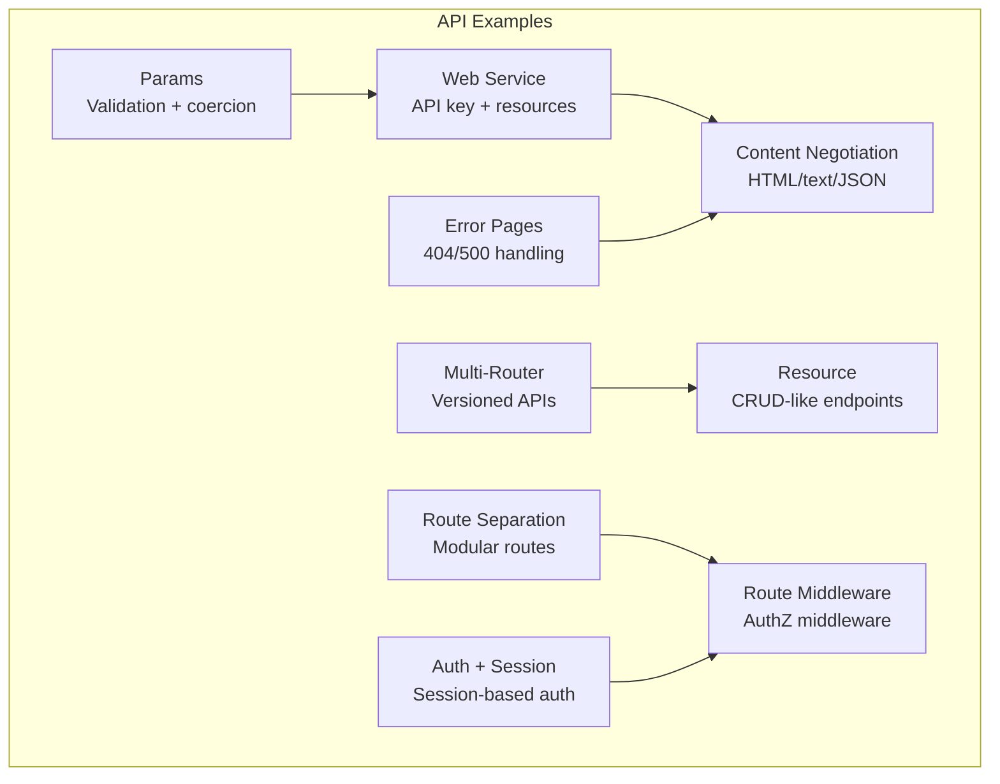
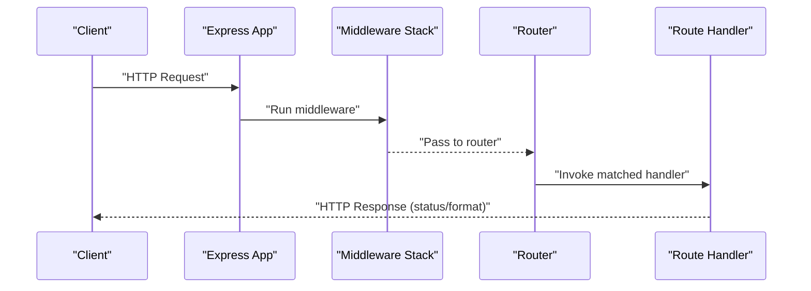
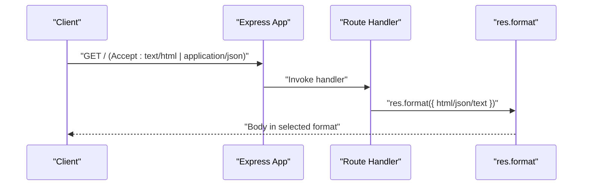
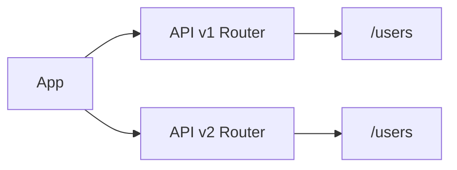
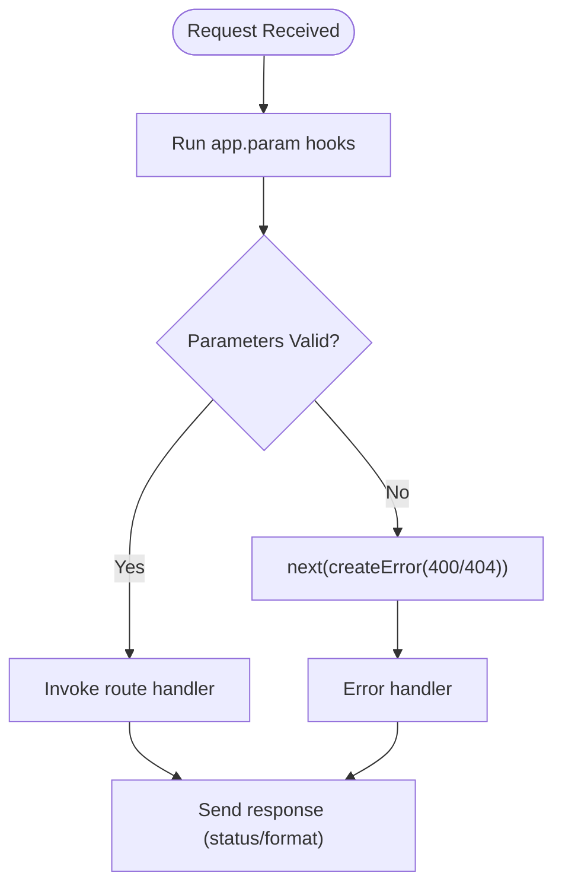
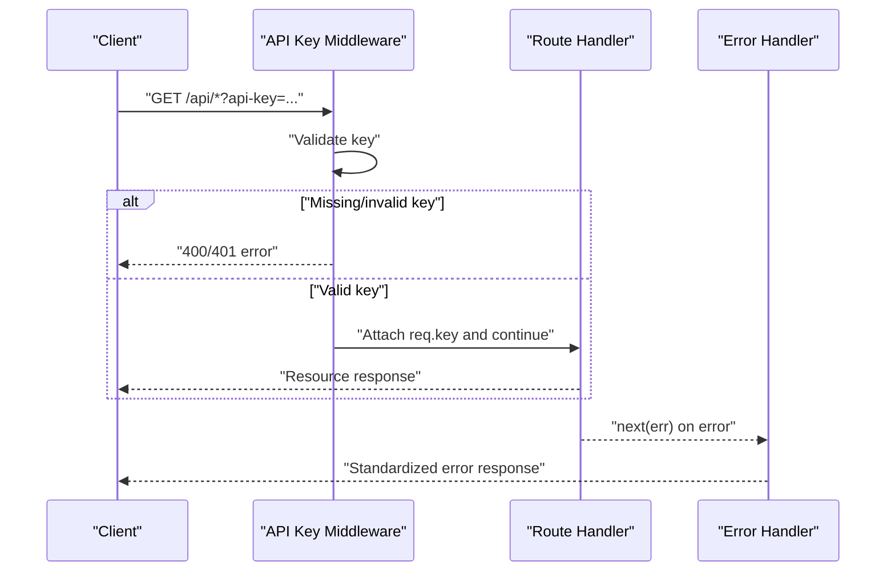

# API Development

<cite>
**Referenced Files in This Document**
- [examples/web-service/index.js](file://examples/web-service/index.js)
- [examples/content-negotiation/index.js](file://examples/content-negotiation/index.js)
- [examples/multi-router/controllers/api_v1.js](file://examples/multi-router/controllers/api_v1.js)
- [examples/multi-router/controllers/api_v2.js](file://examples/multi-router/controllers/api_v2.js)
- [examples/resource/index.js](file://examples/resource/index.js)
- [examples/route-separation/index.js](file://examples/route-separation/index.js)
- [examples/route-middleware/index.js](file://examples/route-middleware/index.js)
- [examples/error-pages/index.js](file://examples/error-pages/index.js)
- [examples/params/index.js](file://examples/params/index.js)
- [examples/auth/index.js](file://examples/auth/index.js)
- [examples/session/index.js](file://examples/session/index.js)
- [lib/application.js](file://lib/application.js)
- [lib/request.js](file://lib/request.js)
- [lib/response.js](file://lib/response.js)
- [package.json](file://package.json)
</cite>

## Table of Contents
1. [Introduction](#introduction)
2. [Project Structure](#project-structure)
3. [Core Components](#core-components)
4. [Architecture Overview](#architecture-overview)
5. [Detailed Component Analysis](#detailed-component-analysis)
6. [Dependency Analysis](#dependency-analysis)
7. [Performance Considerations](#performance-considerations)
8. [Troubleshooting Guide](#troubleshooting-guide)
9. [Conclusion](#conclusion)
10. [Appendices](#appendices)

## Introduction
This document provides a comprehensive guide to designing and implementing RESTful APIs with Express.js. It focuses on resource-based URLs, HTTP method semantics, status code usage, content negotiation, API versioning, endpoint documentation, consistency patterns, request validation, parameter handling, response formatting, CORS configuration, rate limiting, and security considerations for production-grade APIs. Practical examples are drawn from the repository’s examples to illustrate patterns and best practices.

## Project Structure
The repository organizes learning materials around focused examples that demonstrate key Express.js capabilities useful for API development:
- Web service example demonstrates API key validation, resource endpoints, and error handling.
- Content negotiation example shows how to respond in multiple formats (HTML, text, JSON).
- Multi-router example illustrates API versioning via separate routers.
- Resource example demonstrates a compact resource-style API with CRUD-like endpoints.
- Route separation example shows modular routing and middleware composition.
- Route middleware example demonstrates authentication and authorization middleware.
- Error pages example shows structured 404/500 handling with content negotiation.
- Params example shows parameter parsing and validation with custom param hooks.
- Auth and session examples demonstrate session-based authentication and protection.

**Section sources**
- [examples/web-service/index.js:1-118](file://examples/web-service/index.js#L1-L118)
- [examples/content-negotiation/index.js:1-47](file://examples/content-negotiation/index.js#L1-L47)
- [examples/multi-router/controllers/api_v1.js:1-16](file://examples/multi-router/controllers/api_v1.js#L1-L16)
- [examples/multi-router/controllers/api_v2.js:1-16](file://examples/multi-router/controllers/api_v2.js#L1-L16)
- [examples/resource/index.js:1-96](file://examples/resource/index.js#L1-L96)
- [examples/route-separation/index.js:1-56](file://examples/route-separation/index.js#L1-L56)
- [examples/route-middleware/index.js:1-91](file://examples/route-middleware/index.js#L1-L91)
- [examples/error-pages/index.js:1-104](file://examples/error-pages/index.js#L1-L104)
- [examples/params/index.js:1-75](file://examples/params/index.js#L1-L75)
- [examples/auth/index.js:1-135](file://examples/auth/index.js#L1-L135)
- [examples/session/index.js:1-38](file://examples/session/index.js#L1-L38)

## Core Components
- Application initialization and middleware pipeline: The application initializes default settings, sets up the router, and dispatches requests through the middleware chain.
- Request utilities: Provides helpers for content negotiation (accepts, acceptsEncodings, acceptsCharsets, acceptsLanguages) and other HTTP helpers.
- Response utilities: Provides helpers for status codes, content negotiation (res.format), JSON responses, redirects, and more.

Key responsibilities:
- RESTful routing: Define resource-based URLs and HTTP verbs (GET, POST, PUT, DELETE).
- Validation and parameter handling: Use param hooks and validation libraries to coerce and validate inputs.
- Content negotiation: Respond with appropriate formats based on Accept headers.
- Error handling: Centralized error handlers and 404 handling with content negotiation.
- Security: API key validation, session-based auth, and middleware-driven authorization.

**Section sources**
- [lib/application.js:59-178](file://lib/application.js#L59-L178)
- [lib/request.js:127-187](file://lib/request.js#L127-L187)
- [lib/response.js:64-200](file://lib/response.js#L64-L200)

## Architecture Overview
Express builds a request-response pipeline. Requests enter the application, traverse middleware stacks, and reach route handlers. Responses are sent via response utilities, with content negotiation and status code handling managed centrally.

**Diagram sources**
- [lib/application.js:152-178](file://lib/application.js#L152-L178)
- [lib/response.js:125-200](file://lib/response.js#L125-L200)

**Section sources**
- [lib/application.js:59-178](file://lib/application.js#L59-L178)
- [lib/request.js:127-187](file://lib/request.js#L127-L187)
- [lib/response.js:64-200](file://lib/response.js#L64-L200)

## Detailed Component Analysis

### RESTful API Design Principles
- Resource-based URLs: Use nouns to represent resources and collections. Examples include listing users and retrieving a specific user.
- HTTP method semantics: Use GET for retrieval, POST for creation, PUT/PATCH for updates, DELETE for removal.
- Proper status codes: Return semantically correct status codes (e.g., 200 OK, 201 Created, 400 Bad Request, 401 Unauthorized, 404 Not Found, 500 Internal Server Error).

Practical examples:
- Listing resources and nested resources with parameterized routes.
- Returning structured JSON responses and handling missing resources.

**Section sources**
- [examples/web-service/index.js:74-91](file://examples/web-service/index.js#L74-L91)
- [examples/resource/index.js:42-67](file://examples/resource/index.js#L42-L67)

### Content Negotiation
Implement content negotiation to support multiple response formats (HTML, text, JSON). Use res.format to select the appropriate representation based on the client’s Accept header.

Patterns:
- Inline res.format blocks per endpoint.
- Declarative wrapper middleware to centralize format selection.

**Diagram sources**
- [examples/content-negotiation/index.js:9-27](file://examples/content-negotiation/index.js#L9-L27)
- [examples/error-pages/index.js:63-77](file://examples/error-pages/index.js#L63-L77)

**Section sources**
- [examples/content-negotiation/index.js:9-41](file://examples/content-negotiation/index.js#L9-L41)
- [examples/error-pages/index.js:63-97](file://examples/error-pages/index.js#L63-L97)

### API Versioning Strategies
Version APIs by organizing routes under distinct paths or separate routers. The examples demonstrate mounting separate routers for different API versions.

Patterns:
- Mount separate express.Router instances under versioned prefixes (/api/v1, /api/v2).
- Keep versioned routes isolated and evolve independently.

**Diagram sources**
- [examples/multi-router/controllers/api_v1.js:5-15](file://examples/multi-router/controllers/api_v1.js#L5-L15)
- [examples/multi-router/controllers/api_v2.js:5-15](file://examples/multi-router/controllers/api_v2.js#L5-L15)

**Section sources**
- [examples/multi-router/controllers/api_v1.js:1-16](file://examples/multi-router/controllers/api_v1.js#L1-L16)
- [examples/multi-router/controllers/api_v2.js:1-16](file://examples/multi-router/controllers/api_v2.js#L1-L16)

### Endpoint Documentation and Consistency
Document endpoints by:
- Providing a root route that lists available endpoints and examples.
- Using consistent naming and structure across endpoints.
- Returning predictable response shapes (e.g., arrays for collections, objects for items).

Example: A root route enumerates available endpoints and formats.

**Section sources**
- [examples/resource/index.js:78-89](file://examples/resource/index.js#L78-L89)

### Request Validation, Parameter Handling, and Response Formatting Standards
- Validation and coercion: Use app.param hooks to validate and coerce parameters (e.g., converting numeric ranges).
- Error propagation: Throw or pass errors to next() to leverage centralized error handlers.
- Response formatting: Use res.status, res.json, res.send, and res.format consistently.

**Diagram sources**
- [examples/params/index.js:23-41](file://examples/params/index.js#L23-L41)
- [examples/error-pages/index.js:91-97](file://examples/error-pages/index.js#L91-L97)
- [lib/response.js:64-76](file://lib/response.js#L64-L76)

**Section sources**
- [examples/params/index.js:23-41](file://examples/params/index.js#L23-L41)
- [examples/error-pages/index.js:63-97](file://examples/error-pages/index.js#L63-L97)
- [lib/response.js:64-200](file://lib/response.js#L64-L200)

### API Key Validation and Security Considerations
- API key validation: Use middleware mounted on a protected prefix to validate keys and attach metadata to req.
- Error handling: Return appropriate status codes (e.g., 400 for missing key, 401 for invalid key).
- Authentication: Use sessions for user authentication and protect restricted routes.

**Diagram sources**
- [examples/web-service/index.js:30-42](file://examples/web-service/index.js#L30-L42)
- [examples/web-service/index.js:74-91](file://examples/web-service/index.js#L74-L91)
- [examples/web-service/index.js:98-103](file://examples/web-service/index.js#L98-L103)
- [examples/auth/index.js:75-82](file://examples/auth/index.js#L75-L82)

**Section sources**
- [examples/web-service/index.js:30-42](file://examples/web-service/index.js#L30-L42)
- [examples/web-service/index.js:74-103](file://examples/web-service/index.js#L74-L103)
- [examples/auth/index.js:75-128](file://examples/auth/index.js#L75-L128)

### CORS Configuration
- Configure CORS at the application level using middleware to set appropriate headers (e.g., Access-Control-Allow-Origin, Access-Control-Allow-Methods, Access-Control-Allow-Headers).
- Apply CORS middleware globally or per-route depending on requirements.

[No sources needed since this section provides general guidance]

### Rate Limiting
- Implement rate limiting using middleware to protect endpoints from abuse.
- Consider per-IP or per-API-key limits and integrate with external stores (e.g., Redis) for distributed environments.

[No sources needed since this section provides general guidance]

### Production API Security Considerations
- Input validation and sanitization: Validate and sanitize inputs using param hooks and validation libraries.
- Authentication and authorization: Enforce session-based or token-based auth; restrict actions by roles.
- Error handling: Avoid leaking sensitive information; use generic messages in production.
- Logging and monitoring: Log errors and suspicious activities; monitor response times and error rates.

**Section sources**
- [examples/params/index.js:23-41](file://examples/params/index.js#L23-L41)
- [examples/auth/index.js:75-128](file://examples/auth/index.js#L75-L128)
- [examples/error-pages/index.js:91-97](file://examples/error-pages/index.js#L91-L97)

## Dependency Analysis
Express depends on a set of core modules for HTTP handling, content negotiation, cookies, status codes, and more. These dependencies underpin the request/response utilities and middleware ecosystem.

```mermaid
graph TB
P["package.json"]
A["accepts"]
BP["body-parser"]
CD["content-disposition"]
CT["content-type"]
CK["cookie"]
CS["cookie-signature"]
DBG["debug"]
DEP["depd"]
EU["encodeurl"]
EH["escape-html"]
ET["etag"]
FH["finalhandler"]
FR["fresh"]
HE["http-errors"]
MD["merge-descriptors"]
MT["mime-types"]
OF["on-finished"]
ON["once"]
PU["parseurl"]
PA["proxy-addr"]
QS["qs"]
RP["range-parser"]
RT["router"]
SD["send"]
SS["serve-static"]
ST["statuses"]
TI["type-is"]
VA["vary"]
P --> A
P --> BP
P --> CD
P --> CT
P --> CK
P --> CS
P --> DBG
P --> DEP
P --> EU
P --> EH
P --> ET
P --> FH
P --> FR
P --> HE
P --> MD
P --> MT
P --> OF
P --> ON
P --> PU
P --> PA
P --> QS
P --> RP
P --> RT
P --> SD
P --> SS
P --> ST
P --> TI
P --> VA
```

**Diagram sources**
- [package.json:34-62](file://package.json#L34-L62)

**Section sources**
- [package.json:1-100](file://package.json#L1-L100)

## Performance Considerations
- Minimize synchronous work in middleware and route handlers.
- Use streaming for large responses and leverage compression where appropriate.
- Cache frequently accessed data and avoid unnecessary computations.
- Keep middleware stacks lean and ordered to reduce latency.

[No sources needed since this section provides general guidance]

## Troubleshooting Guide
Common issues and remedies:
- 404 handling: Ensure a final 404 handler uses res.format for consistent responses.
- Error propagation: Use next(err) with semantic status codes to trigger error handlers.
- Parameter validation: Fail fast with explicit errors for invalid parameters.
- Status code misuse: Validate status codes using res.status to ensure correctness.

**Section sources**
- [examples/error-pages/index.js:63-97](file://examples/error-pages/index.js#L63-L97)
- [examples/params/index.js:23-41](file://examples/params/index.js#L23-L41)
- [lib/response.js:64-76](file://lib/response.js#L64-L76)

## Conclusion
This guide outlined RESTful API design and implementation patterns using Express.js, grounded in practical examples from the repository. By adopting resource-based URLs, consistent HTTP semantics, robust validation, content negotiation, versioning strategies, and strong error handling, you can build reliable, maintainable, and secure APIs. Extend these patterns with CORS, rate limiting, and production hardening as needed.

## Appendices
- Additional modular routing and middleware composition patterns are demonstrated in the route separation and route middleware examples.

**Section sources**
- [examples/route-separation/index.js:1-56](file://examples/route-separation/index.js#L1-L56)
- [examples/route-middleware/index.js:1-91](file://examples/route-middleware/index.js#L1-L91)