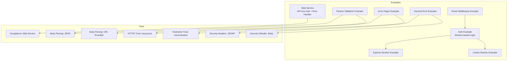
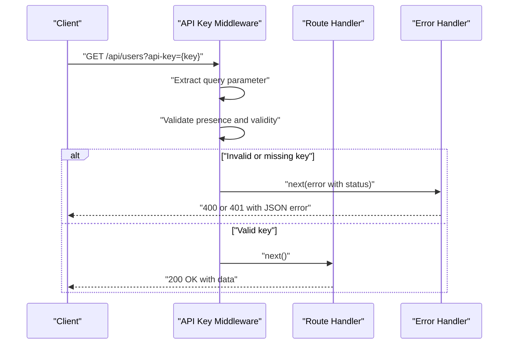
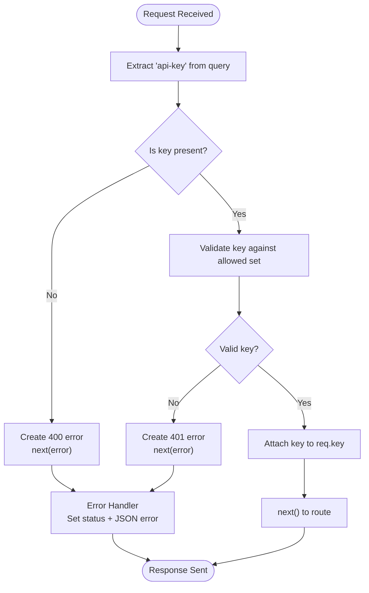
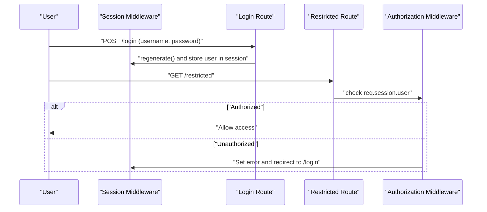
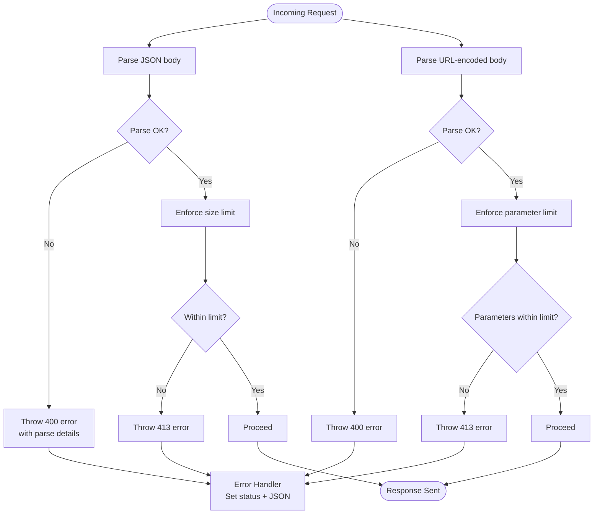
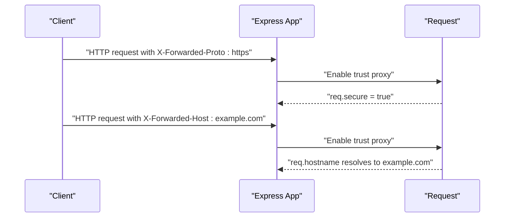
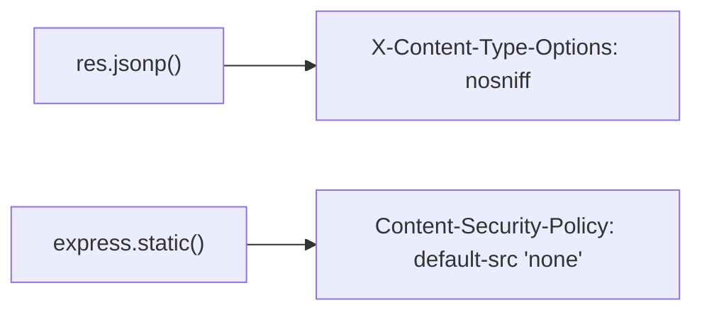
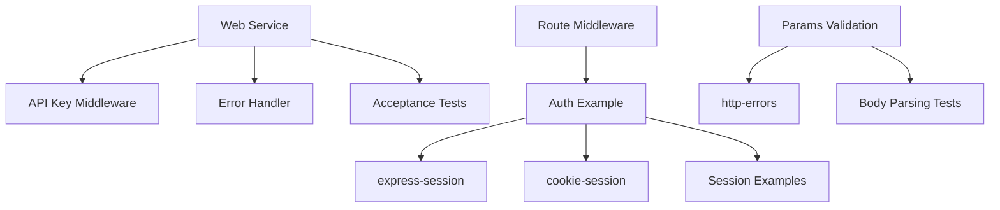

# API Security & Authentication

<cite>
**Referenced Files in This Document**
- [examples/web-service/index.js](file://examples/web-service/index.js)
- [test/acceptance/web-service.js](file://test/acceptance/web-service.js)
- [examples/auth/index.js](file://examples/auth/index.js)
- [examples/session/index.js](file://examples/session/index.js)
- [examples/cookie-sessions/index.js](file://examples/cookie-sessions/index.js)
- [examples/route-middleware/index.js](file://examples/route-middleware/index.js)
- [examples/params/index.js](file://examples/params/index.js)
- [examples/error-pages/index.js](file://examples/error-pages/index.js)
- [examples/error/index.js](file://examples/error/index.js)
- [test/express.json.js](file://test/express.json.js)
- [test/express.urlencoded.js](file://test/express.urlencoded.js)
- [test/req.secure.js](file://test/req.secure.js)
- [test/req.hostname.js](file://test/req.hostname.js)
- [test/res.jsonp.js](file://test/res.jsonp.js)
- [test/express.static.js](file://test/express.static.js)
</cite>

## Table of Contents
1. [Introduction](#introduction)
2. [Project Structure](#project-structure)
3. [Core Components](#core-components)
4. [Architecture Overview](#architecture-overview)
5. [Detailed Component Analysis](#detailed-component-analysis)
6. [Dependency Analysis](#dependency-analysis)
7. [Performance Considerations](#performance-considerations)
8. [Troubleshooting Guide](#troubleshooting-guide)
9. [Conclusion](#conclusion)
10. [Appendices](#appendices)

## Introduction
This document provides a comprehensive guide to API security and authentication in Express.js applications, grounded in the repository’s examples and tests. It covers:
- API key authentication via query parameters, middleware-based validation, and secure storage considerations
- Authentication middleware implementation, request validation, and unauthorized access handling
- Error handling for authentication failures with appropriate HTTP status codes (400, 401, 403) and standardized error response formats
- Security best practices including HTTPS enforcement, input validation, rate limiting considerations, and protections against common attacks
- Examples of API key validation middleware, error propagation patterns, and integration with session-based authentication
- CORS configuration for API endpoints, token-based authentication alternatives, and security headers implementation

## Project Structure
The repository organizes practical demonstrations and acceptance tests under examples and test directories. For API security and authentication, the most relevant materials are:
- Web service example demonstrating API key validation middleware and error handling
- Acceptance tests validating HTTP status codes for API key scenarios
- Session-based authentication example integrating express-session and cookie-session
- Route middleware example enforcing authorization rules
- Parameter parsing and validation examples using http-errors and built-in parsers
- Error pages and general error handling examples
- Tests covering HTTPS trust, security headers, and static defaults

**Diagram sources**
- [examples/web-service/index.js:1-118](file://examples/web-service/index.js#L1-L118)
- [test/acceptance/web-service.js:1-45](file://test/acceptance/web-service.js#L1-L45)
- [examples/auth/index.js:1-135](file://examples/auth/index.js#L1-L135)
- [examples/session/index.js:1-38](file://examples/session/index.js#L1-L38)
- [examples/cookie-sessions/index.js:1-26](file://examples/cookie-sessions/index.js#L1-L26)
- [examples/route-middleware/index.js:1-91](file://examples/route-middleware/index.js#L1-L91)
- [examples/params/index.js:1-75](file://examples/params/index.js#L1-L75)
- [examples/error-pages/index.js:1-104](file://examples/error-pages/index.js#L1-L104)
- [examples/error/index.js:1-54](file://examples/error/index.js#L1-L54)
- [test/express.json.js:92-446](file://test/express.json.js#L92-L446)
- [test/express.urlencoded.js:338-403](file://test/express.urlencoded.js#L338-L403)
- [test/req.secure.js:46-101](file://test/req.secure.js#L46-L101)
- [test/req.hostname.js:105-156](file://test/req.hostname.js#L105-L156)
- [test/res.jsonp.js:91-137](file://test/res.jsonp.js#L91-L137)
- [test/express.static.js:515-520](file://test/express.static.js#L515-L520)

**Section sources**
- [examples/web-service/index.js:1-118](file://examples/web-service/index.js#L1-L118)
- [examples/auth/index.js:1-135](file://examples/auth/index.js#L1-L135)
- [examples/session/index.js:1-38](file://examples/session/index.js#L1-L38)
- [examples/cookie-sessions/index.js:1-26](file://examples/cookie-sessions/index.js#L1-L26)
- [examples/route-middleware/index.js:1-91](file://examples/route-middleware/index.js#L1-L91)
- [examples/params/index.js:1-75](file://examples/params/index.js#L1-L75)
- [examples/error-pages/index.js:1-104](file://examples/error-pages/index.js#L1-L104)
- [examples/error/index.js:1-54](file://examples/error/index.js#L1-L54)
- [test/acceptance/web-service.js:1-45](file://test/acceptance/web-service.js#L1-L45)
- [test/express.json.js:92-446](file://test/express.json.js#L92-L446)
- [test/express.urlencoded.js:338-403](file://test/express.urlencoded.js#L338-L403)
- [test/req.secure.js:46-101](file://test/req.secure.js#L46-L101)
- [test/req.hostname.js:105-156](file://test/req.hostname.js#L105-L156)
- [test/res.jsonp.js:91-137](file://test/res.jsonp.js#L91-L137)
- [test/express.static.js:515-520](file://test/express.static.js#L515-L520)

## Core Components
- API key authentication middleware validates the presence and validity of an API key from the query string and attaches it to the request for downstream routes.
- Session-based authentication integrates express-session and cookie-session to manage user sessions and enforce access restrictions.
- Route middleware enforces authorization rules (self-access and role-based) using a placeholder authenticated user.
- Parameter parsing and validation demonstrate safe handling of JSON and URL-encoded bodies, including limits and error responses.
- Error handling demonstrates standardized error responses and status code propagation.

**Section sources**
- [examples/web-service/index.js:30-42](file://examples/web-service/index.js#L30-L42)
- [examples/web-service/index.js:98-111](file://examples/web-service/index.js#L98-L111)
- [examples/auth/index.js:75-82](file://examples/auth/index.js#L75-L82)
- [examples/session/index.js:16-20](file://examples/session/index.js#L16-L20)
- [examples/cookie-sessions/index.js:12-13](file://examples/cookie-sessions/index.js#L12-L13)
- [examples/route-middleware/index.js:25-58](file://examples/route-middleware/index.js#L25-L58)
- [examples/params/index.js:23-41](file://examples/params/index.js#L23-L41)
- [examples/error-pages/index.js:63-97](file://examples/error-pages/index.js#L63-L97)
- [examples/error/index.js:20-27](file://examples/error/index.js#L20-L27)

## Architecture Overview
The API key authentication pattern is mounted at a base path and applies to all sub-routes. The middleware validates the key, stores it on the request, and forwards control to the protected routes. Errors are propagated to a centralized error handler that sets appropriate status codes and response bodies.

**Diagram sources**
- [examples/web-service/index.js:30-42](file://examples/web-service/index.js#L30-L42)
- [examples/web-service/index.js:75-82](file://examples/web-service/index.js#L75-L82)
- [examples/web-service/index.js:98-111](file://examples/web-service/index.js#L98-L111)

**Section sources**
- [examples/web-service/index.js:25-42](file://examples/web-service/index.js#L25-L42)
- [examples/web-service/index.js:75-82](file://examples/web-service/index.js#L75-L82)
- [examples/web-service/index.js:98-111](file://examples/web-service/index.js#L98-L111)

## Detailed Component Analysis

### API Key Authentication Middleware
- Validates the presence of the API key in the query string and rejects missing keys with a 400 error.
- Checks the key against a predefined set and rejects invalid keys with a 401 error.
- Stores the validated key on the request object for route handlers.
- Centralized error handler responds with structured JSON error messages and appropriate status codes.

**Diagram sources**
- [examples/web-service/index.js:30-42](file://examples/web-service/index.js#L30-L42)
- [examples/web-service/index.js:98-111](file://examples/web-service/index.js#L98-L111)

**Section sources**
- [examples/web-service/index.js:30-42](file://examples/web-service/index.js#L30-L42)
- [examples/web-service/index.js:98-111](file://examples/web-service/index.js#L98-L111)
- [test/acceptance/web-service.js:7-21](file://test/acceptance/web-service.js#L7-L21)

### Session-Based Authentication and Authorization
- Uses express-session to maintain user sessions and regenerate sessions upon login to prevent fixation.
- Implements a restriction middleware to guard protected routes and redirect to login on failure.
- Demonstrates cookie-session as an alternative session mechanism.
- Route middleware enforces self-access and role-based authorization using a placeholder authenticated user.

**Diagram sources**
- [examples/auth/index.js:104-128](file://examples/auth/index.js#L104-L128)
- [examples/auth/index.js:75-82](file://examples/auth/index.js#L75-L82)
- [examples/session/index.js:16-20](file://examples/session/index.js#L16-L20)
- [examples/cookie-sessions/index.js:12-13](file://examples/cookie-sessions/index.js#L12-L13)
- [examples/route-middleware/index.js:25-58](file://examples/route-middleware/index.js#L25-L58)

**Section sources**
- [examples/auth/index.js:21-26](file://examples/auth/index.js#L21-L26)
- [examples/auth/index.js:75-82](file://examples/auth/index.js#L75-L82)
- [examples/auth/index.js:104-128](file://examples/auth/index.js#L104-L128)
- [examples/session/index.js:16-20](file://examples/session/index.js#L16-L20)
- [examples/cookie-sessions/index.js:12-13](file://examples/cookie-sessions/index.js#L12-L13)
- [examples/route-middleware/index.js:25-58](file://examples/route-middleware/index.js#L25-L58)

### Request Validation and Error Propagation
- Demonstrates parameter conversion and validation with custom error responses for invalid inputs.
- Shows robust JSON and URL-encoded body parsing with explicit limits and error handling.
- Centralized error handlers respond with appropriate status codes and content negotiation.

**Diagram sources**
- [examples/params/index.js:23-41](file://examples/params/index.js#L23-L41)
- [test/express.json.js:92-131](file://test/express.json.js#L92-L131)
- [test/express.json.js:121-131](file://test/express.json.js#L121-L131)
- [test/express.urlencoded.js:338-403](file://test/express.urlencoded.js#L338-L403)
- [examples/error-pages/index.js:63-97](file://examples/error-pages/index.js#L63-L97)
- [examples/error/index.js:20-27](file://examples/error/index.js#L20-L27)

**Section sources**
- [examples/params/index.js:23-41](file://examples/params/index.js#L23-L41)
- [test/express.json.js:92-131](file://test/express.json.js#L92-L131)
- [test/express.json.js:121-131](file://test/express.json.js#L121-L131)
- [test/express.urlencoded.js:338-403](file://test/express.urlencoded.js#L338-L403)
- [examples/error-pages/index.js:63-97](file://examples/error-pages/index.js#L63-L97)
- [examples/error/index.js:20-27](file://examples/error/index.js#L20-L27)

### HTTPS Enforcement and Proxy Trust
- Demonstrates how req.secure reflects HTTPS when trust-proxy is enabled and headers like X-Forwarded-Proto are set.
- Shows hostname resolution respecting X-Forwarded-Host with trust-proxy configured.

**Diagram sources**
- [test/req.secure.js:46-101](file://test/req.secure.js#L46-L101)
- [test/req.hostname.js:105-156](file://test/req.hostname.js#L105-L156)

**Section sources**
- [test/req.secure.js:46-101](file://test/req.secure.js#L46-L101)
- [test/req.hostname.js:105-156](file://test/req.hostname.js#L105-L156)

### Security Headers and Defaults
- JSONP responses include a security header to prevent MIME-type sniffing.
- Static serving includes a default Content-Security-Policy header.

**Diagram sources**
- [test/res.jsonp.js:116-127](file://test/res.jsonp.js#L116-L127)
- [test/express.static.js:515-520](file://test/express.static.js#L515-L520)

**Section sources**
- [test/res.jsonp.js:116-127](file://test/res.jsonp.js#L116-L127)
- [test/express.static.js:515-520](file://test/express.static.js#L515-L520)

## Dependency Analysis
The authentication and security patterns rely on:
- Middleware composition to validate requests and propagate errors
- Centralized error handlers to standardize responses
- Session management for user state persistence
- Body parsing middleware with configurable limits and verification hooks

**Diagram sources**
- [examples/web-service/index.js:30-42](file://examples/web-service/index.js#L30-L42)
- [examples/web-service/index.js:98-111](file://examples/web-service/index.js#L98-L111)
- [examples/auth/index.js:21-26](file://examples/auth/index.js#L21-L26)
- [examples/cookie-sessions/index.js:12-13](file://examples/cookie-sessions/index.js#L12-L13)
- [examples/route-middleware/index.js:25-58](file://examples/route-middleware/index.js#L25-L58)
- [examples/params/index.js:23-41](file://examples/params/index.js#L23-L41)
- [test/acceptance/web-service.js:1-45](file://test/acceptance/web-service.js#L1-L45)
- [examples/session/index.js:16-20](file://examples/session/index.js#L16-L20)
- [test/express.json.js:92-131](file://test/express.json.js#L92-L131)
- [test/express.urlencoded.js:338-403](file://test/express.urlencoded.js#L338-L403)

**Section sources**
- [examples/web-service/index.js:30-42](file://examples/web-service/index.js#L30-L42)
- [examples/web-service/index.js:98-111](file://examples/web-service/index.js#L98-L111)
- [examples/auth/index.js:21-26](file://examples/auth/index.js#L21-L26)
- [examples/cookie-sessions/index.js:12-13](file://examples/cookie-sessions/index.js#L12-L13)
- [examples/route-middleware/index.js:25-58](file://examples/route-middleware/index.js#L25-L58)
- [examples/params/index.js:23-41](file://examples/params/index.js#L23-L41)
- [test/acceptance/web-service.js:1-45](file://test/acceptance/web-service.js#L1-L45)
- [examples/session/index.js:16-20](file://examples/session/index.js#L16-L20)
- [test/express.json.js:92-131](file://test/express.json.js#L92-L131)
- [test/express.urlencoded.js:338-403](file://test/express.urlencoded.js#L338-L403)

## Performance Considerations
- Prefer in-memory or fast cache-backed key storage for API key validation to minimize latency.
- Use early exits in middleware to avoid unnecessary computations when keys are missing or invalid.
- Apply rate limiting at the gateway or middleware level to protect APIs from abuse.
- Configure body parser limits carefully to balance safety and usability.

[No sources needed since this section provides general guidance]

## Troubleshooting Guide
Common issues and resolutions:
- Missing API key: Ensure the query parameter is present and correctly named; expect a 400 error with a structured message.
- Invalid API key: Verify the key exists in the allowed set; expect a 401 error with a structured message.
- Session fixation: Regenerate sessions upon login to prevent session fixation attacks.
- Unauthorized access: Confirm authorization middleware is applied and that the authenticated user context is correctly populated.
- Body parsing errors: Validate content type and payload size; adjust limits and verification hooks as needed.

**Section sources**
- [examples/web-service/index.js:30-42](file://examples/web-service/index.js#L30-L42)
- [examples/web-service/index.js:98-111](file://examples/web-service/index.js#L98-L111)
- [examples/auth/index.js:108-121](file://examples/auth/index.js#L108-L121)
- [examples/route-middleware/index.js:36-58](file://examples/route-middleware/index.js#L36-L58)
- [test/express.json.js:92-131](file://test/express.json.js#L92-L131)
- [test/express.urlencoded.js:338-403](file://test/express.urlencoded.js#L338-L403)

## Conclusion
The repository demonstrates practical patterns for API security and authentication in Express.js:
- API key validation via middleware with clear error propagation
- Session-based authentication with secure session regeneration
- Robust request validation and error handling
- HTTPS trust and security headers for resilient deployments

These patterns provide a solid foundation for building secure APIs and can be extended with additional controls such as rate limiting, CORS configuration, and token-based authentication alternatives.

[No sources needed since this section summarizes without analyzing specific files]

## Appendices
- API key validation middleware path: [examples/web-service/index.js:30-42](file://examples/web-service/index.js#L30-L42)
- Error handler path: [examples/web-service/index.js:98-111](file://examples/web-service/index.js#L98-L111)
- Session-based authentication path: [examples/auth/index.js:75-82](file://examples/auth/index.js#L75-L82)
- Route authorization middleware path: [examples/route-middleware/index.js:36-58](file://examples/route-middleware/index.js#L36-L58)
- Parameter validation path: [examples/params/index.js:23-41](file://examples/params/index.js#L23-L41)
- HTTPS trust tests: [test/req.secure.js:46-101](file://test/req.secure.js#L46-L101), [test/req.hostname.js:105-156](file://test/req.hostname.js#L105-L156)
- Security headers tests: [test/res.jsonp.js:116-127](file://test/res.jsonp.js#L116-L127), [test/express.static.js:515-520](file://test/express.static.js#L515-L520)