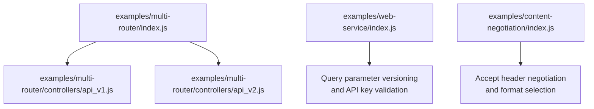
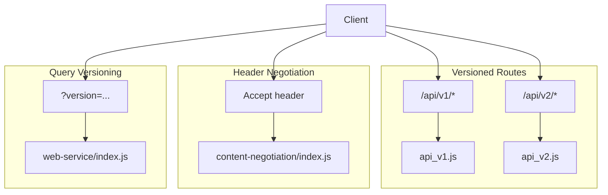
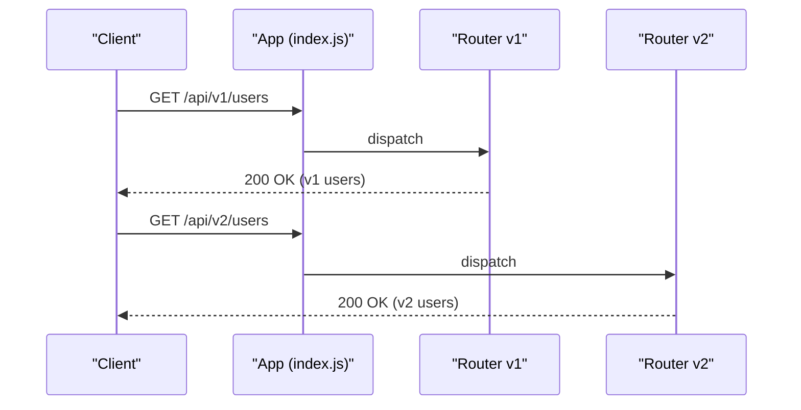
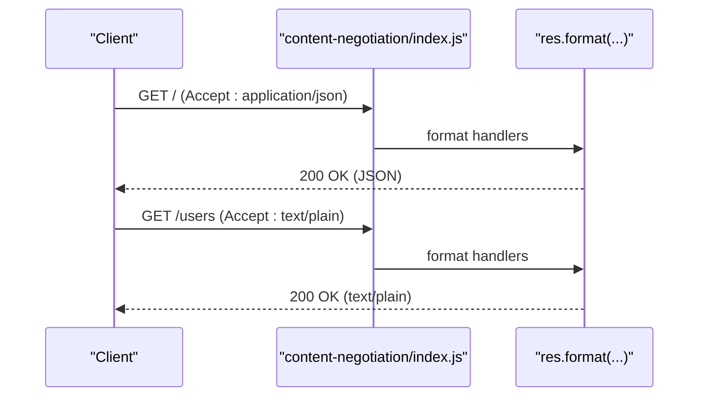
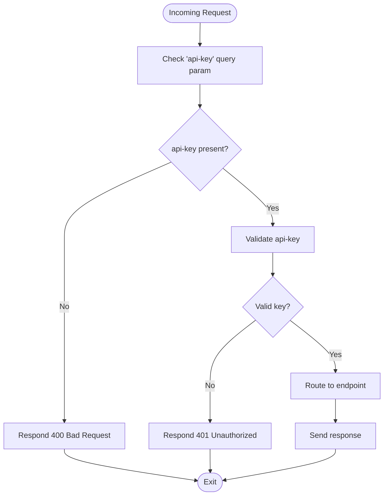
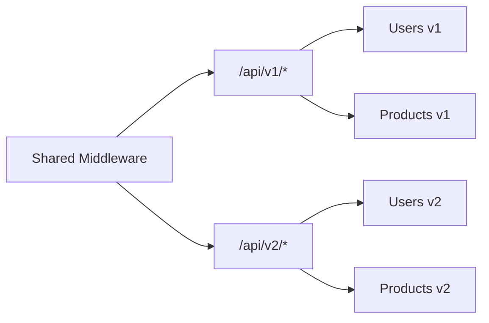
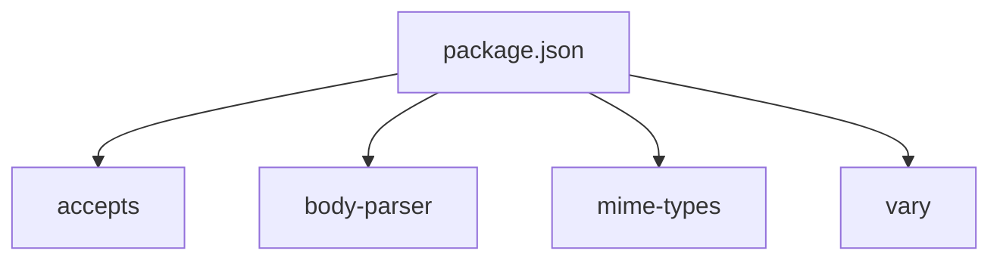

# API Versioning & Documentation

<cite>
**Referenced Files in This Document**
- [examples/multi-router/index.js](file://examples/multi-router/index.js)
- [examples/multi-router/controllers/api_v1.js](file://examples/multi-router/controllers/api_v1.js)
- [examples/multi-router/controllers/api_v2.js](file://examples/multi-router/controllers/api_v2.js)
- [examples/web-service/index.js](file://examples/web-service/index.js)
- [examples/content-negotiation/index.js](file://examples/content-negotiation/index.js)
- [test/acceptance/web-service.js](file://test/acceptance/web-service.js)
- [test/acceptance/content-negotiation.js](file://test/acceptance/content-negotiation.js)
- [test/res.format.js](file://test/res.format.js)
- [test/req.accepts.js](file://test/req.accepts.js)
- [package.json](file://package.json)
- [Readme.md](file://Readme.md)
</cite>

## Table of Contents
1. [Introduction](#introduction)
2. [Project Structure](#project-structure)
3. [Core Components](#core-components)
4. [Architecture Overview](#architecture-overview)
5. [Detailed Component Analysis](#detailed-component-analysis)
6. [Dependency Analysis](#dependency-analysis)
7. [Performance Considerations](#performance-considerations)
8. [Troubleshooting Guide](#troubleshooting-guide)
9. [Conclusion](#conclusion)
10. [Appendices](#appendices)

## Introduction
This document explains practical strategies for API versioning and documentation in Express.js using real examples from the repository. It covers:
- URL versioning (/api/v1/users)
- Header-based versioning (Accept media types)
- Query parameter versioning (?version=2)
- Version migration, backward compatibility, and deprecation policies
- Endpoint organization, router separation, and shared middleware
- Documentation practices and automated integration patterns

The goal is to provide a clear, actionable guide for evolving APIs safely while maintaining developer ergonomics and discoverability.

## Project Structure
The repository includes focused examples demonstrating versioning and content negotiation patterns:
- Multi-router example: separate routers mounted under distinct URL prefixes for different API versions
- Web service example: query parameter versioning and API key validation
- Content negotiation example: Accept header handling and response format selection

**Diagram sources**
- [examples/multi-router/index.js:1-19](file://examples/multi-router/index.js#L1-L19)
- [examples/multi-router/controllers/api_v1.js:1-16](file://examples/multi-router/controllers/api_v1.js#L1-L16)
- [examples/multi-router/controllers/api_v2.js:1-16](file://examples/multi-router/controllers/api_v2.js#L1-L16)
- [examples/web-service/index.js:1-118](file://examples/web-service/index.js#L1-L118)
- [examples/content-negotiation/index.js:1-47](file://examples/content-negotiation/index.js#L1-L47)

**Section sources**
- [examples/multi-router/index.js:1-19](file://examples/multi-router/index.js#L1-L19)
- [examples/web-service/index.js:1-118](file://examples/web-service/index.js#L1-L118)
- [examples/content-negotiation/index.js:1-47](file://examples/content-negotiation/index.js#L1-L47)

## Core Components
- URL versioning via mounted routers:
  - Mount versioned routes under distinct base paths (e.g., /api/v1, /api/v2)
  - Keep each version’s endpoints in its own controller/router module
- Header-based versioning via Accept negotiation:
  - Use res.format(...) to select response format based on Accept header
  - Validate Accept types and respond with appropriate content types
- Query parameter versioning:
  - Read version from query and route to appropriate handler logic
  - Combine with API key validation for access control

Key implementation references:
- URL versioning: [examples/multi-router/index.js:7-8](file://examples/multi-router/index.js#L7-L8), [examples/multi-router/controllers/api_v1.js:1-16](file://examples/multi-router/controllers/api_v1.js#L1-L16), [examples/multi-router/controllers/api_v2.js:1-16](file://examples/multi-router/controllers/api_v2.js#L1-L16)
- Header-based versioning: [examples/content-negotiation/index.js:9-27](file://examples/content-negotiation/index.js#L9-L27), [test/res.format.js:159-248](file://test/res.format.js#L159-L248), [test/req.accepts.js:52-125](file://test/req.accepts.js#L52-L125)
- Query parameter versioning: [examples/web-service/index.js:30-42](file://examples/web-service/index.js#L30-L42), [test/acceptance/web-service.js:1-45](file://test/acceptance/web-service.js#L1-L45)

**Section sources**
- [examples/multi-router/index.js:7-8](file://examples/multi-router/index.js#L7-L8)
- [examples/multi-router/controllers/api_v1.js:1-16](file://examples/multi-router/controllers/api_v1.js#L1-L16)
- [examples/multi-router/controllers/api_v2.js:1-16](file://examples/multi-router/controllers/api_v2.js#L1-L16)
- [examples/content-negotiation/index.js:9-27](file://examples/content-negotiation/index.js#L9-L27)
- [test/res.format.js:159-248](file://test/res.format.js#L159-L248)
- [test/req.accepts.js:52-125](file://test/req.accepts.js#L52-L125)
- [examples/web-service/index.js:30-42](file://examples/web-service/index.js#L30-L42)
- [test/acceptance/web-service.js:1-45](file://test/acceptance/web-service.js#L1-L45)

## Architecture Overview
The examples demonstrate three complementary strategies:
- URL versioning: clean separation of concerns per version
- Header-based versioning: flexible content negotiation
- Query parameter versioning: simple opt-in version selection

**Diagram sources**
- [examples/multi-router/index.js:7-8](file://examples/multi-router/index.js#L7-L8)
- [examples/multi-router/controllers/api_v1.js:1-16](file://examples/multi-router/controllers/api_v1.js#L1-L16)
- [examples/multi-router/controllers/api_v2.js:1-16](file://examples/multi-router/controllers/api_v2.js#L1-L16)
- [examples/content-negotiation/index.js:9-27](file://examples/content-negotiation/index.js#L9-L27)
- [examples/web-service/index.js:30-42](file://examples/web-service/index.js#L30-L42)

## Detailed Component Analysis

### URL Versioning Strategy
- Mount distinct routers under versioned base paths
- Keep each version self-contained with its own routes and middleware
- Encourage additive changes; avoid breaking changes in existing versions

**Diagram sources**
- [examples/multi-router/index.js:7-8](file://examples/multi-router/index.js#L7-L8)
- [examples/multi-router/controllers/api_v1.js:11-13](file://examples/multi-router/controllers/api_v1.js#L11-L13)
- [examples/multi-router/controllers/api_v2.js:11-13](file://examples/multi-router/controllers/api_v2.js#L11-L13)

**Section sources**
- [examples/multi-router/index.js:7-8](file://examples/multi-router/index.js#L7-L8)
- [examples/multi-router/controllers/api_v1.js:11-13](file://examples/multi-router/controllers/api_v1.js#L11-L13)
- [examples/multi-router/controllers/api_v2.js:11-13](file://examples/multi-router/controllers/api_v2.js#L11-L13)

### Header-Based Versioning (Accept Negotiation)
- Use res.format(...) to choose response format based on Accept header
- Define supported types and respond accordingly
- Default behavior when no match or missing Accept header

**Diagram sources**
- [examples/content-negotiation/index.js:9-27](file://examples/content-negotiation/index.js#L9-L27)
- [test/res.format.js:159-248](file://test/res.format.js#L159-L248)

**Section sources**
- [examples/content-negotiation/index.js:9-27](file://examples/content-negotiation/index.js#L9-L27)
- [test/res.format.js:159-248](file://test/res.format.js#L159-L248)
- [test/req.accepts.js:52-125](file://test/req.accepts.js#L52-L125)

### Query Parameter Versioning
- Validate presence and validity of API key
- Read version from query parameter and route to appropriate handler
- Respond with appropriate status codes for missing/invalid credentials

**Diagram sources**
- [examples/web-service/index.js:30-42](file://examples/web-service/index.js#L30-L42)
- [test/acceptance/web-service.js:1-45](file://test/acceptance/web-service.js#L1-L45)

**Section sources**
- [examples/web-service/index.js:30-42](file://examples/web-service/index.js#L30-L42)
- [examples/web-service/index.js:74-91](file://examples/web-service/index.js#L74-L91)
- [test/acceptance/web-service.js:1-45](file://test/acceptance/web-service.js#L1-L45)

### Endpoint Organization and Router Separation
- Separate concerns by organizing routes into dedicated modules
- Use shared middleware for cross-cutting concerns (authentication, logging)
- Maintain backward compatibility by keeping older versions mounted

**Diagram sources**
- [examples/multi-router/index.js:7-8](file://examples/multi-router/index.js#L7-L8)
- [examples/multi-router/controllers/api_v1.js:1-16](file://examples/multi-router/controllers/api_v1.js#L1-L16)
- [examples/multi-router/controllers/api_v2.js:1-16](file://examples/multi-router/controllers/api_v2.js#L1-L16)

**Section sources**
- [examples/multi-router/index.js:7-8](file://examples/multi-router/index.js#L7-L8)
- [examples/multi-router/controllers/api_v1.js:1-16](file://examples/multi-router/controllers/api_v1.js#L1-L16)
- [examples/multi-router/controllers/api_v2.js:1-16](file://examples/multi-router/controllers/api_v2.js#L1-L16)

### Backward Compatibility and Deprecation Policies
- Keep older versions mounted during a deprecation window
- Add warnings via headers or response metadata
- Provide migration guides and release notes
- Encourage additive changes and avoid breaking changes in existing versions

[No sources needed since this section provides general guidance]

### Breaking Changes Handling and Migration Guides
- Communicate breaking changes early with release notes
- Offer a timeline for deprecation and removal
- Provide automated migration scripts or tooling where possible
- Support rollback paths and hot-fix releases for critical issues

[No sources needed since this section provides general guidance]

### Client Communication Strategies for API Evolution
- Use deprecation headers and warning messages
- Maintain a changelog and version-specific documentation
- Provide SDK updates and migration tooling
- Offer support channels and community forums

[No sources needed since this section provides general guidance]

## Dependency Analysis
Express.js integrates several modules that support versioning and documentation:
- accepts: parses Accept headers for content negotiation
- body-parser: handles request bodies for JSON and form-encoded payloads
- mime-types: resolves content types for responses
- vary: sets Vary header to cache-friendly negotiation behavior

**Diagram sources**
- [package.json:34-62](file://package.json#L34-L62)

**Section sources**
- [package.json:34-62](file://package.json#L34-L62)

## Performance Considerations
- Prefer URL versioning for predictable routing and caching
- Use Accept negotiation judiciously; cache responses based on Vary headers
- Minimize middleware overhead by scoping middleware to versioned mounts
- Monitor response sizes and compress payloads where appropriate

[No sources needed since this section provides general guidance]

## Troubleshooting Guide
Common issues and resolutions:
- 400 Bad Request: Missing API key or invalid query parameter
  - Verify query parameter presence and format
  - Reference: [examples/web-service/index.js:30-42](file://examples/web-service/index.js#L30-L42), [test/acceptance/web-service.js:7-12](file://test/acceptance/web-service.js#L7-L12)
- 401 Unauthorized: Invalid API key
  - Confirm key against allowed set
  - Reference: [examples/web-service/index.js:36-37](file://examples/web-service/index.js#L36-L37), [test/acceptance/web-service.js:15-20](file://test/acceptance/web-service.js#L15-L20)
- 406 Not Acceptable: Unsupported Accept type
  - Ensure Accept header includes supported types
  - Reference: [test/res.format.js:239-247](file://test/res.format.js#L239-L247), [test/req.accepts.js:86-97](file://test/req.accepts.js#L86-L97)

**Section sources**
- [examples/web-service/index.js:30-42](file://examples/web-service/index.js#L30-L42)
- [test/acceptance/web-service.js:7-20](file://test/acceptance/web-service.js#L7-L20)
- [test/res.format.js:239-247](file://test/res.format.js#L239-L247)
- [test/req.accepts.js:86-97](file://test/req.accepts.js#L86-L97)

## Conclusion
The repository demonstrates three robust strategies for API versioning in Express.js:
- URL versioning for clear separation and long-term stability
- Header-based versioning for flexible content negotiation
- Query parameter versioning for simple opt-in version selection

Combine these with shared middleware, organized routers, and strong testing to evolve APIs safely and communicate changes effectively to clients.

[No sources needed since this section summarizes without analyzing specific files]

## Appendices
- Additional reading and resources
  - Website and documentation: [Readme.md:79-86](file://Readme.md#L79-L86)

**Section sources**
- [Readme.md:79-86](file://Readme.md#L79-L86)