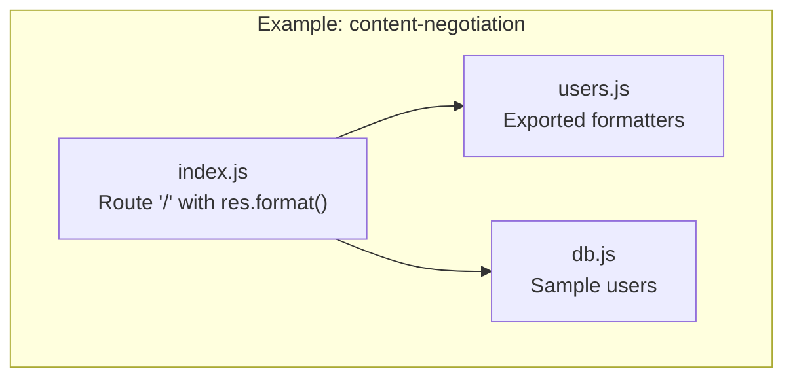
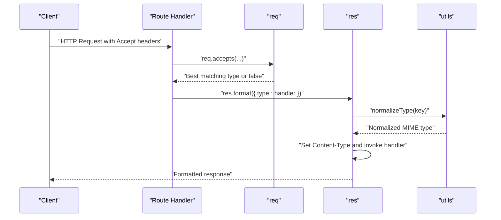
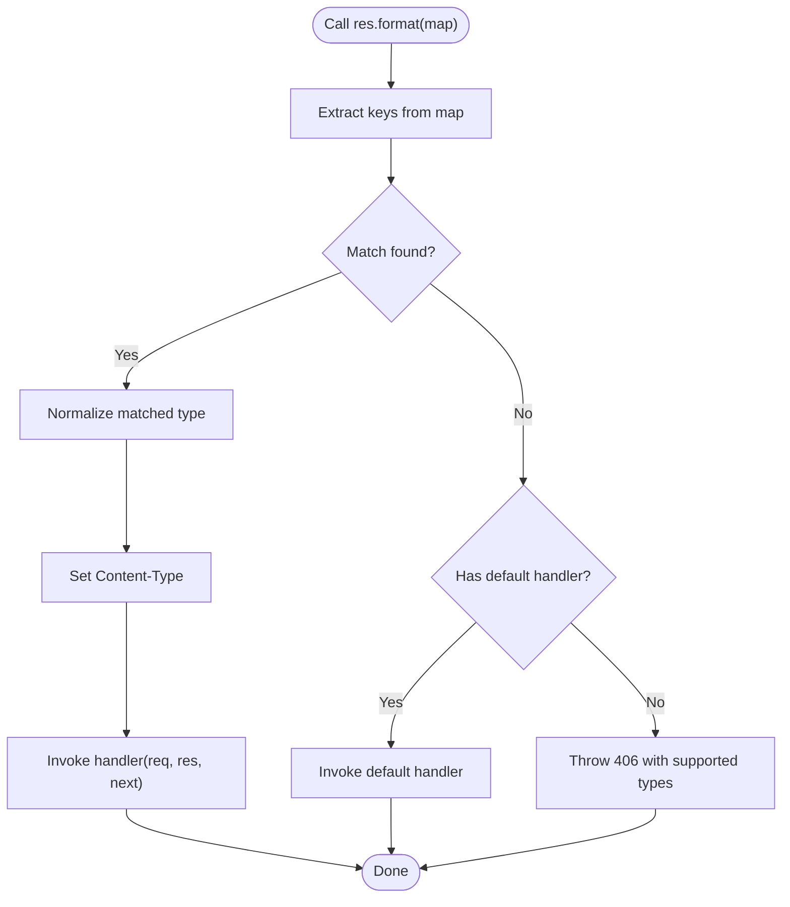
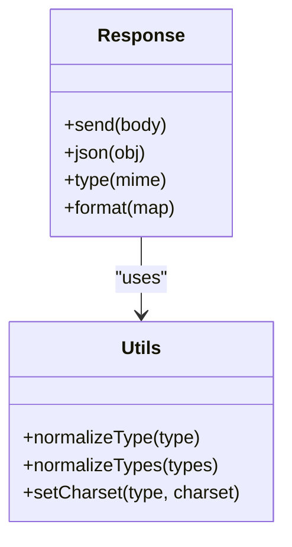
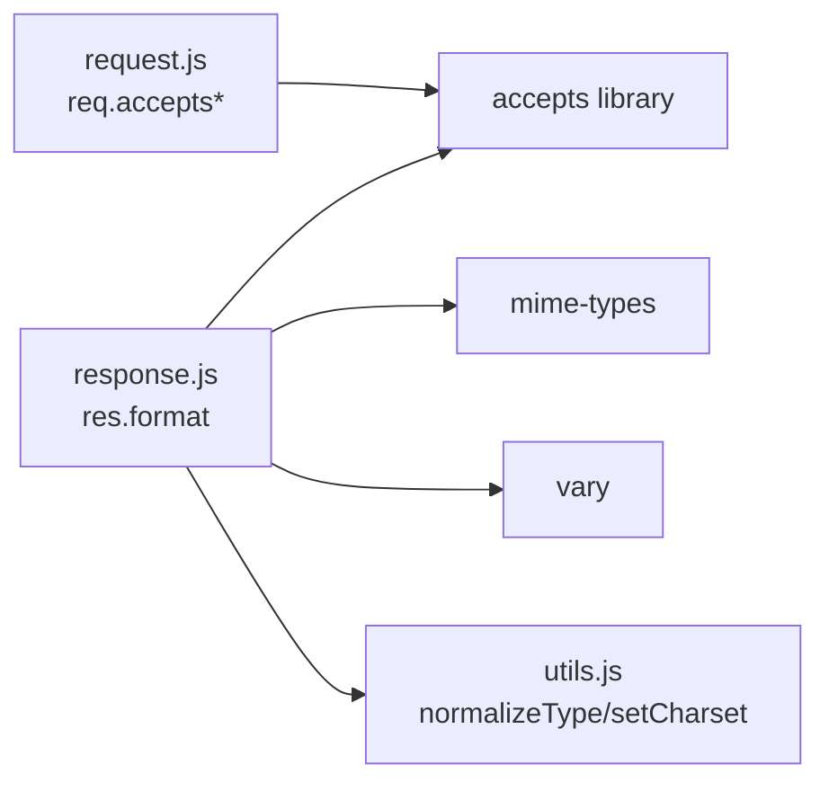

# Content Negotiation & Response Formats

<cite>
**Referenced Files in This Document**
- [index.js](file://examples/content-negotiation/index.js)
- [users.js](file://examples/content-negotiation/users.js)
- [db.js](file://examples/content-negotiation/db.js)
- [request.js](file://lib/request.js)
- [response.js](file://lib/response.js)
- [utils.js](file://lib/utils.js)
- [content-negotiation.js](file://test/acceptance/content-negotiation.js)
- [res.format.js](file://test/res.format.js)
- [req.accepts.js](file://test/req.accepts.js)
- [req.acceptsCharsets.js](file://test/req.acceptsCharsets.js)
- [req.acceptsEncodings.js](file://test/req.acceptsEncodings.js)
- [req.acceptsLanguages.js](file://test/req.acceptsLanguages.js)
- [res.send.js](file://test/res.send.js)
</cite>

## Table of Contents
1. [Introduction](#introduction)
2. [Project Structure](#project-structure)
3. [Core Components](#core-components)
4. [Architecture Overview](#architecture-overview)
5. [Detailed Component Analysis](#detailed-component-analysis)
6. [Dependency Analysis](#dependency-analysis)
7. [Performance Considerations](#performance-considerations)
8. [Troubleshooting Guide](#troubleshooting-guide)
9. [Conclusion](#conclusion)

## Introduction
This document explains how Express.js performs automatic content negotiation and how to implement custom response formats. It covers:
- Automatic detection of preferred content types using Accept headers
- MIME type handling and response format selection
- The accepts() family of methods for client preference evaluation
- Manual content negotiation using res.format()
- Response methods for different content types (res.json(), res.send(), res.type())
- Practical examples from the content-negotiation example
- Caching implications, performance considerations, and browser compatibility

## Project Structure
The content negotiation example resides under examples/content-negotiation and demonstrates:
- A simple route that negotiates response formats automatically
- A reusable formatter module exporting separate handlers for HTML, text, and JSON
- A shared database module providing sample data

**Diagram sources**
- [index.js:1-47](file://examples/content-negotiation/index.js#L1-L47)
- [users.js:1-20](file://examples/content-negotiation/users.js#L1-L20)
- [db.js:1-10](file://examples/content-negotiation/db.js#L1-L10)

**Section sources**
- [index.js:1-47](file://examples/content-negotiation/index.js#L1-L47)
- [users.js:1-20](file://examples/content-negotiation/users.js#L1-L20)
- [db.js:1-10](file://examples/content-negotiation/db.js#L1-L10)

## Core Components
- Automatic content negotiation via Accept headers:
  - req.accepts(), req.acceptsEncodings(), req.acceptsCharsets(), req.acceptsLanguages()
- Manual content negotiation:
  - res.format() with a map of MIME types to formatter functions
- Response methods:
  - res.json(), res.send(), res.type()

These capabilities are implemented in the request and response prototypes and supported by utility functions for MIME normalization and charset handling.

**Section sources**
- [request.js:127-187](file://lib/request.js#L127-L187)
- [response.js:569-594](file://lib/response.js#L569-L594)
- [utils.js:61-77](file://lib/utils.js#L61-L77)

## Architecture Overview
The content negotiation flow integrates request parsing, Accept header evaluation, and response formatting.

**Diagram sources**
- [request.js:127-187](file://lib/request.js#L127-L187)
- [response.js:569-594](file://lib/response.js#L569-L594)
- [utils.js:61-77](file://lib/utils.js#L61-L77)

## Detailed Component Analysis

### Automatic Content Type Detection Using Accept Headers
Express exposes convenience methods on the request object to evaluate client preferences:
- req.accepts(): evaluates media types
- req.acceptsEncodings(): evaluates compression encodings
- req.acceptsCharsets(): evaluates character sets
- req.acceptsLanguages(): evaluates languages

Implementation highlights:
- These methods delegate to the accepts library and return the best match or false
- They support wildcards, quality values, and extension names
- When Accept is not present, certain methods may return the first candidate

Practical usage patterns:
- Use req.accepts() to decide which formatter to invoke
- Combine with res.format() for a declarative approach
- Use req.acceptsEncodings() to conditionally compress responses

**Section sources**
- [request.js:127-187](file://lib/request.js#L127-L187)
- [req.accepts.js:1-126](file://test/req.accepts.js#L1-L126)
- [req.acceptsEncodings.js:1-40](file://test/req.acceptsEncodings.js#L1-L40)
- [req.acceptsCharsets.js:1-64](file://test/req.acceptsCharsets.js#L1-L64)
- [req.acceptsLanguages.js:1-58](file://test/req.acceptsLanguages.js#L1-L58)

### MIME Type Handling and Response Format Selection
Express normalizes MIME types and sets Content-Type appropriately:
- normalizeType() converts extension names to canonical MIME types
- normalizeTypes() normalizes arrays of types
- setCharset() ensures charset is included in Content-Type when applicable

Behavior:
- If no Content-Type is set, res.send() defaults to text/html for strings and application/json for objects
- res.json() sets application/json and delegates to res.send()
- res.type() expands short names to full MIME types using mime-types

**Section sources**
- [utils.js:61-77](file://lib/utils.js#L61-L77)
- [utils.js:225-238](file://lib/utils.js#L225-L238)
- [response.js:125-218](file://lib/response.js#L125-L218)
- [response.js:232-246](file://lib/response.js#L232-L246)
- [response.js:504-510](file://lib/response.js#L504-L510)

### Manual Content Negotiation Using res.format()
res.format() selects a response handler based on Accept headers:
- Accepts a map of MIME types (or extensions) to formatter functions
- Uses req.accepts() internally to pick the best match
- Sets Content-Type to the normalized type and invokes the handler
- Adds Vary: Accept to inform caches about the negotiated content
- If no match, triggers a 406 Not Acceptable error or calls a default handler if provided

Example patterns:
- Route-level negotiation with res.format()
- Reusable formatter modules exporting handlers for html, text, json

**Diagram sources**
- [response.js:569-594](file://lib/response.js#L569-L594)
- [utils.js:61-77](file://lib/utils.js#L61-L77)

**Section sources**
- [response.js:569-594](file://lib/response.js#L569-L594)
- [res.format.js:1-249](file://test/res.format.js#L1-L249)

### Response Methods for Different Content Types
- res.send():
  - Detects body type and sets Content-Type accordingly
  - Applies charset handling and ETag generation
  - Honors HEAD semantics and status-specific rules (e.g., 204/304)
- res.json():
  - Serializes object bodies and sets application/json
  - Delegates to res.send()
- res.type()/contentType():
  - Expands short names to full MIME types
  - Ensures charset is included when applicable

**Diagram sources**
- [response.js:125-218](file://lib/response.js#L125-L218)
- [response.js:232-246](file://lib/response.js#L232-L246)
- [response.js:504-510](file://lib/response.js#L504-L510)
- [response.js:569-594](file://lib/response.js#L569-L594)
- [utils.js:61-77](file://lib/utils.js#L61-L77)
- [utils.js:225-238](file://lib/utils.js#L225-L238)

**Section sources**
- [response.js:125-218](file://lib/response.js#L125-L218)
- [response.js:232-246](file://lib/response.js#L232-L246)
- [response.js:504-510](file://lib/response.js#L504-L510)
- [response.js:569-594](file://lib/response.js#L569-L594)
- [res.send.js:1-570](file://test/res.send.js#L1-L570)

### Practical Examples from the Content-Negotiation Example
The example demonstrates:
- Automatic negotiation with Accept headers for text/html, text/plain, and application/json
- A reusable formatter module exporting handlers for each format
- A middleware wrapper to apply the same formatter map across routes

Key behaviors validated by tests:
- Default to text/html when Accept is not present
- Respect Accept: text/plain and application/json
- Set correct Content-Type and charset for each format
- Vary: Accept header is set
- 406 Not Acceptable when no match

**Section sources**
- [index.js:1-47](file://examples/content-negotiation/index.js#L1-L47)
- [users.js:1-20](file://examples/content-negotiation/users.js#L1-L20)
- [db.js:1-10](file://examples/content-negotiation/db.js#L1-L10)
- [content-negotiation.js:1-50](file://test/acceptance/content-negotiation.js#L1-L50)
- [res.format.js:182-249](file://test/res.format.js#L182-L249)

## Dependency Analysis
Content negotiation relies on:
- accepts library for parsing Accept headers and evaluating quality values
- mime-types for MIME type expansion and lookup
- vary for cache control headers
- internal utilities for normalization and charset handling

**Diagram sources**
- [request.js:16-23](file://lib/request.js#L16-L23)
- [response.js:22-35](file://lib/response.js#L22-L35)
- [utils.js:18-22](file://lib/utils.js#L18-L22)

**Section sources**
- [request.js:16-23](file://lib/request.js#L16-L23)
- [response.js:22-35](file://lib/response.js#L22-L35)
- [utils.js:18-22](file://lib/utils.js#L18-L22)

## Performance Considerations
- Prefer res.format() for centralized negotiation logic to avoid repeated Accept parsing
- Use req.accepts() to short-circuit decisions early when possible
- Leverage caching headers (Vary: Accept) to prevent cache poisoning
- Avoid unnecessary conversions:
  - res.json() for objects, res.send() for buffers or strings
  - Set Content-Type explicitly when known to bypass detection overhead
- Consider compression:
  - Use req.acceptsEncodings() to select gzip/deflate when supported

[No sources needed since this section provides general guidance]

## Troubleshooting Guide
Common issues and resolutions:
- 406 Not Acceptable:
  - Occurs when no Accept match is found
  - Provide a default handler or adjust supported types
  - Verify Accept header syntax and quality values
- Incorrect Content-Type:
  - Ensure res.type() or Content-Type is set appropriately
  - Confirm charset handling via setCharset
- Caching confusion:
  - Vary: Accept is set automatically by res.format()
  - Ensure cache keys include Accept to avoid serving wrong format
- Charset mismatches:
  - res.send() applies charset to text-like responses
  - For binary responses, preserve explicit charset in Content-Type

**Section sources**
- [res.format.js:224-249](file://test/res.format.js#L224-L249)
- [res.send.js:99-136](file://test/res.send.js#L99-L136)
- [response.js:569-594](file://lib/response.js#L569-L594)

## Conclusion
Express provides robust, standards-compliant content negotiation through Accept headers and a flexible res.format() mechanism. By combining req.accepts() family methods with res.format(), you can implement declarative, cache-aware, and browser-compatible response formatting. Use the provided utilities for MIME normalization and charset handling, and follow the example patterns to build scalable APIs that adapt to client preferences.