# RESTful API Design Principles

<cite>
**Referenced Files in This Document**
- [index.js](file://examples/resource/index.js)
- [index.js](file://examples/web-service/index.js)
- [index.js](file://examples/multi-router/controllers/api_v1.js)
- [index.js](file://examples/multi-router/controllers/api_v2.js)
- [index.js](file://examples/route-separation/index.js)
- [index.js](file://examples/route-separation/user.js)
- [index.js](file://examples/route-separation/post.js)
- [index.js](file://examples/content-negotiation/index.js)
- [index.js](file://examples/error-pages/index.js)
- [index.js](file://examples/error/index.js)
- [index.js](file://examples/params/index.js)
- [index.js](file://examples/mvc/index.js)
- [index.js](file://examples/mvc/db.js)
- [index.js](file://examples/mvc/controllers/user/index.js)
- [index.js](file://examples/mvc/controllers/pet/index.js)
- [index.js](file://examples/mvc/controllers/main/index.js)
- [express.js](file://lib/express.js)
- [application.js](file://lib/application.js)
</cite>

## Table of Contents
1. [Introduction](#introduction)
2. [Project Structure](#project-structure)
3. [Core Components](#core-components)
4. [Architecture Overview](#architecture-overview)
5. [Detailed Component Analysis](#detailed-component-analysis)
6. [Dependency Analysis](#dependency-analysis)
7. [Performance Considerations](#performance-considerations)
8. [Troubleshooting Guide](#troubleshooting-guide)
9. [Conclusion](#conclusion)

## Introduction
This document presents RESTful API design principles implemented in Express.js using concrete examples from the repository. It covers resource-based URL design, HTTP method semantics (GET, POST, PUT, DELETE), proper resource naming, REST architectural constraints (statelessness, cacheability, layered system, uniform interface), resource representation patterns, URI design best practices, hierarchical resource organization, HTTP status code usage, error handling, idempotency, and discoverability via hypermedia controls.

## Project Structure
The repository organizes examples by concept: resource routing, web service scaffolding, multi-version APIs, route separation, content negotiation, error handling, parameter parsing, and MVC-style controllers. These demonstrate how to structure routes and controllers to align with REST constraints and best practices.

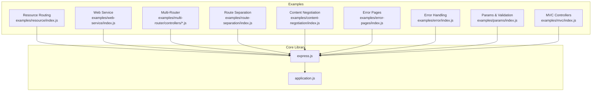

**Diagram sources**
- [express.js:1-82](file://lib/express.js#L1-L82)
- [application.js:1-632](file://lib/application.js#L1-L632)
- [index.js](file://examples/resource/index.js)
- [index.js](file://examples/web-service/index.js)
- [index.js](file://examples/multi-router/controllers/api_v1.js)
- [index.js](file://examples/multi-router/controllers/api_v2.js)
- [index.js](file://examples/route-separation/index.js)
- [index.js](file://examples/content-negotiation/index.js)
- [index.js](file://examples/error-pages/index.js)
- [index.js](file://examples/error/index.js)
- [index.js](file://examples/params/index.js)
- [index.js](file://examples/mvc/index.js)

**Section sources**
- [express.js:1-82](file://lib/express.js#L1-L82)
- [application.js:1-632](file://lib/application.js#L1-L632)

## Core Components
- Resource-based routing: Demonstrated by a custom resource method and built-in HTTP verbs to model collections and individual resources.
- Content negotiation: Using Accept headers to deliver appropriate representations.
- Error handling: Centralized error middleware and explicit status codes for client and server errors.
- Parameter parsing and validation: Using app.param to convert and validate path parameters.
- Multi-version APIs: Organizing routes under versioned namespaces.
- Route separation: Splitting concerns across modules for maintainability.
- MVC-style controllers: Structuring request handling with before hooks and CRUD actions.

**Section sources**
- [index.js](file://examples/resource/index.js)
- [index.js](file://examples/web-service/index.js)
- [index.js](file://examples/content-negotiation/index.js)
- [index.js](file://examples/error-pages/index.js)
- [index.js](file://examples/error/index.js)
- [index.js](file://examples/params/index.js)
- [index.js](file://examples/multi-router/controllers/api_v1.js)
- [index.js](file://examples/multi-router/controllers/api_v2.js)
- [index.js](file://examples/route-separation/index.js)
- [index.js](file://examples/mvc/index.js)

## Architecture Overview
The examples illustrate a layered approach:
- Application bootstrap and middleware setup
- Versioned API routing
- Resource routing with HTTP verbs
- Content negotiation and error handling
- Parameter parsing and validation
- MVC-style controller pattern

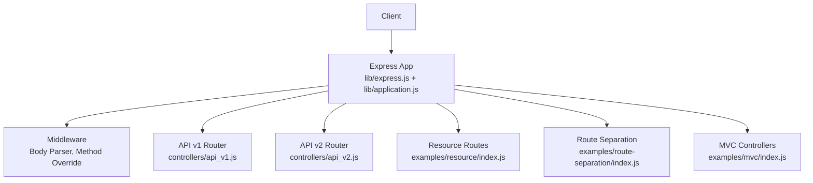

**Diagram sources**
- [express.js:1-82](file://lib/express.js#L1-L82)
- [application.js:1-632](file://lib/application.js#L1-L632)
- [index.js](file://examples/multi-router/controllers/api_v1.js)
- [index.js](file://examples/multi-router/controllers/api_v2.js)
- [index.js](file://examples/resource/index.js)
- [index.js](file://examples/route-separation/index.js)
- [index.js](file://examples/mvc/index.js)

## Detailed Component Analysis

### Resource-Based URL Design and HTTP Methods
- Collections and individual resources:
  - GET /users lists all users.
  - GET /users/:id retrieves a specific user.
  - DELETE /users/:id removes a user.
  - Range queries and format negotiation are supported via custom routes.
- Idempotency:
  - GET, PUT, DELETE are designed to be idempotent; repeated identical requests should have the same effect.
  - POST is intentionally non-idempotent for resource creation.

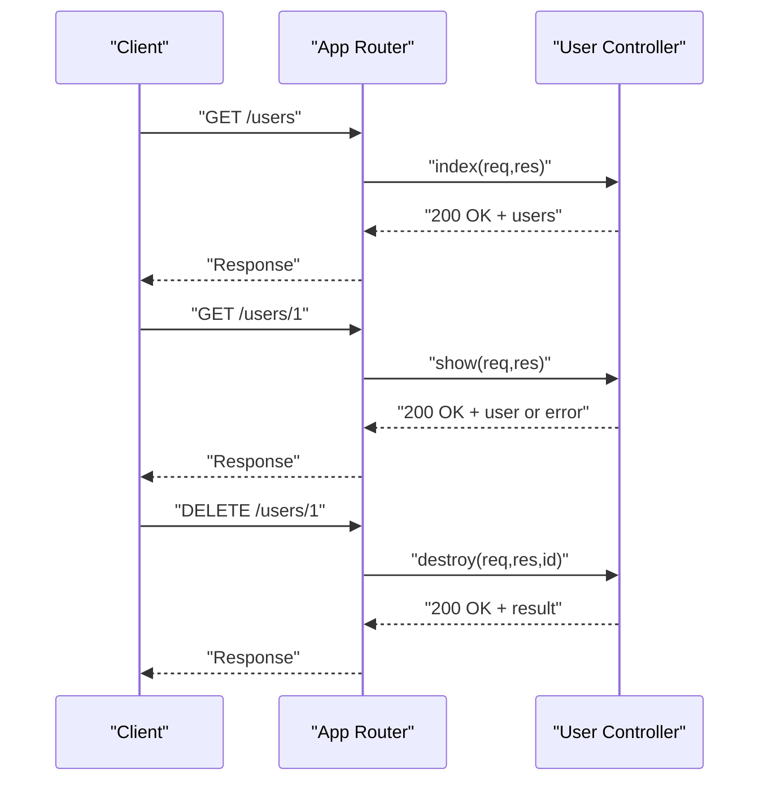

**Diagram sources**
- [index.js](file://examples/resource/index.js)

**Section sources**
- [index.js](file://examples/resource/index.js)

### URI Design Best Practices and Hierarchical Organization
- Use plural nouns for resource collections (/users).
- Use hierarchical paths for relationships (/api/user/:name/repos).
- Keep URIs stable and versioned (/api/v1, /api/v2).
- Use query parameters for filtering/sorting when appropriate.

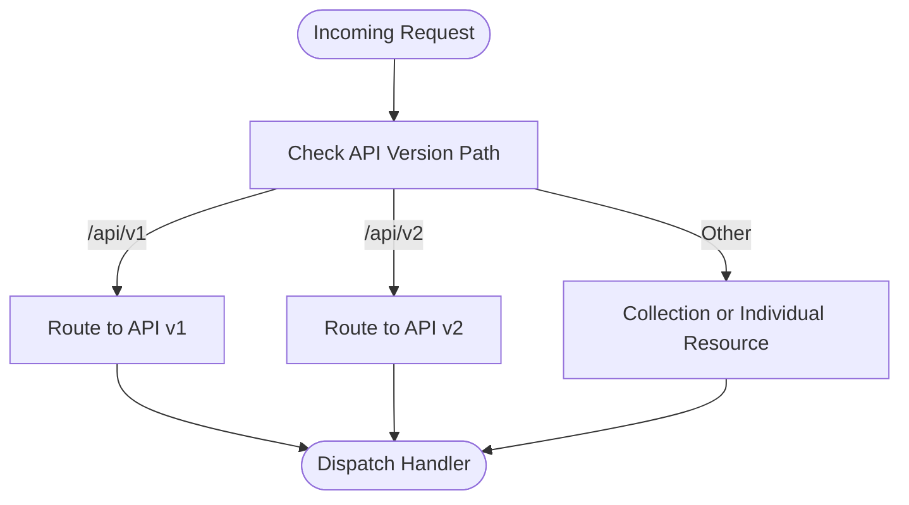

**Diagram sources**
- [index.js](file://examples/multi-router/controllers/api_v1.js)
- [index.js](file://examples/multi-router/controllers/api_v2.js)
- [index.js](file://examples/web-service/index.js)

**Section sources**
- [index.js](file://examples/multi-router/controllers/api_v1.js)
- [index.js](file://examples/multi-router/controllers/api_v2.js)
- [index.js](file://examples/web-service/index.js)

### Resource Representation Patterns and Content Negotiation
- Support multiple representations (JSON, HTML) using content negotiation.
- Use Accept headers to choose the appropriate formatter.

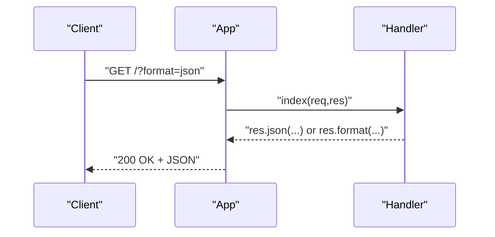

**Diagram sources**
- [index.js](file://examples/content-negotiation/index.js)

**Section sources**
- [index.js](file://examples/content-negotiation/index.js)

### HTTP Status Codes and Proper Error Responses
- Use explicit status codes for client errors (400, 401, 404) and server errors (500).
- Centralize error handling with error-handling middleware.
- Return structured error payloads.

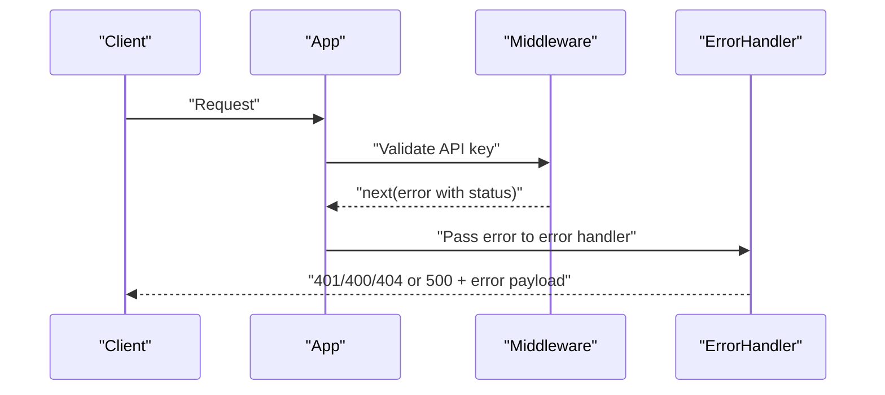

**Diagram sources**
- [index.js](file://examples/web-service/index.js)
- [index.js](file://examples/error-pages/index.js)
- [index.js](file://examples/error/index.js)

**Section sources**
- [index.js](file://examples/web-service/index.js)
- [index.js](file://examples/error-pages/index.js)
- [index.js](file://examples/error/index.js)

### Idempotent vs Non-Idempotent Operations
- Idempotent:
  - GET: Retrieve resource(s)
  - PUT/PATCH: Replace/update resource
  - DELETE: Remove resource
- Non-idempotent:
  - POST: Create new resource

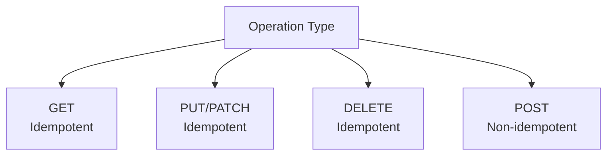

**Diagram sources**
- [index.js](file://examples/resource/index.js)
- [index.js](file://examples/route-separation/index.js)

**Section sources**
- [index.js](file://examples/resource/index.js)
- [index.js](file://examples/route-separation/index.js)

### Resource Linking and Hypermedia Controls
- Build discoverable APIs by returning links to related resources.
- Use hierarchical routes to imply relationships (/api/user/:name/repos).
- Provide navigable entry points and consistent link formats.

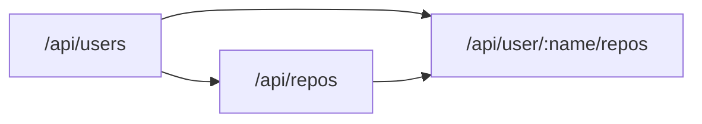

**Diagram sources**
- [index.js](file://examples/web-service/index.js)

**Section sources**
- [index.js](file://examples/web-service/index.js)

### Parameter Parsing, Validation, and Typed Conversion
- Use app.param to convert and validate parameters (e.g., integers, user lookup).
- Return appropriate errors (400/404) for invalid inputs.

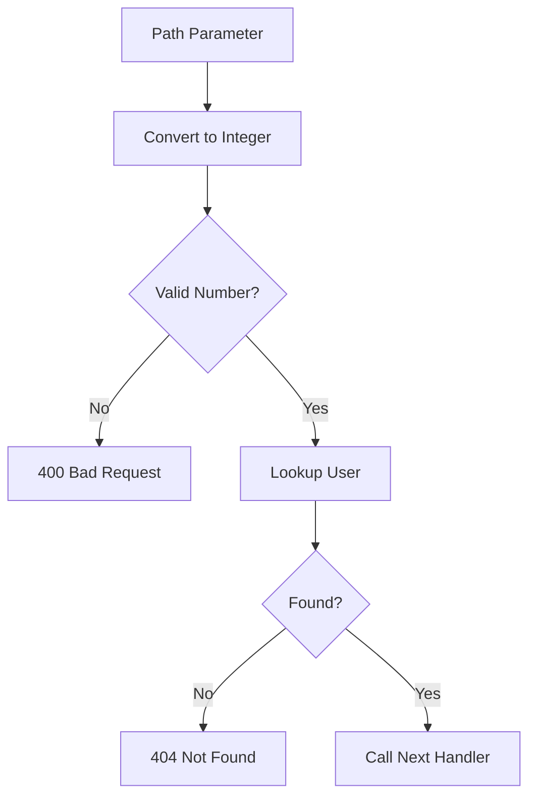

**Diagram sources**
- [index.js](file://examples/params/index.js)

**Section sources**
- [index.js](file://examples/params/index.js)

### Route Separation and MVC Controllers
- Separate concerns by organizing routes and controllers.
- Use before hooks to load resources and enforce presence checks.
- Apply CRUD actions consistently across controllers.

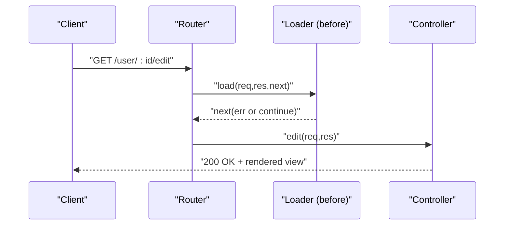

**Diagram sources**
- [index.js](file://examples/route-separation/index.js)
- [index.js](file://examples/route-separation/user.js)

**Section sources**
- [index.js](file://examples/route-separation/index.js)
- [index.js](file://examples/route-separation/user.js)
- [index.js](file://examples/mvc/controllers/user/index.js)
- [index.js](file://examples/mvc/controllers/pet/index.js)
- [index.js](file://examples/mvc/controllers/main/index.js)
- [index.js](file://examples/mvc/db.js)
- [index.js](file://examples/mvc/index.js)

## Dependency Analysis
Express exposes application, request, and response prototypes and integrates middleware and routers. The examples rely on these abstractions to implement RESTful patterns.

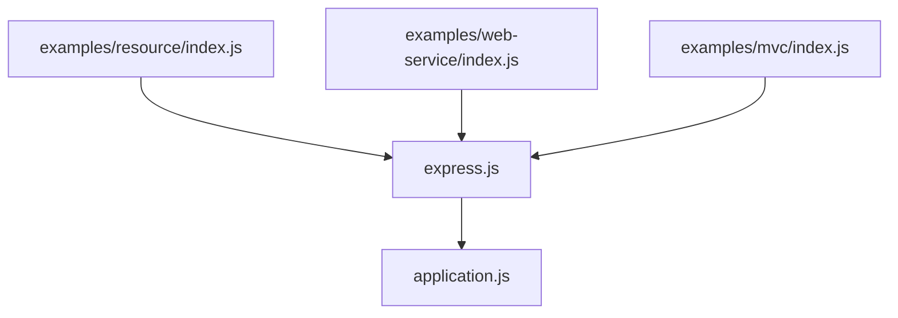

**Diagram sources**
- [express.js:1-82](file://lib/express.js#L1-L82)
- [application.js:1-632](file://lib/application.js#L1-L632)
- [index.js](file://examples/resource/index.js)
- [index.js](file://examples/web-service/index.js)
- [index.js](file://examples/mvc/index.js)

**Section sources**
- [express.js:1-82](file://lib/express.js#L1-L82)
- [application.js:1-632](file://lib/application.js#L1-L632)

## Performance Considerations
- Prefer lightweight representations (JSON) for machine-to-machine communication.
- Use caching headers and ETags where applicable.
- Minimize synchronous operations in middleware and route handlers.
- Keep route handlers small and delegate to services or controllers.

## Troubleshooting Guide
- 404 Not Found: Ensure routes match the intended path and method; verify middleware ordering.
- 400 Bad Request: Validate inputs using app.param and return structured errors.
- 401 Unauthorized: Confirm API key middleware is mounted and keys are provided.
- 500 Internal Server Error: Wrap errors and ensure error-handling middleware is registered last.

**Section sources**
- [index.js](file://examples/error-pages/index.js)
- [index.js](file://examples/error/index.js)
- [index.js](file://examples/web-service/index.js)
- [index.js](file://examples/params/index.js)

## Conclusion
The repository demonstrates RESTful API design in Express.js through practical examples: resource-based routing, HTTP method semantics, content negotiation, error handling, parameter validation, and MVC-style controllers. By following these patterns—URI design, idempotency, layered systems, and uniform interfaces—you can build scalable, maintainable, and discoverable APIs.