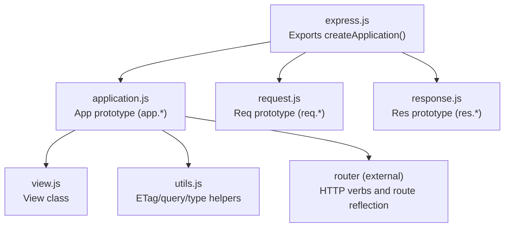
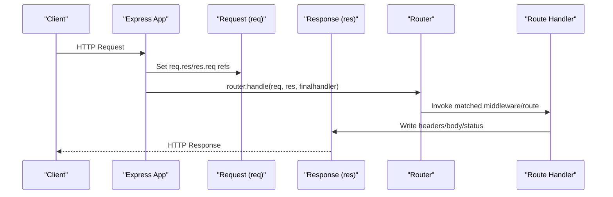

# API Reference

<cite>
**Referenced Files in This Document**
- [express.js](file://lib/express.js)
- [application.js](file://lib/application.js)
- [request.js](file://lib/request.js)
- [response.js](file://lib/response.js)
- [view.js](file://lib/view.js)
- [utils.js](file://lib/utils.js)
- [package.json](file://package.json)
- [hello-world/index.js](file://examples/hello-world/index.js)
- [content-negotiation/index.js](file://examples/content-negotiation/index.js)
- [static-files/index.js](file://examples/static-files/index.js)
- [app.js](file://test/app.js)
- [req.get.js](file://test/req.get.js)
- [res.send.js](file://test/res.send.js)
- [app.render.js](file://test/app.render.js)
</cite>

## Table of Contents
1. [Introduction](#introduction)
2. [Project Structure](#project-structure)
3. [Core Components](#core-components)
4. [Architecture Overview](#architecture-overview)
5. [Detailed Component Analysis](#detailed-component-analysis)
6. [Dependency Analysis](#dependency-analysis)
7. [Performance Considerations](#performance-considerations)
8. [Troubleshooting Guide](#troubleshooting-guide)
9. [Conclusion](#conclusion)
10. [Appendices](#appendices)

## Introduction
This document provides a comprehensive API reference for Express.js, focusing on public interfaces, methods, and configuration options. It covers:
- Application-level methods: app.set(), app.get(), app.use(), app.listen(), route definition shortcuts, and settings helpers.
- Request object methods for content negotiation, parameter access, header processing, and utility getters.
- Response object methods for JSON responses, redirects, file serving, header manipulation, and status management.
- View system methods for template engine integration and rendering.
- Utility functions for ETags, query parsing, and type normalization.
- Method signatures, parameter descriptions, return value specifications, and practical usage examples.
- Method chaining patterns, error conditions, and compatibility considerations across Express.js versions.

## Project Structure
Express exposes a factory function that creates an application instance. The application delegates to an internal router and integrates with request and response prototypes. Middleware and static serving are integrated via exported helpers.

**Diagram sources**
- [express.js:36-82](file://lib/express.js#L36-L82)
- [application.js:40-83](file://lib/application.js#L40-L83)
- [request.js:30-37](file://lib/request.js#L30-L37)
- [response.js:42-49](file://lib/response.js#L42-L49)
- [view.js:36-95](file://lib/view.js#L36-L95)
- [utils.js:29-272](file://lib/utils.js#L29-L272)

**Section sources**
- [express.js:36-82](file://lib/express.js#L36-L82)
- [application.js:40-83](file://lib/application.js#L40-L83)

## Core Components
- Application (app.*): Central configuration, middleware mounting, route shortcuts, and rendering.
- Request (req.*): Header accessors, content negotiation, IP/subdomains, protocol detection, freshness, and convenience getters.
- Response (res.*): Status management, headers, content negotiation, JSON/JSONP, redirects, file/streaming, cookies, and rendering.
- View: Template resolution and rendering with engines.
- Utilities: ETag generation, query parsing, type normalization, trust/proxy compilation, charset handling.

**Section sources**
- [application.js:351-606](file://lib/application.js#L351-L606)
- [request.js:63-511](file://lib/request.js#L63-L511)
- [response.js:64-864](file://lib/response.js#L64-L864)
- [view.js:52-159](file://lib/view.js#L52-L159)
- [utils.js:29-272](file://lib/utils.js#L29-L272)

## Architecture Overview
Express composes an application instance that inherits from EventEmitter and augments request/response prototypes. Incoming requests are handled by the internal router, with default error handling and X-Powered-By header when enabled.

**Diagram sources**
- [application.js:152-178](file://lib/application.js#L152-L178)
- [express.js:36-56](file://lib/express.js#L36-L56)

**Section sources**
- [application.js:152-178](file://lib/application.js#L152-L178)
- [express.js:36-56](file://lib/express.js#L36-L56)

## Detailed Component Analysis

### Application Methods (app.*)
- app.set(setting, [val])
  - Purpose: Assign or retrieve a setting value. Supports special behavior for etag, query parser, and trust proxy.
  - Signature: (string, any?) → any | app
  - Behavior: When called with one argument, returns current setting value; when called with two, sets and returns app for chaining.
  - Special settings:
    - etag: Compiles to an ETag generator function and stores under "etag fn".
    - query parser: Compiles to a query parsing function and stores under "query parser fn".
    - trust proxy: Compiles to a trust function and stores under "trust proxy fn"; toggles a back-compat flag.
  - Chaining: Yes.
  - Errors: None thrown for invalid values except when setting trust proxy to unknown value (see utils.compileTrust).
  - Practical example: [hello-world/index.js:7-9](file://examples/hello-world/index.js#L7-L9)

- app.get(setting)
  - Purpose: Retrieve a setting value.
  - Signature: (string) → any
  - Notes: Implemented via app.set(setting) when called with one argument.
  - Practical example: [application.js:473-481](file://lib/application.js#L473-L481)

- app.enable/disable/enabled/disabled(setting)
  - Purpose: Toggle and check boolean settings.
  - Signature: (string) → app | boolean
  - Chaining: enable/disable return app; enabled/disabled return boolean.
  - Practical example: [app.js:84-103](file://test/app.js#L84-L103)

- app.use([path], ...fns)
  - Purpose: Mount middleware or nested apps. Supports array flattening and optional leading path.
  - Signature: ([string|function], ...function[]) → app
  - Behavior: Non-express functions are passed to router.use; Express apps are mounted and emit "mount".
  - Errors: Throws if no functions provided.
  - Chaining: Yes.
  - Practical example: [static-files/index.js:22-36](file://examples/static-files/index.js#L22-L36)

- app.route(path)
  - Purpose: Return a Route instance for the given path.
  - Signature: (string) → Route
  - Notes: Delegates to internal router.
  - Practical example: [application.js:256-258](file://lib/application.js#L256-L258)

- app.engine(ext, fn)
  - Purpose: Register a template engine callback for an extension.
  - Signature: (string, function) → app
  - Errors: Throws if fn is not a function.
  - Practical example: [app.render.js:389](file://test/app.render.js#L389)

- app.param(name|names, fn)
  - Purpose: Define parameter pre-processors for route params.
  - Signature: (string|array, function) → app
  - Notes: Accepts array of names to register the same function for each.
  - Chaining: Yes.
  - Practical example: [application.js:322-334](file://lib/application.js#L322-L334)

- app.listen(...args)
  - Purpose: Start an HTTP server listening on the given arguments.
  - Signature: (...any) → http.Server
  - Notes: Wraps node:http.createServer(this) and forwards arguments; ensures error callback is invoked once.
  - Practical example: [hello-world/index.js:12-15](file://examples/hello-world/index.js#L12-L15)

- app.render(name, [options], callback)
  - Purpose: Render a view to completion, merging app.locals and options.
  - Signature: (string, object?, function) → void
  - Behavior: Uses cached View instance if enabled; resolves view path; invokes view.render; handles errors.
  - Errors: Propagates view lookup/render errors.
  - Practical example: [app.render.js:10-33](file://test/app.render.js#L10-L33)

- Route shortcuts: app.VERB(path, ...middlewares)
  - Purpose: Define routes for standard HTTP methods.
  - Signature: (string, ...function) → app
  - Notes: Delegates to app.route(path)[method](...args); app.get with single argument proxies to app.set.
  - Chaining: Yes.
  - Practical example: [content-negotiation/index.js:9-27](file://examples/content-negotiation/index.js#L9-L27)

- app.all(path, ...)
  - Purpose: Apply middleware/callback to all HTTP methods.
  - Signature: (string, ...function) → app
  - Chaining: Yes.
  - Practical example: [application.js:494-503](file://lib/application.js#L494-L503)

**Section sources**
- [application.js:351-383](file://lib/application.js#L351-L383)
- [application.js:419-465](file://lib/application.js#L419-L465)
- [application.js:190-244](file://lib/application.js#L190-L244)
- [application.js:256-258](file://lib/application.js#L256-L258)
- [application.js:294-308](file://lib/application.js#L294-L308)
- [application.js:322-334](file://lib/application.js#L322-L334)
- [application.js:598-606](file://lib/application.js#L598-L606)
- [application.js:522-575](file://lib/application.js#L522-L575)
- [application.js:471-503](file://lib/application.js#L471-L503)

### Request Methods (req.*)
- req.get(name) / req.header(name)
  - Purpose: Retrieve header value; special-case for "Referer"/"Referrer".
  - Signature: (string) → string|undefined
  - Errors: Throws if name is missing or not a string.
  - Practical example: [req.get.js:36-58](file://test/req.get.js#L36-L58)

- req.accepts(types...)
  - Purpose: Check acceptable content types based on Accept header.
  - Signature: (...string|string[]) → string|boolean|array
  - Practical example: [content-negotiation/index.js:9-27](file://examples/content-negotiation/index.js#L9-L27)

- req.acceptsEncodings(encodings...)
  - Purpose: Check acceptable encodings.
  - Signature: (...string) → string|array
  - Practical example: [request.js:140-143](file://lib/request.js#L140-L143)

- req.acceptsCharsets(charsets...)
  - Purpose: Check acceptable charsets.
  - Signature: (...string) → string|array
  - Practical example: [request.js:171-174](file://lib/request.js#L171-L174)

- req.acceptsLanguages(langs...)
  - Purpose: Check acceptable languages.
  - Signature: (...string) → string|array
  - Practical example: [request.js:185-187](file://lib/request.js#L185-L187)

- req.range(size, [options])
  - Purpose: Parse Range header; supports combine option.
  - Signature: (number, object?) → number|array|undefined
  - Practical example: [request.js:214-218](file://lib/request.js#L214-L218)

- req.query
  - Purpose: Parsed query string using configured query parser function.
  - Signature: Getter → object
  - Practical example: [request.js:230-241](file://lib/request.js#L230-L241)

- req.is(types...)
  - Purpose: Check request content type against given types.
  - Signature: (string|string[]) → string|false|null
  - Practical example: [request.js:269-281](file://lib/request.js#L269-L281)

- req.protocol
  - Purpose: HTTP or HTTPS based on socket and trust proxy function.
  - Signature: Getter → string
  - Practical example: [request.js:297-315](file://lib/request.js#L297-L315)

- req.secure
  - Purpose: Boolean shortcut for req.protocol === "https".
  - Signature: Getter → boolean
  - Practical example: [request.js:326-328](file://lib/request.js#L326-L328)

- req.ip
  - Purpose: Remote address considering trust proxy.
  - Signature: Getter → string
  - Practical example: [request.js:340-343](file://lib/request.js#L340-L343)

- req.ips
  - Purpose: Reverse-trusted chain excluding the socket address.
  - Signature: Getter → string[]
  - Practical example: [request.js:357-366](file://lib/request.js#L357-L366)

- req.subdomains
  - Purpose: Subdomain parts derived from hostname and "subdomain offset".
  - Signature: Getter → string[]
  - Practical example: [request.js:383-394](file://lib/request.js#L383-L394)

- req.path
  - Purpose: Parsed pathname from URL.
  - Signature: Getter → string
  - Practical example: [request.js:403-405](file://lib/request.js#L403-L405)

- req.host / req.hostname
  - Purpose: Hostname respecting trust proxy and IPv6 literal support.
  - Signature: Getter → string|undefined
  - Practical example: [request.js:418-458](file://lib/request.js#L418-L458)

- req.fresh / req.stale
  - Purpose: Freshness checks using If-None-Match/If-Modified-Since semantics.
  - Signature: Getter → boolean
  - Practical example: [request.js:469-499](file://lib/request.js#L469-L499)

- req.xhr
  - Purpose: Detect XMLHttpRequest via "X-Requested-With" header.
  - Signature: Getter → boolean
  - Practical example: [request.js:508-511](file://lib/request.js#L508-L511)

**Section sources**
- [request.js:63-83](file://lib/request.js#L63-L83)
- [request.js:127-130](file://lib/request.js#L127-L130)
- [request.js:140-143](file://lib/request.js#L140-L143)
- [request.js:171-174](file://lib/request.js#L171-L174)
- [request.js:185-187](file://lib/request.js#L185-L187)
- [request.js:214-218](file://lib/request.js#L214-L218)
- [request.js:230-241](file://lib/request.js#L230-L241)
- [request.js:269-281](file://lib/request.js#L269-L281)
- [request.js:297-315](file://lib/request.js#L297-L315)
- [request.js:326-328](file://lib/request.js#L326-L328)
- [request.js:340-343](file://lib/request.js#L340-L343)
- [request.js:357-366](file://lib/request.js#L357-L366)
- [request.js:383-394](file://lib/request.js#L383-L394)
- [request.js:403-405](file://lib/request.js#L403-L405)
- [request.js:418-458](file://lib/request.js#L418-L458)
- [request.js:469-499](file://lib/request.js#L469-L499)
- [request.js:508-511](file://lib/request.js#L508-L511)

### Response Methods (res.*)
- res.status(code)
  - Purpose: Set HTTP status code with validation.
  - Signature: (number) → ServerResponse
  - Errors: Throws TypeError if not an integer; RangeError if outside 100–999.
  - Chaining: Yes.
  - Practical example: [res.send.js:349-359](file://test/res.send.js#L349-L359)

- res.set(field, [val]) / res.header(field, [val])
  - Purpose: Set header(s); expands Content-Type with charset when needed.
  - Signature: (string|object, string|array?) → ServerResponse
  - Errors: Throws if Content-Type is set to an array.
  - Chaining: Yes.
  - Practical example: [res.send.js:99-110](file://test/res.send.js#L99-L110)

- res.get(field)
  - Purpose: Get header value.
  - Signature: (string) → string
  - Practical example: [response.js:696-698](file://lib/response.js#L696-L698)

- res.links(map)
  - Purpose: Set Link header with multiple relations.
  - Signature: (object) → ServerResponse
  - Chaining: Yes.
  - Practical example: [response.js:97-110](file://lib/response.js#L97-L110)

- res.send(body)
  - Purpose: Serialize and send arbitrary body; auto-sets Content-Type and ETag when applicable.
  - Signature: (string|number|boolean|object|Buffer) → ServerResponse
  - Behavior: Handles HEAD, 204/304/205 semantics; calculates Content-Length; honors req.fresh.
  - Chaining: Yes.
  - Practical example: [res.send.js:14-24](file://test/res.send.js#L14-L24)

- res.json(obj)
  - Purpose: Send JSON response using application settings for replacer/spaces/escape.
  - Signature: (any) → ServerResponse
  - Chaining: Yes.
  - Practical example: [res.send.js:209-220](file://test/res.send.js#L209-L220)

- res.jsonp(obj)
  - Purpose: Send JSONP response with callback handling and security mitigations.
  - Signature: (any) → ServerResponse
  - Chaining: Yes.
  - Practical example: [response.js:260-304](file://lib/response.js#L260-L304)

- res.sendStatus(code)
  - Purpose: Set status and send human-readable body.
  - Signature: (number) → ServerResponse
  - Chaining: Yes.
  - Practical example: [response.js:321-328](file://lib/response.js#L321-L328)

- res.redirect([status,] url)
  - Purpose: Redirect with automatic content negotiation for text/html.
  - Signature: (string|number, string?) → ServerResponse
  - Deprecation: Warns when arguments are missing or invalid types.
  - Chaining: Yes.
  - Practical example: [response.js:812-864](file://lib/response.js#L812-L864)

- res.location(url)
  - Purpose: Set Location header with URL encoding.
  - Signature: (string) → ServerResponse
  - Chaining: Yes.
  - Practical example: [response.js:794-796](file://lib/response.js#L794-L796)

- res.type(type) / res.contentType(type)
  - Purpose: Set Content-Type with charset expansion.
  - Signature: (string) → ServerResponse
  - Chaining: Yes.
  - Practical example: [response.js:504-510](file://lib/response.js#L504-L510)

- res.format(map)
  - Purpose: Respond according to Accept header; invokes default if provided.
  - Signature: (object) → ServerResponse
  - Chaining: Yes.
  - Practical example: [content-negotiation/index.js:9-27](file://examples/content-negotiation/index.js#L9-L27)

- res.attachment([filename])
  - Purpose: Set Content-Disposition to attachment.
  - Signature: (string?) → ServerResponse
  - Chaining: Yes.
  - Practical example: [response.js:604-612](file://lib/response.js#L604-L612)

- res.download(path, [filename], [options], [callback])
  - Purpose: Stream file as attachment; merges headers and options.
  - Signature: (string, string?, object?, function?) → ServerResponse
  - Errors: Validates path and enforces absolute path/root when needed.
  - Chaining: Yes.
  - Practical example: [response.js:433-482](file://lib/response.js#L433-L482)

- res.sendFile(path, [options], [callback])
  - Purpose: Stream file; wires app etag setting to underlying send.
  - Signature: (string, object?, function?) → ServerResponse
  - Errors: Validates path and enforces absolute path/root when needed.
  - Chaining: Yes.
  - Practical example: [response.js:371-413](file://lib/response.js#L371-L413)

- res.cookie(name, value, [options])
  - Purpose: Set signed/unencoded cookie; supports maxAge/expiry/path.
  - Signature: (string, string|object, object?) → ServerResponse
  - Errors: Requires req.secret for signed cookies.
  - Chaining: Yes.
  - Practical example: [response.js:742-775](file://lib/response.js#L742-L775)

- res.clearCookie(name, [options])
  - Purpose: Expire a cookie by setting expiry to the past.
  - Signature: (string, object?) → ServerResponse
  - Chaining: Yes.
  - Practical example: [response.js:709-716](file://lib/response.js#L709-L716)

- res.vary(field)
  - Purpose: Add field to Vary header.
  - Signature: (string|array) → ServerResponse
  - Chaining: Yes.
  - Practical example: [response.js:875-879](file://lib/response.js#L875-L879)

- res.append(field, val)
  - Purpose: Concatenate header values.
  - Signature: (string, string|array) → ServerResponse
  - Chaining: Yes.
  - Practical example: [response.js:629-641](file://lib/response.js#L629-L641)

- res.render(view, [options], [callback])
  - Purpose: Render a view and send response; merges res.locals.
  - Signature: (string, object?, function?) → void
  - Behavior: Defaults to sending 200 text/html when no callback; delegates to app.render.
  - Practical example: [response.js:894-918](file://lib/response.js#L894-L918)

**Section sources**
- [response.js:64-76](file://lib/response.js#L64-L76)
- [response.js:664-698](file://lib/response.js#L664-L698)
- [response.js:97-110](file://lib/response.js#L97-L110)
- [response.js:125-218](file://lib/response.js#L125-L218)
- [response.js:232-246](file://lib/response.js#L232-L246)
- [response.js:260-304](file://lib/response.js#L260-L304)
- [response.js:321-328](file://lib/response.js#L321-L328)
- [response.js:812-864](file://lib/response.js#L812-L864)
- [response.js:794-796](file://lib/response.js#L794-L796)
- [response.js:504-510](file://lib/response.js#L504-L510)
- [response.js:569-594](file://lib/response.js#L569-L594)
- [response.js:604-612](file://lib/response.js#L604-L612)
- [response.js:433-482](file://lib/response.js#L433-L482)
- [response.js:371-413](file://lib/response.js#L371-L413)
- [response.js:742-775](file://lib/response.js#L742-L775)
- [response.js:709-716](file://lib/response.js#L709-L716)
- [response.js:875-879](file://lib/response.js#L875-L879)
- [response.js:629-641](file://lib/response.js#L629-L641)
- [response.js:894-918](file://lib/response.js#L894-L918)

### View System (View)
- Constructor: View(name, options)
  - Purpose: Resolve engine, extension, and view path; load engine if needed.
  - Options: defaultEngine, engines, root.
  - Errors: Throws if no extension and no default engine; throws if engine lacks __express.
  - Practical example: [view.js:52-95](file://lib/view.js#L52-L95)

- View.prototype.lookup(name)
  - Purpose: Resolve view path across roots.
  - Practical example: [view.js:104-123](file://lib/view.js#L104-L123)

- View.prototype.render(options, callback)
  - Purpose: Render synchronously and normalize to async callback.
  - Practical example: [view.js:133-159](file://lib/view.js#L133-L159)

**Section sources**
- [view.js:52-159](file://lib/view.js#L52-L159)

### Utilities
- ETag helpers
  - exports.etag / exports.wetag: Strong and weak ETag generators.
  - exports.compileETag(val): Compiles to function based on boolean/string/function.
  - Practical example: [utils.js:40-51](file://lib/utils.js#L40-L51), [utils.js:130-152](file://lib/utils.js#L130-L152)

- Query parsing helpers
  - exports.compileQueryParser(val): Compiles to function based on simple/extended/custom.
  - Practical example: [utils.js:162-184](file://lib/utils.js#L162-L184)

- Trust/proxy helpers
  - exports.compileTrust(val): Compiles to function from boolean/number/string/array/function.
  - Practical example: [utils.js:194-214](file://lib/utils.js#L194-L214)

- Type helpers
  - exports.normalizeType / exports.normalizeTypes: Normalize MIME types and parameters.
  - exports.setCharset: Expand Content-Type with charset.
  - Practical example: [utils.js:61-77](file://lib/utils.js#L61-L77), [utils.js:225-238](file://lib/utils.js#L225-L238)

**Section sources**
- [utils.js:40-51](file://lib/utils.js#L40-L51)
- [utils.js:130-152](file://lib/utils.js#L130-L152)
- [utils.js:162-184](file://lib/utils.js#L162-L184)
- [utils.js:194-214](file://lib/utils.js#L194-L214)
- [utils.js:61-77](file://lib/utils.js#L61-L77)
- [utils.js:225-238](file://lib/utils.js#L225-L238)

## Dependency Analysis
Express depends on external libraries for content negotiation, parsing, sending files, cookies, and more. These are declared in package.json.

```mermaid
graph TB
Express["Express (index)"] --> BodyParser["body-parser"]
Express --> RouterDep["router"]
Express --> Accepts["accepts"]
Express --> TypeIs["type-is"]
Express --> Fresh["fresh"]
Express --> RangeParser["range-parser"]
Express --> ProxyAddr["proxy-addr"]
Express --> Send["send"]
Express --> ServeStatic["serve-static"]
Express --> MimeTypes["mime-types"]
Express --> Cookie["cookie"]
Express --> CookieSignature["cookie-signature"]
Express --> Vary["vary"]
Express --> OnFinished["on-finished"]
Express --> Debug["debug"]
Express --> FinalHandler["finalhandler"]
Express --> HttpErrors["http-errors"]
Express --> Statuses["statuses"]
Express --> Qs["qs"]
```

**Diagram sources**
- [package.json:34-62](file://package.json#L34-L62)

**Section sources**
- [package.json:34-62](file://package.json#L34-L62)

## Performance Considerations
- ETag generation: Enabled by default in development; can be tuned via app.set('etag', ...) to strong/weak/function. Avoids unnecessary reprocessing when req.fresh is true.
- Query parsing: Choose "simple" or "extended" based on payload complexity; extended parsing uses qs with allowPrototypes.
- Content negotiation: res.format leverages accepts; cache view rendering when appropriate.
- File serving: res.sendFile/res.download stream files; ensure proper caching headers and avoid blocking operations in middleware.

[No sources needed since this section provides general guidance]

## Troubleshooting Guide
- app.use() requires a middleware function
  - Symptom: TypeError when calling app.use() with no functions.
  - Resolution: Ensure at least one middleware function is provided.
  - Evidence: [application.js:212-214](file://lib/application.js#L212-L214)

- req.get() header name validation
  - Symptom: TypeError when header name is missing or not a string.
  - Resolution: Pass a non-empty string header name.
  - Evidence: [req.get.js:36-58](file://test/req.get.js#L36-L58)

- res.cookie() requires secret for signed cookies
  - Symptom: Error when signing cookies without req.secret.
  - Resolution: Configure a secret or avoid signed option.
  - Evidence: [response.js:747-749](file://lib/response.js#L747-L749)

- res.sendFile() path validation
  - Symptom: TypeError for non-string or non-absolute path without root.
  - Resolution: Provide absolute path or set root option.
  - Evidence: [response.js:378-394](file://lib/response.js#L378-L394)

- View lookup failures
  - Symptom: Error indicating failed to lookup view in views directories.
  - Resolution: Verify view name, extension, and views path configuration.
  - Evidence: [application.js:562-565](file://lib/application.js#L562-L565), [app.render.js:82-92](file://test/app.render.js#L82-L92)

**Section sources**
- [application.js:212-214](file://lib/application.js#L212-L214)
- [req.get.js:36-58](file://test/req.get.js#L36-L58)
- [response.js:747-749](file://lib/response.js#L747-L749)
- [response.js:378-394](file://lib/response.js#L378-L394)
- [application.js:562-565](file://lib/application.js#L562-L565)
- [app.render.js:82-92](file://test/app.render.js#L82-L92)

## Conclusion
This API reference consolidates Express.js public interfaces with precise signatures, behaviors, and examples drawn from the codebase and tests. It highlights method chaining, error handling, and compatibility considerations, enabling developers to build robust applications with predictable behavior across versions.

[No sources needed since this section summarizes without analyzing specific files]

## Appendices

### Compatibility and Version Notes
- Minimum Node.js version is 18 as declared in engines.
- Express version is 5.2.1 as declared in package metadata.
- HTTP methods are dynamically derived from node:http.METHODS.

**Section sources**
- [package.json:82-84](file://package.json#L82-L84)
- [package.json:4,4:4-4](file://package.json#L4-L4)
- [utils.js:29](file://lib/utils.js#L29)

### Practical Usage Examples Index
- Hello World: [hello-world/index.js:7-15](file://examples/hello-world/index.js#L7-L15)
- Content Negotiation: [content-negotiation/index.js:9-40](file://examples/content-negotiation/index.js#L9-L40)
- Static Files: [static-files/index.js:22-39](file://examples/static-files/index.js#L22-L39)

**Section sources**
- [hello-world/index.js:7-15](file://examples/hello-world/index.js#L7-L15)
- [content-negotiation/index.js:9-40](file://examples/content-negotiation/index.js#L9-L40)
- [static-files/index.js:22-39](file://examples/static-files/index.js#L22-L39)