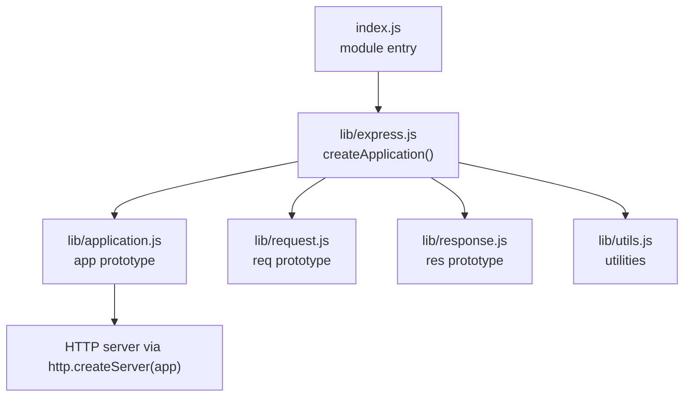
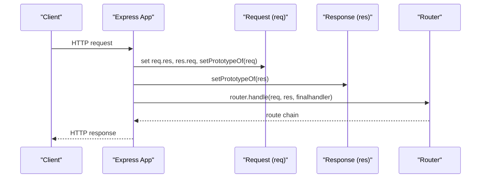
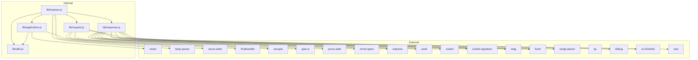

# API Reference

<cite>
**Referenced Files in This Document**
- [index.js](file://index.js)
- [lib/express.js](file://lib/express.js)
- [lib/application.js](file://lib/application.js)
- [lib/request.js](file://lib/request.js)
- [lib/response.js](file://lib/response.js)
- [lib/utils.js](file://lib/utils.js)
- [package.json](file://package.json)
- [Readme.md](file://Readme.md)
- [examples/hello-world/index.js](file://examples/hello-world/index.js)
- [examples/web-service/index.js](file://examples/web-service/index.js)
- [examples/multi-router/index.js](file://examples/multi-router/index.js)
- [test/app.js](file://test/app.js)
- [test/req.get.js](file://test/req.get.js)
- [test/res.send.js](file://test/res.send.js)
</cite>

## Table of Contents
1. [Introduction](#introduction)
2. [Project Structure](#project-structure)
3. [Core Components](#core-components)
4. [Architecture Overview](#architecture-overview)
5. [Detailed Component Analysis](#detailed-component-analysis)
6. [Dependency Analysis](#dependency-analysis)
7. [Performance Considerations](#performance-considerations)
8. [Troubleshooting Guide](#troubleshooting-guide)
9. [Conclusion](#conclusion)
10. [Appendices](#appendices)

## Introduction
This API reference documents the Express.js framework’s public surface exposed by the main module. It covers application creation and configuration, request object properties and helpers, response object methods, and utility functions. The documentation organizes content by functional areas, describes method signatures, parameters, return values, and behavior, and includes cross-references and usage pointers to example code and tests.

Version and compatibility:
- Version: 5.2.1
- Node.js engine requirement: >= 18
- Migration guidance: See the official migration guide referenced in the project documentation.

**Section sources**
- [package.json:4](file://package.json#L4)
- [package.json:82-84](file://package.json#L82-L84)
- [Readme.md:85](file://Readme.md#L85)

## Project Structure
Express exposes a single export that creates an application instance and augments it with request and response prototypes. The application delegates routing and middleware to an internal router and integrates with Node’s HTTP server.

**Diagram sources**
- [index.js:11](file://index.js#L11)
- [lib/express.js:36-56](file://lib/express.js#L36-L56)
- [lib/application.js:59-83](file://lib/application.js#L59-L83)

**Section sources**
- [index.js:11](file://index.js#L11)
- [lib/express.js:15-21](file://lib/express.js#L15-L21)
- [lib/express.js:36-56](file://lib/express.js#L36-L56)
- [lib/application.js:59-83](file://lib/application.js#L59-L83)

## Core Components
- Application (app): Created via the exported factory. Provides settings, middleware, routing, and HTTP listening.
- Request (req): Prototype augmented onto each HTTP request object with convenience getters and helpers.
- Response (res): Prototype augmented onto each HTTP response object with helpers for sending data, cookies, redirects, and rendering.

Key exports and factories:
- Exported factory: createApplication()
- Prototypes: app, req, res
- Constructors: Route, Router
- Middleware shorthands: json, raw, static, text, urlencoded

**Section sources**
- [lib/express.js:27](file://lib/express.js#L27)
- [lib/express.js:62-82](file://lib/express.js#L62-L82)
- [lib/application.js:59-83](file://lib/application.js#L59-L83)
- [lib/request.js:30](file://lib/request.js#L30)
- [lib/response.js:42](file://lib/response.js#L42)

## Architecture Overview
Express composes an application from a function that delegates to a router. The app sets up request/response prototypes, mounts middleware, and handles requests through the router. Responses are streamed via Node’s HTTP server.

**Diagram sources**
- [lib/application.js:152-178](file://lib/application.js#L152-L178)
- [lib/express.js:45-52](file://lib/express.js#L45-L52)

**Section sources**
- [lib/application.js:152-178](file://lib/application.js#L152-L178)
- [lib/express.js:45-52](file://lib/express.js#L45-L52)

## Detailed Component Analysis

### Application Methods
Public methods and behaviors:
- app.set(setting, [val]): Assign or retrieve a setting. Supports special transformations for etag, query parser, and trust proxy.
- app.get(setting): Retrieve a setting value.
- app.enable(setting)/app.disable(setting): Toggle boolean settings.
- app.enabled(setting)/app.disabled(setting): Check setting state.
- app.use([path], ...fns): Mount middleware or nested apps. Accepts arrays and flattens.
- app.route(path): Create a Route for a path.
- app.all(path, ...handlers): Apply handlers to all HTTP methods.
- app.get(path, ...handlers): Shorthand for GET; when called with a single string, acts as app.get(setting).
- app.listen(...args): Starts an HTTP server bound to the app.
- app.render(view, [options], callback): Render a view using configured view engine and cache.
- app.engine(ext, callback): Register a template engine for an extension.
- app.param(name|names[], fn): Register param middleware for route parameters.

Behavioral notes:
- app.listen returns an http.Server and wires error handling via finalhandler.
- app.handle sets X-Powered-By header when enabled, and wires req/res circular references.
- app.use supports mounting nested Express apps and preserves req/res prototype chains during mount/unmount.

Cross-references:
- Settings and defaults: app.defaultConfiguration initializes environment, etag, query parser, trust proxy, view cache, and more.
- Router delegation: app.get delegates to app.set when called with a single string; app methods delegate to router routes.

Usage examples:
- Basic app creation and route: [examples/hello-world/index.js:5-9](file://examples/hello-world/index.js#L5-L9)
- Web service with middleware and error handling: [examples/web-service/index.js:30-103](file://examples/web-service/index.js#L30-L103)
- Multi-router composition: [examples/multi-router/index.js:7-8](file://examples/multi-router/index.js#L7-L8)

**Section sources**
- [lib/application.js:90-141](file://lib/application.js#L90-L141)
- [lib/application.js:152-178](file://lib/application.js#L152-L178)
- [lib/application.js:190-244](file://lib/application.js#L190-L244)
- [lib/application.js:256-258](file://lib/application.js#L256-L258)
- [lib/application.js:471-482](file://lib/application.js#L471-L482)
- [lib/application.js:494-503](file://lib/application.js#L494-L503)
- [lib/application.js:522-575](file://lib/application.js#L522-L575)
- [lib/application.js:294-308](file://lib/application.js#L294-L308)
- [lib/application.js:322-334](file://lib/application.js#L322-L334)
- [lib/application.js:598-606](file://lib/application.js#L598-L606)
- [examples/hello-world/index.js:5-15](file://examples/hello-world/index.js#L5-L15)
- [examples/web-service/index.js:30-103](file://examples/web-service/index.js#L30-L103)
- [examples/multi-router/index.js:7-8](file://examples/multi-router/index.js#L7-L8)

### Request Object Properties and Helpers
Request prototype augmentations:
- req.get(name)/req.header(name): Case-insensitive header retrieval; special-cases Referrer/Referer.
- req.accepts(...types): Negotiate content types based on Accept.
- req.acceptsEncodings(...encodings): Negotiate encodings based on Accept-Encoding.
- req.acceptsCharsets(...charsets): Negotiate charsets based on Accept-Charset.
- req.acceptsLanguages(...langs): Negotiate languages based on Accept-Language.
- req.range(size, [options]): Parse Range header; supports combine option.
- req.query: Lazily parsed query string using configured query parser function.
- req.is(...types): Check Content-Type against given types.
- req.protocol: "http" or "https", honoring trust proxy and X-Forwarded-Proto.
- req.secure: Boolean shortcut for protocol === "https".
- req.ip: Remote address respecting trust proxy.
- req.ips: Array of trusted proxy addresses plus client, reversed and without socket address.
- req.subdomains: Hostname parts forming subdomains based on subdomain offset.
- req.path: Parsed pathname from URL.
- req.host: Host header with X-Forwarded-Host respected when trusted.
- req.hostname: Hostname portion of host.
- req.fresh: Weak freshness validation for 2xx/304 with ETag and Last-Modified.
- req.stale: Negation of fresh.
- req.xhr: Boolean indicating XMLHttpRequest based on X-Requested-With.

Validation and error behavior:
- req.get throws for missing or non-string header name.
- req.range returns undefined if no Range header, -1 for unsatisfiable, -2 for syntactically invalid.

Cross-references:
- Header normalization and negotiation are delegated to external libraries (accepts, type-is, proxy-addr, etc.).

Usage examples:
- Header retrieval and negotiation: [test/req.get.js:8-59](file://test/req.get.js#L8-L59)

**Section sources**
- [lib/request.js:63-83](file://lib/request.js#L63-L83)
- [lib/request.js:127-130](file://lib/request.js#L127-L130)
- [lib/request.js:140-143](file://lib/request.js#L140-L143)
- [lib/request.js:171-174](file://lib/request.js#L171-L174)
- [lib/request.js:185-187](file://lib/request.js#L185-L187)
- [lib/request.js:214-218](file://lib/request.js#L214-L218)
- [lib/request.js:230-241](file://lib/request.js#L230-L241)
- [lib/request.js:269-281](file://lib/request.js#L269-L281)
- [lib/request.js:297-315](file://lib/request.js#L297-L315)
- [lib/request.js:326-328](file://lib/request.js#L326-L328)
- [lib/request.js:340-343](file://lib/request.js#L340-L343)
- [lib/request.js:357-366](file://lib/request.js#L357-L366)
- [lib/request.js:383-394](file://lib/request.js#L383-L394)
- [lib/request.js:403-405](file://lib/request.js#L403-L405)
- [lib/request.js:418-431](file://lib/request.js#L418-L431)
- [lib/request.js:444-458](file://lib/request.js#L444-L458)
- [lib/request.js:469-486](file://lib/request.js#L469-L486)
- [lib/request.js:497-499](file://lib/request.js#L497-L499)
- [lib/request.js:508-511](file://lib/request.js#L508-L511)
- [test/req.get.js:8-59](file://test/req.get.js#L8-L59)

### Response Object Methods
Response prototype methods:
- res.status(code): Set HTTP status code with validation (integer 100–999).
- res.get(field): Get header value.
- res.set(field|obj, [val]): Set headers; expands Content-Type via mime; throws for invalid array Content-Type.
- res.header(field|obj, [val]): Alias of res.set.
- res.append(field, val): Concatenate header values.
- res.links(object): Set Link header from a links map.
- res.send(body): Serialize and send body; auto-sets Content-Type for strings/objects; honors ETag and HEAD semantics; strips irrelevant headers for 204/304/205.
- res.json(obj): Serialize to JSON and send.
- res.jsonp(obj): JSONP response with callback extraction from query; sets text/javascript when callback present.
- res.sendStatus(code): Set status and send human-readable body.
- res.redirect([status,] url): Redirect with Location; negotiates text/html by default; logs deprecation warnings for invalid arguments.
- res.location(url): Set Location header with URL encoding.
- res.cookie(name, value, [options]): Set signed or unsigned cookies; supports maxAge conversion to expires.
- res.clearCookie(name, [options]): Expire a cookie by setting expires in the past.
- res.type(contentType|ext): Set Content-Type with charset if needed.
- res.contentType(contentType|ext): Alias of res.type.
- res.format(map): Content negotiation via Accept; sets Content-Type and invokes matched handler or default; otherwise 406.
- res.attachment([filename]): Set Content-Disposition to attachment.
- res.download(path, [filename], [options], [callback]): Stream file as attachment; merges headers; resolves absolute path when needed.
- res.sendFile(path, [options], [callback]): Stream file; validates absolute path or root; wires etag; handles errors via next().
- res.vary(field): Add field to Vary header.
- res.render(view, [options], [callback]): Render view using app.render; merges res.locals; defaults to sending response via done.

Validation and error behavior:
- res.status throws for non-integers or out-of-range codes.
- res.set throws for array Content-Type.
- res.sendFile validates path argument types and enforces absolute path or root.
- res.cookie throws when signed cookies are requested without req.secret.
- res.redirect logs deprecations for invalid argument types.

Cross-references:
- Content negotiation and type normalization are handled via mime-types and accept negotiation.
- Freshness checks leverage ETag and Last-Modified via the fresh library.

Usage examples:
- Response chaining and status handling: [test/res.send.js:13-359](file://test/res.send.js#L13-L359)

**Section sources**
- [lib/response.js:64-76](file://lib/response.js#L64-L76)
- [lib/response.js:696-698](file://lib/response.js#L696-L698)
- [lib/response.js:664-686](file://lib/response.js#L664-L686)
- [lib/response.js:97-110](file://lib/response.js#L97-L110)
- [lib/response.js:125-218](file://lib/response.js#L125-L218)
- [lib/response.js:232-246](file://lib/response.js#L232-L246)
- [lib/response.js:260-304](file://lib/response.js#L260-L304)
- [lib/response.js:321-328](file://lib/response.js#L321-L328)
- [lib/response.js:812-864](file://lib/response.js#L812-L864)
- [lib/response.js:794-796](file://lib/response.js#L794-L796)
- [lib/response.js:742-775](file://lib/response.js#L742-L775)
- [lib/response.js:709-716](file://lib/response.js#L709-L716)
- [lib/response.js:504-510](file://lib/response.js#L504-L510)
- [lib/response.js:569-594](file://lib/response.js#L569-L594)
- [lib/response.js:604-612](file://lib/response.js#L604-L612)
- [lib/response.js:433-482](file://lib/response.js#L433-L482)
- [lib/response.js:371-413](file://lib/response.js#L371-L413)
- [lib/response.js:875-879](file://lib/response.js#L875-L879)
- [lib/response.js:894-918](file://lib/response.js#L894-L918)
- [test/res.send.js:13-359](file://test/res.send.js#L13-L359)

### Utility Functions
Utilities used across the framework:
- methods: Lowercased HTTP methods derived from Node’s http.METHODS.
- ETag compilation: compileETag(val) produces a function from boolean/string/function.
- Query parser compilation: compileQueryParser(val) produces a function from string/function.
- Trust function compilation: compileTrust(val) produces a function from boolean/number/string/array/function.
- Type normalization: normalizeType(type), normalizeTypes(types).
- Charset handling: setCharset(type, charset).
- JSON serialization: stringify with optional escaping and replacer/spaces.

Cross-references:
- These are used by application settings and response helpers to configure behavior and content negotiation.

**Section sources**
- [lib/utils.js:29](file://lib/utils.js#L29)
- [lib/utils.js:130-152](file://lib/utils.js#L130-L152)
- [lib/utils.js:162-184](file://lib/utils.js#L162-L184)
- [lib/utils.js:194-214](file://lib/utils.js#L194-L214)
- [lib/utils.js:61-77](file://lib/utils.js#L61-L77)
- [lib/utils.js:225-238](file://lib/utils.js#L225-L238)
- [lib/utils.js:1023-1047](file://lib/utils.js#L1023-L1047)

## Dependency Analysis
Express composes functionality from several Node and community packages. The following diagram shows key internal and external dependencies.

**Diagram sources**
- [lib/express.js:15-21](file://lib/express.js#L15-L21)
- [lib/application.js:16-26](file://lib/application.js#L16-L26)
- [lib/request.js:16-23](file://lib/request.js#L16-L23)
- [lib/response.js:15-35](file://lib/response.js#L15-L35)

**Section sources**
- [lib/express.js:15-21](file://lib/express.js#L15-L21)
- [lib/application.js:16-26](file://lib/application.js#L16-L26)
- [lib/request.js:16-23](file://lib/request.js#L16-L23)
- [lib/response.js:15-35](file://lib/response.js#L15-L35)

## Performance Considerations
- ETag generation: Controlled by the etag setting and compiled function; can be enabled/disabled or customized. Large bodies and small bodies are handled differently to balance CPU and memory.
- Content-Length and type: res.send computes and sets Content-Length and Content-Type intelligently; avoid unnecessary conversions for buffers.
- Freshness: req.fresh leverages ETag and Last-Modified to return 304 efficiently.
- Streaming: res.sendFile and res.download use the send stream; ensure proper error handling and headers to avoid partial transfers.
- Query parsing: Choose appropriate query parser (simple vs extended) to balance speed and capability.

[No sources needed since this section provides general guidance]

## Troubleshooting Guide
Common issues and diagnostics:
- app.use requires a middleware function: Passing no function or an invalid argument triggers a TypeError.
- Invalid status code in res.status: Non-integer or out-of-range values throw TypeError or RangeError.
- Content-Type misuse: Setting Content-Type to an array via res.set throws a TypeError.
- Signed cookies without secret: Using res.cookie with signed: true without req.secret throws an error.
- res.sendFile path validation: Requires a non-empty string and either an absolute path or root option.
- res.redirect argument types: Passing non-string URL or non-number status logs deprecations; ensure correct types.

Related tests and examples:
- Middleware mounting and error handling: [test/app.js:14-24](file://test/app.js#L14-L24)
- Header retrieval and validation: [test/req.get.js:36-59](file://test/req.get.js#L36-L59)
- Response send behavior and ETag: [test/res.send.js:13-359](file://test/res.send.js#L13-L359)

**Section sources**
- [lib/application.js:212-214](file://lib/application.js#L212-L214)
- [lib/response.js:64-76](file://lib/response.js#L64-L76)
- [lib/response.js:674-677](file://lib/response.js#L674-L677)
- [lib/response.js:747-749](file://lib/response.js#L747-L749)
- [lib/response.js:378-394](file://lib/response.js#L378-L394)
- [test/app.js:14-24](file://test/app.js#L14-L24)
- [test/req.get.js:36-59](file://test/req.get.js#L36-L59)
- [test/res.send.js:13-359](file://test/res.send.js#L13-L359)

## Conclusion
This reference outlines Express’s public API surface, focusing on application configuration, request helpers, response methods, and utility functions. It emphasizes parameter types, return values, validation behavior, and cross-references to examples and tests. For version-specific behavior and migration guidance, consult the project’s migration resources and changelog.

[No sources needed since this section summarizes without analyzing specific files]

## Appendices

### Method Signatures and Parameters Summary
- app.set(setting, [val]) → app
- app.get(setting) → any
- app.enable/disable(setting) → app
- app.enabled/disabled(setting) → boolean
- app.use([path,] ...fns) → app
- app.route(path) → Route
- app.all(path, ...handlers) → app
- app.get(path, ...handlers) → app (single string: get setting)
- app.listen(...args) → http.Server
- app.render(view, [options], callback) → void
- app.engine(ext, callback) → app
- app.param(name|names[], fn) → app

- req.get(name)/req.header(name) → string|undefined
- req.accepts(...types) → string|array|boolean
- req.acceptsEncodings(...encodings) → string|array
- req.acceptsCharsets(...charsets) → string|array
- req.acceptsLanguages(...langs) → string|array
- req.range(size, [options]) → number|array|undefined
- req.query → object
- req.is(...types) → string|false|null
- req.protocol → string
- req.secure → boolean
- req.ip → string
- req.ips → string[]
- req.subdomains → string[]
- req.path → string
- req.host → string
- req.hostname → string
- req.fresh → boolean
- req.stale → boolean
- req.xhr → boolean

- res.status(code) → res
- res.get(field) → string
- res.set(field|obj, [val]) → res
- res.header(field|obj, [val]) → res
- res.append(field, val) → res
- res.links(object) → res
- res.send(body) → res
- res.json(obj) → res
- res.jsonp(obj) → res
- res.sendStatus(code) → res
- res.redirect([status,] url) → res
- res.location(url) → res
- res.cookie(name, value, [options]) → res
- res.clearCookie(name, [options]) → res
- res.type(contentType|ext) → res
- res.contentType(contentType|ext) → res
- res.format(map) → res
- res.attachment([filename]) → res
- res.download(path, [filename], [options], [callback]) → res
- res.sendFile(path, [options], [callback]) → res
- res.vary(field) → res
- res.render(view, [options], [callback]) → void

**Section sources**
- [lib/application.js:351-383](file://lib/application.js#L351-L383)
- [lib/application.js:190-244](file://lib/application.js#L190-L244)
- [lib/application.js:256-258](file://lib/application.js#L256-L258)
- [lib/application.js:471-482](file://lib/application.js#L471-L482)
- [lib/application.js:494-503](file://lib/application.js#L494-L503)
- [lib/application.js:522-575](file://lib/application.js#L522-L575)
- [lib/application.js:294-308](file://lib/application.js#L294-L308)
- [lib/application.js:322-334](file://lib/application.js#L322-L334)
- [lib/application.js:598-606](file://lib/application.js#L598-L606)
- [lib/request.js:63-83](file://lib/request.js#L63-L83)
- [lib/request.js:127-130](file://lib/request.js#L127-L130)
- [lib/request.js:140-143](file://lib/request.js#L140-L143)
- [lib/request.js:171-174](file://lib/request.js#L171-L174)
- [lib/request.js:185-187](file://lib/request.js#L185-L187)
- [lib/request.js:214-218](file://lib/request.js#L214-L218)
- [lib/request.js:230-241](file://lib/request.js#L230-L241)
- [lib/request.js:269-281](file://lib/request.js#L269-L281)
- [lib/request.js:297-315](file://lib/request.js#L297-L315)
- [lib/request.js:326-328](file://lib/request.js#L326-L328)
- [lib/request.js:340-343](file://lib/request.js#L340-L343)
- [lib/request.js:357-366](file://lib/request.js#L357-L366)
- [lib/request.js:383-394](file://lib/request.js#L383-L394)
- [lib/request.js:403-405](file://lib/request.js#L403-L405)
- [lib/request.js:418-431](file://lib/request.js#L418-L431)
- [lib/request.js:444-458](file://lib/request.js#L444-L458)
- [lib/request.js:469-486](file://lib/request.js#L469-L486)
- [lib/request.js:497-499](file://lib/request.js#L497-L499)
- [lib/request.js:508-511](file://lib/request.js#L508-L511)
- [lib/response.js:64-76](file://lib/response.js#L64-L76)
- [lib/response.js:696-698](file://lib/response.js#L696-L698)
- [lib/response.js:664-686](file://lib/response.js#L664-L686)
- [lib/response.js:97-110](file://lib/response.js#L97-L110)
- [lib/response.js:125-218](file://lib/response.js#L125-L218)
- [lib/response.js:232-246](file://lib/response.js#L232-L246)
- [lib/response.js:260-304](file://lib/response.js#L260-L304)
- [lib/response.js:321-328](file://lib/response.js#L321-L328)
- [lib/response.js:812-864](file://lib/response.js#L812-L864)
- [lib/response.js:794-796](file://lib/response.js#L794-L796)
- [lib/response.js:742-775](file://lib/response.js#L742-L775)
- [lib/response.js:709-716](file://lib/response.js#L709-L716)
- [lib/response.js:504-510](file://lib/response.js#L504-L510)
- [lib/response.js:569-594](file://lib/response.js#L569-L594)
- [lib/response.js:604-612](file://lib/response.js#L604-L612)
- [lib/response.js:433-482](file://lib/response.js#L433-L482)
- [lib/response.js:371-413](file://lib/response.js#L371-L413)
- [lib/response.js:875-879](file://lib/response.js#L875-L879)
- [lib/response.js:894-918](file://lib/response.js#L894-L918)

### Version Compatibility and Migration
- Version: 5.2.1
- Node.js: >= 18
- Migration guidance: See the official migration guide referenced in the project documentation.

**Section sources**
- [package.json:4](file://package.json#L4)
- [package.json:82-84](file://package.json#L82-L84)
- [Readme.md:85](file://Readme.md#L85)