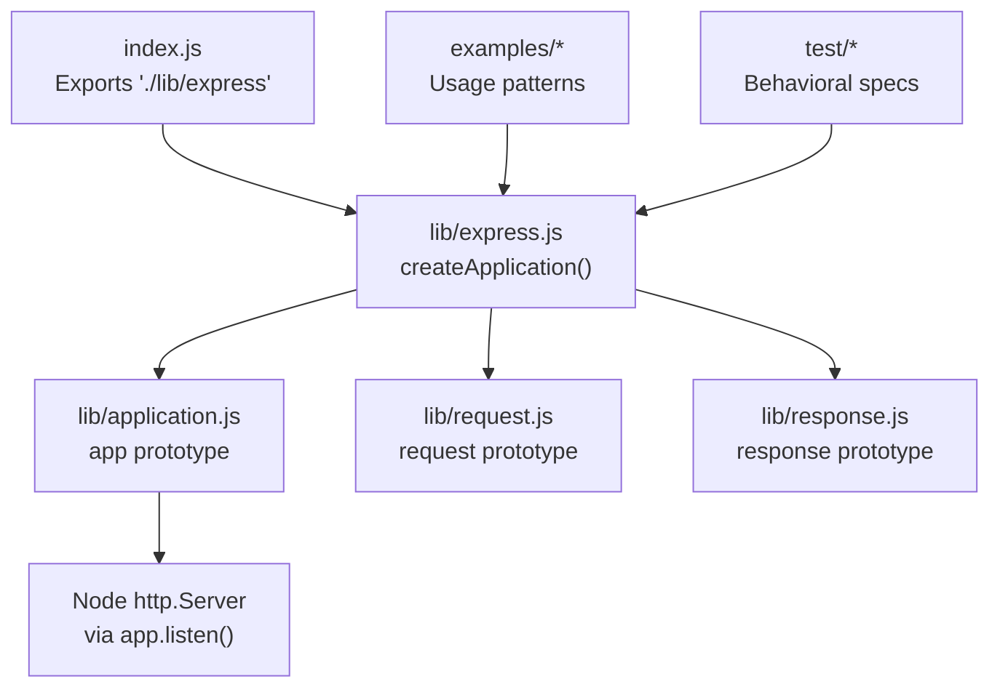
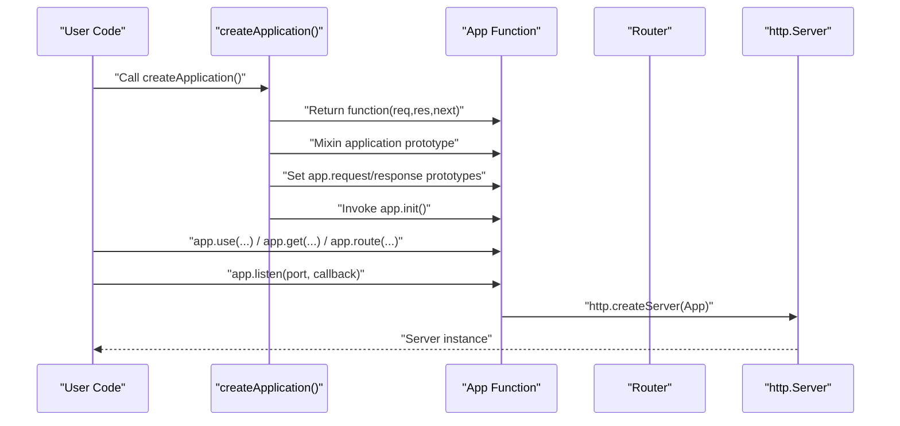
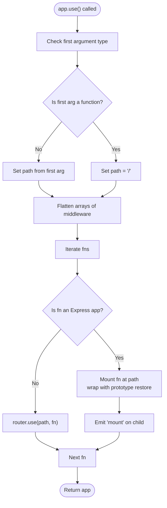
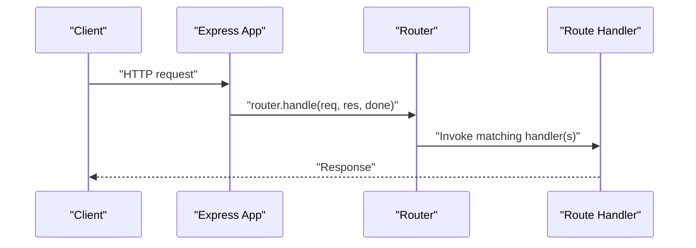
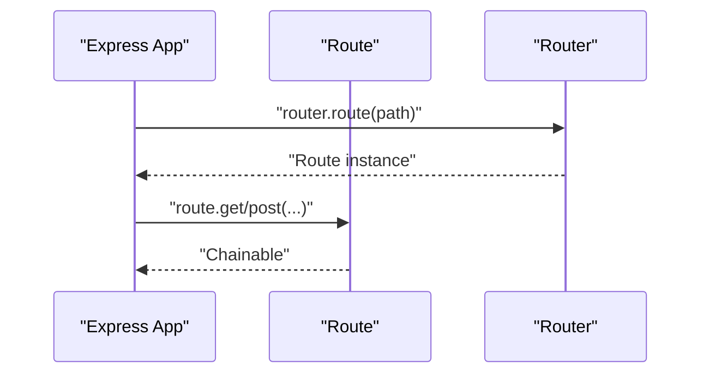
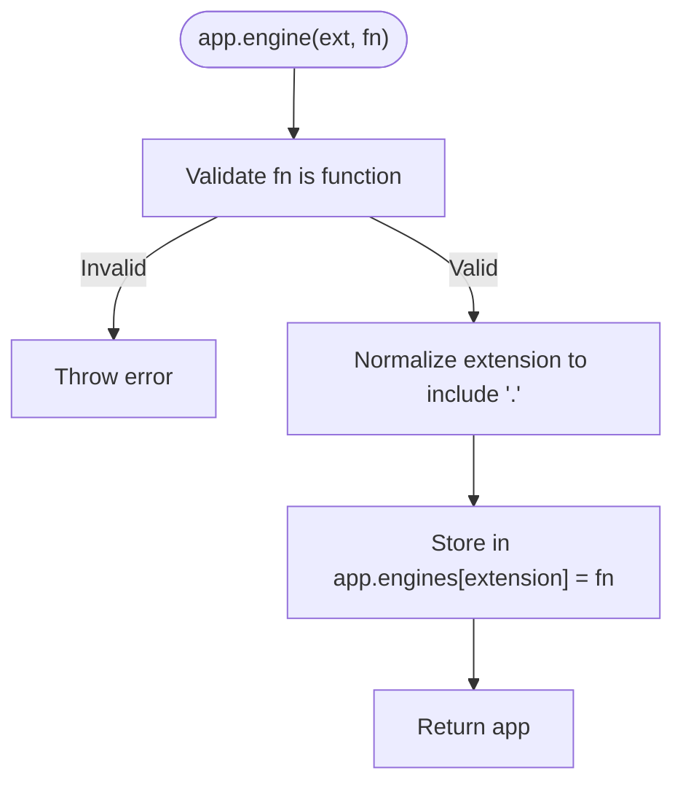
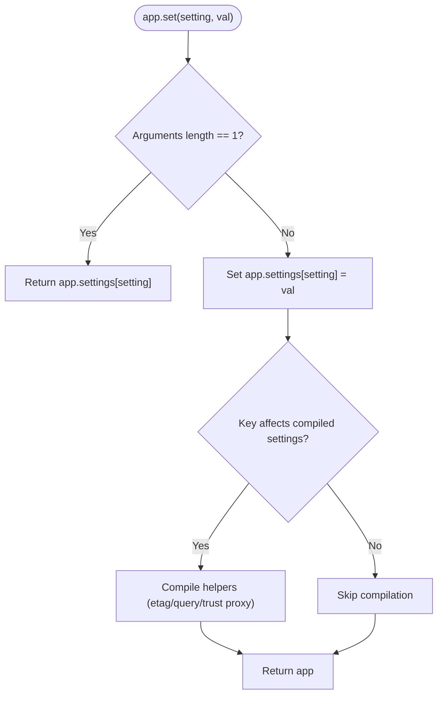
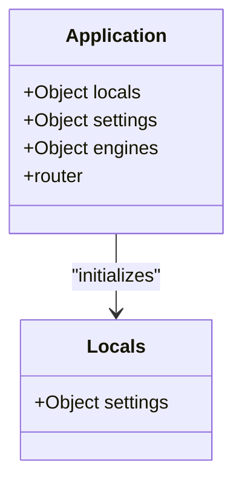
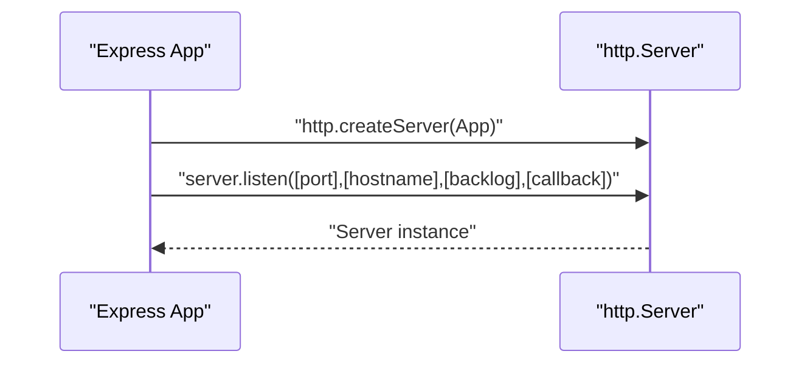
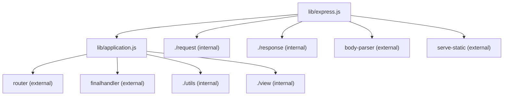

# Application API

<cite>
**Referenced Files in This Document**
- [lib/application.js](file://lib/application.js)
- [lib/express.js](file://lib/express.js)
- [examples/hello-world/index.js](file://examples/hello-world/index.js)
- [examples/multi-router/index.js](file://examples/multi-router/index.js)
- [examples/route-middleware/index.js](file://examples/route-middleware/index.js)
- [examples/view-locals/index.js](file://examples/view-locals/index.js)
- [examples/static-files/index.js](file://examples/static-files/index.js)
- [examples/session/index.js](file://examples/session/index.js)
- [test/app.use.js](file://test/app.use.js)
- [test/app.route.js](file://test/app.route.js)
- [test/app.locals.js](file://test/app.locals.js)
- [test/app.engine.js](file://test/app.engine.js)
- [test/app.listen.js](file://test/app.listen.js)
- [index.js](file://index.js)
- [package.json](file://package.json)
</cite>

## Table of Contents
1. [Introduction](#introduction)
2. [Project Structure](#project-structure)
3. [Core Components](#core-components)
4. [Architecture Overview](#architecture-overview)
5. [Detailed Component Analysis](#detailed-component-analysis)
6. [Dependency Analysis](#dependency-analysis)
7. [Performance Considerations](#performance-considerations)
8. [Troubleshooting Guide](#troubleshooting-guide)
9. [Conclusion](#conclusion)
10. [Appendices](#appendices)

## Introduction
This document provides comprehensive API documentation for the Express.js application object and its primary methods and properties. It focuses on the main application object methods including app.use(), app.get(), app.post(), app.route(), app.engine(), app.set(), app.get(), app.locals, app.settings, and app.listen(). For each method, you will find signatures, parameter types, return values, and practical usage examples drawn from the codebase. The document also explains application initialization, configuration options, middleware registration patterns, and route definition methods, with diagrams and references to concrete examples.

## Project Structure
Express exposes a factory function that creates an application instance. The application prototype is defined in the application module and is mixed into the returned function. The examples directory demonstrates common usage patterns, and the tests validate behavior and edge cases.

**Diagram sources**
- [index.js:11](file://index.js#L11)
- [lib/express.js:36-56](file://lib/express.js#L36-L56)
- [lib/application.js:598-606](file://lib/application.js#L598-L606)

**Section sources**
- [index.js:11](file://index.js#L11)
- [lib/express.js:36-56](file://lib/express.js#L36-L56)
- [package.json:1-100](file://package.json#L1-L100)

## Core Components
This section documents the core application object methods and properties that define Express behavior and configuration.

- app.use(fn | path, fn...)
  - Purpose: Registers middleware or mounts another Express application at a given path.
  - Signature: app.use([path,] fn[, fn...]) or app.use([paths], fn[, fn...]) where paths can be a string, RegExp, or array of either.
  - Parameters:
    - path: Optional string, RegExp, or array of strings/RegExp. Defaults to "/" when omitted.
    - fn: Function or array of functions. Can be Express applications (mounted) or standard middleware.
  - Returns: app (for chaining).
  - Behavior:
    - Accepts multiple functions and flattens arrays of middleware.
    - If fn is an Express app, it is mounted at path and receives a wrapper that restores req/res prototypes on completion.
    - Emits a "mount" event on the child app with the parent as argument.
  - Practical examples:
    - Mounting routers/controllers: [examples/multi-router/index.js:7-8](file://examples/multi-router/index.js#L7-L8)
    - Static file serving: [examples/static-files/index.js:22](file://examples/static-files/index.js#L22)
    - Session handling: [examples/session/index.js:16](file://examples/session/index.js#L16)
  - Related tests:
    - Mounting apps and paths: [test/app.use.js:21-123](file://test/app.use.js#L21-L123)
    - Path stripping and arrays: [test/app.use.js:258-542](file://test/app.use.js#L258-L542)

- app.get(path, fn...) and app.post(path, fn...) and other HTTP verbs
  - Purpose: Defines routes for specific HTTP methods or retrieves a setting via app.get(setting).
  - Signature: app.get(path, fn...) or app.get(setting). Other methods mirror this pattern.
  - Parameters:
    - path: String or RegExp for route definition.
    - fn...: One or more middleware/functions for the route.
  - Returns: app (for chaining).
  - Behavior:
    - When called with a single argument that is a string, app.get(setting) delegates to app.set(setting) internally.
    - Otherwise, delegates to app.route(path)[method](...args).
  - Practical examples:
    - Basic route: [examples/hello-world/index.js:7-9](file://examples/hello-world/index.js#L7-L9)
    - Route with middleware: [examples/route-middleware/index.js:74-76](file://examples/route-middleware/index.js#L74-L76)

- app.route(path)
  - Purpose: Returns a new Route instance for the given path.
  - Signature: app.route(path) -> Route
  - Parameters:
    - path: String or RegExp.
  - Returns: Route object supporting .get(), .post(), .all(), etc.
  - Behavior: Delegates to the internal router.
  - Practical examples:
    - Chaining multiple methods: [test/app.route.js:10-21](file://test/app.route.js#L10-L21)
    - Dynamic segments: [test/app.route.js:45-53](file://test/app.route.js#L45-L53)

- app.engine(ext, fn)
  - Purpose: Registers a template engine callback for a given file extension.
  - Signature: app.engine(extension, callback)
  - Parameters:
    - ext: String extension (leading dot optional).
    - fn: Function with signature (path, options, callback).
  - Returns: app (for chaining).
  - Behavior:
    - Stores engine in app.engines keyed by normalized extension.
    - Throws if callback is not a function.
  - Practical examples:
    - Custom engine mapping: [test/app.engine.js:18-30](file://test/app.engine.js#L18-L30)
    - Leading dot variants: [test/app.engine.js:39-51](file://test/app.engine.js#L39-L51)

- app.set(setting, value) and app.get(setting)
  - Purpose: Sets or retrieves application settings.
  - Signature: app.set(setting, value) -> app; app.get(setting) -> value
  - Parameters:
    - setting: String key.
    - value: Any value; when omitted, returns current value.
  - Returns: app (set) or value (get).
  - Behavior:
    - On setting certain keys, compiles internal helpers (e.g., etag, query parser, trust proxy).
    - Mounted children inherit parent settings.
  - Practical examples:
    - Views and engine: [examples/view-locals/index.js:12-13](file://examples/view-locals/index.js#L12-L13)
    - Settings propagation: [lib/application.js:109-122](file://lib/application.js#L109-L122)

- app.locals and app.settings
  - Purpose: Provides runtime configuration and shared data.
  - Properties:
    - app.locals: Plain object (null prototype) for data passed to views and middleware.
    - app.settings: Plain object holding configuration values.
  - Behavior:
    - app.locals defaults to an object with null prototype and includes a reference to app.settings.
  - Practical examples:
    - Locals usage: [examples/view-locals/index.js:23-37](file://examples/view-locals/index.js#L23-L37)
    - Locals inheritance: [test/app.locals.js:15-24](file://test/app.locals.js#L15-L24)

- app.listen([port | options][, hostname][, backlog][, callback])
  - Purpose: Creates an HTTP server and starts listening for connections.
  - Signature: app.listen([port | options][, hostname][, backlog][, callback]) -> http.Server
  - Parameters:
    - port: Number or 0 to pick any available port.
    - hostname: String host to bind to.
    - backlog: Number of unaccepted connections to queue.
    - callback: Function invoked with server.listen arguments; if provided as last argument, errors are emitted via once('error').
  - Returns: http.Server instance.
  - Behavior:
    - Wraps the app function as the server callback.
    - Supports callback-based error handling when provided.
  - Practical examples:
    - Basic listen: [examples/hello-world/index.js:13](file://examples/hello-world/index.js#L13)
    - Callback and options: [test/app.listen.js:27-37](file://test/app.listen.js#L27-L37)

**Section sources**
- [lib/application.js:190-244](file://lib/application.js#L190-L244)
- [lib/application.js:256-258](file://lib/application.js#L256-L258)
- [lib/application.js:294-308](file://lib/application.js#L294-L308)
- [lib/application.js:351-383](file://lib/application.js#L351-L383)
- [lib/application.js:471-482](file://lib/application.js#L471-L482)
- [lib/application.js:598-606](file://lib/application.js#L598-L606)
- [test/app.use.js:1-543](file://test/app.use.js#L1-L543)
- [test/app.route.js:1-198](file://test/app.route.js#L1-L198)
- [test/app.locals.js:1-27](file://test/app.locals.js#L1-L27)
- [test/app.engine.js:1-84](file://test/app.engine.js#L1-L84)
- [test/app.listen.js:1-56](file://test/app.listen.js#L1-L56)
- [examples/hello-world/index.js:7-15](file://examples/hello-world/index.js#L7-L15)
- [examples/multi-router/index.js:7-18](file://examples/multi-router/index.js#L7-L18)
- [examples/route-middleware/index.js:74-84](file://examples/route-middleware/index.js#L74-L84)
- [examples/view-locals/index.js:12-13](file://examples/view-locals/index.js#L12-L13)
- [examples/static-files/index.js:22](file://examples/static-files/index.js#L22)
- [examples/session/index.js:16](file://examples/session/index.js#L16)

## Architecture Overview
Express composes the application from a function that delegates to an internal router. The application prototype defines configuration, middleware, routing, and rendering capabilities. The factory function mixes the prototype into the returned function and initializes the app.

**Diagram sources**
- [lib/express.js:36-56](file://lib/express.js#L36-L56)
- [lib/application.js:59-83](file://lib/application.js#L59-L83)
- [lib/application.js:190-244](file://lib/application.js#L190-L244)
- [lib/application.js:598-606](file://lib/application.js#L598-L606)

**Section sources**
- [lib/express.js:36-56](file://lib/express.js#L36-L56)
- [lib/application.js:59-83](file://lib/application.js#L59-L83)
- [lib/application.js:190-244](file://lib/application.js#L190-L244)
- [lib/application.js:598-606](file://lib/application.js#L598-L606)

## Detailed Component Analysis

### app.use() Method
- Purpose: Register middleware or mount another Express app at a path.
- Key behaviors:
  - Path inference: If the first argument is not a function, it is treated as path.
  - Arrays: Flattened recursively; supports nested arrays.
  - Express app mounting: Child app is mounted with path and emits "mount".
  - Prototype restoration: When a mounted app handles a request, req/res prototypes are restored after completion.
- Error handling:
  - Throws when no middleware is provided.
  - Rejects non-function handlers for middleware paths.
- Practical usage patterns:
  - Mounting routers/controllers: [examples/multi-router/index.js:7-8](file://examples/multi-router/index.js#L7-L8)
  - Static assets: [examples/static-files/index.js:22](file://examples/static-files/index.js#L22)
  - Authentication/session: [examples/session/index.js:16](file://examples/session/index.js#L16)

**Diagram sources**
- [lib/application.js:190-244](file://lib/application.js#L190-L244)

**Section sources**
- [lib/application.js:190-244](file://lib/application.js#L190-L244)
- [test/app.use.js:21-123](file://test/app.use.js#L21-L123)
- [test/app.use.js:258-542](file://test/app.use.js#L258-L542)
- [examples/multi-router/index.js:7-8](file://examples/multi-router/index.js#L7-L8)
- [examples/static-files/index.js:22](file://examples/static-files/index.js#L22)
- [examples/session/index.js:16](file://examples/session/index.js#L16)

### app.get(), app.post(), and Other HTTP Verbs
- Purpose: Define routes for specific HTTP methods or retrieve settings.
- Behavior:
  - Single-string overload: app.get(setting) delegates to app.set(setting).
  - Otherwise: app.route(path)[method](...args) is used.
- Practical usage:
  - Basic route: [examples/hello-world/index.js:7-9](file://examples/hello-world/index.js#L7-L9)
  - Route with middleware: [examples/route-middleware/index.js:74-76](file://examples/route-middleware/index.js#L74-L76)

**Diagram sources**
- [lib/application.js:471-482](file://lib/application.js#L471-L482)
- [lib/application.js:177](file://lib/application.js#L177)

**Section sources**
- [lib/application.js:471-482](file://lib/application.js#L471-L482)
- [examples/hello-world/index.js:7-9](file://examples/hello-world/index.js#L7-L9)
- [examples/route-middleware/index.js:74-76](file://examples/route-middleware/index.js#L74-L76)

### app.route() Method
- Purpose: Obtain a Route instance for a path to chain multiple HTTP methods.
- Behavior:
  - Delegates to the internal router.
  - Supports dynamic segments and promises.
- Practical usage:
  - Chaining methods: [test/app.route.js:10-21](file://test/app.route.js#L10-L21)
  - Dynamic parameters: [test/app.route.js:45-53](file://test/app.route.js#L45-L53)

**Diagram sources**
- [lib/application.js:256-258](file://lib/application.js#L256-L258)
- [test/app.route.js:10-21](file://test/app.route.js#L10-L21)

**Section sources**
- [lib/application.js:256-258](file://lib/application.js#L256-L258)
- [test/app.route.js:1-198](file://test/app.route.js#L1-L198)

### app.engine() Method
- Purpose: Register a template engine for a file extension.
- Behavior:
  - Normalizes extension to include leading dot.
  - Stores engine in app.engines.
  - Throws if callback is not a function.
- Practical usage:
  - Custom engine mapping: [test/app.engine.js:18-30](file://test/app.engine.js#L18-L30)
  - Engine with view engine setting: [test/app.engine.js:53-66](file://test/app.engine.js#L53-L66)

**Diagram sources**
- [lib/application.js:294-308](file://lib/application.js#L294-L308)
- [test/app.engine.js:32-37](file://test/app.engine.js#L32-L37)

**Section sources**
- [lib/application.js:294-308](file://lib/application.js#L294-L308)
- [test/app.engine.js:1-84](file://test/app.engine.js#L1-L84)

### app.set(), app.get(), app.enable(), app.disable(), app.enabled(), app.disabled()
- Purpose: Manage application settings and flags.
- Behavior:
  - app.set(setting, value) sets a value and triggers reconfiguration for specific keys (e.g., etag, query parser, trust proxy).
  - app.get(setting) retrieves the value.
  - Flags: enable/disable toggle truthiness; enabled/disabled check flag state.
- Practical usage:
  - Views and engine: [examples/view-locals/index.js:12-13](file://examples/view-locals/index.js#L12-L13)
  - Mounted inheritance: [lib/application.js:109-122](file://lib/application.js#L109-L122)

**Diagram sources**
- [lib/application.js:351-383](file://lib/application.js#L351-L383)

**Section sources**
- [lib/application.js:351-383](file://lib/application.js#L351-L383)
- [examples/view-locals/index.js:12-13](file://examples/view-locals/index.js#L12-L13)
- [lib/application.js:109-122](file://lib/application.js#L109-L122)

### app.locals and app.settings
- Purpose: Provide shared data and configuration.
- app.locals:
  - Null-prototype object initialized by the application.
  - Includes a reference to app.settings by default.
- app.settings:
  - Holds configuration values; inherited by mounted apps.
- Practical usage:
  - Locals in middleware and views: [examples/view-locals/index.js:23-37](file://examples/view-locals/index.js#L23-L37)
  - Locals inheritance: [test/app.locals.js:15-24](file://test/app.locals.js#L15-L24)

**Diagram sources**
- [lib/application.js:124-132](file://lib/application.js#L124-L132)
- [test/app.locals.js:15-24](file://test/app.locals.js#L15-L24)

**Section sources**
- [lib/application.js:124-132](file://lib/application.js#L124-L132)
- [test/app.locals.js:1-27](file://test/app.locals.js#L1-L27)

### app.listen() Method
- Purpose: Start an HTTP server bound to the application.
- Signature: app.listen([port | options][, hostname][, backlog][, callback]) -> http.Server
- Behavior:
  - Creates http.Server with the app as callback.
  - If last argument is a function, errors are captured via once('error') and passed to the callback.
- Practical usage:
  - Basic listen: [examples/hello-world/index.js:13](file://examples/hello-world/index.js#L13)
  - Options and callback: [test/app.listen.js:27-37](file://test/app.listen.js#L27-L37)

**Diagram sources**
- [lib/application.js:598-606](file://lib/application.js#L598-L606)
- [test/app.listen.js:27-37](file://test/app.listen.js#L27-L37)

**Section sources**
- [lib/application.js:598-606](file://lib/application.js#L598-L606)
- [test/app.listen.js:1-56](file://test/app.listen.js#L1-L56)
- [examples/hello-world/index.js:13](file://examples/hello-world/index.js#L13)

## Dependency Analysis
Express depends on several core modules and external libraries. The application prototype relies on the router, finalhandler, and utility functions for configuration and rendering.

**Diagram sources**
- [lib/application.js:16-26](file://lib/application.js#L16-L26)
- [lib/express.js:15-21](file://lib/express.js#L15-L21)

**Section sources**
- [lib/application.js:16-26](file://lib/application.js#L16-L26)
- [lib/express.js:15-21](file://lib/express.js#L15-L21)
- [package.json:34-62](file://package.json#L34-L62)

## Performance Considerations
- Middleware ordering: Place frequently hit middleware earlier to reduce overhead.
- Static assets: Use express.static() early in the stack to avoid unnecessary downstream processing.
- View caching: Enable view cache in production via settings to reuse compiled templates.
- Trust proxy: Configure trust proxy appropriately to avoid redundant parsing and improve header handling accuracy.
- Router sensitivity: Enable strict routing and case-sensitive routing only when needed to minimize route matching overhead.

## Troubleshooting Guide
- app.use() requires a middleware function
  - Symptom: TypeError when calling app.use() without a function.
  - Cause: No handler provided or invalid type.
  - Fix: Ensure at least one function is passed or use arrays of functions.
  - Reference: [test/app.use.js:259-262](file://test/app.use.js#L259-L262)

- Mounting apps and paths
  - Symptom: Routes not matching under mount points.
  - Cause: Incorrect path or missing trailing slash nuances.
  - Fix: Verify path semantics and test with supertest-style assertions.
  - Reference: [test/app.use.js:343-362](file://test/app.use.js#L343-L362)

- app.engine() callback required
  - Symptom: Error when registering engine without a function.
  - Cause: Missing or invalid callback.
  - Fix: Pass a function with signature (path, options, callback).
  - Reference: [test/app.engine.js:32-37](file://test/app.engine.js#L32-L37)

- app.listen() port already in use
  - Symptom: EADDRINUSE error when binding to a port.
  - Cause: Port conflict.
  - Fix: Choose a different port or reuse server address for binding.
  - Reference: [test/app.listen.js:14-26](file://test/app.listen.js#L14-L26)

**Section sources**
- [test/app.use.js:259-262](file://test/app.use.js#L259-L262)
- [test/app.use.js:343-362](file://test/app.use.js#L343-L362)
- [test/app.engine.js:32-37](file://test/app.engine.js#L32-L37)
- [test/app.listen.js:14-26](file://test/app.listen.js#L14-L26)

## Conclusion
Express’s application object provides a concise yet powerful API for building web applications. The documented methods and properties—app.use(), app.get(), app.post(), app.route(), app.engine(), app.set()/app.get(), app.locals, app.settings, and app.listen()—cover initialization, configuration, middleware registration, route definition, templating, and server startup. The examples and tests demonstrate common patterns and advanced configurations, enabling robust and maintainable applications.

## Appendices
- Initialization and prototypes
  - Application initialization and prototype mixing: [lib/express.js:36-56](file://lib/express.js#L36-L56)
  - Default configuration and settings: [lib/application.js:90-141](file://lib/application.js#L90-L141)

- Practical usage examples
  - Hello world: [examples/hello-world/index.js:7-15](file://examples/hello-world/index.js#L7-L15)
  - Multi-router: [examples/multi-router/index.js:7-18](file://examples/multi-router/index.js#L7-L18)
  - Route middleware: [examples/route-middleware/index.js:74-84](file://examples/route-middleware/index.js#L74-L84)
  - View locals: [examples/view-locals/index.js:26-108](file://examples/view-locals/index.js#L26-L108)
  - Static files: [examples/static-files/index.js:22](file://examples/static-files/index.js#L22)
  - Sessions: [examples/session/index.js:16](file://examples/session/index.js#L16)

**Section sources**
- [lib/express.js:36-56](file://lib/express.js#L36-L56)
- [lib/application.js:90-141](file://lib/application.js#L90-L141)
- [examples/hello-world/index.js:7-15](file://examples/hello-world/index.js#L7-L15)
- [examples/multi-router/index.js:7-18](file://examples/multi-router/index.js#L7-L18)
- [examples/route-middleware/index.js:74-84](file://examples/route-middleware/index.js#L74-L84)
- [examples/view-locals/index.js:26-108](file://examples/view-locals/index.js#L26-L108)
- [examples/static-files/index.js:22](file://examples/static-files/index.js#L22)
- [examples/session/index.js:16](file://examples/session/index.js#L16)