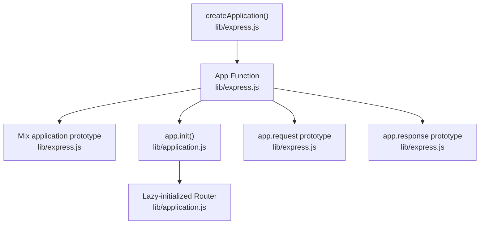
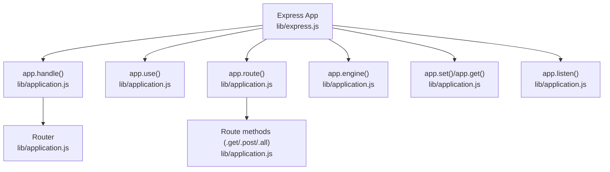
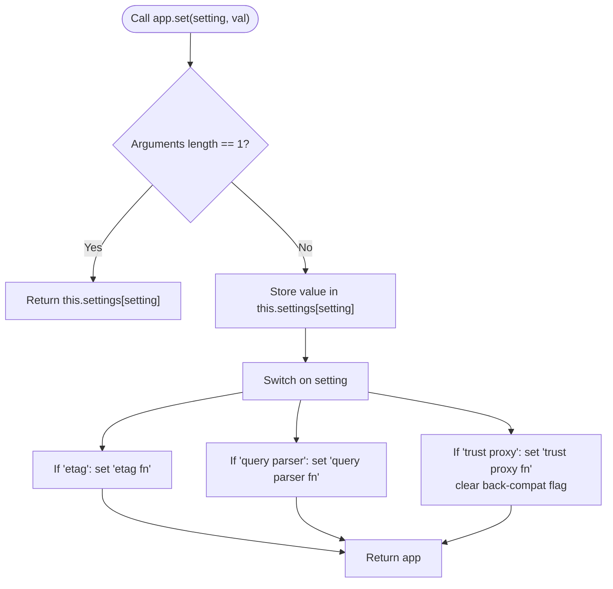
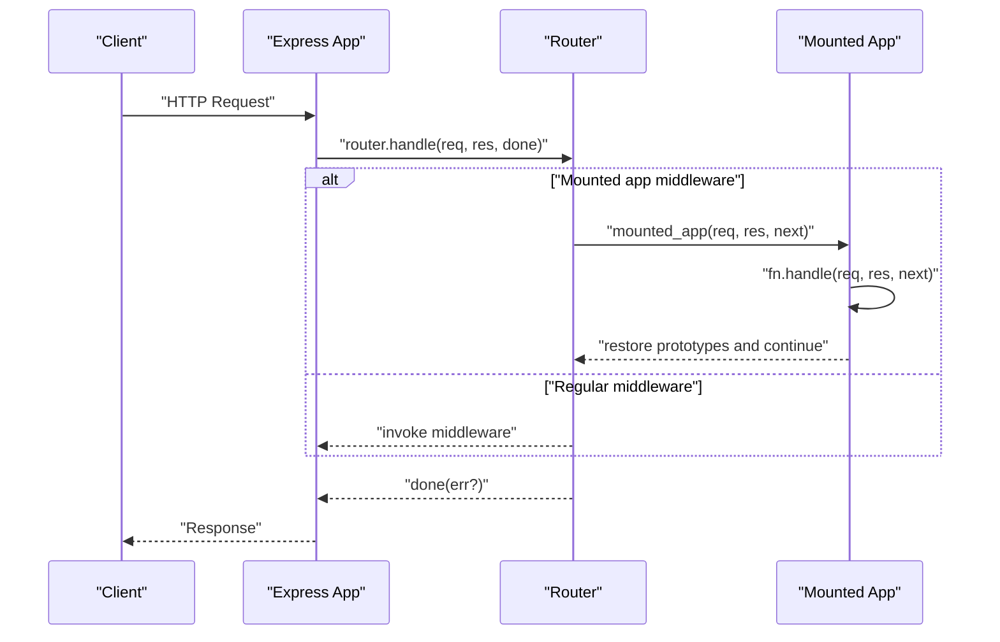
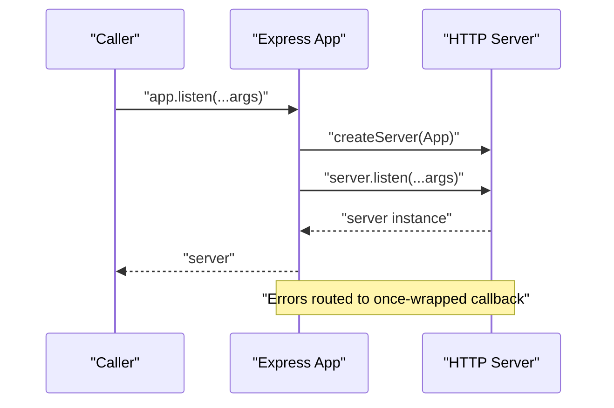
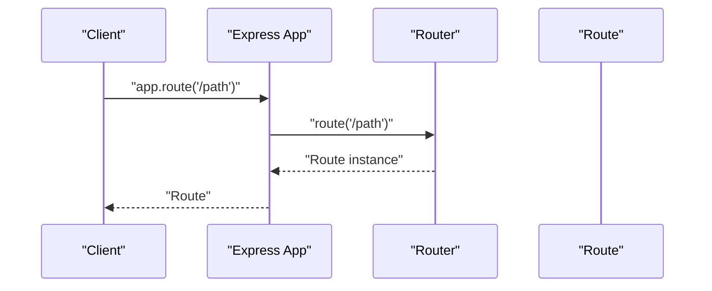
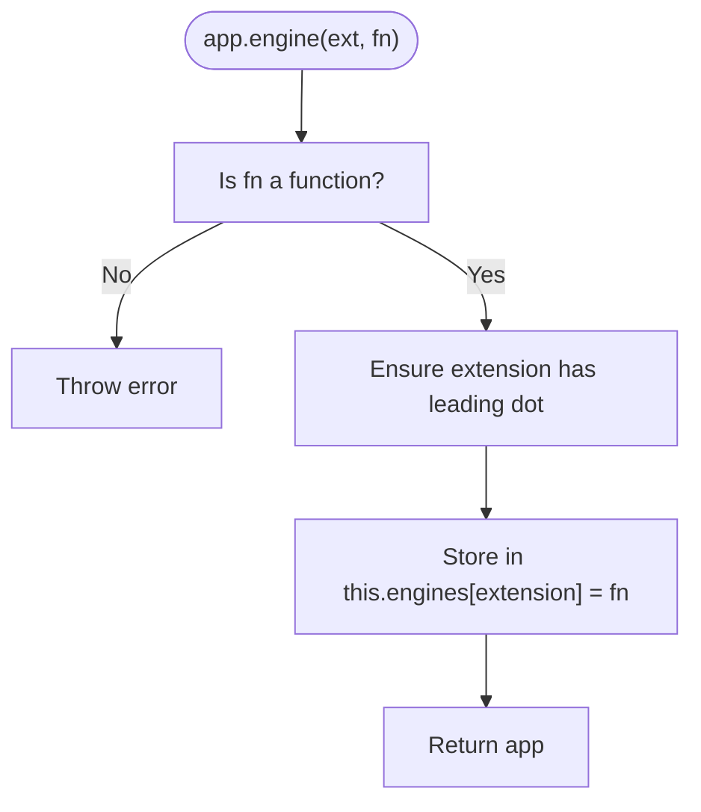
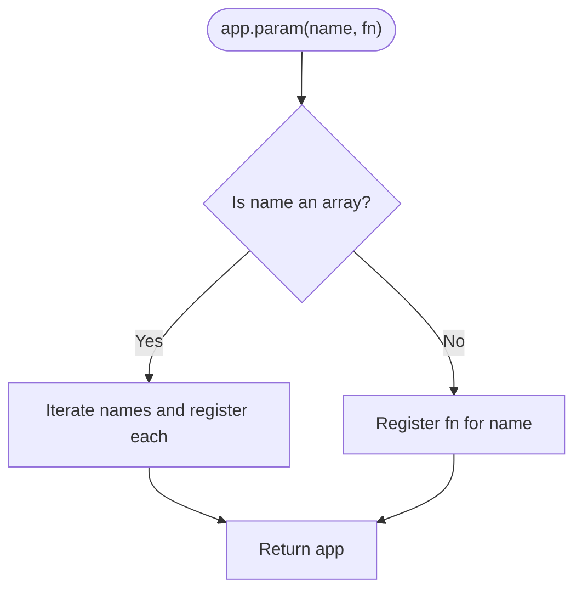
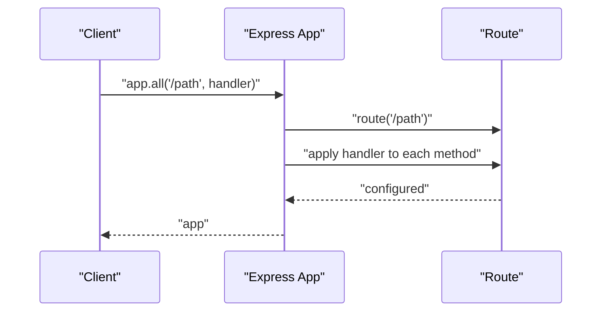
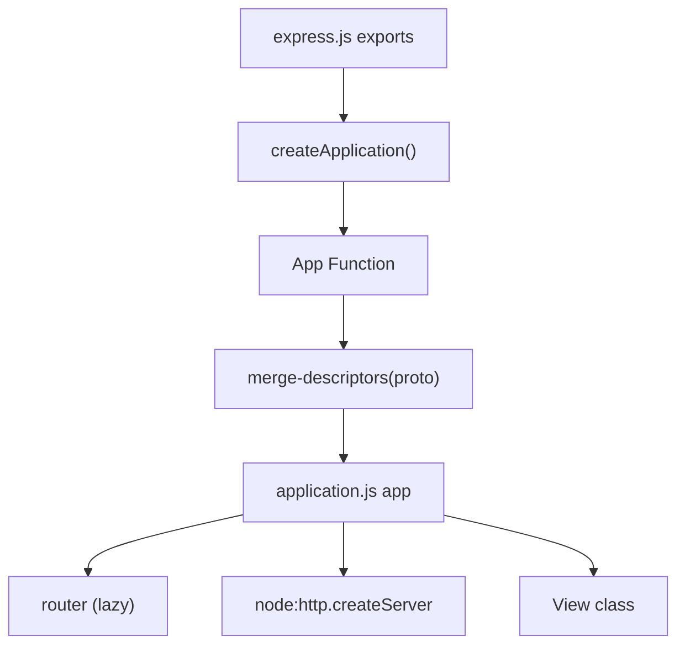

# Application Methods

<cite>
**Referenced Files in This Document**
- [lib/application.js](file://lib/application.js)
- [lib/express.js](file://lib/express.js)
- [test/app.use.js](file://test/app.use.js)
- [test/app.listen.js](file://test/app.listen.js)
- [test/app.route.js](file://test/app.route.js)
- [test/app.engine.js](file://test/app.engine.js)
- [test/app.param.js](file://test/app.param.js)
- [test/app.all.js](file://test/app.all.js)
- [examples/hello-world/index.js](file://examples/hello-world/index.js)
- [examples/multi-router/index.js](file://examples/multi-router/index.js)
- [examples/route-separation/index.js](file://examples/route-separation/index.js)
- [examples/view-locals/index.js](file://examples/view-locals/index.js)
</cite>

## Table of Contents
1. [Introduction](#introduction)
2. [Project Structure](#project-structure)
3. [Core Components](#core-components)
4. [Architecture Overview](#architecture-overview)
5. [Detailed Component Analysis](#detailed-component-analysis)
6. [Dependency Analysis](#dependency-analysis)
7. [Performance Considerations](#performance-considerations)
8. [Troubleshooting Guide](#troubleshooting-guide)
9. [Conclusion](#conclusion)

## Introduction
This document provides comprehensive API documentation for Express.js application-level methods. It focuses on the public methods exposed on the Express application object, including configuration management (app.set(), app.get()), middleware registration (app.use()), server startup (app.listen()), route creation (app.route()), template engine registration (app.engine()), parameter handling (app.param()), and wildcard routing (app.all()). For each method, we describe signatures, parameters, return values, method chaining behavior, configuration options, error conditions, and inheritance in mounted applications. Practical usage examples are referenced from the repository’s tests and examples.

## Project Structure
Express exposes the application object via a factory that mixes application-level methods onto a function and initializes internal state. The application prototype defines the public API, while the factory sets up request/response prototypes and invokes initialization.

**Diagram sources**
- [lib/express.js:36-56](file://lib/express.js#L36-L56)
- [lib/application.js:59-83](file://lib/application.js#L59-L83)

**Section sources**
- [lib/express.js:36-56](file://lib/express.js#L36-L56)
- [lib/application.js:59-83](file://lib/application.js#L59-L83)

## Core Components
This section documents the primary application-level methods with their behavior, parameters, return values, and usage patterns.

- app.set(setting, value) and app.get(setting)
  - Signature: app.set(setting: string): string | app; app.set(setting: string, value: any): app
  - Description: Sets or retrieves a configuration value. When retrieving, app.get(setting) returns the stored value. Certain settings trigger derived settings (e.g., etag, query parser, trust proxy).
  - Return: app for chaining when setting; the stored value when getting.
  - Chaining: Yes.
  - Notes: Mounted applications inherit parent settings and prototypes.
  - Examples:
    - [examples/route-separation/index.js:21-22](file://examples/route-separation/index.js#L21-L22)
    - [examples/view-locals/index.js:12-13](file://examples/view-locals/index.js#L12-L13)

- app.use([path,] ...middleware)
  - Signature: app.use([path]: string | RegExp | Array, ...fn: function | app): app
  - Description: Registers middleware or mounts another Express app at the given path. Supports arrays and nested arrays of middleware. When mounting another app, the child app receives the parent’s request/response prototypes and settings during handling.
  - Return: app for chaining.
  - Behavior:
    - Accepts multiple middleware as individual arguments or arrays.
    - Path defaults to "/" when omitted.
    - Mounting an app sets mountpath and parent, emits "mount", and wraps the mounted app’s handle to restore prototypes.
  - Error conditions:
    - Throws if no middleware is provided.
    - Throws if a non-function is passed as middleware.
  - Examples:
    - [test/app.use.js:125-150](file://test/app.use.js#L125-L150)
    - [test/app.use.js:258-320](file://test/app.use.js#L258-L320)
    - [test/app.use.js:448-467](file://test/app.use.js#L448-L467)
    - [examples/multi-router/index.js:7-8](file://examples/multi-router/index.js#L7-L8)

- app.listen([port | options | callback]...)
  - Signature: app.listen(...args): http.Server
  - Description: Creates an HTTP server and starts listening. Accepts port, hostname, backlog, and callback. Wraps errors via once to ensure callback is invoked on error.
  - Return: http.Server instance.
  - Examples:
    - [test/app.listen.js:7-13](file://test/app.listen.js#L7-L13)
    - [test/app.listen.js:27-37](file://test/app.listen.js#L27-L37)
    - [examples/hello-world/index.js:12-14](file://examples/hello-world/index.js#L12-L14)

- app.route(path)
  - Signature: app.route(path: string | RegExp): Route
  - Description: Returns a new Route instance for the given path. Route instances support .get(), .post(), .all(), etc., enabling method-specific handlers on the same path.
  - Return: Route object.
  - Examples:
    - [test/app.route.js:10-21](file://test/app.route.js#L10-L21)
    - [test/app.route.js:42-53](file://test/app.route.js#L42-L53)

- app.engine(ext, callback)
  - Signature: app.engine(ext: string, callback: function): app
  - Description: Registers a template engine for a given extension. The callback must match the expected signature for rendering. Works with or without leading dot.
  - Return: app for chaining.
  - Error conditions:
    - Throws if callback is not a function.
  - Examples:
    - [test/app.engine.js:18-30](file://test/app.engine.js#L18-L30)
    - [test/app.engine.js:39-51](file://test/app.engine.js#L39-L51)
    - [test/app.engine.js:53-66](file://test/app.engine.js#L53-L66)

- app.param(name | names, callback)
  - Signature: app.param(name: string | string[], callback: function(req, res, next, value)): app
  - Description: Registers parameter pre-processing logic. Supports a single name or an array of names. The callback runs once per unique parameter value within a request lifecycle.
  - Return: app for chaining.
  - Examples:
    - [test/app.param.js:8-36](file://test/app.param.js#L8-L36)
    - [test/app.param.js:40-58](file://test/app.param.js#L40-L58)
    - [test/app.param.js:60-86](file://test/app.param.js#L60-L86)

- app.all(path, ...)
  - Signature: app.all(path: string | RegExp, ...handlers): app
  - Description: Registers middleware/handlers for all HTTP methods on the given path. Internally applies the route to each method.
  - Return: app for chaining.
  - Examples:
    - [test/app.all.js:8-23](file://test/app.all.js#L8-L23)
    - [test/app.all.js:25-37](file://test/app.all.js#L25-L37)

**Section sources**
- [lib/application.js:351-383](file://lib/application.js#L351-L383)
- [lib/application.js:598-606](file://lib/application.js#L598-L606)
- [lib/application.js:256-258](file://lib/application.js#L256-L258)
- [lib/application.js:294-308](file://lib/application.js#L294-L308)
- [lib/application.js:322-334](file://lib/application.js#L322-L334)
- [lib/application.js:494-503](file://lib/application.js#L494-L503)
- [test/app.use.js:258-320](file://test/app.use.js#L258-L320)
- [test/app.listen.js:7-13](file://test/app.listen.js#L7-L13)
- [test/app.route.js:10-21](file://test/app.route.js#L10-L21)
- [test/app.engine.js:18-30](file://test/app.engine.js#L18-L30)
- [test/app.param.js:8-36](file://test/app.param.js#L8-L36)
- [test/app.all.js:8-23](file://test/app.all.js#L8-L23)

## Architecture Overview
The Express application object is a function that delegates incoming requests to an internal Router. Middleware registered via app.use() is attached to the Router. Route-specific handlers are attached via app.route(), which returns a Route object. Template rendering is delegated to the View class and configured via app.set() and app.engine().

**Diagram sources**
- [lib/express.js:36-56](file://lib/express.js#L36-L56)
- [lib/application.js:152-178](file://lib/application.js#L152-L178)
- [lib/application.js:190-244](file://lib/application.js#L190-L244)
- [lib/application.js:256-258](file://lib/application.js#L256-L258)
- [lib/application.js:294-308](file://lib/application.js#L294-L308)
- [lib/application.js:351-383](file://lib/application.js#L351-L383)
- [lib/application.js:598-606](file://lib/application.js#L598-L606)

## Detailed Component Analysis

### app.set(setting, value) and app.get(setting)
- Purpose: Centralized configuration management with derived settings for performance and security.
- Derived settings:
  - etag -> etag fn
  - query parser -> query parser fn
  - trust proxy -> trust proxy fn and a compatibility flag
- Method chaining: Yes, returns app when setting.
- Inheritance: Mounted apps inherit settings and prototypes from the parent.

**Diagram sources**
- [lib/application.js:351-383](file://lib/application.js#L351-L383)

**Section sources**
- [lib/application.js:351-383](file://lib/application.js#L351-L383)
- [lib/application.js:90-141](file://lib/application.js#L90-L141)

### app.use([path,] ...middleware)
- Purpose: Register middleware or mount another Express app at a given path.
- Behavior:
  - Flattens arrays and nested arrays of middleware.
  - Defaults path to "/" when omitted.
  - For non-Express apps, forwards to Router.use().
  - For Express apps, sets mountpath and parent, wraps handle to restore prototypes, and emits "mount".
- Error conditions:
  - Throws if no middleware provided.
  - Throws if any item is not a function.

**Diagram sources**
- [lib/application.js:190-244](file://lib/application.js#L190-L244)
- [lib/application.js:152-178](file://lib/application.js#L152-L178)

**Section sources**
- [lib/application.js:190-244](file://lib/application.js#L190-L244)
- [test/app.use.js:258-320](file://test/app.use.js#L258-L320)
- [test/app.use.js:448-467](file://test/app.use.js#L448-L467)

### app.listen([port | options | callback]...)
- Purpose: Start the HTTP server and listen for connections.
- Behavior:
  - Delegates to node:http.createServer(this).
  - Wraps the final callback with once to ensure error callback on server errors.
  - Accepts port, hostname, backlog, and callback in various combinations.

**Diagram sources**
- [lib/application.js:598-606](file://lib/application.js#L598-L606)
- [test/app.listen.js:7-13](file://test/app.listen.js#L7-L13)

**Section sources**
- [lib/application.js:598-606](file://lib/application.js#L598-L606)
- [test/app.listen.js:27-37](file://test/app.listen.js#L27-L37)

### app.route(path)
- Purpose: Create a Route instance for a path to define multiple HTTP method handlers.
- Behavior: Proxies to Router.route(path).

**Diagram sources**
- [lib/application.js:256-258](file://lib/application.js#L256-L258)

**Section sources**
- [lib/application.js:256-258](file://lib/application.js#L256-L258)
- [test/app.route.js:10-21](file://test/app.route.js#L10-L21)

### app.engine(ext, callback)
- Purpose: Register a template engine for a given extension.
- Behavior:
  - Ensures extension includes a leading dot.
  - Stores the engine in this.engines.
- Error condition:
  - Throws if callback is not a function.

**Diagram sources**
- [lib/application.js:294-308](file://lib/application.js#L294-L308)

**Section sources**
- [lib/application.js:294-308](file://lib/application.js#L294-L308)
- [test/app.engine.js:32-37](file://test/app.engine.js#L32-L37)

### app.param(name | names, callback)
- Purpose: Define parameter pre-processing logic for one or more parameter names.
- Behavior:
  - Accepts a single name or an array of names.
  - Callback runs once per unique parameter value per request.
  - Supports deferring to the next route or throwing errors.

**Diagram sources**
- [lib/application.js:322-334](file://lib/application.js#L322-L334)

**Section sources**
- [lib/application.js:322-334](file://lib/application.js#L322-L334)
- [test/app.param.js:8-36](file://test/app.param.js#L8-L36)

### app.all(path, ...)
- Purpose: Register middleware/handlers for all HTTP methods at a path.
- Behavior:
  - Creates a Route and applies the given handlers to each HTTP method.

**Diagram sources**
- [lib/application.js:494-503](file://lib/application.js#L494-L503)

**Section sources**
- [lib/application.js:494-503](file://lib/application.js#L494-L503)
- [test/app.all.js:8-23](file://test/app.all.js#L8-L23)

## Dependency Analysis
Express composes the application object by mixing application methods onto a function and initializing request/response prototypes. The application prototype depends on Router for route handling and on node:http for server creation.

**Diagram sources**
- [lib/express.js:36-56](file://lib/express.js#L36-L56)
- [lib/application.js:59-83](file://lib/application.js#L59-L83)
- [lib/application.js:152-178](file://lib/application.js#L152-L178)

**Section sources**
- [lib/express.js:36-56](file://lib/express.js#L36-L56)
- [lib/application.js:59-83](file://lib/application.js#L59-L83)

## Performance Considerations
- app.set() triggers derived settings for performance-sensitive features (e.g., ETag, query parsing, trust proxy). Choose appropriate values to balance security and performance.
- app.use() flattens arrays of middleware; prefer batching middleware in arrays to reduce repeated calls and improve throughput.
- app.route() creates isolated middleware stacks per path; use it to minimize unnecessary middleware invocations on shared paths.
- Mounted applications share the parent’s request/response prototypes and settings, reducing duplication and improving consistency.

[No sources needed since this section provides general guidance]

## Troubleshooting Guide
- app.use() requires a middleware function:
  - Symptom: TypeError when calling app.use() without a function.
  - Resolution: Ensure at least one function is provided or wrap non-functions appropriately.
  - Reference: [test/app.use.js:259-262](file://test/app.use.js#L259-L262)

- app.engine() callback must be a function:
  - Symptom: Error when registering an engine without a callback.
  - Resolution: Pass a function with the expected signature.
  - Reference: [test/app.engine.js:32-37](file://test/app.engine.js#L32-L37)

- Mounted app inheritance:
  - Symptom: Unexpected settings or prototypes in child app.
  - Resolution: Understand that mounted apps inherit settings and prototypes from the parent during the "mount" event.
  - Reference: [lib/application.js:109-122](file://lib/application.js#L109-L122)

- app.listen() error handling:
  - Symptom: Port already in use.
  - Resolution: Use a different port or handle the error callback.
  - Reference: [test/app.listen.js:14-26](file://test/app.listen.js#L14-L26)

**Section sources**
- [test/app.use.js:259-262](file://test/app.use.js#L259-L262)
- [test/app.engine.js:32-37](file://test/app.engine.js#L32-L37)
- [lib/application.js:109-122](file://lib/application.js#L109-L122)
- [test/app.listen.js:14-26](file://test/app.listen.js#L14-L26)

## Conclusion
Express’s application-level methods form a cohesive API for configuration, middleware composition, routing, rendering, and server lifecycle management. Understanding method chaining, error conditions, and inheritance in mounted applications enables robust and maintainable applications. The included examples and tests demonstrate real-world usage patterns across common scenarios.