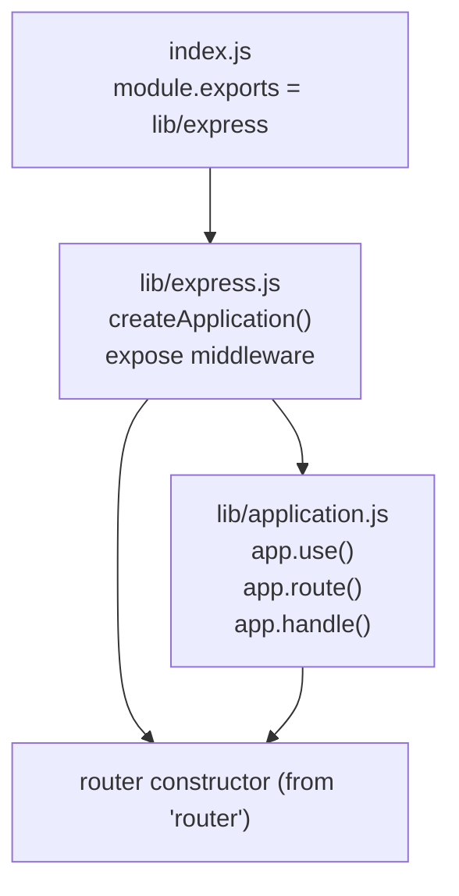
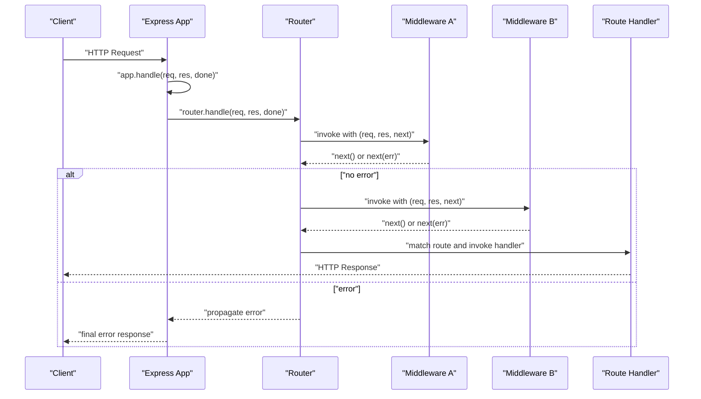
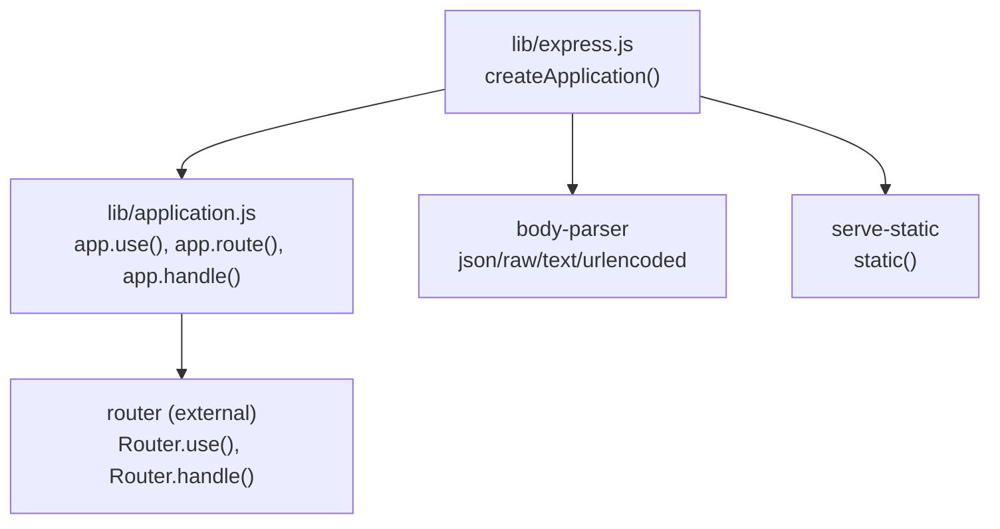

# Middleware API

<cite>
**Referenced Files in This Document**
- [lib/application.js](file://lib/application.js)
- [lib/express.js](file://lib/express.js)
- [index.js](file://index.js)
- [examples/route-middleware/index.js](file://examples/route-middleware/index.js)
- [examples/multi-router/index.js](file://examples/multi-router/index.js)
- [examples/error/index.js](file://examples/error/index.js)
- [examples/static-files/index.js](file://examples/static-files/index.js)
- [test/app.use.js](file://test/app.use.js)
- [test/app.route.js](file://test/app.route.js)
- [test/app.js](file://test/app.js)
- [test/Router.js](file://test/Router.js)
</cite>

## Table of Contents
1. [Introduction](#introduction)
2. [Project Structure](#project-structure)
3. [Core Components](#core-components)
4. [Architecture Overview](#architecture-overview)
5. [Detailed Component Analysis](#detailed-component-analysis)
6. [Dependency Analysis](#dependency-analysis)
7. [Performance Considerations](#performance-considerations)
8. [Troubleshooting Guide](#troubleshooting-guide)
9. [Conclusion](#conclusion)
10. [Appendices](#appendices)

## Introduction
This document provides comprehensive API documentation for Express.js middleware functions and middleware-related methods. It focuses on:
- Middleware function signatures and the next() callback usage
- Error handling patterns and error-handling middleware
- Middleware composition techniques and execution order
- Built-in middleware methods such as app.use(), app.route(), and router methods
- Middleware scope, context, and how they integrate with the request/response lifecycle

The goal is to help developers understand how Express middleware works, how to compose it effectively, and how to build robust applications using middleware patterns.

## Project Structure
Express exposes middleware APIs via the application prototype and the exported helpers. The primary entry point re-exports the application factory and middleware helpers.

**Diagram sources**
- [index.js:11](file://index.js#L11)
- [lib/express.js:36-56](file://lib/express.js#L36-L56)
- [lib/application.js:59-83](file://lib/application.js#L59-L83)

**Section sources**
- [index.js:11](file://index.js#L11)
- [lib/express.js:36-56](file://lib/express.js#L36-L56)
- [lib/application.js:59-83](file://lib/application.js#L59-L83)

## Core Components
- Application middleware registration: app.use()
- Route-scoped middleware: app.route()
- Request/response lifecycle: app.handle()
- Built-in middleware helpers: json, raw, text, urlencoded, static

Key behaviors:
- app.use() accepts middleware functions, arrays of middleware, or nested arrays, and supports optional path prefixes
- app.route() returns a Route instance for a given path, enabling method-specific middleware per route
- app.handle() orchestrates the request lifecycle and delegates to the internal router
- Built-in middleware helpers are exposed for JSON, raw, text, urlencoded, and static file serving

**Section sources**
- [lib/application.js:190-244](file://lib/application.js#L190-L244)
- [lib/application.js:256-258](file://lib/application.js#L256-L258)
- [lib/application.js:152-178](file://lib/application.js#L152-L178)
- [lib/express.js:77-82](file://lib/express.js#L77-L82)

## Architecture Overview
Express middleware forms a layered pipeline. Requests enter the application via app.handle(), which sets up request/response prototypes and delegates to the internal router. Middleware registered via app.use() runs globally (or under a path), while route-specific middleware is attached to individual HTTP methods on a Route.

**Diagram sources**
- [lib/application.js:152-178](file://lib/application.js#L152-L178)
- [lib/application.js:190-244](file://lib/application.js#L190-L244)
- [test/Router.js:162-178](file://test/Router.js#L162-L178)

## Detailed Component Analysis

### app.use() API
Purpose:
- Register middleware functions globally or under a path
- Accept arrays and nested arrays of middleware
- Support mounting other Express apps under a path

Behavior highlights:
- Path inference: if the first argument is not a function, it is treated as a path
- Flattening: accepts arrays and nested arrays of middleware and flattens them
- Express app mounting: when a function-like object with handle/set is provided, it is mounted under the given path
- Validation: throws a typed error when no middleware function is provided

Execution order:
- Registered in the order of app.use() calls
- Global middleware runs before route-specific middleware
- Mounting preserves order relative to surrounding middleware

Scope and context:
- Path-scoped middleware only matches requests whose URL starts with the given path
- When mounting another Express app, the mounted app’s router receives the stripped path

Common patterns:
- Logging and parsing middleware at the top level
- Authentication and authorization middleware
- Mounting modular routers or other apps

Practical examples (paths):
- [examples/static-files/index.js:22](file://examples/static-files/index.js#L22)
- [examples/multi-router/index.js:7](file://examples/multi-router/index.js#L7)
- [examples/route-middleware/index.js:65](file://examples/route-middleware/index.js#L65)
- [examples/error/index.js:12](file://examples/error/index.js#L12)

Validation and error behavior:
- Tests verify rejection of invalid middleware types and enforcement of requiring a function
- Tests verify path stripping and array/nested-array flattening

**Section sources**
- [lib/application.js:190-244](file://lib/application.js#L190-L244)
- [test/app.use.js:258-541](file://test/app.use.js#L258-L541)
- [test/Router.js:433-486](file://test/Router.js#L433-L486)

### app.route() API
Purpose:
- Create a Route instance for a given path
- Attach method-specific middleware and handlers to the route
- Supports chaining multiple HTTP methods on the same path

Behavior highlights:
- Returns a Route object that supports .get(), .post(), .all(), etc.
- Method-specific middleware executes in the order registered on the route
- Promise-based handlers: rejected promises propagate errors to error-handling middleware

Execution order:
- .all() handlers run first (if present), followed by method-specific handlers
- Route middleware order is determined by registration order

Scope and context:
- Route-level middleware is isolated to the path and HTTP methods declared on that route

Practical examples (paths):
- [examples/route-middleware/index.js:74](file://examples/route-middleware/index.js#L74)
- [examples/route-middleware/index.js:78](file://examples/route-middleware/index.js#L78)
- [examples/route-middleware/index.js:82](file://examples/route-middleware/index.js#L82)

Promise and error handling:
- Tests demonstrate promise rejection propagation and error-handling middleware resolution

**Section sources**
- [lib/application.js:256-258](file://lib/application.js#L256-L258)
- [test/app.route.js:6-197](file://test/app.route.js#L6-L197)

### Router and Route Internals
Router behavior:
- Router.use() validates middleware types and enforces function handlers
- Router.handle() dispatches requests to registered routes and middleware
- Supports arrays and nested arrays of middleware
- Supports mounting sub-routers and dynamic paths

Route behavior:
- Route instances support .all() and HTTP method-specific handlers
- Route-level middleware ordering is preserved

Practical examples (paths):
- [test/Router.js:136-160](file://test/Router.js#L136-L160)
- [test/Router.js:407-412](file://test/Router.js#L407-L412)
- [test/Router.js:477-503](file://test/Router.js#L477-L503)
- [test/Router.js:618-634](file://test/Router.js#L618-L634)

**Section sources**
- [test/Router.js:136-160](file://test/Router.js#L136-L160)
- [test/Router.js:407-412](file://test/Router.js#L407-L412)
- [test/Router.js:477-503](file://test/Router.js#L477-L503)
- [test/Router.js:618-634](file://test/Router.js#L618-L634)

### Built-in Middleware Helpers
Express exposes commonly used middleware via the main export:
- JSON body parsing
- Raw body parsing
- Text body parsing
- URL-encoded body parsing
- Static file serving

Usage patterns:
- Placing parsing middleware before route handlers
- Serving static assets under a path or root

Practical examples (paths):
- [lib/express.js:77-82](file://lib/express.js#L77-L82)
- [examples/static-files/index.js:13](file://examples/static-files/index.js#L13)
- [examples/static-files/index.js:22](file://examples/static-files/index.js#L22)
- [examples/static-files/index.js:30](file://examples/static-files/index.js#L30)
- [examples/static-files/index.js:36](file://examples/static-files/index.js#L36)

**Section sources**
- [lib/express.js:77-82](file://lib/express.js#L77-L82)
- [examples/static-files/index.js:13](file://examples/static-files/index.js#L13)
- [examples/static-files/index.js:22](file://examples/static-files/index.js#L22)
- [examples/static-files/index.js:30](file://examples/static-files/index.js#L30)
- [examples/static-files/index.js:36](file://examples/static-files/index.js#L36)

### Error Handling Middleware
Error-handling middleware signature differs from regular middleware:
- Signature: (err, req, res, next)
- Must be registered after all route and middleware handlers
- Receives thrown errors or errors passed via next(err)

Execution order:
- Runs only when an error occurs
- Can transform and respond to errors
- Should call next(err) to propagate further if needed

Practical examples (paths):
- [examples/error/index.js:20](file://examples/error/index.js#L20)
- [examples/error/index.js:47](file://examples/error/index.js#L47)
- [examples/error/index.js:29](file://examples/error/index.js#L29)
- [examples/error/index.js:34](file://examples/error/index.js#L34)

**Section sources**
- [examples/error/index.js:20](file://examples/error/index.js#L20)
- [examples/error/index.js:47](file://examples/error/index.js#L47)
- [examples/error/index.js:29](file://examples/error/index.js#L29)
- [examples/error/index.js:34](file://examples/error/index.js#L34)

### Middleware Composition Patterns
Patterns demonstrated in examples and tests:
- Modular middleware registration
- Mounting sub-applications under paths
- Chaining multiple middleware functions
- Using arrays and nested arrays for composition
- Route-scoped middleware with .all() and method-specific handlers

Practical examples (paths):
- [examples/multi-router/index.js:7](file://examples/multi-router/index.js#L7)
- [examples/route-middleware/index.js:25](file://examples/route-middleware/index.js#L25)
- [examples/route-middleware/index.js:36](file://examples/route-middleware/index.js#L36)
- [examples/route-middleware/index.js:50](file://examples/route-middleware/index.js#L50)
- [test/app.use.js:125-256](file://test/app.use.js#L125-L256)

**Section sources**
- [examples/multi-router/index.js:7](file://examples/multi-router/index.js#L7)
- [examples/route-middleware/index.js:25](file://examples/route-middleware/index.js#L25)
- [examples/route-middleware/index.js:36](file://examples/route-middleware/index.js#L36)
- [examples/route-middleware/index.js:50](file://examples/route-middleware/index.js#L50)
- [test/app.use.js:125-256](file://test/app.use.js#L125-L256)

## Dependency Analysis
Express middleware relies on:
- Internal application prototype for lifecycle orchestration
- Router for route matching and middleware invocation
- Body parser middleware for request body parsing
- Serve-static for static file serving

**Diagram sources**
- [lib/express.js:36-56](file://lib/express.js#L36-L56)
- [lib/express.js:77-82](file://lib/express.js#L77-L82)
- [lib/application.js:190-244](file://lib/application.js#L190-L244)

**Section sources**
- [lib/express.js:36-56](file://lib/express.js#L36-L56)
- [lib/express.js:77-82](file://lib/express.js#L77-L82)
- [lib/application.js:190-244](file://lib/application.js#L190-L244)

## Performance Considerations
- Minimize synchronous work in middleware to avoid blocking the event loop
- Order middleware strategically to short-circuit early when possible
- Prefer streaming for large static files and avoid loading entire payloads into memory unnecessarily
- Use caching for expensive computations and leverage route-level middleware to cache decisions

## Troubleshooting Guide
Common issues and resolutions:
- Middleware not invoked:
  - Ensure the path matches the request URL
  - Verify middleware is registered before routes
  - Confirm arrays are flattened correctly
- Throwing errors:
  - Register error-handling middleware after all routes and middleware
  - Pass errors via next(err) consistently
- Mounting apps:
  - Confirm mount path and parent-child relationship
  - Ensure mounted app emits mount events and updates prototypes appropriately

Relevant validations and behaviors:
- Tests verify path stripping, array flattening, and error propagation
- Tests verify mount path and parent-child relationships

**Section sources**
- [test/app.use.js:258-541](file://test/app.use.js#L258-L541)
- [test/app.js:26-72](file://test/app.js#L26-L72)
- [test/Router.js:433-486](file://test/Router.js#L433-L486)

## Conclusion
Express middleware provides a powerful, composable mechanism for request processing. Understanding app.use(), app.route(), and the underlying Router enables predictable execution order, clear scoping, and maintainable architectures. Proper use of error-handling middleware and built-in helpers ensures robust applications.

## Appendices

### Middleware Function Signatures and Patterns
- Regular middleware: (req, res, next) -> call next() to continue or next(err) to short-circuit
- Error-handling middleware: (err, req, res, next) -> handle and respond to errors
- Route-level middleware: attached to a Route via .all() and method-specific handlers

**Section sources**
- [examples/error/index.js:20](file://examples/error/index.js#L20)
- [test/app.route.js:66-197](file://test/app.route.js#L66-L197)

### Execution Order and Scope Summary
- app.use(): global or path-scoped middleware; runs before route-specific middleware
- app.route(): method-specific middleware; .all() runs first, then method-specific handlers
- Router: middleware arrays and nested arrays are flattened and executed in order
- Mounting: mounted apps inherit prototypes and emit mount events

**Section sources**
- [lib/application.js:190-244](file://lib/application.js#L190-L244)
- [lib/application.js:256-258](file://lib/application.js#L256-L258)
- [test/Router.js:477-503](file://test/Router.js#L477-L503)
- [test/app.js:26-72](file://test/app.js#L26-L72)