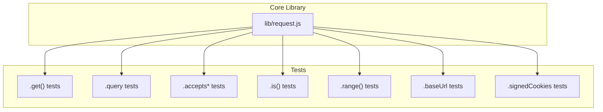
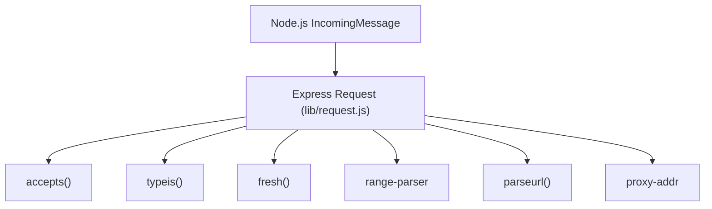
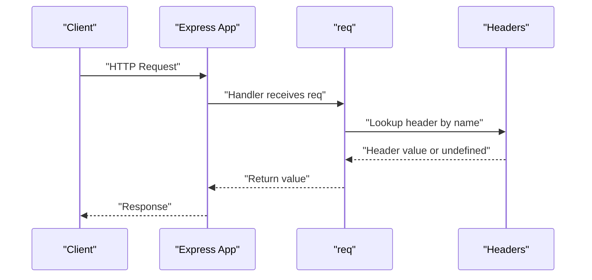
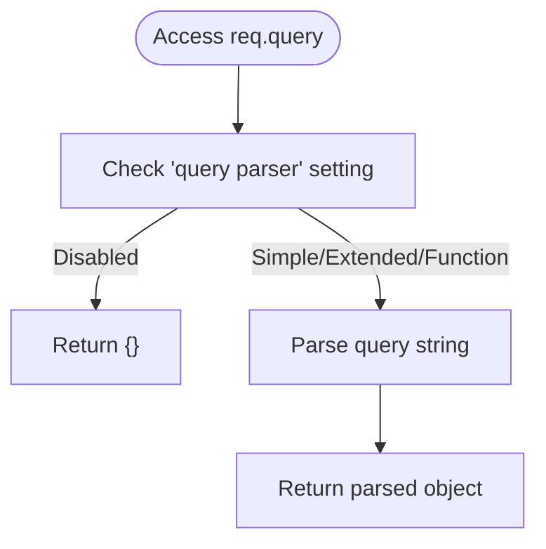
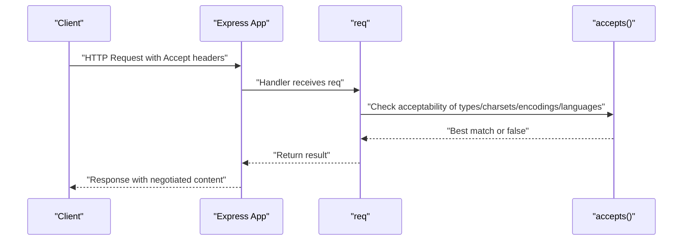
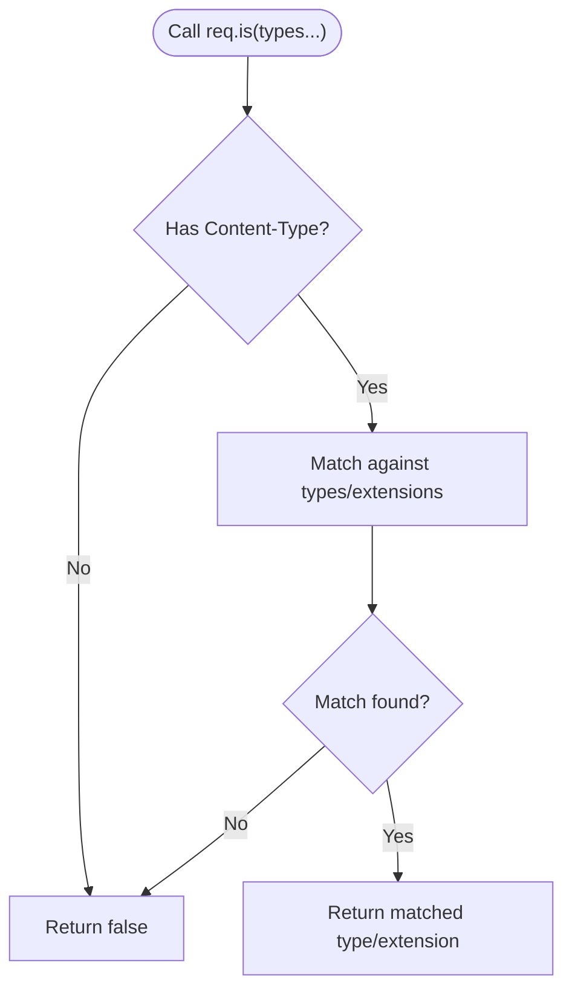
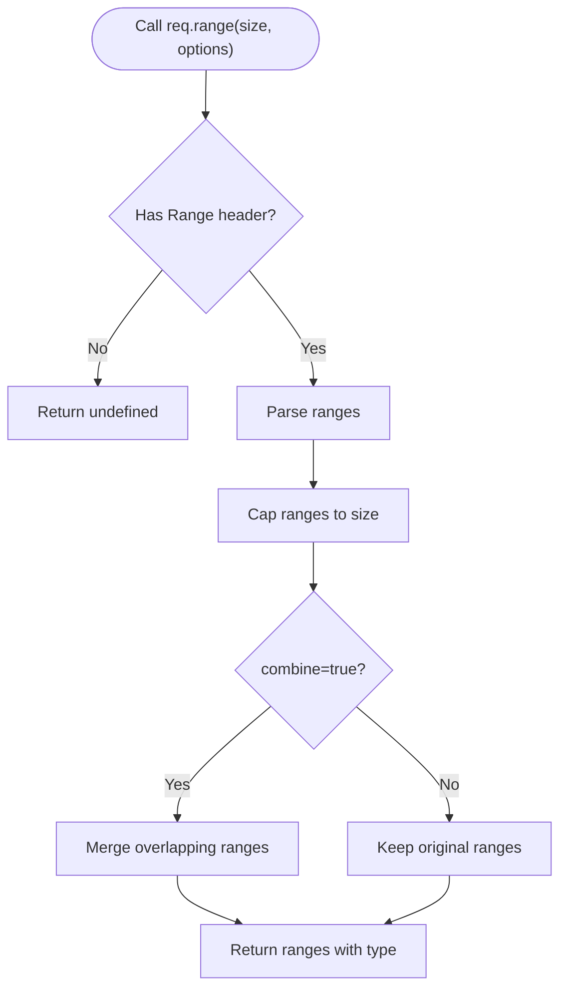
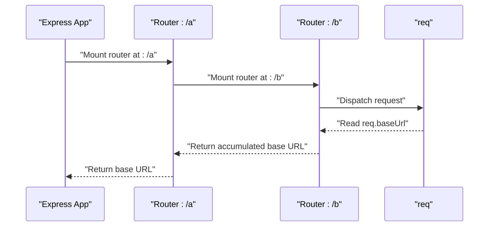
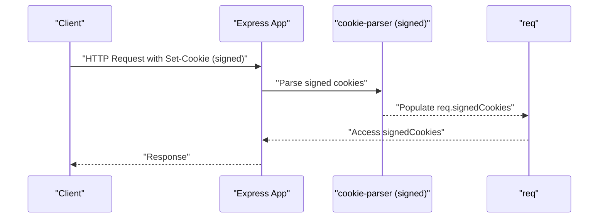
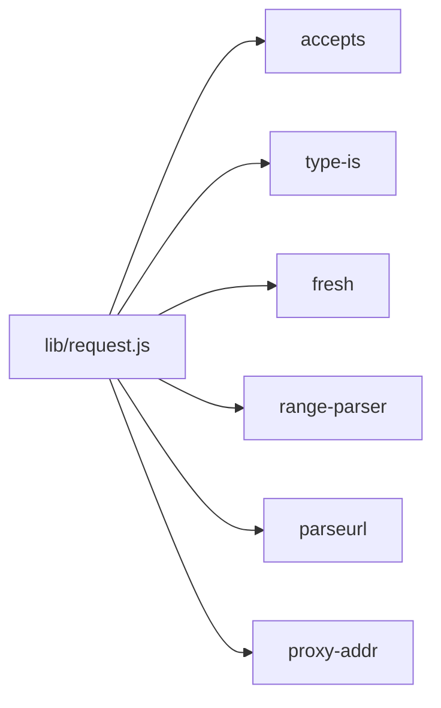

# Request API

<cite>
**Referenced Files in This Document**
- [lib/request.js](file://lib/request.js)
- [test/req.get.js](file://test/req.get.js)
- [test/req.query.js](file://test/req.query.js)
- [test/req.accepts.js](file://test/req.accepts.js)
- [test/req.acceptsCharsets.js](file://test/req.acceptsCharsets.js)
- [test/req.acceptsEncodings.js](file://test/req.acceptsEncodings.js)
- [test/req.acceptsLanguages.js](file://test/req.acceptsLanguages.js)
- [test/req.is.js](file://test/req.is.js)
- [test/req.range.js](file://test/req.range.js)
- [test/req.baseUrl.js](file://test/req.baseUrl.js)
- [test/req.signedCookies.js](file://test/req.signedCookies.js)
</cite>

## Table of Contents
1. [Introduction](#introduction)
2. [Project Structure](#project-structure)
3. [Core Components](#core-components)
4. [Architecture Overview](#architecture-overview)
5. [Detailed Component Analysis](#detailed-component-analysis)
6. [Dependency Analysis](#dependency-analysis)
7. [Performance Considerations](#performance-considerations)
8. [Troubleshooting Guide](#troubleshooting-guide)
9. [Conclusion](#conclusion)

## Introduction
This document provides comprehensive API documentation for the Express.js Request object. It focuses on the properties and methods exposed on the request object, including header accessors, query parsing, content negotiation helpers, media type checks, range parsing, protocol and security indicators, IP and host resolution, freshness/staleness detection, and XMLHTTPRequest detection. It also documents the base URL concept in routed contexts and signed cookies retrieval.

## Project Structure
The Request object is defined in the core library and augmented with getters and methods that wrap standard Node.js HTTP server capabilities and third-party libraries. Tests demonstrate behavior and usage patterns for each documented capability.

**Diagram sources**
- [lib/request.js](file://lib/request.js)
- [test/req.get.js](file://test/req.get.js)
- [test/req.query.js](file://test/req.query.js)
- [test/req.accepts.js](file://test/req.accepts.js)
- [test/req.is.js](file://test/req.is.js)
- [test/req.range.js](file://test/req.range.js)
- [test/req.baseUrl.js](file://test/req.baseUrl.js)
- [test/req.signedCookies.js](file://test/req.signedCookies.js)

**Section sources**
- [lib/request.js](file://lib/request.js)

## Core Components
This section enumerates the primary properties and methods of the Express.js Request object, along with their types, behaviors, and usage patterns derived from the implementation and tests.

- req.get(name) and req.header(name)
  - Purpose: Retrieve a request header value by name, with special-case handling for referer/referrer.
  - Signature: req.get(name: string): string | undefined
  - Behavior: Throws if name is missing or not a string; returns the header value or undefined if not present.
  - Notes: Aliased as req.header.
  - Example usage patterns:
    - Extract a specific header value for downstream processing.
    - Validate presence of a required header.
  - Related tests:
    - [test/req.get.js](file://test/req.get.js)

- req.query
  - Purpose: Parsed query string object.
  - Type: Record<string, any>
  - Behavior: Defaults to an empty object; parsing depends on the "query parser" setting (simple, extended, function, or disabled).
  - Example usage patterns:
    - Access nested-like keys via bracket notation when using extended parser.
    - Fall back to raw string keys with simple parser.
  - Related tests:
    - [test/req.query.js](file://test/req.query.js)

- req.is(types...)
  - Purpose: Check if the request body content type matches one of the provided MIME types or extensions.
  - Signature: req.is(...types: string | string[]): string | false | null
  - Behavior: Ignores charset; supports exact MIME, subtype wildcards, and extension lookups.
  - Example usage patterns:
    - Validate incoming payload type before processing.
    - Guard routes based on content type.
  - Related tests:
    - [test/req.is.js](file://test/req.is.js)

- req.accepts(...)
  - Purpose: Check if the request accepts one or more MIME types.
  - Signature: req.accepts(...types: string | string[]): string | string[] | boolean
  - Behavior: Returns best match or canonical MIME type; false if none acceptable; true when Accept absent.
  - Example usage patterns:
    - Select response format (JSON, HTML) based on client’s Accept header.
  - Related tests:
    - [test/req.accepts.js](file://test/req.accepts.js)

- req.acceptsCharsets(...)
  - Purpose: Check if the request accepts one or more charsets.
  - Signature: req.acceptsCharsets(...charsets: string[]): string | string[] | boolean
  - Behavior: Returns best match or array of acceptable charsets; true when Accept-Charset absent.
  - Example usage patterns:
    - Choose response charset honoring client preferences.
  - Related tests:
    - [test/req.acceptsCharsets.js](file://test/req.acceptsCharsets.js)

- req.acceptsEncodings(...)
  - Purpose: Check if the request accepts one or more encodings.
  - Signature: req.acceptsEncodings(...encodings: string[]): string | string[] | boolean
  - Behavior: Returns best match or array of acceptable encodings; false if none acceptable.
  - Example usage patterns:
    - Determine compression encoding support (gzip, deflate).
  - Related tests:
    - [test/req.acceptsEncodings.js](file://test/req.acceptsEncodings.js)

- req.acceptsLanguages(...)
  - Purpose: Check if the request accepts one or more languages.
  - Signature: req.acceptsLanguages(...languages: string[]): string | string[] | boolean
  - Behavior: Returns best match or array of acceptable languages; true when Accept-Language absent.
  - Example usage patterns:
    - Localize response content based on Accept-Language.
  - Related tests:
    - [test/req.acceptsLanguages.js](file://test/req.acceptsLanguages.js)

- req.range(size, options?)
  - Purpose: Parse the Range header into byte ranges, capped to the given size.
  - Signature: req.range(size: number, options?: { combine?: boolean }): { type: string; start: number; end: number }[] | number | undefined
  - Behavior: Returns undefined if no Range header; -1 if unsatisfiable; -2 if syntactically invalid; otherwise array of range objects with a type property.
  - Example usage patterns:
    - Implement partial content serving for downloads or media.
  - Related tests:
    - [test/req.range.js](file://test/req.range.js)

- req.baseUrl
  - Purpose: Base URL of the router instance that routed this request.
  - Type: string
  - Behavior: Empty for top-level routes; accumulates path segments through nested routers.
  - Example usage patterns:
    - Build absolute links within nested routing contexts.
  - Related tests:
    - [test/req.baseUrl.js](file://test/req.baseUrl.js)

- req.signedCookies
  - Purpose: Parsed signed cookies object.
  - Type: Record<string, any>
  - Behavior: Populated when a signed cookie parser middleware is installed; contains only verified signed cookies.
  - Example usage patterns:
    - Read signed session identifiers or tokens.
  - Related tests:
    - [test/req.signedCookies.js](file://test/req.signedCookies.js)

- req.protocol
  - Purpose: Protocol string "http" or "https".
  - Type: string
  - Behavior: Considers TLS and trust proxy settings; reads X-Forwarded-Proto when trusted.
  - Example usage patterns:
    - Construct absolute URLs with correct scheme.
  - Related implementation:
    - [lib/request.js](file://lib/request.js)

- req.secure
  - Purpose: Boolean indicating HTTPS.
  - Type: boolean
  - Behavior: True when protocol equals "https".
  - Example usage patterns:
    - Enforce HTTPS-only routes or secure cookie flags.
  - Related implementation:
    - [lib/request.js](file://lib/request.js)

- req.ip
  - Purpose: Remote address considering trusted proxies.
  - Type: string
  - Behavior: Uses trust proxy function to resolve the client IP.
  - Example usage patterns:
    - Log client IPs or rate limiting.
  - Related implementation:
    - [lib/request.js](file://lib/request.js)

- req.ips
  - Purpose: Array of trusted proxy addresses plus client, ordered furthest to closest.
  - Type: string[]
  - Behavior: Reverses proxy chain and removes the socket address.
  - Example usage patterns:
    - Inspect full proxy chain for auditing.
  - Related implementation:
    - [lib/request.js](file://lib/request.js)

- req.path
  - Purpose: Request path portion of the URL.
  - Type: string
  - Behavior: Equivalent to url.parse(req.url).pathname.
  - Example usage patterns:
    - Normalize or route based on path.
  - Related implementation:
    - [lib/request.js](file://lib/request.js)

- req.host and req.hostname
  - Purpose: Host and hostname from Host/X-Forwarded-Host respecting trust proxy.
  - Type: string | undefined
  - Behavior: Parses IPv6 literals and optional ports; returns undefined if no host.
  - Example usage patterns:
    - Build absolute URLs or enforce host-based routing.
  - Related implementation:
    - [lib/request.js](file://lib/request.js)

- req.subdomains
  - Purpose: Array of subdomain segments.
  - Type: string[]
  - Behavior: Based on hostname and configured subdomain offset; returns [] for IP hostnames.
  - Example usage patterns:
    - Multi-tenant routing based on subdomain.
  - Related implementation:
    - [lib/request.js](file://lib/request.js)

- req.fresh and req.stale
  - Purpose: Freshness checks for cache validation.
  - Types: boolean
  - Behavior: req.fresh applies weak validation for GET/HEAD with 2xx/304 and matching ETag/Last-Modified; req.stale is !req.fresh.
  - Example usage patterns:
    - Serve 304 Not Modified responses efficiently.
  - Related implementation:
    - [lib/request.js](file://lib/request.js)

- req.xhr
  - Purpose: Detect XMLHttpRequest requests.
  - Type: boolean
  - Behavior: True when X-Requested-With header equals "xmlhttprequest".
  - Example usage patterns:
    - Differentiate AJAX vs. browser navigation responses.
  - Related implementation:
    - [lib/request.js](file://lib/request.js)

Notes on HTTP method aliases and content negotiation:
- req.get and req.header are identical; both return header values.
- req.accepts, req.acceptsCharsets, req.acceptsEncodings, and req.acceptsLanguages provide content negotiation helpers.
- req.is performs media type checks against the Content-Type header.

**Section sources**
- [lib/request.js](file://lib/request.js)
- [test/req.get.js](file://test/req.get.js)
- [test/req.query.js](file://test/req.query.js)
- [test/req.accepts.js](file://test/req.accepts.js)
- [test/req.acceptsCharsets.js](file://test/req.acceptsCharsets.js)
- [test/req.acceptsEncodings.js](file://test/req.acceptsEncodings.js)
- [test/req.acceptsLanguages.js](file://test/req.acceptsLanguages.js)
- [test/req.is.js](file://test/req.is.js)
- [test/req.range.js](file://test/req.range.js)
- [test/req.baseUrl.js](file://test/req.baseUrl.js)
- [test/req.signedCookies.js](file://test/req.signedCookies.js)

## Architecture Overview
The Request object augments Node’s IncomingMessage with Express-specific getters and methods. These are implemented using third-party libraries for content negotiation, freshness checks, range parsing, and proxy address resolution. Tests validate expected behaviors across typical scenarios.

**Diagram sources**
- [lib/request.js](file://lib/request.js)

## Detailed Component Analysis

### Header Accessor: req.get and req.header
- Purpose: Retrieve header values with a special case for referer/referrer.
- Method signature: req.get(name: string): string | undefined
- Validation: Throws if name is missing or not a string.
- Behavior: Returns the header value or undefined; referer/referrer are normalized.
- Usage patterns:
  - Extract Content-Type for content-type checks.
  - Validate presence of required headers (e.g., Authorization).
- Example references:
  - [test/req.get.js](file://test/req.get.js)

**Diagram sources**
- [lib/request.js](file://lib/request.js)
- [test/req.get.js](file://test/req.get.js)

**Section sources**
- [lib/request.js](file://lib/request.js)
- [test/req.get.js](file://test/req.get.js)

### Query Parsing: req.query
- Purpose: Parse the query string into an object according to the configured query parser.
- Property type: Record<string, any>
- Settings:
  - "query parser" = "extended" enables complex key parsing (arrays, nested objects).
  - "query parser" = "simple" disables complex keys.
  - "query parser" = function allows custom parsing.
  - "query parser" = false disables parsing.
- Usage patterns:
  - Access nested-like keys with extended parser.
  - Validate presence of required parameters.
- Example references:
  - [test/req.query.js](file://test/req.query.js)

**Diagram sources**
- [lib/request.js](file://lib/request.js)
- [test/req.query.js](file://test/req.query.js)

**Section sources**
- [lib/request.js](file://lib/request.js)
- [test/req.query.js](file://test/req.query.js)

### Content Negotiation: req.accepts, req.acceptsCharsets, req.acceptsEncodings, req.acceptsLanguages
- Purpose: Match client preferences against server capabilities.
- Methods:
  - req.accepts(...types): string | string[] | boolean
  - req.acceptsCharsets(...charsets): string | string[] | boolean
  - req.acceptsEncodings(...encodings): string | string[] | boolean
  - req.acceptsLanguages(...languages): string | string[] | boolean
- Behavior:
  - Returns best match, canonical MIME type, or array of acceptable values.
  - Returns true when the respective Accept header is absent.
  - False when no acceptable match exists.
- Usage patterns:
  - Choose response format (JSON, HTML) based on Accept.
  - Select charset and encoding honoring client preferences.
  - Localize content based on Accept-Language.
- Example references:
  - [test/req.accepts.js](file://test/req.accepts.js)
  - [test/req.acceptsCharsets.js](file://test/req.acceptsCharsets.js)
  - [test/req.acceptsEncodings.js](file://test/req.acceptsEncodings.js)
  - [test/req.acceptsLanguages.js](file://test/req.acceptsLanguages.js)

**Diagram sources**
- [lib/request.js](file://lib/request.js)
- [test/req.accepts.js](file://test/req.accepts.js)
- [test/req.acceptsCharsets.js](file://test/req.acceptsCharsets.js)
- [test/req.acceptsEncodings.js](file://test/req.acceptsEncodings.js)
- [test/req.acceptsLanguages.js](file://test/req.acceptsLanguages.js)

**Section sources**
- [lib/request.js](file://lib/request.js)
- [test/req.accepts.js](file://test/req.accepts.js)
- [test/req.acceptsCharsets.js](file://test/req.acceptsCharsets.js)
- [test/req.acceptsEncodings.js](file://test/req.acceptsEncodings.js)
- [test/req.acceptsLanguages.js](file://test/req.acceptsLanguages.js)

### Media Type Checking: req.is
- Purpose: Verify the request body’s Content-Type against provided types or extensions.
- Method signature: req.is(...types: string | string[]): string | false | null
- Behavior:
  - Supports exact MIME types, subtype wildcards, and extension lookups.
  - Ignores charset differences.
  - Returns false when Content-Type is absent.
- Usage patterns:
  - Guard endpoints by content type.
  - Route based on incoming payload type.
- Example references:
  - [test/req.is.js](file://test/req.is.js)

**Diagram sources**
- [lib/request.js](file://lib/request.js)
- [test/req.is.js](file://test/req.is.js)

**Section sources**
- [lib/request.js](file://lib/request.js)
- [test/req.is.js](file://test/req.is.js)

### Range Parsing: req.range
- Purpose: Parse the Range header into byte ranges, capped to a given size.
- Method signature: req.range(size: number, options?: { combine?: boolean }): { type: string; start: number; end: number }[] | number | undefined
- Behavior:
  - Returns undefined if no Range header.
  - Returns -1 if unsatisfiable.
  - Returns -2 if syntactically invalid.
  - Otherwise returns an array of range objects with a type property.
  - Options:
    - combine: true merges overlapping or adjacent ranges.
- Usage patterns:
  - Implement HTTP 206 Partial Content for downloads or media streaming.
- Example references:
  - [test/req.range.js](file://test/req.range.js)

**Diagram sources**
- [lib/request.js](file://lib/request.js)
- [test/req.range.js](file://test/req.range.js)

**Section sources**
- [lib/request.js](file://lib/request.js)
- [test/req.range.js](file://test/req.range.js)

### Base URL in Routing Contexts: req.baseUrl
- Purpose: Reflect the base URL of the router instance that routed the current request.
- Property type: string
- Behavior:
  - Empty for top-level routes.
  - Accumulates path segments through nested routers.
- Usage patterns:
  - Build absolute links within nested routing scopes.
- Example references:
  - [test/req.baseUrl.js](file://test/req.baseUrl.js)

**Diagram sources**
- [lib/request.js](file://lib/request.js)
- [test/req.baseUrl.js](file://test/req.baseUrl.js)

**Section sources**
- [lib/request.js](file://lib/request.js)
- [test/req.baseUrl.js](file://test/req.baseUrl.js)

### Signed Cookies: req.signedCookies
- Purpose: Provide parsed signed cookies after installing a signed cookie parser middleware.
- Property type: Record<string, any>
- Behavior:
  - Populated only when signed cookies are present and verified.
  - Useful for secure session identifiers or tokens.
- Usage patterns:
  - Read signed session data.
  - Authenticate or authorize based on signed cookies.
- Example references:
  - [test/req.signedCookies.js](file://test/req.signedCookies.js)

**Diagram sources**
- [lib/request.js](file://lib/request.js)
- [test/req.signedCookies.js](file://test/req.signedCookies.js)

**Section sources**
- [lib/request.js](file://lib/request.js)
- [test/req.signedCookies.js](file://test/req.signedCookies.js)

### Additional Properties and Helpers
- req.protocol: "http" or "https", considering TLS and trust proxy.
- req.secure: boolean shortcut for HTTPS.
- req.ip: resolved client IP considering trust proxy.
- req.ips: array of trusted proxy addresses plus client.
- req.path: request path portion of the URL.
- req.host and req.hostname: host and hostname with trust proxy awareness.
- req.subdomains: array of subdomain segments.
- req.fresh and req.stale: cache validation helpers.
- req.xhr: detects XMLHttpRequest via X-Requested-With.

These are implemented as getters and rely on underlying libraries for robust behavior.

**Section sources**
- [lib/request.js](file://lib/request.js)

## Dependency Analysis
The Request object delegates to several libraries for specialized functionality:
- Content negotiation: accepts
- Media type checking: type-is
- Cache freshness: fresh
- Range parsing: range-parser
- URL parsing: parseurl
- Proxy address resolution: proxy-addr

**Diagram sources**
- [lib/request.js](file://lib/request.js)

**Section sources**
- [lib/request.js](file://lib/request.js)

## Performance Considerations
- Header access is O(1) dictionary lookup.
- Query parsing cost scales with query string complexity; choose appropriate "query parser" setting.
- Content negotiation helpers compute best matches based on Accept headers; keep lists concise.
- Range parsing involves parsing and normalization; avoid excessive range sets.
- Trust proxy evaluation adds minimal overhead; ensure trust proxy function is efficient.
- Freshness checks compare ETag/Last-Modified; ensure responses set these headers appropriately.

## Troubleshooting Guide
- req.get throws when name is missing or not a string:
  - Ensure the header name is provided and is a string.
  - Reference: [test/req.get.js](file://test/req.get.js)
- req.query returns {} when parsing disabled or unsupported:
  - Configure "query parser" to "extended", "simple", or a custom function.
  - Reference: [test/req.query.js](file://test/req.query.js)
- req.accepts returns true when Accept is absent:
  - Explicitly handle absence if you require a specific type.
  - Reference: [test/req.accepts.js](file://test/req.accepts.js)
- req.range returns undefined/-1/-2:
  - No Range header, unsatisfiable ranges, or syntactic errors respectively.
  - Reference: [test/req.range.js](file://test/req.range.js)
- req.signedCookies empty:
  - Ensure signed cookie parser middleware is installed and cookies are signed.
  - Reference: [test/req.signedCookies.js](file://test/req.signedCookies.js)

**Section sources**
- [test/req.get.js](file://test/req.get.js)
- [test/req.query.js](file://test/req.query.js)
- [test/req.accepts.js](file://test/req.accepts.js)
- [test/req.range.js](file://test/req.range.js)
- [test/req.signedCookies.js](file://test/req.signedCookies.js)

## Conclusion
The Express.js Request object provides a rich set of getters and methods for extracting and validating request data, negotiating content, and handling routing nuances. By leveraging the documented properties and methods, developers can build robust, standards-compliant handlers that respect client preferences, security constraints, and proxy environments.