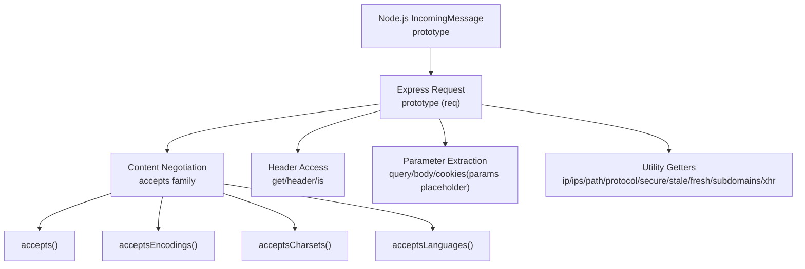
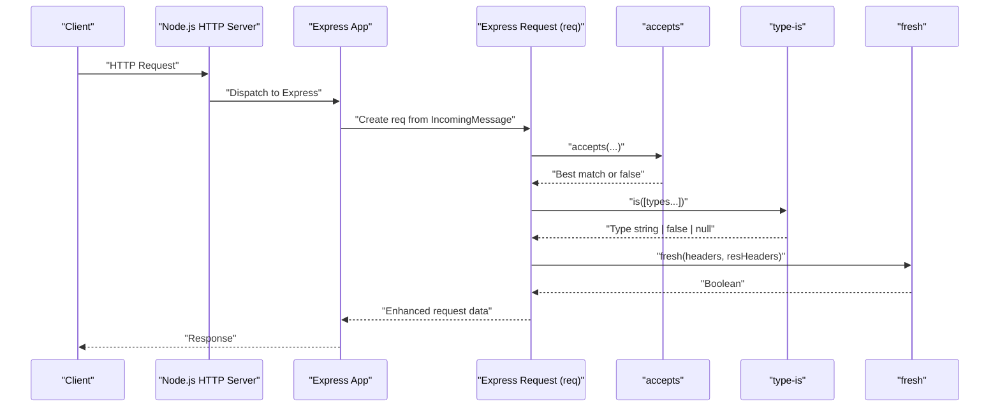
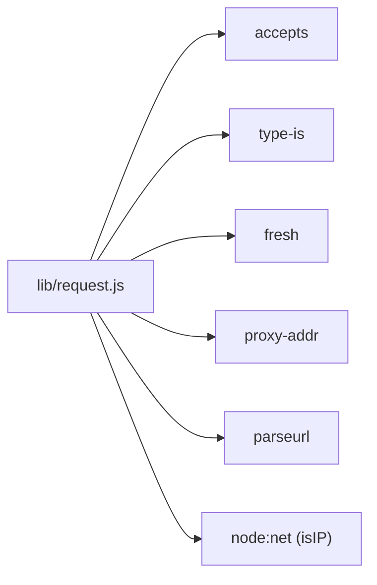

# Request Object Methods

<cite>
**Referenced Files in This Document**
- [request.js](file://lib/request.js)
- [req.accepts.js](file://test/req.accepts.js)
- [req.acceptsCharsets.js](file://test/req.acceptsCharsets.js)
- [req.acceptsEncodings.js](file://test/req.acceptsEncodings.js)
- [req.acceptsLanguages.js](file://test/req.acceptsLanguages.js)
- [req.get.js](file://test/req.get.js)
- [req.is.js](file://test/req.is.js)
- [req.query.js](file://test/req.query.js)
- [req.ip.js](file://test/req.ip.js)
- [req.ips.js](file://test/req.ips.js)
- [req.path.js](file://test/req.path.js)
- [req.protocol.js](file://test/req.protocol.js)
- [req.secure.js](file://test/req.secure.js)
- [req.stale.js](file://test/req.stale.js)
- [req.fresh.js](file://test/req.fresh.js)
</cite>

## Table of Contents
1. [Introduction](#introduction)
2. [Project Structure](#project-structure)
3. [Core Components](#core-components)
4. [Architecture Overview](#architecture-overview)
5. [Detailed Component Analysis](#detailed-component-analysis)
6. [Dependency Analysis](#dependency-analysis)
7. [Performance Considerations](#performance-considerations)
8. [Troubleshooting Guide](#troubleshooting-guide)
9. [Conclusion](#conclusion)

## Introduction
This document provides comprehensive API documentation for Express.js Request Object Methods that enhance HTTP request handling. It covers content negotiation helpers (accepts, acceptsCharsets, acceptsEncodings, acceptsLanguages), header accessors (req.get, req.header alias), media type detection (req.is), parameter extraction (req.params placeholder, req.query, req.body, req.cookies), and utility getters (req.ip, req.ips, req.path, req.protocol, req.secure, req.stale, req.fresh, req.subdomains, req.xhr). For each method, we specify method signatures, parameter types, return value semantics, and practical usage patterns drawn from the repository’s tests and implementation.

## Project Structure
Express extends Node.js IncomingMessage to add a rich set of request helpers. The request prototype is defined in lib/request.js and augmented with getters and methods that wrap external libraries (for example, content negotiation via accepts, media type matching via type-is, freshness checks via fresh, and IP/proxy resolution via proxy-addr).

**Diagram sources**
- [request.js:30-37](file://lib/request.js#L30-L37)
- [request.js:127-187](file://lib/request.js#L127-L187)
- [request.js:269-281](file://lib/request.js#L269-L281)
- [request.js:230-241](file://lib/request.js#L230-L241)
- [request.js:297-315](file://lib/request.js#L297-L315)
- [request.js:340-366](file://lib/request.js#L340-L366)
- [request.js:403-405](file://lib/request.js#L403-L405)
- [request.js:469-499](file://lib/request.js#L469-L499)
- [request.js:383-394](file://lib/request.js#L383-L394)
- [request.js:508-511](file://lib/request.js#L508-L511)

**Section sources**
- [request.js:15-37](file://lib/request.js#L15-L37)

## Core Components
This section summarizes the primary request methods documented below, grouped by functional area.

- Content negotiation
  - req.accepts(types...)
  - req.acceptsEncodings(encodings...)
  - req.acceptsCharsets(charsets...)
  - req.acceptsLanguages(languages...)

- Header access
  - req.get(field)
  - req.header(field) — alias of req.get
  - req.is([type, ...])

- Parameter extraction
  - req.query — getter that parses the query string according to application settings

- Utility getters
  - req.ip, req.ips
  - req.path
  - req.protocol, req.secure
  - req.stale, req.fresh
  - req.subdomains
  - req.xhr

**Section sources**
- [request.js:63-83](file://lib/request.js#L63-L83)
- [request.js:127-187](file://lib/request.js#L127-L187)
- [request.js:230-241](file://lib/request.js#L230-L241)
- [request.js:297-315](file://lib/request.js#L297-L315)
- [request.js:340-366](file://lib/request.js#L340-L366)
- [request.js:403-405](file://lib/request.js#L403-L405)
- [request.js:469-499](file://lib/request.js#L469-L499)
- [request.js:383-394](file://lib/request.js#L383-L394)
- [request.js:508-511](file://lib/request.js#L508-L511)

## Architecture Overview
The request object augments Node’s IncomingMessage with getters and methods. Many methods delegate to third-party libraries:
- Content negotiation: accepts
- Media type matching: type-is
- Freshness: fresh
- Proxy/trust logic: proxy-addr
- URL parsing: parseurl

**Diagram sources**
- [request.js:16-23](file://lib/request.js#L16-L23)
- [request.js:127-187](file://lib/request.js#L127-L187)
- [request.js:269-281](file://lib/request.js#L269-L281)
- [request.js:469-499](file://lib/request.js#L469-L499)

## Detailed Component Analysis

### Content Negotiation Methods

#### req.accepts(types...)
- Purpose: Determine the best acceptable media type based on the Accept header.
- Signature: accepts(...types)
- Parameters:
  - types: String or Array of MIME types or extensions.
- Return:
  - Best matching type string, or false if none acceptable.
- Behavior:
  - Returns true when Accept is not present.
  - Considers quality values and canonical MIME types.
- Practical usage patterns:
  - Choose response format (JSON vs HTML) based on client preference.
  - Select among multiple provided types.
- Example references:
  - [req.accepts.js:8-44](file://test/req.accepts.js#L8-L44)
  - [req.accepts.js:47-58](file://test/req.accepts.js#L47-L58)
  - [req.accepts.js:60-97](file://test/req.accepts.js#L60-L97)
  - [req.accepts.js:99-123](file://test/req.accepts.js#L99-L123)

**Section sources**
- [request.js:127-130](file://lib/request.js#L127-L130)
- [req.accepts.js:8-44](file://test/req.accepts.js#L8-L44)
- [req.accepts.js:47-58](file://test/req.accepts.js#L47-L58)
- [req.accepts.js:60-97](file://test/req.accepts.js#L60-L97)
- [req.accepts.js:99-123](file://test/req.accepts.js#L99-L123)

#### req.acceptsEncodings(encodings...)
- Purpose: Determine the best acceptable content encoding.
- Signature: acceptsEncodings(...encodings)
- Parameters:
  - encodings: String(s) such as "gzip", "deflate".
- Return:
  - Matching encoding string or false.
- Practical usage patterns:
  - Decide whether to compress response bodies.
- Example references:
  - [req.acceptsEncodings.js:8-37](file://test/req.acceptsEncodings.js#L8-L37)

**Section sources**
- [request.js:140-143](file://lib/request.js#L140-L143)
- [req.acceptsEncodings.js:8-37](file://test/req.acceptsEncodings.js#L8-L37)

#### req.acceptsCharsets(charsets...)
- Purpose: Determine the best acceptable character set.
- Signature: acceptsCharsets(...charsets)
- Parameters:
  - charsets: String(s) such as "utf-8", "iso-8859-1".
- Return:
  - Best matching charset string or false.
- Practical usage patterns:
  - Select response character encoding.
- Example references:
  - [req.acceptsCharsets.js:8-61](file://test/req.acceptsCharsets.js#L8-L61)

**Section sources**
- [request.js:171-174](file://lib/request.js#L171-L174)
- [req.acceptsCharsets.js:8-61](file://test/req.acceptsCharsets.js#L8-L61)

#### req.acceptsLanguages(languages...)
- Purpose: Determine the best acceptable language tag.
- Signature: acceptsLanguages(...languages)
- Parameters:
  - languages: String(s) such as "en", "en-us".
- Return:
  - Best matching language string or false.
- Practical usage patterns:
  - Localize response content.
- Example references:
  - [req.acceptsLanguages.js:8-55](file://test/req.acceptsLanguages.js#L8-L55)

**Section sources**
- [request.js:185-187](file://lib/request.js#L185-L187)
- [req.acceptsLanguages.js:8-55](file://test/req.acceptsLanguages.js#L8-L55)

### Header Access Methods

#### req.get(field) and req.header(field)
- Purpose: Retrieve a request header value with special-case handling for Referrer/Referer.
- Signature: get(name), header(name)
- Parameters:
  - name: String header name.
- Return:
  - Header value string or undefined.
- Behavior:
  - Throws if name is missing or not a string.
  - Normalizes "referer"/"referrer" to a single value.
- Practical usage patterns:
  - Read Content-Type, Accept, User-Agent, Referer.
- Example references:
  - [req.get.js:9-34](file://test/req.get.js#L9-L34)
  - [req.get.js:36-58](file://test/req.get.js#L36-L58)

**Section sources**
- [request.js:63-83](file://lib/request.js#L63-L83)
- [req.get.js:9-34](file://test/req.get.js#L9-L34)
- [req.get.js:36-58](file://test/req.get.js#L36-L58)

#### req.is([type, ...])
- Purpose: Check if the request body matches one of the given types.
- Signature: is(types...)
- Parameters:
  - types: String or Array of MIME types or extensions.
- Return:
  - Matching type string, false, or null.
- Behavior:
  - Ignores charset when matching.
  - Works with partial wildcards like "application/*" and "*/json".
- Practical usage patterns:
  - Validate request content type before processing.
- Example references:
  - [req.is.js:8-48](file://test/req.is.js#L8-L48)
  - [req.is.js:51-63](file://test/req.is.js#L51-L63)
  - [req.is.js:66-79](file://test/req.is.js#L66-L79)
  - [req.is.js:82-124](file://test/req.is.js#L82-L124)
  - [req.is.js:126-167](file://test/req.is.js#L126-L167)

**Section sources**
- [request.js:269-281](file://lib/request.js#L269-L281)
- [req.is.js:8-48](file://test/req.is.js#L8-L48)
- [req.is.js:51-63](file://test/req.is.js#L51-L63)
- [req.is.js:66-79](file://test/req.is.js#L66-L79)
- [req.is.js:82-124](file://test/req.is.js#L82-L124)
- [req.is.js:126-167](file://test/req.is.js#L126-L167)

### Parameter Extraction Methods

#### req.query
- Purpose: Parse and expose query parameters.
- Signature: getter query
- Return:
  - Parsed query object based on application settings.
- Behavior:
  - Defaults to empty object when parsing is disabled.
  - Supports "simple" and "extended" modes and custom parser functions.
- Practical usage patterns:
  - Read query parameters for filtering, pagination, and search.
- Example references:
  - [req.query.js:9-23](file://test/req.query.js#L9-L23)
  - [req.query.js:25-41](file://test/req.query.js#L25-L41)
  - [req.query.js:43-51](file://test/req.query.js#L43-L51)
  - [req.query.js:53-63](file://test/req.query.js#L53-L63)
  - [req.query.js:65-73](file://test/req.query.js#L65-L73)
  - [req.query.js:75-83](file://test/req.query.js#L75-L83)
  - [req.query.js:85-90](file://test/req.query.js#L85-L90)

**Section sources**
- [request.js:230-241](file://lib/request.js#L230-L241)
- [req.query.js:9-23](file://test/req.query.js#L9-L23)
- [req.query.js:25-41](file://test/req.query.js#L25-L41)
- [req.query.js:43-51](file://test/req.query.js#L43-L51)
- [req.query.js:53-63](file://test/req.query.js#L53-L63)
- [req.query.js:65-73](file://test/req.query.js#L65-L73)
- [req.query.js:75-83](file://test/req.query.js#L75-L83)
- [req.query.js:85-90](file://test/req.query.js#L85-L90)

Note: req.params is a placeholder in Express routing; it is not a request object property but rather populated by route parameters. req.body is handled by middleware (for example, express.json, express.urlencoded) and is not part of the base request prototype.

### Utility Methods

#### req.ip
- Purpose: Return the remote address, considering trusted proxies.
- Signature: getter ip
- Return: String IP address.
- Behavior:
  - Uses trust proxy configuration to determine client IP from X-Forwarded-For.
- Practical usage patterns:
  - Logging, rate limiting, geo targeting.
- Example references:
  - [req.ip.js:10-38](file://test/req.ip.js#L10-L38)
  - [req.ip.js:40-53](file://test/req.ip.js#L40-L53)
  - [req.ip.js:55-70](file://test/req.ip.js#L55-L70)
  - [req.ip.js:73-84](file://test/req.ip.js#L73-L84)
  - [req.ip.js:88-101](file://test/req.ip.js#L88-L101)

**Section sources**
- [request.js:340-343](file://lib/request.js#L340-L343)
- [req.ip.js:10-38](file://test/req.ip.js#L10-L38)
- [req.ip.js:40-53](file://test/req.ip.js#L40-L53)
- [req.ip.js:55-70](file://test/req.ip.js#L55-L70)
- [req.ip.js:73-84](file://test/req.ip.js#L73-L84)
- [req.ip.js:88-101](file://test/req.ip.js#L88-L101)

#### req.ips
- Purpose: Return an array of all IPs in the chain, from most distant to closest, excluding the socket address.
- Signature: getter ips
- Return: Array<String>.
- Behavior:
  - Respects trust proxy configuration and stops at untrusted hops.
- Practical usage patterns:
  - Audit trail, advanced proxy handling.
- Example references:
  - [req.ips.js:10-23](file://test/req.ips.js#L10-L23)
  - [req.ips.js:25-38](file://test/req.ips.js#L25-L38)
  - [req.ips.js:41-53](file://test/req.ips.js#L41-L53)
  - [req.ips.js:57-68](file://test/req.ips.js#L57-L68)

**Section sources**
- [request.js:357-366](file://lib/request.js#L357-L366)
- [req.ips.js:10-23](file://test/req.ips.js#L10-L23)
- [req.ips.js:25-38](file://test/req.ips.js#L25-L38)
- [req.ips.js:41-53](file://test/req.ips.js#L41-L53)
- [req.ips.js:57-68](file://test/req.ips.js#L57-L68)

#### req.path
- Purpose: Return the parsed pathname from the request URL.
- Signature: getter path
- Return: String.
- Practical usage patterns:
  - Routing decisions, breadcrumbs, logging.
- Example references:
  - [req.path.js:8-18](file://test/req.path.js#L8-L18)

**Section sources**
- [request.js:403-405](file://lib/request.js#L403-L405)
- [req.path.js:8-18](file://test/req.path.js#L8-L18)

#### req.protocol
- Purpose: Return the request protocol ("http" or "https"), honoring TLS and trusted proxies.
- Signature: getter protocol
- Return: String.
- Behavior:
  - Uses socket encryption state and X-Forwarded-Proto when trust proxy allows.
- Practical usage patterns:
  - Redirects, signed cookie flags, HSTS.
- Example references:
  - [req.protocol.js:8-18](file://test/req.protocol.js#L8-L18)
  - [req.protocol.js:20-34](file://test/req.protocol.js#L20-L34)
  - [req.protocol.js:36-49](file://test/req.protocol.js#L36-L49)
  - [req.protocol.js:51-64](file://test/req.protocol.js#L51-L64)
  - [req.protocol.js:66-78](file://test/req.protocol.js#L66-L78)
  - [req.protocol.js:80-95](file://test/req.protocol.js#L80-L95)
  - [req.protocol.js:98-111](file://test/req.protocol.js#L98-L111)

**Section sources**
- [request.js:297-315](file://lib/request.js#L297-L315)
- [req.protocol.js:8-18](file://test/req.protocol.js#L8-L18)
- [req.protocol.js:20-34](file://test/req.protocol.js#L20-L34)
- [req.protocol.js:36-49](file://test/req.protocol.js#L36-L49)
- [req.protocol.js:51-64](file://test/req.protocol.js#L51-L64)
- [req.protocol.js:66-78](file://test/req.protocol.js#L66-L78)
- [req.protocol.js:80-95](file://test/req.protocol.js#L80-L95)
- [req.protocol.js:98-111](file://test/req.protocol.js#L98-L111)

#### req.secure
- Purpose: Boolean indicator if the request is HTTPS.
- Signature: getter secure
- Return: Boolean.
- Behavior:
  - Derived from protocol with trust proxy applied.
- Practical usage patterns:
  - Enforce HTTPS, conditional asset loading.
- Example references:
  - [req.secure.js:8-19](file://test/req.secure.js#L8-L19)
  - [req.secure.js:24-51](file://test/req.secure.js#L24-L51)
  - [req.secure.js:53-81](file://test/req.secure.js#L53-L81)
  - [req.secure.js:83-98](file://test/req.secure.js#L83-L98)

**Section sources**
- [request.js:326-328](file://lib/request.js#L326-L328)
- [req.secure.js:8-19](file://test/req.secure.js#L8-L19)
- [req.secure.js:24-51](file://test/req.secure.js#L24-L51)
- [req.secure.js:53-81](file://test/req.secure.js#L53-L81)
- [req.secure.js:83-98](file://test/req.secure.js#L83-L98)

#### req.stale and req.fresh
- Purpose: Evaluate cache freshness using ETag and Last-Modified.
- Signature: getter fresh, getter stale
- Return: Boolean.
- Behavior:
  - Only meaningful for GET/HEAD with 2xx/304 responses.
  - ETag takes precedence over Last-Modified.
- Practical usage patterns:
  - Conditional requests, 304 Not Modified responses.
- Example references:
  - [req.fresh.js:8-21](file://test/req.fresh.js#L8-L21)
  - [req.fresh.js:23-35](file://test/req.fresh.js#L23-L35)
  - [req.fresh.js:37-48](file://test/req.fresh.js#L37-L48)
  - [req.fresh.js:50-67](file://test/req.fresh.js#L50-L67)
  - [req.stale.js:8-21](file://test/req.stale.js#L8-L21)
  - [req.stale.js:23-35](file://test/req.stale.js#L23-L35)
  - [req.stale.js:37-48](file://test/req.stale.js#L37-L48)

**Section sources**
- [request.js:469-499](file://lib/request.js#L469-L499)
- [req.fresh.js:8-21](file://test/req.fresh.js#L8-L21)
- [req.fresh.js:23-35](file://test/req.fresh.js#L23-L35)
- [req.fresh.js:37-48](file://test/req.fresh.js#L37-L48)
- [req.fresh.js:50-67](file://test/req.fresh.js#L50-L67)
- [req.stale.js:8-21](file://test/req.stale.js#L8-L21)
- [req.stale.js:23-35](file://test/req.stale.js#L23-L35)
- [req.stale.js:37-48](file://test/req.stale.js#L37-L48)

#### req.subdomains
- Purpose: Return subdomain parts of the hostname as an array.
- Signature: getter subdomains
- Return: Array<String>.
- Behavior:
  - Based on hostname and configured subdomain offset.
- Practical usage patterns:
  - Multi-tenant routing, subdomain-based features.
- Example references:
  - [request.js:383-394](file://lib/request.js#L383-L394)

**Section sources**
- [request.js:383-394](file://lib/request.js#L383-L394)

#### req.xhr
- Purpose: Detect AJAX requests via X-Requested-With header.
- Signature: getter xhr
- Return: Boolean.
- Practical usage patterns:
  - Conditional rendering of JSON vs HTML.
- Example references:
  - [request.js:508-511](file://lib/request.js#L508-L511)

**Section sources**
- [request.js:508-511](file://lib/request.js#L508-L511)

## Dependency Analysis
The request prototype composes several external libraries to implement its capabilities.

**Diagram sources**
- [request.js:16-23](file://lib/request.js#L16-L23)

**Section sources**
- [request.js:16-23](file://lib/request.js#L16-L23)

## Performance Considerations
- Header access via req.get is O(1) dictionary lookup with minimal normalization overhead.
- Content negotiation leverages accepts; keep the number of candidate types reasonable to avoid excessive quality comparisons.
- req.query parsing depends on application settings; choose "simple" for speed or "extended" for richer parsing needs.
- req.ip and req.ips involve trust proxy evaluation; configure trust proxy appropriately to avoid unnecessary computation.
- req.fresh relies on ETag/Last-Modified comparison; ensure response headers are set consistently to maximize cache hits.

## Troubleshooting Guide
- req.get throws when called without a string argument.
  - Symptom: 500 error with a TypeError mentioning the requirement for a name argument.
  - Resolution: Ensure a non-empty string header name is passed.
  - Reference: [req.get.js:36-58](file://test/req.get.js#L36-L58)

- req.is returns false when Content-Type is absent.
  - Symptom: Matching fails unexpectedly.
  - Resolution: Set a proper Content-Type or handle absence explicitly.
  - Reference: [req.is.js:51-63](file://test/req.is.js#L51-L63)

- req.protocol ignores X-Forwarded-Proto when trust proxy does not trust the hop.
  - Symptom: Protocol remains http despite X-Forwarded-Proto: https.
  - Resolution: Configure trust proxy to include the proxy’s address or hop count.
  - Reference: [req.protocol.js:51-64](file://test/req.protocol.js#L51-L64)

- req.secure remains false when trust proxy is not enabled even with X-Forwarded-Proto: https.
  - Symptom: HTTPS enforcement not taking effect.
  - Resolution: Enable trust proxy or adjust trust configuration.
  - Reference: [req.secure.js:38-51](file://test/req.secure.js#L38-L51)

- req.fresh and req.stale require appropriate response headers.
  - Symptom: Unexpected true/false for freshness.
  - Resolution: Set ETag and/or Last-Modified on responses; note ETag precedence.
  - References:
    - [req.fresh.js:8-21](file://test/req.fresh.js#L8-L21)
    - [req.stale.js:8-21](file://test/req.stale.js#L8-L21)

**Section sources**
- [req.get.js:36-58](file://test/req.get.js#L36-L58)
- [req.is.js:51-63](file://test/req.is.js#L51-L63)
- [req.protocol.js:51-64](file://test/req.protocol.js#L51-L64)
- [req.secure.js:38-51](file://test/req.secure.js#L38-L51)
- [req.fresh.js:8-21](file://test/req.fresh.js#L8-L21)
- [req.stale.js:8-21](file://test/req.stale.js#L8-L21)

## Conclusion
Express’s request object augments Node’s IncomingMessage with powerful helpers for content negotiation, header access, media type detection, parameter extraction, and utility getters. Understanding their signatures, return semantics, and integration with Express settings (such as trust proxy and query parser) enables robust, standards-compliant web applications. The included tests demonstrate typical usage patterns and edge cases to guide implementation.