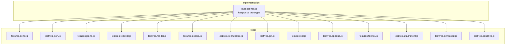
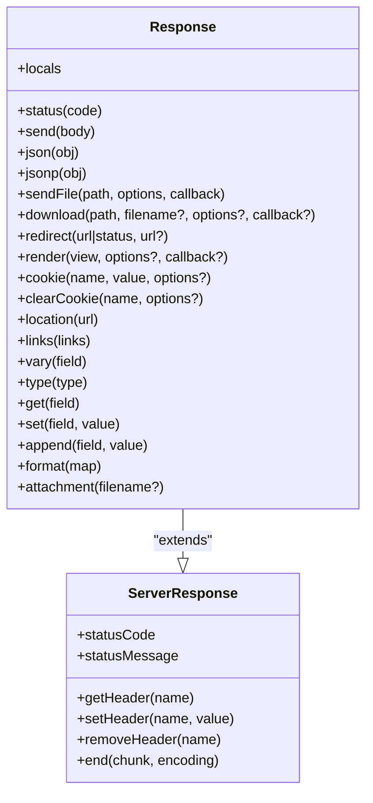
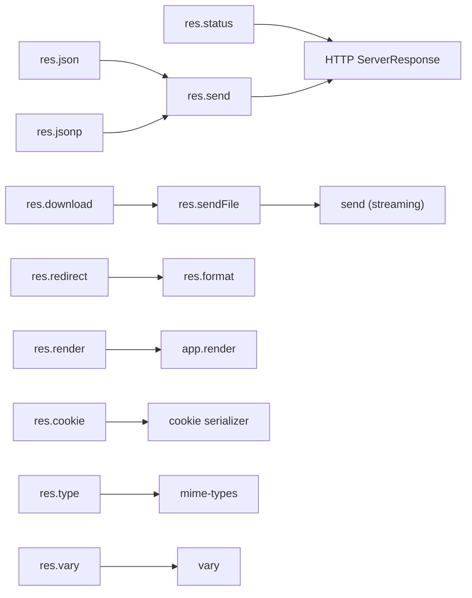

# Response API

<cite>
**Referenced Files in This Document**
- [response.js](file://lib/response.js)
- [res.send.js](file://test/res.send.js)
- [res.json.js](file://test/res.json.js)
- [res.jsonp.js](file://test/res.jsonp.js)
- [res.redirect.js](file://test/res.redirect.js)
- [res.render.js](file://test/res.render.js)
- [res.cookie.js](file://test/res.cookie.js)
- [res.clearCookie.js](file://test/res.clearCookie.js)
- [res.get.js](file://test/res.get.js)
- [res.set.js](file://test/res.set.js)
- [res.append.js](file://test/res.append.js)
- [res.format.js](file://test/res.format.js)
- [res.attachment.js](file://test/res.attachment.js)
- [res.download.js](file://test/res.download.js)
- [res.sendFile.js](file://test/res.sendFile.js)
</cite>

## Table of Contents
1. [Introduction](#introduction)
2. [Project Structure](#project-structure)
3. [Core Components](#core-components)
4. [Architecture Overview](#architecture-overview)
5. [Detailed Component Analysis](#detailed-component-analysis)
6. [Dependency Analysis](#dependency-analysis)
7. [Performance Considerations](#performance-considerations)
8. [Troubleshooting Guide](#troubleshooting-guide)
9. [Conclusion](#conclusion)

## Introduction
This document provides comprehensive API documentation for the Express.js Response object. It covers all response methods including status, send, json, jsonp, sendFile, download, redirect, render, cookie/clearCookie, location, links, vary, type/get/set/append/format, attachment, and res.locals. For each method, we describe the signature, parameter types, return values, and practical behaviors, with references to the implementation and tests.

## Project Structure
Express’s Response API is implemented in a single module that extends Node.js’s native HTTP server response. Tests validate behaviors across content negotiation, cookies, file serving, redirects, and rendering.

**Diagram sources**
- [response.js](file://lib/response.js)
- [res.send.js](file://test/res.send.js)
- [res.json.js](file://test/res.json.js)
- [res.jsonp.js](file://test/res.jsonp.js)
- [res.redirect.js](file://test/res.redirect.js)
- [res.render.js](file://test/res.render.js)
- [res.cookie.js](file://test/res.cookie.js)
- [res.clearCookie.js](file://test/res.clearCookie.js)
- [res.get.js](file://test/res.get.js)
- [res.set.js](file://test/res.set.js)
- [res.append.js](file://test/res.append.js)
- [res.format.js](file://test/res.format.js)
- [res.attachment.js](file://test/res.attachment.js)
- [res.download.js](file://test/res.download.js)
- [res.sendFile.js](file://test/res.sendFile.js)

**Section sources**
- [response.js](file://lib/response.js)

## Core Components
- Response prototype: Methods are attached to the HTTP server response prototype and extend it with Express-specific helpers.
- Chaining: Most methods return the response object for chaining.
- Header management: Methods like set/get/append operate on HTTP headers.
- Content negotiation: Methods like format/select appropriate responses based on Accept headers.
- File serving: Methods like sendFile/download integrate with the send streaming library.
- Rendering: render delegates to the application’s view engine.

Key behaviors validated by tests:
- send handles strings, buffers, numbers, booleans, objects, and null/undefined.
- json/jsonp serialize bodies and set Content-Type appropriately.
- redirect supports status override and content negotiation for text/html.
- render merges res.locals and app.locals, supports callbacks, and errors propagate via next.
- cookie/clearCookie manage Set-Cookie with options and signing.
- sendFile/download enforce path safety and options like dotfiles, headers, root.
- format negotiates content types and sets charset.

**Section sources**
- [response.js](file://lib/response.js)
- [res.send.js](file://test/res.send.js)
- [res.json.js](file://test/res.json.js)
- [res.jsonp.js](file://test/res.jsonp.js)
- [res.redirect.js](file://test/res.redirect.js)
- [res.render.js](file://test/res.render.js)
- [res.cookie.js](file://test/res.cookie.js)
- [res.clearCookie.js](file://test/res.clearCookie.js)
- [res.get.js](file://test/res.get.js)
- [res.set.js](file://test/res.set.js)
- [res.append.js](file://test/res.append.js)
- [res.format.js](file://test/res.format.js)
- [res.attachment.js](file://test/res.attachment.js)
- [res.download.js](file://test/res.download.js)
- [res.sendFile.js](file://test/res.sendFile.js)

## Architecture Overview
The Response object augments Node’s ServerResponse with Express helpers. Methods delegate to internal utilities (e.g., content-type resolution, ETag generation, streaming) and integrate with the application’s settings and view engine.

**Diagram sources**
- [response.js](file://lib/response.js)

## Detailed Component Analysis

### res.status(code)
- Purpose: Set the HTTP status code.
- Signature: status(number): ServerResponse
- Parameters:
  - code: integer between 100 and 999.
- Behavior:
  - Validates integer and range.
  - Sets this.statusCode.
  - Returns this for chaining.
- Practical notes:
  - Used before sending headers/body.
  - Combined with send/sendStatus to finalize response.

**Section sources**
- [response.js](file://lib/response.js)

### res.send(body)
- Purpose: Send a response with automatic content-type and ETag handling.
- Signature: send(string|number|boolean|object|Buffer): ServerResponse
- Parameters:
  - body: varies by type (string, number, boolean, object, Buffer).
- Behavior:
  - Determines Content-Type based on type and charset.
  - Calculates Content-Length and optional ETag.
  - Handles 204/304/205 special cases (strips headers/body).
  - Respects HEAD method (no body).
- Practical notes:
  - Objects are serialized to JSON via json().
  - Buffers are streamed with proper content-type when not ArrayBuffer views.

**Section sources**
- [response.js](file://lib/response.js)
- [res.send.js](file://test/res.send.js)

### res.json(obj)
- Purpose: Send JSON response.
- Signature: json(object|string|number|boolean|null): ServerResponse
- Parameters:
  - obj: value to serialize.
- Behavior:
  - Uses application settings for replacer/spaces/escape.
  - Sets Content-Type to application/json.
  - Delegates to send(body).

**Section sources**
- [response.js](file://lib/response.js)
- [res.json.js](file://test/res.json.js)

### res.jsonp(obj)
- Purpose: Send JSONP response with callback support.
- Signature: jsonp(object|string|number|boolean|null): ServerResponse
- Parameters:
  - obj: value to serialize.
- Behavior:
  - Reads callback query parameter from app setting.
  - Sets X-Content-Type-Options nosniff when callback present.
  - Restricts callback charset and escapes characters for JS safety.
  - Delegates to send(body).

**Section sources**
- [response.js](file://lib/response.js)
- [res.jsonp.js](file://test/res.jsonp.js)

### res.sendFile(path, options?, callback?)
- Purpose: Stream a file to the response.
- Signature: sendFile(string, options?, callback?): ServerResponse
- Parameters:
  - path: absolute path to file.
  - options: send options (e.g., acceptRanges, cacheControl, dotfiles, headers, immutable, lastModified, maxAge, root).
  - callback: invoked on completion or error.
- Behavior:
  - Validates path is absolute or root is provided.
  - Integrates with send streaming library.
  - Honors ETag, If-None-Match, If-Modified-Since.
  - Supports async local storage persistence.

**Section sources**
- [response.js](file://lib/response.js)
- [res.sendFile.js](file://test/res.sendFile.js)

### res.download(path, filename?, options?, callback?)
- Purpose: Transfer a file as an attachment.
- Signature: download(string, filename?, options?, callback?): ServerResponse
- Parameters:
  - path: file path (absolute or with root).
  - filename?: alternate filename.
  - options?: send options plus headers.
  - callback?: invoked on completion or error.
- Behavior:
  - Sets Content-Disposition to attachment.
  - Merges headers while preserving Content-Disposition.
  - Delegates to sendFile.

**Section sources**
- [response.js](file://lib/response.js)
- [res.download.js](file://test/res.download.js)

### res.redirect(url|status, url?)
- Purpose: Redirect with content negotiation.
- Signature: redirect(url): ServerResponse | redirect(status, url): ServerResponse
- Parameters:
  - url/status: redirect target or status code.
  - url: redirect location.
- Behavior:
  - Sets Location header and negotiates body based on Accept.
  - Supports text/plain and text/html with escaping and XSS prevention.
  - Defaults to 302; can be overridden.

**Section sources**
- [response.js](file://lib/response.js)
- [res.redirect.js](file://test/res.redirect.js)

### res.render(view, options?, callback?)
- Purpose: Render a view and send response.
- Signature: render(view, options?, callback?): ServerResponse
- Parameters:
  - view: template path.
  - options: locals merged with res.locals and app.locals.
  - callback: optional(err, html) to handle rendering result.
- Behavior:
  - Merges res.locals and app.locals.
  - Delegates to app.render.
  - Calls done callback to send response or forward error.

**Section sources**
- [response.js](file://lib/response.js)
- [res.render.js](file://test/res.render.js)

### res.cookie(name, value, options?)
- Purpose: Set a cookie.
- Signature: cookie(string, string|object, options?): ServerResponse
- Parameters:
  - name: cookie name.
  - value: cookie value (string/object).
  - options: httpOnly, secure, signed, maxAge, path, priority, partitioned, etc.
- Behavior:
  - Serializes object values.
  - Supports signed cookies with app secret.
  - Ensures safe defaults (e.g., path="/").

**Section sources**
- [response.js](file://lib/response.js)
- [res.cookie.js](file://test/res.cookie.js)

### res.clearCookie(name, options?)
- Purpose: Clear a cookie by expiring it.
- Signature: clearCookie(string, options?): ServerResponse
- Parameters:
  - name: cookie name.
  - options: path, domain, sameSite, secure, httpOnly.
- Behavior:
  - Forces expires to epoch.
  - Ignores maxAge and user-supplied expires.

**Section sources**
- [response.js](file://lib/response.js)
- [res.clearCookie.js](file://test/res.clearCookie.js)

### res.location(url)
- Purpose: Set Location header.
- Signature: location(string): ServerResponse
- Parameters:
  - url: redirect URL or “back”.
- Behavior:
  - Encodes URL before setting.

**Section sources**
- [response.js](file://lib/response.js)
- [res.redirect.js](file://test/res.redirect.js)

### res.links(links)
- Purpose: Set Link header with multiple relations.
- Signature: links(object): ServerResponse
- Parameters:
  - links: map of relation to URL(s).
- Behavior:
  - Concatenates multiple links with comma.

**Section sources**
- [response.js](file://lib/response.js)

### res.vary(field)
- Purpose: Add field to Vary header.
- Signature: vary(string|array): ServerResponse
- Parameters:
  - field: header field or array.
- Behavior:
  - Uses vary utility to manage Vary.

**Section sources**
- [response.js](file://lib/response.js)

### res.type(type) and res.get(field), res.set(field, value), res.append(field, value)
- Purpose: Manage Content-Type and other headers.
- Signature:
  - type(string): ServerResponse
  - get(string): string
  - set(field, value|object): ServerResponse
  - append(field, value): ServerResponse
- Parameters:
  - type: MIME type or extension.
  - field/value: header name and value(s).
- Behavior:
  - type expands extension to MIME and adds charset when applicable.
  - set coerces values to strings and prevents Content-Type arrays.
  - append concatenates values and respects existing header values.

**Section sources**
- [response.js](file://lib/response.js)
- [res.get.js](file://test/res.get.js)
- [res.set.js](file://test/res.set.js)
- [res.append.js](file://test/res.append.js)

### res.format(map)
- Purpose: Content negotiation based on Accept header.
- Signature: format(object): ServerResponse
- Parameters:
  - map: keys are MIME types/extnames; values are callbacks.
- Behavior:
  - Negotiates best type using quality values.
  - Sets Content-Type and charset.
  - Calls default callback if provided; otherwise 406.

**Section sources**
- [response.js](file://lib/response.js)
- [res.format.js](file://test/res.format.js)

### res.attachment(filename?)
- Purpose: Set Content-Disposition to attachment.
- Signature: attachment(filename?): ServerResponse
- Parameters:
  - filename?: path or name.
- Behavior:
  - Sets Content-Disposition and infers Content-Type from extension.

**Section sources**
- [response.js](file://lib/response.js)
- [res.attachment.js](file://test/res.attachment.js)

### res.locals
- Purpose: Response-local data available during rendering.
- Signature: res.locals: object
- Behavior:
  - Merged with app.locals during render.
  - Precedence: res.render locals > res.locals > app.locals.

**Section sources**
- [response.js](file://lib/response.js)
- [res.render.js](file://test/res.render.js)

## Dependency Analysis
Response methods depend on:
- Node’s HTTP server response for underlying I/O.
- Utility modules for content-type, ETag, vary, and content-disposition.
- Application settings for JSON serialization and cookie signing.
- Streaming library for file transfers.

**Diagram sources**
- [response.js](file://lib/response.js)

**Section sources**
- [response.js](file://lib/response.js)

## Performance Considerations
- ETag generation: Enabled by app setting; reduces bandwidth for unchanged resources.
- HEAD handling: send skips body for HEAD requests.
- Streaming: sendFile/download stream files to avoid loading entire content into memory.
- Content negotiation: format computes best type and charset efficiently.
- Cookie handling: avoid excessive Set-Cookie headers; use append carefully.

## Troubleshooting Guide
Common issues and resolutions:
- Invalid status code: Ensure integer in 100–999 range.
- Missing path for sendFile/download: Provide absolute path or root.
- Content-Type conflicts: Use res.type or res.set to override safely.
- Redirect XSS: Location is encoded; Accept negotiation produces safe HTML/text bodies.
- Cookie errors: Provide secret for signed cookies; ensure options are valid.
- 404/403 on file serving: Check dotfiles policy and path traversal restrictions.
- 304 handling: Ensure ETag and conditional headers are set properly.

**Section sources**
- [response.js](file://lib/response.js)
- [res.sendFile.js](file://test/res.sendFile.js)
- [res.download.js](file://test/res.download.js)
- [res.redirect.js](file://test/res.redirect.js)
- [res.cookie.js](file://test/res.cookie.js)

## Conclusion
Express’s Response API provides a rich set of helpers for building HTTP responses. Methods are designed for composability, safety, and performance, with strong support for content negotiation, file streaming, cookies, and rendering. The tests validate behaviors across common scenarios and edge cases, ensuring predictable outcomes in production environments.