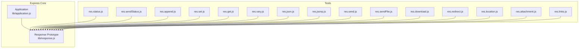
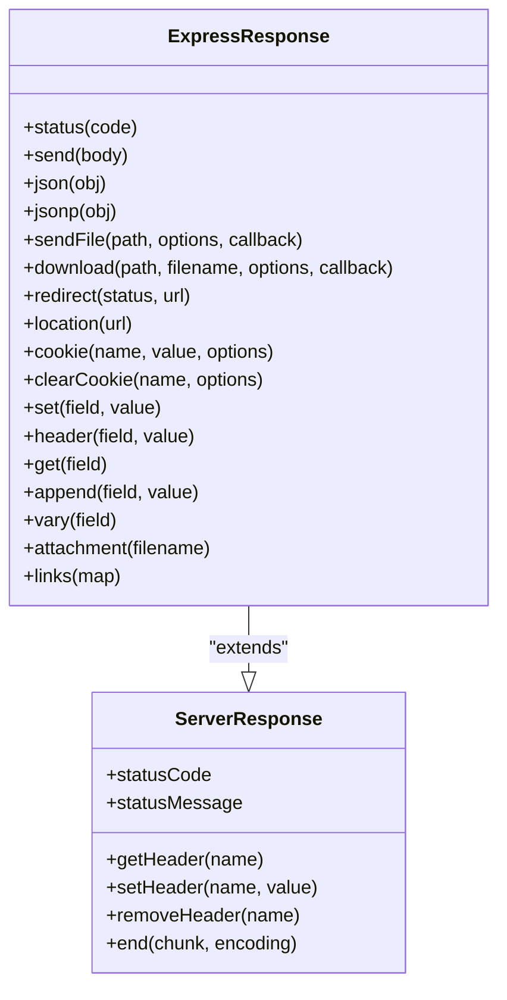
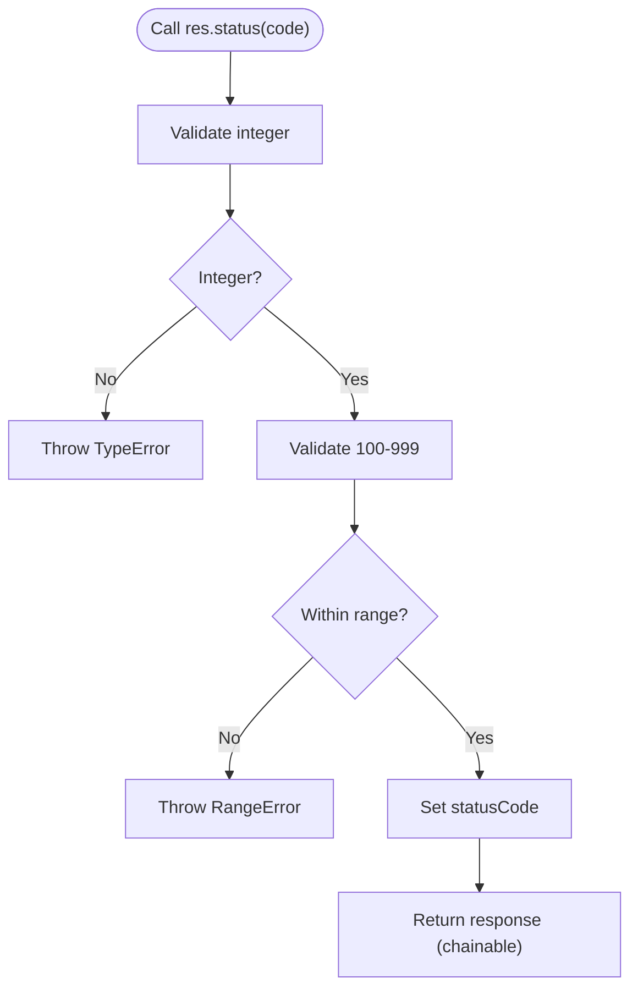
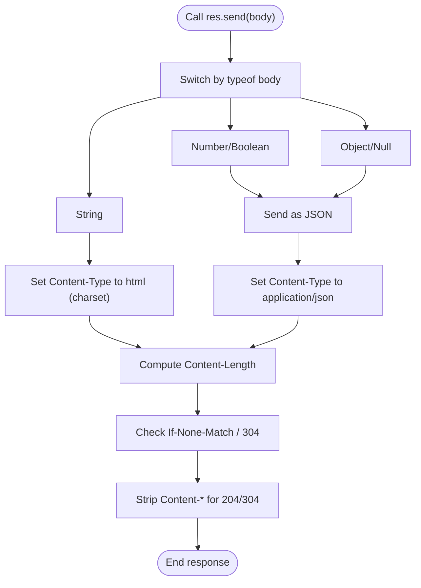
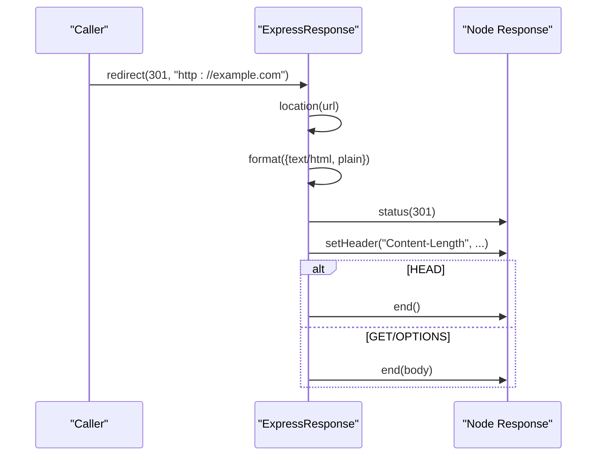
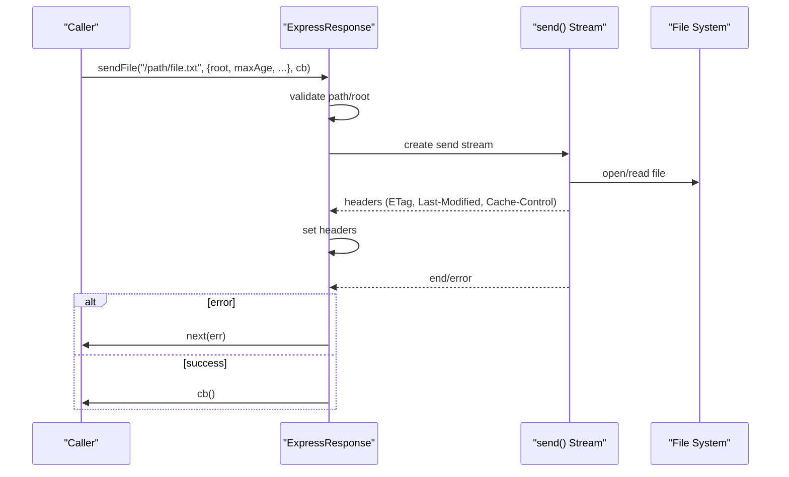
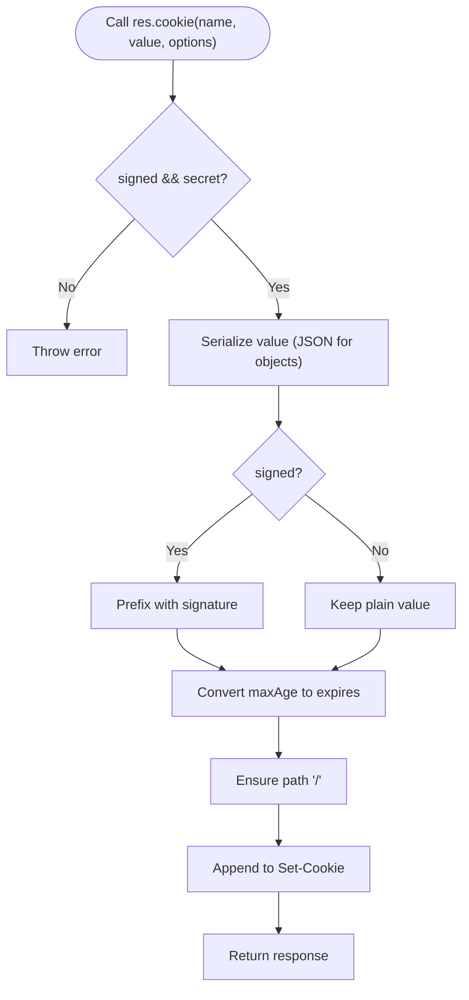
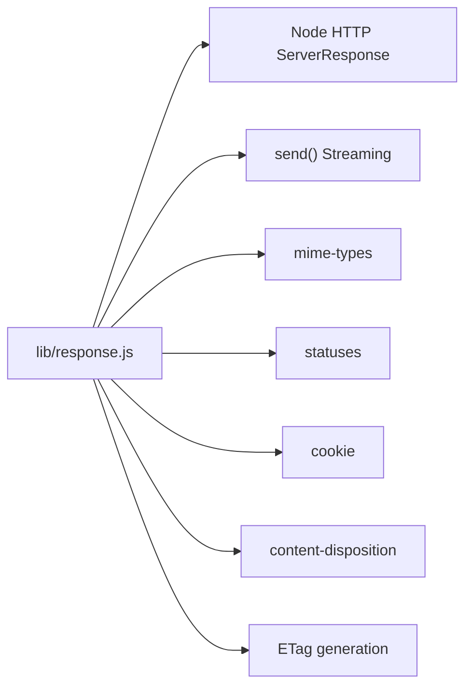

# Response Object Methods

<cite>
**Referenced Files in This Document**
- [response.js](file://lib/response.js)
- [res.status.js](file://test/res.status.js)
- [res.sendStatus.js](file://test/res.sendStatus.js)
- [res.append.js](file://test/res.append.js)
- [res.set.js](file://test/res.set.js)
- [res.get.js](file://test/res.get.js)
- [res.vary.js](file://test/res.vary.js)
- [res.json.js](file://test/res.json.js)
- [res.jsonp.js](file://test/res.jsonp.js)
- [res.send.js](file://test/res.send.js)
- [res.sendFile.js](file://test/res.sendFile.js)
- [res.download.js](file://test/res.download.js)
- [res.redirect.js](file://test/res.redirect.js)
- [res.location.js](file://test/res.location.js)
- [res.attachment.js](file://test/res.attachment.js)
- [res.links.js](file://test/res.links.js)
</cite>

## Table of Contents
1. [Introduction](#introduction)
2. [Project Structure](#project-structure)
3. [Core Components](#core-components)
4. [Architecture Overview](#architecture-overview)
5. [Detailed Component Analysis](#detailed-component-analysis)
6. [Dependency Analysis](#dependency-analysis)
7. [Performance Considerations](#performance-considerations)
8. [Troubleshooting Guide](#troubleshooting-guide)
9. [Conclusion](#conclusion)

## Introduction
This document provides comprehensive API documentation for Express.js Response Object Methods. It covers HTTP response enhancement methods grouped by functional categories: status and error responses, header manipulation, content negotiation and serialization, redirects and locations, file serving, and cookies. For each method, we outline method signatures, parameter specifications, return value behaviors, and practical usage patterns validated by tests. The goal is to help developers confidently use Express response helpers in API and web application contexts.

## Project Structure
Express exposes response helpers via a prototype that extends Node’s HTTP server response. The implementation resides in the response module and is exercised by a suite of tests that validate behavior across status codes, headers, content types, redirects, file transfers, and cookies.



**Diagram sources**
- [response.js:42-49](file://lib/response.js#L42-L49)
- [res.status.js:1-207](file://test/res.status.js#L1-L207)
- [res.sendStatus.js:1-45](file://test/res.sendStatus.js#L1-L45)
- [res.append.js:1-117](file://test/res.append.js#L1-L117)
- [res.set.js:1-125](file://test/res.set.js#L1-L125)
- [res.get.js:1-22](file://test/res.get.js#L1-L22)
- [res.vary.js:1-91](file://test/res.vary.js#L1-L91)
- [res.json.js:1-187](file://test/res.json.js#L1-L187)
- [res.jsonp.js:1-331](file://test/res.jsonp.js#L1-L331)
- [res.send.js:1-570](file://test/res.send.js#L1-L570)
- [res.sendFile.js:1-914](file://test/res.sendFile.js#L1-L914)
- [res.download.js:1-488](file://test/res.download.js#L1-L488)
- [res.redirect.js:1-215](file://test/res.redirect.js#L1-L215)
- [res.location.js:1-305](file://test/res.location.js#L1-L305)
- [res.attachment.js:1-80](file://test/res.attachment.js#L1-L80)
- [res.links.js:1-66](file://test/res.links.js#L1-L66)

**Section sources**
- [response.js:42-49](file://lib/response.js#L42-L49)

## Core Components
This section summarizes the primary response methods organized by category. Each entry includes the method name, purpose, and a pointer to the implementation and tests.

- Status and Error Responses
  - res.status(code): Sets the HTTP status code with validation and returns the response object for chaining.
  - res.sendStatus(code): Sets status and sends a textual body derived from the status code.
  - Tests: [res.status.js:1-207](file://test/res.status.js#L1-L207), [res.sendStatus.js:1-45](file://test/res.sendStatus.js#L1-L45)

- Header Manipulation
  - res.append(field, value): Appends a header value, supporting arrays and merging with existing values.
  - res.set(field, value) / res.header(field, value): Sets headers; expands Content-Type with charset; throws on invalid arrays.
  - res.get(field): Retrieves a header value.
  - res.vary(field): Adds entries to the Vary header without duplicates.
  - Tests: [res.append.js:1-117](file://test/res.append.js#L1-L117), [res.set.js:1-125](file://test/res.set.js#L1-L125), [res.get.js:1-22](file://test/res.get.js#L1-L22), [res.vary.js:1-91](file://test/res.vary.js#L1-L91)

- Content Serialization and Negotiation
  - res.json(obj): Serializes JSON with application/json; respects existing Content-Type.
  - res.jsonp(obj): Supports JSONP callback with security headers and charset handling.
  - res.send(body): Sends various body types (string, buffer, number, object) with automatic Content-Type and ETag generation.
  - res.format(map): Negotiates content type based on Accept header and sets Content-Type accordingly.
  - Tests: [res.json.js:1-187](file://test/res.json.js#L1-L187), [res.jsonp.js:1-331](file://test/res.jsonp.js#L1-L331), [res.send.js:1-570](file://test/res.send.js#L1-L570)

- Redirects and Locations
  - res.redirect([status,] url): Sets Location header and responds with a body appropriate to the Accept header; supports explicit status.
  - res.location(url): Sets the Location header with URL encoding rules.
  - Tests: [res.redirect.js:1-215](file://test/res.redirect.js#L1-L215), [res.location.js:1-305](file://test/res.location.js#L1-L305)

- File Serving and Attachments
  - res.sendFile(path, [options], [callback]): Streams a file with caching, ETag, and range support; validates path and options.
  - res.download(path, [filename], [options], [callback]): Same as sendFile but sets Content-Disposition to attachment.
  - res.attachment([filename]): Sets Content-Disposition to attachment and infers Content-Type from extension.
  - res.links(map): Builds and appends Link header entries for pagination or navigation.
  - Tests: [res.sendFile.js:1-914](file://test/res.sendFile.js#L1-L914), [res.download.js:1-488](file://test/res.download.js#L1-L488), [res.attachment.js:1-80](file://test/res.attachment.js#L1-L80), [res.links.js:1-66](file://test/res.links.js#L1-L66)

- Cookies
  - res.cookie(name, value, [options]): Sets a cookie with optional signing and default path.
  - res.clearCookie(name, [options]): Clears a cookie by expiring it in the past.
  - Tests: [res.cookie.js](file://test/res.cookie.js), [res.clearCookie.js](file://test/res.clearCookie.js)

**Section sources**
- [response.js:64-76](file://lib/response.js#L64-L76)
- [response.js:321-328](file://lib/response.js#L321-L328)
- [response.js:629-641](file://lib/response.js#L629-L641)
- [response.js:664-686](file://lib/response.js#L664-L686)
- [response.js:696-698](file://lib/response.js#L696-L698)
- [response.js:875-879](file://lib/response.js#L875-L879)
- [response.js:232-246](file://lib/response.js#L232-L246)
- [response.js:260-304](file://lib/response.js#L260-L304)
- [response.js:125-218](file://lib/response.js#L125-L218)
- [response.js:569-594](file://lib/response.js#L569-L594)
- [response.js:812-864](file://lib/response.js#L812-L864)
- [response.js:794-796](file://lib/response.js#L794-L796)
- [response.js:371-413](file://lib/response.js#L371-L413)
- [response.js:433-482](file://lib/response.js#L433-L482)
- [response.js:604-612](file://lib/response.js#L604-L612)
- [response.js:97-110](file://lib/response.js#L97-L110)
- [response.js:742-775](file://lib/response.js#L742-L775)
- [response.js:709-716](file://lib/response.js#L709-L716)

## Architecture Overview
The response methods are implemented on a prototype that extends Node’s ServerResponse. They build on Node internals and utility libraries to provide Express-specific conveniences such as content negotiation, file streaming, cookie handling, and ETag generation.



**Diagram sources**
- [response.js](file://lib/response.js#L42)
- [response.js:64-76](file://lib/response.js#L64-L76)
- [response.js:125-218](file://lib/response.js#L125-L218)
- [response.js:232-246](file://lib/response.js#L232-L246)
- [response.js:260-304](file://lib/response.js#L260-L304)
- [response.js:371-413](file://lib/response.js#L371-L413)
- [response.js:433-482](file://lib/response.js#L433-L482)
- [response.js:812-864](file://lib/response.js#L812-L864)
- [response.js:794-796](file://lib/response.js#L794-L796)
- [response.js:742-775](file://lib/response.js#L742-L775)
- [response.js:709-716](file://lib/response.js#L709-L716)
- [response.js:664-686](file://lib/response.js#L664-L686)
- [response.js:696-698](file://lib/response.js#L696-L698)
- [response.js:629-641](file://lib/response.js#L629-L641)
- [response.js:875-879](file://lib/response.js#L875-L879)
- [response.js:604-612](file://lib/response.js#L604-L612)
- [response.js:97-110](file://lib/response.js#L97-L110)

## Detailed Component Analysis

### Status and Error Responses
- res.status(code)
  - Purpose: Validates and sets the HTTP status code.
  - Signature: status(number) -> ServerResponse
  - Behavior: Throws on non-integer or out-of-range codes; returns this for chaining.
  - Tests: [res.status.js:1-207](file://test/res.status.js#L1-L207)

- res.sendStatus(code)
  - Purpose: Sets status and sends a human-readable message body.
  - Signature: sendStatus(number) -> ServerResponse
  - Behavior: Uses status message or numeric code; sets Content-Type to text/plain.
  - Tests: [res.sendStatus.js:1-45](file://test/res.sendStatus.js#L1-L45)



**Diagram sources**
- [response.js:64-76](file://lib/response.js#L64-L76)
- [res.status.js:119-203](file://test/res.status.js#L119-L203)

**Section sources**
- [response.js:64-76](file://lib/response.js#L64-L76)
- [res.status.js:1-207](file://test/res.status.js#L1-L207)
- [response.js:321-328](file://lib/response.js#L321-L328)
- [res.sendStatus.js:1-45](file://test/res.sendStatus.js#L1-L45)

### Header Manipulation
- res.append(field, value)
  - Purpose: Concatenates header values; supports arrays and merging with existing values.
  - Signature: append(string, string|array) -> ServerResponse
  - Behavior: Converts values to strings; merges arrays; replaces with res.set.
  - Tests: [res.append.js:1-117](file://test/res.append.js#L1-L117)

- res.set(field, value) / res.header(field, value)
  - Purpose: Sets headers; expands Content-Type with charset; rejects arrays for Content-Type.
  - Signature: set(string|object, string|array?) -> ServerResponse
  - Behavior: Coerces values to strings; throws on invalid Content-Type arrays.
  - Tests: [res.set.js:1-125](file://test/res.set.js#L1-L125)

- res.get(field)
  - Purpose: Retrieves a header value.
  - Signature: get(string) -> string
  - Tests: [res.get.js:1-22](file://test/res.get.js#L1-L22)

- res.vary(field)
  - Purpose: Adds entries to the Vary header without duplicates.
  - Signature: vary(string|array) -> ServerResponse
  - Behavior: Throws when called without arguments; deduplicates values.
  - Tests: [res.vary.js:1-91](file://test/res.vary.js#L1-L91)

```mermaid
sequenceDiagram
participant C as "Caller"
participant R as "ExpressResponse"
participant H as "Node Headers"
C->>R : set("Content-Type", "text/html")
R->>R : Expand charset if needed
R->>H : setHeader("Content-Type", "text/html; charset=...")
R-->>C : return this
```

**Diagram sources**
- [response.js:664-686](file://lib/response.js#L664-L686)

**Section sources**
- [response.js:629-641](file://lib/response.js#L629-L641)
- [res.append.js:1-117](file://test/res.append.js#L1-L117)
- [response.js:664-686](file://lib/response.js#L664-L686)
- [res.set.js:1-125](file://test/res.set.js#L1-L125)
- [response.js:696-698](file://lib/response.js#L696-L698)
- [res.get.js:1-22](file://test/res.get.js#L1-L22)
- [response.js:875-879](file://lib/response.js#L875-L879)
- [res.vary.js:1-91](file://test/res.vary.js#L1-L91)

### Content Serialization and Negotiation
- res.json(obj)
  - Purpose: Serializes object to JSON with application/json; respects existing Content-Type.
  - Signature: json(any) -> ServerResponse
  - Behavior: Uses application/json; honors app settings for replacer, spaces, escape.
  - Tests: [res.json.js:1-187](file://test/res.json.js#L1-L187)

- res.jsonp(obj)
  - Purpose: Supports JSONP callback with security headers and charset handling.
  - Signature: jsonp(any) -> ServerResponse
  - Behavior: Detects callback query; sets text/javascript; adds nosniff; escapes unsafe characters.
  - Tests: [res.jsonp.js:1-331](file://test/res.jsonp.js#L1-L331)

- res.send(body)
  - Purpose: Sends body with automatic Content-Type and ETag generation.
  - Signature: send(any) -> ServerResponse
  - Behavior: String -> html; Buffer -> binary; Object -> json; Number -> json; HEAD -> no body; 204/304 -> strips Content-*.
  - Tests: [res.send.js:1-570](file://test/res.send.js#L1-L570)

- res.format(map)
  - Purpose: Negotiates content type based on Accept header.
  - Signature: format(object) -> ServerResponse
  - Behavior: Calls matching callback; sets Content-Type; 406 if none match; varies Accept.
  - Tests: [res.format.js](file://test/res.format.js)



**Diagram sources**
- [response.js:125-218](file://lib/response.js#L125-L218)

**Section sources**
- [response.js:232-246](file://lib/response.js#L232-L246)
- [res.json.js:1-187](file://test/res.json.js#L1-L187)
- [response.js:260-304](file://lib/response.js#L260-L304)
- [res.jsonp.js:1-331](file://test/res.jsonp.js#L1-L331)
- [response.js:125-218](file://lib/response.js#L125-L218)
- [res.send.js:1-570](file://test/res.send.js#L1-L570)
- [response.js:569-594](file://lib/response.js#L569-L594)
- [res.format.js](file://test/res.format.js)

### Redirects and Locations
- res.redirect([status,] url)
  - Purpose: Sets Location header and responds with a body appropriate to Accept.
  - Signature: redirect(url) | redirect(status, url) -> ServerResponse
  - Behavior: Encodes URL; selects text/html or plain; sets Content-Length; HEAD -> no body.
  - Tests: [res.redirect.js:1-215](file://test/res.redirect.js#L1-L215)

- res.location(url)
  - Purpose: Sets the Location header with URL encoding rules.
  - Signature: location(string|URL) -> ServerResponse
  - Behavior: Encodes special characters; preserves schemeless paths; handles non-string inputs.
  - Tests: [res.location.js:1-305](file://test/res.location.js#L1-L305)



**Diagram sources**
- [response.js:812-864](file://lib/response.js#L812-L864)
- [response.js:794-796](file://lib/response.js#L794-L796)
- [res.redirect.js:1-215](file://test/res.redirect.js#L1-L215)
- [res.location.js:1-305](file://test/res.location.js#L1-L305)

**Section sources**
- [response.js:812-864](file://lib/response.js#L812-L864)
- [res.redirect.js:1-215](file://test/res.redirect.js#L1-L215)
- [response.js:794-796](file://lib/response.js#L794-L796)
- [res.location.js:1-305](file://test/res.location.js#L1-L305)

### File Serving and Attachments
- res.sendFile(path, [options], [callback])
  - Purpose: Streams a file with caching, ETag, and range support; validates path and options.
  - Signature: sendFile(string, [options], [callback]) -> void
  - Behavior: Requires absolute path or root; integrates with send module; invokes callback on finish/error.
  - Tests: [res.sendFile.js:1-914](file://test/res.sendFile.js#L1-L914)

- res.download(path, [filename], [options], [callback])
  - Purpose: Same as sendFile but sets Content-Disposition to attachment.
  - Signature: download(string, [string|function], [object|function], [function]) -> ServerResponse
  - Behavior: Merges headers; enforces Content-Disposition; supports root and dotfiles policies.
  - Tests: [res.download.js:1-488](file://test/res.download.js#L1-L488)

- res.attachment([filename])
  - Purpose: Sets Content-Disposition to attachment and infers Content-Type from extension.
  - Signature: attachment([string]) -> ServerResponse
  - Tests: [res.attachment.js:1-80](file://test/res.attachment.js#L1-L80)

- res.links(map)
  - Purpose: Builds and appends Link header entries for pagination or navigation.
  - Signature: links(object) -> ServerResponse
  - Tests: [res.links.js:1-66](file://test/res.links.js#L1-L66)



**Diagram sources**
- [response.js:371-413](file://lib/response.js#L371-L413)
- [response.js:433-482](file://lib/response.js#L433-L482)
- [response.js:97-110](file://lib/response.js#L97-L110)

**Section sources**
- [response.js:371-413](file://lib/response.js#L371-L413)
- [res.sendFile.js:1-914](file://test/res.sendFile.js#L1-L914)
- [response.js:433-482](file://lib/response.js#L433-L482)
- [res.download.js:1-488](file://test/res.download.js#L1-L488)
- [response.js:604-612](file://lib/response.js#L604-L612)
- [res.attachment.js:1-80](file://test/res.attachment.js#L1-L80)
- [response.js:97-110](file://lib/response.js#L97-L110)
- [res.links.js:1-66](file://test/res.links.js#L1-L66)

### Cookies
- res.cookie(name, value, [options])
  - Purpose: Sets a cookie with optional signing and default path.
  - Signature: cookie(string, string|object, [object]) -> ServerResponse
  - Behavior: Signs values when secret is configured; normalizes maxAge to expires; defaults path to "/".
  - Tests: [res.cookie.js](file://test/res.cookie.js)

- res.clearCookie(name, [options])
  - Purpose: Clears a cookie by expiring it in the past.
  - Signature: clearCookie(string, [object]) -> ServerResponse
  - Behavior: Forces expires to epoch; ensures maxAge is not passed.
  - Tests: [res.clearCookie.js](file://test/res.clearCookie.js)



**Diagram sources**
- [response.js:742-775](file://lib/response.js#L742-L775)
- [response.js:709-716](file://lib/response.js#L709-L716)

**Section sources**
- [response.js:742-775](file://lib/response.js#L742-L775)
- [res.cookie.js](file://test/res.cookie.js)
- [response.js:709-716](file://lib/response.js#L709-L716)
- [res.clearCookie.js](file://test/res.clearCookie.js)

## Dependency Analysis
Response methods rely on Node’s HTTP server response, utility libraries for content negotiation and file serving, and internal helpers for ETags and content types. The tests exercise these dependencies and validate cross-cutting concerns like encoding, caching, and security.



**Diagram sources**
- [response.js:15-35](file://lib/response.js#L15-L35)

**Section sources**
- [response.js:15-35](file://lib/response.js#L15-L35)

## Performance Considerations
- ETag Generation: Enabled via app setting; can be strong or weak; custom generator supported. See [res.send.js:361-568](file://test/res.send.js#L361-L568).
- Content-Length and Body Handling: res.send computes lengths and strips headers for 204/304/205 to minimize payload. See [response.js:164-207](file://lib/response.js#L164-L207).
- File Streaming: res.sendFile integrates with the send module for efficient streaming, range requests, and caching. See [response.js:371-413](file://lib/response.js#L371-L413) and [res.sendFile.js:1-914](file://test/res.sendFile.js#L1-L914).
- Redirect Body Size: res.redirect sets Content-Length and avoids sending bodies for HEAD requests. See [response.js:838-864](file://lib/response.js#L838-L864) and [res.redirect.js:64-79](file://test/res.redirect.js#L64-L79).

[No sources needed since this section provides general guidance]

## Troubleshooting Guide
- Invalid Status Codes
  - Symptom: Errors for non-integers or out-of-range codes.
  - Resolution: Ensure integer status in 100–999. See [res.status.js:119-203](file://test/res.status.js#L119-L203).

- Content-Type Arrays
  - Symptom: TypeError when setting Content-Type to an array.
  - Resolution: Pass a single string or object; Express expands charset automatically. See [res.set.js:78-89](file://test/res.set.js#L78-L89).

- Missing Path in sendFile
  - Symptom: Validation errors for non-string or non-absolute paths.
  - Resolution: Provide absolute path or set root option. See [res.sendFile.js:17-40](file://test/res.sendFile.js#L17-L40).

- Redirect Encoding Issues
  - Symptom: Malformed Location header or bypassed allow-lists.
  - Resolution: Use res.location or res.redirect; they encode URLs safely. See [res.location.js:172-303](file://test/res.location.js#L172-L303).

- Cookie Signing
  - Symptom: Error when signing cookies without a secret.
  - Resolution: Configure app secret or call without signed option. See [response.js:747-749](file://lib/response.js#L747-L749).

**Section sources**
- [res.status.js:119-203](file://test/res.status.js#L119-L203)
- [res.set.js:78-89](file://test/res.set.js#L78-L89)
- [res.sendFile.js:17-40](file://test/res.sendFile.js#L17-L40)
- [res.location.js:172-303](file://test/res.location.js#L172-L303)
- [response.js:747-749](file://lib/response.js#L747-L749)

## Conclusion
Express response methods provide a cohesive, chainable API for building HTTP responses. They integrate tightly with Node’s server response while offering higher-level conveniences such as content negotiation, file streaming, cookie management, and robust header handling. The included tests demonstrate real-world usage patterns and edge-case handling, ensuring reliable behavior across diverse scenarios.