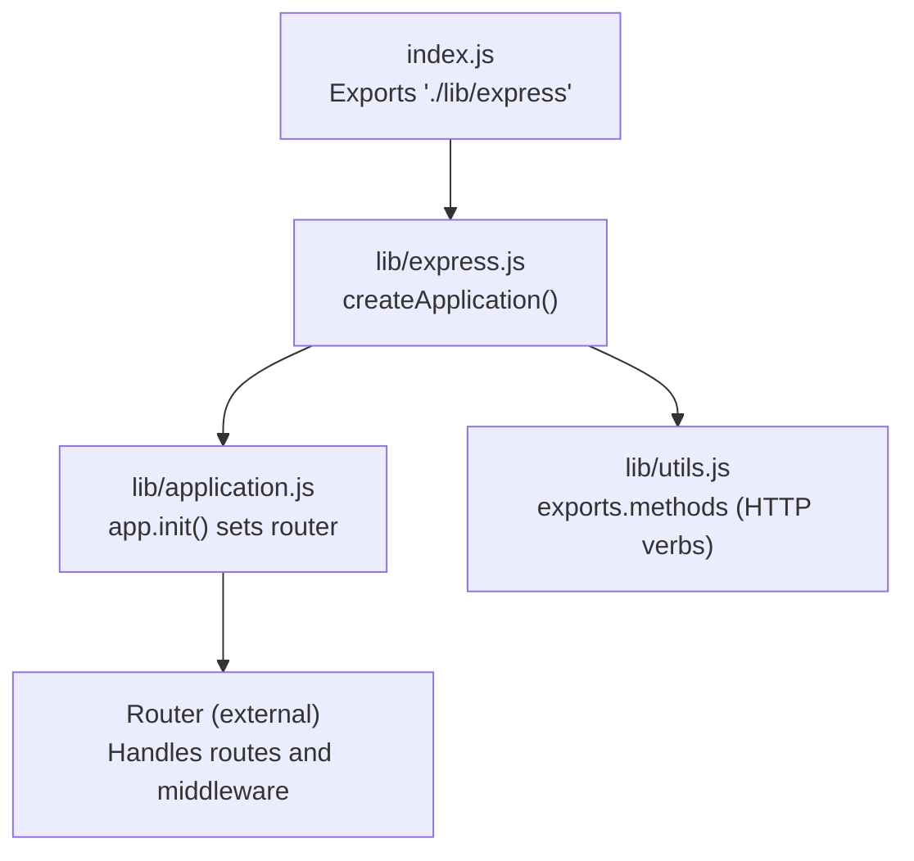
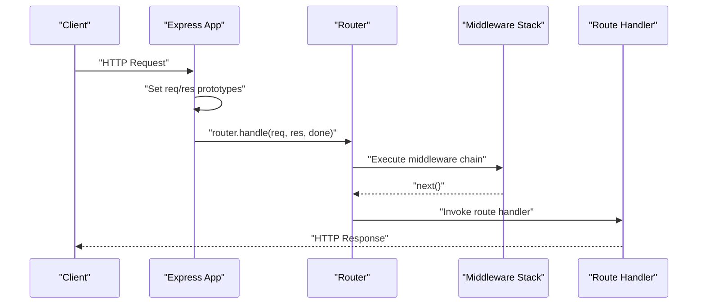
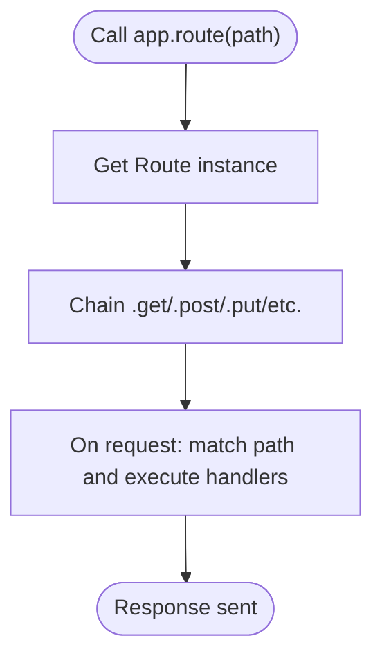
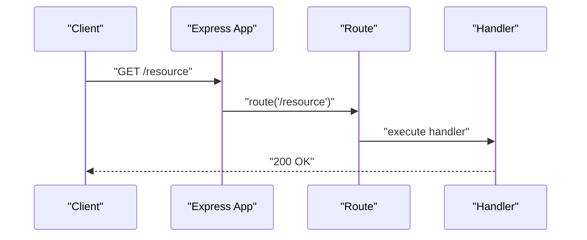
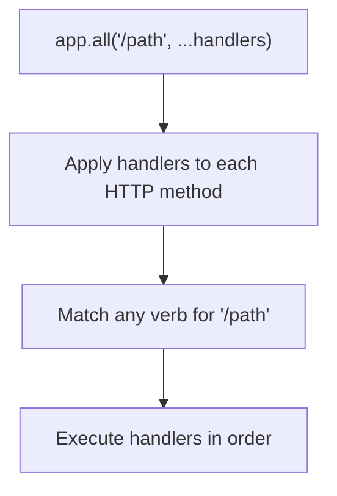
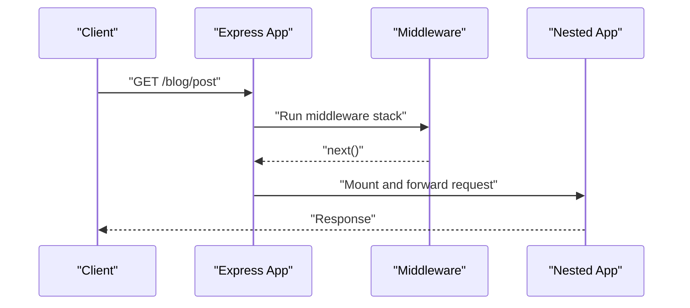
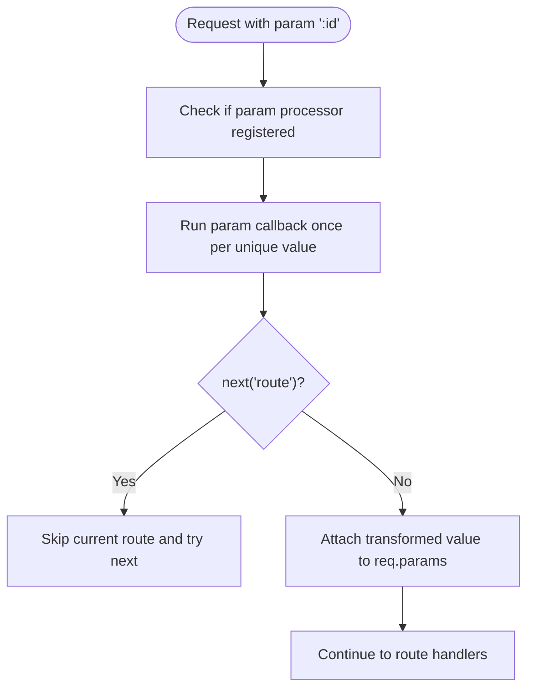
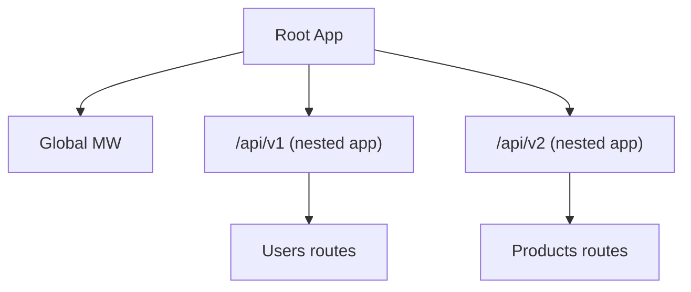
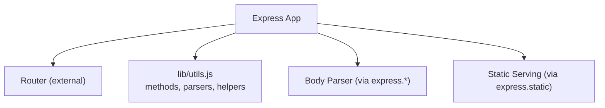

# Routing API

<cite>
**Referenced Files in This Document**
- [index.js](file://index.js)
- [lib/express.js](file://lib/express.js)
- [lib/application.js](file://lib/application.js)
- [lib/utils.js](file://lib/utils.js)
- [examples/route-separation/index.js](file://examples/route-separation/index.js)
- [examples/multi-router/index.js](file://examples/multi-router/index.js)
- [examples/route-map/index.js](file://examples/route-map/index.js)
- [examples/route-middleware/index.js](file://examples/route-middleware/index.js)
- [examples/params/index.js](file://examples/params/index.js)
- [test/app.route.js](file://test/app.route.js)
- [test/app.use.js](file://test/app.use.js)
- [test/app.param.js](file://test/app.param.js)
- [test/app.all.js](file://test/app.all.js)
</cite>

## Table of Contents
1. [Introduction](#introduction)
2. [Project Structure](#project-structure)
3. [Core Components](#core-components)
4. [Architecture Overview](#architecture-overview)
5. [Detailed Component Analysis](#detailed-component-analysis)
6. [Dependency Analysis](#dependency-analysis)
7. [Performance Considerations](#performance-considerations)
8. [Troubleshooting Guide](#troubleshooting-guide)
9. [Conclusion](#conclusion)
10. [Appendices](#appendices)

## Introduction
This document provides comprehensive API documentation for Express.js routing methods and router functionality. It covers router methods such as app.route(), router.get(), router.post(), router.put(), router.delete(), router.all(), router.use(), and router.param(). It also explains route parameter handling, route middleware, nested routing, router composition patterns, route definition syntax, parameter extraction, wildcard matching, and route precedence. Practical examples and best practices for organizing routes are included.

## Project Structure
Express exposes a factory to create applications and delegates routing to a Router instance. The application initialization sets up a lazy-initialized router and proxies routing methods to it. Utility helpers define supported HTTP methods and other internal behaviors.

**Diagram sources**
- [index.js:11](file://index.js#L11)
- [lib/express.js:36](file://lib/express.js#L36)
- [lib/application.js:59](file://lib/application.js#L59)
- [lib/utils.js:29](file://lib/utils.js#L29)

**Section sources**
- [index.js:11](file://index.js#L11)
- [lib/express.js:36](file://lib/express.js#L36)
- [lib/application.js:59](file://lib/application.js#L59)
- [lib/utils.js:29](file://lib/utils.js#L29)

## Core Components
- Application router creation and delegation:
  - The application initializes a lazy-loaded router and exposes methods that delegate to it.
  - Methods like app.get(), app.post(), etc., are dynamically generated to call app.route(path)[method](...).
  - app.all() applies a route to all HTTP methods via the underlying router.
- Middleware mounting:
  - app.use() mounts middleware or nested apps at a given path and supports arrays and regular expressions.
- Route definition and parameterization:
  - app.route() returns a Route instance for chaining VERB methods.
  - app.param() registers parameter processors that transform or validate route parameters.

Key behaviors:
- Route precedence and middleware order are respected during request handling.
- Parameter processors run once per unique parameter value per request and can influence downstream routes.

**Section sources**
- [lib/application.js:467](file://lib/application.js#L467)
- [lib/application.js:494](file://lib/application.js#L494)
- [lib/application.js:190](file://lib/application.js#L190)
- [lib/application.js:256](file://lib/application.js#L256)
- [lib/application.js:322](file://lib/application.js#L322)

## Architecture Overview
Express composes an application that delegates HTTP routing to a Router instance. The application’s handle method runs the request through the router, which executes middleware and route handlers in order.

**Diagram sources**
- [lib/application.js:152](file://lib/application.js#L152)
- [lib/application.js:177](file://lib/application.js#L177)

**Section sources**
- [lib/application.js:152](file://lib/application.js#L152)
- [lib/application.js:177](file://lib/application.js#L177)

## Detailed Component Analysis

### app.route(path)
- Purpose: Creates and returns a Route instance for the given path, enabling method chaining for VERB methods.
- Behavior:
  - Supports dynamic segments via colons (e.g., :id).
  - Supports promises; rejected promises propagate errors to error-handling middleware.
  - Chaining order matters; later VERBs can override earlier ones.
- Examples:
  - Basic chaining of GET and POST on the same path.
  - Dynamic segment extraction via req.params.
  - Promise rejection handling with dedicated error middleware.

**Diagram sources**
- [lib/application.js:256](file://lib/application.js#L256)
- [test/app.route.js:10](file://test/app.route.js#L10)
- [test/app.route.js:45](file://test/app.route.js#L45)

**Section sources**
- [lib/application.js:256](file://lib/application.js#L256)
- [test/app.route.js:10](file://test/app.route.js#L10)
- [test/app.route.js:45](file://test/app.route.js#L45)

### app.get(), app.post(), app.put(), app.delete(), app.patch(), app.head(), app.options()
- Purpose: Shorthand methods that delegate to app.route(path)[method](...).
- Behavior:
  - app.get(setting) returns a setting value when invoked with a single argument.
  - Otherwise, they create a route and attach the specified VERB handler.
- Notes:
  - Supported HTTP methods are derived from Node’s http.METHODS and normalized to lowercase.

**Diagram sources**
- [lib/application.js:467](file://lib/application.js#L467)
- [lib/utils.js:29](file://lib/utils.js#L29)

**Section sources**
- [lib/application.js:467](file://lib/application.js#L467)
- [lib/utils.js:29](file://lib/utils.js#L29)

### app.all(path, ...)
- Purpose: Attaches the same middleware/handlers to all HTTP methods for a given path.
- Behavior:
  - Iterates over supported methods and applies the provided handlers.
  - Useful for cross-cutting concerns like logging or CORS.

**Diagram sources**
- [lib/application.js:494](file://lib/application.js#L494)
- [test/app.all.js:12](file://test/app.all.js#L12)

**Section sources**
- [lib/application.js:494](file://lib/application.js#L494)
- [test/app.all.js:12](file://test/app.all.js#L12)

### app.use([path,] ...middleware)
- Purpose: Mounts middleware or nested applications at a given path.
- Behavior:
  - Accepts multiple middleware functions, arrays of middleware, and nested apps.
  - Supports string paths, arrays of paths, regular expressions, and leading/trailing slashes.
  - Strips the matched path prefix from req.url for downstream middleware.
  - Emits a “mount” event on nested apps.
- Examples:
  - Mounting nested apps at distinct paths.
  - Applying middleware arrays and mixed arguments.
  - Using regular expressions for path matching.

**Diagram sources**
- [lib/application.js:190](file://lib/application.js#L190)
- [test/app.use.js:31](file://test/app.use.js#L31)
- [test/app.use.js:284](file://test/app.use.js#L284)

**Section sources**
- [lib/application.js:190](file://lib/application.js#L190)
- [test/app.use.js:31](file://test/app.use.js#L31)
- [test/app.use.js:284](file://test/app.use.js#L284)

### app.param(name | names, callback)
- Purpose: Registers parameter processors that transform or validate route parameters.
- Behavior:
  - Runs once per unique parameter value per request.
  - Can short-circuit to the next route via next('route').
  - Can throw errors or call next with an error to trigger error-handling middleware.
  - Supports arrays of parameter names.
- Examples:
  - Converting numeric parameters to integers.
  - Loading resources by ID and attaching to req.
  - Altering req.params to influence downstream routes.

**Diagram sources**
- [lib/application.js:322](file://lib/application.js#L322)
- [test/app.param.js:11](file://test/app.param.js#L11)
- [test/app.param.js:43](file://test/app.param.js#L43)

**Section sources**
- [lib/application.js:322](file://lib/application.js#L322)
- [test/app.param.js:11](file://test/app.param.js#L11)
- [test/app.param.js:43](file://test/app.param.js#L43)

### Route Definition Syntax, Parameters, Wildcards, and Precedence
- Path syntax:
  - Static segments: /users
  - Dynamic segments: /users/:id
  - Optional segments: /users/:id?
  - Regular expressions: app.use(/^\/api/, ...)
  - Arrays of paths: app.use(['/foo', '/bar'], ...)
- Parameter extraction:
  - Values are available via req.params.name.
  - Encoded values are decoded automatically.
- Wildcard matching:
  - Use splat-style patterns in handlers or middleware to capture remaining path segments.
- Precedence:
  - Order of app.use() and route definitions determines execution.
  - app.route() chaining allows overriding earlier handlers with later ones.
  - app.param() processors run before route handlers for the same parameter.

Examples demonstrating these concepts appear in:
- Route separation and composition across modules.
- Multi-router composition with distinct mount points.
- Route map construction via recursive mapping.
- Parameter processing and middleware composition.

**Section sources**
- [examples/route-separation/index.js:41](file://examples/route-separation/index.js#L41)
- [examples/multi-router/index.js:7](file://examples/multi-router/index.js#L7)
- [examples/route-map/index.js:14](file://examples/route-map/index.js#L14)
- [examples/params/index.js:23](file://examples/params/index.js#L23)

### Route Middleware and Nested Routing
- Middleware:
  - Apply middleware globally, per-route, or per-method via chaining.
  - Use arrays and multiple arguments to compose middleware stacks.
- Nested routing:
  - Mount separate Express apps at different paths.
  - Combine middleware and nested apps in a single app.use() call.

**Diagram sources**
- [examples/multi-router/index.js:7](file://examples/multi-router/index.js#L7)
- [examples/route-separation/index.js:38](file://examples/route-separation/index.js#L38)

**Section sources**
- [examples/multi-router/index.js:7](file://examples/multi-router/index.js#L7)
- [examples/route-separation/index.js:38](file://examples/route-separation/index.js#L38)

### Complex Routing Scenarios and Best Practices
- Organizing routes:
  - Separate concerns into modular routers and mount them under versioned paths.
  - Use app.route() for related actions on the same resource.
- Parameter handling:
  - Centralize parameter processing with app.param() to avoid duplication.
  - Validate and transform early; short-circuit to next route when invalid.
- Middleware composition:
  - Keep middleware focused and reusable.
  - Place stricter checks (e.g., authorization) after loaders (e.g., user loading).
- Error handling:
  - Add error-handling middleware after all routes to catch thrown errors and rejected promises.
- Route precedence:
  - Define broad catch-all middleware last.
  - Prefer explicit paths over overly broad regexps.

**Section sources**
- [examples/route-middleware/index.js](file://examples/route-middleware/index.js)
- [examples/params/index.js:23](file://examples/params/index.js#L23)
- [test/app.route.js:66](file://test/app.route.js#L66)

## Dependency Analysis
Express depends on:
- Router (external): Handles route registration, matching, and middleware execution.
- Node http methods: Supported HTTP methods are derived from Node’s http.METHODS.
- Body parsing and static serving: Provided via express.json(), express.urlencoded(), express.text(), express.raw(), and express.static().

**Diagram sources**
- [lib/express.js:19](file://lib/express.js#L19)
- [lib/express.js:77](file://lib/express.js#L77)
- [lib/utils.js:29](file://lib/utils.js#L29)

**Section sources**
- [lib/express.js:19](file://lib/express.js#L19)
- [lib/express.js:77](file://lib/express.js#L77)
- [lib/utils.js:29](file://lib/utils.js#L29)

## Performance Considerations
- Minimize middleware overhead by keeping handlers efficient and avoiding synchronous I/O.
- Use app.all() judiciously; prefer targeted VERB methods to reduce unnecessary handler invocations.
- Avoid overly broad regular expressions; prefer explicit paths for predictable performance.
- Cache expensive computations in middleware or shared modules.

## Troubleshooting Guide
Common issues and resolutions:
- app.use() requires a middleware function:
  - Ensure the argument is a function or an Express app; arrays of non-functions are not accepted.
- Path stripping:
  - When mounting middleware at a prefix, req.url is stripped accordingly; verify originalUrl if needed.
- Parameter processors:
  - If a processor throws or calls next('route'), subsequent handlers may be skipped; confirm processor logic.
- Promise rejections:
  - Unhandled promise rejections in route handlers propagate to error-handling middleware; add error handlers.

**Section sources**
- [test/app.use.js:259](file://test/app.use.js#L259)
- [test/app.use.js:284](file://test/app.use.js#L284)
- [test/app.param.js:179](file://test/app.param.js#L179)
- [test/app.route.js:66](file://test/app.route.js#L66)

## Conclusion
Express routing centers around a Router-backed application that exposes convenient methods for defining routes, mounting middleware, and composing nested applications. Understanding parameter processing, middleware ordering, and route precedence enables building scalable and maintainable APIs. Use modular composition, centralized parameter handling, and robust error handling to achieve clean and predictable routing behavior.

## Appendices
- Example projects demonstrating routing patterns:
  - Route separation and composition across modules.
  - Multi-router composition with versioned paths.
  - Route map construction via recursive mapping.
  - Middleware-driven authorization and parameter processing.
- Tests validating behavior:
  - Route chaining, dynamic parameters, and promise handling.
  - Middleware mounting with arrays, paths, and regular expressions.
  - Parameter processors and route deferral.

**Section sources**
- [examples/route-separation/index.js](file://examples/route-separation/index.js)
- [examples/multi-router/index.js](file://examples/multi-router/index.js)
- [examples/route-map/index.js](file://examples/route-map/index.js)
- [examples/route-middleware/index.js](file://examples/route-middleware/index.js)
- [examples/params/index.js](file://examples/params/index.js)
- [test/app.route.js](file://test/app.route.js)
- [test/app.use.js](file://test/app.use.js)
- [test/app.param.js](file://test/app.param.js)
- [test/app.all.js](file://test/app.all.js)