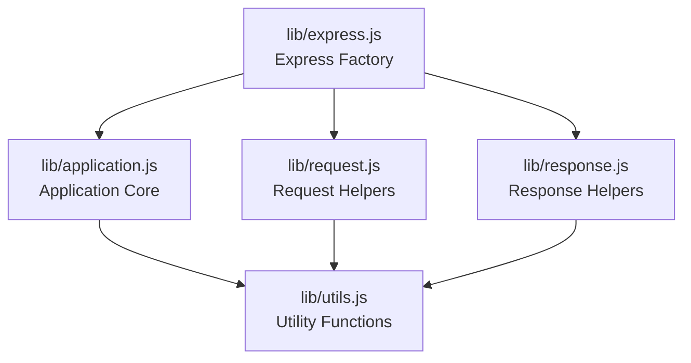
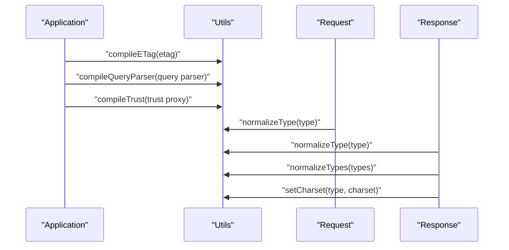
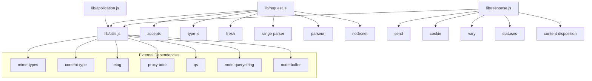

# Utility API

<cite>
**Referenced Files in This Document**
- [lib/utils.js](file://lib/utils.js)
- [lib/application.js](file://lib/application.js)
- [lib/request.js](file://lib/request.js)
- [lib/response.js](file://lib/response.js)
- [lib/express.js](file://lib/express.js)
- [test/utils.js](file://test/utils.js)
- [examples/content-negotiation/index.js](file://examples/content-negotiation/index.js)
</cite>

## Table of Contents
1. [Introduction](#introduction)
2. [Project Structure](#project-structure)
3. [Core Components](#core-components)
4. [Architecture Overview](#architecture-overview)
5. [Detailed Component Analysis](#detailed-component-analysis)
6. [Dependency Analysis](#dependency-analysis)
7. [Performance Considerations](#performance-considerations)
8. [Troubleshooting Guide](#troubleshooting-guide)
9. [Conclusion](#conclusion)

## Introduction
This document provides comprehensive API documentation for Express.js utility functions and helper methods. It focuses on utility functions including mixin utilities, type checking functions, content negotiation helpers, and internal utility methods. The documentation covers path resolution functions, MIME type detection, and other helper utilities used throughout the framework. It explains function signatures, parameters, return values, and usage contexts, and provides examples of utility function usage in middleware development and application code.

## Project Structure
Express.js organizes its utilities primarily in the `lib/utils.js` module, which is consumed by core modules such as `application.js`, `request.js`, and `response.js`. The main Express factory function in `lib/express.js` creates applications and exposes utility functions through the application prototype. Example usage of content negotiation helpers appears in the examples directory.

**Diagram sources**
- [lib/express.js:36-56](file://lib/express.js#L36-L56)
- [lib/application.js:15-26](file://lib/application.js#L15-L26)
- [lib/request.js:15-24](file://lib/request.js#L15-L24)
- [lib/response.js:15-36](file://lib/response.js#L15-L36)

**Section sources**
- [lib/express.js:36-56](file://lib/express.js#L36-L56)
- [lib/application.js:15-26](file://lib/application.js#L15-L26)
- [lib/request.js:15-24](file://lib/request.js#L15-L24)
- [lib/response.js:15-36](file://lib/response.js#L15-L36)

## Core Components
This section documents the primary utility functions exported by `lib/utils.js` and their roles in the framework.

- ETag Generation
  - Strong ETag generator: [exports.etag](file://lib/utils.js#L40)
  - Weak ETag generator: [exports.wetag](file://lib/utils.js#L51)
  - Generator creation: [createETagGenerator:249-257](file://lib/utils.js#L249-L257)

- Type Normalization and MIME Detection
  - Normalize a single type: [exports.normalizeType:61-65](file://lib/utils.js#L61-L65)
  - Normalize multiple types: [exports.normalizeTypes:75-77](file://lib/utils.js#L75-L77)
  - Parse accept parameters: [acceptParams:89-120](file://lib/utils.js#L89-L120)

- Query Parser Compilation
  - Compile query parser: [exports.compileQueryParser:162-184](file://lib/utils.js#L162-L184)
  - Extended query string parser: [parseExtendedQueryString:267-271](file://lib/utils.js#L267-L271)

- Trust Proxy Compilation
  - Compile trust proxy: [exports.compileTrust:194-214](file://lib/utils.js#L194-L214)

- Charset Management
  - Set charset in Content-Type: [exports.setCharset:225-238](file://lib/utils.js#L225-L238)

- HTTP Method List
  - Lowercased HTTP methods: [exports.methods](file://lib/utils.js#L29)

These utilities are consumed by application initialization, request parsing, and response handling.

**Section sources**
- [lib/utils.js:29-272](file://lib/utils.js#L29-L272)

## Architecture Overview
The utility functions are integrated into the Express architecture through the application prototype and request/response prototypes. The application module compiles settings such as ETag functions, query parsers, and trust proxies using utilities from `lib/utils.js`. Request and response modules rely on utilities for type normalization and MIME detection during content negotiation.

**Diagram sources**
- [lib/application.js:364-372](file://lib/application.js#L364-L380)
- [lib/request.js:127-130](file://lib/request.js#L127-L130)
- [lib/response.js:569-594](file://lib/response.js#L569-L594)
- [lib/response.js:504-510](file://lib/response.js#L504-L510)
- [lib/response.js:225-238](file://lib/response.js#L225-L238)

## Detailed Component Analysis

### ETag Utilities
The ETag utilities generate strong and weak ETags for response bodies. They support both string and buffer inputs and are configured via application settings.

- Function: [exports.etag](file://lib/utils.js#L40)
  - Purpose: Generate a strong ETag for a given body.
  - Parameters: body (string | buffer), encoding (optional string).
  - Returns: string (ETag).
  - Usage context: Used by response.send to set ETag when configured.

- Function: [exports.wetag](file://lib/utils.js#L51)
  - Purpose: Generate a weak ETag for a given body.
  - Parameters: body (string | buffer), encoding (optional string).
  - Returns: string (ETag).
  - Usage context: Used by response.send when configured.

- Function: [createETagGenerator:249-257](file://lib/utils.js#L249-L257)
  - Purpose: Internal generator creator for strong/weak ETags.
  - Parameters: options (object with weak flag).
  - Returns: function (body, encoding) -> string.

- Function: [exports.compileETag:130-152](file://lib/utils.js#L130-L152)
  - Purpose: Compile ETag configuration to a function.
  - Parameters: val (boolean | string | function).
  - Returns: function or undefined.
  - Behavior: Supports true (weak), 'weak', false, 'strong', or custom function.

**Section sources**
- [lib/utils.js:40-51](file://lib/utils.js#L40-L51)
- [lib/utils.js:130-152](file://lib/utils.js#L130-L152)
- [lib/utils.js:249-257](file://lib/utils.js#L249-L257)
- [lib/response.js:161-189](file://lib/response.js#L161-L189)

### Type Normalization and MIME Detection
Type normalization converts extension names to MIME types and parses accept parameters with quality values and parameters.

- Function: [exports.normalizeType:61-65](file://lib/utils.js#L61-L65)
  - Purpose: Normalize a single type string to an object with value, quality, and params.
  - Parameters: type (string).
  - Returns: object with value (string), quality (number), params (object).
  - Behavior: If no slash present, looks up MIME type; otherwise parses parameters.

- Function: [exports.normalizeTypes:75-77](file://lib/utils.js#L75-L77)
  - Purpose: Normalize an array of types.
  - Parameters: types (array of strings).
  - Returns: array of normalized objects.

- Function: [acceptParams:89-120](file://lib/utils.js#L89-L120)
  - Purpose: Parse accept parameters string into structured object.
  - Parameters: str (string).
  - Returns: object with value, quality, params.

- Function: [exports.setCharset:225-238](file://lib/utils.js#L225-L238)
  - Purpose: Set or override charset in a Content-Type string.
  - Parameters: type (string), charset (string).
  - Returns: string (updated Content-Type).

- Usage in response.format: [res.format:569-594](file://lib/response.js#L569-L594)
  - Uses normalizeType and normalizeTypes to select appropriate response format.

**Section sources**
- [lib/utils.js:61-65](file://lib/utils.js#L61-L65)
- [lib/utils.js:75-77](file://lib/utils.js#L75-L77)
- [lib/utils.js:89-120](file://lib/utils.js#L89-L120)
- [lib/utils.js:225-238](file://lib/utils.js#L225-L238)
- [lib/response.js:569-594](file://lib/response.js#L569-L594)

### Query Parser Compilation
The query parser compilation allows configuring how query strings are parsed based on application settings.

- Function: [exports.compileQueryParser:162-184](file://lib/utils.js#L162-L184)
  - Purpose: Compile query parser configuration to a function.
  - Parameters: val (string | function).
  - Returns: function or undefined.
  - Behavior: Supports true/simple, false, 'extended'.

- Function: [parseExtendedQueryString:267-271](file://lib/utils.js#L267-L271)
  - Purpose: Parse extended query string with qs library.
  - Parameters: str (string).
  - Returns: object.

- Usage in request.query: [req.query:230-241](file://lib/request.js#L230-L241)
  - Uses the compiled query parser function to parse the raw query string.

**Section sources**
- [lib/utils.js:162-184](file://lib/utils.js#L162-L184)
- [lib/utils.js:267-271](file://lib/utils.js#L267-L271)
- [lib/request.js:230-241](file://lib/request.js#L230-L241)

### Trust Proxy Compilation
The trust proxy compilation determines whether to trust forwarded headers from proxies.

- Function: [exports.compileTrust:194-214](file://lib/utils.js#L194-L214)
  - Purpose: Compile trust proxy configuration to a function.
  - Parameters: val (boolean | string | number | array | function).
  - Returns: function.

- Usage in request.protocol: [req.protocol:297-315](file://lib/request.js#L297-L315)
  - Uses trust proxy function to decide whether to trust X-Forwarded-Proto.

- Usage in request.ip and request.ips: [req.ip:340-343](file://lib/request.js#L340-L343), [req.ips:357-366](file://lib/request.js#L357-L366)
  - Uses trust proxy function to resolve client IP addresses.

**Section sources**
- [lib/utils.js:194-214](file://lib/utils.js#L194-L214)
- [lib/request.js:297-315](file://lib/request.js#L297-L315)
- [lib/request.js:340-343](file://lib/request.js#L340-L343)
- [lib/request.js:357-366](file://lib/request.js#L357-L366)

### HTTP Methods List
The utility module exports a list of supported HTTP methods in lowercase for convenience.

- Property: [exports.methods](file://lib/utils.js#L29)
  - Purpose: Provide lowercase HTTP methods supported by Node.js.
  - Returns: array of strings.

- Usage in application: [app.get:471-482](file://lib/application.js#L471-L482)
  - Iterates over methods to delegate VERB calls to router.

**Section sources**
- [lib/utils.js:29](file://lib/utils.js#L29)
- [lib/application.js:471-482](file://lib/application.js#L471-L482)

### Content Negotiation Helpers
Content negotiation helpers enable selecting appropriate response formats based on client preferences.

- Request helpers:
  - Accept types: [req.accepts:127-130](file://lib/request.js#L127-L130)
  - Accept encodings: [req.acceptsEncodings:140-143](file://lib/request.js#L140-L143)
  - Accept charsets: [req.acceptsCharsets:171-174](file://lib/request.js#L171-L174)
  - Accept languages: [req.acceptsLanguages:185-187](file://lib/request.js#L185-L187)

- Response helper:
  - Format negotiation: [res.format:569-594](file://lib/response.js#L569-L594)
  - Uses normalizeType and normalizeTypes to select the best match.

- Example usage:
  - Content negotiation example: [examples/content-negotiation/index.js:9-27](file://examples/content-negotiation/index.js#L9-L27)

**Section sources**
- [lib/request.js:127-187](file://lib/request.js#L127-L187)
- [lib/response.js:569-594](file://lib/response.js#L569-L594)
- [examples/content-negotiation/index.js:9-27](file://examples/content-negotiation/index.js#L9-L27)

### Path Resolution and MIME Type Detection
Path resolution and MIME type detection are used in file serving and content-type determination.

- Response helpers:
  - Set content type by extension: [res.type:504-510](file://lib/response.js#L504-L510)
  - Set content type by MIME type: [res.contentType:503-504](file://lib/response.js#L503-L504)
  - Send file with automatic MIME detection: [res.sendFile:371-413](file://lib/response.js#L371-L413)
  - Download file with attachment: [res.download:433-482](file://lib/response.js#L433-L482)

- Utilities used:
  - MIME type lookup: [mime.contentType](file://lib/response.js#L22)
  - Path utilities: [path.extname](file://lib/response.js#L32), [path.resolve](file://lib/response.js#L33)

**Section sources**
- [lib/response.js:503-510](file://lib/response.js#L503-L510)
- [lib/response.js:371-482](file://lib/response.js#L371-L482)
- [lib/response.js:22-33](file://lib/response.js#L22-L33)

### Mixin Utilities
Express uses mixin utilities to attach functionality to application and request/response prototypes.

- Mixin usage:
  - Application prototype: [mixin(app, proto, false):41-42](file://lib/express.js#L41-L42)
  - Event emitter: [mixin(app, EventEmitter.prototype, false)](file://lib/express.js#L41)

- Prototype exposure:
  - Application prototype: [exports.application](file://lib/express.js#L62)
  - Request prototype: [exports.request](file://lib/express.js#L63)
  - Response prototype: [exports.response](file://lib/express.js#L64)

**Section sources**
- [lib/express.js:41-64](file://lib/express.js#L41-L64)

## Dependency Analysis
The dependency relationships among utility functions and core modules are illustrated below.

**Diagram sources**
- [lib/utils.js:15-22](file://lib/utils.js#L15-L22)
- [lib/application.js:15-26](file://lib/application.js#L15-L26)
- [lib/request.js:15-24](file://lib/request.js#L15-L24)
- [lib/response.js:15-36](file://lib/response.js#L15-L36)

**Section sources**
- [lib/utils.js:15-22](file://lib/utils.js#L15-L22)
- [lib/application.js:15-26](file://lib/application.js#L15-L26)
- [lib/request.js:15-24](file://lib/request.js#L15-L24)
- [lib/response.js:15-36](file://lib/response.js#L15-L36)

## Performance Considerations
- ETag computation: ETag generation can be expensive for large payloads. Configure ETag appropriately (weak vs strong) and consider caching strategies.
- Query parsing: Extended query parsing with qs introduces overhead. Use simple parsing for performance-sensitive routes.
- Trust proxy evaluation: Frequent trust proxy evaluations can impact performance in high-throughput scenarios. Cache trust decisions when possible.
- Content negotiation: Avoid excessive MIME type lookups by precomputing types when feasible.

## Troubleshooting Guide
Common issues and resolutions when using utility functions:

- ETag configuration errors
  - Symptom: TypeError when compiling ETag function.
  - Cause: Unknown value provided to compileETag.
  - Resolution: Use boolean true/false or strings 'strong'/'weak'; avoid arbitrary values.

- Query parser configuration errors
  - Symptom: TypeError when compiling query parser.
  - Cause: Unsupported type or value.
  - Resolution: Use 'simple', 'extended', or a custom function; avoid arrays or objects.

- Trust proxy misconfiguration
  - Symptom: Incorrect protocol or IP addresses.
  - Cause: Misconfigured trust proxy settings.
  - Resolution: Verify trust proxy function and hop counts; ensure correct header precedence.

- Content negotiation failures
  - Symptom: 406 Not Acceptable responses.
  - Cause: No acceptable content type found.
  - Resolution: Provide a default callback in res.format or adjust client Accept headers.

**Section sources**
- [lib/utils.js:130-152](file://lib/utils.js#L130-L152)
- [lib/utils.js:162-184](file://lib/utils.js#L162-L184)
- [lib/utils.js:194-214](file://lib/utils.js#L194-L214)
- [lib/response.js:569-594](file://lib/response.js#L569-L594)

## Conclusion
Express.js utility functions provide essential building blocks for middleware development and application code. They handle ETag generation, type normalization, query parsing, trust proxy evaluation, and content negotiation. Understanding these utilities enables developers to configure applications effectively, optimize performance, and troubleshoot common issues. The examples demonstrate practical usage of content negotiation helpers, showcasing how utilities integrate into real-world scenarios.