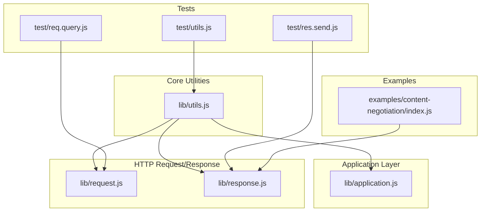
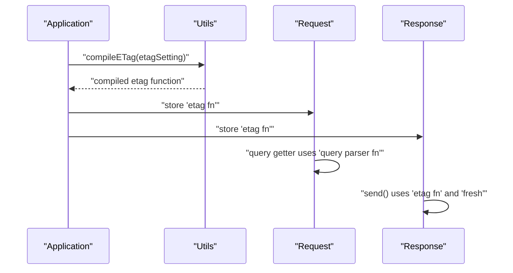
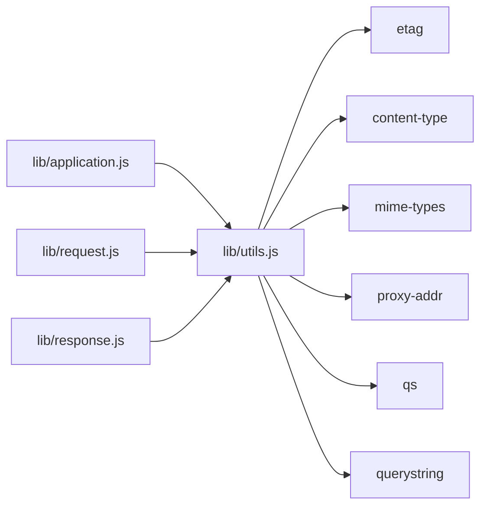

# Utility Functions

<cite>
**Referenced Files in This Document**
- [lib/utils.js](file://lib/utils.js)
- [lib/application.js](file://lib/application.js)
- [lib/request.js](file://lib/request.js)
- [lib/response.js](file://lib/response.js)
- [test/utils.js](file://test/utils.js)
- [test/req.query.js](file://test/req.query.js)
- [test/res.send.js](file://test/res.send.js)
- [examples/content-negotiation/index.js](file://examples/content-negotiation/index.js)
</cite>

## Table of Contents
1. [Introduction](#introduction)
2. [Project Structure](#project-structure)
3. [Core Components](#core-components)
4. [Architecture Overview](#architecture-overview)
5. [Detailed Component Analysis](#detailed-component-analysis)
6. [Dependency Analysis](#dependency-analysis)
7. [Performance Considerations](#performance-considerations)
8. [Troubleshooting Guide](#troubleshooting-guide)
9. [Conclusion](#conclusion)

## Introduction
This document provides comprehensive API documentation for Express.js Utility Functions that power core framework capabilities. It focuses on:
- ETag generation functions for cache validation
- Query string parsing functions and configuration
- Trust proxy compilation for proxy-aware behavior
- Type normalization and MIME handling for content negotiation
- Practical usage patterns and configuration options

The goal is to help developers understand function signatures, parameter specifications, return behaviors, and how these utilities integrate with the broader Express pipeline.

## Project Structure
The utility functions are primarily implemented in the shared utilities module and consumed by application, request, and response modules. Tests validate behavior and edge cases.

**Diagram sources**
- [lib/utils.js:1-272](file://lib/utils.js#L1-L272)
- [lib/application.js:1-632](file://lib/application.js#L1-L632)
- [lib/request.js:1-528](file://lib/request.js#L1-L528)
- [lib/response.js:1-1048](file://lib/response.js#L1-L1048)
- [test/utils.js:1-116](file://test/utils.js#L1-L116)
- [test/req.query.js:1-106](file://test/req.query.js#L1-L106)
- [test/res.send.js:490-569](file://test/res.send.js#L490-L569)
- [examples/content-negotiation/index.js:1-47](file://examples/content-negotiation/index.js#L1-L47)

**Section sources**
- [lib/utils.js:1-272](file://lib/utils.js#L1-L272)
- [lib/application.js:1-632](file://lib/application.js#L1-L632)
- [lib/request.js:1-528](file://lib/request.js#L1-L528)
- [lib/response.js:1-1048](file://lib/response.js#L1-L1048)
- [test/utils.js:1-116](file://test/utils.js#L1-L116)
- [test/req.query.js:1-106](file://test/req.query.js#L1-L106)
- [test/res.send.js:490-569](file://test/res.send.js#L490-L569)
- [examples/content-negotiation/index.js:1-47](file://examples/content-negotiation/index.js#L1-L47)

## Core Components
This section summarizes the primary utility functions and their roles.

- ETag Generation
  - Strong and weak ETag generators
  - ETag function compiler for configuration
- Query String Parsing
  - Query parser compiler supporting simple, extended, and custom functions
- Trust Proxy Compilation
  - Proxy trust function compiler supporting booleans, numbers, strings, arrays, and functions
- MIME Type and Content Negotiation
  - Type normalization and charset setting
  - Content negotiation helpers used by response.format

Key integration points:
- Application settings drive runtime behavior (e.g., etag, query parser, trust proxy)
- Request and response modules consume compiled utilities for protocol and content handling

**Section sources**
- [lib/utils.js:39-51](file://lib/utils.js#L39-L51)
- [lib/utils.js:130-152](file://lib/utils.js#L130-L152)
- [lib/utils.js:162-184](file://lib/utils.js#L162-L184)
- [lib/utils.js:194-214](file://lib/utils.js#L194-L214)
- [lib/utils.js:61-77](file://lib/utils.js#L61-L77)
- [lib/utils.js:225-238](file://lib/utils.js#L225-L238)
- [lib/application.js:95-99](file://lib/application.js#L95-L99)
- [lib/application.js:364-382](file://lib/application.js#L364-L382)
- [lib/request.js:230-241](file://lib/request.js#L230-L241)
- [lib/request.js:297-315](file://lib/request.js#L297-L315)
- [lib/request.js:340-343](file://lib/request.js#L340-L343)
- [lib/request.js:357-366](file://lib/request.js#L357-L366)
- [lib/response.js:161-189](file://lib/response.js#L161-L189)
- [lib/response.js:569-594](file://lib/response.js#L569-L594)

## Architecture Overview
The utilities module acts as a central configuration and helper hub. Application settings compile to functions that are stored in settings and later consumed by request/response getters and methods.

**Diagram sources**
- [lib/application.js:364-382](file://lib/application.js#L364-L382)
- [lib/utils.js:130-152](file://lib/utils.js#L130-L152)
- [lib/request.js:230-241](file://lib/request.js#L230-L241)
- [lib/response.js:161-189](file://lib/response.js#L161-L189)

## Detailed Component Analysis

### ETag Generation Functions
Purpose:
- Generate strong or weak ETags for cache validation
- Provide a function compiler to select behavior from settings

Functions:
- Strong ETag generator
- Weak ETag generator
- ETag function compiler

Behavior:
- Strong vs weak selection is controlled by configuration
- Custom function can be supplied directly
- When enabled, ETag is computed during response sending and set on the response

Signatures and parameters:
- Strong ETag generator: takes body and optional encoding; returns string ETag
- Weak ETag generator: same as strong but produces weak tag
- ETag compiler: accepts boolean/string/function; returns function or undefined

Return values:
- ETag strings for strong/weak variants
- Compiled function or undefined when disabled

Practical examples:
- Setting application ETag to strong or weak affects automatic ETag generation
- Custom ETag function allows application-specific hashing strategies

Security and performance:
- ETag generation adds CPU overhead proportional to body size
- Weak ETags are suitable for non-identical content variations
- Strong ETags provide stricter cache validation

Configuration options:
- Application setting: etag accepts true/weak, false, strong, or a custom function

Integration points:
- Application sets compiled ETag function into settings
- Response.send uses the function to compute and set ETag when applicable

**Section sources**
- [lib/utils.js:39-51](file://lib/utils.js#L39-L51)
- [lib/utils.js:130-152](file://lib/utils.js#L130-L152)
- [lib/application.js:95-99](file://lib/application.js#L95-L99)
- [lib/application.js:364-382](file://lib/application.js#L364-L382)
- [lib/response.js:161-189](file://lib/response.js#L161-L189)
- [test/res.send.js:495-567](file://test/res.send.js#L495-L567)
- [test/utils.js:7-27](file://test/utils.js#L7-L27)
- [test/utils.js:70-90](file://test/utils.js#L70-L90)
- [test/utils.js:92-115](file://test/utils.js#L92-L115)

### Query String Parsing Functions
Purpose:
- Parse the raw query string according to configured parser
- Support simple, extended, or custom parsers

Compiler:
- Query parser compiler accepts boolean/string/function
- Returns a function or undefined when disabled

Behavior:
- Simple parser uses Node’s built-in querystring parser
- Extended parser uses qs with prototype poisoning protection
- Custom function receives raw query string and returns parsed object

Signatures and parameters:
- Query parser compiler: val accepts boolean/string/function; returns function or undefined
- Extended parser: internal wrapper around qs.parse with allowPrototypes enabled

Return values:
- Parser function or undefined
- Parsed query object when used by request.query getter

Practical examples:
- Enabling extended parsing allows nested and array-like structures
- Disabling parsing returns an empty object
- Custom function enables application-specific parsing logic

Security and performance:
- Extended parser enables prototype poisoning protection via allowPrototypes
- Custom parsers should sanitize input to prevent prototype pollution
- Parsing overhead depends on query complexity

Configuration options:
- Application setting: query parser accepts true/simple, false, extended, or a custom function

Integration points:
- Application sets compiled query parser function into settings
- Request.query getter uses the function to parse the raw query string

**Section sources**
- [lib/utils.js:162-184](file://lib/utils.js#L162-L184)
- [lib/utils.js:267-271](file://lib/utils.js#L267-L271)
- [lib/application.js:97-99](file://lib/application.js#L97-L99)
- [lib/application.js:367-368](file://lib/application.js#L367-L368)
- [lib/request.js:230-241](file://lib/request.js#L230-L241)
- [test/req.query.js:17-91](file://test/req.query.js#L17-L91)

### Trust Proxy Functions
Purpose:
- Determine whether to trust proxy-provided headers for protocol, IP, and host
- Compile trust configuration into a callable function

Compiler:
- Accepts boolean, number, string, array, or function
- Returns a function that evaluates trust for a given address and hop index

Behavior:
- true trusts all hops
- number trusts up to N hops
- string/array trusts specific addresses
- function delegates to a custom trust function
- Uses proxy-addr to compile trust rules

Signatures and parameters:
- Trust compiler: val accepts boolean/number/string/array/function; returns function
- Internal trust evaluation: address, hop index

Return values:
- Trust function used by request getters (protocol, ip, ips, host, hostname)

Practical examples:
- Trusting hop count ensures only known proxies modify headers
- Comma-separated strings define trusted networks
- Custom function enables dynamic trust logic

Security and performance:
- Trusting proxies enables correct protocol detection behind load balancers
- Misconfigured trust can lead to header spoofing
- Evaluation cost is minimal per hop

Configuration options:
- Application setting: trust proxy accepts true/false/number/string/array/function

Integration points:
- Application sets compiled trust function into settings
- Request getters use the function to evaluate trust for headers and IPs

**Section sources**
- [lib/utils.js:194-214](file://lib/utils.js#L194-L214)
- [lib/application.js:99-99](file://lib/application.js#L99-L99)
- [lib/application.js:370-377](file://lib/application.js#L370-L377)
- [lib/request.js:297-315](file://lib/request.js#L297-L315)
- [lib/request.js:340-343](file://lib/request.js#L340-L343)
- [lib/request.js:357-366](file://lib/request.js#L357-L366)
- [test/req.protocol.js:52-98](file://test/req.protocol.js#L52-L98)
- [test/req.secure.js:46-99](file://test/req.secure.js#L46-L99)
- [test/req.host.js:105-156](file://test/req.host.js#L105-L156)
- [test/req.ip.js:89-113](file://test/req.ip.js#L89-L113)

### Type Normalization and MIME Handling
Purpose:
- Normalize MIME types and extract parameters for content negotiation
- Set charset on Content-Type strings

Functions:
- Type normalization: converts extension or type to structured object with value and params
- Charset setter: updates or adds charset to Content-Type

Behavior:
- Accept parameters parsing handles quality values and additional parameters
- Default to octet-stream when lookup fails
- Charset setter parses Content-Type, updates charset, and reformats

Signatures and parameters:
- Type normalization: type string; returns object with value and params
- Charset setter: type string, charset string; returns formatted Content-Type

Return values:
- Normalized type object with value and quality/params
- Updated Content-Type string with charset

Practical examples:
- Content negotiation uses normalized types to select response format
- Response.format relies on normalized types and charset setting

Security and performance:
- Type normalization prevents invalid or missing types
- Charset setting ensures correct character encoding propagation

Integration points:
- Response.format uses normalized types and charset
- Response.type uses MIME lookup for extension-to-MIME conversion

**Section sources**
- [lib/utils.js:61-77](file://lib/utils.js#L61-L77)
- [lib/utils.js:89-120](file://lib/utils.js#L89-L120)
- [lib/utils.js:225-238](file://lib/utils.js#L225-L238)
- [lib/response.js:569-594](file://lib/response.js#L569-L594)
- [lib/response.js:503-510](file://lib/response.js#L503-L510)
- [test/utils.js:29-46](file://test/utils.js#L29-L46)

### Content Negotiation Utilities
Purpose:
- Enable content-type negotiation based on Accept header and registered handlers
- Normalize types and set appropriate Content-Type with charset

Behavior:
- Response.format selects handler based on Accept header and quality values
- Normalizes requested types and sets Content-Type accordingly
- Uses charset setting for text-based responses

Signatures and parameters:
- Response.format: object mapping MIME types to handlers; returns response chain

Return values:
- Invokes selected handler or default error handler
- Sets Content-Type and charset appropriately

Practical examples:
- Example demonstrates HTML/text/JSON negotiation with Accept header
- Handlers can set their own Content-Type or rely on defaults

Security and performance:
- Negotiation is efficient and leverages existing Accept parsing
- Charset enforcement ensures consistent encoding

Integration points:
- Response.format uses normalized types and charset
- Accept header parsing delegated to accepts library

**Section sources**
- [lib/response.js:569-594](file://lib/response.js#L569-L594)
- [examples/content-negotiation/index.js:1-47](file://examples/content-negotiation/index.js#L1-L47)
- [test/res.format.js:159-209](file://test/res.format.js#L159-L209)

## Dependency Analysis
The utilities module depends on external libraries for parsing, MIME handling, and proxy evaluation. Application, request, and response modules depend on compiled utilities from settings.

**Diagram sources**
- [lib/utils.js:15-22](file://lib/utils.js#L15-L22)
- [lib/application.js:20-26](file://lib/application.js#L20-L26)
- [lib/request.js:16-24](file://lib/request.js#L16-L24)
- [lib/response.js:15-35](file://lib/response.js#L15-L35)

**Section sources**
- [lib/utils.js:15-22](file://lib/utils.js#L15-L22)
- [lib/application.js:20-26](file://lib/application.js#L20-L26)
- [lib/request.js:16-24](file://lib/request.js#L16-L24)
- [lib/response.js:15-35](file://lib/response.js#L15-L35)

## Performance Considerations
- ETag generation
  - Cost scales with body size; consider disabling for large binary responses
  - Weak ETags are slightly cheaper than strong ETags
- Query parsing
  - Extended parsing is more expensive than simple parsing; use simple for basic queries
  - Custom parsers should avoid heavy operations
- Trust evaluation
  - Minimal overhead; ensure trusted networks are correctly configured
- Content negotiation
  - Efficient; avoid excessive handler branching in format blocks

[No sources needed since this section provides general guidance]

## Troubleshooting Guide
Common issues and resolutions:
- Unknown etag setting
  - Symptom: TypeError when setting etag to unsupported value
  - Resolution: Use true/weak, false, strong, or a function
- Unknown query parser setting
  - Symptom: TypeError when setting query parser to unsupported value
  - Resolution: Use true/simple, false, extended, or a function
- Prototype pollution risk with extended query parsing
  - Symptom: Unexpected properties on parsed object
  - Resolution: Use extended parser; it enables allowPrototypes for compatibility
- Trust misconfiguration
  - Symptom: Incorrect protocol or IP detection behind proxies
  - Resolution: Configure trust proxy correctly (number, string, array, or function)
- Content-Type charset issues
  - Symptom: Missing or incorrect charset in responses
  - Resolution: Ensure charset is set via response type or setCharset utility

Validation references:
- ETag compiler tests
- Query parser tests
- Trust proxy tests
- Content negotiation tests

**Section sources**
- [test/utils.js:92-115](file://test/utils.js#L92-L115)
- [test/req.query.js:85-91](file://test/req.query.js#L85-L91)
- [test/req.protocol.js:52-98](file://test/req.protocol.js#L52-L98)
- [test/req.secure.js:46-99](file://test/req.secure.js#L46-L99)
- [test/req.host.js:105-156](file://test/req.host.js#L105-L156)
- [test/req.ip.js:89-113](file://test/req.ip.js#L89-L113)
- [test/res.format.js:159-209](file://test/res.format.js#L159-L209)

## Conclusion
Express.js utility functions provide essential building blocks for caching, parsing, proxy awareness, and content negotiation. Proper configuration of these utilities enables secure, performant, and flexible HTTP handling. Developers should carefully choose parser and trust configurations, consider ETag strategies for their workload, and leverage type normalization and charset setting for consistent content delivery.

[No sources needed since this section summarizes without analyzing specific files]