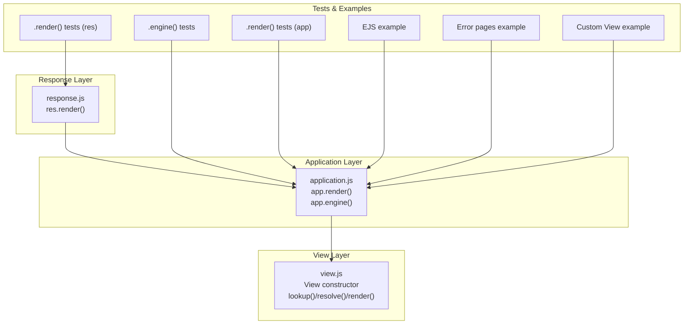
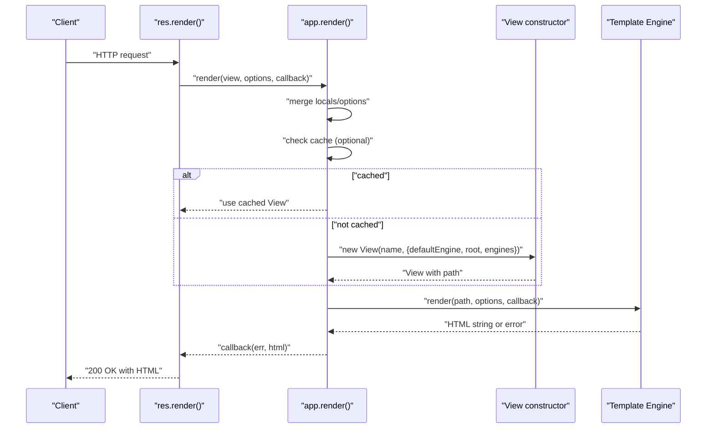
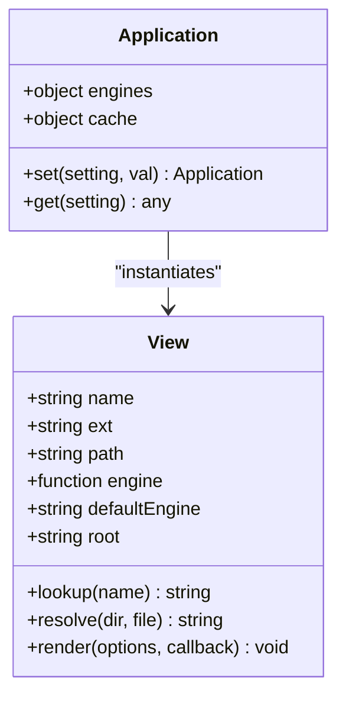
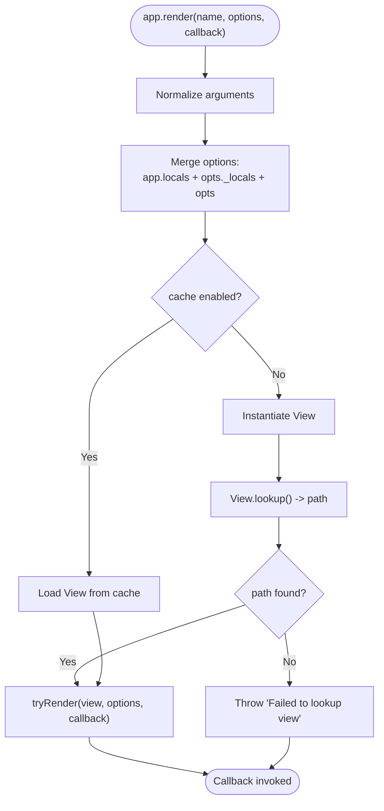
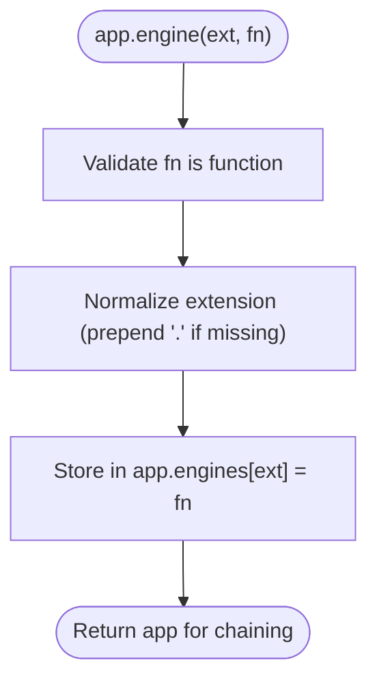
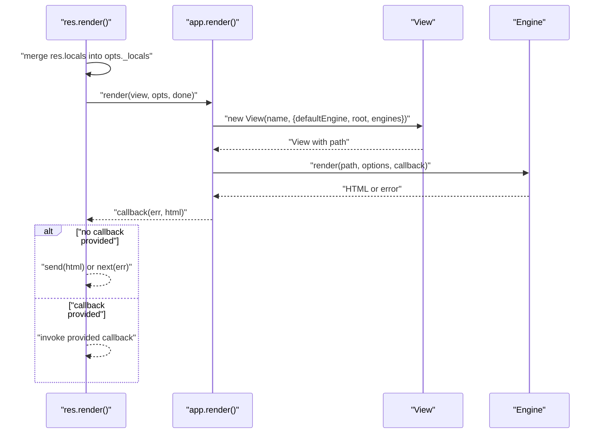
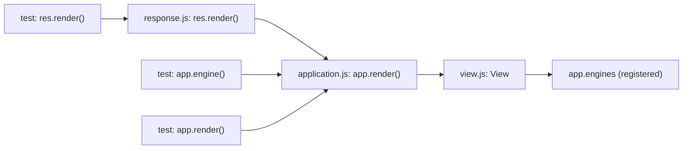

# View System Methods

<cite>
**Referenced Files in This Document**
- [view.js](file://lib/view.js)
- [application.js](file://lib/application.js)
- [response.js](file://lib/response.js)
- [app.engine.js](file://test/app.engine.js)
- [app.render.js](file://test/app.render.js)
- [res.render.js](file://test/res.render.js)
- [index.js](file://examples/ejs/index.js)
- [index.js](file://examples/error-pages/index.js)
- [index.js](file://examples/view-constructor/index.js)
- [github-view.js](file://examples/view-constructor/github-view.js)
</cite>

## Table of Contents
1. [Introduction](#introduction)
2. [Project Structure](#project-structure)
3. [Core Components](#core-components)
4. [Architecture Overview](#architecture-overview)
5. [Detailed Component Analysis](#detailed-component-analysis)
6. [Dependency Analysis](#dependency-analysis)
7. [Performance Considerations](#performance-considerations)
8. [Troubleshooting Guide](#troubleshooting-guide)
9. [Conclusion](#conclusion)

## Introduction
This document provides comprehensive API documentation for Express.js View System Methods with a focus on template engine integration and view rendering. It covers:
- The View constructor and its internal mechanisms for template resolution and rendering
- Programmatic rendering via app.render() including options merging, caching behavior, and error handling
- Template engine registration via app.engine() with extension mapping and callback specifications
- View configuration options including view engines, view directories, default engines, and template resolution order
- Practical examples demonstrating integration with popular engines such as EJS, Handlebars, and Jade
- Additional topics such as view caching, partial rendering, and layout systems

## Project Structure
The Express view system spans three primary modules:
- Application-level APIs (app.render, app.engine, settings): implemented in application.js
- View class for template resolution and rendering: implemented in view.js
- Response-level rendering (res.render) delegating to app.render: implemented in response.js
- Tests and examples validating behavior and usage patterns

**Diagram sources**
- [application.js:505-575](file://lib/application.js#L505-L575)
- [view.js:52-95](file://lib/view.js#L52-L95)
- [response.js:894-918](file://lib/response.js#L894-L918)
- [app.engine.js:16-82](file://test/app.engine.js#L16-L82)
- [app.render.js:16-392](file://test/app.render.js#L16-L392)
- [res.render.js:8-367](file://test/res.render.js#L8-L367)
- [index.js:1-58](file://examples/ejs/index.js#L1-L58)
- [index.js:1-104](file://examples/error-pages/index.js#L1-L104)
- [index.js:1-49](file://examples/view-constructor/index.js#L1-L49)
- [github-view.js:1-54](file://examples/view-constructor/github-view.js#L1-L54)

**Section sources**
- [application.js:505-575](file://lib/application.js#L505-L575)
- [view.js:52-95](file://lib/view.js#L52-L95)
- [response.js:894-918](file://lib/response.js#L894-L918)

## Core Components
- View constructor: Initializes view metadata, resolves extension, loads template engine, and computes the filesystem path for the template.
- app.render(): Merges locals and options, optionally caches View instances, resolves the template path, and invokes the engine to render.
- app.engine(): Registers a template engine callback for a given file extension.
- res.render(): Delegates rendering to app.render() and sends the result or forwards errors.

Key behaviors:
- Template resolution order supports explicit extensions and default engines.
- Engines are cached per extension in app.engines.
- Rendering is synchronous-to-asynchronous normalized to ensure consistent callback semantics.
- Caching can be controlled via app settings and per-call options.

**Section sources**
- [view.js:52-95](file://lib/view.js#L52-L95)
- [application.js:294-308](file://lib/application.js#L294-L308)
- [application.js:522-575](file://lib/application.js#L522-L575)
- [response.js:894-918](file://lib/response.js#L894-L918)

## Architecture Overview
The rendering pipeline integrates the response layer, application layer, and view layer:

**Diagram sources**
- [response.js:894-918](file://lib/response.js#L894-L918)
- [application.js:522-575](file://lib/application.js#L522-L575)
- [view.js:52-95](file://lib/view.js#L52-L95)

## Detailed Component Analysis

### View Constructor and Rendering
The View constructor encapsulates:
- Extension detection and default engine handling
- Template engine loading and caching
- Path resolution across configured root directories
- Rendering invocation with normalized asynchronous behavior

**Diagram sources**
- [view.js:52-95](file://lib/view.js#L52-L95)
- [application.js:59-83](file://lib/application.js#L59-L83)

Implementation highlights:
- Extension normalization and default engine resolution
- Engine discovery via require("<engine>") and fallback to exported "__express"
- Path resolution supporting both direct file and directory/index conventions
- Synchronous-to-asynchronous callback normalization to avoid blocking

**Section sources**
- [view.js:52-95](file://lib/view.js#L52-L95)
- [view.js:104-123](file://lib/view.js#L104-L123)
- [view.js:169-187](file://lib/view.js#L169-L187)
- [view.js:133-159](file://lib/view.js#L133-L159)

### app.render() Method
Signature and behavior:
- Signature: app.render(name, options?, callback?)
- Options merging: merges app.locals, res.locals (_locals), and provided options
- Caching: respects app.enabled("view cache") or options.cache
- Error handling: throws meaningful errors when view lookup fails or engine is invalid

**Diagram sources**
- [application.js:522-575](file://lib/application.js#L522-L575)
- [application.js:625-631](file://lib/application.js#L625-L631)
- [view.js:104-123](file://lib/view.js#L104-L123)

Practical notes:
- Supports absolute paths and relative paths resolved against "views" setting
- Works with or without explicit file extensions when "view engine" is set
- Errors propagate to the callback; production mode enables view caching by default

**Section sources**
- [application.js:522-575](file://lib/application.js#L522-L575)
- [application.js:625-631](file://lib/application.js#L625-L631)
- [app.render.js:16-392](file://test/app.render.js#L16-L392)

### app.engine() Method
Purpose:
- Register a template engine callback for a given file extension
- Accepts both "ext" and ".ext" forms
- Validates that the provided callback is a function

Behavior:
- Stores the engine in app.engines keyed by normalized extension
- Enables mapping arbitrary extensions to engines (e.g., .html to EJS)

**Diagram sources**
- [application.js:294-308](file://lib/application.js#L294-L308)

Common usage patterns:
- Registering engines that export "__express" (e.g., EJS)
- Mapping non-standard extensions to engines
- Using third-party libraries to unify engine signatures

**Section sources**
- [application.js:260-308](file://lib/application.js#L260-L308)
- [app.engine.js:16-82](file://test/app.engine.js#L16-L82)

### res.render() Method
Responsibilities:
- Merge res.locals into options
- Provide a default callback that sends the rendered HTML or forwards errors
- Delegate rendering to app.render()

**Diagram sources**
- [response.js:894-918](file://lib/response.js#L894-L918)
- [application.js:522-575](file://lib/application.js#L522-L575)
- [view.js:52-95](file://lib/view.js#L52-L95)

**Section sources**
- [response.js:894-918](file://lib/response.js#L894-L918)

### Template Engine Registration and Popular Engines
Examples demonstrate integrating EJS, Handlebars, and Jade-like engines:

- EJS integration:
  - Register EJS engine for .html or .ejs
  - Configure "view engine" and "views" directories
  - Render views with locals and partials

- Handlebars integration:
  - Register Handlebars engine for .hbs
  - Use helpers and partials in templates

- Jade/Pug integration:
  - Register engine for .pug or .jade
  - Render layouts and partials

Practical references:
- EJS example: [index.js:1-58](file://examples/ejs/index.js#L1-L58)
- Error pages example (EJS): [index.js:1-104](file://examples/error-pages/index.js#L1-L104)
- Custom view engine example: [index.js:1-49](file://examples/view-constructor/index.js#L1-L49), [github-view.js:1-54](file://examples/view-constructor/github-view.js#L1-L54)

**Section sources**
- [index.js:1-58](file://examples/ejs/index.js#L1-L58)
- [index.js:1-104](file://examples/error-pages/index.js#L1-L104)
- [index.js:1-49](file://examples/view-constructor/index.js#L1-L49)
- [github-view.js:1-54](file://examples/view-constructor/github-view.js#L1-L54)

### View Configuration Options
Key settings and their roles:
- "view": Custom View constructor (defaults to built-in View)
- "views": Root directory or directories for templates
- "view engine": Default extension for templates without explicit extension
- "view cache": Whether to cache View instances (enabled in production)

Behavioral implications:
- Multiple "views" directories are supported; lookup iterates roots
- Default engine is used when no extension is provided
- Production mode enables caching by default

**Section sources**
- [application.js:90-141](file://lib/application.js#L90-L141)
- [application.js:522-575](file://lib/application.js#L522-L575)
- [view.js:104-123](file://lib/view.js#L104-L123)

### View Resolution Order and Partial/Layout Systems
Resolution order:
- Exact file path matching
- Directory/index with current extension
- Iteration across multiple root directories

Partial and layout patterns:
- Partials: Many engines support partial/include directives (e.g., EJS include)
- Layouts: Engines commonly support blocks and composition for layouts

References:
- Partial usage in EJS example: [login.ejs:2-21](file://examples/auth/views/login.ejs#L2-L21)
- Layout usage in MVC example: [show.hbs:1-32](file://examples/mvc/controllers/user/views/show.hbs#L1-L32)

**Section sources**
- [view.js:169-187](file://lib/view.js#L169-L187)
- [login.ejs:2-21](file://examples/auth/views/login.ejs#L2-L21)
- [show.hbs:1-32](file://examples/mvc/controllers/user/views/show.hbs#L1-L32)

## Dependency Analysis
Relationships among components:
- res.render() depends on app.render()
- app.render() depends on View constructor and app.engines
- View constructor depends on app.engines and filesystem resolution
- Tests validate engine registration, rendering, and caching behavior

**Diagram sources**
- [response.js:894-918](file://lib/response.js#L894-L918)
- [application.js:522-575](file://lib/application.js#L522-L575)
- [view.js:52-95](file://lib/view.js#L52-L95)
- [app.engine.js:16-82](file://test/app.engine.js#L16-L82)
- [app.render.js:16-392](file://test/app.render.js#L16-L392)
- [res.render.js:8-367](file://test/res.render.js#L8-L367)

**Section sources**
- [response.js:894-918](file://lib/response.js#L894-L918)
- [application.js:522-575](file://lib/application.js#L522-L575)
- [view.js:52-95](file://lib/view.js#L52-L95)
- [app.engine.js:16-82](file://test/app.engine.js#L16-L82)
- [app.render.js:16-392](file://test/app.render.js#L16-L392)
- [res.render.js:8-367](file://test/res.render.js#L8-L367)

## Performance Considerations
- View caching: Enabling "view cache" reduces repeated View instantiation and filesystem lookups
- Production default: "view cache" is enabled in production mode
- Engine caching: app.engines caches loaded engines by extension
- Rendering normalization: Ensures consistent asynchronous callback behavior

Recommendations:
- Enable caching in production environments
- Reuse engines across requests by relying on app.engines cache
- Prefer relative paths within configured "views" directories for predictable resolution

**Section sources**
- [application.js:138-141](file://lib/application.js#L138-L141)
- [application.js:522-575](file://lib/application.js#L522-L575)
- [app.render.js:229-289](file://test/app.render.js#L229-L289)

## Troubleshooting Guide
Common issues and resolutions:
- No default engine and no extension: Throw error requiring either default engine or explicit extension
- Engine does not provide "__express": Throw error indicating missing view engine export
- View lookup failure: Error indicates the view name and configured root directories
- Missing callback: res.render() provides a default callback that forwards errors or sends HTML

Validation references:
- Error for missing engine export: [res.render.js:39-51](file://test/res.render.js#L39-L51)
- View lookup failure error: [application.js:558-565](file://lib/application.js#L558-L565)
- Callback forwarding behavior: [response.js:911-914](file://lib/response.js#L911-L914)

**Section sources**
- [res.render.js:39-51](file://test/res.render.js#L39-L51)
- [application.js:558-565](file://lib/application.js#L558-L565)
- [response.js:911-914](file://lib/response.js#L911-L914)

## Conclusion
Express’s view system provides a flexible and extensible rendering pipeline:
- app.engine() registers engines for arbitrary extensions
- app.render() merges options, manages caching, and delegates to engines
- View constructor handles resolution and rendering with robust error reporting
- res.render() integrates seamlessly with the request-response lifecycle
- Examples and tests demonstrate integration with EJS, Handlebars, and custom engines, along with partial and layout patterns