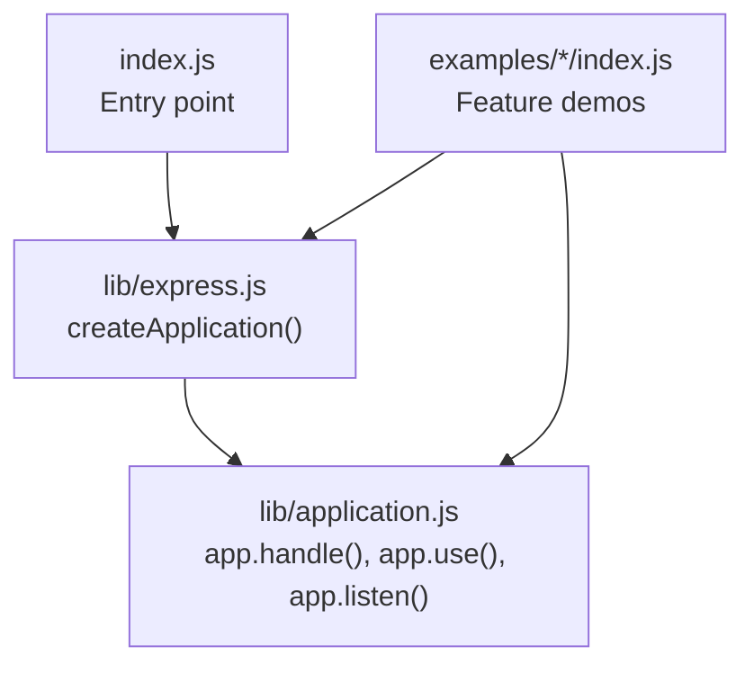
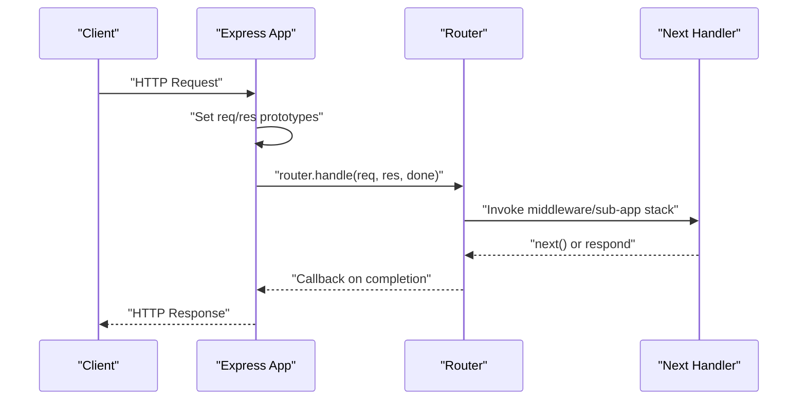
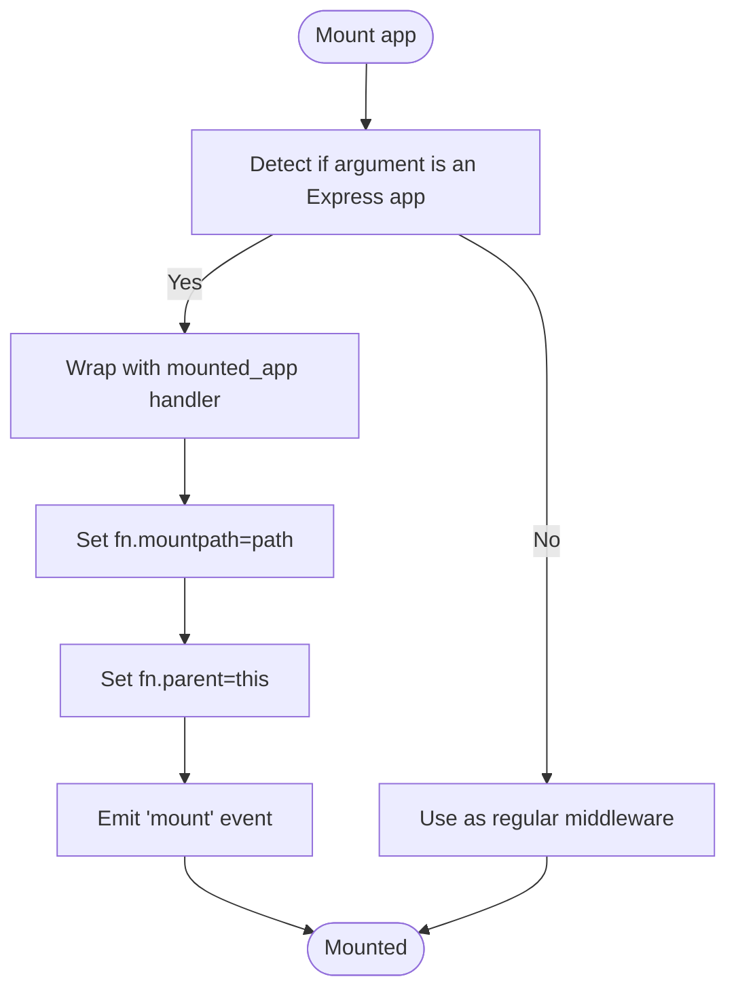
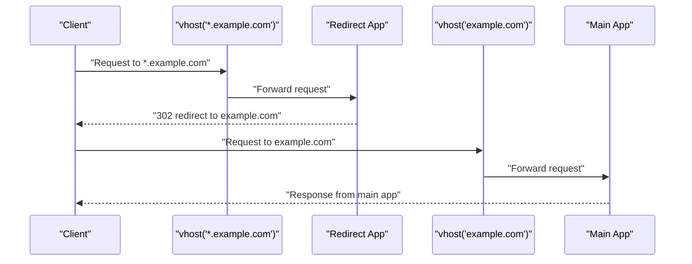
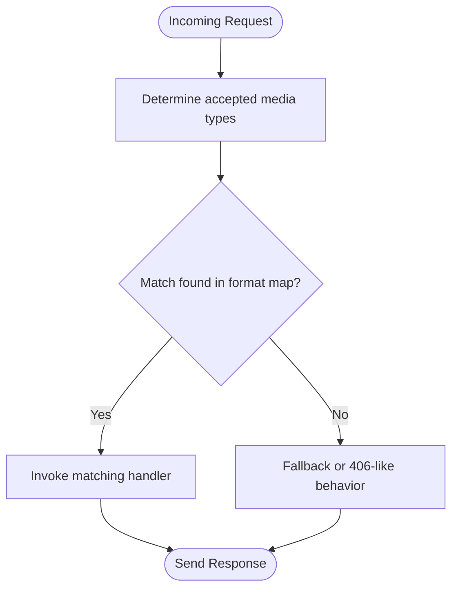
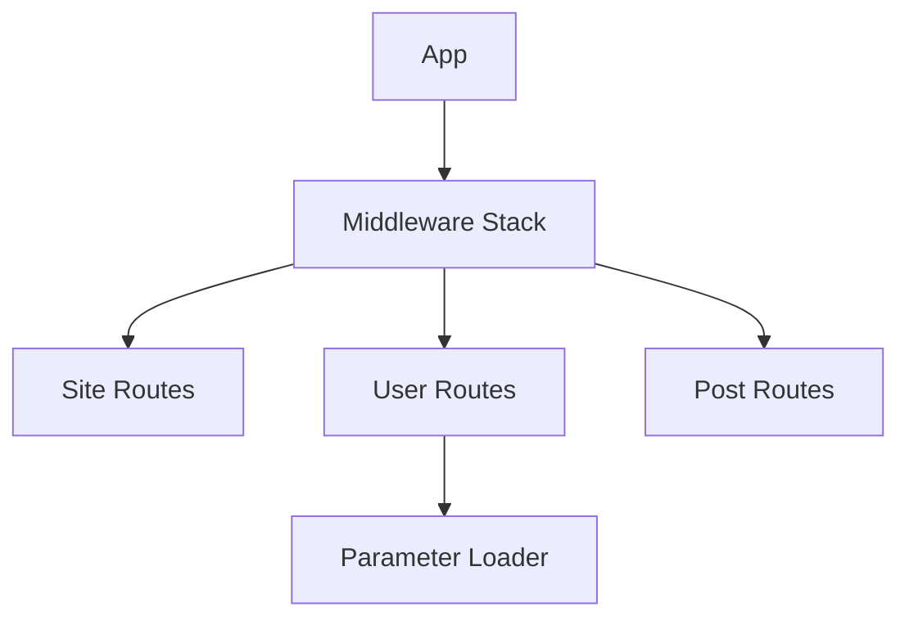
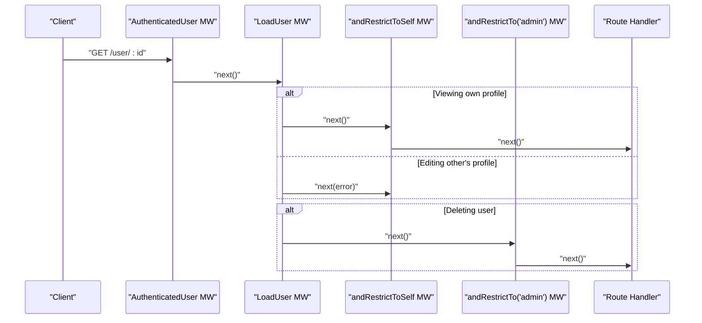
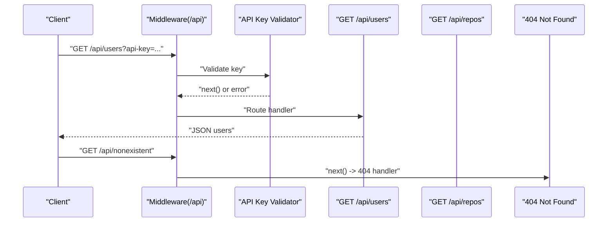
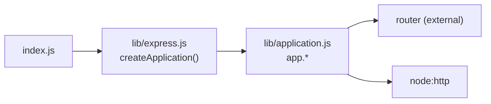

# Advanced Features

<cite>
**Referenced Files in This Document**
- [index.js](file://index.js)
- [lib/express.js](file://lib/express.js)
- [lib/application.js](file://lib/application.js)
- [examples/vhost/index.js](file://examples/vhost/index.js)
- [examples/content-negotiation/index.js](file://examples/content-negotiation/index.js)
- [examples/content-negotiation/users.js](file://examples/content-negotiation/users.js)
- [examples/multi-router/index.js](file://examples/multi-router/index.js)
- [examples/multi-router/controllers/api_v1.js](file://examples/multi-router/controllers/api_v1.js)
- [examples/multi-router/controllers/api_v2.js](file://examples/multi-router/controllers/api_v2.js)
- [examples/route-separation/index.js](file://examples/route-separation/index.js)
- [examples/route-separation/site.js](file://examples/route-separation/site.js)
- [examples/route-separation/post.js](file://examples/route-separation/post.js)
- [examples/route-separation/user.js](file://examples/route-separation/user.js)
- [examples/route-middleware/index.js](file://examples/route-middleware/index.js)
- [examples/web-service/index.js](file://examples/web-service/index.js)
</cite>

## Table of Contents
1. [Introduction](#introduction)
2. [Project Structure](#project-structure)
3. [Core Components](#core-components)
4. [Architecture Overview](#architecture-overview)
5. [Detailed Component Analysis](#detailed-component-analysis)
6. [Dependency Analysis](#dependency-analysis)
7. [Performance Considerations](#performance-considerations)
8. [Troubleshooting Guide](#troubleshooting-guide)
9. [Conclusion](#conclusion)
10. [Appendices](#appendices)

## Introduction
This document presents advanced Express.js features and patterns drawn from the repository’s core implementation and example applications. It focuses on sub-applications and application mounting, virtual host support, content negotiation and media-type handling, modular routing and middleware composition, and performance optimization strategies. Practical examples demonstrate application modularity, multi-domain hosting, and advanced routing scenarios, along with scalability and enterprise deployment considerations.

## Project Structure
The repository is organized around:
- Core implementation under lib/, including the application factory and runtime behavior
- Examples grouped by feature or pattern under examples/
- Tests under test/ validating behaviors

**Diagram sources**
- [index.js:1-12](file://index.js#L1-L12)
- [lib/express.js:36-56](file://lib/express.js#L36-L56)
- [lib/application.js:152-178](file://lib/application.js#L152-L178)

**Section sources**
- [index.js:1-12](file://index.js#L1-L12)
- [lib/express.js:1-82](file://lib/express.js#L1-L82)
- [lib/application.js:1-632](file://lib/application.js#L1-L632)

## Core Components
- Application factory and prototype: The application is created via a factory that mixes in event emitter and request/response prototypes, initializes defaults, and exposes router and middleware APIs.
- Mounting and sub-applications: Express supports mounting another Express app under a given path, inheriting settings and prototypes, and emitting mount events.
- Request/response extensions: Each app exposes request and response prototypes that are set on every request/response during dispatch.

Key implementation references:
- Application creation and prototype exposure
- Default configuration and mount inheritance
- Request/response prototype setup
- Dispatch pipeline and router invocation

**Section sources**
- [lib/express.js:36-56](file://lib/express.js#L36-L56)
- [lib/express.js:44-52](file://lib/express.js#L44-L52)
- [lib/application.js:90-141](file://lib/application.js#L90-L141)
- [lib/application.js:109-122](file://lib/application.js#L109-L122)
- [lib/application.js:152-178](file://lib/application.js#L152-L178)

## Architecture Overview
Express composes a request lifecycle around a central dispatcher that sets up request/response prototypes, invokes the internal router, and delegates errors to a final handler. Middleware and sub-applications are integrated into the router’s stack, enabling layered behavior and modular composition.

**Diagram sources**
- [lib/application.js:152-178](file://lib/application.js#L152-L178)
- [lib/application.js:190-244](file://lib/application.js#L190-L244)

**Section sources**
- [lib/application.js:152-178](file://lib/application.js#L152-L178)
- [lib/application.js:190-244](file://lib/application.js#L190-L244)

## Detailed Component Analysis

### Sub-applications and Application Mounting
Sub-applications are mounted under a path and behave as if they were the root app for that path segment. They inherit parent settings and prototypes and emit a mount event upon being attached.

Highlights:
- Mounting logic detects Express apps and wraps them to preserve req/res prototypes across nested handling
- Mounted apps receive a mountpath and parent reference
- On mount, child inherits trust proxy, request/response prototypes, engines, and settings from the parent

Practical example:
- Root app mounts separate API routers under distinct paths

**Diagram sources**
- [lib/application.js:190-244](file://lib/application.js#L190-L244)
- [lib/application.js:225-240](file://lib/application.js#L225-L240)

**Section sources**
- [lib/application.js:190-244](file://lib/application.js#L190-L244)
- [examples/multi-router/index.js:7-8](file://examples/multi-router/index.js#L7-L8)
- [examples/multi-router/controllers/api_v1.js:5](file://examples/multi-router/controllers/api_v1.js#L5)
- [examples/multi-router/controllers/api_v2.js:5](file://examples/multi-router/controllers/api_v2.js#L5)

### Virtual Host Support (Multi-Domain Hosting)
Virtual hosts allow routing different subdomains to different apps. The example demonstrates:
- A main app serving the top-level domain
- A redirect app handling wildcard subdomains
- A top-level app combining both via vhost middleware

**Diagram sources**
- [examples/vhost/index.js:46-47](file://examples/vhost/index.js#L46-L47)
- [examples/vhost/index.js:21-31](file://examples/vhost/index.js#L21-L31)
- [examples/vhost/index.js:35-40](file://examples/vhost/index.js#L35-L40)

**Section sources**
- [examples/vhost/index.js:1-54](file://examples/vhost/index.js#L1-L54)

### Content Negotiation and Media Type Handling
Express supports content negotiation via a format map that selects the appropriate response renderer based on client preferences. The example shows:
- Using res.format with HTML, text, and JSON handlers
- Declarative middleware wrapper to reuse format maps

**Diagram sources**
- [examples/content-negotiation/index.js:9-27](file://examples/content-negotiation/index.js#L9-L27)
- [examples/content-negotiation/users.js:5-19](file://examples/content-negotiation/users.js#L5-L19)

**Section sources**
- [examples/content-negotiation/index.js:1-47](file://examples/content-negotiation/index.js#L1-L47)
- [examples/content-negotiation/users.js:1-20](file://examples/content-negotiation/users.js#L1-L20)

### Advanced Routing Patterns and Modular Composition
The route separation example demonstrates:
- Centralized middleware registration (logging, cookies, body parsing, static)
- Feature-based routing split across modules (site, user, post)
- Parameter loading and shared route patterns

**Diagram sources**
- [examples/route-separation/index.js:29-32](file://examples/route-separation/index.js#L29-L32)
- [examples/route-separation/index.js:36-50](file://examples/route-separation/index.js#L36-L50)
- [examples/route-separation/user.js:14-24](file://examples/route-separation/user.js#L14-L24)

**Section sources**
- [examples/route-separation/index.js:1-56](file://examples/route-separation/index.js#L1-L56)
- [examples/route-separation/site.js:1-6](file://examples/route-separation/site.js#L1-L6)
- [examples/route-separation/post.js:1-14](file://examples/route-separation/post.js#L1-L14)
- [examples/route-separation/user.js:1-48](file://examples/route-separation/user.js#L1-L48)

### Middleware Composition Techniques
The route-middleware example showcases:
- Authentication middleware that enriches the request
- Composable authorization middleware with role checks
- Chained middleware enforcing “load user” then “restrict to self”
- Deletion route gated by “load user” and “admin” checks

**Diagram sources**
- [examples/route-middleware/index.js:25-34](file://examples/route-middleware/index.js#L25-L34)
- [examples/route-middleware/index.js:36-58](file://examples/route-middleware/index.js#L36-L58)
- [examples/route-middleware/index.js:74-84](file://examples/route-middleware/index.js#L74-L84)

**Section sources**
- [examples/route-middleware/index.js:1-91](file://examples/route-middleware/index.js#L1-L91)

### Web Service Patterns and Error Handling
The web service example demonstrates:
- Scoped middleware applied under a path prefix
- API key validation middleware returning typed errors
- Resource endpoints returning JSON
- Centralized error handling middleware and a 404 responder

**Diagram sources**
- [examples/web-service/index.js:30-42](file://examples/web-service/index.js#L30-L42)
- [examples/web-service/index.js:75-82](file://examples/web-service/index.js#L75-L82)
- [examples/web-service/index.js:108-111](file://examples/web-service/index.js#L108-L111)

**Section sources**
- [examples/web-service/index.js:1-118](file://examples/web-service/index.js#L1-L118)

## Dependency Analysis
Express’s modular design separates concerns:
- Entry point re-exports the application factory
- Application factory composes request/response prototypes and router
- Application module orchestrates middleware, routing, and dispatch

**Diagram sources**
- [index.js:11](file://index.js#L11)
- [lib/express.js:36-56](file://lib/express.js#L36-L56)
- [lib/application.js:152-178](file://lib/application.js#L152-L178)

**Section sources**
- [index.js:1-12](file://index.js#L1-L12)
- [lib/express.js:1-82](file://lib/express.js#L1-L82)
- [lib/application.js:1-632](file://lib/application.js#L1-L632)

## Performance Considerations
- Minimize middleware overhead by scoping middleware to narrow prefixes where possible
- Prefer streaming responses for large payloads and leverage compression middleware
- Use view caching in production environments
- Keep route handlers focused and delegate heavy work to asynchronous services
- Avoid deep nesting of middleware; compose small, reusable units

[No sources needed since this section provides general guidance]

## Troubleshooting Guide
Common issues and remedies:
- Incorrect middleware arity: Ensure error-handling middleware accepts four arguments; otherwise it will be treated as regular middleware
- Missing API key or invalid key: Return a typed error with a status code so centralized error handlers can respond consistently
- 404 handling: Place a final middleware after all routes to catch unmatched paths and return a standardized response

**Section sources**
- [examples/web-service/index.js:98-103](file://examples/web-service/index.js#L98-L103)
- [examples/web-service/index.js:15-19](file://examples/web-service/index.js#L15-L19)
- [examples/web-service/index.js:108-111](file://examples/web-service/index.js#L108-L111)

## Conclusion
Express enables advanced, scalable architectures through sub-application mounting, virtual host routing, content negotiation, modular routing, and robust middleware composition. The examples illustrate practical patterns for multi-domain hosting, API gateways, and feature-based modularity, while the core implementation provides a solid foundation for performance and maintainability.

[No sources needed since this section summarizes without analyzing specific files]

## Appendices
- Practical usage references:
  - Sub-applications and mounting: [examples/multi-router/index.js:7-8](file://examples/multi-router/index.js#L7-L8)
  - Virtual hosts: [examples/vhost/index.js:46-47](file://examples/vhost/index.js#L46-L47)
  - Content negotiation: [examples/content-negotiation/index.js:9-27](file://examples/content-negotiation/index.js#L9-L27)
  - Modular routing: [examples/route-separation/index.js:36-50](file://examples/route-separation/index.js#L36-L50)
  - Middleware composition: [examples/route-middleware/index.js:74-84](file://examples/route-middleware/index.js#L74-L84)
  - Web service patterns: [examples/web-service/index.js:30-42](file://examples/web-service/index.js#L30-L42)

[No sources needed since this section aggregates references without analyzing specific files]