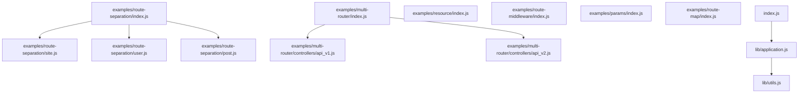
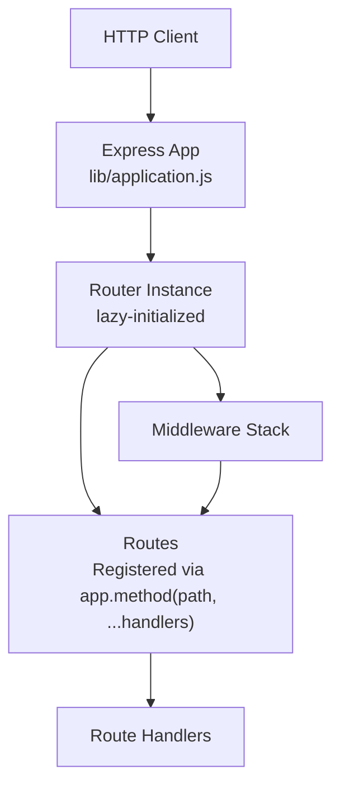
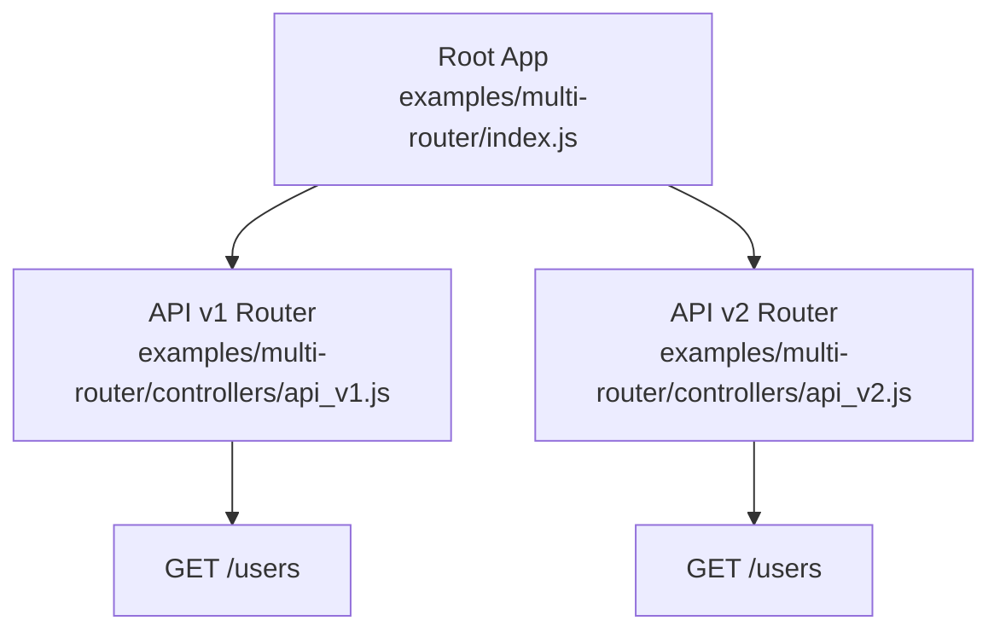
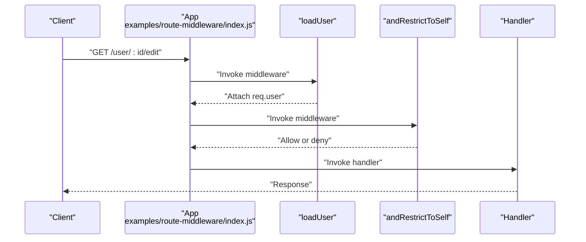
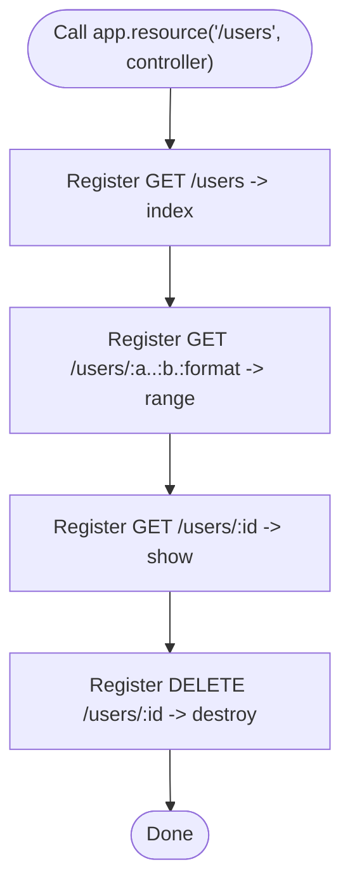
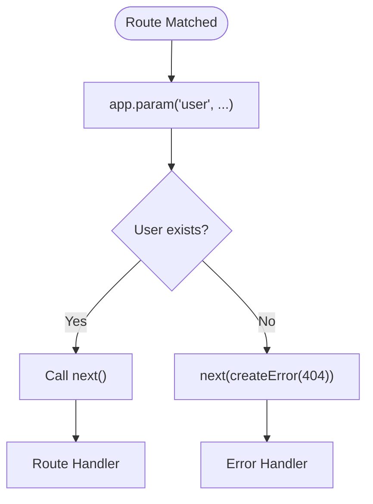
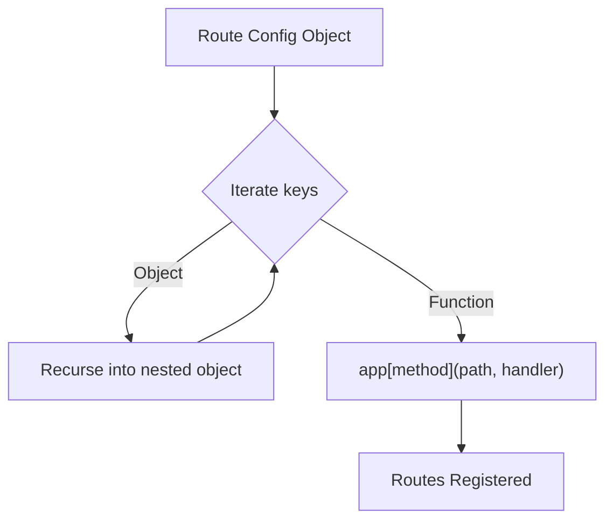
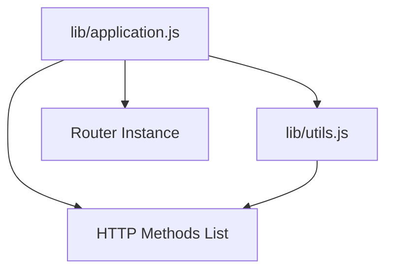

# Advanced Routing Patterns

<cite>
**Referenced Files in This Document**
- [index.js](file://index.js)
- [lib/application.js](file://lib/application.js)
- [lib/utils.js](file://lib/utils.js)
- [examples/route-separation/index.js](file://examples/route-separation/index.js)
- [examples/route-separation/site.js](file://examples/route-separation/site.js)
- [examples/route-separation/user.js](file://examples/route-separation/user.js)
- [examples/route-separation/post.js](file://examples/route-separation/post.js)
- [examples/multi-router/index.js](file://examples/multi-router/index.js)
- [examples/multi-router/controllers/api_v1.js](file://examples/multi-router/controllers/api_v1.js)
- [examples/multi-router/controllers/api_v2.js](file://examples/multi-router/controllers/api_v2.js)
- [examples/resource/index.js](file://examples/resource/index.js)
- [examples/route-middleware/index.js](file://examples/route-middleware/index.js)
- [examples/params/index.js](file://examples/params/index.js)
- [examples/route-map/index.js](file://examples/route-map/index.js)
</cite>

## Table of Contents
1. [Introduction](#introduction)
2. [Project Structure](#project-structure)
3. [Core Components](#core-components)
4. [Architecture Overview](#architecture-overview)
5. [Detailed Component Analysis](#detailed-component-analysis)
6. [Dependency Analysis](#dependency-analysis)
7. [Performance Considerations](#performance-considerations)
8. [Troubleshooting Guide](#troubleshooting-guide)
9. [Conclusion](#conclusion)
10. [Appendices](#appendices)

## Introduction
This document presents advanced routing patterns and techniques in Express.js, grounded in the repository’s examples and core application implementation. It covers nested routing, route middleware composition, modular route organization, parameter validation, custom route handlers, middleware-specific routing, resource-based routing, hierarchical route structures, dynamic route generation, route separation strategies, shared middleware across route groups, and performance optimization for large routing tables. Practical guidance is included for debugging complex routing configurations.

## Project Structure
The repository organizes routing demonstrations under the examples directory, with modular route groups and reusable controllers. The core Express application delegates routing to an internal router and exposes convenience methods for route registration and middleware composition.

**Diagram sources**
- [examples/route-separation/index.js:1-56](file://examples/route-separation/index.js#L1-L56)
- [examples/route-separation/site.js:1-6](file://examples/route-separation/site.js#L1-L6)
- [examples/route-separation/user.js:1-48](file://examples/route-separation/user.js#L1-L48)
- [examples/route-separation/post.js:1-14](file://examples/route-separation/post.js#L1-L14)
- [examples/multi-router/index.js:1-19](file://examples/multi-router/index.js#L1-L19)
- [examples/multi-router/controllers/api_v1.js:1-16](file://examples/multi-router/controllers/api_v1.js#L1-L16)
- [examples/multi-router/controllers/api_v2.js:1-16](file://examples/multi-router/controllers/api_v2.js#L1-L16)
- [examples/resource/index.js:1-96](file://examples/resource/index.js#L1-L96)
- [examples/route-middleware/index.js:1-91](file://examples/route-middleware/index.js#L1-L91)
- [examples/params/index.js:1-75](file://examples/params/index.js#L1-L75)
- [examples/route-map/index.js:1-76](file://examples/route-map/index.js#L1-L76)
- [lib/application.js:1-632](file://lib/application.js#L1-L632)
- [lib/utils.js:1-272](file://lib/utils.js#L1-L272)
- [index.js:1-12](file://index.js#L1-L12)

**Section sources**
- [index.js:1-12](file://index.js#L1-L12)
- [lib/application.js:1-632](file://lib/application.js#L1-L632)
- [lib/utils.js:1-272](file://lib/utils.js#L1-L272)
- [examples/route-separation/index.js:1-56](file://examples/route-separation/index.js#L1-L56)
- [examples/multi-router/index.js:1-19](file://examples/multi-router/index.js#L1-L19)
- [examples/resource/index.js:1-96](file://examples/resource/index.js#L1-L96)
- [examples/route-middleware/index.js:1-91](file://examples/route-middleware/index.js#L1-L91)
- [examples/params/index.js:1-75](file://examples/params/index.js#L1-L75)
- [examples/route-map/index.js:1-76](file://examples/route-map/index.js#L1-L76)

## Core Components
- Express application bootstrap and router delegation: The application initializes a lazy router and forwards incoming requests to it. It also proxies route registration methods and middleware attachment to the underlying router.
- HTTP method enumeration: The application dynamically exposes route methods for each HTTP verb supported by Node.js.
- Parameter hooks: The application supports global parameter hooks to transform or validate route parameters before reaching route handlers.
- Middleware composition: The application’s use method attaches middleware globally or mounts sub-applications under a path.

Key implementation references:
- Router initialization and handle pipeline: [lib/application.js:59-83](file://lib/application.js#L59-L83), [lib/application.js:152-178](file://lib/application.js#L152-L178)
- Method delegation: [lib/application.js:471-482](file://lib/application.js#L471-L482)
- Parameter hooks: [lib/application.js:322-334](file://lib/application.js#L322-L334)
- Middleware mounting: [lib/application.js:190-244](file://lib/application.js#L190-L244)

**Section sources**
- [lib/application.js:59-83](file://lib/application.js#L59-L83)
- [lib/application.js:152-178](file://lib/application.js#L152-L178)
- [lib/application.js:471-482](file://lib/application.js#L471-L482)
- [lib/application.js:322-334](file://lib/application.js#L322-L334)
- [lib/application.js:190-244](file://lib/application.js#L190-L244)

## Architecture Overview
Express routes are registered against a central router instance. Requests traverse middleware stacks and match routes based on path and method. Route handlers can be grouped and mounted under prefixes to form hierarchical routing.

**Diagram sources**
- [lib/application.js:59-83](file://lib/application.js#L59-L83)
- [lib/application.js:152-178](file://lib/application.js#L152-L178)
- [lib/application.js:471-482](file://lib/application.js#L471-L482)

## Detailed Component Analysis

### Nested Routing and Modular Route Organization
- Hierarchical grouping: Mount separate routers under distinct prefixes to organize related endpoints.
- Route separation: Split concerns across modules and compose them into a single application.

Practical patterns:
- Multi-router composition: Mount separate API versions under different prefixes.
- Route separation: Separate site, user, and post routes into dedicated modules.

References:
- Multi-router composition: [examples/multi-router/index.js:7-8](file://examples/multi-router/index.js#L7-L8), [examples/multi-router/controllers/api_v1.js:5-15](file://examples/multi-router/controllers/api_v1.js#L5-L15), [examples/multi-router/controllers/api_v2.js:5-15](file://examples/multi-router/controllers/api_v2.js#L5-L15)
- Route separation: [examples/route-separation/index.js:38-50](file://examples/route-separation/index.js#L38-L50), [examples/route-separation/site.js:3-5](file://examples/route-separation/site.js#L3-L5), [examples/route-separation/user.js:10-12](file://examples/route-separation/user.js#L10-L12), [examples/route-separation/post.js:11-13](file://examples/route-separation/post.js#L11-L13)

**Diagram sources**
- [examples/multi-router/index.js:1-19](file://examples/multi-router/index.js#L1-L19)
- [examples/multi-router/controllers/api_v1.js:1-16](file://examples/multi-router/controllers/api_v1.js#L1-L16)
- [examples/multi-router/controllers/api_v2.js:1-16](file://examples/multi-router/controllers/api_v2.js#L1-L16)

**Section sources**
- [examples/multi-router/index.js:7-8](file://examples/multi-router/index.js#L7-L8)
- [examples/multi-router/controllers/api_v1.js:5-15](file://examples/multi-router/controllers/api_v1.js#L5-L15)
- [examples/multi-router/controllers/api_v2.js:5-15](file://examples/multi-router/controllers/api_v2.js#L5-L15)
- [examples/route-separation/index.js:38-50](file://examples/route-separation/index.js#L38-L50)
- [examples/route-separation/site.js:3-5](file://examples/route-separation/site.js#L3-L5)
- [examples/route-separation/user.js:10-12](file://examples/route-separation/user.js#L10-L12)
- [examples/route-separation/post.js:11-13](file://examples/route-separation/post.js#L11-L13)

### Route Middleware Composition
- Global middleware: Attach middleware before route registration to apply to all routes.
- Route-scoped middleware: Pass middleware functions alongside route handlers.
- Conditional middleware: Use middleware factories to enforce roles or ownership.

References:
- Middleware composition and enforcement: [examples/route-middleware/index.js:25-58](file://examples/route-middleware/index.js#L25-L58), [examples/route-middleware/index.js:74-84](file://examples/route-middleware/index.js#L74-L84)
- Global middleware setup: [examples/route-separation/index.js:29-32](file://examples/route-separation/index.js#L29-L32)

**Diagram sources**
- [examples/route-middleware/index.js:25-58](file://examples/route-middleware/index.js#L25-L58)
- [examples/route-middleware/index.js:74-84](file://examples/route-middleware/index.js#L74-L84)

**Section sources**
- [examples/route-middleware/index.js:25-58](file://examples/route-middleware/index.js#L25-L58)
- [examples/route-middleware/index.js:74-84](file://examples/route-middleware/index.js#L74-L84)
- [examples/route-separation/index.js:29-32](file://examples/route-separation/index.js#L29-L32)

### Resource-Based Routing
- Custom resource method: Extend the application with a resource method that registers conventional CRUD endpoints.
- Dynamic parameter handling: Use parameter hooks to convert and validate numeric ranges.

References:
- Custom resource method: [examples/resource/index.js:13-26](file://examples/resource/index.js#L13-L26), [examples/resource/index.js:42-68](file://examples/resource/index.js#L42-L68)
- Parameter conversion: [examples/params/index.js:23-30](file://examples/params/index.js#L23-L30)

**Diagram sources**
- [examples/resource/index.js:13-26](file://examples/resource/index.js#L13-L26)

**Section sources**
- [examples/resource/index.js:13-26](file://examples/resource/index.js#L13-L26)
- [examples/resource/index.js:42-68](file://examples/resource/index.js#L42-L68)
- [examples/params/index.js:23-30](file://examples/params/index.js#L23-L30)

### Route Parameter Validation
- Global parameter hooks: Transform or validate parameters before they reach route handlers.
- Error propagation: Raise errors for invalid parameters to trigger error-handling middleware.

References:
- Parameter hooks: [examples/params/index.js:23-41](file://examples/params/index.js#L23-L41)

**Diagram sources**
- [examples/params/index.js:23-41](file://examples/params/index.js#L23-L41)

**Section sources**
- [examples/params/index.js:23-41](file://examples/params/index.js#L23-L41)

### Dynamic Route Generation
- Programmatic route mapping: Traverse a configuration object to register routes dynamically.
- Hierarchical mapping: Build nested routes from nested configuration structures.

References:
- Dynamic mapping utility: [examples/route-map/index.js:14-29](file://examples/route-map/index.js#L14-L29), [examples/route-map/index.js:55-69](file://examples/route-map/index.js#L55-L69)

**Diagram sources**
- [examples/route-map/index.js:14-29](file://examples/route-map/index.js#L14-L29)
- [examples/route-map/index.js:55-69](file://examples/route-map/index.js#L55-L69)

**Section sources**
- [examples/route-map/index.js:14-29](file://examples/route-map/index.js#L14-L29)
- [examples/route-map/index.js:55-69](file://examples/route-map/index.js#L55-L69)

### Shared Middleware Across Route Groups
- Group middleware: Apply middleware once per group to avoid duplication.
- Route separation: Keep middleware close to the routes it serves.

References:
- Shared middleware: [examples/route-separation/index.js:29-32](file://examples/route-separation/index.js#L29-L32)
- Grouped routes: [examples/route-separation/index.js:38-50](file://examples/route-separation/index.js#L38-L50)

**Section sources**
- [examples/route-separation/index.js:29-32](file://examples/route-separation/index.js#L29-L32)
- [examples/route-separation/index.js:38-50](file://examples/route-separation/index.js#L38-L50)

### Middleware-Specific Routing
- Role-based routing: Use middleware factories to restrict access by role.
- Ownership checks: Enforce that users can only modify their own resources.

References:
- Middleware factory: [examples/route-middleware/index.js:50-58](file://examples/route-middleware/index.js#L50-L58)
- Ownership enforcement: [examples/route-middleware/index.js:36-48](file://examples/route-middleware/index.js#L36-L48)

**Section sources**
- [examples/route-middleware/index.js:50-58](file://examples/route-middleware/index.js#L50-L58)
- [examples/route-middleware/index.js:36-48](file://examples/route-middleware/index.js#L36-L48)

## Dependency Analysis
Express’s application module composes functionality from utilities and the router. The HTTP method list is derived from Node’s built-in constants, and middleware is attached via the router’s use mechanism.

**Diagram sources**
- [lib/application.js:1-632](file://lib/application.js#L1-L632)
- [lib/utils.js:1-272](file://lib/utils.js#L1-L272)

**Section sources**
- [lib/application.js:26-26](file://lib/application.js#L26-L26)
- [lib/application.js:471-482](file://lib/application.js#L471-L482)
- [lib/utils.js:29-29](file://lib/utils.js#L29-L29)

## Performance Considerations
- Minimize route table size: Prefer hierarchical grouping and shared middleware to reduce redundant registrations.
- Efficient parameter hooks: Keep parameter transformations lightweight to avoid overhead on hot paths.
- Middleware order: Place fast-fail middleware early to short-circuit unnecessary processing.
- Router settings: Enable strict and case-sensitive routing only when required to avoid extra matching work.
- Debugging: Use verbose logging during development to identify slow or misordered routes.

[No sources needed since this section provides general guidance]

## Troubleshooting Guide
- Route not found: Verify path prefixes and middleware ordering; ensure the correct HTTP method is used.
- Parameter errors: Confirm parameter hooks are registered before handlers and that errors are passed to the error-handling middleware.
- Middleware not applied: Check that middleware is attached before route registration and that mount paths align with intended scopes.
- Complex nesting: Use route separation and modular routers to simplify debugging and maintainability.

[No sources needed since this section provides general guidance]

## Conclusion
Express enables advanced routing through modular route organization, middleware composition, parameter hooks, and dynamic route generation. By structuring routes hierarchically, sharing middleware across groups, and validating parameters early, applications can scale efficiently while remaining maintainable. Use the provided examples as blueprints for building robust, scalable routing architectures.

[No sources needed since this section summarizes without analyzing specific files]

## Appendices
- Route registration methods: [lib/application.js:471-482](file://lib/application.js#L471-L482)
- Parameter hooks: [lib/application.js:322-334](file://lib/application.js#L322-L334)
- Middleware mounting: [lib/application.js:190-244](file://lib/application.js#L190-L244)