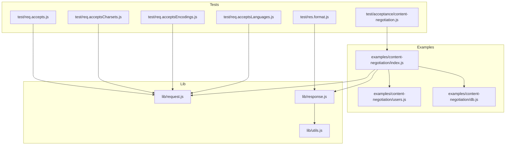
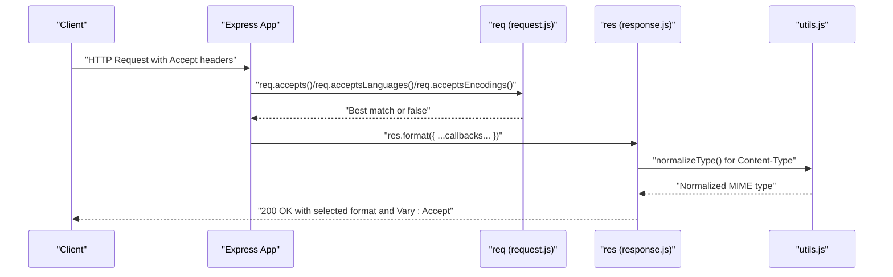
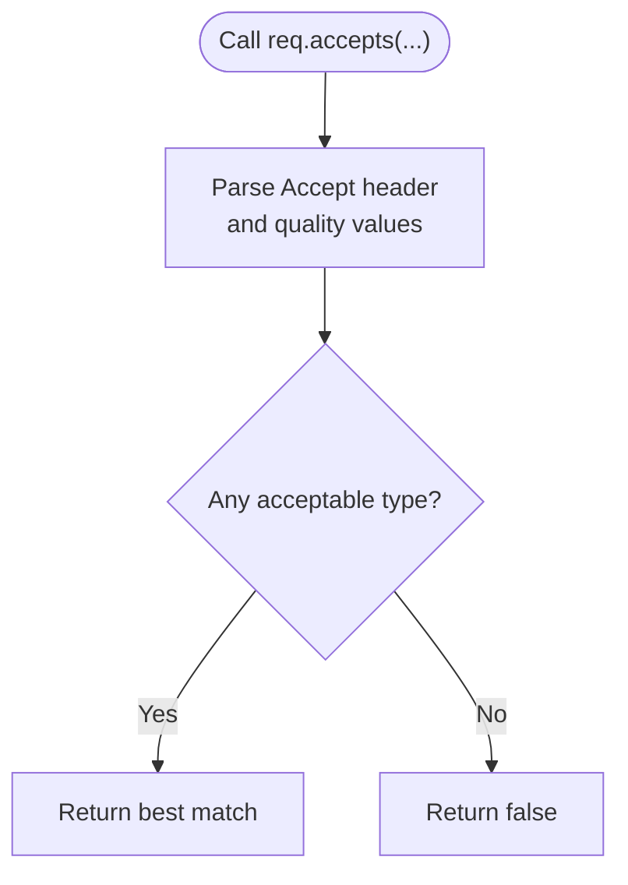
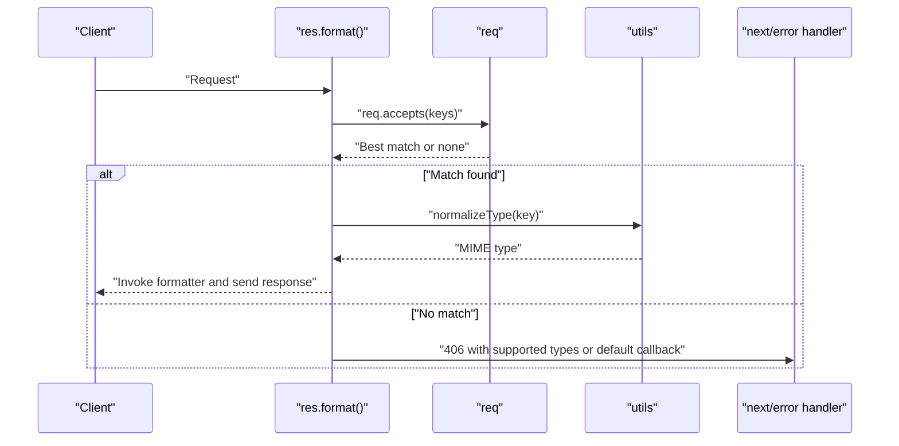
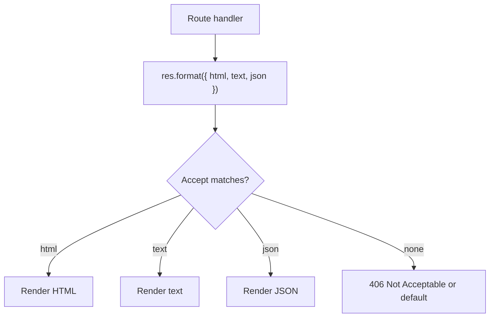
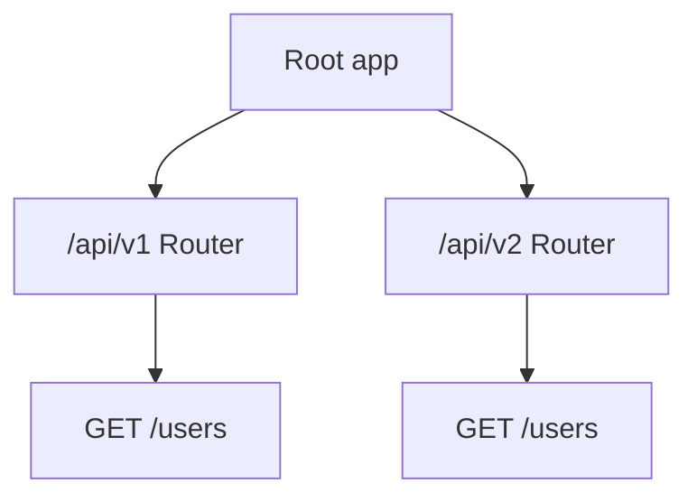
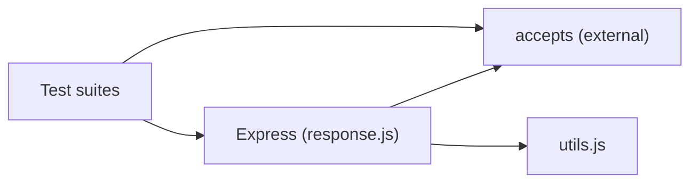

# Content Negotiation

<cite>
**Referenced Files in This Document**
- [index.js](file://examples/content-negotiation/index.js)
- [users.js](file://examples/content-negotiation/users.js)
- [db.js](file://examples/content-negotiation/db.js)
- [request.js](file://lib/request.js)
- [response.js](file://lib/response.js)
- [utils.js](file://lib/utils.js)
- [package.json](file://package.json)
- [content-negotiation.js](file://test/acceptance/content-negotiation.js)
- [res.format.js](file://test/res.format.js)
- [req.accepts.js](file://test/req.accepts.js)
- [req.acceptsCharsets.js](file://test/req.acceptsCharsets.js)
- [req.acceptsEncodings.js](file://test/req.acceptsEncodings.js)
- [req.acceptsLanguages.js](file://test/req.acceptsLanguages.js)
</cite>

## Table of Contents
1. [Introduction](#introduction)
2. [Project Structure](#project-structure)
3. [Core Components](#core-components)
4. [Architecture Overview](#architecture-overview)
5. [Detailed Component Analysis](#detailed-component-analysis)
6. [Dependency Analysis](#dependency-analysis)
7. [Performance Considerations](#performance-considerations)
8. [Troubleshooting Guide](#troubleshooting-guide)
9. [Conclusion](#conclusion)

## Introduction
This document explains Express.js content negotiation features with a focus on automatic content type detection, Accept header parsing, and response format selection. It covers the req.accepts() family of methods for media type, language, and encoding negotiation, and demonstrates practical implementations such as API versioning, format-specific responses, and internationalization support. It also addresses caching strategies via the Vary header, performance considerations, and fallback mechanisms when preferred formats are unavailable.

## Project Structure
The repository organizes content negotiation under:
- Example applications demonstrating res.format() and modular formatters
- Core runtime code implementing request and response helpers
- Utilities for MIME normalization and charset handling
- Tests validating Accept header parsing and res.format() behavior

**Diagram sources**
- [index.js:1-47](file://examples/content-negotiation/index.js#L1-L47)
- [users.js:1-20](file://examples/content-negotiation/users.js#L1-L20)
- [db.js:1-10](file://examples/content-negotiation/db.js#L1-L10)
- [request.js:127-187](file://lib/request.js#L127-L187)
- [response.js:569-594](file://lib/response.js#L569-L594)
- [utils.js:61-77](file://lib/utils.js#L61-L77)
- [content-negotiation.js:1-50](file://test/acceptance/content-negotiation.js#L1-L50)
- [res.format.js:1-249](file://test/res.format.js#L1-L249)
- [req.accepts.js:1-126](file://test/req.accepts.js#L1-L126)
- [req.acceptsCharsets.js:1-63](file://test/req.acceptsCharsets.js#L1-L63)
- [req.acceptsEncodings.js:1-39](file://test/req.acceptsEncodings.js#L1-L39)
- [req.acceptsLanguages.js:1-58](file://test/req.acceptsLanguages.js#L1-L58)

**Section sources**
- [index.js:1-47](file://examples/content-negotiation/index.js#L1-L47)
- [users.js:1-20](file://examples/content-negotiation/users.js#L1-L20)
- [db.js:1-10](file://examples/content-negotiation/db.js#L1-L10)
- [request.js:127-187](file://lib/request.js#L127-L187)
- [response.js:569-594](file://lib/response.js#L569-L594)
- [utils.js:61-77](file://lib/utils.js#L61-L77)
- [content-negotiation.js:1-50](file://test/acceptance/content-negotiation.js#L1-L50)
- [res.format.js:1-249](file://test/res.format.js#L1-L249)
- [req.accepts.js:1-126](file://test/req.accepts.js#L1-L126)
- [req.acceptsCharsets.js:1-63](file://test/req.acceptsCharsets.js#L1-L63)
- [req.acceptsEncodings.js:1-39](file://test/req.acceptsEncodings.js#L1-L39)
- [req.acceptsLanguages.js:1-58](file://test/req.acceptsLanguages.js#L1-L58)

## Core Components
- Automatic content type detection and Accept header parsing are delegated to the accepts library via request.js. The req.accepts(), req.acceptsEncodings(), req.acceptsCharsets(), and req.acceptsLanguages() methods wrap accepts() behavior.
- Response format selection is implemented by res.format(), which inspects Accept and invokes the appropriate callback, sets Content-Type, and ensures proper caching via Vary: Accept.
- Utility functions normalize MIME types and charsets and parse Accept parameters for quality values and parameters.

Key responsibilities:
- req.accepts(): Media type negotiation with quality values and wildcards
- req.acceptsEncodings(): Compression encoding negotiation
- req.acceptsCharsets(): Character set negotiation
- req.acceptsLanguages(): Language negotiation
- res.format(): Dispatch to formatter based on Accept and set Content-Type
- utils.normalizeType()/normalizeTypes(): Canonicalize extnames to MIME types
- utils.setCharset(): Attach charset to Content-Type

**Section sources**
- [request.js:127-187](file://lib/request.js#L127-L187)
- [response.js:569-594](file://lib/response.js#L569-L594)
- [utils.js:61-77](file://lib/utils.js#L61-L77)
- [utils.js:225-238](file://lib/utils.js#L225-L238)

## Architecture Overview
The content negotiation pipeline integrates request parsing, response dispatch, and caching headers.

**Diagram sources**
- [request.js:127-187](file://lib/request.js#L127-L187)
- [response.js:569-594](file://lib/response.js#L569-L594)
- [utils.js:61-77](file://lib/utils.js#L61-L77)

## Detailed Component Analysis

### Automatic Content Type Detection and Accept Parsing
- req.accepts(): Parses Accept and returns the best-matching MIME type or extension, honoring quality values and wildcards.
- req.acceptsEncodings(): Parses Accept-Encoding and returns the best supported encoding.
- req.acceptsCharsets(): Parses Accept-Charset and returns the best supported charset.
- req.acceptsLanguages(): Parses Accept-Language and returns the best supported language tag.

Implementation highlights:
- Delegates to accepts() for robust header parsing and quality scoring.
- Returns false when no acceptable type is found; callers should handle fallbacks.

**Diagram sources**
- [request.js:127-187](file://lib/request.js#L127-L187)

**Section sources**
- [request.js:127-187](file://lib/request.js#L127-L187)
- [req.accepts.js:1-126](file://test/req.accepts.js#L1-L126)
- [req.acceptsEncodings.js:1-39](file://test/req.acceptsEncodings.js#L1-L39)
- [req.acceptsCharsets.js:1-63](file://test/req.acceptsCharsets.js#L1-L63)
- [req.acceptsLanguages.js:1-58](file://test/req.acceptsLanguages.js#L1-L58)

### Response Format Selection with res.format()
- res.format() reads Accept and selects the first matching callback, sets Content-Type via utils.normalizeType(), and adds Vary: Accept.
- If no match, it triggers a 406 Not Acceptable with a list of supported types or invokes a default callback if provided.

**Diagram sources**
- [response.js:569-594](file://lib/response.js#L569-L594)
- [utils.js:61-77](file://lib/utils.js#L61-L77)

**Section sources**
- [response.js:569-594](file://lib/response.js#L569-L594)
- [res.format.js:1-249](file://test/res.format.js#L1-L249)

### Practical Implementations

#### Conditional Response Formatting
- Use res.format() to branch by Accept. The example routes demonstrate HTML, text, and JSON responses for the same endpoint.

**Diagram sources**
- [index.js:9-27](file://examples/content-negotiation/index.js#L9-L27)
- [users.js:5-20](file://examples/content-negotiation/users.js#L5-L20)
- [response.js:569-594](file://lib/response.js#L569-L594)

**Section sources**
- [index.js:9-27](file://examples/content-negotiation/index.js#L9-L27)
- [users.js:5-20](file://examples/content-negotiation/users.js#L5-L20)
- [content-negotiation.js:1-50](file://test/acceptance/content-negotiation.js#L1-L50)

#### Browser Capability Detection
- Use req.acceptsEncodings() to detect supported encodings (e.g., gzip, deflate) and conditionally compress responses.
- Use req.acceptsCharsets() to select character sets aligned with client capabilities.

**Section sources**
- [request.js:140-143](file://lib/request.js#L140-L143)
- [request.js:171-174](file://lib/request.js#L171-L174)
- [req.acceptsEncodings.js:1-39](file://test/req.acceptsEncodings.js#L1-L39)
- [req.acceptsCharsets.js:1-63](file://test/req.acceptsCharsets.js#L1-L63)

#### Internationalization Support
- Use req.acceptsLanguages() to honor Accept-Language and serve localized content or metadata indicating supported languages.

**Section sources**
- [request.js:185-186](file://lib/request.js#L185-L186)
- [req.acceptsLanguages.js:1-58](file://test/req.acceptsLanguages.js#L1-L58)

#### API Versioning
- Version resources by path (e.g., /api/v1, /api/v2) and apply content negotiation per version. The multi-router example shows separate routers for v1 and v2.

**Diagram sources**
- [api_v1.js:1-16](file://examples/multi-router/controllers/api_v1.js#L1-L16)
- [api_v2.js:1-16](file://examples/multi-router/controllers/api_v2.js#L1-L16)
- [index.js:1-18](file://examples/multi-router/index.js#L1-L18)

**Section sources**
- [api_v1.js:1-16](file://examples/multi-router/controllers/api_v1.js#L1-L16)
- [api_v2.js:1-16](file://examples/multi-router/controllers/api_v2.js#L1-L16)
- [index.js:1-18](file://examples/multi-router/index.js#L1-L18)

## Dependency Analysis
- Express depends on accepts for robust Accept header parsing. This is declared in package.json.
- res.format() relies on utils.normalizeType() to map extensions to MIME types and set Content-Type.
- Tests validate Accept parsing and res.format() behavior across scenarios including quality values, wildcards, and default callbacks.

**Diagram sources**
- [package.json:34-62](file://package.json#L34-L62)
- [response.js:569-594](file://lib/response.js#L569-L594)
- [utils.js:61-77](file://lib/utils.js#L61-L77)
- [res.format.js:1-249](file://test/res.format.js#L1-L249)
- [req.accepts.js:1-126](file://test/req.accepts.js#L1-L126)

**Section sources**
- [package.json:34-62](file://package.json#L34-L62)
- [response.js:569-594](file://lib/response.js#L569-L594)
- [utils.js:61-77](file://lib/utils.js#L61-L77)
- [res.format.js:1-249](file://test/res.format.js#L1-L249)
- [req.accepts.js:1-126](file://test/req.accepts.js#L1-L126)

## Performance Considerations
- Prefer res.format() with a concise set of supported types to minimize negotiation overhead.
- Use Vary: Accept (automatically set by res.format()) to enable efficient caching behind proxies and CDNs.
- Avoid heavy computation inside formatter callbacks; delegate to service layers and cache results when appropriate.
- For high-throughput APIs, consider precomputing and serving compressed responses (e.g., gzip) based on req.acceptsEncodings().

## Troubleshooting Guide
Common issues and resolutions:
- No acceptable format: res.format() triggers 406 Not Acceptable with supported types. Add a default callback to gracefully handle unknown formats.
- Charset mismatches: Ensure Content-Type includes charset; utils.setCharset() helps attach charset when missing.
- Wildcard Accept misuse: Confirm wildcards are intended and supported by your formatter set.
- Quality values ignored: Verify Accept header quality values and ordering; tests demonstrate precedence.

Operational checks:
- Validate Accept header parsing with targeted unit tests for req.accepts(), req.acceptsEncodings(), req.acceptsCharsets(), and req.acceptsLanguages().
- Confirm Vary: Accept is present in responses to avoid stale cached variants.

**Section sources**
- [res.format.js:182-249](file://test/res.format.js#L182-L249)
- [req.accepts.js:99-124](file://test/req.accepts.js#L99-L124)
- [req.acceptsEncodings.js:1-39](file://test/req.acceptsEncodings.js#L1-L39)
- [req.acceptsCharsets.js:1-63](file://test/req.acceptsCharsets.js#L1-L63)
- [req.acceptsLanguages.js:1-58](file://test/req.acceptsLanguages.js#L1-L58)

## Conclusion
Express.js provides a robust, standards-aligned content negotiation toolkit. req.accepts() and related helpers parse Accept headers with quality values and wildcards, while res.format() orchestrates response dispatch and caching via Vary: Accept. Combined with utils for MIME normalization and charset handling, these features enable flexible, RESTful APIs that adapt to clients and environments, including internationalization and versioning strategies.