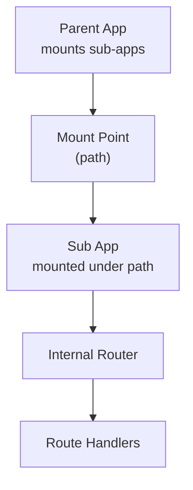
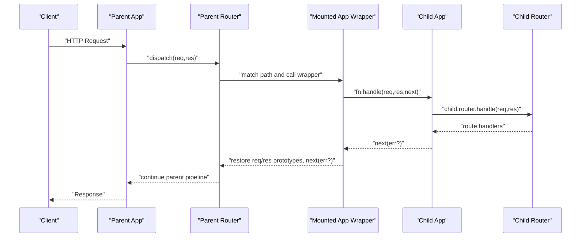
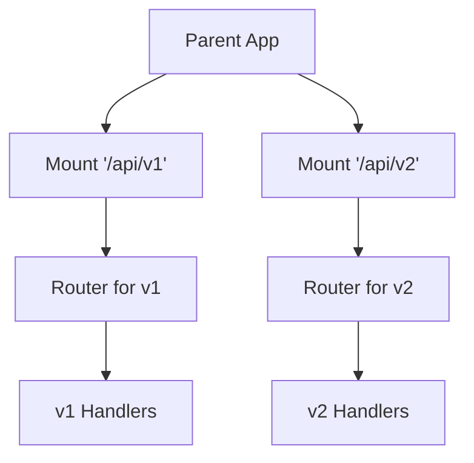

# Sub-Applications

<cite>
**Referenced Files in This Document**
- [lib/application.js](file://lib/application.js)
- [examples/multi-router/index.js](file://examples/multi-router/index.js)
- [examples/multi-router/controllers/api_v1.js](file://examples/multi-router/controllers/api_v1.js)
- [examples/multi-router/controllers/api_v2.js](file://examples/multi-router/controllers/api_v2.js)
- [examples/web-service/index.js](file://examples/web-service/index.js)
- [examples/route-separation/index.js](file://examples/route-separation/index.js)
- [examples/route-separation/user.js](file://examples/route-separation/user.js)
- [examples/route-separation/post.js](file://examples/route-separation/post.js)
- [examples/route-separation/site.js](file://examples/route-separation/site.js)
- [examples/mvc/index.js](file://examples/mvc/index.js)
- [examples/mvc/lib/boot.js](file://examples/mvc/lib/boot.js)
- [test/app.use.js](file://test/app.use.js)
- [test/app.request.js](file://test/app.request.js)
- [test/app.response.js](file://test/app.response.js)
- [test/app.js](file://test/app.js)
- [test/Router.js](file://test/Router.js)
</cite>

## Table of Contents
1. [Introduction](#introduction)
2. [Project Structure](#project-structure)
3. [Core Components](#core-components)
4. [Architecture Overview](#architecture-overview)
5. [Detailed Component Analysis](#detailed-component-analysis)
6. [Dependency Analysis](#dependency-analysis)
7. [Performance Considerations](#performance-considerations)
8. [Troubleshooting Guide](#troubleshooting-guide)
9. [Conclusion](#conclusion)
10. [Appendices](#appendices)

## Introduction
This document explains how to build modular Express applications that can be mounted under different routes. It focuses on the app.use() method, path-based mounting, automatic prototype inheritance, and composition patterns. Practical examples demonstrate API versioning, feature-based routing, and microservice-like composition. We also cover mounting order, route conflict resolution, and performance implications.

## Project Structure
Express organizes application logic around a central Application prototype with a Router-backed request pipeline. Sub-applications are mounted via app.use(), which supports:
- Path prefixes for mounting
- Dynamic segments in mount paths
- Arrays of middleware and apps
- Regular expressions for mount paths
- Automatic inheritance of request/response prototypes and settings from the parent

**Diagram sources**
- [lib/application.js:190-244](file://lib/application.js#L190-L244)
- [lib/application.js:109-122](file://lib/application.js#L109-L122)

**Section sources**
- [lib/application.js:190-244](file://lib/application.js#L190-L244)
- [lib/application.js:109-122](file://lib/application.js#L109-L122)

## Core Components
- app.use(): Mounts either middleware functions or other Express applications under a given path. When mounting another Express app, it sets mountpath and parent, wraps fn.handle with prototype restoration, and emits a "mount" event.
- Prototype inheritance: On mount, the child app inherits request, response, engines, and settings from the parent via Object.setPrototypeOf during the "mount" event.
- Path handling: Supports strings, arrays of strings, and regular expressions for mount paths. Strips the mount prefix from req.url for downstream middleware and routes.

Key behaviors validated by tests:
- Mounting emits "mount" and sets parent
- Path prefixes and dynamic segments work
- Arrays of middleware and mixed middleware/apps are supported
- Request/response prototype overrides are scoped per sub-app

**Section sources**
- [lib/application.js:190-244](file://lib/application.js#L190-L244)
- [lib/application.js:109-122](file://lib/application.js#L109-L122)
- [test/app.use.js:9-123](file://test/app.use.js#L9-L123)
- [test/app.use.js:258-542](file://test/app.use.js#L258-L542)
- [test/app.request.js:52-143](file://test/app.request.js#L52-L143)
- [test/app.response.js:54-115](file://test/app.response.js#L54-L115)

## Architecture Overview
Express composes sub-applications into a layered middleware pipeline. Each mounted app becomes a Router-backed subtree whose incoming requests are handled independently, yet share the parent’s configuration and prototypes.

**Diagram sources**
- [lib/application.js:152-178](file://lib/application.js#L152-L178)
- [lib/application.js:230-237](file://lib/application.js#L230-L237)
- [lib/application.js:190-244](file://lib/application.js#L190-L244)

## Detailed Component Analysis

### Path-Based Mounting and Dynamic Segments
- Mounting sub-apps under fixed paths, dynamic segments, and arrays of paths is supported.
- When a sub-app is mounted, the mount prefix is stripped from req.url for downstream handlers.

Practical validations:
- Fixed mount points and dynamic routes
- Arrays of paths and nested arrays of middleware
- Regular expression paths

**Section sources**
- [test/app.use.js:37-84](file://test/app.use.js#L37-L84)
- [test/app.use.js:448-503](file://test/app.use.js#L448-L503)
- [test/app.use.js:505-528](file://test/app.use.js#L505-L528)
- [test/app.use.js:284-294](file://test/app.use.js#L284-L294)

### Automatic Prototype Inheritance
- On mount, the child app inherits request, response, engines, and settings from the parent.
- Overrides in child apps are scoped to that sub-tree; parent prototypes remain unaffected.

Evidence:
- "mount" event triggers prototype inheritance
- Request/response method overrides are resolved per sub-app

**Section sources**
- [lib/application.js:109-122](file://lib/application.js#L109-L122)
- [test/app.request.js:52-143](file://test/app.request.js#L52-L143)
- [test/app.response.js:54-115](file://test/app.response.js#L54-L115)

### Mounting Order and Middleware Composition
- app.use() accepts multiple middleware/functions and arrays of middleware.
- Mixed arrays and functions are flattened and executed in order.
- Mounting order matters: earlier mounts intercept requests before later ones.

Validation:
- Multiple middleware invocation order
- Arrays and nested arrays of middleware
- Mixed middleware and sub-apps in the same mount

**Section sources**
- [test/app.use.js:125-256](file://test/app.use.js#L125-L256)
- [test/app.use.js:296-446](file://test/app.use.js#L296-L446)

### Parent-Child Relationships and Canonical Paths
- Each mounted app tracks mountpath and parent.
- app.path() computes the canonical path by concatenating parent paths.

**Section sources**
- [lib/application.js:226-227](file://lib/application.js#L226-L227)
- [lib/application.js:399-403](file://lib/application.js#L399-L403)
- [test/app.js:59-72](file://test/app.js#L59-L72)

### Composition Patterns

#### API Versioning
- Mount separate sub-apps under distinct versioned paths.
- Each version maintains its own routes and middleware stack.

Example pattern:
- Parent app mounts sub-apps under "/api/v1" and "/api/v2".
- Each sub-app defines its own routes.

**Section sources**
- [examples/multi-router/index.js:7-8](file://examples/multi-router/index.js#L7-L8)
- [examples/multi-router/controllers/api_v1.js:7-13](file://examples/multi-router/controllers/api_v1.js#L7-L13)
- [examples/multi-router/controllers/api_v2.js:7-13](file://examples/multi-router/controllers/api_v2.js#L7-L13)

#### Feature-Based Routing
- Split concerns by mounting feature-specific sub-apps under feature namespaces.
- Shared middleware (e.g., logging, parsing) is registered on the parent.

Example pattern:
- Parent registers global middleware.
- Feature modules export routers and are mounted under feature paths.

**Section sources**
- [examples/route-separation/index.js:29-32](file://examples/route-separation/index.js#L29-L32)
- [examples/route-separation/index.js:38-50](file://examples/route-separation/index.js#L38-L50)
- [examples/route-separation/user.js:10-24](file://examples/route-separation/user.js#L10-L24)
- [examples/route-separation/post.js:11-13](file://examples/route-separation/post.js#L11-L13)
- [examples/route-separation/site.js:3-5](file://examples/route-separation/site.js#L3-L5)

#### Microservice Architecture Patterns
- Compose multiple bounded contexts as sub-apps.
- Centralize cross-cutting concerns (auth, logging) at the parent level.
- Each sub-app encapsulates domain logic and routes.

Example pattern:
- Parent app enforces API key validation under "/api".
- Sub-apps expose domain endpoints (users, repos).
- Global error and 404 handlers finalize responses.

**Section sources**
- [examples/web-service/index.js:30-42](file://examples/web-service/index.js#L30-L42)
- [examples/web-service/index.js:75-91](file://examples/web-service/index.js#L75-L91)
- [examples/web-service/index.js:98-111](file://examples/web-service/index.js#L98-L111)

#### Automated Bootstrapping (MVC-style)
- Dynamically discover controllers and mount them as sub-apps.
- Each controller defines routes and optional before middleware.
- Views and engines can be configured per controller.

**Section sources**
- [examples/mvc/index.js:34-51](file://examples/mvc/index.js#L34-L51)
- [examples/mvc/lib/boot.js:14-83](file://examples/mvc/lib/boot.js#L14-L83)

### Route Conflicts Resolution
- Mounting order determines precedence: earlier mounts intercept requests first.
- When multiple sub-apps match a path, the first matching mount handles it.
- Dynamic segments and regular expressions allow precise targeting to avoid collisions.

Validation:
- Parallel requests do not interfere; parameter extraction works per request.
- Parameter middleware runs consistently across overlapping mounts.

**Section sources**
- [test/Router.js:570-596](file://test/Router.js#L570-L596)
- [test/Router.js:599-635](file://test/Router.js#L599-L635)

## Dependency Analysis
Sub-applications introduce hierarchical dependencies:
- Parent app depends on mounted children for specific paths.
- Children inherit configuration from parents but can override locally.
- Router instances form a tree of responsibility.

**Diagram sources**
- [examples/multi-router/index.js:7-8](file://examples/multi-router/index.js#L7-L8)
- [examples/multi-router/controllers/api_v1.js:5](file://examples/multi-router/controllers/api_v1.js#L5)
- [examples/multi-router/controllers/api_v2.js:5](file://examples/multi-router/controllers/api_v2.js#L5)

**Section sources**
- [examples/multi-router/index.js:7-8](file://examples/multi-router/index.js#L7-L8)
- [examples/multi-router/controllers/api_v1.js:5](file://examples/multi-router/controllers/api_v1.js#L5)
- [examples/multi-router/controllers/api_v2.js:5](file://examples/multi-router/controllers/api_v2.js#L5)

## Performance Considerations
- Each sub-app adds a Router dispatch hop; keep mount depth reasonable to minimize overhead.
- Prototype restoration occurs per request during sub-app handling; this is lightweight but avoid excessive nesting.
- Prefer centralized middleware on the parent for cross-cutting concerns to reduce duplication.
- Use dynamic segments and precise mount paths to limit unnecessary matching.

## Troubleshooting Guide
Common issues and resolutions:
- Mounting fails with "requires a middleware function": Ensure you pass a function or an Express app to app.use().
- Unexpected 404s: Verify mount path correctness and trailing slashes; remember that mount prefixes are stripped from req.url.
- Middleware not executing: Confirm order and that earlier middleware does not send a response or call next() prematurely.
- Conflicting routes: Adjust mount order or refine mount paths to ensure the intended sub-app handles the request.
- Prototype pollution: Remember that child overrides are scoped; if behavior differs, check whether the override is applied in the correct sub-app.

**Section sources**
- [test/app.use.js:259-282](file://test/app.use.js#L259-L282)
- [test/app.use.js:322-341](file://test/app.use.js#L322-L341)
- [test/app.use.js:343-362](file://test/app.use.js#L343-L362)

## Conclusion
Express sub-applications enable clean modularity and composition. Use app.use() to mount middleware and apps under precise paths, leverage automatic prototype inheritance for consistent behavior, and apply composition patterns like API versioning and feature-based routing. Pay attention to mounting order, path specificity, and performance to build maintainable and scalable systems.

## Appendices

### Practical Examples Index
- API versioning: [examples/multi-router/index.js](file://examples/multi-router/index.js), [examples/multi-router/controllers/api_v1.js](file://examples/multi-router/controllers/api_v1.js), [examples/multi-router/controllers/api_v2.js](file://examples/multi-router/controllers/api_v2.js)
- Feature-based routing: [examples/route-separation/index.js](file://examples/route-separation/index.js), [examples/route-separation/user.js](file://examples/route-separation/user.js), [examples/route-separation/post.js](file://examples/route-separation/post.js), [examples/route-separation/site.js](file://examples/route-separation/site.js)
- Microservice-like composition: [examples/web-service/index.js](file://examples/web-service/index.js)
- Automated bootstrapping: [examples/mvc/index.js](file://examples/mvc/index.js), [examples/mvc/lib/boot.js](file://examples/mvc/lib/boot.js)