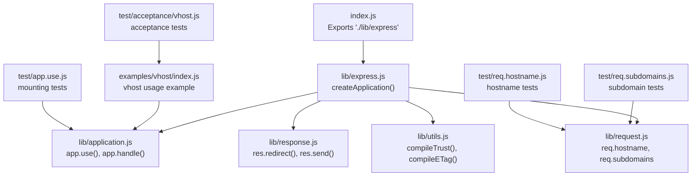
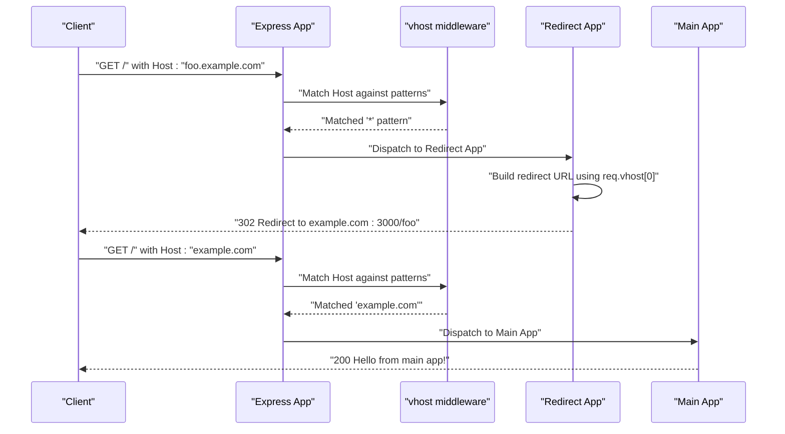
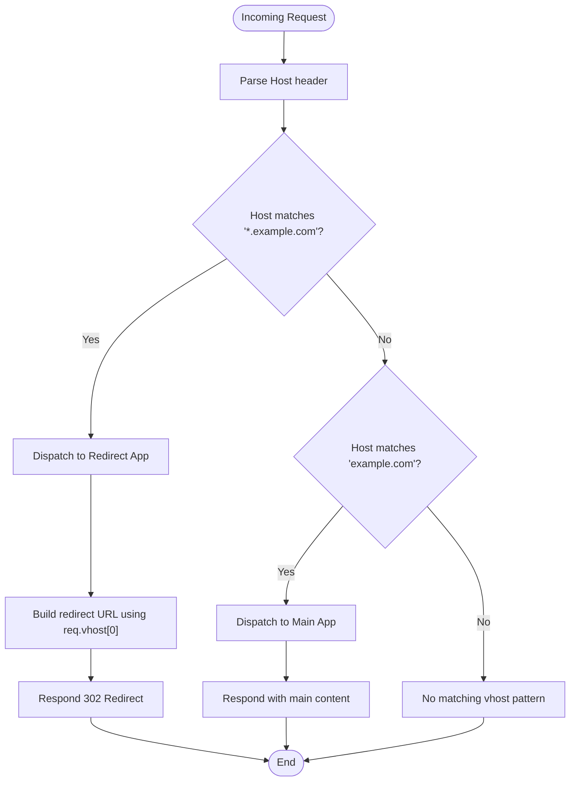
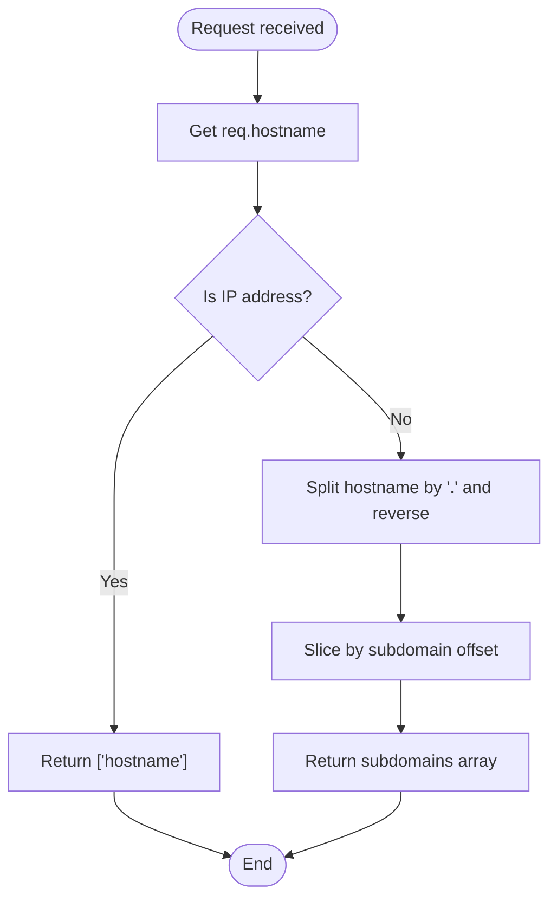
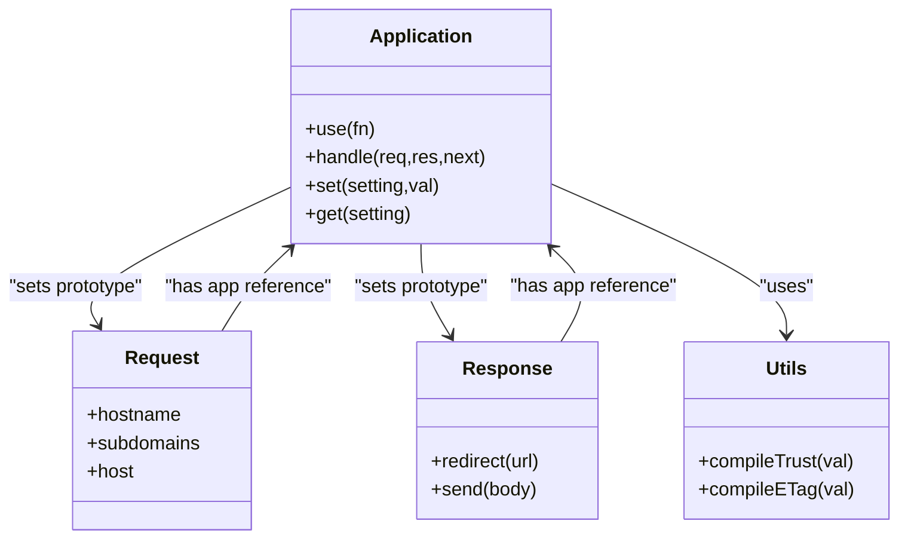
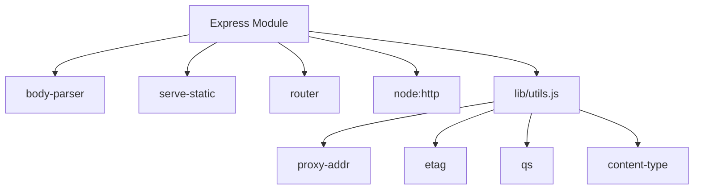

# Virtual Hosts

<cite>
**Referenced Files in This Document**
- [examples/vhost/index.js](file://examples/vhost/index.js)
- [test/acceptance/vhost.js](file://test/acceptance/vhost.js)
- [lib/application.js](file://lib/application.js)
- [lib/request.js](file://lib/request.js)
- [lib/response.js](file://lib/response.js)
- [lib/utils.js](file://lib/utils.js)
- [lib/express.js](file://lib/express.js)
- [index.js](file://index.js)
- [package.json](file://package.json)
- [test/req.subdomains.js](file://test/req.subdomains.js)
- [test/req.hostname.js](file://test/req.hostname.js)
- [test/app.use.js](file://test/app.use.js)
</cite>

## Table of Contents
1. [Introduction](#introduction)
2. [Project Structure](#project-structure)
3. [Core Components](#core-components)
4. [Architecture Overview](#architecture-overview)
5. [Detailed Component Analysis](#detailed-component-analysis)
6. [Dependency Analysis](#dependency-analysis)
7. [Performance Considerations](#performance-considerations)
8. [Troubleshooting Guide](#troubleshooting-guide)
9. [Conclusion](#conclusion)
10. [Appendices](#appendices)

## Introduction
This document explains how to configure and operate virtual hosts in Express.js applications. It focuses on domain-based routing, subdomain handling, and multi-domain application management. You will learn how Express detects hostnames, how to configure subdomain offsets, and how to route requests based on domain names. Practical scenarios include multi-tenant applications, staging environments, and domain-specific routing. Security considerations, SSL/TLS certificate management, and performance optimization for multi-domain setups are covered.

## Project Structure
Express exposes a minimal API surface for building applications. Virtual host behavior is primarily driven by:
- Hostname and subdomain extraction in the request prototype
- Middleware mounting and routing in the application prototype
- Utility helpers for trust proxies and ETag generation

**Diagram sources**
- [index.js:1-12](file://index.js#L1-L12)
- [lib/express.js:1-82](file://lib/express.js#L1-L82)
- [lib/application.js:1-632](file://lib/application.js#L1-L632)
- [lib/request.js:1-528](file://lib/request.js#L1-L528)
- [lib/response.js:1-1048](file://lib/response.js#L1-L1048)
- [lib/utils.js:1-272](file://lib/utils.js#L1-L272)
- [examples/vhost/index.js:1-54](file://examples/vhost/index.js#L1-L54)
- [test/acceptance/vhost.js:1-47](file://test/acceptance/vhost.js#L1-L47)
- [test/req.subdomains.js:1-174](file://test/req.subdomains.js#L1-L174)
- [test/req.hostname.js:1-188](file://test/req.hostname.js#L1-L188)
- [test/app.use.js:1-543](file://test/app.use.js#L1-L543)

**Section sources**
- [index.js:1-12](file://index.js#L1-L12)
- [lib/express.js:1-82](file://lib/express.js#L1-L82)
- [lib/application.js:1-632](file://lib/application.js#L1-L632)
- [lib/request.js:1-528](file://lib/request.js#L1-L528)
- [lib/response.js:1-1048](file://lib/response.js#L1-L1048)
- [lib/utils.js:1-272](file://lib/utils.js#L1-L272)
- [examples/vhost/index.js:1-54](file://examples/vhost/index.js#L1-L54)
- [test/acceptance/vhost.js:1-47](file://test/acceptance/vhost.js#L1-L47)
- [test/req.subdomains.js:1-174](file://test/req.subdomains.js#L1-L174)
- [test/req.hostname.js:1-188](file://test/req.hostname.js#L1-L188)
- [test/app.use.js:1-543](file://test/app.use.js#L1-L543)

## Core Components
- Hostname detection and trust proxy handling: Implemented in the request prototype getters for hostname and host, with support for X-Forwarded-Host and IPv6 literals.
- Subdomain extraction and offset: Implemented in the request prototype getter for subdomains, using the configured subdomain offset setting.
- Middleware mounting and routing: Implemented in the application prototype’s use() method, enabling path-based and domain-based routing via middleware composition.
- Virtual host behavior: Demonstrated in the example using a dedicated vhost package to route domains/subdomains to separate apps.

Key implementation references:
- Hostname and host getters: [lib/request.js:418-458](file://lib/request.js#L418-L458)
- Subdomains getter: [lib/request.js:383-394](file://lib/request.js#L383-L394)
- Default subdomain offset: [lib/application.js:98](file://lib/application.js#L98)
- Middleware mounting: [lib/application.js:190-244](file://lib/application.js#L190-L244)
- Trust proxy compilation: [lib/utils.js:194-214](file://lib/utils.js#L194-L214)

**Section sources**
- [lib/request.js:383-394](file://lib/request.js#L383-L394)
- [lib/request.js:418-458](file://lib/request.js#L418-L458)
- [lib/application.js:98](file://lib/application.js#L98)
- [lib/application.js:190-244](file://lib/application.js#L190-L244)
- [lib/utils.js:194-214](file://lib/utils.js#L194-L214)

## Architecture Overview
Express applications route requests through a central handle() method. Middleware can be mounted globally or under specific paths. For domain-based routing, a dedicated vhost package is used to match Host headers and dispatch to separate app instances. The example demonstrates:
- A main app serving the top-level domain
- A redirect app handling wildcard subdomains and redirecting to the main app
- The vhost middleware mapping "*.example.com" to the redirect app and "example.com" to the main app

**Diagram sources**
- [examples/vhost/index.js:44-47](file://examples/vhost/index.js#L44-L47)
- [test/acceptance/vhost.js:25-45](file://test/acceptance/vhost.js#L25-L45)

**Section sources**
- [examples/vhost/index.js:44-47](file://examples/vhost/index.js#L44-L47)
- [test/acceptance/vhost.js:25-45](file://test/acceptance/vhost.js#L25-L45)

## Detailed Component Analysis

### Domain-Based Routing with vhost
The example demonstrates domain-based routing using a vhost package:
- Wildcard subdomains "*.example.com" are routed to a redirect app
- The top-level domain "example.com" is routed to the main app
- The redirect app uses req.vhost[0] to extract the subdomain and redirect to the main app

Practical configuration steps:
- Install the vhost package as a dev dependency
- Create a main Express app for the top-level domain
- Create a redirect app for wildcard subdomains
- Mount vhost middleware to route domains to respective apps

Security considerations:
- Ensure the Host header is validated and trusted only when behind a trusted proxy
- Use HTTPS/TLS termination at a reverse proxy or load balancer
- Sanitize subdomain values before constructing redirects

Performance considerations:
- Minimize middleware overhead in the vhost chain
- Cache frequently accessed domain-specific assets
- Use connection pooling and keep-alive for upstream services

**Diagram sources**
- [examples/vhost/index.js:44-47](file://examples/vhost/index.js#L44-L47)
- [test/acceptance/vhost.js:25-45](file://test/acceptance/vhost.js#L25-L45)

**Section sources**
- [examples/vhost/index.js:44-47](file://examples/vhost/index.js#L44-L47)
- [test/acceptance/vhost.js:25-45](file://test/acceptance/vhost.js#L25-L45)

### Subdomain Handling and Offset Configuration
Express extracts subdomains from the hostname and applies a configurable offset:
- Default subdomain offset is 2, meaning the main domain is considered the last two parts
- Subdomains are reversed and sliced by the offset to produce an array
- IPv4 and IPv6 addresses are handled as special cases

Offset behavior examples:
- With offset 2 (default): "tobi.ferrets.example.com" yields ["ferrets","tobi"]
- With offset 0: Whole reversed domain is returned
- With offset 3: Only ["ferrets","tobi"] for the same host

Trust proxy impact:
- When trust proxy is enabled, X-Forwarded-Host is respected for hostname detection
- Tests demonstrate that X-Forwarded-Host is ignored when trust proxy is disabled

**Diagram sources**
- [lib/request.js:383-394](file://lib/request.js#L383-L394)
- [lib/request.js:444-458](file://lib/request.js#L444-L458)
- [lib/application.js:98](file://lib/application.js#L98)
- [test/req.subdomains.js:95-171](file://test/req.subdomains.js#L95-L171)
- [test/req.hostname.js:73-188](file://test/req.hostname.js#L73-L188)

**Section sources**
- [lib/request.js:383-394](file://lib/request.js#L383-L394)
- [lib/request.js:444-458](file://lib/request.js#L444-L458)
- [lib/application.js:98](file://lib/application.js#L98)
- [test/req.subdomains.js:95-171](file://test/req.subdomains.js#L95-L171)
- [test/req.hostname.js:73-188](file://test/req.hostname.js#L73-L188)

### Middleware Mounting and Domain-Specific Routing
Express supports mounting middleware and nested applications. For domain-based routing:
- Use app.use() to register middleware that inspects req.hostname or req.vhost
- Mount separate apps under specific paths or domains using vhost
- Combine middleware to implement domain-specific logic before routing

Key APIs:
- app.use(): Mounts middleware or nested apps
- app.handle(): Central request dispatcher
- req.hostname and req.subdomains: Extract hostname and subdomains

**Diagram sources**
- [lib/application.js:190-244](file://lib/application.js#L190-L244)
- [lib/application.js:152-178](file://lib/application.js#L152-L178)
- [lib/request.js:444-458](file://lib/request.js#L444-L458)
- [lib/request.js:383-394](file://lib/request.js#L383-L394)
- [lib/response.js:793-796](file://lib/response.js#L793-L796)
- [lib/utils.js:194-214](file://lib/utils.js#L194-L214)

**Section sources**
- [lib/application.js:190-244](file://lib/application.js#L190-L244)
- [lib/application.js:152-178](file://lib/application.js#L152-L178)
- [lib/request.js:444-458](file://lib/request.js#L444-L458)
- [lib/request.js:383-394](file://lib/request.js#L383-L394)
- [lib/response.js:793-796](file://lib/response.js#L793-L796)
- [lib/utils.js:194-214](file://lib/utils.js#L194-L214)

### Practical Scenarios

#### Multi-Tenant Applications
- Each tenant can have its own subdomain (e.g., tenant1.example.com)
- Use req.vhost[0] to identify the tenant and apply tenant-specific middleware
- Route to tenant-scoped apps or shared services

#### Staging Environments
- Use staging subdomains (e.g., staging.example.com) to route to a separate staging app
- Apply environment-specific middleware for logging, rate limiting, or feature flags

#### Domain-Specific Routing
- Route legacy domains to migration apps
- Implement A/B testing by routing subsets of traffic to different apps based on subdomains

Security and performance considerations remain the same as outlined in earlier sections.

[No sources needed since this subsection provides conceptual guidance]

## Dependency Analysis
Express integrates several internal and external dependencies that influence virtual host behavior:
- Body parsing and static serving are exposed via the main module
- Router and HTTP server are used internally
- Utilities for trust proxy and ETag generation are used by request/response

**Diagram sources**
- [lib/express.js:15-82](file://lib/express.js#L15-L82)
- [lib/utils.js:15-272](file://lib/utils.js#L15-L272)
- [package.json:34-62](file://package.json#L34-L62)

**Section sources**
- [lib/express.js:15-82](file://lib/express.js#L15-L82)
- [lib/utils.js:15-272](file://lib/utils.js#L15-L272)
- [package.json:34-62](file://package.json#L34-L62)

## Performance Considerations
- Prefer early exit in middleware that checks req.hostname or req.vhost to minimize processing
- Use caching for domain-specific configurations and tenant metadata
- Avoid heavy synchronous operations in the vhost chain
- Consider connection reuse and keep-alive for upstream services
- Monitor request latency and adjust middleware order accordingly

[No sources needed since this section provides general guidance]

## Troubleshooting Guide
Common issues and resolutions:
- Unexpected subdomains: Verify the subdomain offset setting and ensure the Host header is correct
- Incorrect hostname with proxies: Enable trust proxy and ensure X-Forwarded-Host is set by the proxy
- Redirect loops: Ensure the redirect app does not redirect back to itself
- Wildcard matching not working: Confirm the vhost pattern syntax and that the Host header matches

Relevant tests and references:
- Subdomain offset behavior: [test/req.subdomains.js:95-171](file://test/req.subdomains.js#L95-L171)
- Hostname with trust proxy: [test/req.hostname.js:73-188](file://test/req.hostname.js#L73-L188)
- vhost acceptance tests: [test/acceptance/vhost.js:1-47](file://test/acceptance/vhost.js#L1-L47)

**Section sources**
- [test/req.subdomains.js:95-171](file://test/req.subdomains.js#L95-L171)
- [test/req.hostname.js:73-188](file://test/req.hostname.js#L73-L188)
- [test/acceptance/vhost.js:1-47](file://test/acceptance/vhost.js#L1-L47)

## Conclusion
Express provides robust primitives for domain-based routing through hostname and subdomain extraction, middleware mounting, and the vhost package. By combining these capabilities, you can implement multi-tenant applications, staging environments, and domain-specific routing. Properly configure subdomain offsets, trust proxies, and middleware ordering to ensure predictable behavior. Apply security best practices and performance optimizations for production deployments.

[No sources needed since this section summarizes without analyzing specific files]

## Appendices

### Configuration Checklist
- Set subdomain offset appropriately for your domain structure
- Enable trust proxy when behind a reverse proxy
- Configure vhost patterns for wildcard and top-level domains
- Implement domain-specific middleware before routing
- Secure TLS termination at the edge (load balancer or reverse proxy)
- Monitor and optimize middleware performance

[No sources needed since this section provides general guidance]