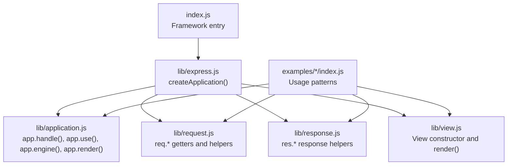
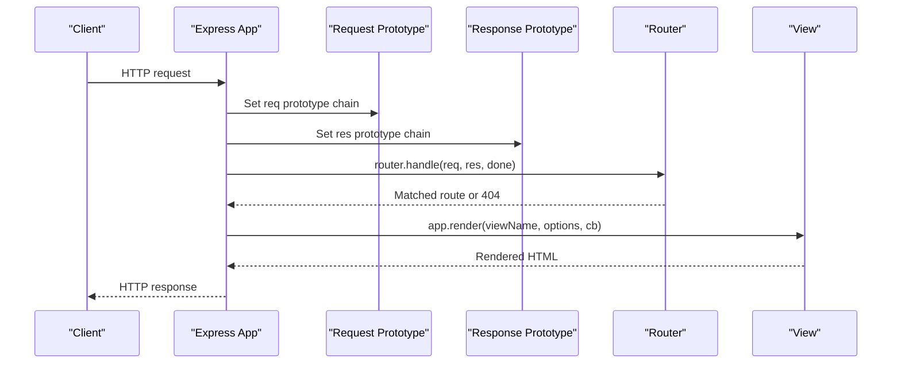
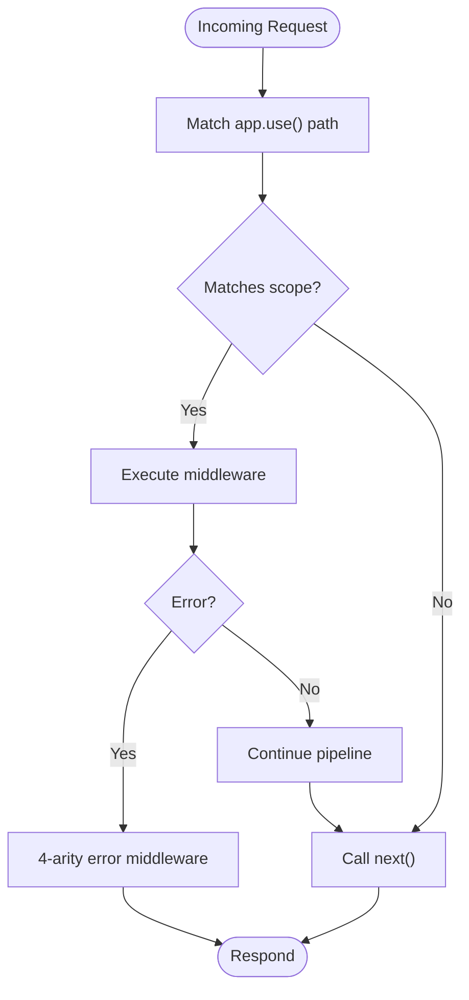
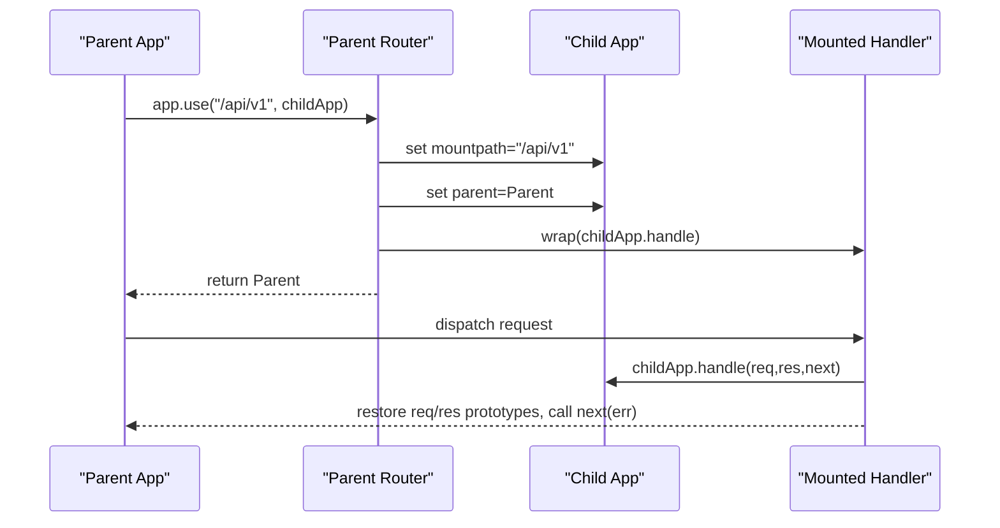
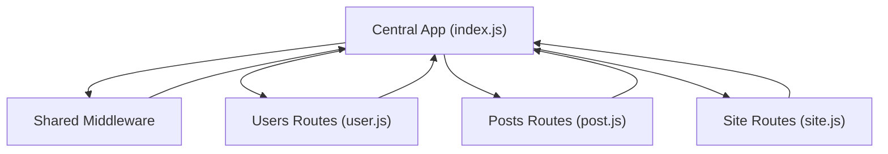
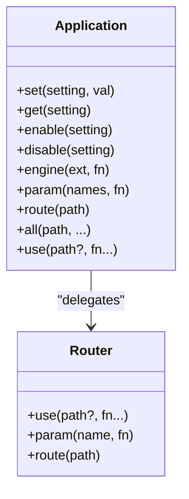
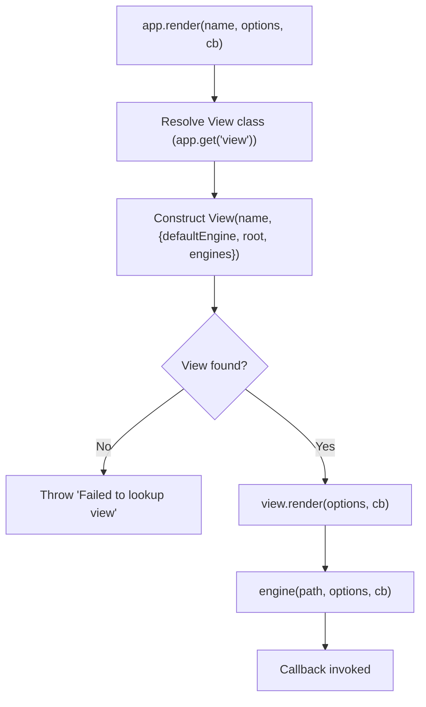
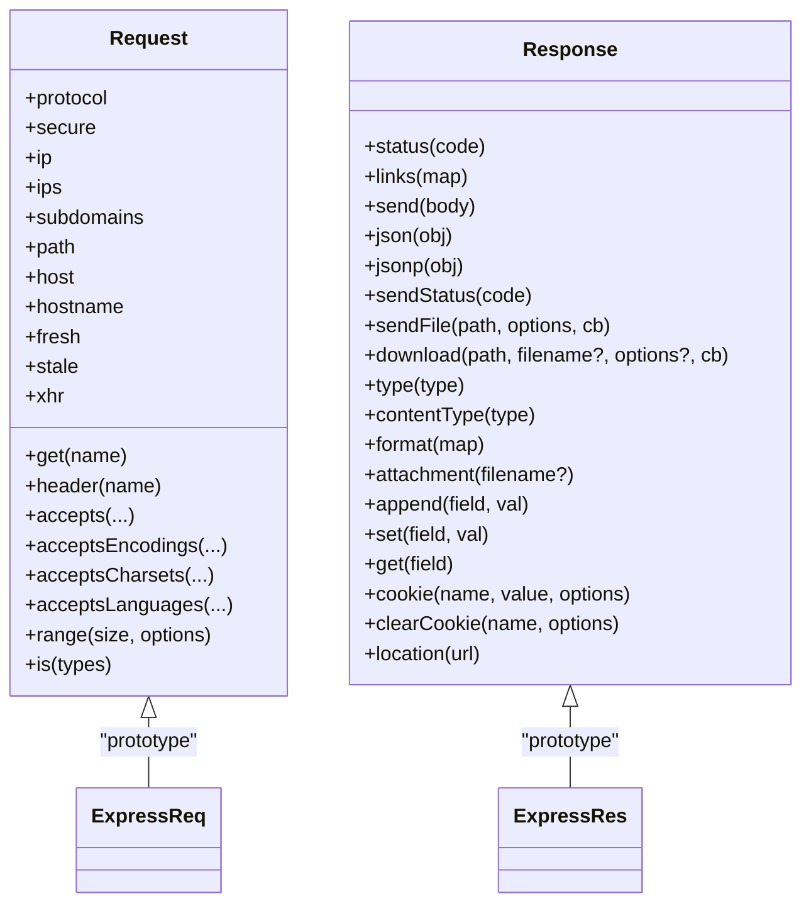
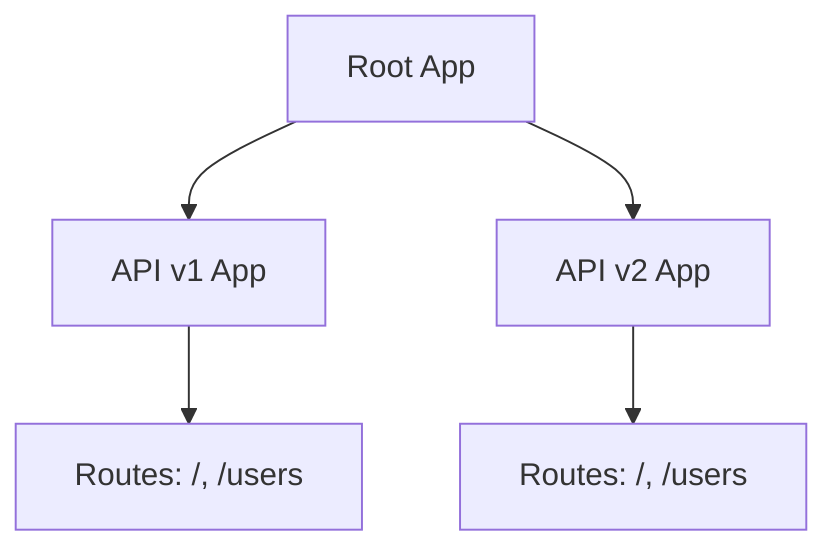
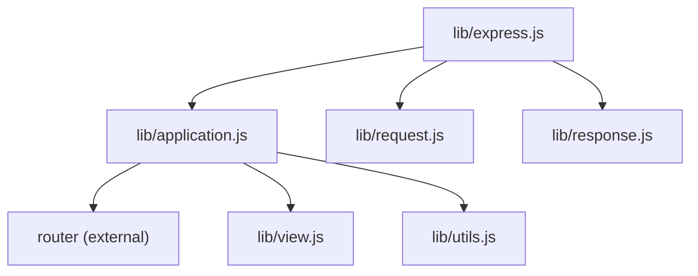

# Advanced Topics

<cite>
**Referenced Files in This Document**
- [index.js](file://index.js)
- [express.js](file://lib/express.js)
- [application.js](file://lib/application.js)
- [request.js](file://lib/request.js)
- [response.js](file://lib/response.js)
- [view.js](file://lib/view.js)
- [multi-router/index.js](file://examples/multi-router/index.js)
- [multi-router/controllers/api_v1.js](file://examples/multi-router/controllers/api_v1.js)
- [multi-router/controllers/api_v2.js](file://examples/multi-router/controllers/api_v2.js)
- [mvc/index.js](file://examples/mvc/index.js)
- [route-separation/index.js](file://examples/route-separation/index.js)
- [route-separation/site.js](file://examples/route-separation/site.js)
- [route-separation/post.js](file://examples/route-separation/post.js)
- [web-service/index.js](file://examples/web-service/index.js)
- [view-constructor/github-view.js](file://examples/view-constructor/github-view.js)
</cite>

## Table of Contents
1. [Introduction](#introduction)
2. [Project Structure](#project-structure)
3. [Core Components](#core-components)
4. [Architecture Overview](#architecture-overview)
5. [Detailed Component Analysis](#detailed-component-analysis)
6. [Dependency Analysis](#dependency-analysis)
7. [Performance Considerations](#performance-considerations)
8. [Troubleshooting Guide](#troubleshooting-guide)
9. [Conclusion](#conclusion)
10. [Appendices](#appendices)

## Introduction
This document presents advanced Express.js topics focusing on framework extensibility, custom middleware development, and architectural patterns. It synthesizes the framework’s internal architecture with practical examples from the repository to explain:
- Extending Express via custom middleware and plugin-like patterns
- Sub-application mounting and microservices-style composition
- Modular application design and route separation
- Advanced routing techniques and dynamic route generation
- View system customization, custom view constructors, and template engine integration
- Practical examples demonstrating performance-conscious patterns and framework customization

## Project Structure
The repository is organized into:
- Core framework internals under lib/, exposing the application factory, request/response prototypes, and view renderer
- Examples grouped by theme (routing, MVC, view customization, web service patterns)
- Root index.js exporting the framework entry point

**Diagram sources**
- [index.js:1-12](file://index.js#L1-L12)
- [express.js:36-56](file://lib/express.js#L36-L56)
- [application.js:59-178](file://lib/application.js#L59-L178)
- [request.js:63-83](file://lib/request.js#L63-L83)
- [response.js:125-218](file://lib/response.js#L125-L218)
- [view.js:52-95](file://lib/view.js#L52-L95)

**Section sources**
- [index.js:1-12](file://index.js#L1-L12)
- [express.js:15-82](file://lib/express.js#L15-L82)
- [application.js:59-141](file://lib/application.js#L59-L141)

## Core Components
- Application factory and prototype: Express creates an application function and mixes in application behavior, request/response prototypes, and exposes Router and middleware shorthands.
- Request and response prototypes: Both are prototype objects layered onto IncomingMessage and ServerResponse respectively, enabling extensibility via prototype augmentation.
- View system: The View class encapsulates template discovery, engine resolution, and rendering, with hooks for customization.

Key responsibilities:
- Application initialization and default configuration
- Middleware mounting and sub-app lifecycle
- Rendering pipeline and template engine integration
- Request/response helpers and content negotiation

**Section sources**
- [express.js:36-56](file://lib/express.js#L36-L56)
- [application.js:59-141](file://lib/application.js#L59-L141)
- [application.js:152-178](file://lib/application.js#L152-L178)
- [application.js:294-308](file://lib/application.js#L294-L308)
- [application.js:522-575](file://lib/application.js#L522-L575)
- [request.js:30-37](file://lib/request.js#L30-L37)
- [response.js:42-49](file://lib/response.js#L42-L49)
- [view.js:52-95](file://lib/view.js#L52-L95)

## Architecture Overview
Express composes a minimal application function that delegates to an internal router. The application prototype sets defaults, mounts middleware, and orchestrates rendering. Request and response prototypes are attached at runtime to provide rich helpers. The view system resolves engines and renders templates.

**Diagram sources**
- [application.js:152-178](file://lib/application.js#L152-L178)
- [application.js:522-575](file://lib/application.js#L522-L575)
- [view.js:133-159](file://lib/view.js#L133-L159)

## Detailed Component Analysis

### Custom Middleware Development Patterns
Patterns demonstrated:
- Mounting middleware at specific paths to scope behavior
- Using middleware with arity to capture errors
- Composing middleware to implement cross-cutting concerns (logging, sessions, method override)
- Extending response prototypes for convenience methods

Practical example references:
- Web service API key validation and error handling middleware
- MVC application composing logging, static serving, sessions, and method override
- Route separation composing modular route handlers

**Diagram sources**
- [web-service/index.js:30-42](file://examples/web-service/index.js#L30-L42)
- [web-service/index.js:98-103](file://examples/web-service/index.js#L98-L103)
- [mvc/index.js:34-50](file://examples/mvc/index.js#L34-L50)
- [route-separation/index.js:36-50](file://examples/route-separation/index.js#L36-L50)

**Section sources**
- [web-service/index.js:30-42](file://examples/web-service/index.js#L30-L42)
- [web-service/index.js:98-103](file://examples/web-service/index.js#L98-L103)
- [mvc/index.js:22-31](file://examples/mvc/index.js#L22-L31)
- [mvc/index.js:34-50](file://examples/mvc/index.js#L34-L50)
- [route-separation/index.js:36-50](file://examples/route-separation/index.js#L36-L50)

### Plugin Architecture and Sub-Application Mounting
Express supports mounting other Express applications under a given path. The mount process:
- Sets mountpath and parent reference
- Wraps the mounted app’s handle to restore original request/response prototypes after handling
- Emits a “mount” event for lifecycle hooks

**Diagram sources**
- [application.js:225-241](file://lib/application.js#L225-L241)
- [multi-router/index.js:7-8](file://examples/multi-router/index.js#L7-L8)
- [multi-router/controllers/api_v1.js:5](file://examples/multi-router/controllers/api_v1.js#L5)
- [multi-router/controllers/api_v2.js:5](file://examples/multi-router/controllers/api_v2.js#L5)

**Section sources**
- [application.js:189-244](file://lib/application.js#L189-L244)
- [multi-router/index.js:7-8](file://examples/multi-router/index.js#L7-L8)

### Modular Application Design and Route Separation
Modular design is achieved by:
- Splitting routes into separate modules
- Composing routes in a central application file
- Using route-specific middleware and parameter extraction

Example: route-separation demonstrates organizing routes for users and posts into dedicated modules.

**Diagram sources**
- [route-separation/index.js:36-50](file://examples/route-separation/index.js#L36-L50)
- [route-separation/site.js:3-5](file://examples/route-separation/site.js#L3-L5)
- [route-separation/post.js:11-13](file://examples/route-separation/post.js#L11-L13)

**Section sources**
- [route-separation/index.js:36-50](file://examples/route-separation/index.js#L36-L50)
- [route-separation/site.js:3-5](file://examples/route-separation/site.js#L3-L5)
- [route-separation/post.js:11-13](file://examples/route-separation/post.js#L11-L13)

### Advanced Routing Techniques and Dynamic Route Generation
Express routes are delegated to a Router instance. The application exposes convenience methods for HTTP verbs and a generic route() method to create isolated middleware stacks per path. Parameter extraction and custom parameter handlers are supported.

**Diagram sources**
- [application.js:351-383](file://lib/application.js#L351-L383)
- [application.js:294-308](file://lib/application.js#L294-L308)
- [application.js:322-334](file://lib/application.js#L322-L334)
- [application.js:256-258](file://lib/application.js#L256-L258)
- [application.js:494-503](file://lib/application.js#L494-L503)
- [application.js:190-244](file://lib/application.js#L190-L244)

**Section sources**
- [application.js:471-482](file://lib/application.js#L471-L482)
- [application.js:256-258](file://lib/application.js#L256-L258)
- [application.js:322-334](file://lib/application.js#L322-L334)
- [application.js:190-244](file://lib/application.js#L190-L244)

### View System Customization and Template Engine Integration
Express’s view system:
- Resolves a template by name and root(s)
- Loads a template engine based on extension or default engine
- Renders synchronously and ensures async callback invocation
- Integrates with external engines via app.engine()

Custom view constructors:
- A custom View can fetch templates from remote sources and delegate rendering to an engine
- Demonstrates replacing the default filesystem-backed View with a network-backed renderer

**Diagram sources**
- [application.js:522-575](file://lib/application.js#L522-L575)
- [view.js:52-95](file://lib/view.js#L52-L95)
- [view.js:133-159](file://lib/view.js#L133-L159)

**Section sources**
- [application.js:294-308](file://lib/application.js#L294-L308)
- [application.js:522-575](file://lib/application.js#L522-L575)
- [view-constructor/github-view.js:23-53](file://examples/view-constructor/github-view.js#L23-L53)

### Request and Response Prototype Extensions
Extensibility points:
- Augment req and res prototypes to add helpers and convenience methods
- Access app settings and request context from helpers
- Use getters to compute derived properties (protocol, secure, ip, host, hostname, subdomains, fresh, stale, xhr)

Examples:
- MVC adds a custom res.message() method
- Request helpers compute protocol, IP, host, freshness, and more

**Diagram sources**
- [request.js:63-83](file://lib/request.js#L63-L83)
- [request.js:127-130](file://lib/request.js#L127-L130)
- [request.js:297-315](file://lib/request.js#L297-L315)
- [request.js:340-366](file://lib/request.js#L340-L366)
- [response.js:125-218](file://lib/response.js#L125-L218)
- [response.js:232-246](file://lib/response.js#L232-L246)
- [response.js:569-594](file://lib/response.js#L569-L594)

**Section sources**
- [mvc/index.js:22-31](file://examples/mvc/index.js#L22-L31)
- [request.js:297-315](file://lib/request.js#L297-L315)
- [response.js:125-218](file://lib/response.js#L125-L218)

### Microservices Architecture Patterns with Express
Mounting sub-applications enables a microservices-like composition:
- Each API version is a separate Express app mounted under a versioned path
- Shared middleware and settings propagate via prototype inheritance on mount

**Diagram sources**
- [multi-router/index.js:7-8](file://examples/multi-router/index.js#L7-L8)
- [multi-router/controllers/api_v1.js:7-13](file://examples/multi-router/controllers/api_v1.js#L7-L13)
- [multi-router/controllers/api_v2.js:7-13](file://examples/multi-router/controllers/api_v2.js#L7-L13)

**Section sources**
- [multi-router/index.js:7-8](file://examples/multi-router/index.js#L7-L8)
- [multi-router/controllers/api_v1.js:7-13](file://examples/multi-router/controllers/api_v1.js#L7-L13)
- [multi-router/controllers/api_v2.js:7-13](file://examples/multi-router/controllers/api_v2.js#L7-L13)

## Dependency Analysis
Express composes its behavior by mixing application methods into a function and attaching request/response prototypes. The application prototype depends on:
- Router for routing and middleware handling
- View for rendering
- Utility functions for settings compilation and helpers
- Finalhandler for default error handling

**Diagram sources**
- [express.js:18-21](file://lib/express.js#L18-L21)
- [application.js:16-26](file://lib/application.js#L16-L26)

**Section sources**
- [express.js:18-21](file://lib/express.js#L18-L21)
- [application.js:16-26](file://lib/application.js#L16-L26)

## Performance Considerations
- Prototype-based helpers avoid per-request allocations for computed properties
- ETag generation and freshness checks reduce payload transmission
- Static file serving leverages streaming and caching-friendly headers
- View caching reduces repeated filesystem lookups and engine loads
- Minimizing synchronous work inside middleware and using async patterns improves throughput

[No sources needed since this section provides general guidance]

## Troubleshooting Guide
Common issues and remedies:
- Incorrect middleware arity: 4-arity functions are treated as error-handling middleware; ensure proper signatures for error handlers
- Missing template engine: app.engine() must be registered for custom or non-standard extensions
- Incorrect view path resolution: verify app.set('views') and template naming conventions
- Prototype inheritance on mount: mounted apps inherit settings and prototypes; confirm expected behavior when extending req/res

**Section sources**
- [web-service/index.js:98-103](file://examples/web-service/index.js#L98-L103)
- [application.js:294-308](file://lib/application.js#L294-L308)
- [application.js:558-565](file://lib/application.js#L558-L565)

## Conclusion
Express’s architecture provides robust extension points:
- Middleware and sub-application mounting enable modular and microservice-style designs
- Rich request/response prototypes facilitate reusable helpers
- The view system supports both built-in and custom renderers
- Practical examples demonstrate scalable patterns for routing, rendering, and error handling

[No sources needed since this section summarizes without analyzing specific files]

## Appendices

### Practical Example Index
- Multi-router: Demonstrates mounting separate API versions
- MVC: Shows middleware composition and response prototype extension
- Route separation: Organizes routes into dedicated modules
- Web service: Implements API key validation and error handling
- View constructor: Demonstrates a custom View fetching templates remotely

**Section sources**
- [multi-router/index.js:7-8](file://examples/multi-router/index.js#L7-L8)
- [mvc/index.js:22-31](file://examples/mvc/index.js#L22-L31)
- [route-separation/index.js:36-50](file://examples/route-separation/index.js#L36-L50)
- [web-service/index.js:30-42](file://examples/web-service/index.js#L30-L42)
- [view-constructor/github-view.js:23-53](file://examples/view-constructor/github-view.js#L23-L53)