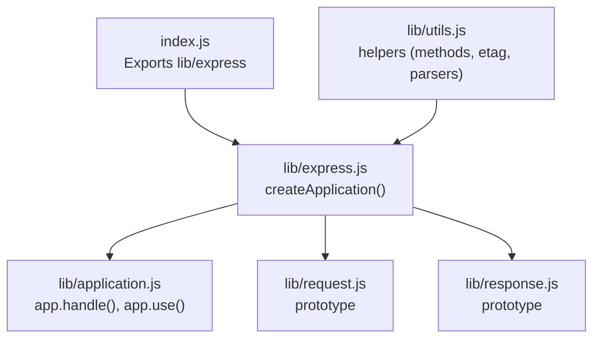
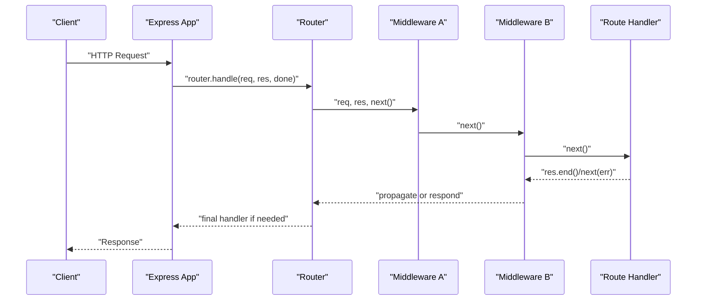
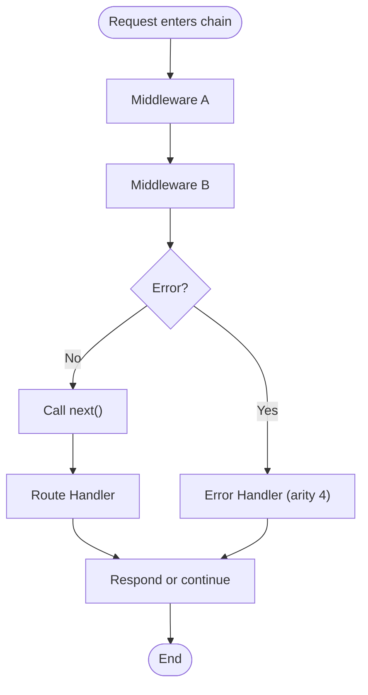
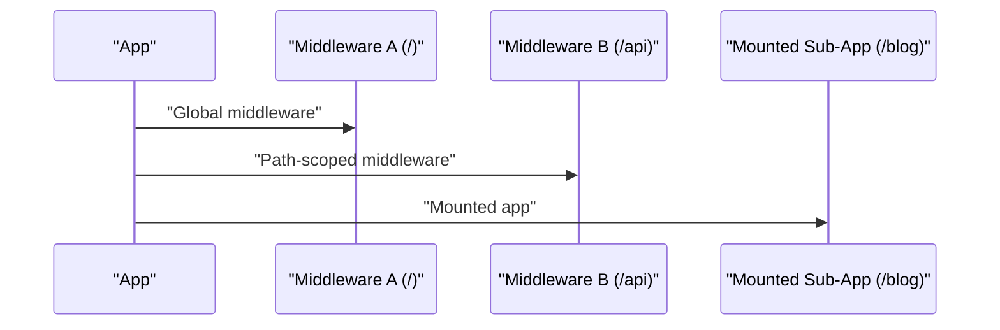
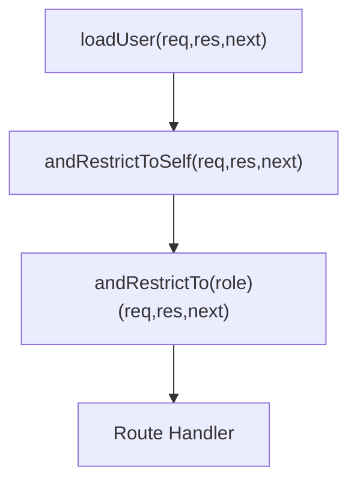
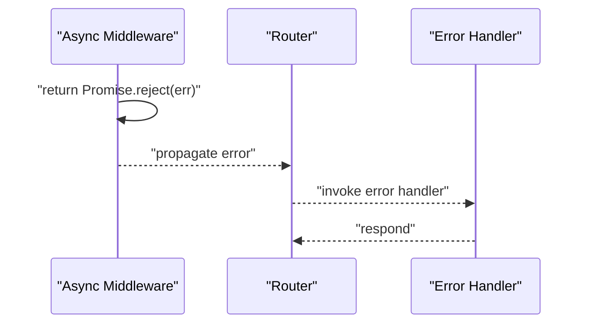
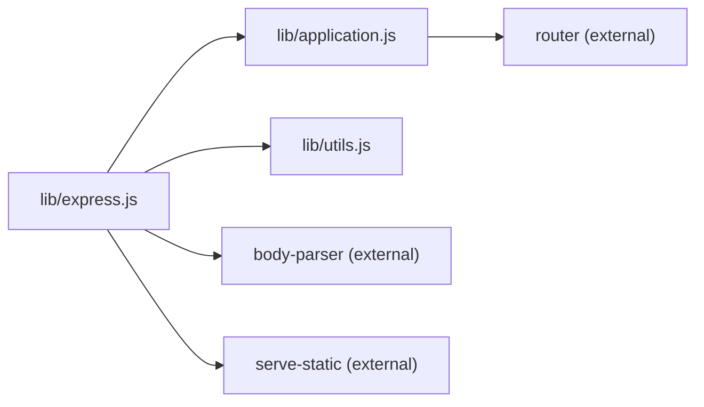

# Custom Middleware Development

<cite>
**Referenced Files in This Document**
- [index.js](file://index.js)
- [lib/express.js](file://lib/express.js)
- [lib/application.js](file://lib/application.js)
- [lib/utils.js](file://lib/utils.js)
- [examples/route-middleware/index.js](file://examples/route-middleware/index.js)
- [examples/error/index.js](file://examples/error/index.js)
- [examples/error-pages/index.js](file://examples/error-pages/index.js)
- [examples/web-service/index.js](file://examples/web-service/index.js)
- [examples/session/index.js](file://examples/session/index.js)
- [examples/cookies/index.js](file://examples/cookies/index.js)
- [examples/multi-router/index.js](file://examples/multi-router/index.js)
- [test/app.use.js](file://test/app.use.js)
- [test/app.router.js](file://test/app.router.js)
- [test/app.route.js](file://test/app.route.js)
- [test/middleware.basic.js](file://test/middleware.basic.js)
- [test/Router.js](file://test/Router.js)
- [test/app.param.js](file://test/app.param.js)
</cite>

## Table of Contents
1. [Introduction](#introduction)
2. [Project Structure](#project-structure)
3. [Core Components](#core-components)
4. [Architecture Overview](#architecture-overview)
5. [Detailed Component Analysis](#detailed-component-analysis)
6. [Dependency Analysis](#dependency-analysis)
7. [Performance Considerations](#performance-considerations)
8. [Troubleshooting Guide](#troubleshooting-guide)
9. [Conclusion](#conclusion)
10. [Appendices](#appendices)

## Introduction
This document explains how to develop custom middleware for Express.js applications. It covers middleware function signatures, the next() callback pattern, error propagation, execution order, conditional application, composition patterns, async/await and factory-style middleware, and integration with third-party middleware. Practical examples are drawn from the repository’s examples and tests to demonstrate real-world patterns for building robust middleware systems.

## Project Structure
Express exposes a small surface area via its main entry and wires into internal application, request, and response prototypes. Middleware registration and dispatch are handled by the application layer and router.

**Diagram sources**
- [index.js:1-12](file://index.js#L1-L12)
- [lib/express.js:36-56](file://lib/express.js#L36-L56)
- [lib/application.js:152-178](file://lib/application.js#L152-L178)
- [lib/utils.js:29](file://lib/utils.js#L29)

**Section sources**
- [index.js:1-12](file://index.js#L1-L12)
- [lib/express.js:36-56](file://lib/express.js#L36-L56)
- [lib/application.js:152-178](file://lib/application.js#L152-L178)
- [lib/utils.js:29](file://lib/utils.js#L29)

## Core Components
- Application dispatcher: The application receives incoming requests and delegates to the router, then to the final handler if no route matches.
- Middleware registration: app.use() accepts middleware functions and mounted applications, normalizing path and function lists.
- Router: Routes are isolated middleware stacks per path; middleware can be registered globally or per-route.

Key responsibilities:
- app.handle(): Sets up request/response prototypes, locals, and invokes router.handle().
- app.use(): Normalizes arguments, flattens arrays, and registers middleware on the internal router or mounts nested apps.
- Router: Manages middleware stacks and dispatch order.

**Section sources**
- [lib/application.js:152-178](file://lib/application.js#L152-L178)
- [lib/application.js:190-244](file://lib/application.js#L190-L244)
- [lib/application.js:256-258](file://lib/application.js#L256-L258)

## Architecture Overview
Express middleware forms a chain: app.use() registers middleware globally; routes define isolated stacks. Errors propagate through dedicated error-handling middleware with arity 4.

**Diagram sources**
- [lib/application.js:152-178](file://lib/application.js#L152-L178)
- [lib/application.js:190-244](file://lib/application.js#L190-L244)

## Detailed Component Analysis

### Middleware Function Signatures and next() Patterns
- Standard middleware: (req, res, next) where next() advances the chain.
- Error middleware: (err, req, res, next) with arity 4; Express routes errors only to these.
- next() can be invoked synchronously or asynchronously (e.g., inside callbacks or promises).
- Returning a Promise from middleware integrates with async/await; rejected promises propagate errors; resolved values are ignored.

Practical patterns:
- Synchronous next() progression through chained middleware.
- next(err) to short-circuit to error handlers.
- Throwing inside route handlers or calling next(err) inside async operations.

**Section sources**
- [examples/error/index.js:14-27](file://examples/error/index.js#L14-L27)
- [examples/error/index.js:34-42](file://examples/error/index.js#L34-L42)
- [test/middleware.basic.js:8-42](file://test/middleware.basic.js#L8-L42)
- [test/app.router.js:965-1095](file://test/app.router.js#L965-L1095)
- [test/app.route.js:65-197](file://test/app.route.js#L65-L197)

### Error Handling in Middleware Chains
- Error middleware must be defined with arity 4 and placed after route handlers.
- Errors thrown or passed to next(err) move control to the first error handler.
- Tests demonstrate promise rejections propagating to error handlers and resolved promises being ignored.

**Diagram sources**
- [examples/error/index.js:14-27](file://examples/error/index.js#L14-L27)
- [test/app.router.js:965-1095](file://test/app.router.js#L965-L1095)
- [test/Router.js:208-231](file://test/Router.js#L208-L231)

**Section sources**
- [examples/error/index.js:14-27](file://examples/error/index.js#L14-L27)
- [examples/error-pages/index.js:79-97](file://examples/error-pages/index.js#L79-L97)
- [examples/web-service/index.js:96-111](file://examples/web-service/index.js#L96-L111)
- [test/app.router.js:965-1095](file://test/app.router.js#L965-L1095)
- [test/Router.js:208-231](file://test/Router.js#L208-L231)

### Middleware Execution Order and Conditional Application
- app.use() registers middleware in the order provided; first match wins for path prefixes.
- Path-based mounting allows scoping middleware to subtrees.
- Conditional logic inside middleware (e.g., checking roles or authentication) can call next(err) to halt processing.

**Diagram sources**
- [lib/application.js:190-244](file://lib/application.js#L190-L244)
- [examples/multi-router/index.js:7-8](file://examples/multi-router/index.js#L7-L8)
- [test/app.use.js:63-84](file://test/app.use.js#L63-L84)

**Section sources**
- [lib/application.js:190-244](file://lib/application.js#L190-L244)
- [examples/multi-router/index.js:7-8](file://examples/multi-router/index.js#L7-L8)
- [test/app.use.js:63-84](file://test/app.use.js#L63-L84)

### Middleware Composition Patterns
- Compose middleware functions to build reusable units (e.g., loading a user, enforcing permissions).
- Factory functions produce middleware with parameters (e.g., role-based guards).
- Chaining multiple middleware enables layered concerns (authentication, authorization, logging).

**Diagram sources**
- [examples/route-middleware/index.js:25-58](file://examples/route-middleware/index.js#L25-L58)

**Section sources**
- [examples/route-middleware/index.js:25-58](file://examples/route-middleware/index.js#L25-L58)

### Async/Await Middleware and Promise Support
- Middleware can return a Promise. Rejected promises propagate errors; resolved values are ignored.
- Tests verify that promise rejections reach error handlers and that resolved promises do not continue execution.

**Diagram sources**
- [test/app.router.js:965-1095](file://test/app.router.js#L965-L1095)
- [test/app.route.js:65-197](file://test/app.route.js#L65-L197)

**Section sources**
- [test/app.router.js:965-1095](file://test/app.router.js#L965-L1095)
- [test/app.route.js:65-197](file://test/app.route.js#L65-L197)

### Middleware with Parameters and Factories
- Parameterized middleware can be created via higher-order functions that return middleware closures.
- Examples include role-based guards and scoped loaders.

**Section sources**
- [examples/route-middleware/index.js:50-58](file://examples/route-middleware/index.js#L50-L58)

### Third-Party Middleware Integration
- Body parsing, static serving, and session management are integrated via Express middleware exports.
- Cookie parsing and logging are demonstrated in examples.

**Section sources**
- [lib/express.js:77-82](file://lib/express.js#L77-L82)
- [examples/cookies/index.js:19](file://examples/cookies/index.js#L19)
- [examples/session/index.js:16-20](file://examples/session/index.js#L16-L20)

### Path-Based Middleware Application and Mounting
- app.use(path, ...middleware) scopes middleware to a path prefix.
- Mounted applications preserve request/response prototypes and emit mount events.

**Section sources**
- [lib/application.js:190-244](file://lib/application.js#L190-L244)
- [test/app.use.js:63-84](file://test/app.use.js#L63-L84)

### Middleware Scope and Inheritance
- Mounted sub-applications inherit parent settings and prototypes; children can override.
- Tests confirm that mounted apps receive the parent and that prototypes are restored after handling.

**Section sources**
- [lib/application.js:229-240](file://lib/application.js#L229-L240)
- [test/app.use.js:63-84](file://test/app.use.js#L63-L84)
- [test/app.request.js:52-115](file://test/app.request.js#L52-L115)
- [test/app.response.js:54-115](file://test/app.response.js#L54-L115)

### Parameter Middleware and Route-Level Behavior
- app.param() transforms route parameters once per request, enabling preloading and validation.
- Tests show parameter middleware runs before matching routes and only once per unique parameter value.

**Section sources**
- [test/app.param.js:60-86](file://test/app.param.js#L60-L86)
- [test/app.param.js:88-102](file://test/app.param.js#L88-L102)

## Dependency Analysis
Express middleware relies on a small set of core modules:
- Application dispatcher and router glue
- Utility helpers for HTTP methods, ETag generation, and query parsing
- Third-party middleware exposed via Express (bodyParser, serve-static)

**Diagram sources**
- [lib/express.js:15-21](file://lib/express.js#L15-L21)
- [lib/express.js:77-82](file://lib/express.js#L77-L82)
- [lib/application.js:26](file://lib/application.js#L26)
- [lib/utils.js:15-22](file://lib/utils.js#L15-L22)

**Section sources**
- [lib/express.js:15-21](file://lib/express.js#L15-L21)
- [lib/express.js:77-82](file://lib/express.js#L77-L82)
- [lib/application.js:26](file://lib/application.js#L26)
- [lib/utils.js:15-22](file://lib/utils.js#L15-L22)

## Performance Considerations
- Minimize synchronous work in hot paths; offload I/O to asynchronous operations.
- Prefer early exits (next(err) or immediate responses) to avoid unnecessary middleware execution.
- Use path-scoped middleware to reduce overhead for routes that do not need global middleware.
- Avoid heavy computations in middleware; cache where appropriate.
- Leverage built-in compression and caching options exposed by middleware (e.g., static file serving).

## Troubleshooting Guide
Common issues and remedies:
- Missing error handler: Ensure an arity-4 error handler is registered after routes.
- Incorrect order: Place error handlers after all routes and standard middleware.
- Promise pitfalls: Remember that resolved promises are ignored; only rejections propagate errors.
- Parameter middleware misuse: app.param() runs once per unique parameter value; ensure transformations are idempotent.
- Mounted app prototype restoration: When mounting apps, request/response prototypes are restored automatically; avoid mutating req/res outside middleware lifecycles.

**Section sources**
- [examples/error/index.js:14-27](file://examples/error/index.js#L14-L27)
- [examples/error-pages/index.js:79-97](file://examples/error-pages/index.js#L79-L97)
- [test/app.router.js:965-1095](file://test/app.router.js#L965-L1095)
- [test/app.param.js:60-86](file://test/app.param.js#L60-L86)

## Conclusion
Express middleware provides a powerful, composable mechanism for request processing. By understanding function signatures, next() semantics, error propagation, and composition patterns—plus integrating third-party middleware—you can build maintainable, scalable APIs. Use path-based scoping, parameter middleware, and mounted applications to structure concerns cleanly, and rely on tests and examples to validate behavior.

## Appendices

### Practical Example Index
- Authentication and authorization middleware: [examples/route-middleware/index.js:25-58](file://examples/route-middleware/index.js#L25-L58)
- Error handling middleware: [examples/error/index.js:14-27](file://examples/error/index.js#L14-L27), [examples/error-pages/index.js:79-97](file://examples/error-pages/index.js#L79-L97), [examples/web-service/index.js:96-111](file://examples/web-service/index.js#L96-L111)
- Third-party middleware: [examples/cookies/index.js](file://examples/cookies/index.js#L19), [examples/session/index.js:16-20](file://examples/session/index.js#L16-L20)
- Path-based and mounted middleware: [examples/multi-router/index.js:7-8](file://examples/multi-router/index.js#L7-L8), [lib/application.js:190-244](file://lib/application.js#L190-L244)