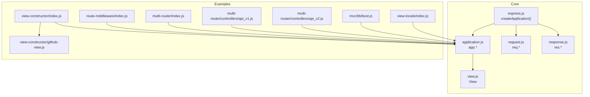
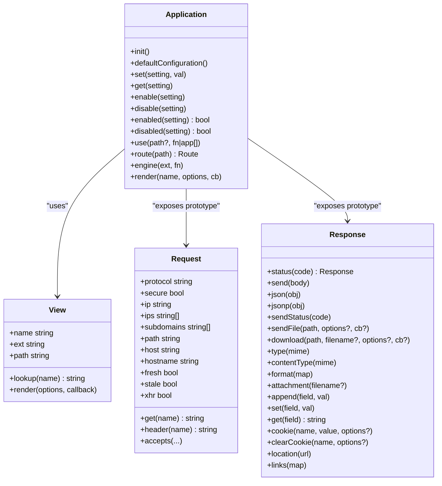
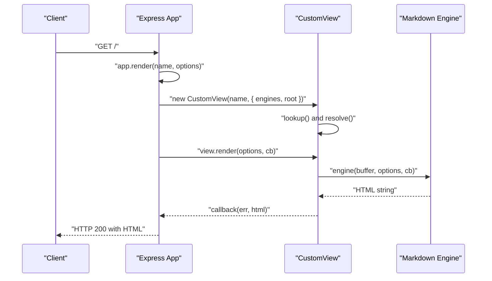
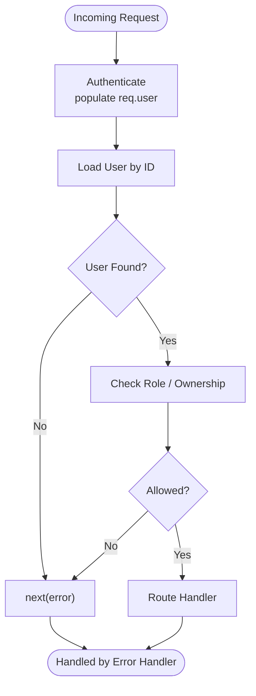
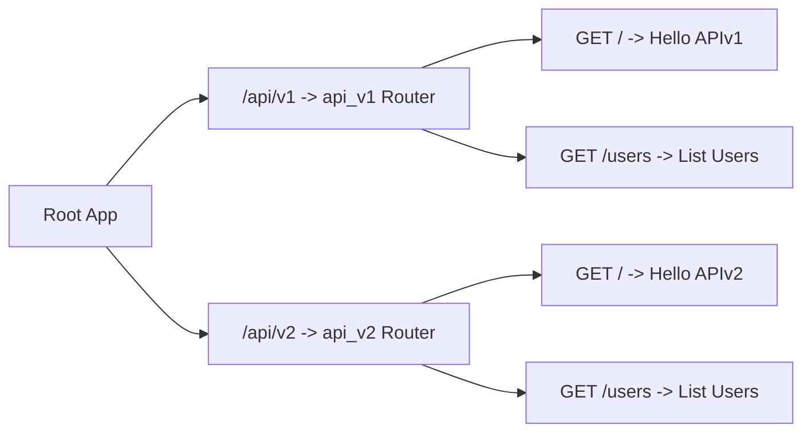
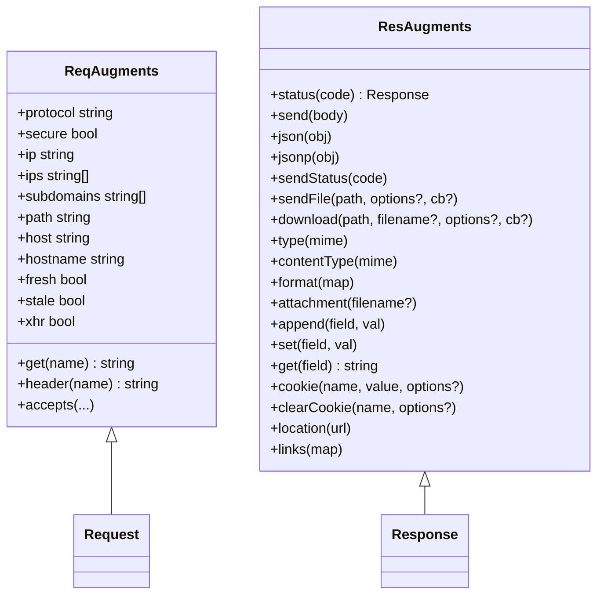
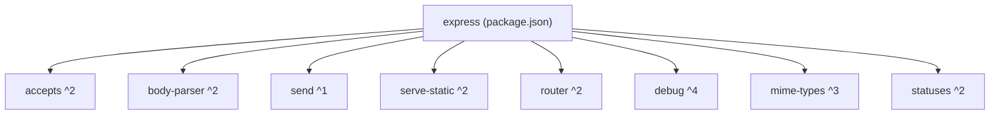

# Framework Extensions & Plugins

<cite>
**Referenced Files in This Document**
- [express.js](file://lib/express.js)
- [application.js](file://lib/application.js)
- [view.js](file://lib/view.js)
- [request.js](file://lib/request.js)
- [response.js](file://lib/response.js)
- [index.js](file://examples/view-constructor/index.js)
- [github-view.js](file://examples/view-constructor/github-view.js)
- [index.js](file://examples/route-middleware/index.js)
- [index.js](file://examples/multi-router/index.js)
- [api_v1.js](file://examples/multi-router/controllers/api_v1.js)
- [api_v2.js](file://examples/multi-router/controllers/api_v2.js)
- [index.js](file://examples/mvc/lib/boot.js)
- [index.js](file://examples/view-locals/index.js)
- [user.js](file://examples/view-locals/user.js)
- [package.json](file://package.json)
</cite>

## Table of Contents
1. [Introduction](#introduction)
2. [Project Structure](#project-structure)
3. [Core Components](#core-components)
4. [Architecture Overview](#architecture-overview)
5. [Detailed Component Analysis](#detailed-component-analysis)
6. [Dependency Analysis](#dependency-analysis)
7. [Performance Considerations](#performance-considerations)
8. [Troubleshooting Guide](#troubleshooting-guide)
9. [Conclusion](#conclusion)
10. [Appendices](#appendices)

## Introduction
This document explains how to extend the Express.js framework and build plugins. It focuses on:
- Custom view constructor implementation and template system customization
- View engine registration and engine mapping
- Plugin development patterns via middleware and routers
- Advanced routing techniques, custom router usage, and dynamic route generation
- Practical examples from the repository demonstrating view customization, middleware plugins, and framework augmentation
- Extension points for request/response enhancement, custom settings, and framework-wide behavior

## Project Structure
Express exposes a compact core with extension points:
- Core factory and exports: [express.js](file://lib/express.js)
- Application lifecycle, settings, middleware mounting, routing, and rendering: [application.js](file://lib/application.js)
- View resolution and rendering pipeline: [view.js](file://lib/view.js)
- Request and response prototypes with getters/setters and helpers: [request.js](file://lib/request.js), [response.js](file://lib/response.js)
- Examples demonstrating plugin-like patterns: view constructor overrides, middleware composition, multi-router mounting, MVC-style dynamic route bootstrapping, and view-local population

**Diagram sources**
- [express.js](file://lib/express.js)
- [application.js](file://lib/application.js)
- [view.js](file://lib/view.js)
- [request.js](file://lib/request.js)
- [response.js](file://lib/response.js)
- [index.js](file://examples/view-constructor/index.js)
- [github-view.js](file://examples/view-constructor/github-view.js)
- [index.js](file://examples/route-middleware/index.js)
- [index.js](file://examples/multi-router/index.js)
- [api_v1.js](file://examples/multi-router/controllers/api_v1.js)
- [api_v2.js](file://examples/multi-router/controllers/api_v2.js)
- [index.js](file://examples/mvc/lib/boot.js)
- [index.js](file://examples/view-locals/index.js)

**Section sources**
- [express.js](file://lib/express.js)
- [application.js](file://lib/application.js)
- [view.js](file://lib/view.js)
- [request.js](file://lib/request.js)
- [response.js](file://lib/response.js)

## Core Components
- Application initialization and settings: default configuration, settings registry, and mountpoint behavior
- Middleware mounting via app.use() proxying to the internal router
- Route definition and delegation to Router instances
- Template engine registration via app.engine() and view rendering via app.render() with a customizable View constructor
- Request and response prototypes augmented with getters, helpers, and HTTP helpers

Key extension points:
- Settings: app.set()/get()/enable()/disable() and derived settings (ETag, query parser, trust proxy)
- Middleware: app.use() supports Express apps, functions, arrays, and path prefixes
- Routing: app.get('/path', ...) delegates to Router; app.route() returns a Route instance
- Views: app.set('view', CustomView) and app.engine('ext', fn) customize rendering

**Section sources**
- [application.js](file://lib/application.js)
- [express.js](file://lib/express.js)

## Architecture Overview
Express composes an application object that:
- Inherits from EventEmitter
- Mixes in application prototype methods
- Exposes request and response prototypes bound to the app
- Initializes default settings and lazy-loads a Router
- Renders views using a View class and registered engines

**Diagram sources**
- [application.js](file://lib/application.js)
- [view.js](file://lib/view.js)
- [request.js](file://lib/request.js)
- [response.js](file://lib/response.js)

## Detailed Component Analysis

### Custom View Constructor and Template System Customization
Express allows replacing the default View class and registering custom template engines:
- Replace the View constructor: app.set('view', CustomView)
- Register engines: app.engine('ext', fn)
- Rendering flow: app.render() constructs a View, resolves path, and calls engine callback

Practical example:
- A custom View fetches content from a remote GitHub repository and renders it with a Markdown engine
- Demonstrates overriding app.set('views') and app.set('view')

**Diagram sources**
- [application.js](file://lib/application.js)
- [view.js](file://lib/view.js)
- [index.js](file://examples/view-constructor/index.js)
- [github-view.js](file://examples/view-constructor/github-view.js)

Implementation highlights:
- Custom View constructor receives name and options; sets path and engine
- Render method performs asynchronous fetch and delegates to engine
- app.engine() registers a callback that transforms content into HTML
- app.set('views') points to a repository path; app.set('view') selects the custom class

**Section sources**
- [application.js](file://lib/application.js)
- [view.js](file://lib/view.js)
- [index.js](file://examples/view-constructor/index.js)
- [github-view.js](file://examples/view-constructor/github-view.js)

### Plugin Development Patterns: Middleware Plugins
Express middleware plugins are functions with the signature (req, res, next). They can:
- Mutate req/res
- Perform authentication/authorization checks
- Short-circuit with errors to trigger error handlers
- Compose via arrays or chained calls

Patterns demonstrated:
- Authentication middleware that populates req.user
- Authorization middleware that checks roles and ownership
- Composition of middleware to enforce layered policies

**Diagram sources**
- [index.js](file://examples/route-middleware/index.js)

**Section sources**
- [index.js](file://examples/route-middleware/index.js)

### Advanced Routing Techniques and Dynamic Route Generation
Express supports:
- Mounting nested applications under path prefixes
- Using Router instances for modular APIs
- Generating routes dynamically from controller metadata

Examples:
- Multi-router mounting: app.use('/api/v1', routerV1) and app.use('/api/v2', routerV2)
- MVC bootstrapper: scans controllers, infers HTTP methods and URLs, mounts routes, and optionally applies before middleware

**Diagram sources**
- [index.js](file://examples/multi-router/index.js)
- [api_v1.js](file://examples/multi-router/controllers/api_v1.js)
- [api_v2.js](file://examples/multi-router/controllers/api_v2.js)

Dynamic bootstrapping example:
- Scans a controllers directory
- Infers CRUD routes from exported methods
- Applies optional before middleware
- Mounts each controller app under a prefixed path

**Section sources**
- [index.js](file://examples/multi-router/index.js)
- [api_v1.js](file://examples/multi-router/controllers/api_v1.js)
- [api_v2.js](file://examples/multi-router/controllers/api_v2.js)
- [index.js](file://examples/mvc/lib/boot.js)

### Request/Response Enhancement and Framework Augmentation
Express augments req/res prototypes to provide:
- Request helpers: accepts, protocol detection, IP resolution, subdomains, freshness, XHR detection
- Response helpers: status, send, json/jsonp, sendFile/download, content negotiation, cookies, redirects

These augmentations are available globally after creating an app and are driven by app settings (e.g., trust proxy, ETag, query parser).

**Diagram sources**
- [request.js](file://lib/request.js)
- [response.js](file://lib/response.js)

**Section sources**
- [request.js](file://lib/request.js)
- [response.js](file://lib/response.js)

### View Locals and Rendering Patterns
Express supports passing locals to res.render() and sharing data across routes:
- Populate res.locals in middleware for global availability
- Pass locals per-render to keep templates self-contained
- Compose middleware to compute counts, lists, and filters

Example demonstrates three approaches:
- Passing locals explicitly to res.render()
- Storing data on req for cross-route access
- Storing data on res.locals for convenience

**Section sources**
- [index.js](file://examples/view-locals/index.js)
- [user.js](file://examples/view-locals/user.js)

## Dependency Analysis
Express depends on external libraries for HTTP, parsing, content negotiation, cookies, and more. These influence plugin behavior indirectly (e.g., trust proxy, content types, status codes).

**Diagram sources**
- [package.json](file://package.json)

**Section sources**
- [package.json](file://package.json)

## Performance Considerations
- View caching: app.enable('view cache') caches View instances during render
- ETag and freshness: app.set('etag') and req.fresh/res.freshness reduce payload sizes
- Query parsing: app.set('query parser') controls parsing strategy
- Trust proxy: app.set('trust proxy') affects IP and protocol detection accuracy
- Middleware ordering: heavy middleware early reduces downstream overhead

[No sources needed since this section provides general guidance]

## Troubleshooting Guide
Common issues and remedies:
- Missing default engine or extension: ensure app.set('view engine') or provide explicit extension in res.render()
- Incorrect view path: verify app.set('views') and View lookup behavior
- Middleware not executed: confirm app.use() path and order; ensure next() is called or errors are handled
- Trust proxy misconfiguration: adjust app.set('trust proxy') and related settings to reflect deployment topology
- Content negotiation failures: ensure app.engine() registrations match extensions used

**Section sources**
- [application.js](file://lib/application.js)
- [view.js](file://lib/view.js)
- [request.js](file://lib/request.js)
- [response.js](file://lib/response.js)

## Conclusion
Express provides robust extension points:
- Customize rendering with a custom View and register engines
- Build middleware plugins that compose for authentication, authorization, and data preparation
- Modularize routing via Router and mount nested apps
- Dynamically generate routes from controller metadata
- Enhance req/res with built-in helpers and settings
These patterns enable scalable, maintainable plugins and frameworks that integrate cleanly with the Express ecosystem.

[No sources needed since this section summarizes without analyzing specific files]

## Appendices

### Practical Examples Index
- Custom view constructor and engine registration: [index.js](file://examples/view-constructor/index.js), [github-view.js](file://examples/view-constructor/github-view.js)
- Middleware plugin patterns: [index.js](file://examples/route-middleware/index.js)
- Multi-router mounting: [index.js](file://examples/multi-router/index.js), [api_v1.js](file://examples/multi-router/controllers/api_v1.js), [api_v2.js](file://examples/multi-router/controllers/api_v2.js)
- MVC-style dynamic bootstrapping: [index.js](file://examples/mvc/lib/boot.js)
- View locals and rendering patterns: [index.js](file://examples/view-locals/index.js), [user.js](file://examples/view-locals/user.js)

[No sources needed since this section indexes examples without analyzing specific files]