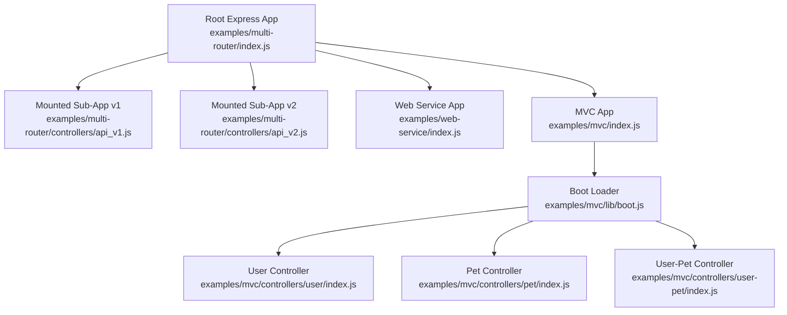
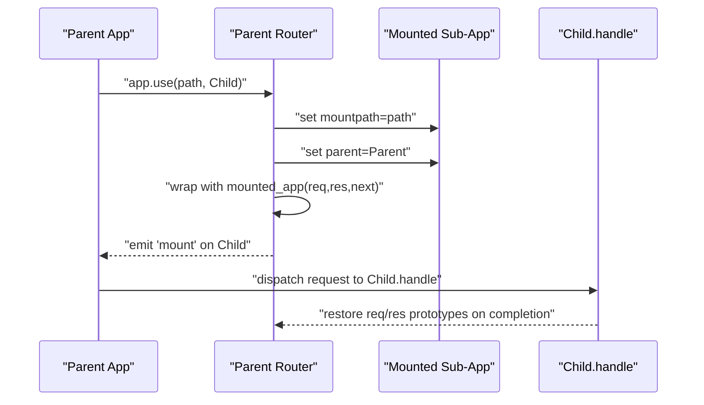
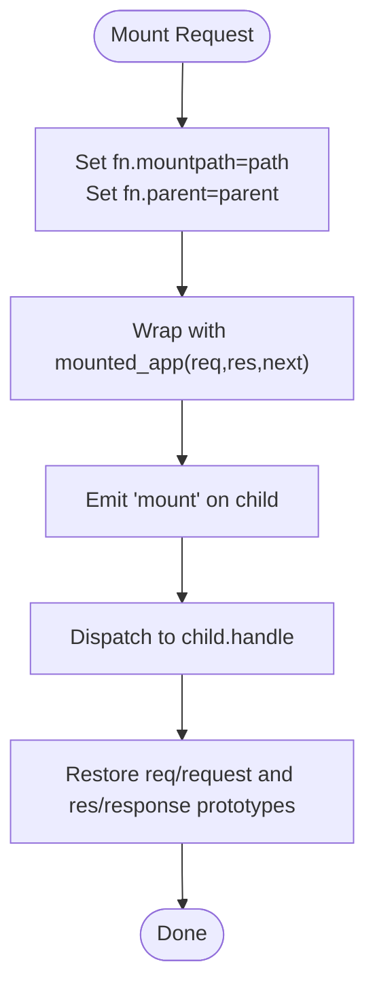
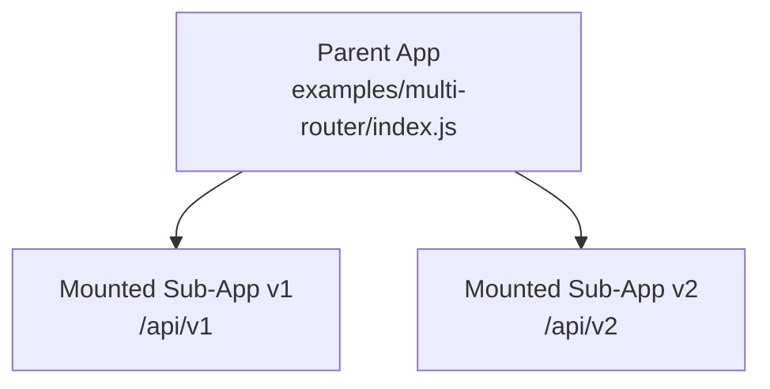
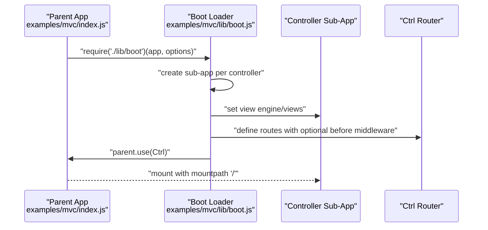
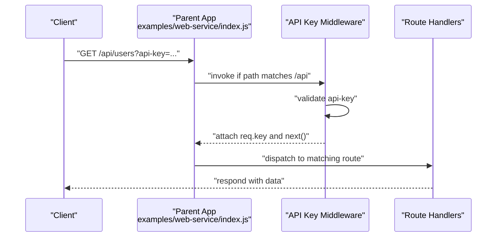
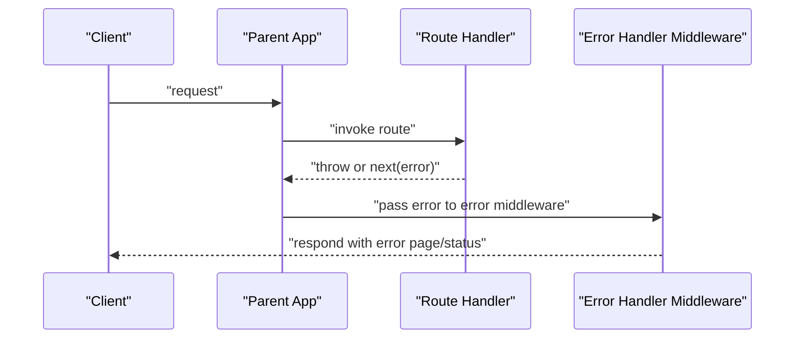
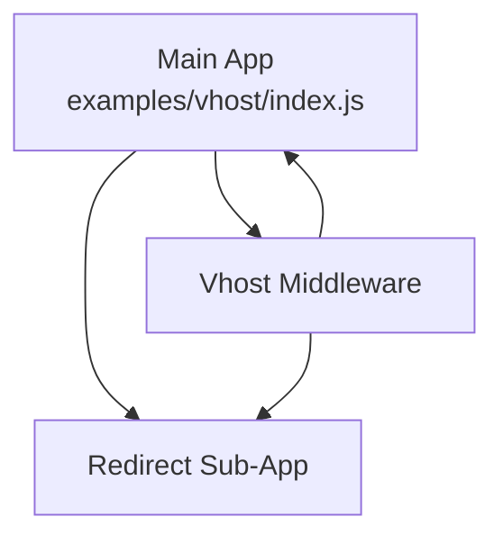
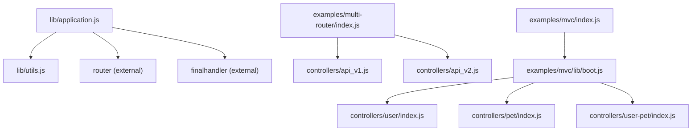

# Sub-Applications & Microservices

<cite>
**Referenced Files in This Document**
- [index.js](file://index.js)
- [lib/application.js](file://lib/application.js)
- [lib/utils.js](file://lib/utils.js)
- [examples/multi-router/index.js](file://examples/multi-router/index.js)
- [examples/web-service/index.js](file://examples/web-service/index.js)
- [examples/mvc/index.js](file://examples/mvc/index.js)
- [examples/mvc/lib/boot.js](file://examples/mvc/lib/boot.js)
- [examples/mvc/controllers/user/index.js](file://examples/mvc/controllers/user/index.js)
- [examples/mvc/controllers/pet/index.js](file://examples/mvc/controllers/pet/index.js)
- [examples/mvc/controllers/user-pet/index.js](file://examples/mvc/controllers/user-pet/index.js)
- [examples/error/index.js](file://examples/error/index.js)
- [examples/error-pages/index.js](file://examples/error-pages/index.js)
- [examples/route-middleware/index.js](file://examples/route-middleware/index.js)
- [examples/vhost/index.js](file://examples/vhost/index.js)
</cite>

## Table of Contents
1. [Introduction](#introduction)
2. [Project Structure](#project-structure)
3. [Core Components](#core-components)
4. [Architecture Overview](#architecture-overview)
5. [Detailed Component Analysis](#detailed-component-analysis)
6. [Dependency Analysis](#dependency-analysis)
7. [Performance Considerations](#performance-considerations)
8. [Troubleshooting Guide](#troubleshooting-guide)
9. [Conclusion](#conclusion)
10. [Appendices](#appendices)

## Introduction
This document explains how Express.js supports sub-applications and microservices patterns. It focuses on app.mountpath, parent-child application relationships, and mounted application inheritance. It also covers mounting with path prefixes, middleware inheritance, and configuration propagation. Practical examples demonstrate modular design, shared middleware, and configuration inheritance. Finally, it addresses sub-application lifecycle, error handling across mounted applications, and performance considerations for microservices architectures.

## Project Structure
Express exposes a minimal entry point that re-exports the internal express module. The core application logic resides in lib/application.js, which defines how applications are initialized, configured, mounted, and routed. The examples directory demonstrates real-world patterns for sub-applications and microservices.

**Diagram sources**
- [examples/multi-router/index.js:1-19](file://examples/multi-router/index.js#L1-L19)
- [examples/web-service/index.js:1-118](file://examples/web-service/index.js#L1-L118)
- [examples/mvc/index.js:1-96](file://examples/mvc/index.js#L1-L96)
- [examples/mvc/lib/boot.js:1-84](file://examples/mvc/lib/boot.js#L1-L84)
- [examples/mvc/controllers/user/index.js:1-42](file://examples/mvc/controllers/user/index.js#L1-L42)
- [examples/mvc/controllers/pet/index.js:1-32](file://examples/mvc/controllers/pet/index.js#L1-L32)
- [examples/mvc/controllers/user-pet/index.js:1-23](file://examples/mvc/controllers/user-pet/index.js#L1-L23)

**Section sources**
- [index.js:1-12](file://index.js#L1-L12)
- [lib/application.js:59-141](file://lib/application.js#L59-L141)

## Core Components
- Application initialization and default configuration: The application initializes settings, default middleware, and the router. It sets mountpath for top-level apps and emits a mount event to propagate configuration to mounted children.
- Mounting mechanism: app.use detects Express sub-apps and mounts them at a specified path, setting fn.mountpath and fn.parent, wrapping the handle call to restore request/response prototypes, and emitting a mount event.
- Path resolution: app.path computes the absolute pathname by concatenating parent paths with the current mountpath.
- Settings and configuration: app.set propagates compiled settings (e.g., etag, query parser, trust proxy) and triggers related behaviors.

Key behaviors:
- Mounted apps inherit parent’s request/response prototypes, engines, and settings.
- The top-level app starts with mountpath “/”.
- app.path recursively builds the effective path prefix.

**Section sources**
- [lib/application.js:59-141](file://lib/application.js#L59-L141)
- [lib/application.js:189-244](file://lib/application.js#L189-L244)
- [lib/application.js:398-403](file://lib/application.js#L398-L403)
- [lib/application.js:351-383](file://lib/application.js#L351-L383)

## Architecture Overview
Express sub-applications are mounted under a parent application with a path prefix. On mount, the child inherits configuration from the parent and participates in the unified request/response pipeline. Error handling and middleware ordering are preserved per-app while respecting mount boundaries.

**Diagram sources**
- [lib/application.js:189-244](file://lib/application.js#L189-L244)
- [lib/application.js:109-122](file://lib/application.js#L109-L122)

## Detailed Component Analysis

### Sub-Application Mounting and Inheritance
- Mounting with path prefixes: app.use(path, app) sets mountpath and parent, wraps dispatch to preserve request/response prototypes, and emits the mount event.
- Inheritance: On mount, the child inherits request/response prototypes, engines, and settings from the parent. This ensures consistent behavior across mounted apps.
- Path computation: app.path recursively concatenates mountpath values along the parent chain to compute the effective path.

**Diagram sources**
- [lib/application.js:189-244](file://lib/application.js#L189-L244)
- [lib/application.js:109-122](file://lib/application.js#L109-L122)

**Section sources**
- [lib/application.js:189-244](file://lib/application.js#L189-L244)
- [lib/application.js:109-122](file://lib/application.js#L109-L122)
- [lib/application.js:398-403](file://lib/application.js#L398-L403)

### Multi-Router Pattern (Versioned APIs)
This example mounts separate sub-apps under different path prefixes (/api/v1, /api/v2). It demonstrates how to decompose a monolithic API into versioned services while sharing a single parent app.

**Diagram sources**
- [examples/multi-router/index.js:7-8](file://examples/multi-router/index.js#L7-L8)

**Section sources**
- [examples/multi-router/index.js:1-19](file://examples/multi-router/index.js#L1-L19)

### Microservices with Shared Middleware and Configuration
The MVC example composes multiple controllers as sub-apps via a boot loader. Each controller defines routes and optional before middleware. The boot loader creates a sub-app per controller, sets view-related settings, and mounts it under the parent. This pattern enables service decomposition with shared middleware and configuration.

**Diagram sources**
- [examples/mvc/index.js:75-77](file://examples/mvc/index.js#L75-L77)
- [examples/mvc/lib/boot.js:21-82](file://examples/mvc/lib/boot.js#L21-L82)

**Section sources**
- [examples/mvc/index.js:1-96](file://examples/mvc/index.js#L1-L96)
- [examples/mvc/lib/boot.js:1-84](file://examples/mvc/lib/boot.js#L1-L84)
- [examples/mvc/controllers/user/index.js:1-42](file://examples/mvc/controllers/user/index.js#L1-L42)
- [examples/mvc/controllers/pet/index.js:1-32](file://examples/mvc/controllers/pet/index.js#L1-L32)
- [examples/mvc/controllers/user-pet/index.js:1-23](file://examples/mvc/controllers/user-pet/index.js#L1-L23)

### Web Service Pattern with API Keys
This example mounts middleware under a path prefix to enforce API key validation. It demonstrates how to scope middleware to a subset of routes and propagate validated data to downstream routes.

**Diagram sources**
- [examples/web-service/index.js:30-42](file://examples/web-service/index.js#L30-L42)
- [examples/web-service/index.js:75-91](file://examples/web-service/index.js#L75-L91)

**Section sources**
- [examples/web-service/index.js:1-118](file://examples/web-service/index.js#L1-L118)

### Error Handling Across Mounted Apps
Express supports centralized and per-app error handling. Errors bubble up through the middleware chain and can be handled by dedicated error-handling middleware. Examples illustrate both centralized error pages and per-route error generation.

**Diagram sources**
- [examples/error/index.js:20-27](file://examples/error/index.js#L20-L27)
- [examples/error-pages/index.js:91-97](file://examples/error-pages/index.js#L91-L97)

**Section sources**
- [examples/error/index.js:1-54](file://examples/error/index.js#L1-L54)
- [examples/error-pages/index.js:1-104](file://examples/error-pages/index.js#L1-L104)

### Virtual Host and Domain Decomposition
The vhost example shows how to route traffic to different sub-apps based on hostnames. This pattern mirrors microservices by domain or subdomain.

**Diagram sources**
- [examples/vhost/index.js:44-47](file://examples/vhost/index.js#L44-L47)

**Section sources**
- [examples/vhost/index.js:1-54](file://examples/vhost/index.js#L1-L54)

## Dependency Analysis
- Internal dependencies: The application module depends on router, finalhandler, and utils for configuration compilation and helpers.
- Mount-time dependencies: Mounted apps inherit prototypes and settings from the parent, ensuring consistent behavior across the hierarchy.
- Example dependencies: The MVC and multi-router examples demonstrate composition patterns using sub-apps and path prefixes.

**Diagram sources**
- [lib/application.js:16-26](file://lib/application.js#L16-L26)
- [lib/utils.js:15-22](file://lib/utils.js#L15-L22)
- [examples/multi-router/index.js:7-8](file://examples/multi-router/index.js#L7-L8)
- [examples/mvc/index.js:76-76](file://examples/mvc/index.js#L76-L76)
- [examples/mvc/lib/boot.js:18-18](file://examples/mvc/lib/boot.js#L18-L18)

**Section sources**
- [lib/application.js:16-26](file://lib/application.js#L16-L26)
- [lib/utils.js:15-22](file://lib/utils.js#L15-L22)
- [examples/multi-router/index.js:1-19](file://examples/multi-router/index.js#L1-L19)
- [examples/mvc/index.js:1-96](file://examples/mvc/index.js#L1-L96)
- [examples/mvc/lib/boot.js:1-84](file://examples/mvc/lib/boot.js#L1-L84)

## Performance Considerations
- Minimize deep mount hierarchies: Each additional mount adds a wrapper and potential prototype restoration overhead.
- Prefer scoped middleware: Mount middleware under precise path prefixes to avoid unnecessary processing for unrelated routes.
- Reuse compiled settings: Leverage app.set to configure parsers and trust proxies once; mounted apps inherit these compiled settings.
- Centralize static assets: Serve static files at the parent level to reduce duplication across sub-apps.
- Keep error handlers close to routes: Place error handlers immediately after routes to short-circuit unnecessary middleware traversal.

## Troubleshooting Guide
- Mounted app not receiving middleware: Verify the mount path matches the incoming request path and that the middleware is attached before the mount.
- Incorrect req/res prototypes: Ensure the mounted wrapper restores req/request and res/response prototypes after the child completes.
- Settings not inherited: Confirm the child app is mounted after parent defaultConfiguration runs and that settings are applied before mount.
- 404s and 500s: Use dedicated 404 and error-handling middleware placed after all routes and sub-apps.

**Section sources**
- [lib/application.js:189-244](file://lib/application.js#L189-L244)
- [examples/error-pages/index.js:63-77](file://examples/error-pages/index.js#L63-L77)
- [examples/error/index.js:47-47](file://examples/error/index.js#L47-L47)

## Conclusion
Express sub-applications provide a powerful foundation for microservices architectures. By leveraging mountpath, parent-child relationships, and configuration inheritance, teams can decompose systems into cohesive services while preserving shared middleware and settings. The examples demonstrate practical patterns for versioned APIs, MVC-style controllers, scoped middleware, and virtual-host routing. Proper error handling and performance-conscious design ensure robust and scalable microservices.

## Appendices
- Practical patterns:
  - Versioned APIs: Mount separate sub-apps under distinct path prefixes.
  - MVC decomposition: Use a boot loader to generate sub-apps per controller with shared middleware.
  - Scoped middleware: Attach middleware under a path prefix to limit scope.
  - Virtual hosts: Route domains/subdomains to different sub-apps for domain-driven decomposition.

[No sources needed since this section provides general guidance]