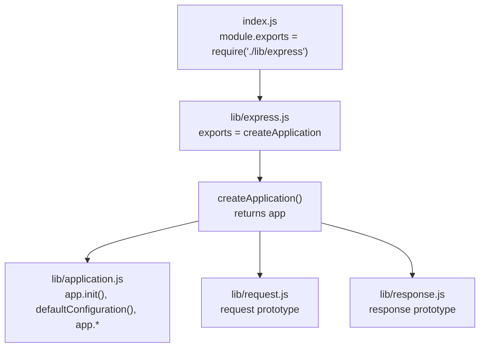
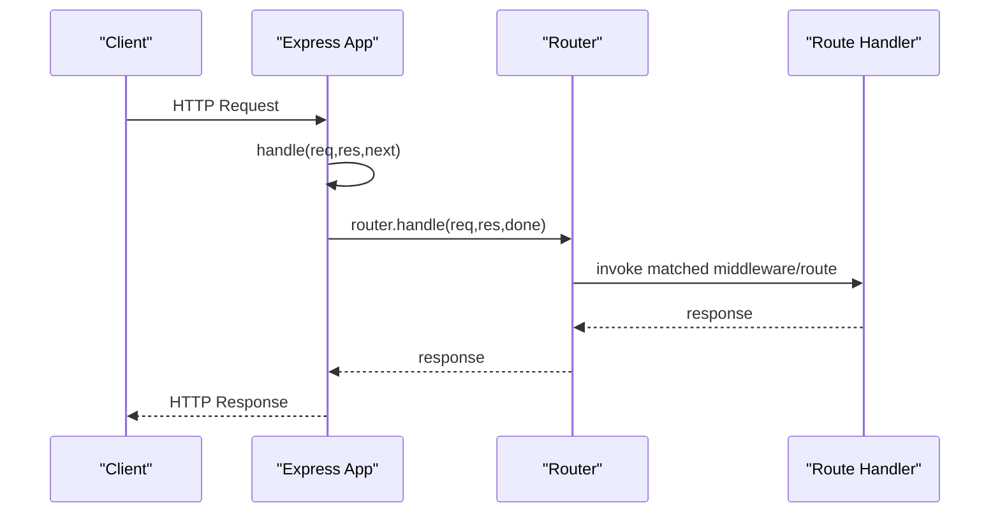
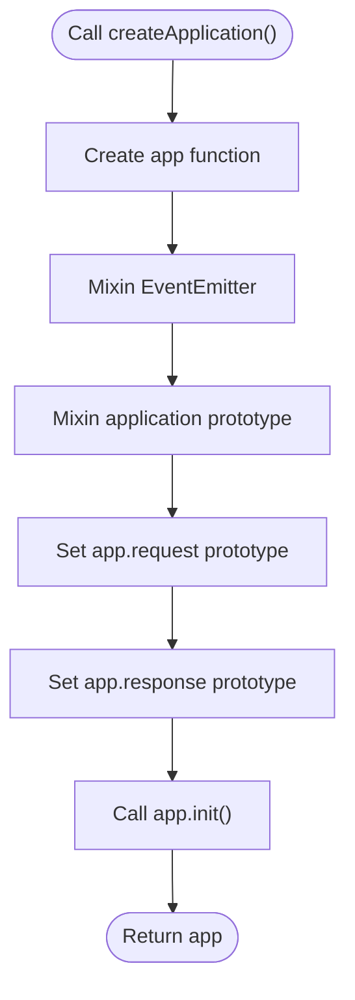
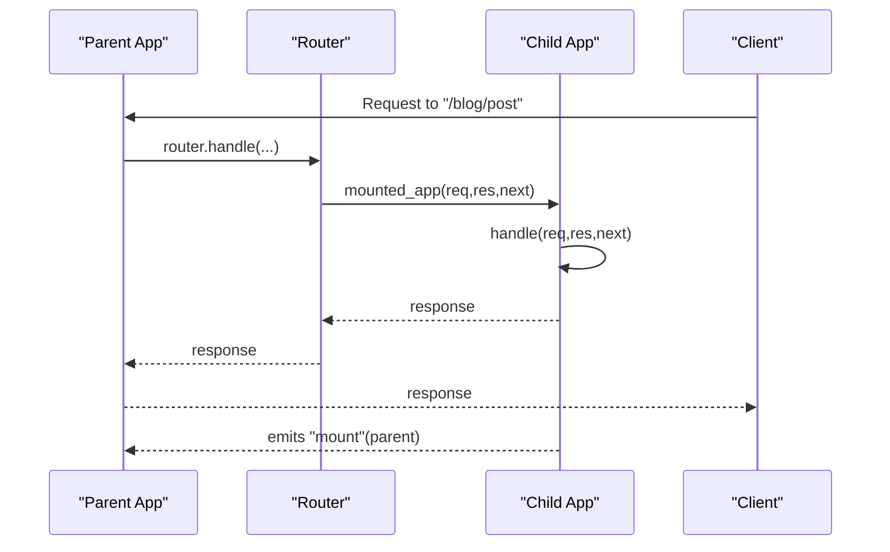
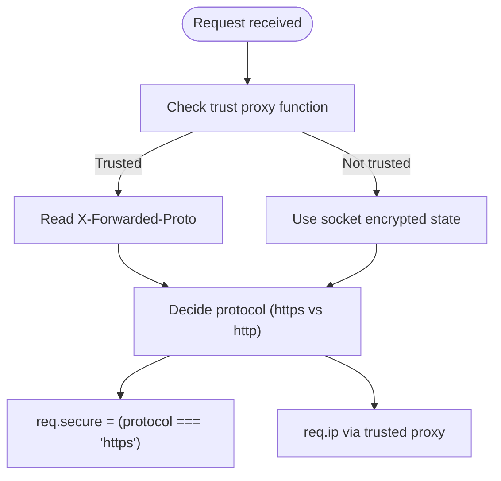
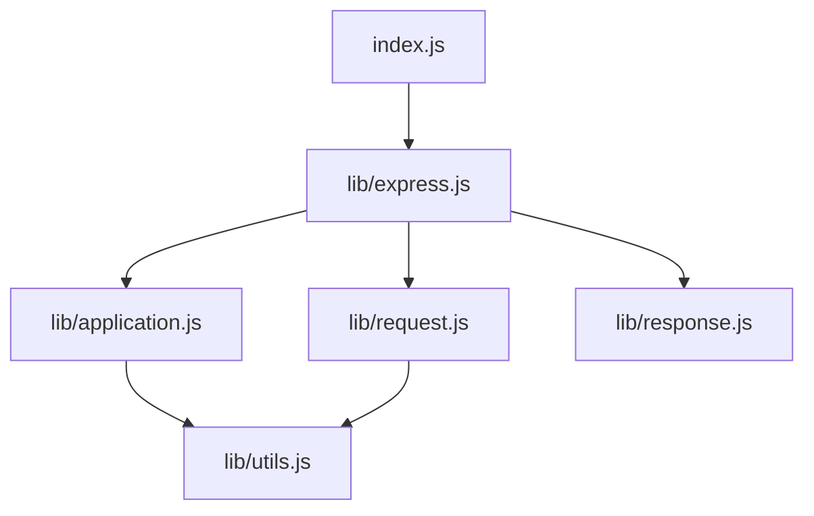

# Application Configuration

<cite>
**Referenced Files in This Document**
- [index.js](file://index.js)
- [express.js](file://lib/express.js)
- [application.js](file://lib/application.js)
- [utils.js](file://lib/utils.js)
- [request.js](file://lib/request.js)
- [hello-world/index.js](file://examples/hello-world/index.js)
- [mvc/index.js](file://examples/mvc/index.js)
- [vhost/index.js](file://examples/vhost/index.js)
- [static-files/index.js](file://examples/static-files/index.js)
- [session/index.js](file://examples/session/index.js)
- [app.js](file://test/app.js)
- [app.use.js](file://test/app.use.js)
- [config.js](file://test/config.js)
- [req.secure.js](file://test/req.secure.js)
- [req.ip.js](file://test/req.ip.js)
</cite>

## Table of Contents
1. [Introduction](#introduction)
2. [Project Structure](#project-structure)
3. [Core Components](#core-components)
4. [Architecture Overview](#architecture-overview)
5. [Detailed Component Analysis](#detailed-component-analysis)
6. [Dependency Analysis](#dependency-analysis)
7. [Performance Considerations](#performance-considerations)
8. [Troubleshooting Guide](#troubleshooting-guide)
9. [Conclusion](#conclusion)
10. [Appendices](#appendices)

## Introduction
This document explains how to configure and customize Express.js applications comprehensively. It covers the createApplication() factory function, application instance creation patterns, settings management via app.set(), app.get(), app.enabled(), environment detection and configuration strategies, mounting sub-applications and virtual host setups, performance tuning, security settings, debugging configurations, and practical deployment templates. It also clarifies how configuration settings influence middleware behavior and outlines best practices for production deployments.

## Project Structure
Express exposes a minimal entry point that delegates to the internal library. The application instance is created by the factory exported from the library and augmented with request/response prototypes and default middleware during initialization.

**Diagram sources**
- [index.js:11](file://index.js#L11)
- [express.js:27](file://lib/express.js#L27)
- [express.js:36](file://lib/express.js#L36)
- [application.js:59](file://lib/application.js#L59)

**Section sources**
- [index.js:11](file://index.js#L11)
- [express.js:27](file://lib/express.js#L27)
- [express.js:36](file://lib/express.js#L36)

## Core Components
- Factory function: createApplication() constructs the application function, mixes in EventEmitter capabilities, and sets up request/response prototypes. It then calls app.init() to initialize settings, router, and defaults.
- Application prototype: Provides settings management (set/get/enabled), default configuration, middleware mounting (use), route delegation, rendering, and listening.
- Utilities: compileETag, compileQueryParser, and compileTrust convert string/boolean/number values into functions used by the app and request helpers.

Key behaviors:
- Settings lifecycle: app.set() stores values and triggers side effects (e.g., compiling functions for etag, query parser, trust proxy).
- Environment defaults: defaultConfiguration() sets sensible defaults based on NODE_ENV and enables/disables features accordingly.
- Mounting: app.use() supports middleware functions, arrays, and nested arrays, and can mount other Express apps at a path, emitting a “mount” event.

**Section sources**
- [express.js:36](file://lib/express.js#L36)
- [express.js:41](file://lib/express.js#L41)
- [application.js:59](file://lib/application.js#L59)
- [application.js:90](file://lib/application.js#L90)
- [application.js:351](file://lib/application.js#L351)
- [application.js:420](file://lib/application.js#L420)
- [application.js:190](file://lib/application.js#L190)
- [utils.js:130](file://lib/utils.js#L130)
- [utils.js:162](file://lib/utils.js#L162)
- [utils.js:194](file://lib/utils.js#L194)

## Architecture Overview
The application instance is a function that delegates to an internal router. During initialization, default settings and middleware are applied. Request and response prototypes are attached to each request/res, enabling helpers like req.secure and req.ip to consult trust proxy configuration.

**Diagram sources**
- [application.js:152](file://lib/application.js#L152)
- [application.js:177](file://lib/application.js#L177)

**Section sources**
- [application.js:152](file://lib/application.js#L152)
- [application.js:177](file://lib/application.js#L177)

## Detailed Component Analysis

### Factory Function: createApplication()
- Purpose: Creates an application function with EventEmitter capabilities and request/response prototypes. Calls app.init() to set up defaults and router.
- Behavior: Mixes in prototypes, creates request/response objects bound to the app, and initializes the app.

**Diagram sources**
- [express.js:36](file://lib/express.js#L36)
- [express.js:41](file://lib/express.js#L41)
- [express.js:45](file://lib/express.js#L45)
- [express.js:50](file://lib/express.js#L50)
- [express.js:54](file://lib/express.js#L54)

**Section sources**
- [express.js:36](file://lib/express.js#L36)
- [express.js:41](file://lib/express.js#L41)

### Settings Management: app.set(), app.get(), app.enabled()
- app.set(setting, value): Stores a setting and triggers side effects. For specific keys, it compiles helper functions (ETag, query parser, trust proxy).
- app.get(setting): Retrieves a setting’s value.
- app.enabled(setting)/app.disabled(setting): Boolean checks for truthy/falsy settings.
- app.enable/disable: Convenience setters to true/false.

Practical usage patterns:
- Configure template engine and views directory.
- Toggle features like case-sensitive routing and strict routing.
- Control trust proxy behavior and query parsing strategy.

Environment defaults:
- NODE_ENV defaults to development if unset.
- Production enables view caching; development disables it.

**Section sources**
- [application.js:351](file://lib/application.js#L351)
- [application.js:420](file://lib/application.js#L420)
- [application.js:439](file://lib/application.js#L439)
- [application.js:451](file://lib/application.js#L451)
- [application.js:463](file://lib/application.js#L463)
- [application.js:90](file://lib/application.js#L90)
- [application.js:138](file://lib/application.js#L138)
- [utils.js:130](file://lib/utils.js#L130)
- [utils.js:162](file://lib/utils.js#L162)
- [utils.js:194](file://lib/utils.js#L194)

### Environment Detection and Configuration Strategies
- Default environment: If NODE_ENV is not set, defaults to development.
- Production behavior: Enables view cache automatically.
- Testing behavior: Error logging suppressed except in non-test environments.

Recommended patterns:
- Keep environment-specific configuration in separate modules and merge with app.set().
- Use environment variables for toggles (e.g., trust proxy, query parser).
- Apply per-environment middleware (e.g., logging, compression) conditionally.

**Section sources**
- [application.js:90](file://lib/application.js#L90)
- [application.js:138](file://lib/application.js#L138)
- [app.js:74](file://test/app.js#L74)
- [app.js:90](file://test/app.js#L90)
- [app.js:106](file://test/app.js#L106)

### Application Mounting and Virtual Host Configurations
- Sub-app mounting: app.use(subApp) mounts another Express app at root; app.use('/path', subApp) mounts at a path. Emits a “mount” event on the child app.
- Dynamic routes: Mounting supports dynamic segments; middleware can be interleaved with mounted apps.
- Virtual hosts: Use vhost middleware to route subdomains to different apps.

**Diagram sources**
- [application.js:225](file://lib/application.js#L225)
- [application.js:230](file://lib/application.js#L230)
- [application.js:240](file://lib/application.js#L240)

**Section sources**
- [app.use.js:21](file://test/app.use.js#L21)
- [app.use.js:37](file://test/app.use.js#L37)
- [app.use.js:106](file://test/app.use.js#L106)
- [vhost/index.js:44](file://examples/vhost/index.js#L44)

### Security Settings and Trust Proxy
- Trust proxy: Configure trust proxy to correctly derive req.protocol, req.secure, and req.ip behind proxies/load balancers.
- Supported forms: boolean, number (hop count), comma-separated IPs, or a custom function.
- Effects: When enabled, X-Forwarded-* headers are respected; otherwise, socket info is used.

**Diagram sources**
- [utils.js:194](file://lib/utils.js#L194)
- [request.js:326](file://lib/request.js#L326)
- [request.js:340](file://lib/request.js#L340)
- [req.secure.js:38](file://test/req.secure.js#L38)
- [req.ip.js:89](file://test/req.ip.js#L89)

**Section sources**
- [utils.js:194](file://lib/utils.js#L194)
- [request.js:326](file://lib/request.js#L326)
- [request.js:340](file://lib/request.js#L340)
- [req.secure.js:38](file://test/req.secure.js#L38)
- [req.ip.js](file://test/req.ip.js#L89)

### Performance Tuning Options
- ETag generation: Choose weak or strong ETag strategies via app.set('etag').
- Query parsing: Select simple or extended query parser via app.set('query parser').
- View caching: Enabled in production by default; disable in development for faster iteration.
- Static assets: Serve with express.static and consider CDN or reverse proxy for production.

**Section sources**
- [application.js:95](file://lib/application.js#L95)
- [application.js:97](file://lib/application.js#L97)
- [application.js:139](file://lib/application.js#L139)
- [static-files/index.js:22](file://examples/static-files/index.js#L22)

### Debugging and Logging Configurations
- Debug namespace: Application logs with a dedicated debug namespace for internal operations.
- Error handling: defaultConfiguration() sets env and onerror handler for finalhandler.
- Test environment: Suppresses noisy logs in tests.

**Section sources**
- [application.js:17](file://lib/application.js#L17)
- [application.js:154](file://lib/application.js#L154)
- [app.js:106](file://test/app.js#L106)

### Practical Configuration Patterns by Deployment Scenario
- Minimal server: Create app via express(), register routes, and listen.
- MVC-style app: Set view engine and views, add middleware (logging, static, sessions, parsers), expose locals, and load controllers.
- Multi-domain hosting: Use vhost to route *.example.com and example.com to different apps.
- Static asset serving: Mount multiple static directories or prefix paths for assets.

**Section sources**
- [hello-world/index.js:5](file://examples/hello-world/index.js#L5)
- [mvc/index.js:17](file://examples/mvc/index.js#L17)
- [mvc/index.js:37](file://examples/mvc/index.js#L37)
- [vhost/index.js:46](file://examples/vhost/index.js#L46)
- [static-files/index.js:22](file://examples/static-files/index.js#L22)

### Relationship Between Configuration and Middleware Behavior
- Routing sensitivity and strictness: Controlled by settings that influence router creation.
- Trust proxy: Affects req.secure and req.ip resolution, changing middleware behavior behind proxies.
- Query parsing: Changes how req.query is constructed, impacting downstream route handlers.
- ETag: Influences caching headers and conditional requests.

**Section sources**
- [application.js:69](file://lib/application.js#L69)
- [application.js:75](file://lib/application.js#L75)
- [utils.js:130](file://lib/utils.js#L130)
- [utils.js:162](file://lib/utils.js#L162)
- [request.js:326](file://lib/request.js#L326)

### Common Pitfalls and Best Practices for Production
Common pitfalls:
- Forgetting to enable trust proxy behind load balancers; leads to incorrect req.secure and req.ip.
- Using development defaults in production (e.g., disabling view cache).
- Not validating middleware order; essential middleware should precede route handlers.

Best practices:
- Centralize configuration per environment and inject into app.set().
- Prefer explicit trust proxy configuration (IP list or hop count) over boolean.
- Use extended query parser only when necessary; simple is safer and faster.
- Enable production-friendly settings (view cache, appropriate logging, and error pages).

**Section sources**
- [req.secure.js:38](file://test/req.secure.js#L38)
- [app.js:90](file://test/app.js#L90)
- [config.js:144](file://test/config.js#L144)

### Templates and Boilerplate Configurations
- Minimal app: Create app with express(), define routes, and listen.
- MVC app: Configure view engine and views, add logging, static files, sessions, parsers, and controllers.
- Session-backed app: Initialize express-session with secure, production-safe options.
- Static site: Mount multiple static directories and optionally prefix paths.

**Section sources**
- [hello-world/index.js:5](file://examples/hello-world/index.js#L5)
- [mvc/index.js:17](file://examples/mvc/index.js#L17)
- [mvc/index.js:37](file://examples/mvc/index.js#L37)
- [session/index.js](file://examples/session/index.js#L13)
- [static-files/index.js:22](file://examples/static-files/index.js#L22)

## Dependency Analysis
Express composes the application from modular pieces: the factory, application prototype, request/response prototypes, and utilities for configuration.

**Diagram sources**
- [index.js:11](file://index.js#L11)
- [express.js:18](file://lib/express.js#L18)
- [application.js:16](file://lib/application.js#L16)
- [request.js:1](file://lib/request.js#L1)

**Section sources**
- [index.js:11](file://index.js#L11)
- [express.js:18](file://lib/express.js#L18)
- [application.js:16](file://lib/application.js#L16)
- [request.js:1](file://lib/request.js#L1)

## Performance Considerations
- Prefer simple query parser in most cases; switch to extended only when needed.
- Use weak ETags for dynamic content to reduce cache churn.
- Enable view cache in production to avoid repeated view compilation.
- Offload static assets to CDN or reverse proxy to reduce Node.js overhead.

[No sources needed since this section provides general guidance]

## Troubleshooting Guide
- Requests appear insecure behind a proxy:
  - Ensure trust proxy is configured appropriately; verify X-Forwarded-Proto handling.
- Incorrect client IP reported:
  - Verify trust proxy settings and whether the proxy is trusted.
- Unexpected query parameters:
  - Confirm query parser setting and choose simple vs extended based on your needs.
- Tests failing due to logging noise:
  - NODE_ENV=test suppresses error logs in Express internals.

**Section sources**
- [req.secure.js:38](file://test/req.secure.js#L38)
- [req.ip.js:89](file://test/req.ip.js#L89)
- [config.js:144](file://test/config.js#L144)
- [app.js:106](file://test/app.js#L106)

## Conclusion
Express application configuration centers on the createApplication() factory and the application prototype’s settings system. Correctly managing environment detection, trust proxy, query parsing, and ETag generation ensures predictable middleware behavior. Mounting sub-applications and virtual hosts allows flexible service composition. Adopting production-safe defaults and avoiding common pitfalls yields robust, maintainable deployments.

[No sources needed since this section summarizes without analyzing specific files]

## Appendices
- Example references for quick start:
  - Minimal server: [hello-world/index.js](file://examples/hello-world/index.js#L5)
  - MVC app: [mvc/index.js](file://examples/mvc/index.js#L17)
  - Static serving: [static-files/index.js](file://examples/static-files/index.js#L22)
  - Sessions: [session/index.js](file://examples/session/index.js#L13)
  - Virtual hosts: [vhost/index.js](file://examples/vhost/index.js#L46)

[No sources needed since this section lists references without analyzing specific files]