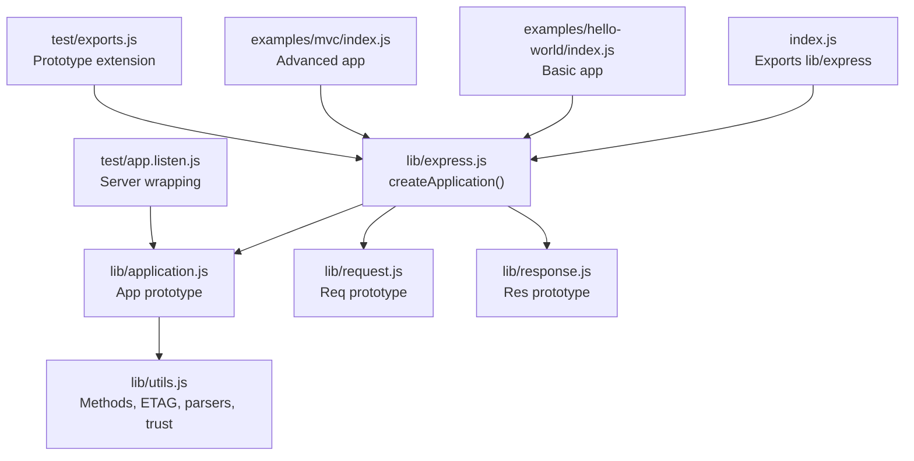
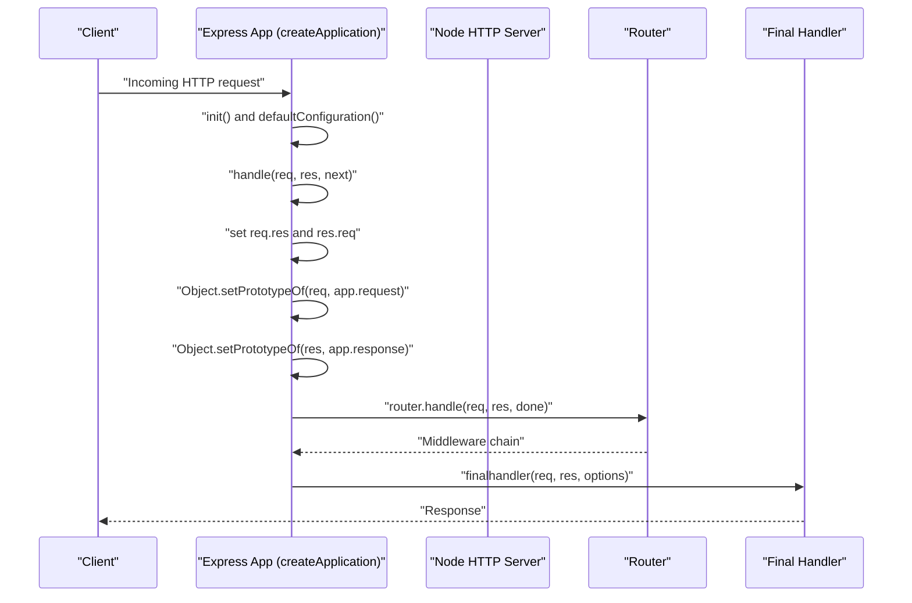
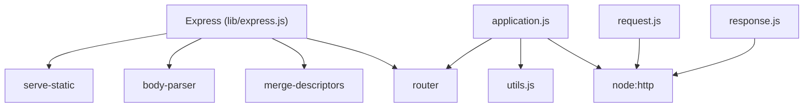

# Application Architecture

<cite>
**Referenced Files in This Document**
- [index.js](file://index.js)
- [express.js](file://lib/express.js)
- [application.js](file://lib/application.js)
- [request.js](file://lib/request.js)
- [response.js](file://lib/response.js)
- [utils.js](file://lib/utils.js)
- [package.json](file://package.json)
- [hello-world/index.js](file://examples/hello-world/index.js)
- [mvc/index.js](file://examples/mvc/index.js)
- [app.listen.js](file://test/app.listen.js)
- [exports.js](file://test/exports.js)
</cite>

## Table of Contents
1. [Introduction](#introduction)
2. [Project Structure](#project-structure)
3. [Core Components](#core-components)
4. [Architecture Overview](#architecture-overview)
5. [Detailed Component Analysis](#detailed-component-analysis)
6. [Dependency Analysis](#dependency-analysis)
7. [Performance Considerations](#performance-considerations)
8. [Troubleshooting Guide](#troubleshooting-guide)
9. [Conclusion](#conclusion)

## Introduction
This document explains the Express.js application architecture with a focus on the factory pattern implementation and the core application structure. It details how the createApplication() function produces Express instances with enhanced prototypes, how application methods are mixed into request and response objects, and how EventEmitter integration enables event-driven behavior. It also covers the relationship between the Express factory and Node.js HTTP server creation, the application initialization process, and how settings are configured during startup. Practical examples demonstrate application creation, configuration, and basic setup patterns. Finally, it explains the architectural decision to extend Node.js HTTP objects rather than wrap them, the singleton-like behavior of Express applications, and how they maintain state across requests.

## Project Structure
Express is organized around a small set of core modules:
- A factory entry point that exposes createApplication()
- An application prototype that defines the server behavior
- Request and response prototypes that extend Node’s HTTP objects
- Utility modules for configuration and helpers
- Examples demonstrating real-world usage patterns
- Tests validating the architecture and behavior

**Diagram sources**
- [index.js:1-12](file://index.js#L1-L12)
- [express.js:36-56](file://lib/express.js#L36-L56)
- [application.js:40-83](file://lib/application.js#L40-L83)
- [request.js:30](file://lib/request.js#L30)
- [response.js:42](file://lib/response.js#L42)
- [utils.js:29](file://lib/utils.js#L29)
- [hello-world/index.js:1-16](file://examples/hello-world/index.js#L1-L16)
- [mvc/index.js:1-96](file://examples/mvc/index.js#L1-L96)
- [app.listen.js:1-55](file://test/app.listen.js#L1-L55)
- [exports.js:40-82](file://test/exports.js#L40-L82)

**Section sources**
- [index.js:1-12](file://index.js#L1-L12)
- [express.js:15-21](file://lib/express.js#L15-L21)
- [application.js:15-26](file://lib/application.js#L15-L26)
- [request.js:15-23](file://lib/request.js#L15-L23)
- [response.js:15-35](file://lib/response.js#L15-L35)
- [utils.js:15-22](file://lib/utils.js#L15-L22)

## Core Components
- Factory function: createApplication() constructs an application function and mixes in EventEmitter and application prototype behaviors. It also exposes request and response prototypes bound to the app instance.
- Application prototype: Provides initialization, settings, routing, middleware mounting, and HTTP server creation.
- Request prototype: Extends Node’s IncomingMessage to add convenience getters and helpers (protocol, ip, host, subdomains, etc.).
- Response prototype: Extends Node’s ServerResponse to add convenience methods (status, send, json, redirect, etc.).

These components work together to form a cohesive server framework that inherits from Node’s HTTP primitives while adding Express-specific capabilities.

**Section sources**
- [express.js:36-56](file://lib/express.js#L36-L56)
- [application.js:59-141](file://lib/application.js#L59-L141)
- [request.js:30](file://lib/request.js#L30)
- [response.js:42](file://lib/response.js#L42)

## Architecture Overview
Express uses a factory pattern to produce application instances. Each instance is a callable function that delegates to app.handle(), which sets up request/response prototypes, wires the router, and invokes the final handler. The application inherits EventEmitter capabilities and integrates with Node’s HTTP server via app.listen().

**Diagram sources**
- [express.js:36-56](file://lib/express.js#L36-L56)
- [application.js:59-141](file://lib/application.js#L59-L141)
- [application.js:152-178](file://lib/application.js#L152-L178)

**Section sources**
- [express.js:36-56](file://lib/express.js#L36-L56)
- [application.js:59-141](file://lib/application.js#L59-L141)
- [application.js:152-178](file://lib/application.js#L152-L178)

## Detailed Component Analysis

### Factory Pattern: createApplication()
- Creates a function app that delegates to app.handle().
- Mixes EventEmitter and application prototype into app using merge-descriptors.
- Exposes app.request and app.response prototypes bound to the app instance.
- Calls app.init() to configure settings and lazy-load the router.

Benefits:
- Minimal wrapper around Node’s HTTP primitives.
- Prototype-based extensibility for request and response.
- Event-driven behavior inherited from EventEmitter.

Implications:
- Applications are singletons in the sense that they maintain state across requests via shared prototypes and settings.
- Mounting sub-apps inherits prototypes and settings, enabling modular composition.

**Section sources**
- [express.js:36-56](file://lib/express.js#L36-L56)
- [express.js:16-17](file://lib/express.js#L16-L17)
- [express.js:44-52](file://lib/express.js#L44-L52)

### Application Initialization and Settings
- app.init() initializes cache, engines, settings, and default configuration.
- defaultConfiguration() sets environment, default settings, trust proxy compilation, and mounts the router lazily.
- Settings are stored on app.settings and can be toggled via enable/disable/enabled/disabled.
- The mount event propagates to sub-apps, inheriting request/response prototypes and settings.

Key behaviors:
- Etag, query parser, and trust proxy functions are compiled from settings.
- Local variables are exposed via app.locals and res.locals.
- Views and engines are configured for templating.

**Section sources**
- [application.js:59-141](file://lib/application.js#L59-L141)
- [application.js:351-383](file://lib/application.js#L351-L383)
- [application.js:420-441](file://lib/application.js#L420-L441)
- [application.js:109-122](file://lib/application.js#L109-L122)

### Prototype Extension Mechanism
- app.request and app.response are created from the request and response prototypes respectively, with app bound as a property.
- During each request, app.handle() sets the prototype of req and res to app.request and app.response, enabling method access.
- Tests confirm that extending express.application, express.request, or express.response affects only the referenced app instance and is inherited by mounted sub-apps.

Practical example:
- Adding res.message() to app.response allows storing session messages and chaining responses.

**Section sources**
- [express.js:44-52](file://lib/express.js#L44-L52)
- [application.js:168-170](file://lib/application.js#L168-L170)
- [exports.js:40-82](file://test/exports.js#L40-L82)
- [mvc/index.js:22-31](file://examples/mvc/index.js#L22-L31)

### EventEmitter Integration
- The application mixes EventEmitter into itself, enabling event emission and listening.
- Mounting sub-apps emits a “mount” event, which triggers inheritance of request/response prototypes and settings.
- This enables modular composition and lifecycle hooks.

**Section sources**
- [express.js:41](file://lib/express.js#L41)
- [application.js:109-122](file://lib/application.js#L109-L122)

### Relationship Between Express Factory and Node.js HTTP Server
- app.listen() creates an HTTP server using http.createServer(this) and delegates to server.listen().
- Tests verify that app.listen() wraps the application function and handles errors appropriately.
- This design keeps Express close to Node’s native server behavior while adding convenience.

**Section sources**
- [application.js:598-606](file://lib/application.js#L598-L606)
- [app.listen.js:1-55](file://test/app.listen.js#L1-L55)

### Application Initialization Process
- app.init() sets up internal structures and defaultConfiguration().
- defaultConfiguration() sets environment, default settings, trust proxy, and view-related settings.
- The router is lazily created and configured based on settings.

**Section sources**
- [application.js:59-83](file://lib/application.js#L59-L83)
- [application.js:90-141](file://lib/application.js#L90-L141)

### Settings Configuration During Startup
- app.set()/get()/enable()/disable() manage configuration.
- Special setters compile functions for etag, query parser, and trust proxy.
- Settings are inherited by mounted sub-apps via the mount event.

**Section sources**
- [application.js:351-383](file://lib/application.js#L351-L383)
- [application.js:420-441](file://lib/application.js#L420-L441)
- [application.js:109-122](file://lib/application.js#L109-L122)

### Practical Examples: Creation, Configuration, and Basic Setup
- Hello world example demonstrates minimal app creation, route definition, and server startup.
- MVC example shows advanced configuration: template engine, static serving, sessions, middleware, and error handling.

**Section sources**
- [hello-world/index.js:1-16](file://examples/hello-world/index.js#L1-L16)
- [mvc/index.js:1-96](file://examples/mvc/index.js#L1-L96)

### Architectural Decision: Extend vs Wrap Node.js HTTP Objects
- Express extends Node’s IncomingMessage and ServerResponse prototypes rather than wrapping them.
- This preserves identity and performance characteristics of native objects while augmenting behavior.
- Benefits include zero-copy method delegation, consistent object identity, and seamless interoperability with Node APIs.

**Section sources**
- [request.js:30](file://lib/request.js#L30)
- [response.js:42](file://lib/response.js#L42)
- [application.js:168-170](file://lib/application.js#L168-L170)

### Singleton-like Behavior and State Across Requests
- Applications maintain state via shared prototypes and settings across requests.
- Mounted sub-apps inherit prototypes and settings, enabling modular composition.
- Tests demonstrate that prototype extensions apply only to the specific app instance and are inherited by mounted children.

**Section sources**
- [exports.js:40-82](file://test/exports.js#L40-L82)
- [application.js:109-122](file://lib/application.js#L109-L122)

## Dependency Analysis
Express depends on Node’s built-in HTTP module and several external libraries for functionality:
- merge-descriptors: Merges descriptors to extend prototypes.
- router: Provides routing and middleware handling.
- body-parser: Parses request bodies.
- serve-static: Serves static files.
- Various utilities for content negotiation, cookies, ETags, and more.

**Diagram sources**
- [express.js:15-21](file://lib/express.js#L15-L21)
- [application.js:15-26](file://lib/application.js#L15-L26)
- [request.js:15-23](file://lib/request.js#L15-L23)
- [response.js:15-35](file://lib/response.js#L15-L35)
- [utils.js:15-22](file://lib/utils.js#L15-L22)

**Section sources**
- [package.json:34-62](file://package.json#L34-L62)
- [express.js:15-21](file://lib/express.js#L15-L21)
- [application.js:15-26](file://lib/application.js#L15-L26)
- [request.js:15-23](file://lib/request.js#L15-L23)
- [response.js:15-35](file://lib/response.js#L15-L35)

## Performance Considerations
- Prototype-based delegation avoids copying data between wrapper and underlying objects, preserving performance.
- Lazy router creation reduces startup overhead until routes are actually used.
- Settings compilation (e.g., etag, query parser, trust proxy) happens once during configuration, minimizing runtime cost.
- Streaming helpers (e.g., sendFile) integrate with Node’s streams for efficient I/O.

[No sources needed since this section provides general guidance]

## Troubleshooting Guide
Common issues and diagnostics:
- Prototype extension not taking effect: Verify that the extension is applied to the intended app instance and that sub-apps inherit prototypes via mounting.
- Middleware not executing: Confirm that app.use() is called with the correct path and function signatures.
- Server binding errors: Use app.listen() error handling to detect port conflicts and other binding issues.
- Template rendering failures: Check view engine configuration and view paths.

**Section sources**
- [exports.js:40-82](file://test/exports.js#L40-L82)
- [app.listen.js:1-55](file://test/app.listen.js#L1-L55)

## Conclusion
Express’s architecture centers on a factory pattern that produces application instances inheriting from Node’s HTTP primitives while mixing in application, request, and response behaviors. The createApplication() function orchestrates initialization, prototype extension, and server creation. EventEmitter integration enables modular composition and lifecycle hooks. The design emphasizes performance and interoperability by extending rather than wrapping Node objects, resulting in a clean, extensible, and efficient framework.