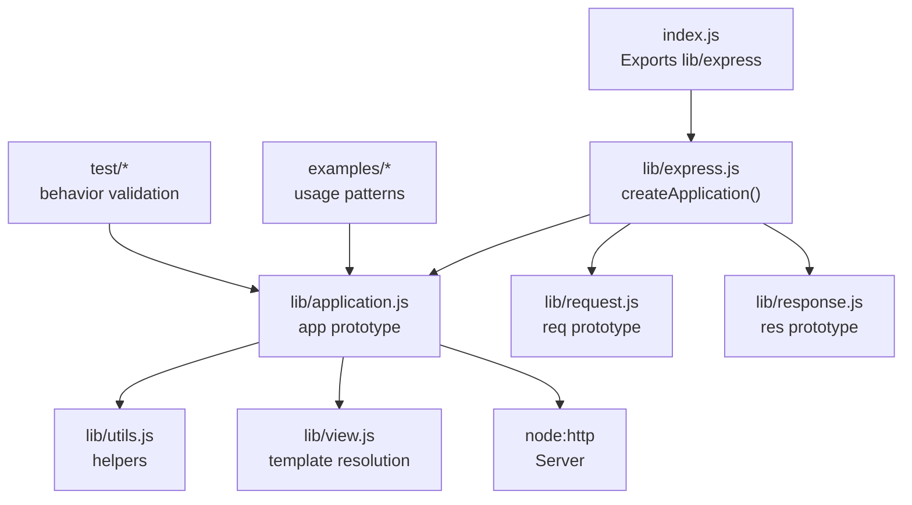
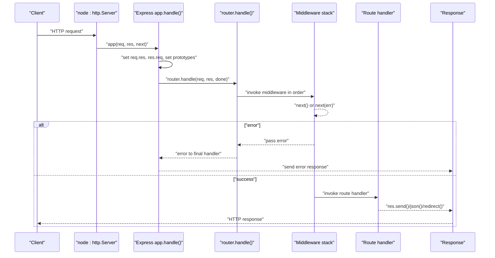
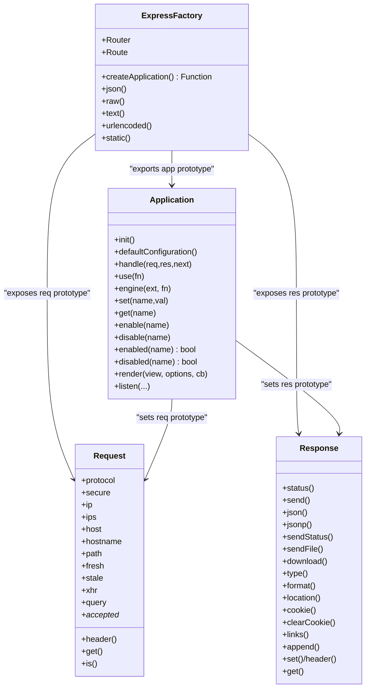
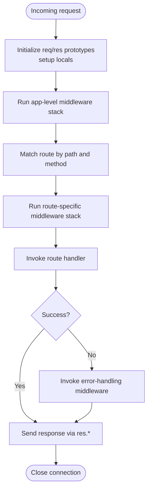
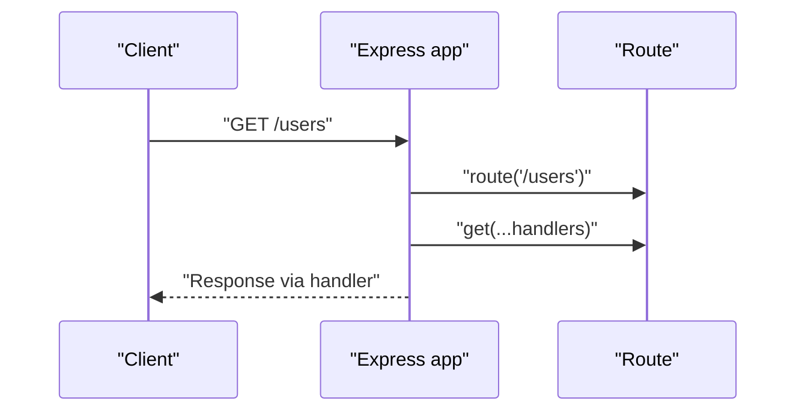
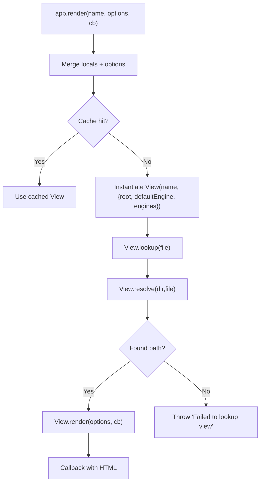
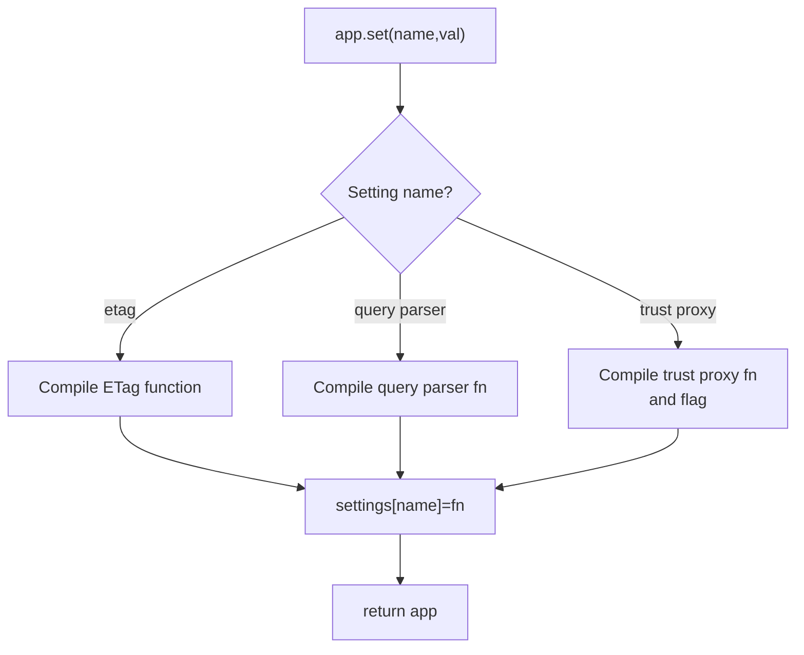
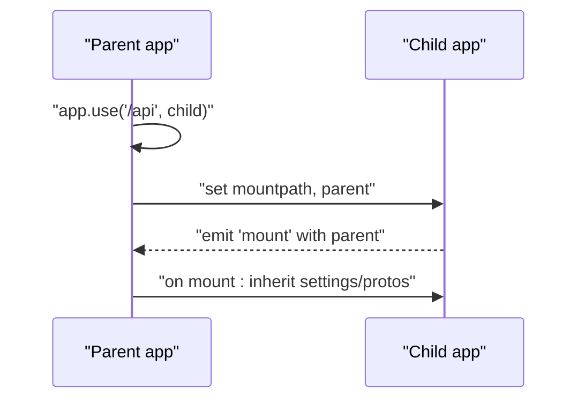
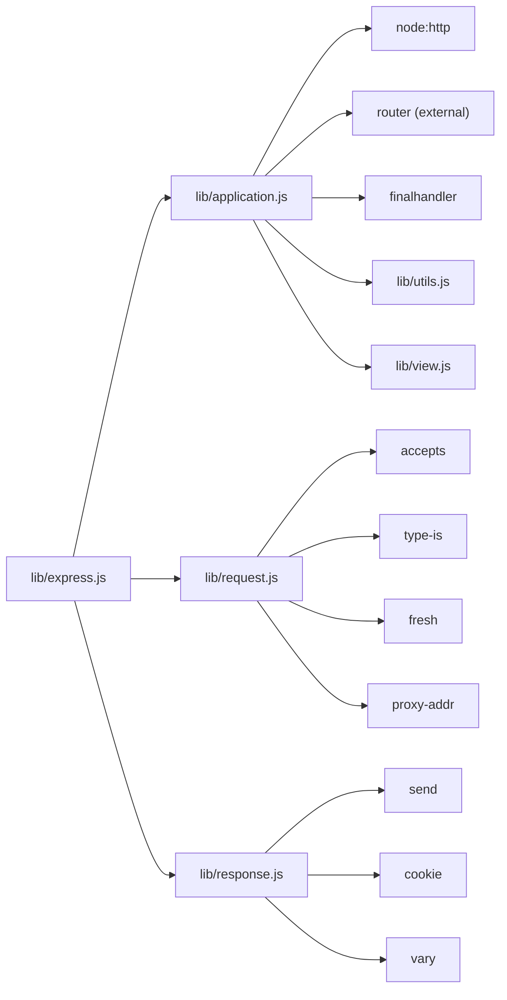

# Core Concepts

<cite>
**Referenced Files in This Document**
- [index.js](file://index.js)
- [lib/express.js](file://lib/express.js)
- [lib/application.js](file://lib/application.js)
- [lib/request.js](file://lib/request.js)
- [lib/response.js](file://lib/response.js)
- [lib/utils.js](file://lib/utils.js)
- [lib/view.js](file://lib/view.js)
- [examples/hello-world/index.js](file://examples/hello-world/index.js)
- [examples/route-middleware/index.js](file://examples/route-middleware/index.js)
- [examples/multi-router/index.js](file://examples/multi-router/index.js)
- [examples/ejs/index.js](file://examples/ejs/index.js)
- [examples/mvc/index.js](file://examples/mvc/index.js)
- [examples/route-separation/index.js](file://examples/route-separation/index.js)
- [test/app.router.js](file://test/app.router.js)
- [test/middleware.basic.js](file://test/middleware.basic.js)
</cite>

## Table of Contents
1. [Introduction](#introduction)
2. [Project Structure](#project-structure)
3. [Core Components](#core-components)
4. [Architecture Overview](#architecture-overview)
5. [Detailed Component Analysis](#detailed-component-analysis)
6. [Dependency Analysis](#dependency-analysis)
7. [Performance Considerations](#performance-considerations)
8. [Troubleshooting Guide](#troubleshooting-guide)
9. [Conclusion](#conclusion)

## Introduction
This document explains Express.js core concepts with a focus on architecture and design principles. It covers the Express factory function, middleware pattern, prototype extension approach, request/response lifecycle, routing basics, template system and view resolution, settings/configuration, environment detection, application mounting, and how Express builds upon Node.js HTTP modules to simplify HTTP handling.

## Project Structure
Express is organized into a small set of cohesive modules:
- Entry point re-exports the main factory.
- The factory creates an application function and mixes in application, request, and response prototypes.
- The application module initializes settings, default middleware, routes, and handles requests.
- The request and response modules extend Node’s IncomingMessage and ServerResponse prototypes.
- Utilities provide shared helpers (HTTP methods, ETag, query parser, trust proxy).
- The view module resolves and renders templates using registered engines.
- Examples demonstrate practical usage patterns for middleware, routing, mounting, and templating.
- Tests validate middleware ordering, error propagation, and URL rewriting.

**Diagram sources**
- [index.js:1-12](file://index.js#L1-L12)
- [lib/express.js:36-56](file://lib/express.js#L36-L56)
- [lib/application.js:59-141](file://lib/application.js#L59-L141)
- [lib/request.js:30](file://lib/request.js#L30)
- [lib/response.js:42](file://lib/response.js#L42)
- [lib/utils.js:29](file://lib/utils.js#L29)
- [lib/view.js:52-95](file://lib/view.js#L52-L95)

**Section sources**
- [index.js:1-12](file://index.js#L1-L12)
- [lib/express.js:36-56](file://lib/express.js#L36-L56)
- [lib/application.js:59-141](file://lib/application.js#L59-L141)

## Core Components
- Express factory: Creates an application function and mixes in application, request, and response prototypes. It exposes Router and middleware helpers.
- Application: Initializes settings, default configuration, and the internal router. It handles incoming requests, sets request/response prototypes, and delegates to the router.
- Request: Extends Node’s IncomingMessage with convenience getters and helpers (headers, protocol, IP, freshness, etc.).
- Response: Extends Node’s ServerResponse with convenience methods (status, send, json, jsonp, redirect, download, etc.).
- Utilities: Provide HTTP method list, ETag generation, query parsing, trust proxy compilation, and content-type helpers.
- View: Resolves template files across configured directories and renders using registered engines.

**Section sources**
- [lib/express.js:36-82](file://lib/express.js#L36-L82)
- [lib/application.js:59-178](file://lib/application.js#L59-L178)
- [lib/request.js:30-528](file://lib/request.js#L30-L528)
- [lib/response.js:42-800](file://lib/response.js#L42-L800)
- [lib/utils.js:29-272](file://lib/utils.js#L29-L272)
- [lib/view.js:52-206](file://lib/view.js#L52-L206)

## Architecture Overview
Express centers on a factory that produces an application callable as an HTTP callback. The application:
- Sets up default settings and mounts a lazy-initialized router.
- On each request, it augments req/res prototypes, wires locals, and forwards to the router.
- The router executes middleware stacks and route handlers.
- Responses are produced via response methods, often delegating to streaming utilities.

**Diagram sources**
- [lib/application.js:152-178](file://lib/application.js#L152-L178)
- [lib/application.js:190-244](file://lib/application.js#L190-L244)
- [lib/response.js:125-218](file://lib/response.js#L125-L218)

**Section sources**
- [lib/application.js:152-178](file://lib/application.js#L152-L178)
- [lib/application.js:190-244](file://lib/application.js#L190-L244)
- [lib/response.js:125-218](file://lib/response.js#L125-L218)

## Detailed Component Analysis

### Express Factory and Prototype Extension
- The factory creates a function that delegates to app.handle, mixes in EventEmitter and application prototype, and exposes request/response prototypes with app-bound properties.
- The request and response prototypes are created from Node’s IncomingMessage and ServerResponse, enabling prototype-based method extension.

**Diagram sources**
- [lib/express.js:36-82](file://lib/express.js#L36-L82)
- [lib/application.js:59-632](file://lib/application.js#L59-L632)
- [lib/request.js:30-528](file://lib/request.js#L30-L528)
- [lib/response.js:42-800](file://lib/response.js#L42-L800)

**Section sources**
- [lib/express.js:36-82](file://lib/express.js#L36-L82)
- [lib/application.js:59-141](file://lib/application.js#L59-L141)

### Middleware Fundamentals and Execution Order
- Middleware is added via app.use(path?, ...fns) and normalized/flattened. Each middleware receives (req, res, next).
- Execution order follows the order added; app.use(...) runs before route handlers.
- next() advances to the next middleware; next(err) triggers error-handling middleware.
- Promises are supported; rejected promises propagate as errors.

**Diagram sources**
- [lib/application.js:152-178](file://lib/application.js#L152-L178)
- [lib/application.js:190-244](file://lib/application.js#L190-L244)
- [test/middleware.basic.js:8-42](file://test/middleware.basic.js#L8-L42)
- [test/app.router.js:1115-1152](file://test/app.router.js#L1115-L1152)

**Section sources**
- [lib/application.js:190-244](file://lib/application.js#L190-L244)
- [test/middleware.basic.js:8-42](file://test/middleware.basic.js#L8-L42)
- [test/app.router.js:1115-1152](file://test/app.router.js#L1115-L1152)

### Routing Basics: HTTP Verbs, Paths, and Handlers
- app.METHOD(path, ...handlers) delegates to a Route instance for the path; app.all applies to all methods.
- The application dynamically defines METHOD methods by iterating supported HTTP methods.
- Route handlers are invoked after middleware in the route stack.

**Diagram sources**
- [lib/application.js:471-482](file://lib/application.js#L471-L482)
- [lib/application.js:494-503](file://lib/application.js#L494-L503)

**Section sources**
- [lib/application.js:471-482](file://lib/application.js#L471-L482)
- [lib/application.js:494-503](file://lib/application.js#L494-L503)

### Template System and View Resolution
- app.engine(ext, fn) registers a rendering function for an extension.
- app.render(viewName, options, cb) merges locals and options, selects a View class, resolves the path, and renders.
- View resolves by trying the exact path and then index.<ext> within directories configured by app.get('views').
- Engines are discovered by requiring the module and using its __express method.

**Diagram sources**
- [lib/application.js:522-575](file://lib/application.js#L522-L575)
- [lib/view.js:52-95](file://lib/view.js#L52-L95)
- [lib/view.js:104-123](file://lib/view.js#L104-L123)
- [lib/view.js:169-187](file://lib/view.js#L169-L187)

**Section sources**
- [lib/application.js:294-308](file://lib/application.js#L294-L308)
- [lib/application.js:522-575](file://lib/application.js#L522-L575)
- [lib/view.js:52-206](file://lib/view.js#L52-L206)

### Settings and Configuration System
- app.set(name, value) stores settings; certain settings trigger compilation of helpers (ETag, query parser, trust proxy).
- app.get(name) retrieves settings.
- app.enable/disable/enabled/disabled toggle boolean flags.
- defaultConfiguration sets environment, x-powered-by, etag, query parser, subdomain offset, trust proxy, view cache, and view-related settings.

**Diagram sources**
- [lib/application.js:351-383](file://lib/application.js#L351-L383)
- [lib/application.js:90-141](file://lib/application.js#L90-L141)
- [lib/utils.js:130-214](file://lib/utils.js#L130-L214)

**Section sources**
- [lib/application.js:351-383](file://lib/application.js#L351-L383)
- [lib/application.js:90-141](file://lib/application.js#L90-L141)
- [lib/utils.js:130-214](file://lib/utils.js#L130-L214)

### Environment Detection and Application Mounting
- Environment detection: defaultConfiguration reads NODE_ENV or defaults to development.
- Mounting: app.use supports mounting another Express app at a path; the mounted app inherits request/response prototypes, settings, and engines from the parent during the mount event.

**Diagram sources**
- [lib/application.js:109-122](file://lib/application.js#L109-L122)
- [lib/application.js:225-241](file://lib/application.js#L225-L241)

**Section sources**
- [lib/application.js:90-141](file://lib/application.js#L90-L141)
- [lib/application.js:109-122](file://lib/application.js#L109-L122)
- [lib/application.js:225-241](file://lib/application.js#L225-L241)

### Practical Patterns from the Codebase
- Request enhancement: middleware can attach properties to req (e.g., authentication user).
- Response modification: middleware can set res.locals or modify headers.
- Middleware composition: chaining multiple middleware and using next(err) for error propagation.
- URL rewriting: middleware can rewrite req.url to delegate to different routes.
- Application mounting: mount separate apps under different paths.

Examples:
- Basic request enhancement and middleware chaining: [examples/route-middleware/index.js:25-68](file://examples/route-middleware/index.js#L25-L68)
- URL rewriting and delegation: [test/app.router.js:1097-1113](file://test/app.router.js#L1097-L1113)
- Application mounting: [examples/multi-router/index.js:7-8](file://examples/multi-router/index.js#L7-L8)
- Custom response method extension: [examples/mvc/index.js:24-31](file://examples/mvc/index.js#L24-L31)

**Section sources**
- [examples/route-middleware/index.js:25-68](file://examples/route-middleware/index.js#L25-L68)
- [test/app.router.js:1097-1113](file://test/app.router.js#L1097-L1113)
- [examples/multi-router/index.js:7-8](file://examples/multi-router/index.js#L7-L8)
- [examples/mvc/index.js:24-31](file://examples/mvc/index.js#L24-L31)

## Dependency Analysis
Express depends on Node’s http module and several community packages for utilities and HTTP features. The application module composes these dependencies to provide a cohesive framework.

**Diagram sources**
- [lib/express.js:15-21](file://lib/express.js#L15-L21)
- [lib/application.js:16-26](file://lib/application.js#L16-L26)
- [lib/request.js:16-23](file://lib/request.js#L16-L23)
- [lib/response.js:15-35](file://lib/response.js#L15-L35)

**Section sources**
- [lib/express.js:15-21](file://lib/express.js#L15-L21)
- [lib/application.js:16-26](file://lib/application.js#L16-L26)
- [lib/request.js:16-23](file://lib/request.js#L16-L23)
- [lib/response.js:15-35](file://lib/response.js#L15-L35)

## Performance Considerations
- Prototype-based method dispatch avoids per-request allocations and leverages fast property lookups.
- ETag generation and query parsing are compiled once per setting change to minimize runtime overhead.
- View caching can be enabled to avoid repeated filesystem lookups.
- Streaming responses (e.g., sendFile/download) integrate with efficient file serving utilities.

[No sources needed since this section provides general guidance]

## Troubleshooting Guide
- Middleware order: Verify the order of app.use vs route handlers; route handlers run after app-level middleware.
- Error propagation: Use next(err) to trigger error-handling middleware; ensure an error handler is present.
- URL rewriting: Confirm req.url rewrite occurs before route handlers and that the new path matches intended handlers.
- Template resolution: Ensure app.set('views') and app.set('view engine') are configured correctly; verify file existence and extensions.

**Section sources**
- [test/middleware.basic.js:8-42](file://test/middleware.basic.js#L8-L42)
- [test/app.router.js:1097-1113](file://test/app.router.js#L1097-L1113)
- [lib/application.js:522-575](file://lib/application.js#L522-L575)

## Conclusion
Express’s architecture centers on a lightweight factory that produces an application function and mixes in application, request, and response prototypes. The middleware pattern orchestrates request processing, while the router organizes route-specific stacks. The template system integrates with registered engines and supports flexible view resolution. Settings and configuration are compiled once and inherited during mounting. Together, these patterns simplify HTTP handling built atop Node’s native modules.