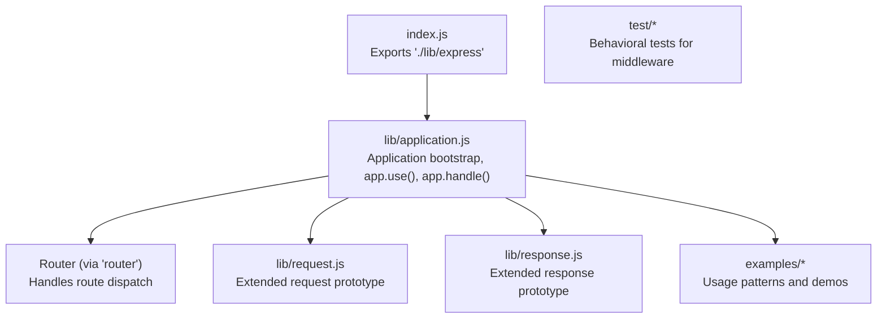
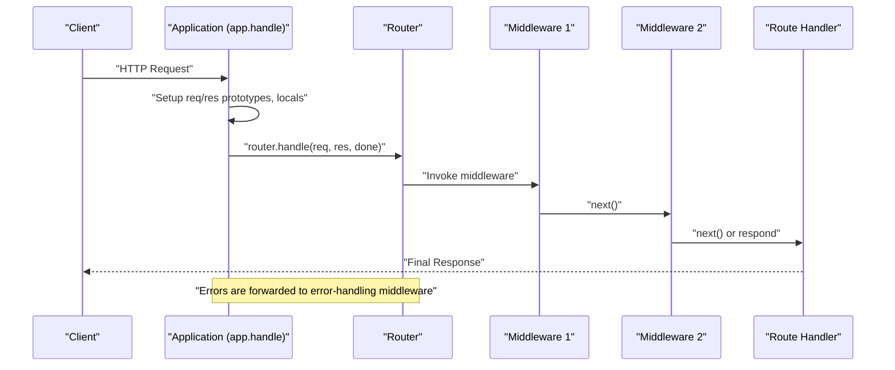
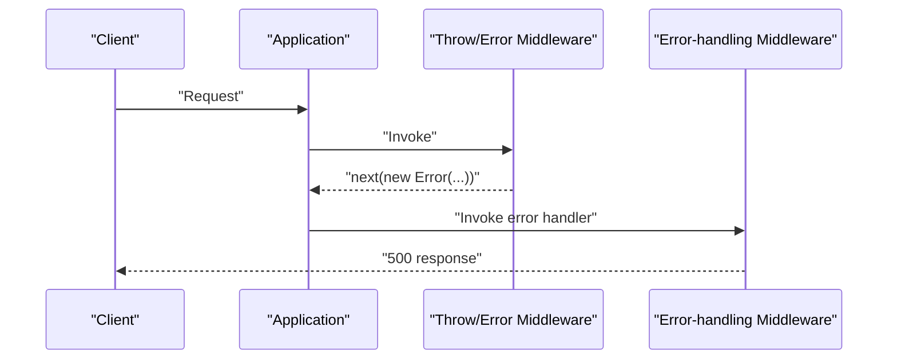
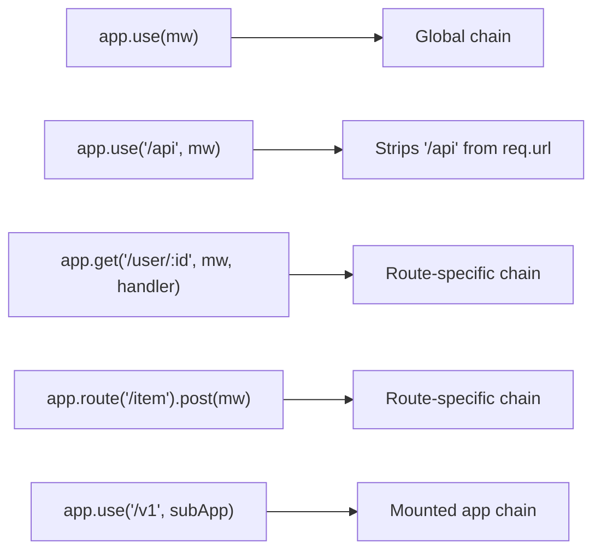
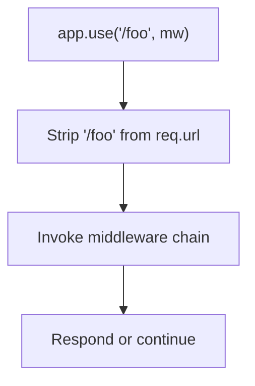
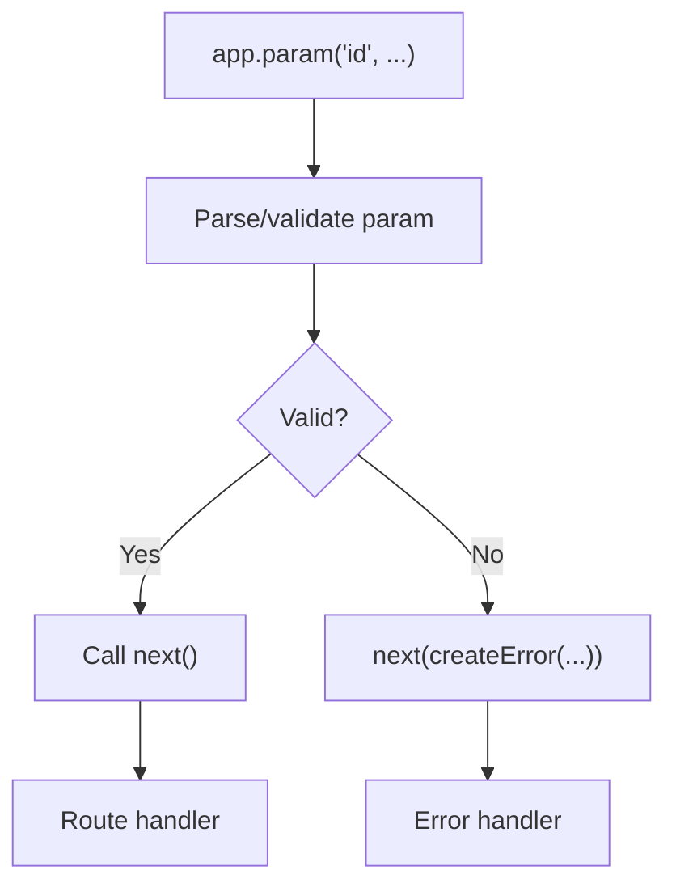
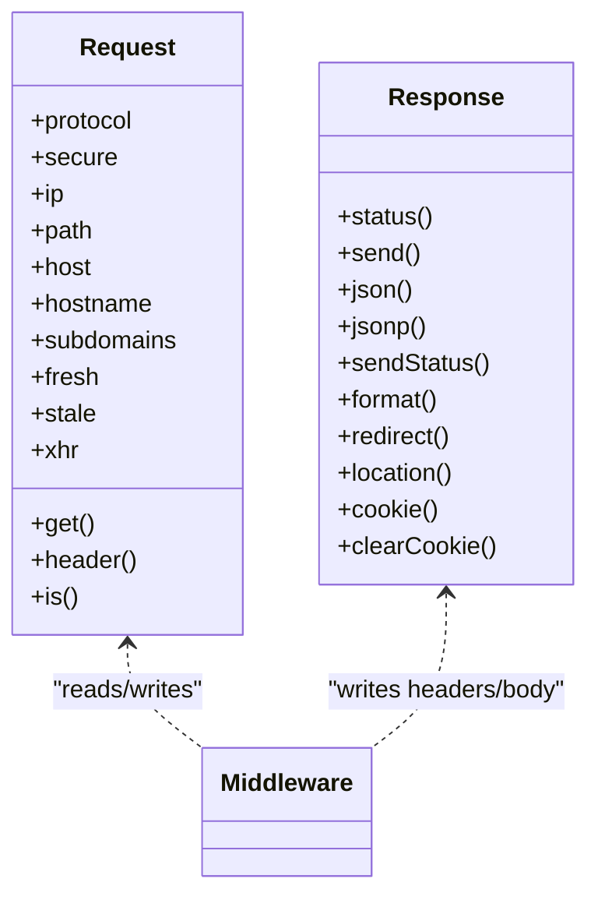
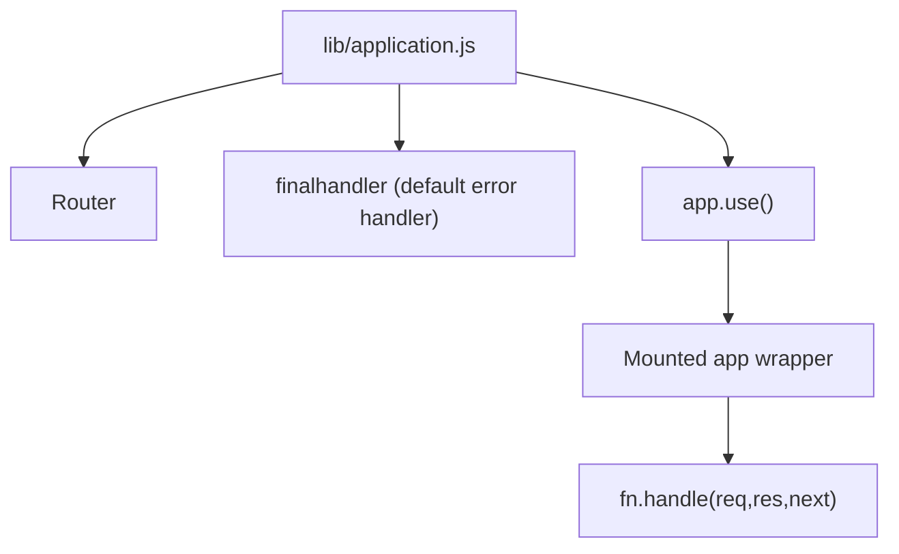

# Middleware Fundamentals

<cite>
**Referenced Files in This Document**
- [index.js](file://index.js)
- [lib/application.js](file://lib/application.js)
- [lib/request.js](file://lib/request.js)
- [lib/response.js](file://lib/response.js)
- [examples/route-middleware/index.js](file://examples/route-middleware/index.js)
- [examples/error/index.js](file://examples/error/index.js)
- [examples/auth/index.js](file://examples/auth/index.js)
- [examples/session/index.js](file://examples/session/index.js)
- [examples/cookies/index.js](file://examples/cookies/index.js)
- [examples/params/index.js](file://examples/params/index.js)
- [examples/multi-router/index.js](file://examples/multi-router/index.js)
- [test/app.use.js](file://test/app.use.js)
- [test/middleware.basic.js](file://test/middleware.basic.js)
- [test/app.routes.error.js](file://test/app.routes.error.js)
- [test/app.router.js](file://test/app.router.js)
</cite>

## Table of Contents
1. [Introduction](#introduction)
2. [Project Structure](#project-structure)
3. [Core Components](#core-components)
4. [Architecture Overview](#architecture-overview)
5. [Detailed Component Analysis](#detailed-component-analysis)
6. [Dependency Analysis](#dependency-analysis)
7. [Performance Considerations](#performance-considerations)
8. [Troubleshooting Guide](#troubleshooting-guide)
9. [Conclusion](#conclusion)
10. [Appendices](#appendices)

## Introduction
This document explains Express.js middleware fundamentals with a focus on middleware functions, execution patterns, and how they control request/response flow. It covers the middleware function signature, chaining, the next() callback, error-first callbacks, built-in middleware categories, registration via app.use(), route-specific middleware, scope and path-based routing, parameter extraction, and common patterns such as logging, authentication, and response modification. Practical examples are drawn from the repository’s core implementation and examples.

## Project Structure
Express exposes its public API via a minimal entry that re-exports the internal Express factory. The core runtime wiring resides in lib/application.js, which orchestrates request handling, middleware registration, and router integration. The request and response objects are extended prototypes that provide convenience APIs used by middleware.



**Diagram sources**
- [index.js:1-12](file://index.js#L1-L12)
- [lib/application.js:59-178](file://lib/application.js#L59-L178)
- [lib/request.js:30](file://lib/request.js#L30)
- [lib/response.js:42](file://lib/response.js#L42)

**Section sources**
- [index.js:1-12](file://index.js#L1-L12)
- [lib/application.js:59-178](file://lib/application.js#L59-L178)

## Core Components
- Middleware function signature: req, res, next. The next() callback advances to the next middleware in the chain. Errors are passed to next(err) and handled by error-handling middleware.
- Execution order: app.use() registers middleware globally; routes register middleware per path/method. Middleware executes in the order registered, with error-handling middleware invoked when next(err) is called.
- Error-first callbacks: Errors propagate through the chain to the first error-handling middleware with four parameters (err, req, res, next).
- Built-in middleware types:
  - Application-level: registered via app.use() and applied to all routes.
  - Router-level: route-specific middleware attached to app.get/post/etc. or via app.route().
  - Error-handling: middleware with four parameters that handles errors.
- Registration: app.use([path], ...middleware) supports arrays, multiple arguments, and path prefixes. Mounted apps are integrated under a path.
- Scope and path-based routing: app.use('/path', ...) strips the matched prefix from req.url before invoking downstream middleware. Paths can be strings, arrays, or regexps.
- Parameter extraction: app.param() allows extracting and validating route parameters prior to route handlers.

**Section sources**
- [lib/application.js:190-244](file://lib/application.js#L190-L244)
- [lib/application.js:322-334](file://lib/application.js#L322-L334)
- [test/app.use.js:258-541](file://test/app.use.js#L258-L541)
- [examples/route-middleware/index.js:25-84](file://examples/route-middleware/index.js#L25-L84)
- [examples/error/index.js:14-47](file://examples/error/index.js#L14-L47)

## Architecture Overview
Express builds a request pipeline:
- Incoming HTTP requests are received by the application.
- The application sets up req/res prototypes, attaches locals, and delegates to the Router.
- Router resolves matching routes and invokes middleware stacks in order.
- Errors thrown or passed to next(err) jump to error-handling middleware.
- Responses are finalized via response methods.



**Diagram sources**
- [lib/application.js:152-178](file://lib/application.js#L152-L178)
- [lib/application.js:190-244](file://lib/application.js#L190-L244)

## Detailed Component Analysis

### Middleware Function Signature and Next Callback Pattern
- Signature: req, res, next. next() advances the pipeline; next(err) triggers error handling.
- Chaining: Multiple middleware are invoked in registration order. Each can modify req/res and call next() or terminate with a response.
- Error propagation: Throwing synchronously or calling next(new Error(...)) moves control to error-handling middleware.

```mermaid
flowchart TD
Start(["Request enters middleware chain"]) --> M1["Middleware 1<br/>req, res, next()"]
M1 --> Decision1{"Call next()?"}
Decision1 --> |Yes| M2["Middleware 2<br/>req, res, next()"]
Decision1 --> |No| Respond["Respond via res methods"]
M2 --> Decision2{"Call next() or error?"}
Decision2 --> |next()| Handler["Route Handler"]
Decision2 --> |error| ErrorHandler["Error-handling Middleware<br/>4 params"]
ErrorHandler --> End(["End"])
Handler --> End
Respond --> End
```

**Diagram sources**
- [test/middleware.basic.js:8-41](file://test/middleware.basic.js#L8-L41)
- [examples/error/index.js:29-42](file://examples/error/index.js#L29-L42)

**Section sources**
- [test/middleware.basic.js:8-41](file://test/middleware.basic.js#L8-L41)
- [examples/error/index.js:14-47](file://examples/error/index.js#L14-L47)

### Error-First Callbacks and Error-Handling Middleware
- Error-handling middleware is recognized by its four parameters (err, req, res, next). It runs only when an error is present in the current chain.
- Placement matters: error handlers must be registered after routes and other middleware to catch errors thrown or passed by earlier stages.
- Promise support: rejecting a Promise in middleware or route invokes error handling similarly.



**Diagram sources**
- [examples/error/index.js:20-47](file://examples/error/index.js#L20-L47)
- [test/app.routes.error.js:25-61](file://test/app.routes.error.js#L25-L61)
- [test/app.router.js:965-1024](file://test/app.router.js#L965-L1024)

**Section sources**
- [examples/error/index.js:14-47](file://examples/error/index.js#L14-L47)
- [test/app.routes.error.js:25-61](file://test/app.routes.error.js#L25-L61)
- [test/app.router.js:965-1024](file://test/app.router.js#L965-L1024)

### Built-in Middleware Types and Registration
- Application-level middleware: app.use() registers middleware for all routes. Supports arrays, multiple arguments, and path prefixes.
- Router-level middleware: route-specific middleware attached via app.get('/path', mw1, mw2, handler) or app.route('/path').get(mw1, handler).
- Mounted applications: app.use('/prefix', nestedApp) mounts another Express app under a path.



**Diagram sources**
- [lib/application.js:190-244](file://lib/application.js#L190-L244)
- [test/app.use.js:258-541](file://test/app.use.js#L258-L541)
- [examples/multi-router/index.js:7-8](file://examples/multi-router/index.js#L7-L8)

**Section sources**
- [lib/application.js:190-244](file://lib/application.js#L190-L244)
- [test/app.use.js:258-541](file://test/app.use.js#L258-L541)
- [examples/multi-router/index.js:7-8](file://examples/multi-router/index.js#L7-L8)

### Middleware Registration Patterns and Path-Based Routing
- Arrays and multiple arguments: app.use([mw1, mw2], mw3) flattens and applies in order.
- Path stripping: app.use('/foo', ...) removes '/foo' from req.url before downstream middleware.
- Multiple paths and regexps: app.use(['/foo', '/bar'], ...) and app.use(/^\/[a-z]oo/, ...) support flexible routing.
- Mounted apps emit 'mount' and integrate req/res prototypes.



**Diagram sources**
- [test/app.use.js:284-341](file://test/app.use.js#L284-L341)
- [test/app.use.js:448-467](file://test/app.use.js#L448-L467)
- [test/app.use.js:505-528](file://test/app.use.js#L505-L528)

**Section sources**
- [test/app.use.js:125-256](file://test/app.use.js#L125-L256)
- [test/app.use.js:284-341](file://test/app.use.js#L284-L341)
- [test/app.use.js:448-467](file://test/app.use.js#L448-L467)
- [test/app.use.js:505-528](file://test/app.use.js#L505-L528)

### Parameter Extraction and Conditional Execution
- app.param(): Extract and transform route parameters before reaching route handlers. Can validate and short-circuit with next(err).
- Conditional middleware: Check conditions in middleware and either call next() or respond early.



**Diagram sources**
- [examples/params/index.js:23-41](file://examples/params/index.js#L23-L41)
- [examples/route-middleware/index.js:25-58](file://examples/route-middleware/index.js#L25-L58)

**Section sources**
- [examples/params/index.js:23-41](file://examples/params/index.js#L23-L41)
- [examples/route-middleware/index.js:25-58](file://examples/route-middleware/index.js#L25-L58)

### Relationship Between Middleware and Request/Response Objects
- req and res are extended prototypes. Middleware can read/write properties on req (e.g., req.user, req.authenticatedUser) and call res methods (e.g., res.send, res.json, res.redirect).
- Middleware can mutate headers, status, and body via res methods.



**Diagram sources**
- [lib/request.js:63-528](file://lib/request.js#L63-L528)
- [lib/response.js:125-800](file://lib/response.js#L125-L800)

**Section sources**
- [lib/request.js:63-528](file://lib/request.js#L63-L528)
- [lib/response.js:125-800](file://lib/response.js#L125-L800)

### Practical Examples from the Codebase

#### Custom Middleware Creation and Conditional Execution
- Authentication placeholder middleware sets req.authenticatedUser and continues.
- Route-specific middleware loads a user by ID and enforces permissions.

**Section sources**
- [examples/route-middleware/index.js:65-84](file://examples/route-middleware/index.js#L65-L84)

#### Error Handling Middleware
- Middleware with four parameters handles errors, logs them, and sends a 500 response.
- Demonstrates placing error handlers after routes.

**Section sources**
- [examples/error/index.js:14-47](file://examples/error/index.js#L14-L47)

#### Logging, Authentication, and Session Middleware
- Logging via morgan.
- Session management via express-session.
- Authentication middleware checks session and redirects when unauthorized.

**Section sources**
- [examples/auth/index.js:21-82](file://examples/auth/index.js#L21-L82)
- [examples/session/index.js:16-31](file://examples/session/index.js#L16-L31)
- [examples/cookies/index.js:13-47](file://examples/cookies/index.js#L13-L47)

#### Mounted Apps and Multi-Router Patterns
- Mounting separate API versions under different paths.

**Section sources**
- [examples/multi-router/index.js:7-8](file://examples/multi-router/index.js#L7-L8)

## Dependency Analysis
- Application depends on Router for dispatching and on finalhandler for default error handling when no error handler is present.
- app.use() integrates both standalone middleware and mounted apps, preserving req/res prototypes during nested handling.



**Diagram sources**
- [lib/application.js:152-178](file://lib/application.js#L152-L178)
- [lib/application.js:190-244](file://lib/application.js#L190-L244)

**Section sources**
- [lib/application.js:152-178](file://lib/application.js#L152-L178)
- [lib/application.js:190-244](file://lib/application.js#L190-L244)

## Performance Considerations
- Minimize synchronous heavy work in middleware; prefer asynchronous patterns to avoid blocking the event loop.
- Order middleware strategically to fail fast (e.g., early validation) and avoid unnecessary processing.
- Prefer targeted path-based middleware to limit global overhead.
- Use app.param() to centralize parameter parsing/validation and cache computed values on req for downstream middleware.

## Troubleshooting Guide
- Middleware not invoked: Verify registration order and path prefixes. Ensure app.use('/path', ...) matches the incoming URL and that the path is not overly restrictive.
- Error not handled: Confirm error-handling middleware is registered after routes and that it accepts four parameters.
- next() not called: Without next(), the pipeline stalls. Ensure next() is called in all branches or a response is sent.
- Mounted app issues: When mounting nested apps, confirm mountpoints and that req/res prototypes are restored after nested handling.

**Section sources**
- [test/app.use.js:258-541](file://test/app.use.js#L258-L541)
- [examples/error/index.js:44-47](file://examples/error/index.js#L44-L47)

## Conclusion
Express middleware forms the backbone of request processing. Understanding the req/res signatures, next() flow control, error-first patterns, and registration semantics enables robust, maintainable applications. Use app.use() for global behavior, route-specific middleware for targeted logic, and app.param() for shared parameter handling. Place error handlers after routes to ensure comprehensive coverage.

## Appendices
- Common middleware patterns:
  - Logging: Use a logger middleware before other middleware.
  - Authentication: Validate sessions or tokens and attach user info to req.
  - Response modification: Normalize headers, set caching, or transform payloads.