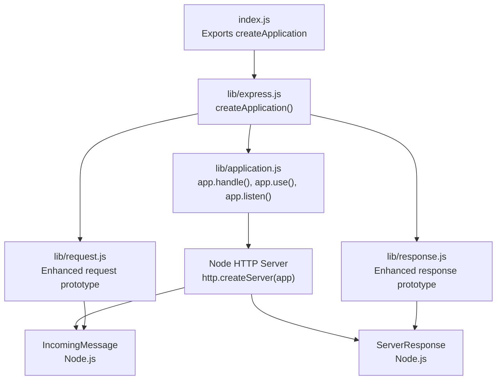
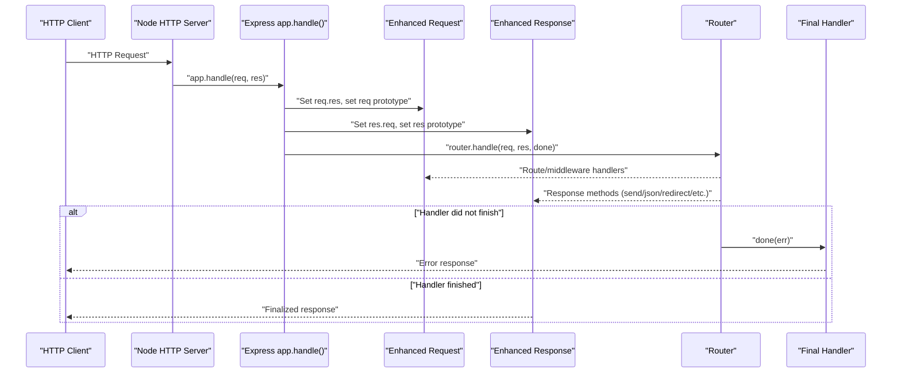
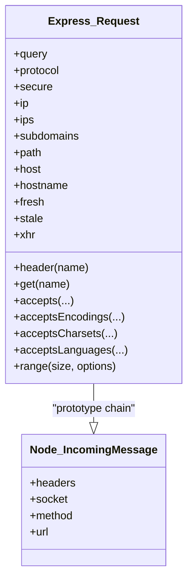
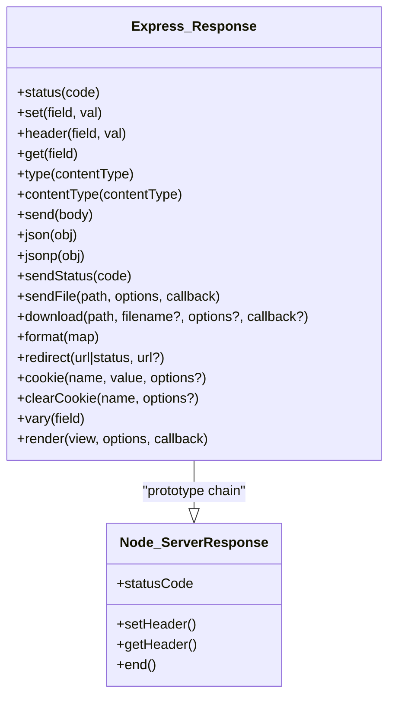
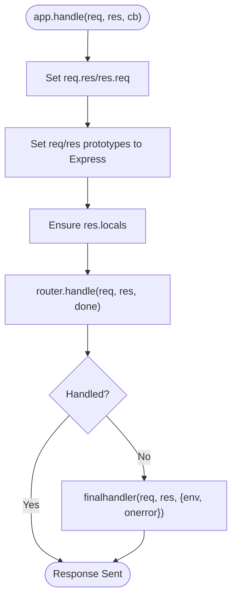
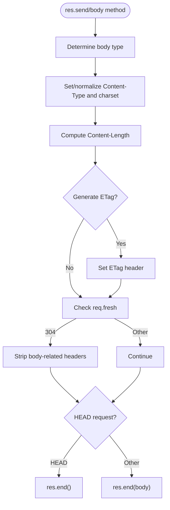
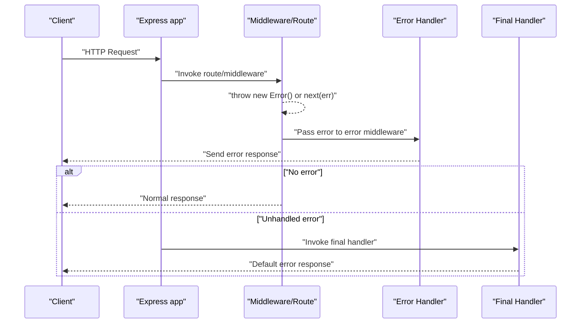
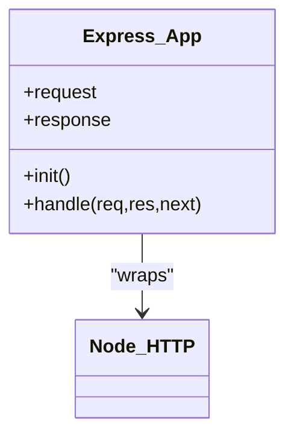
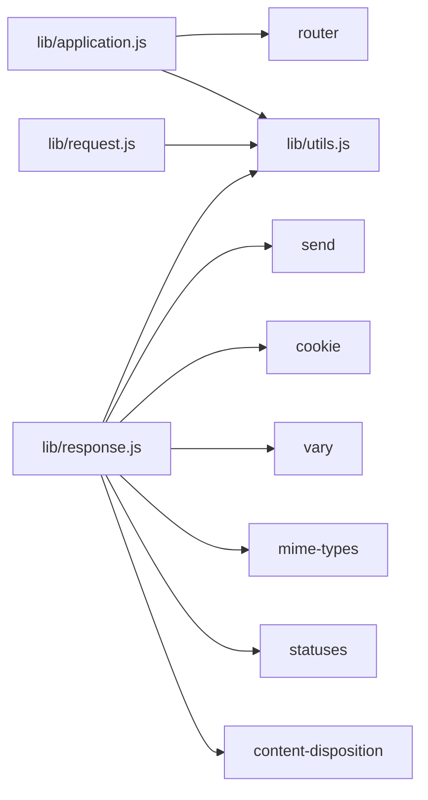

# Request/Response Lifecycle

<cite>
**Referenced Files in This Document**
- [index.js](file://index.js)
- [lib/express.js](file://lib/express.js)
- [lib/application.js](file://lib/application.js)
- [lib/request.js](file://lib/request.js)
- [lib/response.js](file://lib/response.js)
- [lib/utils.js](file://lib/utils.js)
- [examples/hello-world/index.js](file://examples/hello-world/index.js)
- [examples/content-negotiation/index.js](file://examples/content-negotiation/index.js)
- [examples/error/index.js](file://examples/error/index.js)
- [examples/route-middleware/index.js](file://examples/route-middleware/index.js)
- [examples/params/index.js](file://examples/params/index.js)
- [examples/downloads/index.js](file://examples/downloads/index.js)
- [examples/static-files/index.js](file://examples/static-files/index.js)
</cite>

## Table of Contents
1. [Introduction](#introduction)
2. [Project Structure](#project-structure)
3. [Core Components](#core-components)
4. [Architecture Overview](#architecture-overview)
5. [Detailed Component Analysis](#detailed-component-analysis)
6. [Dependency Analysis](#dependency-analysis)
7. [Performance Considerations](#performance-considerations)
8. [Troubleshooting Guide](#troubleshooting-guide)
9. [Conclusion](#conclusion)
10. [Appendices](#appendices)

## Introduction
This document explains the complete Express.js request/response lifecycle from the moment a Node.js HTTP request arrives until the response is delivered. It covers how Express enhances Node’s IncomingMessage and ServerResponse prototypes to provide convenient APIs for parameter extraction, header processing, content negotiation, JSON responses, redirects, file serving, and more. It also documents the middleware execution chain, error propagation, and the relationship between Express request/response objects and their underlying Node.js counterparts.

## Project Structure
Express exposes a factory that creates an application function. That function inherits application behavior and augments request/response prototypes. The request and response prototypes are separate objects that extend Node’s native HTTP classes. Utilities provide shared helpers for ETags, query parsing, trust proxies, and content-type normalization.

**Diagram sources**
- [index.js:1-12](file://index.js#L1-L12)
- [lib/express.js:36-56](file://lib/express.js#L36-L56)
- [lib/application.js:59-606](file://lib/application.js#L59-L606)
- [lib/request.js:30](file://lib/request.js#L30)
- [lib/response.js:42](file://lib/response.js#L42)

**Section sources**
- [index.js:1-12](file://index.js#L1-L12)
- [lib/express.js:36-56](file://lib/express.js#L36-L56)
- [lib/application.js:59-606](file://lib/application.js#L59-L606)
- [lib/request.js:30](file://lib/request.js#L30)
- [lib/response.js:42](file://lib/response.js#L42)

## Core Components
- Application: Initializes defaults, mounts routers, and orchestrates the request lifecycle via app.handle().
- Request prototype: Extends Node’s IncomingMessage with convenience getters and utilities (headers, protocol, IP, subdomains, freshness, etc.).
- Response prototype: Extends Node’s ServerResponse with helpers for status, headers, JSON, redirects, file serving, content negotiation, cookies, and rendering views.
- Utilities: Provide ETag generation, query parsing, trust proxy evaluation, and content-type normalization.

**Section sources**
- [lib/application.js:59-606](file://lib/application.js#L59-L606)
- [lib/request.js:30-528](file://lib/request.js#L30-L528)
- [lib/response.js:42-1048](file://lib/response.js#L42-L1048)
- [lib/utils.js:29-272](file://lib/utils.js#L29-L272)

## Architecture Overview
Express wraps Node’s HTTP server and augments request/response objects before invoking the router. The router dispatches to route handlers and middleware. Responses are finalized by the router or middleware; otherwise, a default final handler is used.

**Diagram sources**
- [lib/application.js:152-178](file://lib/application.js#L152-L178)
- [lib/application.js:154-157](file://lib/application.js#L154-L157)
- [lib/application.js:169-170](file://lib/application.js#L169-L170)

## Detailed Component Analysis

### Request Enhancement and Properties
Express enhances Node’s IncomingMessage prototype to provide:
- Header accessors and normalization (referrer/referer).
- Accept negotiation (types, encodings, charsets, languages).
- Query parsing via configured parser function.
- Protocol detection and secure flag with trust proxy awareness.
- IP resolution and subdomain extraction.
- Hostname and host parsing with proxy support.
- Freshness and staleness checks using ETag and Last-Modified.
- XMLHttpRequest detection.

These capabilities are implemented as getters and methods on the request prototype, enabling concise access patterns in route handlers.

**Diagram sources**
- [lib/request.js:30](file://lib/request.js#L30)
- [lib/request.js:63-83](file://lib/request.js#L63-L83)
- [lib/request.js:127-130](file://lib/request.js#L127-L130)
- [lib/request.js:230-241](file://lib/request.js#L230-L241)
- [lib/request.js:297-315](file://lib/request.js#L297-L315)
- [lib/request.js:340-343](file://lib/request.js#L340-L343)
- [lib/request.js:383-394](file://lib/request.js#L383-L394)
- [lib/request.js:418-431](file://lib/request.js#L418-L431)
- [lib/request.js:444-458](file://lib/request.js#L444-L458)
- [lib/request.js:469-486](file://lib/request.js#L469-L486)
- [lib/request.js:497-499](file://lib/request.js#L497-L499)
- [lib/request.js:508-511](file://lib/request.js#L508-L511)

**Section sources**
- [lib/request.js:30-528](file://lib/request.js#L30-L528)

### Response Modification and Methods
Express enhances Node’s ServerResponse prototype with:
- Status code setter with validation.
- Header manipulation (set/get/header).
- Content-type helpers (type/contentType).
- Body helpers (send, json, jsonp, sendStatus).
- File serving (sendFile) and downloads (download).
- Content negotiation (format).
- Redirects (redirect) with automatic body generation.
- Cookie management (cookie, clearCookie).
- Vary header updates (vary).
- View rendering (render) delegating to application renderer.

**Diagram sources**
- [lib/response.js:42](file://lib/response.js#L42)
- [lib/response.js:64-76](file://lib/response.js#L64-L76)
- [lib/response.js:664-686](file://lib/response.js#L664-L686)
- [lib/response.js:125-218](file://lib/response.js#L125-L218)
- [lib/response.js:232-246](file://lib/response.js#L232-L246)
- [lib/response.js:371-413](file://lib/response.js#L371-L413)
- [lib/response.js:433-482](file://lib/response.js#L433-L482)
- [lib/response.js:569-594](file://lib/response.js#L569-L594)
- [lib/response.js:812-864](file://lib/response.js#L812-L864)
- [lib/response.js:921-1009](file://lib/response.js#L921-L1009)
- [lib/response.js:994-1005](file://lib/response.js#L994-L1005)

**Section sources**
- [lib/response.js:42-1048](file://lib/response.js#L42-L1048)

### Middleware Execution Chain and Router Dispatch
Express composes middleware and routes through a router. The application’s handle method:
- Sets req.res and res.req for cross-references.
- Sets the request/response prototypes to Express-enhanced ones.
- Delegates to router.handle with a final handler.
- Uses a default final handler if none is provided.

**Diagram sources**
- [lib/application.js:152-178](file://lib/application.js#L152-L178)
- [lib/application.js:154-157](file://lib/application.js#L154-L157)
- [lib/application.js:169-170](file://lib/application.js#L169-L170)

**Section sources**
- [lib/application.js:152-178](file://lib/application.js#L152-L178)

### Response Generation Process
The response generation process varies by method but generally follows:
- Determine content type and charset.
- Compute Content-Length and optional ETag.
- Apply conditional responses (e.g., 304 Not Modified).
- Write body and finalize via res.end().

**Diagram sources**
- [lib/response.js:125-218](file://lib/response.js#L125-L218)
- [lib/response.js:160-189](file://lib/response.js#L160-L189)
- [lib/response.js:191-207](file://lib/response.js#L191-L207)
- [lib/response.js:194-215](file://lib/response.js#L194-L215)

**Section sources**
- [lib/response.js:125-218](file://lib/response.js#L125-L218)

### Practical Examples Demonstrating Lifecycle

- Hello world: Basic GET route using res.send to return a string response.
  - [examples/hello-world/index.js:7-9](file://examples/hello-world/index.js#L7-L9)

- Content negotiation: Using res.format to respond differently based on Accept header.
  - [examples/content-negotiation/index.js:9-27](file://examples/content-negotiation/index.js#L9-L27)

- Route middleware: Chaining middleware to load a user and enforce permissions.
  - [examples/route-middleware/index.js:25-48](file://examples/route-middleware/index.js#L25-L48)

- Parameter extraction: Using app.param to convert route params and load resources.
  - [examples/params/index.js:23-41](file://examples/params/index.js#L23-L41)

- Downloads: Serving files with res.download and handling missing files.
  - [examples/downloads/index.js:26-34](file://examples/downloads/index.js#L26-L34)

- Static files: Serving static assets via express.static middleware.
  - [examples/static-files/index.js:22-36](file://examples/static-files/index.js#L22-L36)

**Section sources**
- [examples/hello-world/index.js:7-9](file://examples/hello-world/index.js#L7-L9)
- [examples/content-negotiation/index.js:9-27](file://examples/content-negotiation/index.js#L9-L27)
- [examples/route-middleware/index.js:25-48](file://examples/route-middleware/index.js#L25-L48)
- [examples/params/index.js:23-41](file://examples/params/index.js#L23-L41)
- [examples/downloads/index.js:26-34](file://examples/downloads/index.js#L26-L34)
- [examples/static-files/index.js:22-36](file://examples/static-files/index.js#L22-L36)

### Error Handling During Lifecycle
Express supports:
- Throwing errors synchronously in route handlers; they are passed to error-handling middleware.
- Passing errors to next() asynchronously.
- Placing error-handling middleware after routes; it receives four arguments (err, req, res, next).
- Default final handler behavior when no callback is provided to app.handle.

**Diagram sources**
- [examples/error/index.js:20-27](file://examples/error/index.js#L20-L27)
- [examples/error/index.js:29-47](file://examples/error/index.js#L29-L47)
- [lib/application.js:154-157](file://lib/application.js#L154-L157)

**Section sources**
- [examples/error/index.js:20-27](file://examples/error/index.js#L20-L27)
- [examples/error/index.js:29-47](file://examples/error/index.js#L29-L47)
- [lib/application.js:154-157](file://lib/application.js#L154-L157)

### Relationship Between Express and Node.js Objects
- Express request and response prototypes are created by extending Node’s IncomingMessage and ServerResponse respectively.
- The application sets req and res prototypes to Express prototypes at the start of each request.
- This allows route handlers and middleware to use Express APIs while operating on Node’s native HTTP objects.

**Diagram sources**
- [lib/express.js:45-52](file://lib/express.js#L45-L52)
- [lib/application.js:169-170](file://lib/application.js#L169-L170)

**Section sources**
- [lib/express.js:45-52](file://lib/express.js#L45-L52)
- [lib/application.js:169-170](file://lib/application.js#L169-L170)

## Dependency Analysis
Express composes several modules:
- Application delegates to router for dispatching.
- Request uses accepts, type-is, proxy-addr, parseurl, and fresh for content negotiation, type checking, and IP resolution.
- Response uses send, cookie, vary, mime-types, content-disposition, statuses, and others for file serving, cookies, and content negotiation.
- Utilities centralize ETag generation, query parsing, trust proxy compilation, and content-type normalization.

**Diagram sources**
- [lib/application.js:26](file://lib/application.js#L26)
- [lib/request.js:16-23](file://lib/request.js#L16-L23)
- [lib/response.js:15-35](file://lib/response.js#L15-L35)
- [lib/utils.js:15-22](file://lib/utils.js#L15-L22)

**Section sources**
- [lib/application.js:26](file://lib/application.js#L26)
- [lib/request.js:16-23](file://lib/request.js#L16-L23)
- [lib/response.js:15-35](file://lib/response.js#L15-L35)
- [lib/utils.js:15-22](file://lib/utils.js#L15-L22)

## Performance Considerations
- ETag generation: Controlled by application settings; can be toggled to improve caching and reduce payload sizes.
- Query parsing: Choose appropriate parser (simple vs. extended) to balance safety and performance.
- Trust proxy: Properly configure trust proxy to avoid unnecessary header parsing and ensure correct IP/host detection.
- Conditional responses: Use req.fresh to return 304 Not Modified when appropriate to save bandwidth.
- File serving: Use res.sendFile/download with appropriate options to leverage efficient streaming and caching.

[No sources needed since this section provides general guidance]

## Troubleshooting Guide
Common issues and remedies:
- Incorrect status codes: Ensure res.status receives an integer within 100–999.
- Missing Content-Length or ETag: Verify body is set and ETag generation is enabled when appropriate.
- Redirects without Location: Ensure res.location is set before res.redirect finalization.
- File serving errors: Check file paths, roots, and permissions; handle EISDIR and ECONNABORTED appropriately.
- Error handling: Place error-handling middleware after routes and ensure it accepts four arguments.

**Section sources**
- [lib/response.js:64-76](file://lib/response.js#L64-L76)
- [lib/response.js:812-864](file://lib/response.js#L812-L864)
- [lib/response.js:371-413](file://lib/response.js#L371-L413)
- [lib/response.js:921-1009](file://lib/response.js#L921-L1009)

## Conclusion
Express augments Node’s HTTP primitives to provide a powerful, ergonomic request/response model. The lifecycle begins with app.handle, which sets Express prototypes on req/res, then dispatches through the router. Middleware and route handlers can use a rich set of request utilities and response helpers. Errors propagate through error-handling middleware or default final handlers. Understanding these mechanisms enables building robust, maintainable applications with predictable behavior.

[No sources needed since this section summarizes without analyzing specific files]

## Appendices

### Appendix A: Request Utilities Reference
- Header access: req.get(name), req.header(name)
- Accept negotiation: req.accepts(...), req.acceptsEncodings(...), req.acceptsCharsets(...), req.acceptsLanguages(...)
- Query parsing: req.query (parsed via configured parser)
- Protocol and security: req.protocol, req.secure
- IP and subdomains: req.ip, req.ips, req.subdomains
- Host and path: req.host, req.hostname, req.path
- Freshness: req.fresh, req.stale
- XHR detection: req.xhr

**Section sources**
- [lib/request.js:63-83](file://lib/request.js#L63-L83)
- [lib/request.js:127-130](file://lib/request.js#L127-L130)
- [lib/request.js:171-174](file://lib/request.js#L171-L174)
- [lib/request.js:185-187](file://lib/request.js#L185-L187)
- [lib/request.js:230-241](file://lib/request.js#L230-L241)
- [lib/request.js:297-315](file://lib/request.js#L297-L315)
- [lib/request.js:340-343](file://lib/request.js#L340-L343)
- [lib/request.js:357-366](file://lib/request.js#L357-L366)
- [lib/request.js:383-394](file://lib/request.js#L383-L394)
- [lib/request.js:418-431](file://lib/request.js#L418-L431)
- [lib/request.js:444-458](file://lib/request.js#L444-L458)
- [lib/request.js:469-486](file://lib/request.js#L469-L486)
- [lib/request.js:497-499](file://lib/request.js#L497-L499)
- [lib/request.js:508-511](file://lib/request.js#L508-L511)

### Appendix B: Response Helpers Reference
- Status and headers: res.status(code), res.set(field,val), res.header(field,val), res.get(field)
- Content types: res.type(ct), res.contentType(ct)
- Bodies: res.send(body), res.json(obj), res.jsonp(obj), res.sendStatus(code)
- Files: res.sendFile(path, options, callback), res.download(path, filename?, options?, callback?)
- Negotiation: res.format(map)
- Redirects: res.redirect(url|status,url?)
- Cookies: res.cookie(name,value,options), res.clearCookie(name,options)
- Rendering: res.render(view, options, callback)

**Section sources**
- [lib/response.js:64-76](file://lib/response.js#L64-L76)
- [lib/response.js:664-686](file://lib/response.js#L664-L686)
- [lib/response.js:503-510](file://lib/response.js#L503-L510)
- [lib/response.js:125-218](file://lib/response.js#L125-L218)
- [lib/response.js:232-246](file://lib/response.js#L232-L246)
- [lib/response.js:260-304](file://lib/response.js#L260-L304)
- [lib/response.js:321-328](file://lib/response.js#L321-L328)
- [lib/response.js:371-413](file://lib/response.js#L371-L413)
- [lib/response.js:433-482](file://lib/response.js#L433-L482)
- [lib/response.js:569-594](file://lib/response.js#L569-L594)
- [lib/response.js:812-864](file://lib/response.js#L812-L864)
- [lib/response.js:921-1009](file://lib/response.js#L921-L1009)
- [lib/response.js:894-918](file://lib/response.js#L894-L918)