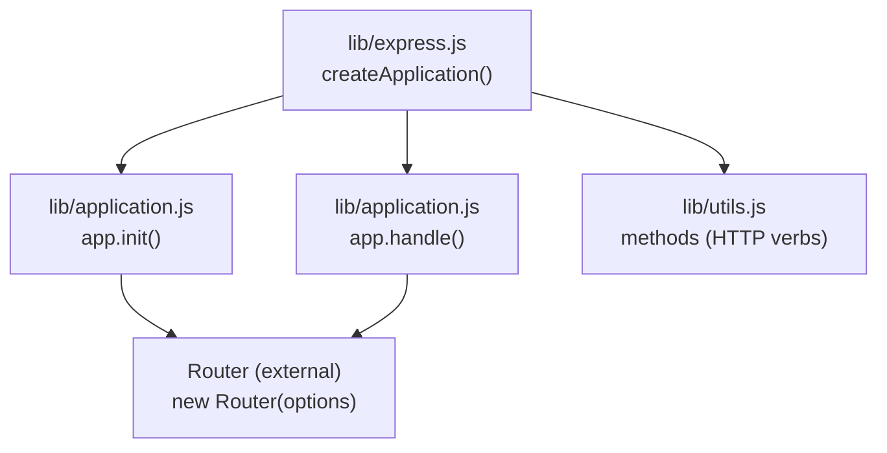
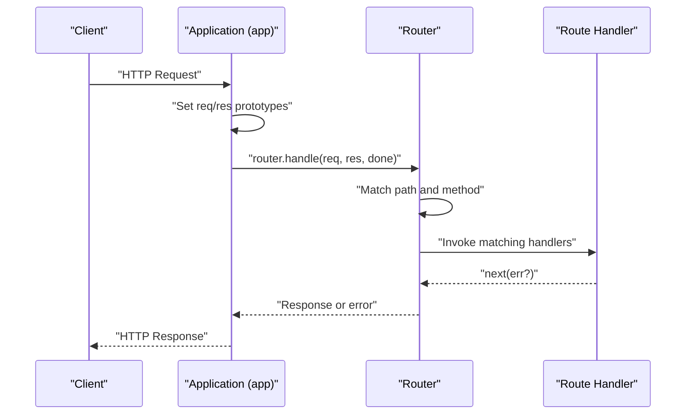
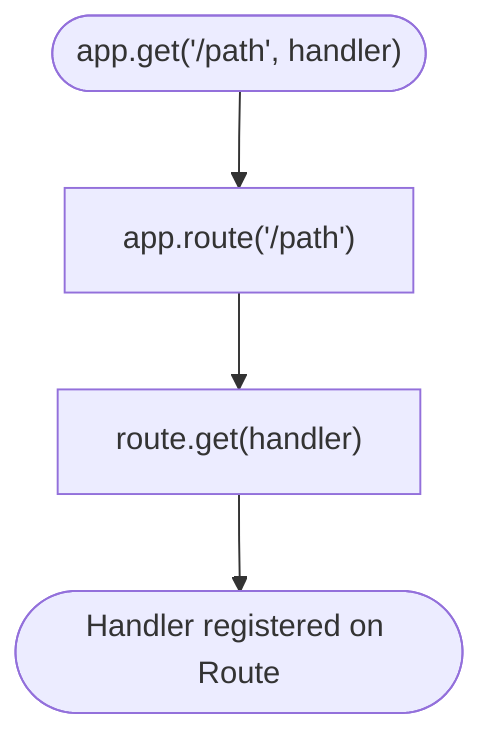
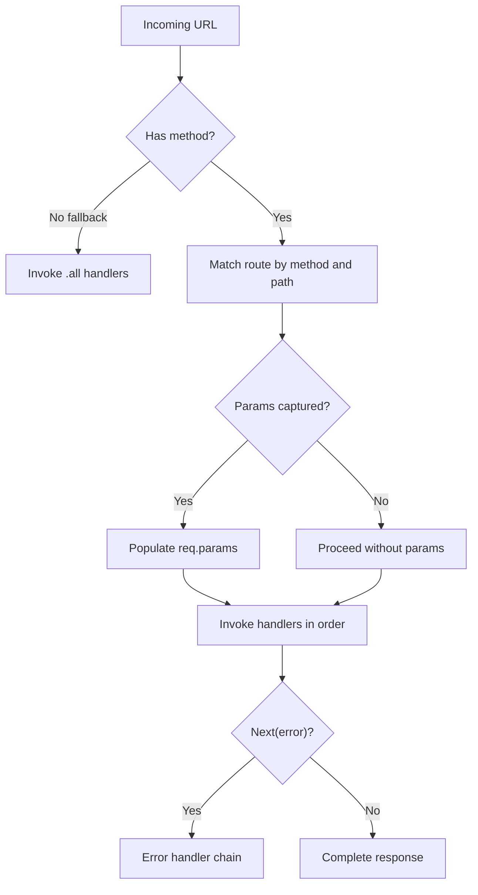
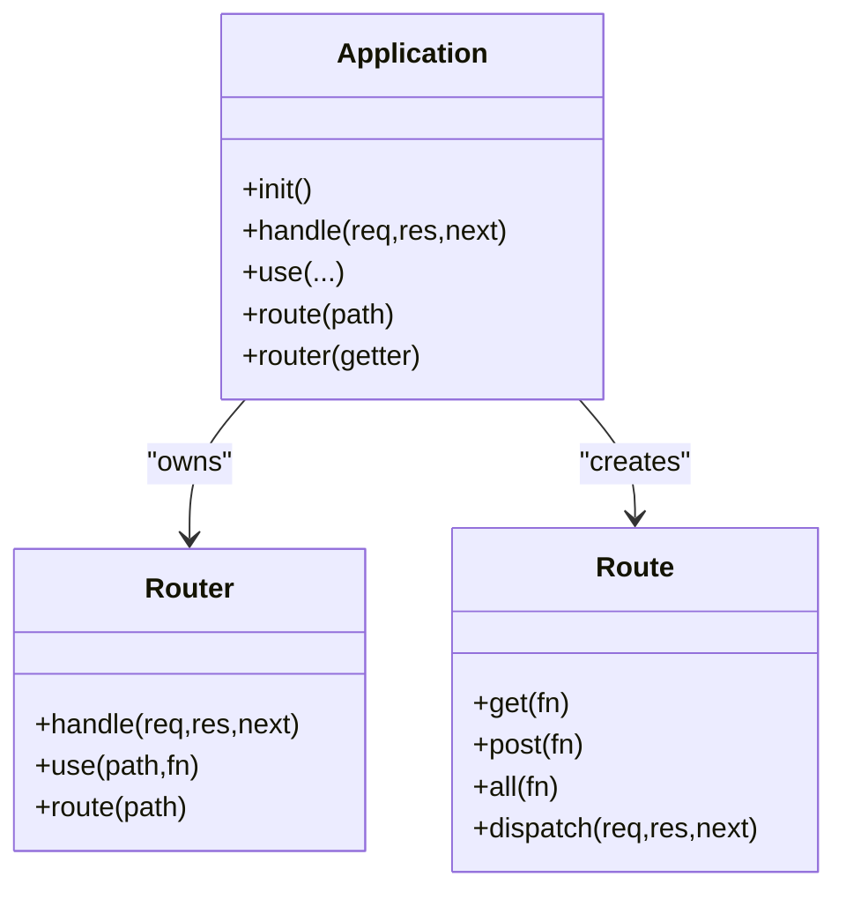
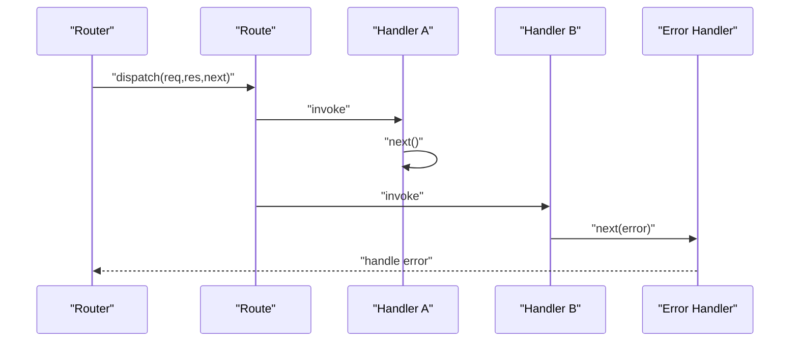
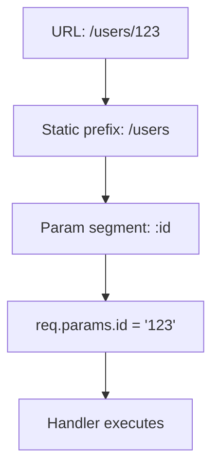
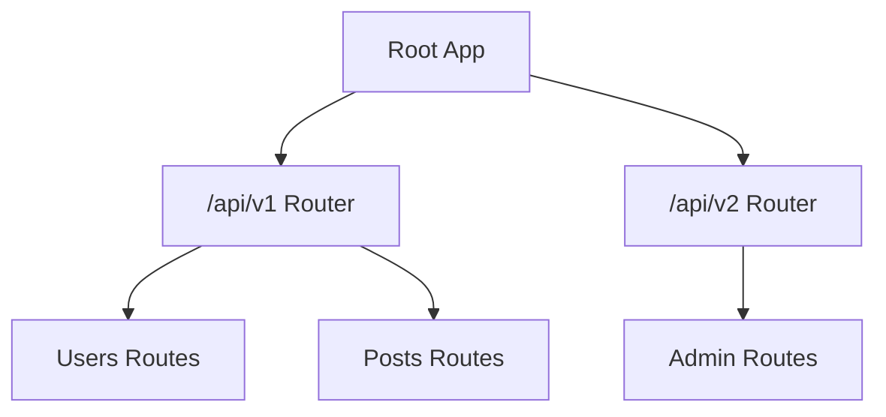
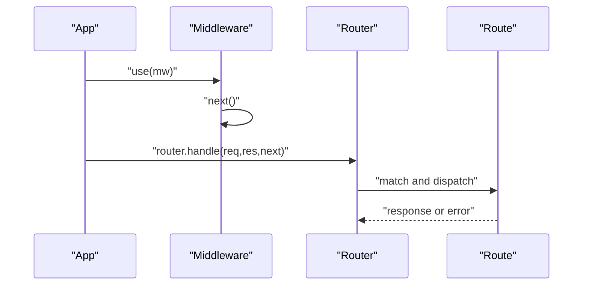
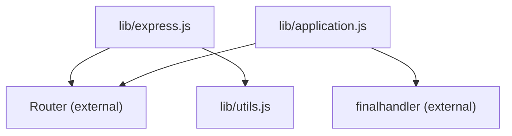

# Routing System Overview

<cite>
**Referenced Files in This Document**
- [express.js](file://lib/express.js)
- [application.js](file://lib/application.js)
- [utils.js](file://lib/utils.js)
- [Router.js](file://test/Router.js)
- [Route.js](file://test/Route.js)
- [hello-world/index.js](file://examples/hello-world/index.js)
- [params/index.js](file://examples/params/index.js)
- [multi-router/index.js](file://examples/multi-router/index.js)
- [route-separation/index.js](file://examples/route-separation/index.js)
- [route-middleware/index.js](file://examples/route-middleware/index.js)
- [resource/index.js](file://examples/resource/index.js)
- [route-map/index.js](file://examples/route-map/index.js)
</cite>

## Table of Contents
1. [Introduction](#introduction)
2. [Project Structure](#project-structure)
3. [Core Components](#core-components)
4. [Architecture Overview](#architecture-overview)
5. [Detailed Component Analysis](#detailed-component-analysis)
6. [Dependency Analysis](#dependency-analysis)
7. [Performance Considerations](#performance-considerations)
8. [Troubleshooting Guide](#troubleshooting-guide)
9. [Conclusion](#conclusion)
10. [Appendices](#appendices)

## Introduction
This document explains the Express.js routing system with a focus on HTTP verb-specific routing methods, path matching, and the Router integration with the application. It covers how app.get(), app.post(), app.put(), and other HTTP methods are delegated to the Router, how routes are registered and matched, and how middleware and handlers are integrated into the request/response flow. Practical examples demonstrate basic routing, parameter extraction, route composition, and advanced patterns such as optional segments and regular expression-like constructs.

## Project Structure
Express exposes a factory that creates an application instance and delegates routing to an internal Router. The application instance initializes a lazy-loaded router and forwards incoming requests to it. Utility helpers define supported HTTP methods, and tests illustrate Router and Route behavior.

**Diagram sources**
- [express.js:36-56](file://lib/express.js#L36-L56)
- [application.js:59-83](file://lib/application.js#L59-L83)
- [application.js:152-178](file://lib/application.js#L152-L178)
- [utils.js:29](file://lib/utils.js#L29)

**Section sources**
- [express.js:36-56](file://lib/express.js#L36-L56)
- [application.js:59-83](file://lib/application.js#L59-L83)
- [application.js:152-178](file://lib/application.js#L152-L178)
- [utils.js:29](file://lib/utils.js#L29)

## Core Components
- Application instance: Created by the factory and initialized with a lazy router. It sets up request/response prototypes, default configuration, and delegates request handling to the router.
- Router: An external module instantiated with options controlling case sensitivity and strictness. The application’s router getter lazily constructs it and applies settings.
- HTTP methods: Derived from Node’s HTTP methods and exposed to the application for verb-specific routing.
- Route: Returned by app.route(path); routes are isolated middleware stacks bound to a path.

Key behaviors:
- Verb delegation: app.get(), app.post(), app.put(), etc., delegate to app.route(path)[method](...).
- Route registration: app.route(path) returns a Route object; calling route[method](...) registers handlers for that method.
- Request handling: app.handle(req, res, done) sets up request/response prototypes and invokes router.handle(...).

**Section sources**
- [application.js:471-482](file://lib/application.js#L471-L482)
- [application.js:494-503](file://lib/application.js#L494-L503)
- [application.js:256-258](file://lib/application.js#L256-L258)
- [application.js:59-83](file://lib/application.js#L59-L83)
- [utils.js:29](file://lib/utils.js#L29)

## Architecture Overview
Express composes the application and router into a cohesive request pipeline. The application instance acts as a facade that configures defaults, exposes HTTP verb methods, and forwards requests to the Router. The Router manages path matching and handler invocation.

**Diagram sources**
- [application.js:152-178](file://lib/application.js#L152-L178)
- [Router.js:162-178](file://test/Router.js#L162-L178)

**Section sources**
- [application.js:152-178](file://lib/application.js#L152-L178)
- [Router.js:162-178](file://test/Router.js#L162-L178)

## Detailed Component Analysis

### HTTP Verb Methods and Delegation
Express dynamically exposes HTTP verb methods on the application by iterating over supported methods. Each verb method delegates to app.route(path)[method](...), enabling route registration with a fluent API.

**Diagram sources**
- [application.js:471-482](file://lib/application.js#L471-L482)
- [application.js:256-258](file://lib/application.js#L256-L258)

**Section sources**
- [application.js:471-482](file://lib/application.js#L471-L482)
- [application.js:256-258](file://lib/application.js#L256-L258)

### Path Matching and Route Registration
- Static paths: Exact string matches are supported and validated by tests.
- Parameterized routes: Dynamic segments are captured via parameter placeholders and made available on req.params.
- Nested routers: Routers can be mounted under prefixes, enabling modular composition.
- Fallback and wildcard behavior: Tests demonstrate handling of missing URLs and middleware that matches any path.

**Diagram sources**
- [Router.js:162-178](file://test/Router.js#L162-L178)
- [Router.js:31-42](file://test/Router.js#L31-L42)
- [Router.js:433-498](file://test/Router.js#L433-L498)

**Section sources**
- [Router.js:162-178](file://test/Router.js#L162-L178)
- [Router.js:31-42](file://test/Router.js#L31-L42)
- [Router.js:433-498](file://test/Router.js#L433-L498)

### Router Class and Integration
- Lazy initialization: The application’s router getter constructs a Router instance with options derived from application settings (case sensitivity, strict routing).
- Mounting: app.use(path, fn) proxies to router.use; mounting nested applications adjusts req/res prototypes during handling.
- Route isolation: app.route(path) returns a Route object that encapsulates handlers for a specific path.

**Diagram sources**
- [application.js:59-83](file://lib/application.js#L59-L83)
- [application.js:190-244](file://lib/application.js#L190-L244)
- [application.js:256-258](file://lib/application.js#L256-L258)
- [Router.js:9-18](file://test/Router.js#L9-L18)
- [Route.js:9-14](file://test/Route.js#L9-L14)

**Section sources**
- [application.js:59-83](file://lib/application.js#L59-L83)
- [application.js:190-244](file://lib/application.js#L190-L244)
- [application.js:256-258](file://lib/application.js#L256-L258)
- [Router.js:9-18](file://test/Router.js#L9-L18)
- [Route.js:9-14](file://test/Route.js#L9-L14)

### Route Handlers and Execution Order
- Method-specific handlers: route.get(...) registers a handler for GET; route.post(...) for POST, and so on.
- Stack ordering: Multiple handlers can be registered; they execute in sequence, supporting fall-through via next().
- Error handling: Handlers can signal errors; error-handling middleware with four arguments receives and can process them.

**Diagram sources**
- [Route.js:106-168](file://test/Route.js#L106-L168)
- [Route.js:170-245](file://test/Route.js#L170-L245)

**Section sources**
- [Route.js:106-168](file://test/Route.js#L106-L168)
- [Route.js:170-245](file://test/Route.js#L170-L245)

### Route Parameters and Advanced Patterns
- Parameter extraction: Dynamic segments populate req.params; tests validate parameter capture and middleware parameter hooks.
- Parameter middleware: app.param(name, fn) allows pre-processing parameter values before route handlers.
- Optional segments and regex-like patterns: Examples demonstrate compact patterns and range-like segments.

**Diagram sources**
- [params/index.js:34-41](file://examples/params/index.js#L34-L41)
- [Router.js:511-542](file://test/Router.js#L511-L542)

**Section sources**
- [params/index.js:34-41](file://examples/params/index.js#L34-L41)
- [Router.js:511-542](file://test/Router.js#L511-L542)

### Route Composition and Modularization
- Multi-router composition: Mount separate routers under distinct prefixes to organize APIs.
- Route separation: Split routes across modules and compose them in the main application.
- Route mapping utility: A recursive map utility demonstrates programmatic route definition.

**Diagram sources**
- [multi-router/index.js:7-8](file://examples/multi-router/index.js#L7-L8)
- [route-separation/index.js:38-50](file://examples/route-separation/index.js#L38-L50)
- [route-map/index.js:14-29](file://examples/route-map/index.js#L14-L29)

**Section sources**
- [multi-router/index.js:7-8](file://examples/multi-router/index.js#L7-L8)
- [route-separation/index.js:38-50](file://examples/route-separation/index.js#L38-L50)
- [route-map/index.js:14-29](file://examples/route-map/index.js#L14-L29)

### Middleware Integration and Request/Response Flow
- Middleware: app.use(path, fn) installs middleware; nested apps are mounted with adjusted req/res prototypes.
- Route middleware: Route handlers can be chained; route-middleware example shows combining parameter loading and authorization checks.
- Resource-style helpers: app.resource demonstrates composing multiple routes for CRUD-like behavior.

**Diagram sources**
- [application.js:190-244](file://lib/application.js#L190-L244)
- [route-middleware/index.js:25-58](file://examples/route-middleware/index.js#L25-L58)
- [resource/index.js:13-26](file://examples/resource/index.js#L13-L26)

**Section sources**
- [application.js:190-244](file://lib/application.js#L190-L244)
- [route-middleware/index.js:25-58](file://examples/route-middleware/index.js#L25-L58)
- [resource/index.js:13-26](file://examples/resource/index.js#L13-L26)

## Dependency Analysis
Express depends on:
- Router (external): Provides the routing engine for path/method matching and handler execution.
- Utils: Supplies the list of supported HTTP methods and other helpers.
- Finalhandler: Used by app.handle to finalize responses and errors when no callback is provided.

**Diagram sources**
- [express.js:19](file://lib/express.js#L19)
- [utils.js:29](file://lib/utils.js#L29)
- [application.js:16](file://lib/application.js#L16)
- [application.js:152-178](file://lib/application.js#L152-L178)

**Section sources**
- [express.js:19](file://lib/express.js#L19)
- [utils.js:29](file://lib/utils.js#L29)
- [application.js:16](file://lib/application.js#L16)
- [application.js:152-178](file://lib/application.js#L152-L178)

## Performance Considerations
- Large route sets: Tests confirm robust handling of thousands of registered routes and stacked middleware without stack overflow.
- Middleware stacking: Chains of synchronous middleware execute efficiently; asynchronous steps should use next() appropriately.
- Parameter processing: Parameter hooks execute once per request and per parameter occurrence, minimizing redundant work.

**Section sources**
- [Router.js:91-106](file://test/Router.js#L91-L106)
- [Router.js:108-133](file://test/Router.js#L108-L133)
- [Router.js:544-569](file://test/Router.js#L544-L569)

## Troubleshooting Guide
Common issues and resolutions:
- No matching route: Ensure the URL and method match registered routes; fallback handlers or .all can capture unmatched requests.
- Parameter parsing errors: Validate parameter values in app.param; return errors to trigger error-handling middleware.
- Middleware not invoked: Confirm app.use path prefix matches the request path and that next() is called to continue the chain.
- Mounted app prototype mismatch: When mounting nested apps, ensure req/res prototypes are restored after handling.

**Section sources**
- [Router.js:208-291](file://test/Router.js#L208-L291)
- [Router.js:511-542](file://test/Router.js#L511-L542)
- [application.js:229-241](file://lib/application.js#L229-L241)

## Conclusion
Express’s routing system centers on an application facade that delegates to a Router for path and method matching. Verb-specific methods register handlers on isolated Route objects, while middleware and parameter hooks integrate seamlessly into the request lifecycle. Tests validate correctness across static paths, parameterized routes, nested routers, and error handling, ensuring predictable behavior at scale.

## Appendices

### Practical Examples Index
- Basic routing: [hello-world/index.js:7-9](file://examples/hello-world/index.js#L7-L9)
- Parameter extraction: [params/index.js:34-41](file://examples/params/index.js#L34-L41)
- Multi-router composition: [multi-router/index.js:7-8](file://examples/multi-router/index.js#L7-L8)
- Route separation: [route-separation/index.js:38-50](file://examples/route-separation/index.js#L38-L50)
- Route middleware: [route-middleware/index.js:25-58](file://examples/route-middleware/index.js#L25-L58)
- Resource-style routes: [resource/index.js:13-26](file://examples/resource/index.js#L13-L26)
- Programmatic route mapping: [route-map/index.js:14-29](file://examples/route-map/index.js#L14-L29)