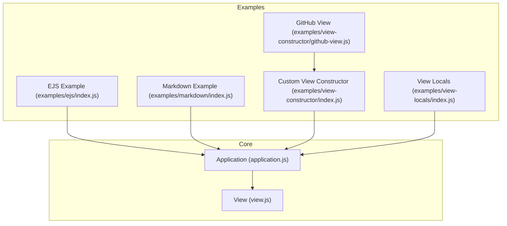
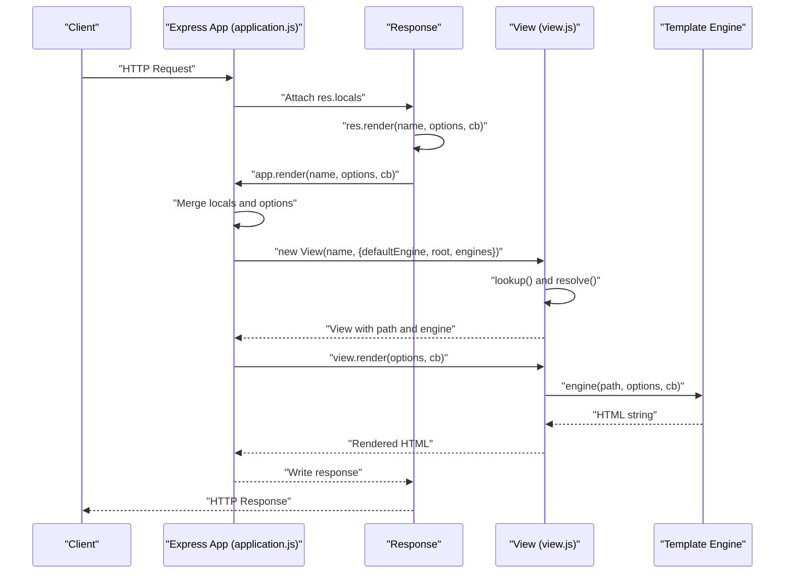
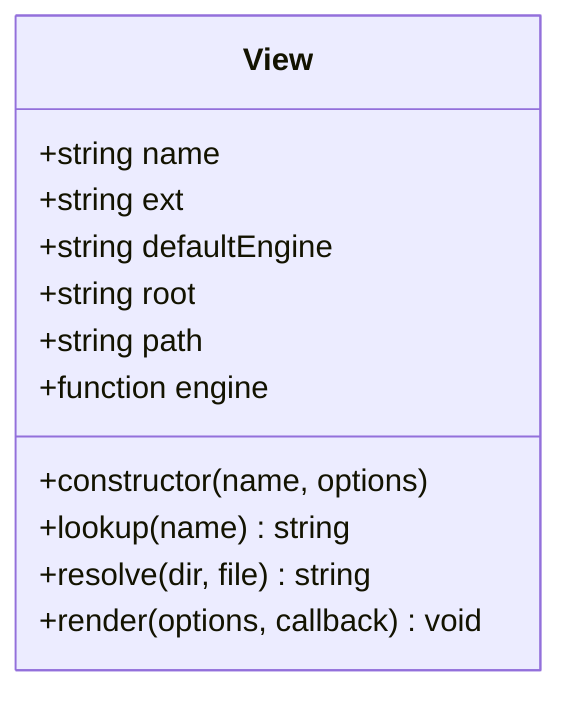
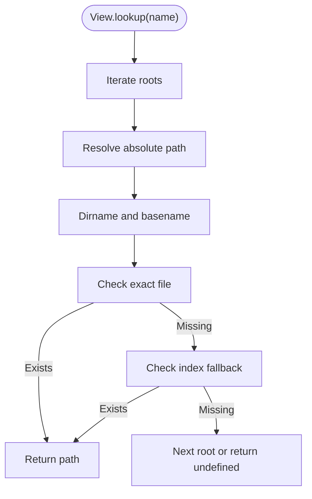
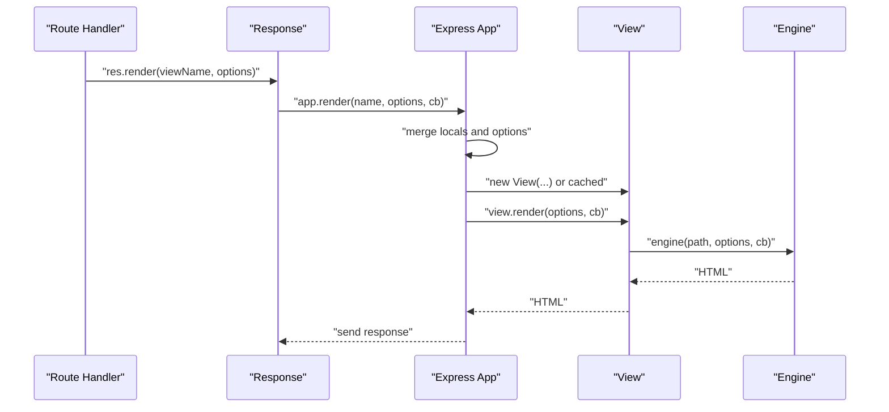
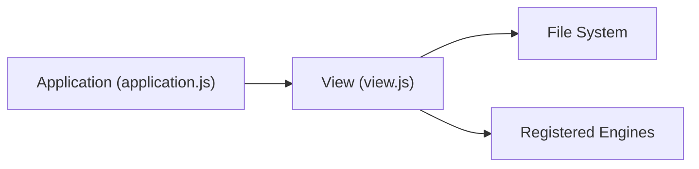

# Template Integration

<cite>
**Referenced Files in This Document**
- [view.js](file://lib/view.js)
- [application.js](file://lib/application.js)
- [index.js](file://examples/ejs/index.js)
- [index.js](file://examples/view-constructor/index.js)
- [github-view.js](file://examples/view-constructor/github-view.js)
- [index.js](file://examples/view-locals/index.js)
- [index.ejs](file://examples/view-locals/views/index.ejs)
- [index.md](file://examples/markdown/views/index.md)
- [index.js](file://examples/markdown/index.js)
- [app.engine.js](file://test/app.engine.js)
</cite>

## Table of Contents
1. [Introduction](#introduction)
2. [Project Structure](#project-structure)
3. [Core Components](#core-components)
4. [Architecture Overview](#architecture-overview)
5. [Detailed Component Analysis](#detailed-component-analysis)
6. [Dependency Analysis](#dependency-analysis)
7. [Performance Considerations](#performance-considerations)
8. [Troubleshooting Guide](#troubleshooting-guide)
9. [Conclusion](#conclusion)
10. [Appendices](#appendices)

## Introduction
This document explains Express.js template integration with a focus on the view system and template engine support. It covers how the view constructor resolves and renders templates, how app.engine registers engines, how templates are located and compiled, and how view context and locals are passed to templates. Practical examples demonstrate engine registration, rendering, and custom view constructors. We also address caching, performance, error handling, and the relationship between views and static assets.

## Project Structure
Express’s template system centers around two core modules:
- Application-level APIs for configuration and rendering
- A view class responsible for locating, loading, and rendering templates via registered engines

Key areas in this repository:
- Core modules: lib/application.js, lib/view.js
- Examples demonstrating EJS, Markdown, and custom view constructors
- Tests validating engine registration and rendering behavior

**Diagram sources**
- [application.js](file://lib/application.js)
- [view.js](file://lib/view.js)
- [index.js](file://examples/ejs/index.js)
- [index.js](file://examples/markdown/index.js)
- [index.js](file://examples/view-constructor/index.js)
- [github-view.js](file://examples/view-constructor/github-view.js)
- [index.js](file://examples/view-locals/index.js)

**Section sources**
- [application.js](file://lib/application.js)
- [view.js](file://lib/view.js)

## Core Components
- View constructor: Handles extension resolution, engine loading, and path lookup. It supports default engines and caches engines per extension.
- Application rendering pipeline: Merges app.locals, res.locals, and route-provided options; optionally caches View instances; delegates rendering to the View instance.
- Engine registration: app.engine maps file extensions to rendering functions, supporting both leading dot and bare extension forms.

Key behaviors:
- Extension handling: Ensures a leading dot for internal storage and resolution.
- Engine discovery: Requires engines to expose a callable compatible with Express’s signature.
- View lookup: Resolves absolute paths from configured roots and supports “index” fallbacks.
- Rendering: Normalizes synchronous engine callbacks to asynchronous completion via callbacks.

**Section sources**
- [view.js:52-95](file://lib/view.js#L52-L95)
- [view.js:104-123](file://lib/view.js#L104-L123)
- [view.js:133-159](file://lib/view.js#L133-L159)
- [application.js:294-308](file://lib/application.js#L294-L308)
- [application.js:522-575](file://lib/application.js#L522-L575)

## Architecture Overview
The rendering flow connects route handlers to the view system and template engines.

**Diagram sources**
- [application.js:522-575](file://lib/application.js#L522-L575)
- [view.js:104-123](file://lib/view.js#L104-L123)
- [view.js:133-159](file://lib/view.js#L133-L159)

## Detailed Component Analysis

### View Constructor and Resolution
The View constructor:
- Stores defaultEngine, extension, name, and root
- Infers extension from defaultEngine if none provided
- Loads engines on demand using require and caches them by extension
- Performs lookup across configured roots and resolves index fallbacks

**Diagram sources**
- [view.js:52-95](file://lib/view.js#L52-L95)
- [view.js:104-123](file://lib/view.js#L104-L123)
- [view.js:133-159](file://lib/view.js#L133-L159)

**Section sources**
- [view.js:52-95](file://lib/view.js#L52-L95)
- [view.js:104-123](file://lib/view.js#L104-L123)
- [view.js:133-159](file://lib/view.js#L133-L159)

### app.engine Registration
app.engine associates a file extension with a rendering function. It:
- Validates that the second argument is a function
- Normalizes the extension to include a leading dot
- Stores the engine in the app’s engines registry

Practical examples:
- Registering EJS for .html files
- Registering a custom Markdown engine
- Using Consolidate.js to normalize engine signatures

**Section sources**
- [application.js:294-308](file://lib/application.js#L294-L308)
- [index.js:23-23](file://examples/ejs/index.js#L23-L23)
- [index.js:14-24](file://examples/view-constructor/index.js#L14-L24)
- [app.engine.js:18-30](file://test/app.engine.js#L18-L30)

### View Lookup and Compilation
Lookup and resolve:
- lookup iterates roots and resolves absolute paths
- resolve checks for exact matches and falls back to index.<ext> within directories
- The engine is invoked with the resolved path and merged options

**Diagram sources**
- [view.js:104-123](file://lib/view.js#L104-L123)
- [view.js:169-187](file://lib/view.js#L169-L187)

**Section sources**
- [view.js:104-123](file://lib/view.js#L104-L123)
- [view.js:169-187](file://lib/view.js#L169-L187)

### Rendering Pipeline and Response Integration
app.render merges locals and options, optionally caches View instances, constructs a View if needed, and invokes the engine. The response integrates rendering via res.render, which delegates to app.render.

**Diagram sources**
- [application.js:522-575](file://lib/application.js#L522-L575)
- [view.js:133-159](file://lib/view.js#L133-L159)

**Section sources**
- [application.js:522-575](file://lib/application.js#L522-L575)
- [view.js:133-159](file://lib/view.js#L133-L159)

### Popular Template Engines and Defaults
- EJS: Demonstrated by registering an engine for .html and rendering a view with locals.
- Markdown: Demonstrated by registering a custom .md engine and rendering Markdown to HTML.
- Handlebars: Demonstrated by rendering .hbs templates in MVC examples.

Note: While EJS and Handlebars are commonly used, this repository’s examples illustrate their usage patterns and how to integrate them with Express’s view system.

**Section sources**
- [index.js:23-51](file://examples/ejs/index.js#L23-L51)
- [index.js:14-24](file://examples/markdown/index.js#L14-L24)
- [index.md:1-4](file://examples/markdown/views/index.md#L1-L4)

### View Context and Locals Passing
Locals precedence and merging:
- app.locals: application-wide
- res.locals: per-request
- route-provided options: per-render

The final render options are formed by merging these sources, with route options taking precedence.

Practical example:
- Middleware populating res.locals or req properties for reuse across routes
- Passing filtered data and computed values to templates

**Section sources**
- [application.js:536-541](file://lib/application.js#L536-L541)
- [index.js:26-38](file://examples/view-locals/index.js#L26-L38)
- [index.js:64-70](file://examples/view-locals/index.js#L64-L70)
- [index.js:102-108](file://examples/view-locals/index.js#L102-L108)
- [index.ejs:1-21](file://examples/view-locals/views/index.ejs#L1-L21)

### Custom View Constructors
Express allows replacing the default View class with a custom implementation. The GitHub View example demonstrates:
- Overriding path resolution to fetch templates from remote sources
- Delegating rendering to the appropriate engine after fetching content

This pattern enables dynamic or distributed template sources.

**Section sources**
- [index.js:27-37](file://examples/view-constructor/index.js#L27-L37)
- [github-view.js:23-53](file://examples/view-constructor/github-view.js#L23-L53)

### Layout Systems and Template Inheritance Patterns
While this repository does not include a dedicated layout engine, templates commonly implement composition via includes/partials. Examples:
- Using include directives to compose headers, footers, and shared partials
- Organizing templates into nested directories with index fallbacks

These patterns help achieve layout-like behavior without a dedicated templating framework.

**Section sources**
- [index.js:1-4](file://examples/error-pages/index.js#L1-L4)

## Dependency Analysis
The view system depends on:
- Application configuration for view engine and views directory
- Registered engines mapped by extension
- File system for template resolution and index fallbacks

**Diagram sources**
- [application.js:536-575](file://lib/application.js#L536-L575)
- [view.js:104-123](file://lib/view.js#L104-L123)
- [view.js:133-159](file://lib/view.js#L133-L159)

**Section sources**
- [application.js:536-575](file://lib/application.js#L536-L575)
- [view.js:104-123](file://lib/view.js#L104-L123)
- [view.js:133-159](file://lib/view.js#L133-L159)

## Performance Considerations
- View caching: Enabling the view cache setting stores View instances to avoid repeated construction and lookup costs.
- Engine caching: Engines are cached per extension to avoid repeated require operations.
- Minimizing synchronous work inside engines to prevent blocking the event loop.
- Prefer asynchronous file I/O and network requests in custom engines.

**Section sources**
- [application.js:539-541](file://lib/application.js#L539-L541)
- [application.js:568-571](file://lib/application.js#L568-L571)
- [view.js:75-88](file://lib/view.js#L75-L88)

## Troubleshooting Guide
Common issues and resolutions:
- Missing default engine and no extension: Ensure either a default engine is set or the view name includes an extension.
- Engine not found: Verify app.engine registration for the extension and that the engine exposes a compatible function.
- View not found: Confirm the views directory setting and that the template exists relative to the configured root(s).
- Rendering errors: Wrap rendering in error-handling middleware to capture exceptions thrown during rendering.

Debugging tips:
- Use debug logs for view resolution and engine loading.
- Validate locals merging and ensure expected keys are present.
- Test engine registration with minimal fixtures.

**Section sources**
- [view.js:60-62](file://lib/view.js#L60-L62)
- [application.js:558-565](file://lib/application.js#L558-L565)
- [app.engine.js:32-37](file://test/app.engine.js#L32-L37)

## Conclusion
Express’s view system provides a flexible, extensible foundation for template rendering. The View constructor handles resolution and compilation, app.engine enables registration of any compatible template engine, and app.render orchestrates locals merging and caching. With custom view constructors, you can adapt the system to diverse template sources. Proper configuration of view engines, views directories, and locals ensures robust and maintainable rendering workflows.

## Appendices

### Practical Examples Index
- EJS with .html extension mapping and static asset serving
- Markdown engine registration and rendering
- Custom GitHub-backed view constructor
- Locals management via middleware and res.locals

**Section sources**
- [index.js:23-51](file://examples/ejs/index.js#L23-L51)
- [index.js:14-24](file://examples/markdown/index.js#L14-L24)
- [index.js:14-37](file://examples/view-constructor/index.js#L14-L37)
- [index.js:26-108](file://examples/view-locals/index.js#L26-L108)