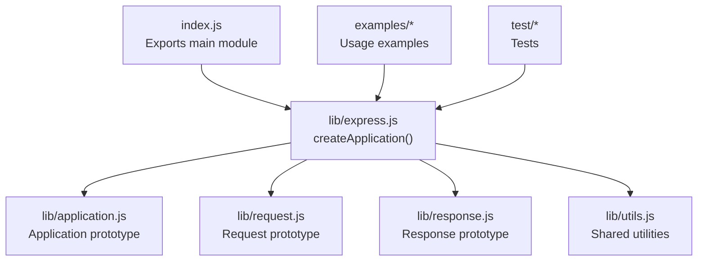
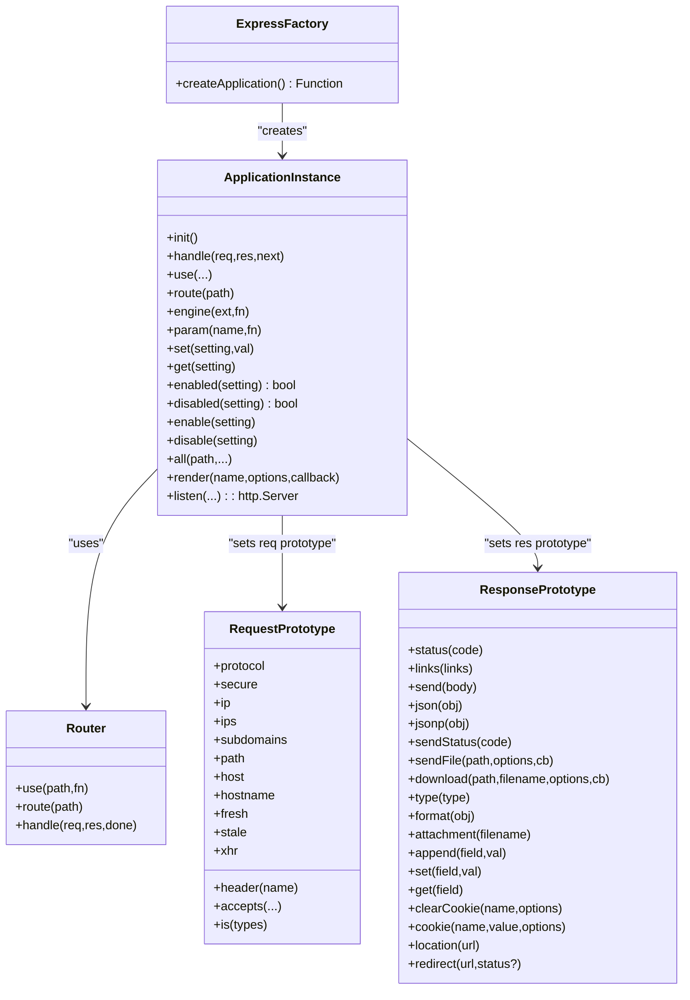
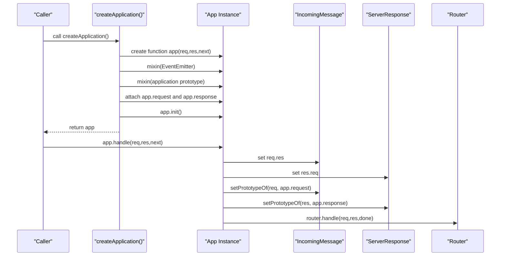
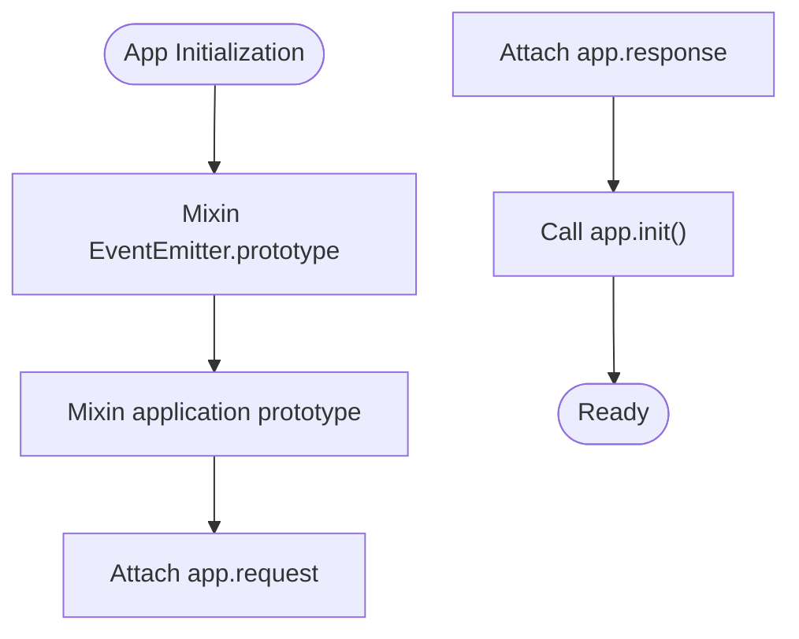
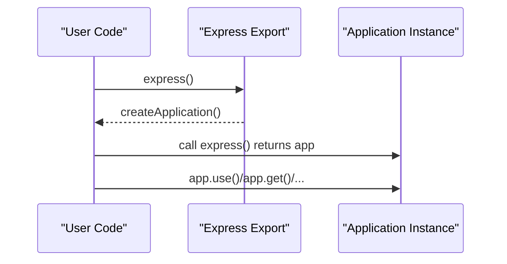
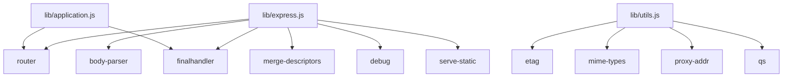

# Application Architecture

<cite>
**Referenced Files in This Document**
- [index.js](file://index.js)
- [package.json](file://package.json)
- [lib/express.js](file://lib/express.js)
- [lib/application.js](file://lib/application.js)
- [lib/request.js](file://lib/request.js)
- [lib/response.js](file://lib/response.js)
- [lib/utils.js](file://lib/utils.js)
- [examples/hello-world/index.js](file://examples/hello-world/index.js)
- [examples/multi-router/index.js](file://examples/multi-router/index.js)
- [examples/mvc/index.js](file://examples/mvc/index.js)
- [test/app.js](file://test/app.js)
- [test/exports.js](file://test/exports.js)
- [test/app.response.js](file://test/app.response.js)
- [test/app.request.js](file://test/app.request.js)
</cite>

## Table of Contents
1. [Introduction](#introduction)
2. [Project Structure](#project-structure)
3. [Core Components](#core-components)
4. [Architecture Overview](#architecture-overview)
5. [Detailed Component Analysis](#detailed-component-analysis)
6. [Dependency Analysis](#dependency-analysis)
7. [Performance Considerations](#performance-considerations)
8. [Troubleshooting Guide](#troubleshooting-guide)
9. [Conclusion](#conclusion)
10. [Appendices](#appendices)

## Introduction
This document explains the Express.js application architecture with a focus on how the framework initializes and exposes its application instance. It covers the createApplication function, prototype inheritance patterns, the relationship between the main Express function and application instances, the mixin pattern used to combine EventEmitter and application functionality, and how the application object serves as both a function and an event emitter. Practical examples demonstrate instantiation, configuration, and initialization, and the architectural decisions that enable extensibility through prototype-based enhancement.

## Project Structure
Express is organized around a small set of core modules:
- Entry point exports the main Express factory function.
- The factory creates an application instance that inherits both application behavior and EventEmitter capabilities.
- Request and response prototypes are attached to each application instance to augment req/res objects.
- Utilities provide shared helpers for HTTP methods, ETag generation, query parsing, trust proxy compilation, and content-type normalization.

**Diagram sources**
- [index.js:1-12](file://index.js#L1-L12)
- [lib/express.js:1-82](file://lib/express.js#L1-L82)
- [lib/application.js:1-632](file://lib/application.js#L1-L632)
- [lib/request.js:1-528](file://lib/request.js#L1-L528)
- [lib/response.js:1-1048](file://lib/response.js#L1-L1048)
- [lib/utils.js:1-272](file://lib/utils.js#L1-L272)

**Section sources**
- [index.js:1-12](file://index.js#L1-L12)
- [package.json:1-100](file://package.json#L1-L100)

## Core Components
- Express factory: The main export is a function that creates application instances.
- Application instance: A function that delegates to app.handle, with EventEmitter and application methods mixed in.
- Request and response prototypes: Object templates attached to each app to augment req/res objects.
- Router: Integrated into the application to manage routes and middleware.
- Utilities: Shared helpers for HTTP methods, ETag, query parsing, trust proxy, and content-type normalization.

Key responsibilities:
- createApplication builds the app function, mixes in EventEmitter and application methods, attaches request/response prototypes, initializes settings, and returns the app.
- app.handle orchestrates request lifecycle, sets req/res circular references, adjusts req/res prototypes, and delegates to the internal router.
- app.use integrates middleware and nested applications into the router.
- app.listen creates an HTTP server and binds the app as its request handler.

**Section sources**
- [lib/express.js:27-56](file://lib/express.js#L27-L56)
- [lib/application.js:59-83](file://lib/application.js#L59-L83)
- [lib/application.js:152-178](file://lib/application.js#L152-L178)
- [lib/application.js:190-244](file://lib/application.js#L190-L244)
- [lib/application.js:598-606](file://lib/application.js#L598-L606)

## Architecture Overview
Express uses a prototype-based architecture with composition via mixins:
- The application instance is a function that delegates to app.handle.
- EventEmitter capabilities are mixed in so the app can emit and listen for events.
- The application prototype is mixed in to provide HTTP verb methods, settings, rendering, and lifecycle hooks.
- Request and response prototypes are attached to each app and used to set the prototype chain for req/res objects during request handling.

**Diagram sources**
- [lib/express.js:36-56](file://lib/express.js#L36-L56)
- [lib/application.js:40-632](file://lib/application.js#L40-L632)
- [lib/request.js:30-528](file://lib/request.js#L30-L528)
- [lib/response.js:42-1048](file://lib/response.js#L42-L1048)

## Detailed Component Analysis

### createApplication and Application Instance Creation
The createApplication function constructs the application instance:
- Creates a function app that delegates to app.handle.
- Mixes in EventEmitter.prototype so the app can emit and listen for events.
- Mixes in the application prototype to provide HTTP verb methods, settings, rendering, and lifecycle hooks.
- Attaches request and response prototypes to the app, with each prototype containing an app property pointing back to the app.
- Calls app.init to initialize settings, cache, engines, and the lazy-loaded router.

**Diagram sources**
- [lib/express.js:36-56](file://lib/express.js#L36-L56)
- [lib/application.js:59-83](file://lib/application.js#L59-L83)
- [lib/application.js:152-178](file://lib/application.js#L152-L178)

**Section sources**
- [lib/express.js:36-56](file://lib/express.js#L36-L56)
- [lib/application.js:59-83](file://lib/application.js#L59-L83)

### Prototype Inheritance Patterns and Mixin Behavior
Express uses merge-descriptors to mix properties from multiple sources into the app object:
- app.request and app.response are created from request and response prototypes respectively, with each prototype’s app property bound to the current app.
- During request handling, app.handle sets the prototype chain of req and res to app.request and app.response, enabling method delegation and property access on req/res.

**Diagram sources**
- [lib/express.js:41-52](file://lib/express.js#L41-L52)
- [lib/application.js:44-52](file://lib/application.js#L44-L52)

**Section sources**
- [lib/express.js:41-52](file://lib/express.js#L41-L52)
- [lib/application.js:168-170](file://lib/application.js#L168-L170)

### Relationship Between Main Express Function and Application Instances
The main Express export is the createApplication function itself. When a user calls express(), they receive an application instance configured with EventEmitter and application methods, and with request/response prototypes attached.

**Diagram sources**
- [index.js:11](file://index.js#L11)
- [lib/express.js:27](file://lib/express.js#L27)

**Section sources**
- [index.js:11](file://index.js#L11)
- [lib/express.js:27](file://lib/express.js#L27)

### Application Object as Both Function and Event Emitter
The application instance is a function because it is the request handler for an HTTP server. It also inherits EventEmitter methods, enabling event-driven patterns such as mount events and custom application-level events.

Practical implications:
- app.listen returns an http.Server and uses the app function as its request handler.
- app.on and app.emit can be used to register and trigger application-level events.
- Mounted sub-applications emit a mount event to notify parents of mounting.

**Section sources**
- [lib/application.js:598-606](file://lib/application.js#L598-L606)
- [lib/application.js:109-122](file://lib/application.js#L109-L122)
- [test/app.js:8-12](file://test/app.js#L8-L12)

### Practical Examples of Instantiation, Configuration, and Initialization
- Hello world example demonstrates basic instantiation, route definition, and server startup.
- Multi-router example shows mounting multiple sub-applications under different paths.
- MVC example demonstrates advanced configuration including template engine setup, middleware registration, custom response methods, and error handling.

Example references:
- Basic instantiation and listening: [examples/hello-world/index.js:5-15](file://examples/hello-world/index.js#L5-L15)
- Mounting sub-applications: [examples/multi-router/index.js:7-12](file://examples/multi-router/index.js#L7-L12)
- Advanced configuration and middleware: [examples/mvc/index.js:17-89](file://examples/mvc/index.js#L17-L89)

**Section sources**
- [examples/hello-world/index.js:5-15](file://examples/hello-world/index.js#L5-L15)
- [examples/multi-router/index.js:7-12](file://examples/multi-router/index.js#L7-L12)
- [examples/mvc/index.js:17-89](file://examples/mvc/index.js#L17-L89)

### Extensibility Through Prototype-Based Enhancement
Express enables extensibility by exposing prototypes for application, request, and response:
- express.application allows adding methods to all application instances.
- express.request and express.response allow adding methods to req and res objects for all instances.
- Tests demonstrate that modifications to these prototypes take effect only for the specific app or inherited by sub-applications.

Examples:
- Extending application prototype: [test/exports.js:52-55](file://test/exports.js#L52-L55)
- Extending request prototype: [test/app.request.js:9-23](file://test/app.request.js#L9-L23)
- Extending response prototype: [test/app.response.js:9-23](file://test/app.response.js#L9-L23)

**Section sources**
- [test/exports.js:52-55](file://test/exports.js#L52-L55)
- [test/app.request.js:9-23](file://test/app.request.js#L9-L23)
- [test/app.response.js:9-23](file://test/app.response.js#L9-L23)

## Dependency Analysis
Express depends on several Node.js and community packages:
- Router: Provides route reflection and middleware composition.
- Body parser: Middleware for parsing request bodies.
- Merge descriptors: Utility for mixing properties into objects.
- Final handler: Default error handler for unhandled errors.
- Debug: Logging utility.
- Serve static: Static file serving middleware.

**Diagram sources**
- [lib/express.js:15-21](file://lib/express.js#L15-L21)
- [lib/application.js:16-26](file://lib/application.js#L16-L26)
- [lib/utils.js:15-22](file://lib/utils.js#L15-L22)
- [package.json:34-62](file://package.json#L34-L62)

**Section sources**
- [package.json:34-62](file://package.json#L34-L62)

## Performance Considerations
- Lazy router creation: The router is created on first access, reducing initial overhead for apps that do not immediately use routing.
- Prototype-based delegation: Method calls on req/res are delegated via prototype chain, minimizing per-request allocations.
- ETag generation: Configurable ETag functions allow balancing correctness and performance.
- Query parsing: Configurable query parser functions allow choosing between simple and extended parsing strategies.

[No sources needed since this section provides general guidance]

## Troubleshooting Guide
Common issues and diagnostics:
- Missing routes result in 404 responses by default.
- Incorrect middleware registration order can prevent routes from firing.
- Improperly configured trust proxy settings can cause incorrect protocol detection and IP resolution.
- Template rendering failures often indicate missing view engine or incorrect view paths.

Diagnostic references:
- Default 404 behavior: [test/app.js:19-23](file://test/app.js#L19-L23)
- Environment-dependent settings: [lib/application.js:138-141](file://lib/application.js#L138-L141)
- Rendering error handling: [lib/application.js:562-565](file://lib/application.js#L562-L565)

**Section sources**
- [test/app.js:19-23](file://test/app.js#L19-L23)
- [lib/application.js:138-141](file://lib/application.js#L138-L141)
- [lib/application.js:562-565](file://lib/application.js#L562-L565)

## Conclusion
Express’s architecture centers on a compact, extensible application instance created by createApplication. The app is both a function and an event emitter, inheriting application behavior and request/response prototypes. The mixin pattern and prototype-based delegation enable powerful customization while maintaining simplicity. The examples and tests illustrate practical instantiation, configuration, and extensibility patterns that form the foundation of Express applications.

[No sources needed since this section summarizes without analyzing specific files]

## Appendices

### Appendix A: HTTP Methods and Verb Proxies
The application prototype defines HTTP verb proxies that delegate to the router. These methods are dynamically added for each supported HTTP method.

**Section sources**
- [lib/application.js:471-482](file://lib/application.js#L471-L482)

### Appendix B: Settings and Configuration Lifecycle
The application initializes default settings and registers mount-time inheritance behavior to propagate parent configurations to child apps.

**Section sources**
- [lib/application.js:90-141](file://lib/application.js#L90-L141)

### Appendix C: Request and Response Prototypes
Request and response prototypes provide rich APIs for parsing, validation, and response generation. They are attached to each application instance and used to set the prototype chain for req/res objects during request handling.

**Section sources**
- [lib/request.js:30](file://lib/request.js#L30)
- [lib/response.js:42](file://lib/response.js#L42)