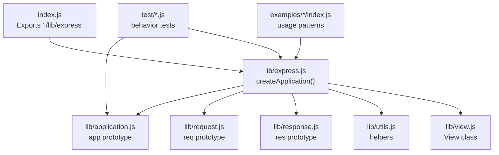
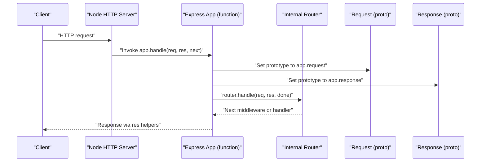
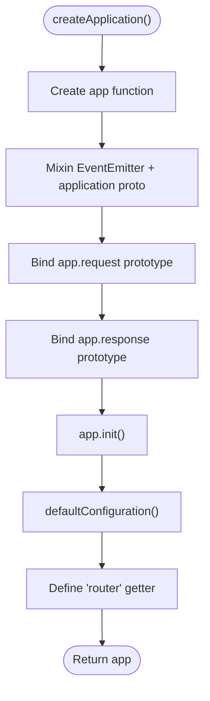
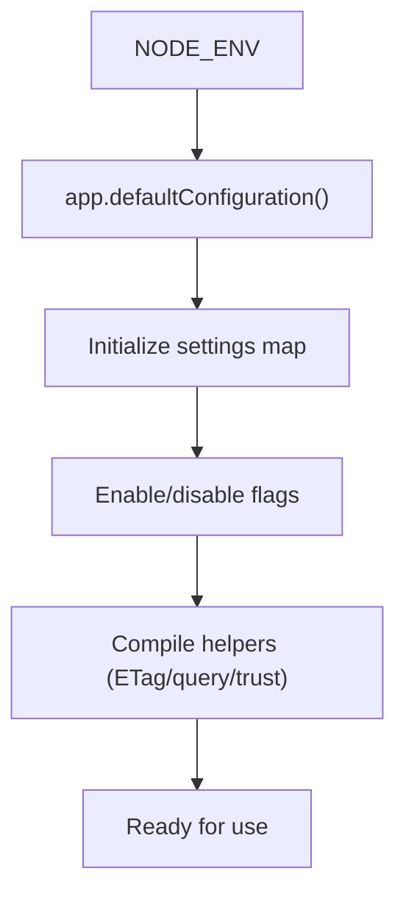
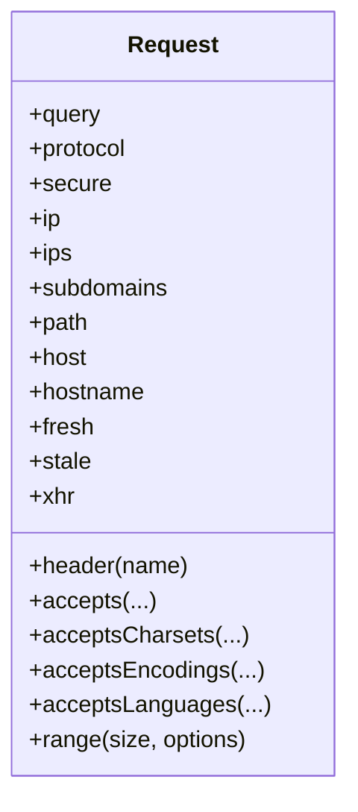
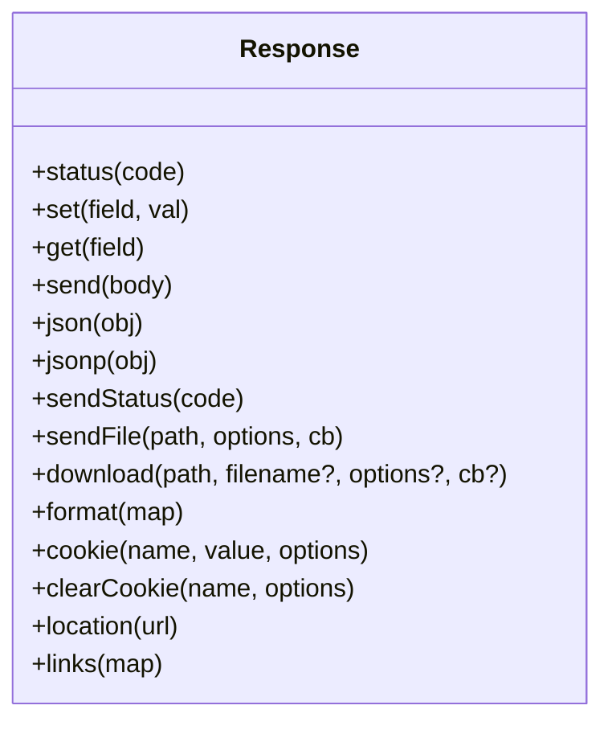
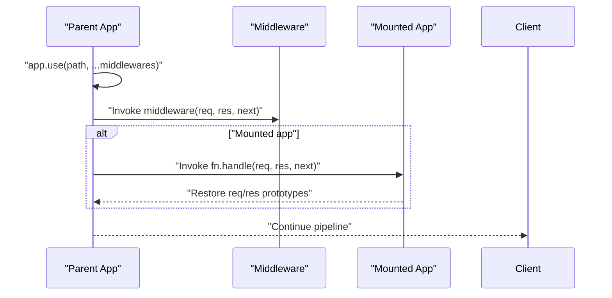
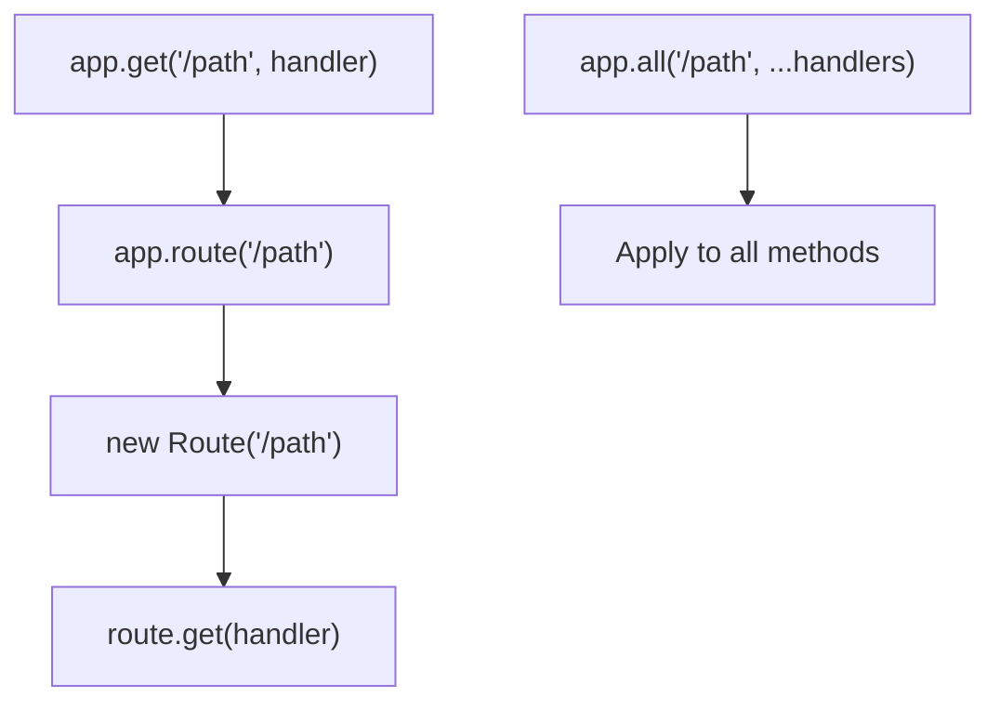
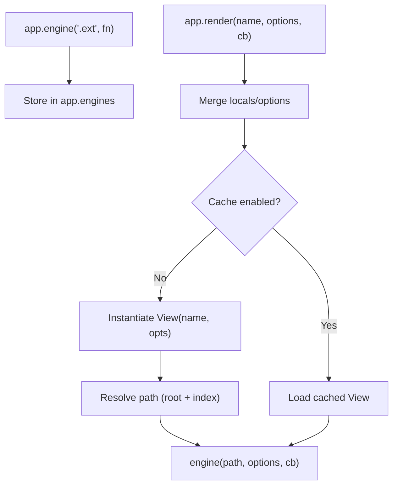

# Core Framework Concepts

<cite>
**Referenced Files in This Document**
- [index.js](file://index.js)
- [lib/express.js](file://lib/express.js)
- [lib/application.js](file://lib/application.js)
- [lib/request.js](file://lib/request.js)
- [lib/response.js](file://lib/response.js)
- [lib/utils.js](file://lib/utils.js)
- [lib/view.js](file://lib/view.js)
- [examples/hello-world/index.js](file://examples/hello-world/index.js)
- [examples/mvc/index.js](file://examples/mvc/index.js)
- [examples/route-middleware/index.js](file://examples/route-middleware/index.js)
- [examples/multi-router/index.js](file://examples/multi-router/index.js)
- [test/app.js](file://test/app.js)
- [test/app.use.js](file://test/app.use.js)
- [package.json](file://package.json)
</cite>

## Table of Contents
1. [Introduction](#introduction)
2. [Project Structure](#project-structure)
3. [Core Components](#core-components)
4. [Architecture Overview](#architecture-overview)
5. [Detailed Component Analysis](#detailed-component-analysis)
6. [Dependency Analysis](#dependency-analysis)
7. [Performance Considerations](#performance-considerations)
8. [Troubleshooting Guide](#troubleshooting-guide)
9. [Conclusion](#conclusion)
10. [Appendices](#appendices)

## Introduction
This document explains the core concepts of the Express.js framework by analyzing the actual implementation. It covers the application architecture, initialization process, core components (Express function, application instances, request/response enhancements), middleware system fundamentals, routing mechanisms, application settings and configuration management, and environment variables. Practical examples demonstrate application creation, configuration, and basic setup patterns. The goal is to help both newcomers and experienced developers understand how Express composes its runtime, how components relate to each other, and how to apply best practices.

## Project Structure
Express exposes a minimal entry point that delegates to the internal library. The core lives under lib/, with separate modules for the application runtime, HTTP request and response augmentation, utilities, and the view engine integration. Examples illustrate common patterns, and tests validate behavior.

**Diagram sources**
- [index.js:1-12](file://index.js#L1-L12)
- [lib/express.js:11-82](file://lib/express.js#L11-L82)
- [lib/application.js:16-40](file://lib/application.js#L16-L40)
- [lib/request.js:15-37](file://lib/request.js#L15-L37)
- [lib/response.js:14-49](file://lib/response.js#L14-L49)
- [lib/utils.js:15-272](file://lib/utils.js#L15-L272)
- [lib/view.js:16-36](file://lib/view.js#L16-L36)

**Section sources**
- [index.js:1-12](file://index.js#L1-L12)
- [package.json:82-90](file://package.json#L82-L90)

## Core Components
- Express function and application factory: The exported function is created by a factory that mixes in event emitter capabilities and the application prototype. It also establishes per-instance request and response prototypes and initializes the app.
- Application instance: The app is a callable function that delegates to an internal router and manages settings, middleware, and rendering.
- Request and response prototypes: These augment Node’s IncomingMessage and ServerResponse with convenience methods and computed properties.
- Utilities: Provide helpers for HTTP methods, ETag generation, query parsing, trust proxy compilation, and content-type normalization.
- View engine: A simple renderer that resolves templates and delegates to registered engines.

**Section sources**
- [lib/express.js:36-56](file://lib/express.js#L36-L56)
- [lib/application.js:59-141](file://lib/application.js#L59-L141)
- [lib/request.js:30](file://lib/request.js#L30)
- [lib/response.js:42](file://lib/response.js#L42)
- [lib/utils.js:29](file://lib/utils.js#L29)
- [lib/view.js:52-95](file://lib/view.js#L52-L95)

## Architecture Overview
Express composes a layered runtime:
- Entry point exports the application factory.
- The factory creates a function that acts as the app, mixes in EventEmitter and application behavior, and binds per-app request/response prototypes.
- On each HTTP request, the app sets up request/response prototypes, wires locals, and dispatches to the internal router.
- The router executes middleware stacks and route handlers. Responses are produced via response helpers and the underlying HTTP server.

**Diagram sources**
- [lib/application.js:152-178](file://lib/application.js#L152-L178)
- [lib/express.js:44-52](file://lib/express.js#L44-L52)

## Detailed Component Analysis

### Express Function and Application Instance
- Factory behavior: createApplication() returns a function that forwards to app.handle(), mixes in EventEmitter, and binds app.request and app.response prototypes to the app instance.
- Initialization: app.init() sets up caches, engines, settings, default configuration, and lazily creates the router with settings derived from app configuration.
- Mounting: app.use() proxies to the router, supports mounting other apps, and emits a “mount” event with parent context.

**Diagram sources**
- [lib/express.js:36-56](file://lib/express.js#L36-L56)
- [lib/application.js:59-83](file://lib/application.js#L59-L83)

**Section sources**
- [lib/express.js:36-56](file://lib/express.js#L36-L56)
- [lib/application.js:59-141](file://lib/application.js#L59-L141)
- [test/app.js:26-72](file://test/app.js#L26-L72)

### Application Settings, Environment Variables, and Configuration Management
- Default settings: The app sets environment, ETag, query parser, subdomain offset, trust proxy, and view-related settings during initialization. Production enables view caching by default.
- Setting APIs: app.set()/get()/enable()/disable()/enabled()/disabled() manage configuration. Certain settings trigger re-compilation of helpers (ETag, query parser, trust proxy).
- Trust proxy: A dedicated compiler supports booleans, numbers, lists, and functions.
- Environment: NODE_ENV defaults to development when unset; tests confirm behavior across environments.

**Diagram sources**
- [lib/application.js:90-141](file://lib/application.js#L90-L141)
- [lib/utils.js:130-214](file://lib/utils.js#L130-L214)
- [test/app.js:74-120](file://test/app.js#L74-L120)

**Section sources**
- [lib/application.js:90-141](file://lib/application.js#L90-L141)
- [lib/utils.js:130-214](file://lib/utils.js#L130-L214)
- [test/app.js:74-120](file://test/app.js#L74-L120)

### Request Object Enhancements
- Header access: Unified header retrieval with aliasing for referrer/referrer.
- Content negotiation: Accepts types, charsets, encodings, and languages.
- Range parsing: Parses Range header with optional combining.
- Query parsing: Delegates to configured query parser function; disabled when parser is false.
- Protocol and secure detection: Considers TLS and trust proxy to determine protocol and secure flag.
- IP and subdomains: Uses trust proxy to compute client IPs and subdomains with configurable offset.
- Freshness: Determines if a response is fresh using ETag and Last-Modified.
- XHR detection: Reads X-Requested-With header.

**Diagram sources**
- [lib/request.js:63-527](file://lib/request.js#L63-L527)

**Section sources**
- [lib/request.js:63-527](file://lib/request.js#L63-L527)

### Response Object Enhancements
- Status: Validates and sets HTTP status codes.
- Headers: Set/get headers, with automatic charset expansion for Content-Type.
- Body helpers: send(), json(), jsonp(), sendStatus().
- File serving: sendFile() and download() delegate to the send stream with caching and error handling.
- Content negotiation: format() selects response based on Accept header.
- Cookies: cookie(), clearCookie() with signing support.
- Location: location() sets redirect location with URL encoding.
- Links: links() sets Link header with multiple relations.

**Diagram sources**
- [lib/response.js:64-800](file://lib/response.js#L64-L800)

**Section sources**
- [lib/response.js:64-800](file://lib/response.js#L64-L800)

### Middleware System Fundamentals
- Registration: app.use() accepts middleware functions, arrays of middleware, or mounted applications. It supports leading path argument and flattens nested arrays.
- Execution: Mounted apps are invoked with preserved request/response prototypes; “mount” events propagate parent context.
- Behavior: Middleware runs in the order registered and can short-circuit or continue via next(). Tests demonstrate invocation semantics, path stripping, arrays, and regular expressions.

**Diagram sources**
- [lib/application.js:190-244](file://lib/application.js#L190-L244)
- [test/app.use.js:8-20](file://test/app.use.js#L8-L20)

**Section sources**
- [lib/application.js:190-244](file://lib/application.js#L190-L244)
- [test/app.use.js:125-256](file://test/app.use.js#L125-L256)

### Routing Mechanisms
- Route delegation: app.get('/path', ...) is delegated to a Route instance created by app.route('/path').
- Method shortcuts: app.get(), app.post(), etc., are dynamically proxied to the router for all standard HTTP methods.
- All methods: app.all() registers the same handler for all methods.
- Router lifecycle: The router is lazily created and configured from app settings (case sensitivity and strict routing).

**Diagram sources**
- [lib/application.js:471-503](file://lib/application.js#L471-L503)
- [lib/application.js:256-258](file://lib/application.js#L256-L258)

**Section sources**
- [lib/application.js:471-503](file://lib/application.js#L471-L503)
- [lib/application.js:256-258](file://lib/application.js#L256-L258)

### Templating and Views
- Engine registration: app.engine('.ext', callback) registers renderers; missing extensions derive from defaultEngine.
- View resolution: View looks up files in configured root(s), supporting index fallback.
- Rendering: app.render() merges locals and options, optionally caches views, and invokes the engine.

**Diagram sources**
- [lib/application.js:294-308](file://lib/application.js#L294-L308)
- [lib/application.js:522-575](file://lib/application.js#L522-L575)
- [lib/view.js:52-123](file://lib/view.js#L52-L123)

**Section sources**
- [lib/application.js:294-308](file://lib/application.js#L294-L308)
- [lib/application.js:522-575](file://lib/application.js#L522-L575)
- [lib/view.js:52-123](file://lib/view.js#L52-L123)

### Practical Examples and Basic Setup Patterns
- Hello world: Demonstrates creating an app, registering a GET route, and listening on a port.
- MVC-style: Shows setting view engine and views directory, adding middleware for logging, sessions, static files, and body parsing, exposing custom response helpers, and centralized error/404 handling.
- Route middleware: Illustrates composing middleware for user loading and role checks, with redirects and error propagation.
- Multi-router: Mounts separate routers under different paths.

**Section sources**
- [examples/hello-world/index.js:1-16](file://examples/hello-world/index.js#L1-L16)
- [examples/mvc/index.js:13-96](file://examples/mvc/index.js#L13-L96)
- [examples/route-middleware/index.js:9-91](file://examples/route-middleware/index.js#L9-L91)
- [examples/multi-router/index.js:5-19](file://examples/multi-router/index.js#L5-L19)

## Dependency Analysis
Express depends on several Node and community packages for HTTP handling, content negotiation, parsing, and streaming. The dependency list in package.json enumerates these.

```mermaid
graph TB
Express["Express (index/lib)"] --> BodyParser["body-parser"]
Express --> FinalHandler["finalhandler"]
Express --> Router["router"]
Express --> ServeStatic["serve-static"]
Express --> Send["send"]
Express --> Debug["debug"]
Express --> ETag["etag"]
Express --> Mime["mime-types"]
Express --> TypeIs["type-is"]
Express --> Accepts["accepts"]
Express --> ProxyAddr["proxy-addr"]
Express --> Fresh["fresh"]
Express --> RangeParser["range-parser"]
Express --> Qs["qs"]
Express --> Vary["vary"]
Express --> CookieSignature["cookie-signature"]
Express --> OnFinished["on-finished"]
Express --> Statuses["statuses"]
```

**Diagram sources**
- [package.json:34-62](file://package.json#L34-L62)

**Section sources**
- [package.json:34-62](file://package.json#L34-L62)

## Performance Considerations
- ETag generation: Configurable via app settings; weak or strong variants are compiled at startup.
- Query parsing: Choose simple vs. extended to balance safety and performance.
- Trust proxy: When enabled, IP and protocol detection involve additional computation; tune trust proxy settings appropriately.
- View caching: Enabled in production by default to avoid repeated filesystem lookups.
- Middleware ordering: Place fast middleware early; keep heavy middleware near the end or guarded by conditions.

[No sources needed since this section provides general guidance]

## Troubleshooting Guide
- No routes registered: Requests return 404 by default when no middleware or routes respond.
- Mounting issues: Verify mount paths and ensure mounted apps emit “mount” with correct parent context.
- Environment-specific behavior: Confirm NODE_ENV affects view caching and error reporting.
- Middleware errors: Use centralized error handlers to capture thrown errors and next(error) invocations.

**Section sources**
- [test/app.js:19-24](file://test/app.js#L19-L24)
- [test/app.use.js:8-20](file://test/app.use.js#L8-L20)
- [lib/application.js:152-178](file://lib/application.js#L152-L178)

## Conclusion
Express composes a lightweight yet powerful runtime around a callable application instance, a robust middleware system, and a flexible router. Its design emphasizes convention over configuration, easy extensibility, and clear separation of concerns. Understanding how the app factory, request/response prototypes, settings, and router interplay helps you build scalable and maintainable Node.js web applications.

[No sources needed since this section summarizes without analyzing specific files]

## Appendices

### Appendix A: Initialization and Lifecycle Checklist
- Create app via factory.
- Configure settings (environment, parsers, trust proxy, view options).
- Register middleware (logging, parsing, sessions, static).
- Define routes and route middleware.
- Add error and 404 handlers.
- Start server.

**Section sources**
- [lib/express.js:36-56](file://lib/express.js#L36-L56)
- [lib/application.js:59-141](file://lib/application.js#L59-L141)
- [examples/mvc/index.js:33-89](file://examples/mvc/index.js#L33-L89)