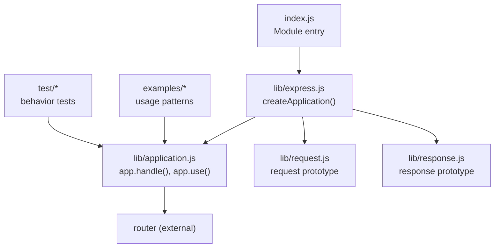
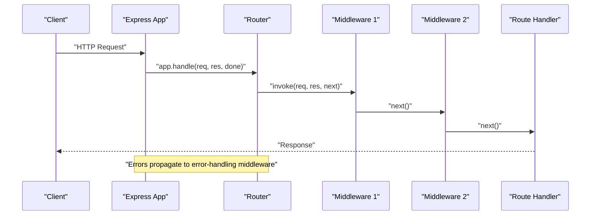
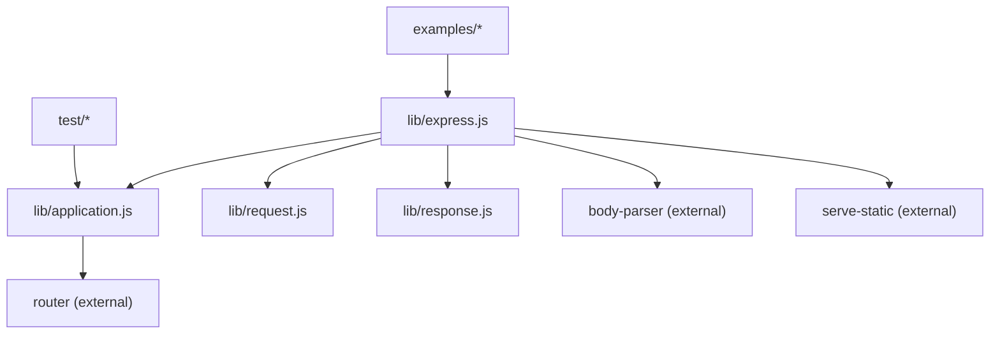

# Middleware Fundamentals

<cite>
**Referenced Files in This Document**
- [index.js](file://index.js)
- [express.js](file://lib/express.js)
- [application.js](file://lib/application.js)
- [request.js](file://lib/request.js)
- [response.js](file://lib/response.js)
- [app.use.js](file://test/app.use.js)
- [middleware.basic.js](file://test/middleware.basic.js)
- [route-middleware/index.js](file://examples/route-middleware/index.js)
- [static-files/index.js](file://examples/static-files/index.js)
- [cookies/index.js](file://examples/cookies/index.js)
- [session/index.js](file://examples/session/index.js)
- [error/index.js](file://examples/error/index.js)
- [error-pages/index.js](file://examples/error-pages/index.js)
</cite>

## Table of Contents
1. [Introduction](#introduction)
2. [Project Structure](#project-structure)
3. [Core Components](#core-components)
4. [Architecture Overview](#architecture-overview)
5. [Detailed Component Analysis](#detailed-component-analysis)
6. [Dependency Analysis](#dependency-analysis)
7. [Performance Considerations](#performance-considerations)
8. [Troubleshooting Guide](#troubleshooting-guide)
9. [Conclusion](#conclusion)

## Introduction
This document explains Express.js middleware fundamentals: what middleware is, how it forms a chain of functions that process requests and responses, and how to register and compose middleware effectively. It covers middleware function signatures, execution order, built-in middleware types (body parsing, static file serving, cookies), route-specific middleware, error handling, conditional execution, composition patterns, performance considerations, and debugging techniques. The content is grounded in the repository’s core implementation and examples.

## Project Structure
Express exposes a minimal entry point that delegates to the internal application module. The application module initializes the server, sets defaults, and wires the request/response prototypes and router. Built-in middleware are exposed via the main module and examples demonstrate practical usage.

**Diagram sources**
- [index.js:1-12](file://index.js#L1-L12)
- [express.js:36-56](file://lib/express.js#L36-L56)
- [application.js:59-178](file://lib/application.js#L59-L178)
- [request.js:30-37](file://lib/request.js#L30-L37)
- [response.js:42-49](file://lib/response.js#L42-L49)

**Section sources**
- [index.js:1-12](file://index.js#L1-L12)
- [express.js:36-56](file://lib/express.js#L36-L56)
- [application.js:59-178](file://lib/application.js#L59-L178)

## Core Components
- Application initialization and request handling:
  - The application initializes settings, caches, engines, and mounts a lazy-loaded router. Requests are dispatched through the router and finalized by a default handler.
- Middleware registration:
  - app.use() supports multiple middleware, arrays, and path prefixes. It flattens nested arrays and registers middleware on the internal router.
- Built-in middleware exposure:
  - JSON, raw, text, urlencoded, and static are exposed via the main module and used in examples.

Key implementation references:
- Application initialization and default configuration
- Request handling pipeline and router dispatch
- Middleware registration and path stripping
- Built-in middleware exports

**Section sources**
- [application.js:59-178](file://lib/application.js#L59-L178)
- [application.js:190-244](file://lib/application.js#L190-L244)
- [express.js:77-82](file://lib/express.js#L77-L82)

## Architecture Overview
Express middleware forms a chain around the request/response lifecycle. The application delegates to a router, which invokes registered middleware in the order they were added. Middleware can modify the request/response, call next() to continue the chain, or terminate the chain by sending a response or passing an error.

**Diagram sources**
- [application.js:152-178](file://lib/application.js#L152-L178)
- [middleware.basic.js:13-31](file://test/middleware.basic.js#L13-L31)

**Section sources**
- [application.js:152-178](file://lib/application.js#L152-L178)
- [middleware.basic.js:13-31](file://test/middleware.basic.js#L13-L31)

## Detailed Component Analysis

### Middleware Function Signatures and Execution Order
- Standard middleware signature: (req, res, next)
- Error-handling middleware signature: (err, req, res, next)
- Execution order is strictly the order registered. Tests confirm sequential invocation and that next() advances the chain.

Practical references:
- Basic middleware chaining and next() behavior
- Multiple middleware registration and ordering

**Section sources**
- [middleware.basic.js:13-31](file://test/middleware.basic.js#L13-L31)
- [app.use.js:126-150](file://test/app.use.js#L126-L150)

### Built-in Middleware Types
- Body parsing:
  - json(), raw(), text(), urlencoded() are exposed and used in examples.
- Static file serving:
  - static() serves files from a directory and supports mounting under a path.
- Cookies:
  - cookie-parser populates req.cookies and req.signedCookies; used alongside body parsers.

Examples:
- Body parsing and static serving
- Cookie parsing and cookie setting/clearing
- Session middleware integration

**Section sources**
- [express.js:77-82](file://lib/express.js#L77-L82)
- [static-files/index.js:22-36](file://examples/static-files/index.js#L22-L36)
- [cookies/index.js:19-47](file://examples/cookies/index.js#L19-L47)
- [session/index.js:16-31](file://examples/session/index.js#L16-L31)

### Middleware Registration with app.use()
- Single middleware or multiple arguments are supported.
- Arrays of middleware are flattened; nested arrays are flattened recursively.
- Path prefixes can be provided; the path is stripped from req.url during dispatch.
- Mounting nested applications is supported; mounted apps emit “mount” and preserve request/response prototypes.

Behavior verified by:
- Multiple middleware invocation
- Arrays and nested arrays
- Path prefixes and trailing slashes
- Regular expressions and multiple paths
- Mounting child apps and dynamic routes

**Section sources**
- [app.use.js:126-150](file://test/app.use.js#L126-L150)
- [app.use.js:173-255](file://test/app.use.js#L173-L255)
- [app.use.js:258-541](file://test/app.use.js#L258-L541)
- [application.js:190-244](file://lib/application.js#L190-L244)

### Route-Specific Middleware
- Routes can be defined with middleware functions that run only for that route or route group.
- Route middleware composes with global middleware; both are executed in registration order.

Example:
- Authentication and authorization middleware applied to specific routes
- Conditional access based on roles and identity

**Section sources**
- [route-middleware/index.js:25-84](file://examples/route-middleware/index.js#L25-L84)

### Error Handling Middleware
- Error-handling middleware has four parameters and is invoked when an error is passed to next(err) or thrown.
- Tests demonstrate error propagation and handling via arity-4 functions.
- Example applications show placing error handlers after routes and responding with appropriate status codes and content.

**Section sources**
- [error/index.js:20-47](file://examples/error/index.js#L20-L47)
- [error-pages/index.js:91-97](file://examples/error-pages/index.js#L91-L97)
- [middleware.basic.js:171-195](file://test/middleware.basic.js#L171-L195)

### Conditional Middleware Execution
- Middleware can conditionally call next() or respond based on request properties.
- Examples include:
  - Authentication middleware that populates req.authenticatedUser
  - Role-based restrictions using higher-order middleware
  - Conditional cookie setting/clearing

**Section sources**
- [route-middleware/index.js:65-68](file://examples/route-middleware/index.js#L65-L68)
- [route-middleware/index.js:50-58](file://examples/route-middleware/index.js#L50-L58)
- [cookies/index.js:24-47](file://examples/cookies/index.js#L24-L47)

### Practical Custom Middleware Development
- Pattern: accept (req, res, next), mutate req/res, call next() or send a response.
- Examples:
  - Logger-like middleware that logs requests
  - Cookie parser integration
  - Static file serving middleware

**Section sources**
- [static-files/index.js:13-13](file://examples/static-files/index.js#L13-L13)
- [cookies/index.js:19-19](file://examples/cookies/index.js#L19-L19)

### Composition Patterns
- Compose middleware functions to build reusable units (e.g., role-checking middleware).
- Use arrays and multiple app.use() calls to compose middleware stacks.
- Combine route-specific middleware with global middleware.

**Section sources**
- [route-middleware/index.js:50-58](file://examples/route-middleware/index.js#L50-L58)
- [app.use.js:173-255](file://test/app.use.js#L173-L255)

### Relationship Between Middleware and Request/Response Lifecycle
- The application sets up request/response prototypes and locals, then delegates to the router.
- Middleware can read/write req and res, and either continue or terminate the chain.
- Response methods (send, json, redirect, etc.) finalize the request lifecycle.

**Section sources**
- [application.js:152-178](file://lib/application.js#L152-L178)
- [request.js:63-83](file://lib/request.js#L63-L83)
- [response.js:125-218](file://lib/response.js#L125-L218)

## Dependency Analysis
Express middleware relies on:
- Internal application module for initialization and request handling
- External router for route matching and dispatch
- Body parser and serve-static for built-in middleware
- Node core modules for HTTP and utilities

**Diagram sources**
- [express.js:15-21](file://lib/express.js#L15-L21)
- [express.js:77-82](file://lib/express.js#L77-L82)
- [application.js:26](file://lib/application.js#L26)

**Section sources**
- [express.js:15-21](file://lib/express.js#L15-L21)
- [express.js:77-82](file://lib/express.js#L77-L82)
- [application.js:26](file://lib/application.js#L26)

## Performance Considerations
- Order matters: place frequently failing or fast-returning middleware early to avoid unnecessary downstream processing.
- Minimize synchronous I/O in middleware; prefer asynchronous patterns.
- Use static() for static assets and leverage caching headers.
- Avoid heavy computations in global middleware; consider per-route middleware when appropriate.
- Keep middleware focused and small to improve maintainability and testability.

[No sources needed since this section provides general guidance]

## Troubleshooting Guide
Common issues and techniques:
- Middleware not executing:
  - Verify registration order and path prefixes.
  - Confirm next() is called or a response is sent.
- Error not handled:
  - Ensure an arity-4 error handler is registered after all routes.
  - Check that errors are passed to next(err) or thrown.
- Static files not served:
  - Confirm directory path and mount path alignment.
  - Verify permissions and file existence.
- Cookies not parsed:
  - Ensure cookie-parser is registered before routes that read cookies.
  - Provide a secret for signed cookies when required.

**Section sources**
- [app.use.js:258-541](file://test/app.use.js#L258-L541)
- [error/index.js:20-47](file://examples/error/index.js#L20-L47)
- [error-pages/index.js:91-97](file://examples/error-pages/index.js#L91-L97)
- [static-files/index.js:22-36](file://examples/static-files/index.js#L22-L36)
- [cookies/index.js:19-47](file://examples/cookies/index.js#L19-L47)

## Conclusion
Express middleware is a powerful, composable mechanism for processing requests and responses. Understanding middleware signatures, registration, execution order, and error handling enables robust application design. Built-in middleware simplifies common tasks like body parsing, static serving, and cookies. Proper composition, performance awareness, and debugging practices ensure reliable and maintainable middleware stacks.