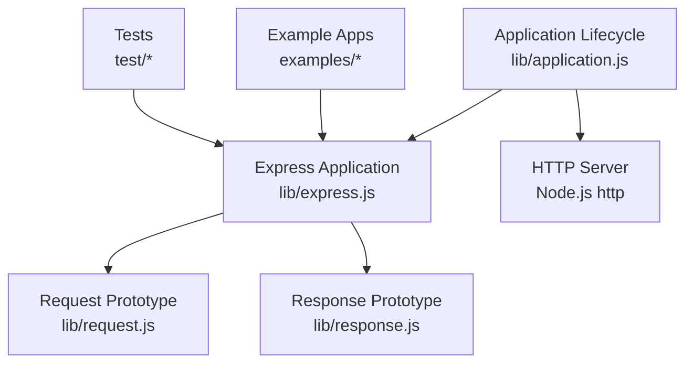
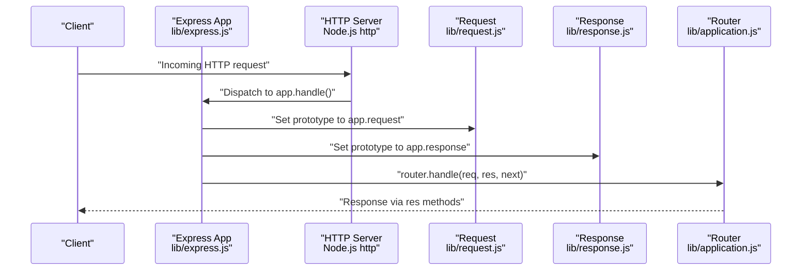
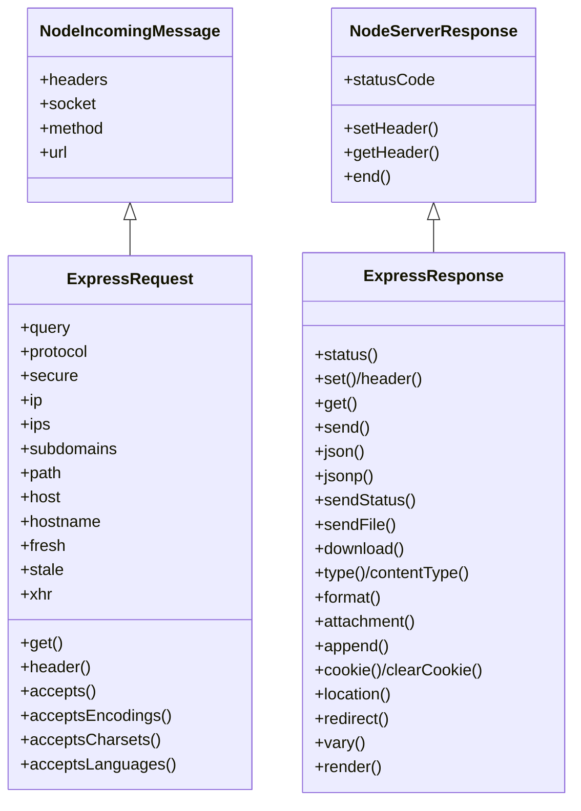
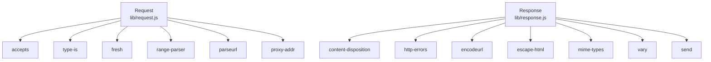

# Request and Response Objects

<cite>
**Referenced Files in This Document**
- [express.js](file://lib/express.js)
- [application.js](file://lib/application.js)
- [request.js](file://lib/request.js)
- [response.js](file://lib/response.js)
- [index.js](file://index.js)
- [package.json](file://package.json)
- [params/index.js](file://examples/params/index.js)
- [content-negotiation/index.js](file://examples/content-negotiation/index.js)
- [downloads/index.js](file://examples/downloads/index.js)
- [hello-world/index.js](file://examples/hello-world/index.js)
- [req.get.js](file://test/req.get.js)
- [req.accepts.js](file://test/req.accepts.js)
- [res.send.js](file://test/res.send.js)
- [res.json.js](file://test/res.json.js)
</cite>

## Table of Contents
1. [Introduction](#introduction)
2. [Project Structure](#project-structure)
3. [Core Components](#core-components)
4. [Architecture Overview](#architecture-overview)
5. [Detailed Component Analysis](#detailed-component-analysis)
6. [Dependency Analysis](#dependency-analysis)
7. [Performance Considerations](#performance-considerations)
8. [Troubleshooting Guide](#troubleshooting-guide)
9. [Conclusion](#conclusion)

## Introduction
This document explains how Express.js extends Node.js HTTP request and response objects to provide a richer, developer-friendly API. It covers how Express augments the built-in objects with additional properties and methods, how the prototype chain is manipulated to apply these enhancements, and how the application instance relates to request and response objects during the lifecycle of a request.

## Project Structure
Express exposes request and response prototypes that are attached to each request/response pair created by the application. The application instance controls how these prototypes are applied and how middleware and routes interact with them.

**Diagram sources**
- [express.js:36-56](file://lib/express.js#L36-L56)
- [application.js:152-178](file://lib/application.js#L152-L178)
- [request.js:30](file://lib/request.js#L30)
- [response.js:42](file://lib/response.js#L42)

**Section sources**
- [express.js:36-56](file://lib/express.js#L36-L56)
- [application.js:59-178](file://lib/application.js#L59-L178)

## Core Components
- Request prototype: Adds convenience getters and methods for headers, content negotiation, IP detection, freshness checks, and more.
- Response prototype: Adds methods for sending data, setting headers, content negotiation, cookies, redirects, file downloads, and rendering views.
- Application lifecycle: Attaches the request and response prototypes to each request/response pair and wires middleware/router handling.

**Section sources**
- [request.js:30](file://lib/request.js#L30)
- [response.js:42](file://lib/response.js#L42)
- [application.js:152-178](file://lib/application.js#L152-L178)

## Architecture Overview
Express creates application instances that expose request and response prototypes. During each request, the application sets the prototypes on the Node.js HTTP objects, enabling access to Express-enhanced APIs.

**Diagram sources**
- [express.js:36-56](file://lib/express.js#L36-L56)
- [application.js:152-178](file://lib/application.js#L152-L178)
- [request.js:30](file://lib/request.js#L30)
- [response.js:42](file://lib/response.js#L42)

## Detailed Component Analysis

### Request Prototype Enhancements
Express extends Node’s IncomingMessage with getters and methods for:
- Header access and normalization (including special-case handling for Referer/Referrer).
- Content negotiation helpers for types, encodings, charsets, and languages.
- Query parsing controlled by application settings.
- Protocol detection and secure flag.
- IP and trusted proxy resolution.
- Hostname and subdomain parsing.
- Range parsing for partial content.
- Freshness and staleness checks based on ETag and Last-Modified.
- XMLHttpRequest detection.

Key implementation patterns:
- Uses a helper to define getters on the request prototype to compute derived values from request state and application settings.
- Delegates to external libraries for robust parsing and negotiation.

Practical examples:
- Accessing headers via req.get and req.header.
- Determining client protocol and whether the connection is secure.
- Detecting client IPs and subdomains with trust proxy awareness.
- Checking content negotiation preferences.

**Section sources**
- [request.js:63-83](file://lib/request.js#L63-L83)
- [request.js:127-130](file://lib/request.js#L127-L130)
- [request.js:140-143](file://lib/request.js#L140-L143)
- [request.js:171-174](file://lib/request.js#L171-L174)
- [request.js:185-187](file://lib/request.js#L185-L187)
- [request.js:214-218](file://lib/request.js#L214-L218)
- [request.js:230-241](file://lib/request.js#L230-L241)
- [request.js:269-281](file://lib/request.js#L269-L281)
- [request.js:297-315](file://lib/request.js#L297-L315)
- [request.js:326-328](file://lib/request.js#L326-L328)
- [request.js:340-343](file://lib/request.js#L340-L343)
- [request.js:357-366](file://lib/request.js#L357-L366)
- [request.js:383-394](file://lib/request.js#L383-L394)
- [request.js:403-405](file://lib/request.js#L403-L405)
- [request.js:418-431](file://lib/request.js#L418-L431)
- [request.js:444-458](file://lib/request.js#L444-L458)
- [request.js:469-486](file://lib/request.js#L469-L486)
- [request.js:497-499](file://lib/request.js#L497-L499)
- [request.js:508-511](file://lib/request.js#L508-L511)

### Response Prototype Enhancements
Express extends Node’s ServerResponse with methods for:
- Setting status codes with validation.
- Managing headers (set/get/header), including charset expansion for Content-Type.
- Sending various data types (string, buffer, number, object) with automatic content-type and ETag handling.
- JSON and JSONP responses with escaping and replacer/spaces support.
- File serving and downloads with content-disposition and streaming.
- Content negotiation via res.format.
- Cookie management (set/clear).
- Location and redirect helpers.
- Vary header manipulation.
- Rendering views via app.render.

Practical examples:
- Sending plain text, HTML, JSON, buffers, and numbers.
- Setting headers and content types.
- Redirecting with appropriate status and body.
- Downloading files with optional filename and headers.
- Rendering templates with locals and caching.

**Section sources**
- [response.js:64-76](file://lib/response.js#L64-L76)
- [response.js:125-218](file://lib/response.js#L125-L218)
- [response.js:232-246](file://lib/response.js#L232-L246)
- [response.js:260-304](file://lib/response.js#L260-L304)
- [response.js:321-328](file://lib/response.js#L321-L328)
- [response.js:371-413](file://lib/response.js#L371-L413)
- [response.js:433-482](file://lib/response.js#L433-L482)
- [response.js:503-510](file://lib/response.js#L503-L510)
- [response.js:569-594](file://lib/response.js#L569-L594)
- [response.js:604-612](file://lib/response.js#L604-L612)
- [response.js:629-641](file://lib/response.js#L629-L641)
- [response.js:664-686](file://lib/response.js#L664-L686)
- [response.js:696-698](file://lib/response.js#L696-L698)
- [response.js:709-716](file://lib/response.js#L709-L716)
- [response.js:742-775](file://lib/response.js#L742-L775)
- [response.js:794-796](file://lib/response.js#L794-L796)
- [response.js:812-864](file://lib/response.js#L812-L864)
- [response.js:875-879](file://lib/response.js#L875-L879)
- [response.js:894-918](file://lib/response.js#L894-L918)

### Prototype Chain and Enhancement Mechanism
Express manipulates the prototype chain to attach its enhanced prototypes to each request and response:
- The application instance exposes request and response prototypes.
- On each request, the application sets the prototypes on the Node.js HTTP objects so that Express methods and getters are available.
- Mounting child applications inherits these prototypes from the parent.

**Diagram sources**
- [request.js:30](file://lib/request.js#L30)
- [response.js:42](file://lib/response.js#L42)

**Section sources**
- [express.js:44-52](file://lib/express.js#L44-L52)
- [application.js:168-170](file://lib/application.js#L168-L170)
- [application.js:118-122](file://lib/application.js#L118-L122)

### Practical Examples and Usage Patterns
- Request object properties and methods:
  - Access headers via req.get and req.header.
  - Determine content negotiation via req.accepts, req.acceptsEncodings, req.acceptsCharsets, req.acceptsLanguages.
  - Extract query parameters via req.query.
  - Inspect client IP and subdomains via req.ip, req.ips, req.subdomains.
  - Check protocol and security via req.protocol, req.secure.
  - Evaluate freshness via req.fresh, req.stale.
  - Detect AJAX via req.xhr.

- Response object methods:
  - Send data via res.send, res.json, res.jsonp, res.sendStatus.
  - Manage headers via res.set, res.header, res.get.
  - Negotiate content via res.format.
  - Serve files via res.sendFile, res.download.
  - Set content type via res.type, res.contentType.
  - Cookies via res.cookie, res.clearCookie.
  - Redirect via res.redirect and location via res.location.
  - Vary via res.vary.
  - Render views via res.render.

Examples in the repository:
- Hello world demonstrates basic res.send.
- Params shows req.params and req.user population via app.param.
- Content negotiation shows res.format with multiple content types.
- Downloads shows res.download with file serving and error handling.

**Section sources**
- [hello-world/index.js:7-9](file://examples/hello-world/index.js#L7-L9)
- [params/index.js:23-41](file://examples/params/index.js#L23-L41)
- [content-negotiation/index.js:9-27](file://examples/content-negotiation/index.js#L9-L27)
- [downloads/index.js:26-34](file://examples/downloads/index.js#L26-L34)

## Dependency Analysis
Express composes request and response prototypes from Node’s HTTP objects and integrates with external libraries for specialized tasks:
- Request: uses accepts, type-is, fresh, range-parser, parseurl, proxy-addr for content negotiation, type checking, caching, range parsing, URL parsing, and trusted proxy resolution.
- Response: uses content-disposition, http-errors, encodeurl, escape-html, mime-types, vary, send, and others for file serving, cookies, content types, and redirects.

**Diagram sources**
- [request.js:16-23](file://lib/request.js#L16-L23)
- [response.js:15-35](file://lib/response.js#L15-L35)

**Section sources**
- [request.js:16-23](file://lib/request.js#L16-L23)
- [response.js:15-35](file://lib/response.js#L15-L35)

## Performance Considerations
- ETag generation: Express conditionally computes ETags for responses based on application settings and payload size to optimize caching.
- HEAD handling: Responses to HEAD requests omit bodies while preserving headers.
- Conditional responses: Express checks request freshness and may return 304 Not Modified to reduce bandwidth.
- Streaming: File serving uses streaming via the send library to minimize memory usage for large files.
- Content negotiation: Efficiently selects the best media type based on Accept headers and quality values.

[No sources needed since this section provides general guidance]

## Troubleshooting Guide
Common issues and diagnostics:
- Header access errors: req.get throws when the header name is missing or not a string.
- Content negotiation failures: res.format invokes next with a 406 error when no acceptable type is found.
- Status code validation: res.status enforces integer status codes within the 100–999 range.
- Redirect safety: res.redirect logs deprecation warnings for invalid arguments and formats a default body for text/html and html content types.
- File serving: res.sendFile validates absolute paths and handles directory errors appropriately.

**Section sources**
- [req.get.js:36-58](file://test/req.get.js#L36-L58)
- [req.accepts.js:8-18](file://test/req.accepts.js#L8-L18)
- [res.send.js:64-76](file://test/res.send.js#L64-L76)
- [res.send.js:239-253](file://test/res.send.js#L239-L253)
- [response.js:812-864](file://lib/response.js#L812-L864)

## Conclusion
Express enhances Node.js HTTP request and response objects by extending their prototypes with a comprehensive set of convenience methods and computed properties. The application instance orchestrates prototype attachment and middleware routing, enabling a clean separation between low-level HTTP handling and high-level web application concerns. These enhancements streamline common tasks such as content negotiation, parameter extraction, client information discovery, and response formatting, while maintaining compatibility with Node’s underlying APIs.