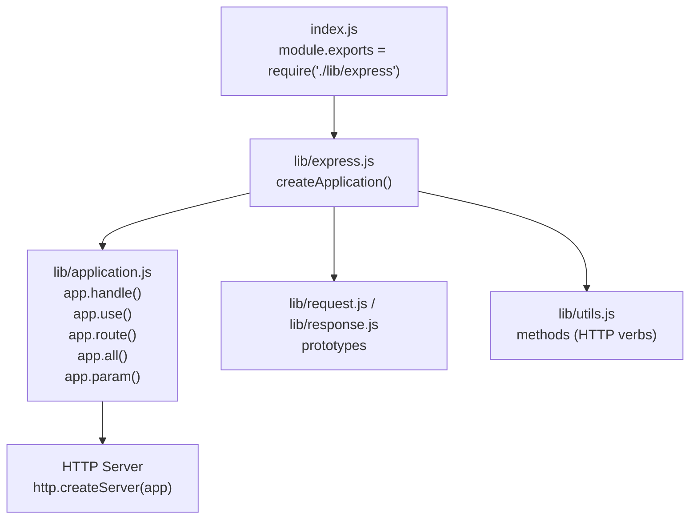
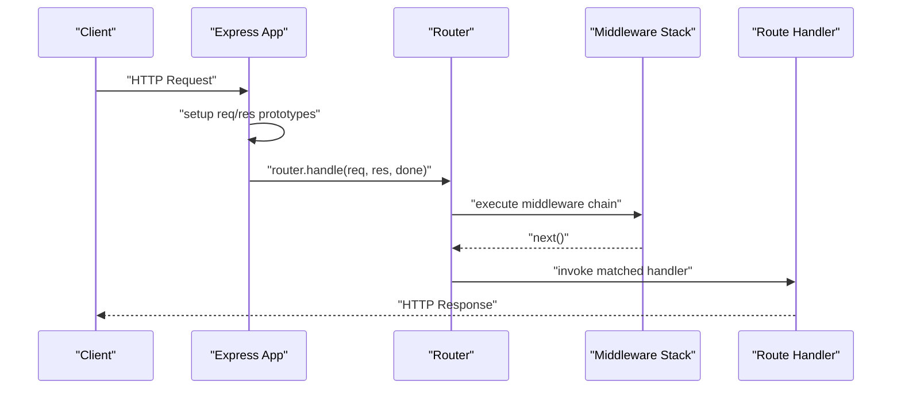
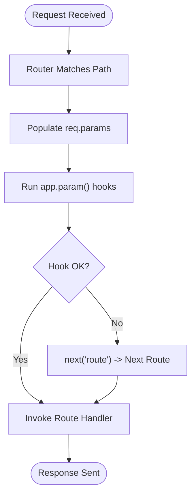
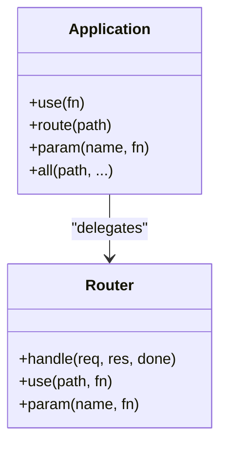
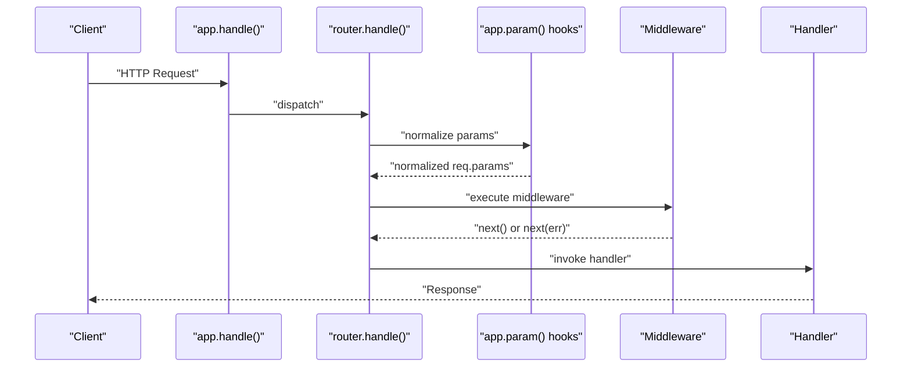
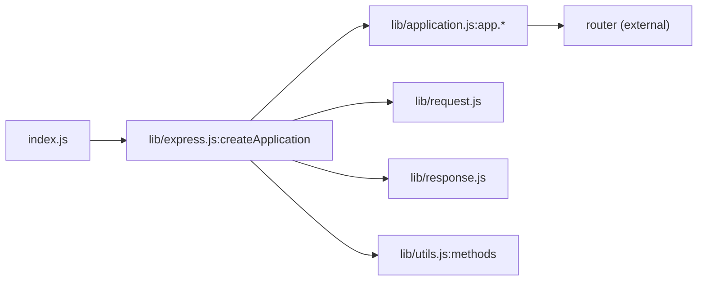

# Routing System

<cite>
**Referenced Files in This Document**
- [index.js](file://index.js)
- [lib/express.js](file://lib/express.js)
- [lib/application.js](file://lib/application.js)
- [lib/utils.js](file://lib/utils.js)
- [examples/route-middleware/index.js](file://examples/route-middleware/index.js)
- [examples/params/index.js](file://examples/params/index.js)
- [examples/resource/index.js](file://examples/resource/index.js)
- [examples/multi-router/index.js](file://examples/multi-router/index.js)
- [examples/multi-router/controllers/api_v1.js](file://examples/multi-router/controllers/api_v1.js)
- [examples/multi-router/controllers/api_v2.js](file://examples/multi-router/controllers/api_v2.js)
- [examples/route-separation/index.js](file://examples/route-separation/index.js)
- [examples/route-separation/user.js](file://examples/route-separation/user.js)
- [examples/route-separation/post.js](file://examples/route-separation/post.js)
- [examples/route-separation/site.js](file://examples/route-separation/site.js)
- [examples/route-map/index.js](file://examples/route-map/index.js)
- [test/app.route.js](file://test/app.route.js)
- [test/app.param.js](file://test/app.param.js)
- [test/app.all.js](file://test/app.all.js)
</cite>

## Table of Contents
1. [Introduction](#introduction)
2. [Project Structure](#project-structure)
3. [Core Components](#core-components)
4. [Architecture Overview](#architecture-overview)
5. [Detailed Component Analysis](#detailed-component-analysis)
6. [Dependency Analysis](#dependency-analysis)
7. [Performance Considerations](#performance-considerations)
8. [Troubleshooting Guide](#troubleshooting-guide)
9. [Conclusion](#conclusion)
10. [Appendices](#appendices)

## Introduction
This document explains the fundamentals of Express.js routing: how routes are defined, matched, and processed; how HTTP methods and route specificity work; how parameters and path patterns behave; and how middleware integrates with routing. It also covers RESTful endpoint design, route organization, naming conventions, and error handling best practices, with references to concrete examples and tests in the repository.

## Project Structure
Express exposes a small surface area for routing:
- The main entry re-exports the internal express factory.
- The express factory creates an application object that delegates routing to an internal router and wires middleware and request/response prototypes.
- Examples demonstrate route definition via app.METHOD(), app.route(), app.all(), app.param(), and modular routers.

**Diagram sources**
- [index.js:1-12](file://index.js#L1-L12)
- [lib/express.js:36-56](file://lib/express.js#L36-L56)
- [lib/application.js:152-178](file://lib/application.js#L152-L178)
- [lib/utils.js:29](file://lib/utils.js#L29)

**Section sources**
- [index.js:1-12](file://index.js#L1-L12)
- [lib/express.js:36-56](file://lib/express.js#L36-L56)
- [lib/application.js:152-178](file://lib/application.js#L152-L178)
- [lib/utils.js:29](file://lib/utils.js#L29)

## Core Components
- Application bootstrap and routing delegation:
  - The application object is created by the factory and initialized with default configuration and a lazily-instantiated router.
  - Requests are dispatched through app.handle(), which sets up request/response prototypes and delegates to the router.
- Method routing:
  - app.get(), app.post(), etc., are dynamically delegated to the router via app.METHOD().
  - app.all() registers a route for all HTTP methods.
- Route isolation:
  - app.route(path) returns a Route instance for chaining multiple HTTP methods on the same path.
- Parameter pre-processing:
  - app.param(name, fn) and app.param([names], fn) transform route parameters before reaching route handlers.
- Middleware integration:
  - app.use() mounts middleware and nested applications onto the router.

**Section sources**
- [lib/application.js:59-83](file://lib/application.js#L59-L83)
- [lib/application.js:152-178](file://lib/application.js#L152-L178)
- [lib/application.js:471-482](file://lib/application.js#L471-L482)
- [lib/application.js:494-503](file://lib/application.js#L494-L503)
- [lib/application.js:256-258](file://lib/application.js#L256-L258)
- [lib/application.js:322-334](file://lib/application.js#L322-L334)
- [lib/application.js:190-244](file://lib/application.js#L190-L244)
- [lib/utils.js:29](file://lib/utils.js#L29)

## Architecture Overview
Express routes are handled by a dedicated router. The application delegates incoming requests to the router, which matches paths and executes middleware/handlers in order. Route parameters are normalized and transformed by app.param() hooks before reaching route handlers.

**Diagram sources**
- [lib/application.js:152-178](file://lib/application.js#L152-L178)
- [lib/express.js:36-56](file://lib/express.js#L36-L56)

## Detailed Component Analysis

### Route Definition with app.METHOD() and app.route()
- app.METHOD(path, ...handlers):
  - Dynamically proxies to the router for each HTTP verb.
  - Enables concise route registration for specific methods.
- app.route(path):
  - Returns a Route instance to register multiple methods on the same path.
  - Supports chaining and works with app.all() semantics.

Practical examples:
- Using app.METHOD(): see [examples/route-middleware/index.js:74-84](file://examples/route-middleware/index.js#L74-L84).
- Using app.route(): see [test/app.route.js:10-21](file://test/app.route.js#L10-L21).
- Using app.all(): see [test/app.all.js:12-23](file://test/app.all.js#L12-L23).

**Section sources**
- [lib/application.js:471-482](file://lib/application.js#L471-L482)
- [lib/application.js:256-258](file://lib/application.js#L256-L258)
- [lib/application.js:494-503](file://lib/application.js#L494-L503)
- [examples/route-middleware/index.js:74-84](file://examples/route-middleware/index.js#L74-L84)
- [test/app.route.js:10-21](file://test/app.route.js#L10-L21)
- [test/app.all.js:12-23](file://test/app.all.js#L12-L23)

### Route Parameters, Wildcards, and Path Matching Patterns
- Dynamic segments:
  - Named parameters like :id capture path segments and populate req.params.
  - Multiple named segments can be combined in patterns.
- Parameter transformation:
  - app.param(name, fn) converts parameter values (e.g., parsing integers) and can short-circuit to the next route via next('route').
- Encoded values:
  - Parameters preserve decoded values during matching.

Practical examples:
- Parameter conversion and validation: [examples/params/index.js:23-41](file://examples/params/index.js#L23-L41).
- Parameter hook behavior and next('route'): [test/app.param.js:11-36](file://test/app.param.js#L11-L36), [test/app.param.js:218-236](file://test/app.param.js#L218-L236).

**Diagram sources**
- [lib/application.js:322-334](file://lib/application.js#L322-L334)
- [test/app.param.js:218-236](file://test/app.param.js#L218-L236)

**Section sources**
- [examples/params/index.js:23-41](file://examples/params/index.js#L23-L41)
- [test/app.param.js:11-36](file://test/app.param.js#L11-L36)
- [test/app.param.js:218-236](file://test/app.param.js#L218-L236)

### HTTP Method Handling and Route Specificity
- app.all(path, ...handlers):
  - Registers handlers for all HTTP methods on a path.
- Method-specific routes:
  - app.get(), app.post(), etc., register handlers for specific methods.
- Specificity:
  - The router resolves the most specific match first; static paths take precedence over splats and wildcards.

Practical examples:
- app.all() covering multiple methods: [test/app.all.js:12-23](file://test/app.all.js#L12-L23).
- Method chaining on a single route: [test/app.route.js:26-35](file://test/app.route.js#L26-L35).

**Section sources**
- [lib/application.js:494-503](file://lib/application.js#L494-L503)
- [test/app.all.js:12-23](file://test/app.all.js#L12-L23)
- [test/app.route.js:26-35](file://test/app.route.js#L26-L35)

### RESTful Endpoints and Route Organization
- Resource-style endpoints:
  - Define standard CRUD routes grouped by resource path.
  - Use app.resource() pattern to centralize resource routes (example implementation).
- Modular routers:
  - Split routes across multiple files and mount them under versioned prefixes.
- Route separation:
  - Separate concerns by organizing routes and handlers into domain-specific modules.

Practical examples:
- Resource-style routes: [examples/resource/index.js:13-26](file://examples/resource/index.js#L13-L26).
- Versioned modular routers: [examples/multi-router/index.js:7-8](file://examples/multi-router/index.js#L7-L8), [examples/multi-router/controllers/api_v1.js:7-13](file://examples/multi-router/controllers/api_v1.js#L7-L13), [examples/multi-router/controllers/api_v2.js:7-13](file://examples/multi-router/controllers/api_v2.js#L7-L13).
- Route separation and middleware: [examples/route-separation/index.js:38-50](file://examples/route-separation/index.js#L38-L50), [examples/route-separation/user.js:14-24](file://examples/route-separation/user.js#L14-L24).

**Section sources**
- [examples/resource/index.js:13-26](file://examples/resource/index.js#L13-L26)
- [examples/multi-router/index.js:7-8](file://examples/multi-router/index.js#L7-L8)
- [examples/multi-router/controllers/api_v1.js:7-13](file://examples/multi-router/controllers/api_v1.js#L7-L13)
- [examples/multi-router/controllers/api_v2.js:7-13](file://examples/multi-router/controllers/api_v2.js#L7-L13)
- [examples/route-separation/index.js:38-50](file://examples/route-separation/index.js#L38-L50)
- [examples/route-separation/user.js:14-24](file://examples/route-separation/user.js#L14-L24)

### Route Middleware and Handlers
- Middleware:
  - app.use() mounts middleware globally or under a path.
  - Middleware can modify req/res, short-circuit requests, or delegate to the next middleware.
- Route handlers:
  - Functions registered per method/path that produce responses.
- Composition:
  - Route handlers can be preceded by middleware functions to enforce authentication, authorization, or data loading.

Practical examples:
- Middleware before route handlers: [examples/route-middleware/index.js:25-48](file://examples/route-middleware/index.js#L25-L48), [examples/route-middleware/index.js:74-84](file://examples/route-middleware/index.js#L74-L84).
- Global middleware: [examples/route-separation/index.js:29-32](file://examples/route-separation/index.js#L29-L32).

**Section sources**
- [lib/application.js:190-244](file://lib/application.js#L190-L244)
- [examples/route-middleware/index.js:25-48](file://examples/route-middleware/index.js#L25-L48)
- [examples/route-middleware/index.js:74-84](file://examples/route-middleware/index.js#L74-L84)
- [examples/route-separation/index.js:29-32](file://examples/route-separation/index.js#L29-L32)

### Relationship Between Routing and Middleware
- app.use() and app.route() both integrate with the underlying router.
- app.use() can mount middleware or nested applications.
- app.route() creates isolated route groups that can include middleware.

**Diagram sources**
- [lib/application.js:190-244](file://lib/application.js#L190-L244)
- [lib/application.js:256-258](file://lib/application.js#L256-L258)
- [lib/application.js:322-334](file://lib/application.js#L322-L334)

**Section sources**
- [lib/application.js:190-244](file://lib/application.js#L190-L244)
- [lib/application.js:256-258](file://lib/application.js#L256-L258)
- [lib/application.js:322-334](file://lib/application.js#L322-L334)

### How Routes Are Matched and Processed
- Request lifecycle:
  - app.handle() prepares request/response and invokes router.handle().
  - Router matches the path against registered routes and executes middleware/handlers in order.
- Parameter hooks:
  - app.param() hooks run once per unique parameter value per request and can influence subsequent handlers.
- Error propagation:
  - Thrown errors or next(error) pass control to error-handling middleware.

**Diagram sources**
- [lib/application.js:152-178](file://lib/application.js#L152-L178)
- [lib/application.js:322-334](file://lib/application.js#L322-L334)

**Section sources**
- [lib/application.js:152-178](file://lib/application.js#L152-L178)
- [lib/application.js:322-334](file://lib/application.js#L322-L334)

### Practical Examples Index
- Route definition with app.METHOD(): [examples/route-middleware/index.js:74-84](file://examples/route-middleware/index.js#L74-L84)
- Route definition with app.route(): [test/app.route.js:10-21](file://test/app.route.js#L10-L21)
- Parameter hooks and transformations: [examples/params/index.js:23-41](file://examples/params/index.js#L23-L41)
- RESTful resource endpoints: [examples/resource/index.js:13-26](file://examples/resource/index.js#L13-L26)
- Modular routers and versioning: [examples/multi-router/index.js:7-8](file://examples/multi-router/index.js#L7-L8)
- Route separation and middleware: [examples/route-separation/index.js:38-50](file://examples/route-separation/index.js#L38-L50)

**Section sources**
- [examples/route-middleware/index.js:74-84](file://examples/route-middleware/index.js#L74-L84)
- [test/app.route.js:10-21](file://test/app.route.js#L10-L21)
- [examples/params/index.js:23-41](file://examples/params/index.js#L23-L41)
- [examples/resource/index.js:13-26](file://examples/resource/index.js#L13-L26)
- [examples/multi-router/index.js:7-8](file://examples/multi-router/index.js#L7-L8)
- [examples/route-separation/index.js:38-50](file://examples/route-separation/index.js#L38-L50)

## Dependency Analysis
- Express entry depends on the express factory.
- The factory composes application behavior, request/response prototypes, and exposes router constructors and middleware helpers.
- Application delegates routing to a router and uses HTTP method constants from utils.

**Diagram sources**
- [index.js:11](file://index.js#L11)
- [lib/express.js:36-56](file://lib/express.js#L36-L56)
- [lib/utils.js:29](file://lib/utils.js#L29)

**Section sources**
- [index.js:11](file://index.js#L11)
- [lib/express.js:36-56](file://lib/express.js#L36-L56)
- [lib/utils.js:29](file://lib/utils.js#L29)

## Performance Considerations
- Keep route specificity clear to avoid unnecessary fallbacks.
- Prefer static paths over broad wildcards when possible.
- Minimize heavy synchronous work inside parameter hooks; use async hooks when needed.
- Use modular routers to reduce the number of routes evaluated per request.

## Troubleshooting Guide
Common issues and remedies:
- Parameter parsing errors:
  - Use app.param() to convert and validate parameters; return next('route') to defer to other routes when invalid.
  - Reference: [test/app.param.js:218-236](file://test/app.param.js#L218-L236).
- Throwing errors in parameter hooks:
  - Errors propagate to error-handling middleware; ensure proper error objects with status codes.
  - Reference: [test/app.param.js:179-194](file://test/app.param.js#L179-L194).
- Route not found:
  - Ensure routes are registered before app.listen(); check path specificity and leading slashes.
  - References: [test/app.route.js:55-63](file://test/app.route.js#L55-L63), [examples/route-separation/index.js:36-50](file://examples/route-separation/index.js#L36-L50).
- Middleware not executing:
  - Verify app.use() is called before route registration and that paths match expectations.
  - References: [examples/route-separation/index.js:29-32](file://examples/route-separation/index.js#L29-L32), [examples/route-middleware/index.js:65-68](file://examples/route-middleware/index.js#L65-L68).

**Section sources**
- [test/app.param.js:218-236](file://test/app.param.js#L218-L236)
- [test/app.param.js:179-194](file://test/app.param.js#L179-L194)
- [test/app.route.js:55-63](file://test/app.route.js#L55-L63)
- [examples/route-separation/index.js:29-32](file://examples/route-separation/index.js#L29-L32)
- [examples/route-middleware/index.js:65-68](file://examples/route-middleware/index.js#L65-L68)

## Conclusion
Express routing centers on a clean API for registering method-specific handlers, grouping routes with app.route(), transforming parameters with app.param(), and composing middleware via app.use(). Understanding route specificity, parameter normalization, and the request lifecycle helps build scalable, maintainable REST APIs and web applications.

## Appendices

### Best Practices for Route Organization and Naming
- Group related resources under shared prefixes (e.g., /api/v1).
- Use nouns for resources and verbs sparingly (e.g., /users/:id/profile).
- Keep middleware focused and reusable; mount under appropriate paths.
- Centralize route definitions in modular files and compose them in a single application file.

References:
- Modular routers and versioning: [examples/multi-router/index.js:7-8](file://examples/multi-router/index.js#L7-L8)
- Route separation: [examples/route-separation/index.js:38-50](file://examples/route-separation/index.js#L38-L50)

**Section sources**
- [examples/multi-router/index.js:7-8](file://examples/multi-router/index.js#L7-L8)
- [examples/route-separation/index.js:38-50](file://examples/route-separation/index.js#L38-L50)