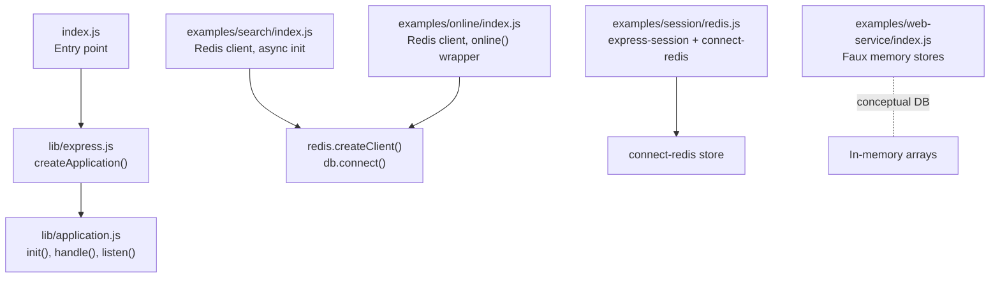
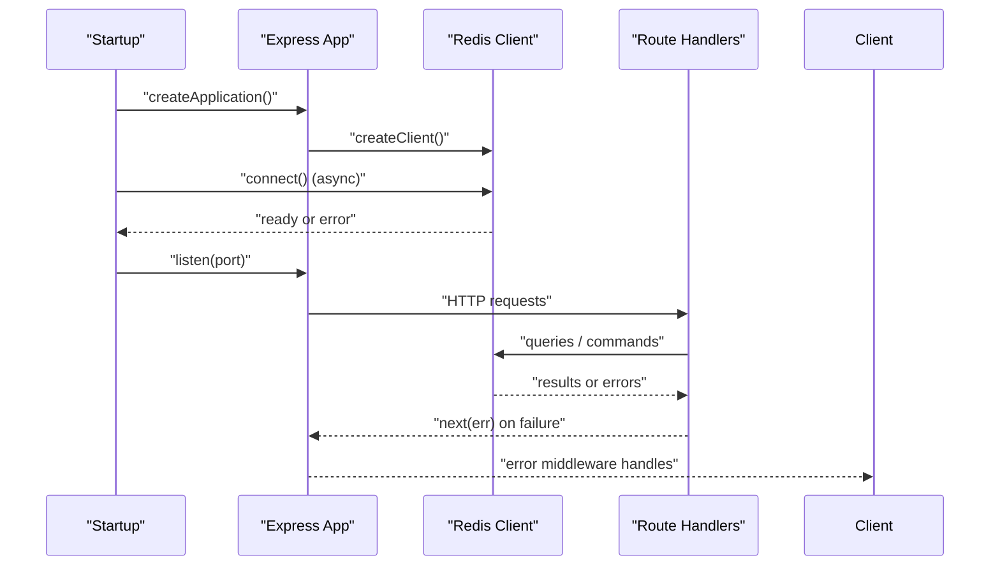
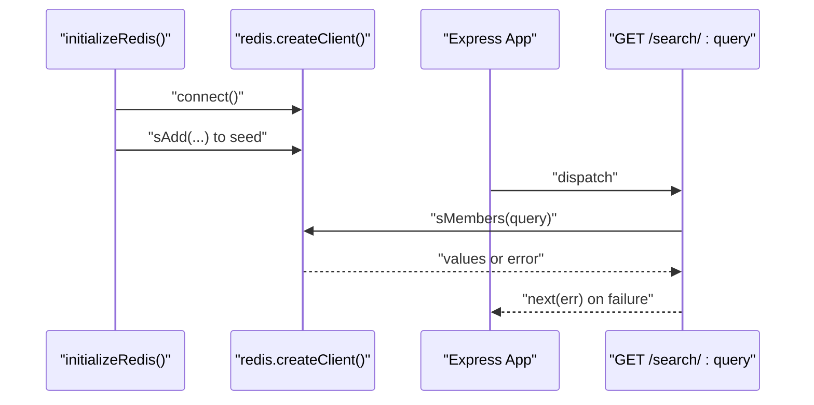
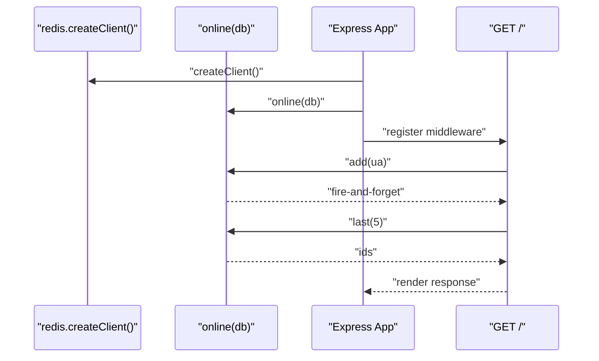
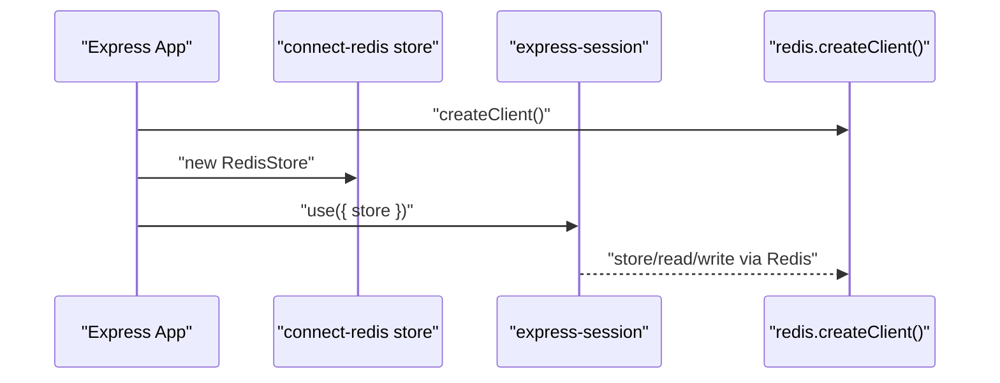
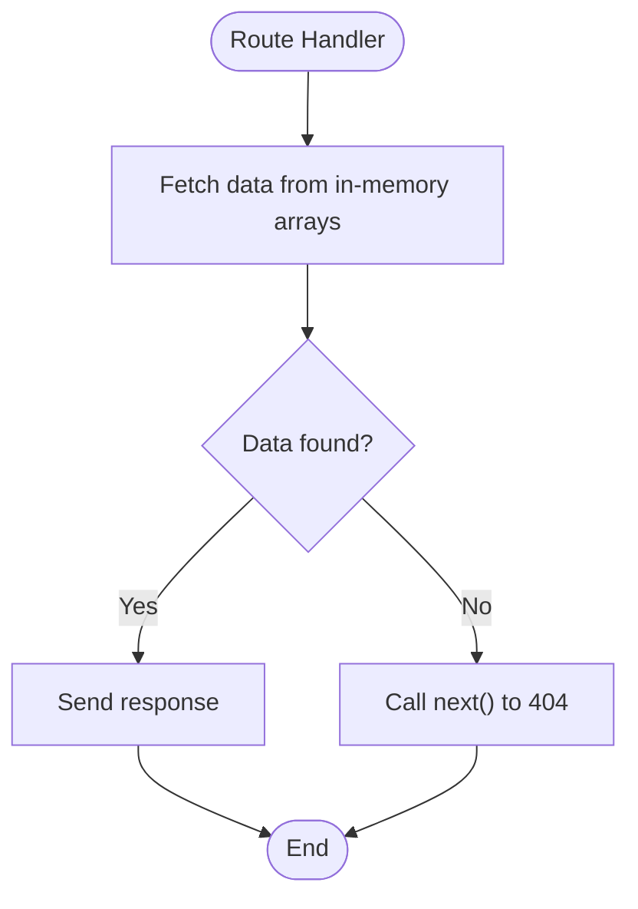
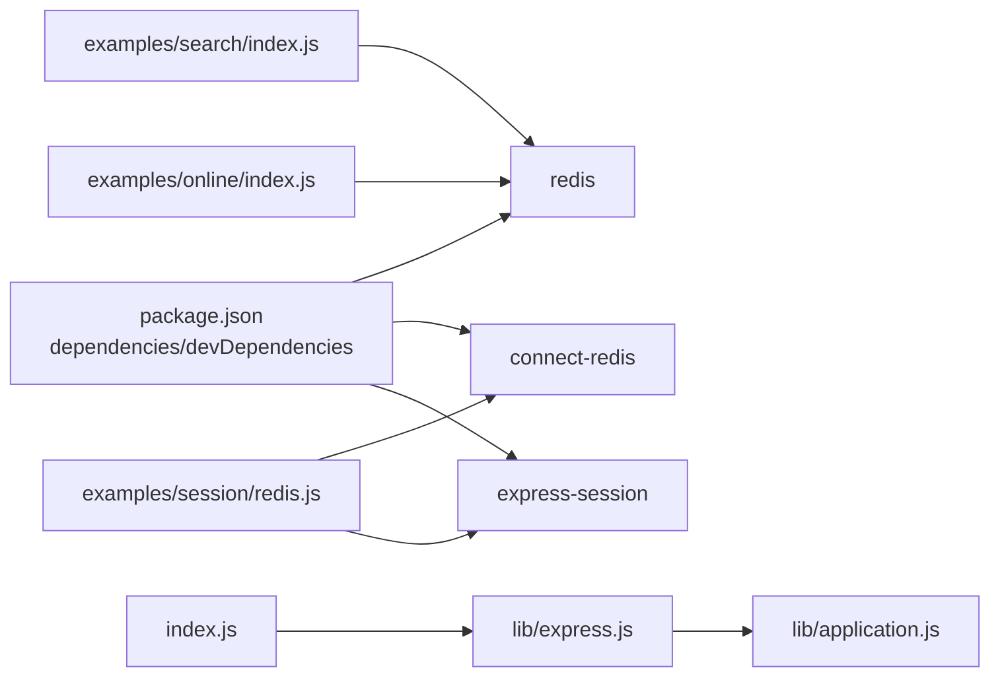

# Database Connections & Configuration

<cite>
**Referenced Files in This Document**
- [index.js](file://index.js)
- [lib/express.js](file://lib/express.js)
- [lib/application.js](file://lib/application.js)
- [examples/search/index.js](file://examples/search/index.js)
- [examples/online/index.js](file://examples/online/index.js)
- [examples/session/redis.js](file://examples/session/redis.js)
- [examples/web-service/index.js](file://examples/web-service/index.js)
- [package.json](file://package.json)
</cite>

## Table of Contents
1. [Introduction](#introduction)
2. [Project Structure](#project-structure)
3. [Core Components](#core-components)
4. [Architecture Overview](#architecture-overview)
5. [Detailed Component Analysis](#detailed-component-analysis)
6. [Dependency Analysis](#dependency-analysis)
7. [Performance Considerations](#performance-considerations)
8. [Troubleshooting Guide](#troubleshooting-guide)
9. [Conclusion](#conclusion)
10. [Appendices](#appendices)

## Introduction
This document explains how to manage database connections and configuration in Express.js applications using patterns demonstrated in the repository. It focuses on connection establishment, lifecycle management, error handling, and security considerations. While the repository primarily demonstrates Redis usage via the redis client and Redis-backed sessions, the same Express patterns apply broadly to other databases: initialize the client early, validate connectivity during startup, propagate errors via middleware, and centralize configuration in environment variables.

## Project Structure
The repository organizes database-related examples under the examples directory. Express core resides in lib/, with the main entry point in index.js. The examples demonstrate:
- Redis-backed search and online user tracking
- Redis-backed session storage
- Faux in-memory data stores used as conceptual database stand-ins

**Diagram sources**
- [index.js:1-12](file://index.js#L1-L12)
- [lib/express.js:36-56](file://lib/express.js#L36-L56)
- [lib/application.js:59-83](file://lib/application.js#L59-L83)
- [examples/search/index.js:18](file://examples/search/index.js#L18)
- [examples/online/index.js:17](file://examples/online/index.js#L17)
- [examples/session/redis.js:13](file://examples/session/redis.js#L13)
- [examples/web-service/index.js:51-63](file://examples/web-service/index.js#L51-L63)

**Section sources**
- [index.js:1-12](file://index.js#L1-L12)
- [lib/express.js:36-56](file://lib/express.js#L36-L56)
- [lib/application.js:59-83](file://lib/application.js#L59-L83)
- [examples/search/index.js:18](file://examples/search/index.js#L18)
- [examples/online/index.js:17](file://examples/online/index.js#L17)
- [examples/session/redis.js:13](file://examples/session/redis.js#L13)
- [examples/web-service/index.js:51-63](file://examples/web-service/index.js#L51-L63)

## Core Components
- Express application creation and lifecycle:
  - Application factory initializes settings, routers, and default middleware.
  - Server startup uses the standard HTTP server listener.
- Redis client usage:
  - Clients are created early and connected asynchronously during application bootstrap.
  - Errors during initialization are handled and logged, with controlled process exit when necessary.
- Session-backed Redis:
  - express-session integrates with connect-redis to persist sessions in Redis, enabling horizontal scaling and centralized state.

Key implementation references:
- Application initialization and server listening
  - [lib/application.js:59-83](file://lib/application.js#L59-L83)
  - [lib/application.js:577-632](file://lib/application.js#L577-L632)
- Redis client creation and connection
  - [examples/search/index.js:18](file://examples/search/index.js#L18)
  - [examples/online/index.js:17](file://examples/online/index.js#L17)
- Redis-backed sessions
  - [examples/session/redis.js:13-25](file://examples/session/redis.js#L13-L25)

**Section sources**
- [lib/application.js:59-83](file://lib/application.js#L59-L83)
- [lib/application.js:577-632](file://lib/application.js#L577-L632)
- [examples/search/index.js:18](file://examples/search/index.js#L18)
- [examples/online/index.js:17](file://examples/online/index.js#L17)
- [examples/session/redis.js:13-25](file://examples/session/redis.js#L13-L25)

## Architecture Overview
The examples illustrate a consistent pattern:
- On startup, the application creates a database client (e.g., Redis).
- An async initialization routine connects the client and optionally seeds data.
- Routes access the shared client instance to perform reads/writes.
- Errors are caught and forwarded to Express’s error-handling middleware.

**Diagram sources**
- [examples/search/index.js:29-46](file://examples/search/index.js#L29-L46)
- [examples/search/index.js:77-83](file://examples/search/index.js#L77-L83)
- [examples/online/index.js:17](file://examples/online/index.js#L17)
- [examples/session/redis.js:13-25](file://examples/session/redis.js#L13-L25)

## Detailed Component Analysis

### Redis Search Example
This example demonstrates:
- Creating a Redis client
- Asynchronous connection and seeding
- Route handlers using the client
- Error propagation to Express error handling

**Diagram sources**
- [examples/search/index.js:29-46](file://examples/search/index.js#L29-L46)
- [examples/search/index.js:52-60](file://examples/search/index.js#L52-L60)

**Section sources**
- [examples/search/index.js:29-46](file://examples/search/index.js#L29-L46)
- [examples/search/index.js:52-60](file://examples/search/index.js#L52-L60)

### Online Users Example
This example wraps a Redis client with an online tracking helper and logs users online via Redis sets.

**Diagram sources**
- [examples/online/index.js:17](file://examples/online/index.js#L17)
- [examples/online/index.js:21](file://examples/online/index.js#L21)
- [examples/online/index.js:50-55](file://examples/online/index.js#L50-L55)

**Section sources**
- [examples/online/index.js:17](file://examples/online/index.js#L17)
- [examples/online/index.js:21](file://examples/online/index.js#L21)
- [examples/online/index.js:50-55](file://examples/online/index.js#L50-L55)

### Redis-Backed Sessions
This example shows integrating Redis for session storage using express-session and connect-redis.

**Diagram sources**
- [examples/session/redis.js:13-25](file://examples/session/redis.js#L13-L25)

**Section sources**
- [examples/session/redis.js:13-25](file://examples/session/redis.js#L13-L25)

### Conceptual In-Memory Databases
The web service example uses in-memory arrays as conceptual database stores, useful for understanding separation of concerns between routes and data access.

**Section sources**
- [examples/web-service/index.js:51-63](file://examples/web-service/index.js#L51-L63)
- [examples/web-service/index.js:75-91](file://examples/web-service/index.js#L75-L91)

## Dependency Analysis
- Express entry point delegates to the internal library.
- Express core depends on HTTP server, router, and middleware stack.
- Examples depend on external packages for Redis and session storage.

**Diagram sources**
- [package.json:34-81](file://package.json#L34-L81)
- [index.js:1-12](file://index.js#L1-L12)
- [lib/express.js:36-56](file://lib/express.js#L36-L56)
- [examples/search/index.js:16](file://examples/search/index.js#L16)
- [examples/online/index.js:16](file://examples/online/index.js#L16)
- [examples/session/redis.js:9-13](file://examples/session/redis.js#L9-L13)

**Section sources**
- [package.json:34-81](file://package.json#L34-L81)
- [index.js:1-12](file://index.js#L1-L12)
- [lib/express.js:36-56](file://lib/express.js#L36-L56)
- [examples/search/index.js:16](file://examples/search/index.js#L16)
- [examples/online/index.js:16](file://examples/online/index.js#L16)
- [examples/session/redis.js:9-13](file://examples/session/redis.js#L9-L13)

## Performance Considerations
- Prefer single shared client instances per process to reduce overhead and enable connection reuse.
- Use async initialization to ensure readiness before accepting traffic.
- For Redis, leverage pipelining for bulk operations and monitor command latency.
- For session-backed Redis, tune expiration and consider compression for large session payloads.
- Centralize timeouts and retry policies at the client level to avoid blocking route handlers.

[No sources needed since this section provides general guidance]

## Troubleshooting Guide
Common issues and remedies:
- Connection failures during startup:
  - Validate host/port/environment variables before connecting.
  - Log detailed errors and exit the process if critical resources are unavailable.
- Runtime errors from database operations:
  - Forward errors to Express error-handling middleware to maintain consistent responses.
- Session store connectivity:
  - Ensure Redis is reachable and credentials are configured; otherwise, sessions will fail.

References:
- Startup and error logging patterns
  - [examples/search/index.js:42-45](file://examples/search/index.js#L42-L45)
- Error forwarding to Express error middleware
  - [examples/search/index.js:56-59](file://examples/search/index.js#L56-L59)

**Section sources**
- [examples/search/index.js:42-45](file://examples/search/index.js#L42-L45)
- [examples/search/index.js:56-59](file://examples/search/index.js#L56-L59)

## Conclusion
The repository demonstrates robust Express patterns for database connection management centered on early client creation, asynchronous initialization, and consistent error handling. These patterns translate directly to other databases by swapping the driver and adapting connection parameters. Security is addressed by externalizing credentials and enabling TLS where supported by the target database.

[No sources needed since this section summarizes without analyzing specific files]

## Appendices

### Environment Variables and Configuration
- Use environment variables for host, port, and credentials.
- Set NODE_ENV appropriately to control logging and error verbosity.
- Apply secrets management for production deployments.

References:
- Environment detection and defaults
  - [lib/application.js:90-99](file://lib/application.js#L90-L99)

**Section sources**
- [lib/application.js:90-99](file://lib/application.js#L90-L99)

### Connection String Management
- For Redis, pass connection options to createClient() or use a connection string.
- For SQL databases, use connection strings via dialect-specific clients (e.g., PostgreSQL or MySQL drivers).
- Centralize configuration in a dedicated module and import it across the app.

[No sources needed since this section provides general guidance]

### Connection Lifecycle Management
- Initialize clients during application bootstrap.
- Gracefully close connections on shutdown signals.
- Implement health checks to validate connectivity periodically.

[No sources needed since this section provides general guidance]

### Security Considerations
- Store credentials in environment variables or secure secret managers.
- Enable TLS/SSL for database connections when available.
- Limit exposed ports and restrict network access to database hosts.

[No sources needed since this section provides general guidance]