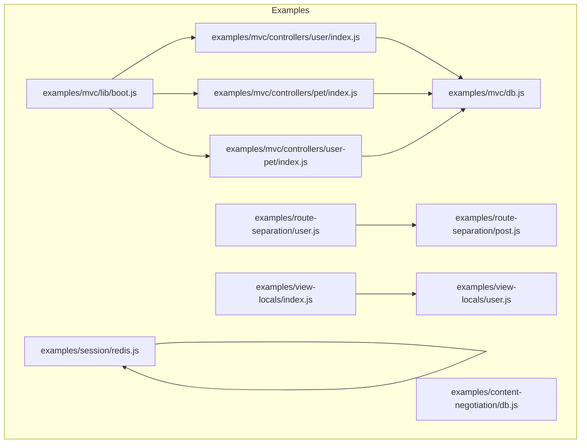
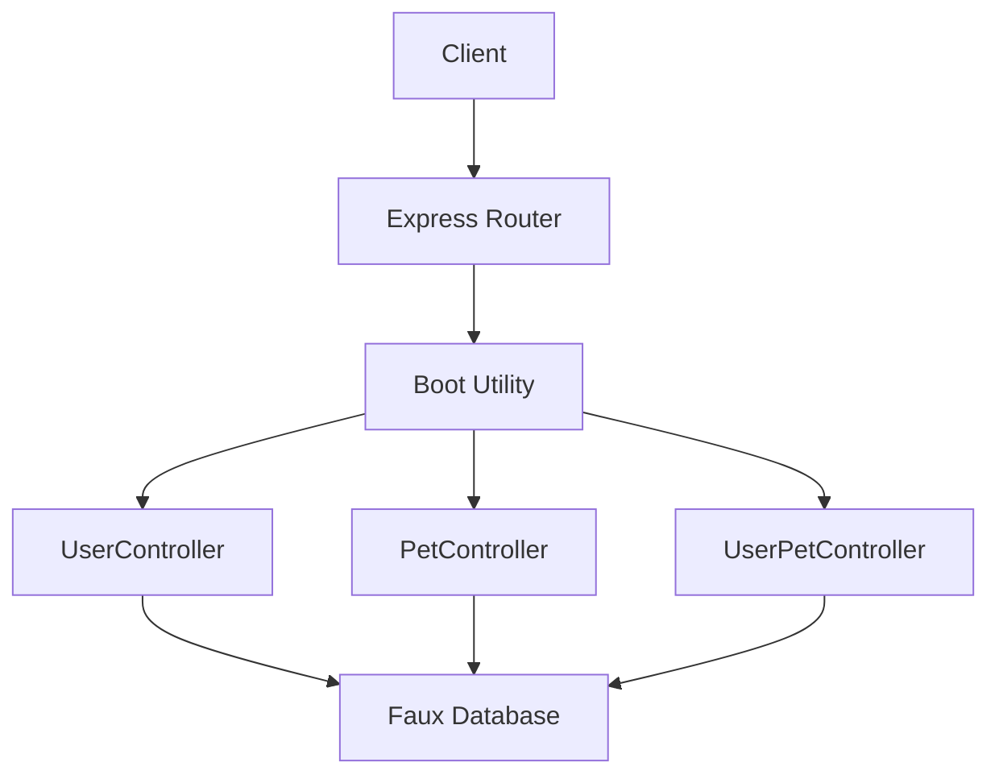
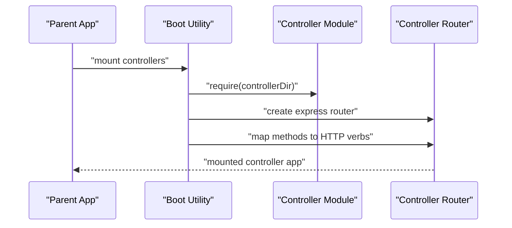
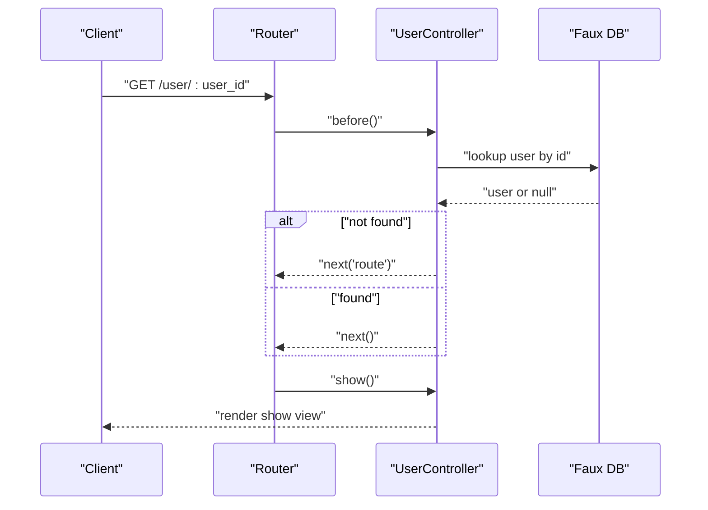
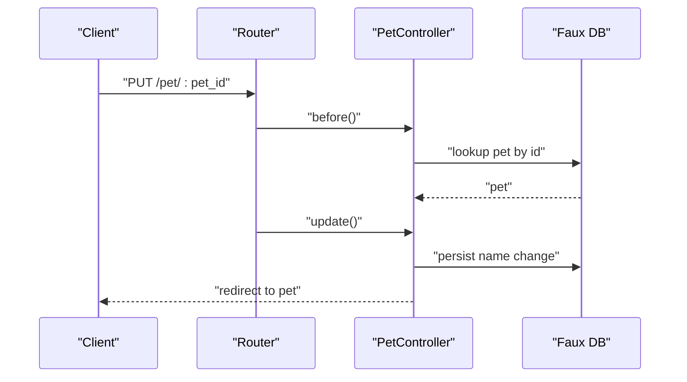
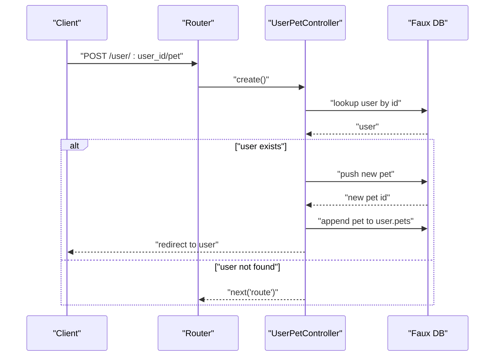
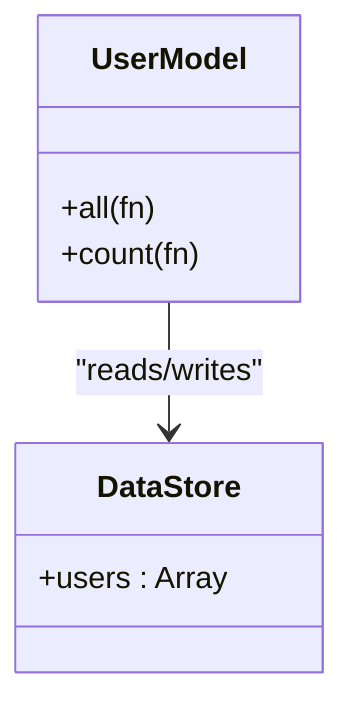
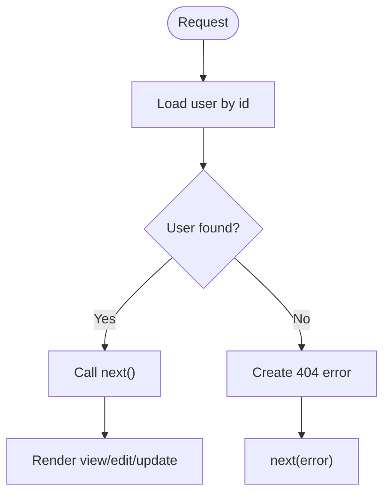
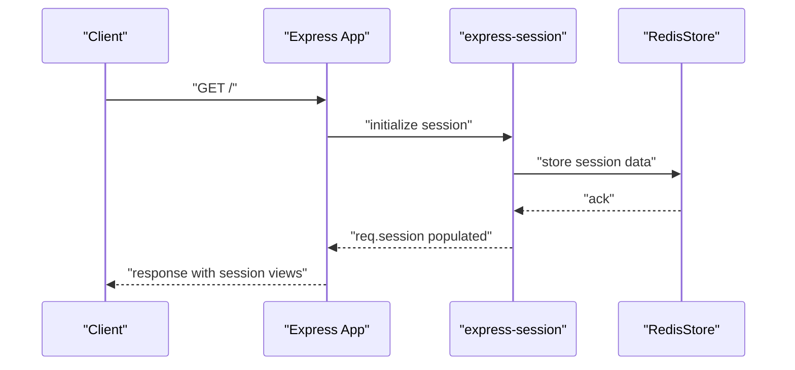
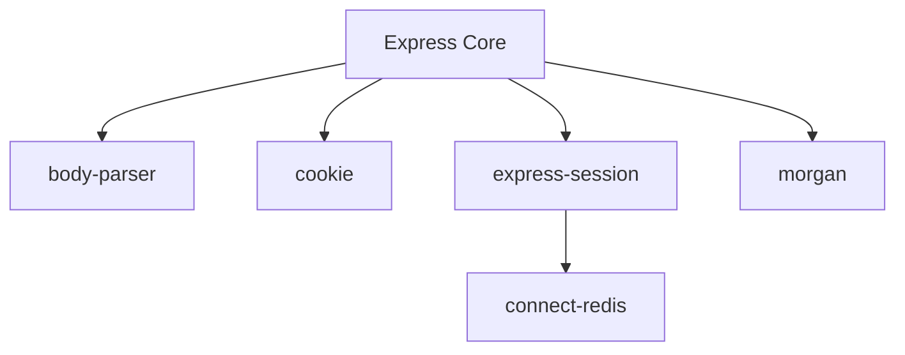

# Database Integration

<cite>
**Referenced Files in This Document**
- [examples/mvc/db.js](file://examples/mvc/db.js)
- [examples/mvc/lib/boot.js](file://examples/mvc/lib/boot.js)
- [examples/mvc/controllers/user/index.js](file://examples/mvc/controllers/user/index.js)
- [examples/mvc/controllers/pet/index.js](file://examples/mvc/controllers/pet/index.js)
- [examples/mvc/controllers/user-pet/index.js](file://examples/mvc/controllers/user-pet/index.js)
- [examples/content-negotiation/db.js](file://examples/content-negotiation/db.js)
- [examples/route-separation/user.js](file://examples/route-separation/user.js)
- [examples/route-separation/post.js](file://examples/route-separation/post.js)
- [examples/view-locals/user.js](file://examples/view-locals/user.js)
- [examples/session/redis.js](file://examples/session/redis.js)
- [examples/view-locals/index.js](file://examples/view-locals/index.js)
- [package.json](file://package.json)
</cite>

## Table of Contents
1. [Introduction](#introduction)
2. [Project Structure](#project-structure)
3. [Core Components](#core-components)
4. [Architecture Overview](#architecture-overview)
5. [Detailed Component Analysis](#detailed-component-analysis)
6. [Dependency Analysis](#dependency-analysis)
7. [Performance Considerations](#performance-considerations)
8. [Security and Validation](#security-and-validation)
9. [Troubleshooting Guide](#troubleshooting-guide)
10. [Conclusion](#conclusion)

## Introduction
This document explains database integration patterns in Express.js using examples from the repository. It focuses on data access patterns, MVC separation, and practical strategies for integrating with databases. The examples demonstrate:
- Faux database patterns simulating data access
- Model-like modules exposing asynchronous APIs
- Controller logic for CRUD operations and routing
- View rendering and middleware integration
- Session-backed persistence using Redis

Where applicable, the document maps concepts to real-world integrations with MongoDB, PostgreSQL, and MySQL using appropriate drivers and ORMs.

## Project Structure
The repository organizes database-related patterns primarily under examples:
- MVC example with a faux database, bootstrapper, and controllers
- Content negotiation example with a minimal array-backed store
- Route separation example with load helpers and CRUD handlers
- View locals example with a model-like module and middleware composition
- Session example demonstrating Redis-backed sessions

**Diagram sources**
- [examples/mvc/lib/boot.js:11-82](file://examples/mvc/lib/boot.js#L11-L82)
- [examples/mvc/controllers/user/index.js:7-41](file://examples/mvc/controllers/user/index.js#L7-L41)
- [examples/mvc/controllers/pet/index.js:7-31](file://examples/mvc/controllers/pet/index.js#L7-L31)
- [examples/mvc/controllers/user-pet/index.js:7-22](file://examples/mvc/controllers/user-pet/index.js#L7-L22)
- [examples/mvc/db.js:5-16](file://examples/mvc/db.js#L5-L16)
- [examples/content-negotiation/db.js:3-9](file://examples/content-negotiation/db.js#L3-L9)
- [examples/route-separation/user.js:5-8](file://examples/route-separation/user.js#L5-L8)
- [examples/route-separation/post.js:5-9](file://examples/route-separation/post.js#L5-L9)
- [examples/view-locals/user.js:30-36](file://examples/view-locals/user.js#L30-L36)
- [examples/view-locals/index.js:26-38](file://examples/view-locals/index.js#L26-L38)
- [examples/session/redis.js:13-25](file://examples/session/redis.js#L13-L25)

**Section sources**
- [examples/mvc/db.js:1-17](file://examples/mvc/db.js#L1-L17)
- [examples/mvc/lib/boot.js:1-84](file://examples/mvc/lib/boot.js#L1-L84)
- [examples/mvc/controllers/user/index.js:1-42](file://examples/mvc/controllers/user/index.js#L1-L42)
- [examples/mvc/controllers/pet/index.js:1-32](file://examples/mvc/controllers/pet/index.js#L1-L32)
- [examples/mvc/controllers/user-pet/index.js:1-23](file://examples/mvc/controllers/user-pet/index.js#L1-L23)
- [examples/content-negotiation/db.js:1-10](file://examples/content-negotiation/db.js#L1-L10)
- [examples/route-separation/user.js:1-48](file://examples/route-separation/user.js#L1-L48)
- [examples/route-separation/post.js:1-14](file://examples/route-separation/post.js#L1-L14)
- [examples/view-locals/user.js:1-37](file://examples/view-locals/user.js#L1-L37)
- [examples/view-locals/index.js:1-66](file://examples/view-locals/index.js#L1-L66)
- [examples/session/redis.js:1-40](file://examples/session/redis.js#L1-L40)

## Core Components
- Faux database modules simulate persistent stores and expose synchronous arrays or objects. These act as stand-ins for real databases during demonstrations.
- Model-like modules encapsulate data access methods with asynchronous signatures, enabling consistent patterns for fetching collections, counts, and individual records.
- Controllers implement CRUD endpoints and use middleware to load resources and manage state transitions.
- Bootstrapper utilities dynamically generate routes from controller method exports, supporting scalable MVC setups.
- Sessions backed by Redis integrate with Express to persist user state across requests.

Key patterns demonstrated:
- Asynchronous data access via callbacks and nextTick
- Resource loading via middleware (e.g., before hooks)
- Rendering with view engines and passing data to templates
- Redirects after updates and flash-like messages

**Section sources**
- [examples/mvc/db.js:3-16](file://examples/mvc/db.js#L3-L16)
- [examples/view-locals/user.js:13-26](file://examples/view-locals/user.js#L13-L26)
- [examples/mvc/controllers/user/index.js:11-22](file://examples/mvc/controllers/user/index.js#L11-L22)
- [examples/mvc/lib/boot.js:32-78](file://examples/mvc/lib/boot.js#L32-L78)
- [examples/session/redis.js:19-25](file://examples/session/redis.js#L19-L25)

## Architecture Overview
The MVC architecture integrates controllers, models, and views:
- Controllers receive requests, delegate to models for data access, and render views with context.
- Models encapsulate data retrieval and mutation, returning results asynchronously.
- Views render HTML with templating engines configured per controller or application.

**Diagram sources**
- [examples/mvc/lib/boot.js:11-82](file://examples/mvc/lib/boot.js#L11-L82)
- [examples/mvc/controllers/user/index.js:7-41](file://examples/mvc/controllers/user/index.js#L7-L41)
- [examples/mvc/controllers/pet/index.js:7-31](file://examples/mvc/controllers/pet/index.js#L7-L31)
- [examples/mvc/controllers/user-pet/index.js:7-22](file://examples/mvc/controllers/user-pet/index.js#L7-L22)
- [examples/mvc/db.js:5-16](file://examples/mvc/db.js#L5-L16)

## Detailed Component Analysis

### MVC Bootstrapper and Routing
The boot utility reads controller directories, sets view engines and view paths, and generates routes from exported methods. It supports optional before middleware and prefixes for nested routes.

**Diagram sources**
- [examples/mvc/lib/boot.js:11-82](file://examples/mvc/lib/boot.js#L11-L82)

**Section sources**
- [examples/mvc/lib/boot.js:11-82](file://examples/mvc/lib/boot.js#L11-L82)

### User Controller and Resource Loading
The user controller loads a user resource via a before hook, renders lists and forms, and updates user data. It relies on the faux database module for data access.

**Diagram sources**
- [examples/mvc/controllers/user/index.js:11-22](file://examples/mvc/controllers/user/index.js#L11-L22)
- [examples/mvc/db.js:12-16](file://examples/mvc/db.js#L12-L16)

**Section sources**
- [examples/mvc/controllers/user/index.js:11-34](file://examples/mvc/controllers/user/index.js#L11-L34)
- [examples/mvc/db.js:12-16](file://examples/mvc/db.js#L12-L16)

### Pet Controller and Updates
The pet controller handles viewing and editing pet resources, updating names, and redirecting after changes.

**Diagram sources**
- [examples/mvc/controllers/pet/index.js:11-31](file://examples/mvc/controllers/pet/index.js#L11-L31)
- [examples/mvc/db.js:5-10](file://examples/mvc/db.js#L5-L10)

**Section sources**
- [examples/mvc/controllers/pet/index.js:11-31](file://examples/mvc/controllers/pet/index.js#L11-L31)
- [examples/mvc/db.js:5-10](file://examples/mvc/db.js#L5-L10)

### User-Pet Association Creation
The user-pet controller creates a new pet associated with a user, updates both the pets collection and the user’s pet list, and redirects to the user profile.

**Diagram sources**
- [examples/mvc/controllers/user-pet/index.js:12-22](file://examples/mvc/controllers/user-pet/index.js#L12-L22)
- [examples/mvc/db.js:5-16](file://examples/mvc/db.js#L5-L16)

**Section sources**
- [examples/mvc/controllers/user-pet/index.js:12-22](file://examples/mvc/controllers/user-pet/index.js#L12-L22)
- [examples/mvc/db.js:5-16](file://examples/mvc/db.js#L5-L16)

### Model-Like Module Pattern
The view-locals example demonstrates a model-like module with asynchronous methods for fetching all records and counts. It uses a private array as a data store and ensures asynchronous behavior using nextTick.

**Diagram sources**
- [examples/view-locals/user.js:13-26](file://examples/view-locals/user.js#L13-L26)
- [examples/view-locals/user.js:30-36](file://examples/view-locals/user.js#L30-L36)

**Section sources**
- [examples/view-locals/user.js:13-26](file://examples/view-locals/user.js#L13-L26)
- [examples/view-locals/user.js:30-36](file://examples/view-locals/user.js#L30-L36)

### Content Negotiation Store
The content-negotiation example maintains a simple array-backed store for users, suitable for lightweight scenarios or testing.

**Section sources**
- [examples/content-negotiation/db.js:3-9](file://examples/content-negotiation/db.js#L3-L9)

### Route Separation Patterns
The route-separation example separates concerns across modules: a user module with list, load, view, edit, and update handlers; and a posts module with a list handler. The user module uses a load helper to populate req.user and either continues or triggers a 404.

**Diagram sources**
- [examples/route-separation/user.js:14-24](file://examples/route-separation/user.js#L14-L24)

**Section sources**
- [examples/route-separation/user.js:10-24](file://examples/route-separation/user.js#L10-L24)
- [examples/route-separation/post.js:11-13](file://examples/route-separation/post.js#L11-L13)

### Session-Backed Persistence with Redis
The session example demonstrates Express session integration with Redis via connect-redis. It configures session options and uses req.session to track visits.

**Diagram sources**
- [examples/session/redis.js:19-25](file://examples/session/redis.js#L19-L25)
- [examples/session/redis.js:27-36](file://examples/session/redis.js#L27-L36)

**Section sources**
- [examples/session/redis.js:19-36](file://examples/session/redis.js#L19-L36)

## Dependency Analysis
Express depends on a set of middleware and utilities that enable database integration patterns:
- Body parsing for request payloads
- Cookie and session management
- Error handling and response utilities
- Static serving and content negotiation

**Diagram sources**
- [package.json:34-62](file://package.json#L34-L62)
- [package.json:64-81](file://package.json#L64-L81)

**Section sources**
- [package.json:34-81](file://package.json#L34-L81)

## Performance Considerations
- Asynchronous data access: Prefer asynchronous APIs to avoid blocking the event loop. The examples use nextTick to simulate async behavior.
- Middleware composition: Chain lightweight middleware to minimize overhead and keep request handling efficient.
- Caching: Introduce caching layers (e.g., in-memory or Redis) to reduce repeated computations and database queries.
- Pagination and limits: Apply pagination for large datasets to control memory usage and response times.
- Connection pooling: For real databases, configure connection pools to reuse connections and reduce overhead.
- Indexing: Ensure database indexes on frequently queried fields to improve lookup performance.

[No sources needed since this section provides general guidance]

## Security and Validation
- Input validation and sanitization: Validate and sanitize all incoming data before processing. Use libraries or built-in utilities to prevent injection attacks.
- Authentication and authorization: Enforce proper authentication checks and authorization rules in controllers before mutating data.
- Secure headers: Configure security-related headers to protect against common vulnerabilities.
- Session security: Use secure session options (e.g., httpOnly, sameSite, secure flags) and rotate secrets regularly.
- Error handling: Avoid leaking sensitive information in error responses; log errors securely and return generic messages to clients.

[No sources needed since this section provides general guidance]

## Troubleshooting Guide
Common issues and resolutions:
- Resource not found: Use middleware to check for missing resources and trigger appropriate error handling or route skipping.
- Session not persisting: Verify session configuration and Redis connectivity; ensure store initialization matches the session options.
- View rendering errors: Confirm view engine configuration and view paths are correctly set in controllers or boot utilities.
- Data inconsistencies: Ensure updates are atomic and consistent; consider transactions for multi-step operations.

**Section sources**
- [examples/mvc/controllers/user/index.js:11-22](file://examples/mvc/controllers/user/index.js#L11-L22)
- [examples/session/redis.js:19-25](file://examples/session/redis.js#L19-L25)
- [examples/mvc/lib/boot.js:26-28](file://examples/mvc/lib/boot.js#L26-L28)

## Conclusion
The repository demonstrates robust patterns for database integration in Express.js:
- Encapsulate data access in model-like modules with asynchronous APIs
- Use controllers to orchestrate requests, load resources, and render views
- Leverage boot utilities to scale MVC architectures
- Integrate sessions with Redis for persistent user state
- Apply validation, sanitization, and security best practices

These patterns translate naturally to real-world integrations with MongoDB, PostgreSQL, and MySQL by replacing faux stores with appropriate drivers and ORMs while preserving the same architectural structure.