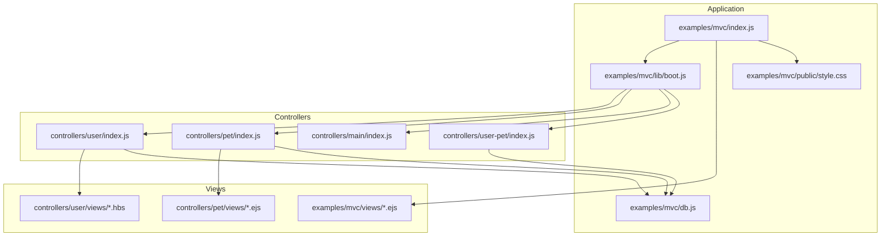
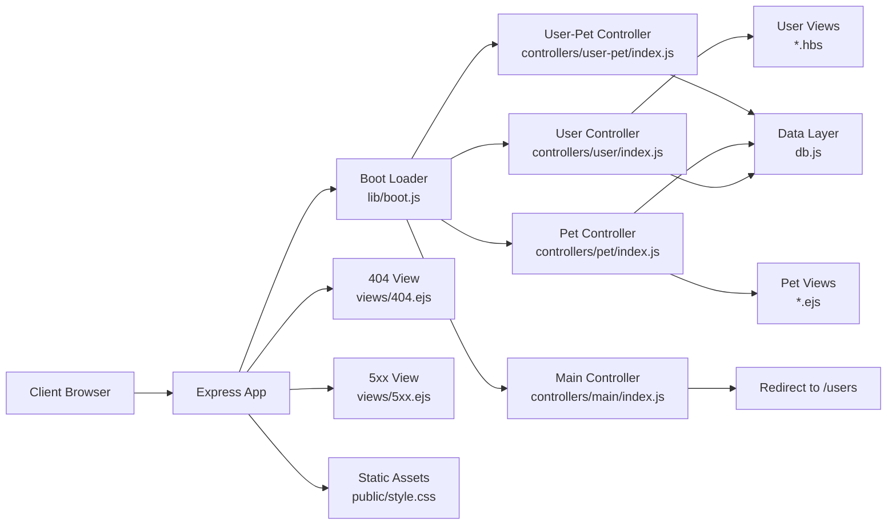
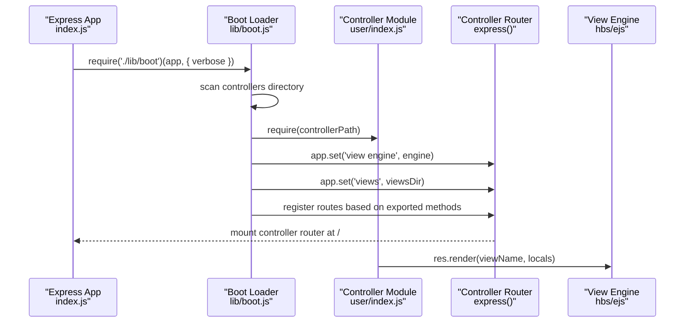
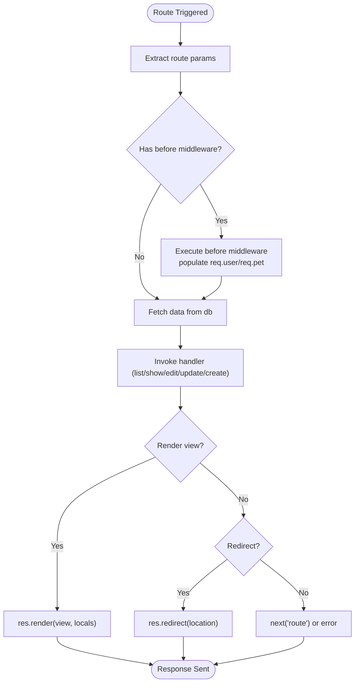
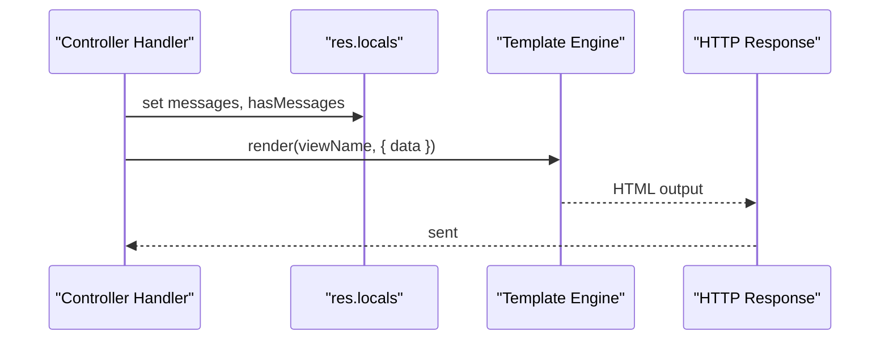
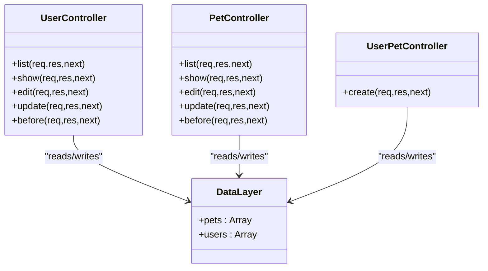
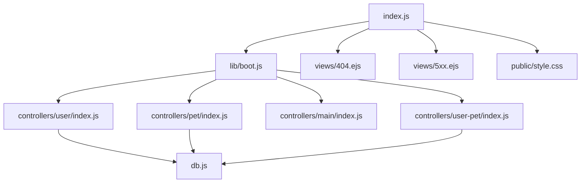

# MVC Architecture Implementation

<cite>
**Referenced Files in This Document**
- [examples/mvc/index.js](file://examples/mvc/index.js)
- [examples/mvc/lib/boot.js](file://examples/mvc/lib/boot.js)
- [examples/mvc/db.js](file://examples/mvc/db.js)
- [examples/mvc/controllers/main/index.js](file://examples/mvc/controllers/main/index.js)
- [examples/mvc/controllers/user/index.js](file://examples/mvc/controllers/user/index.js)
- [examples/mvc/controllers/pet/index.js](file://examples/mvc/controllers/pet/index.js)
- [examples/mvc/controllers/user-pet/index.js](file://examples/mvc/controllers/user-pet/index.js)
- [examples/mvc/controllers/user/views/list.hbs](file://examples/mvc/controllers/user/views/list.hbs)
- [examples/mvc/controllers/user/views/show.hbs](file://examples/mvc/controllers/user/views/show.hbs)
- [examples/mvc/controllers/pet/views/edit.ejs](file://examples/mvc/controllers/pet/views/edit.ejs)
- [examples/mvc/controllers/pet/views/show.ejs](file://examples/mvc/controllers/pet/views/show.ejs)
- [examples/mvc/views/404.ejs](file://examples/mvc/views/404.ejs)
- [examples/mvc/views/5xx.ejs](file://examples/mvc/views/5xx.ejs)
- [examples/mvc/public/style.css](file://examples/mvc/public/style.css)
- [test/acceptance/mvc.js](file://test/acceptance/mvc.js)
</cite>

## Table of Contents
1. [Introduction](#introduction)
2. [Project Structure](#project-structure)
3. [Core Components](#core-components)
4. [Architecture Overview](#architecture-overview)
5. [Detailed Component Analysis](#detailed-component-analysis)
6. [Dependency Analysis](#dependency-analysis)
7. [Performance Considerations](#performance-considerations)
8. [Troubleshooting Guide](#troubleshooting-guide)
9. [Conclusion](#conclusion)

## Introduction
This document explains how to implement Model-View-Controller (MVC) architecture in Express.js using the provided example. It focuses on the separation of concerns among models, views, and controllers, and demonstrates how to structure applications around these layers. The example showcases controller organization, view rendering strategies, data flow between layers, controller composition via a boot loader, middleware integration, and error handling within an MVC structure.

## Project Structure
The MVC example organizes code into distinct layers:
- Application bootstrap and middleware configuration
- Controllers grouped by domain resources (user, pet, main)
- Views per controller and shared error views
- A minimal in-memory data layer (faux database)
- Shared static assets

**Diagram sources**
- [examples/mvc/index.js:1-96](file://examples/mvc/index.js#L1-L96)
- [examples/mvc/lib/boot.js:1-84](file://examples/mvc/lib/boot.js#L1-L84)
- [examples/mvc/db.js:1-17](file://examples/mvc/db.js#L1-L17)
- [examples/mvc/controllers/user/index.js:1-42](file://examples/mvc/controllers/user/index.js#L1-L42)
- [examples/mvc/controllers/pet/index.js:1-32](file://examples/mvc/controllers/pet/index.js#L1-L32)
- [examples/mvc/controllers/main/index.js:1-6](file://examples/mvc/controllers/main/index.js#L1-L6)
- [examples/mvc/controllers/user-pet/index.js:1-23](file://examples/mvc/controllers/user-pet/index.js#L1-L23)
- [examples/mvc/controllers/user/views/list.hbs:1-19](file://examples/mvc/controllers/user/views/list.hbs#L1-L19)
- [examples/mvc/controllers/pet/views/edit.ejs:1-18](file://examples/mvc/controllers/pet/views/edit.ejs#L1-L18)
- [examples/mvc/views/404.ejs:1-14](file://examples/mvc/views/404.ejs#L1-L14)
- [examples/mvc/views/5xx.ejs:1-14](file://examples/mvc/views/5xx.ejs#L1-L14)
- [examples/mvc/public/style.css:1-15](file://examples/mvc/public/style.css#L1-L15)

**Section sources**
- [examples/mvc/index.js:1-96](file://examples/mvc/index.js#L1-L96)
- [examples/mvc/lib/boot.js:1-84](file://examples/mvc/lib/boot.js#L1-L84)

## Core Components
- Application bootstrap and middleware
  - Sets view engine, views directory, static assets, sessions, body parsing, method override, and global message helpers.
  - Registers a global middleware to expose messages to views and clears them after rendering.
  - Defines centralized error and 404 handlers that render dedicated views.
- Boot loader
  - Scans the controllers directory, dynamically generates routes based on exported methods, supports optional before middleware, per-controller view engines, and URL prefixes.
- Controllers
  - Export route handlers (index, list, show, edit, update, create) and optional before middleware.
  - Access the data layer and render views with context.
- Views
  - Rendered by controllers; use EJS or Handlebars depending on controller configuration.
- Data layer
  - Minimal in-memory storage for users and pets used by controllers.

**Section sources**
- [examples/mvc/index.js:15-96](file://examples/mvc/index.js#L15-L96)
- [examples/mvc/lib/boot.js:11-84](file://examples/mvc/lib/boot.js#L11-L84)
- [examples/mvc/controllers/user/index.js:1-42](file://examples/mvc/controllers/user/index.js#L1-L42)
- [examples/mvc/controllers/pet/index.js:1-32](file://examples/mvc/controllers/pet/index.js#L1-L32)
- [examples/mvc/db.js:1-17](file://examples/mvc/db.js#L1-L17)

## Architecture Overview
The MVC pattern is implemented as follows:
- Model: The data layer abstraction resides in a single module that exposes collections for users and pets.
- View: Templates are organized under each controller’s views directory and rendered by controllers.
- Controller: Exposes route handlers and optional before middleware; orchestrates data retrieval, view rendering, and redirects.

**Diagram sources**
- [examples/mvc/lib/boot.js:11-84](file://examples/mvc/lib/boot.js#L11-L84)
- [examples/mvc/controllers/user/index.js:1-42](file://examples/mvc/controllers/user/index.js#L1-L42)
- [examples/mvc/controllers/pet/index.js:1-32](file://examples/mvc/controllers/pet/index.js#L1-L32)
- [examples/mvc/controllers/main/index.js:1-6](file://examples/mvc/controllers/main/index.js#L1-L6)
- [examples/mvc/controllers/user-pet/index.js:1-23](file://examples/mvc/controllers/user-pet/index.js#L1-L23)
- [examples/mvc/db.js:1-17](file://examples/mvc/db.js#L1-L17)
- [examples/mvc/views/404.ejs:1-14](file://examples/mvc/views/404.ejs#L1-L14)
- [examples/mvc/views/5xx.ejs:1-14](file://examples/mvc/views/5xx.ejs#L1-L14)
- [examples/mvc/public/style.css:1-15](file://examples/mvc/public/style.css#L1-L15)

## Detailed Component Analysis

### Boot Loader and Controller Composition
The boot loader dynamically discovers controllers, sets per-controller view engines and view directories, and maps exported methods to HTTP routes. It supports:
- Per-controller before middleware
- URL generation based on method names (index, list, show, edit, update, create)
- Optional controller-level prefix and controller-specific view engine

**Diagram sources**
- [examples/mvc/index.js:75-77](file://examples/mvc/index.js#L75-L77)
- [examples/mvc/lib/boot.js:11-84](file://examples/mvc/lib/boot.js#L11-L84)
- [examples/mvc/controllers/user/index.js:9](file://examples/mvc/controllers/user/index.js#L9)

**Section sources**
- [examples/mvc/lib/boot.js:11-84](file://examples/mvc/lib/boot.js#L11-L84)
- [examples/mvc/controllers/user/index.js:9](file://examples/mvc/controllers/user/index.js#L9)

### Controller Patterns: Route Handlers, Parameter Processing, and Responses
Controllers export route handlers and optional before middleware. They:
- Extract identifiers from route parameters
- Optionally fetch or prepare data via before middleware
- Render views with context or redirect after updates
- Use a custom response helper to queue messages for display

Key patterns demonstrated:
- Parameter extraction and existence checks
- Asynchronous simulation for data fetching
- Rendering with locals and redirecting after mutation
- Using a custom res.message() helper to pass flash-style messages

**Diagram sources**
- [examples/mvc/controllers/user/index.js:11-22](file://examples/mvc/controllers/user/index.js#L11-L22)
- [examples/mvc/controllers/pet/index.js:11-16](file://examples/mvc/controllers/pet/index.js#L11-L16)
- [examples/mvc/controllers/user/index.js:24-42](file://examples/mvc/controllers/user/index.js#L24-L42)
- [examples/mvc/controllers/pet/index.js:18-32](file://examples/mvc/controllers/pet/index.js#L18-L32)

**Section sources**
- [examples/mvc/controllers/user/index.js:11-42](file://examples/mvc/controllers/user/index.js#L11-L42)
- [examples/mvc/controllers/pet/index.js:11-32](file://examples/mvc/controllers/pet/index.js#L11-L32)
- [examples/mvc/controllers/main/index.js:3-5](file://examples/mvc/controllers/main/index.js#L3-L5)

### View Rendering Strategies and Template Integration
- Per-controller view engines: Controllers can specify their engine (EJS or Handlebars) via an exported property, allowing mixed templating within the same app.
- Per-controller views: Each controller defines its own views directory; the boot loader sets the views path accordingly.
- Global message exposure: A middleware populates res.locals with messages and hasMessages, enabling views to render notifications consistently.
- Shared error views: Centralized 404 and 5xx pages are rendered by the app-level error handlers.

**Diagram sources**
- [examples/mvc/index.js:52-73](file://examples/mvc/index.js#L52-L73)
- [examples/mvc/controllers/user/index.js:9](file://examples/mvc/controllers/user/index.js#L9)
- [examples/mvc/controllers/pet/index.js:9](file://examples/mvc/controllers/pet/index.js#L9)
- [examples/mvc/views/404.ejs:1-14](file://examples/mvc/views/404.ejs#L1-L14)
- [examples/mvc/views/5xx.ejs:1-14](file://examples/mvc/views/5xx.ejs#L1-L14)

**Section sources**
- [examples/mvc/index.js:52-73](file://examples/mvc/index.js#L52-L73)
- [examples/mvc/controllers/user/views/list.hbs:1-19](file://examples/mvc/controllers/user/views/list.hbs#L1-L19)
- [examples/mvc/controllers/user/views/show.hbs:1-32](file://examples/mvc/controllers/user/views/show.hbs#L1-L32)
- [examples/mvc/controllers/pet/views/edit.ejs:1-18](file://examples/mvc/controllers/pet/views/edit.ejs#L1-L18)
- [examples/mvc/controllers/pet/views/show.ejs:1-16](file://examples/mvc/controllers/pet/views/show.ejs#L1-L16)

### Model Abstraction and Data Access Layer
The data layer is a minimal in-memory abstraction:
- Provides collections for pets and users
- Supports push operations and lookup by identifier
- Used by controllers to simulate persistence

**Diagram sources**
- [examples/mvc/db.js:1-17](file://examples/mvc/db.js#L1-L17)
- [examples/mvc/controllers/user/index.js:1-42](file://examples/mvc/controllers/user/index.js#L1-L42)
- [examples/mvc/controllers/pet/index.js:1-32](file://examples/mvc/controllers/pet/index.js#L1-L32)
- [examples/mvc/controllers/user-pet/index.js:1-23](file://examples/mvc/controllers/user-pet/index.js#L1-L23)

**Section sources**
- [examples/mvc/db.js:1-17](file://examples/mvc/db.js#L1-L17)

### Practical Examples from the MVC Example
- Main controller redirect: The main controller redirects the root path to the users list.
- User controller CRUD: Demonstrates listing users, showing a user, editing a user, updating a user, and asynchronous before middleware.
- Pet controller CRUD: Demonstrates listing pets, showing a pet, editing a pet, and updating a pet.
- User-Pet composite: Creates a pet associated with a user under a prefixed route.
- View templates: Show how controllers render lists and forms using EJS and Handlebars.

**Section sources**
- [examples/mvc/controllers/main/index.js:3-5](file://examples/mvc/controllers/main/index.js#L3-L5)
- [examples/mvc/controllers/user/index.js:24-42](file://examples/mvc/controllers/user/index.js#L24-L42)
- [examples/mvc/controllers/pet/index.js:18-32](file://examples/mvc/controllers/pet/index.js#L18-L32)
- [examples/mvc/controllers/user-pet/index.js:12-22](file://examples/mvc/controllers/user-pet/index.js#L12-L22)
- [examples/mvc/controllers/user/views/list.hbs:1-19](file://examples/mvc/controllers/user/views/list.hbs#L1-L19)
- [examples/mvc/controllers/user/views/show.hbs:1-32](file://examples/mvc/controllers/user/views/show.hbs#L1-L32)
- [examples/mvc/controllers/pet/views/edit.ejs:1-18](file://examples/mvc/controllers/pet/views/edit.ejs#L1-L18)
- [examples/mvc/controllers/pet/views/show.ejs:1-16](file://examples/mvc/controllers/pet/views/show.ejs#L1-L16)

## Dependency Analysis
The application exhibits clear layering:
- The app depends on the boot loader to mount controller routers.
- Controllers depend on the data layer and render views.
- The boot loader depends on filesystem scanning and controller exports.
- Error and 404 handlers depend on shared views.

**Diagram sources**
- [examples/mvc/index.js:75-89](file://examples/mvc/index.js#L75-L89)
- [examples/mvc/lib/boot.js:14-82](file://examples/mvc/lib/boot.js#L14-L82)
- [examples/mvc/db.js:1-17](file://examples/mvc/db.js#L1-L17)
- [examples/mvc/views/404.ejs:1-14](file://examples/mvc/views/404.ejs#L1-L14)
- [examples/mvc/views/5xx.ejs:1-14](file://examples/mvc/views/5xx.ejs#L1-L14)
- [examples/mvc/public/style.css:1-15](file://examples/mvc/public/style.css#L1-L15)

**Section sources**
- [examples/mvc/index.js:75-89](file://examples/mvc/index.js#L75-L89)
- [examples/mvc/lib/boot.js:14-82](file://examples/mvc/lib/boot.js#L14-L82)

## Performance Considerations
- Controller composition via the boot loader avoids manual route registration and reduces boilerplate.
- In-memory data layer is suitable for demos but not recommended for production; consider persistent stores and caching.
- Middleware order matters: ensure session and body parsing are configured before route handlers.
- Template rendering performance can be improved by choosing appropriate engines and minimizing heavy computations in views.

## Troubleshooting Guide
Common issues and resolutions:
- 404 errors: The app renders a dedicated 404 view when no middleware responds. Verify routes and controller mounting.
- 500 errors: Centralized error handler renders a 5xx view; check server logs for stack traces.
- Messages not appearing: Ensure the global middleware populates res.locals.messages and hasMessages, and that views consume these locals.
- Method override: PUT requests rely on query parameter override; confirm the method-override middleware is enabled and forms include the correct parameter.

**Section sources**
- [examples/mvc/index.js:78-89](file://examples/mvc/index.js#L78-L89)
- [examples/mvc/index.js:52-73](file://examples/mvc/index.js#L52-L73)
- [examples/mvc/index.js:49-50](file://examples/mvc/index.js#L49-L50)

## Conclusion
The MVC example demonstrates a clean separation of concerns:
- Controllers encapsulate route handlers and optional before middleware, interacting with the data layer and rendering views.
- The boot loader composes controllers dynamically, supporting per-controller view engines and URL prefixes.
- Views render data with consistent message handling and share error templates.
- The minimal data layer illustrates model abstraction suitable for demonstration.

This structure scales to larger applications by organizing controllers by domain, centralizing middleware, and replacing the in-memory data layer with a real persistence layer while preserving the MVC boundaries.