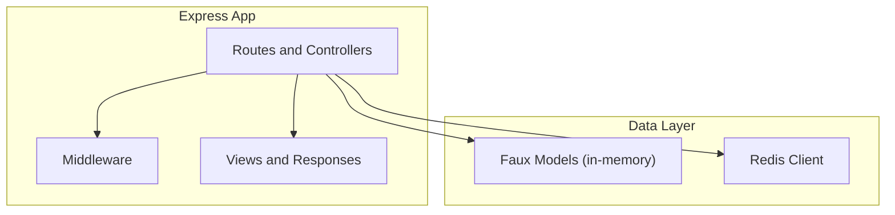
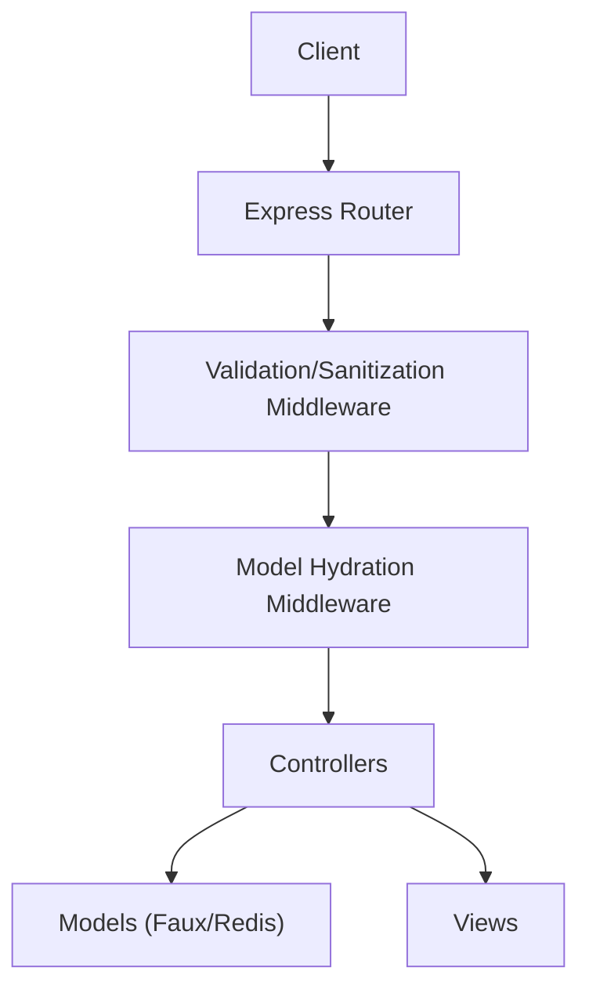
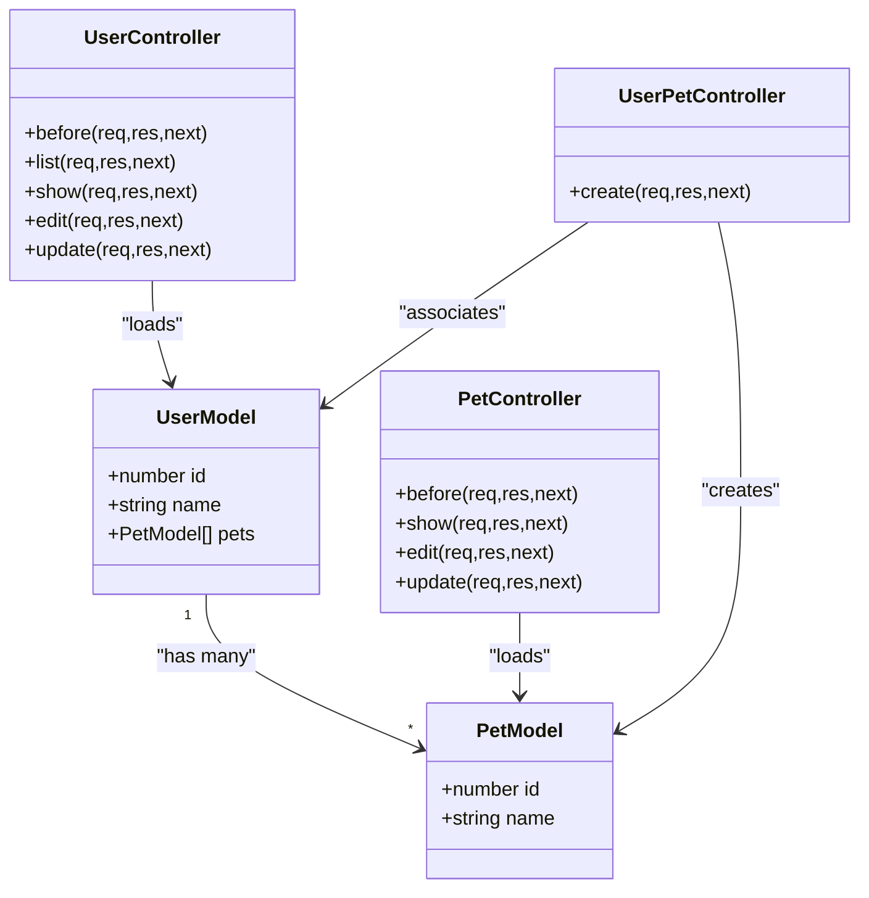
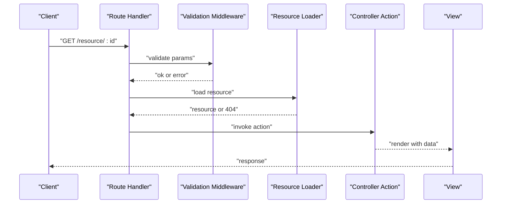
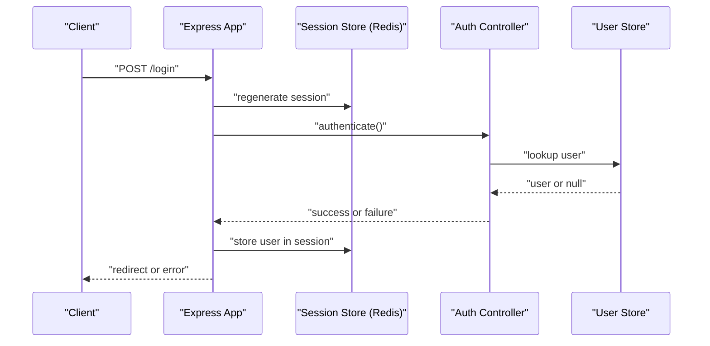
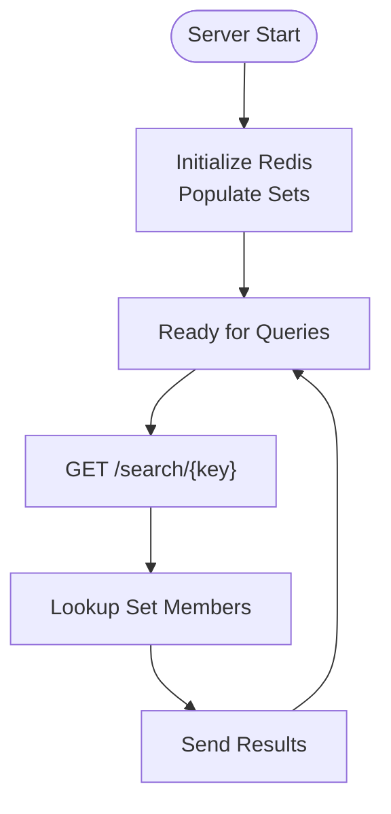
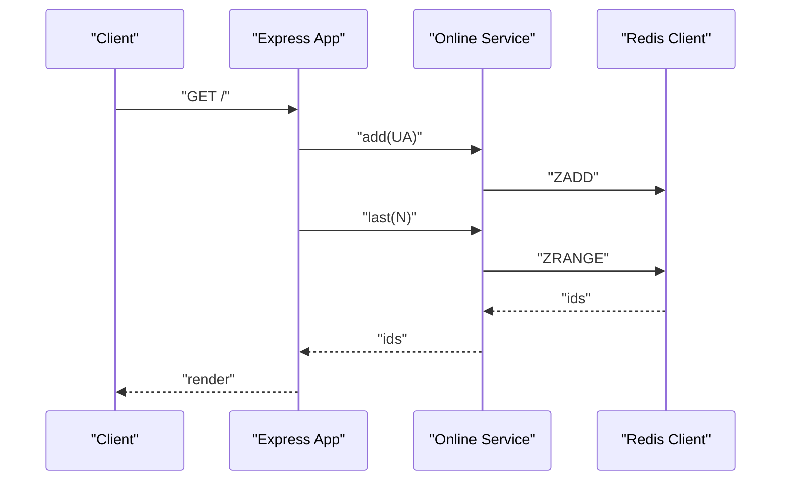
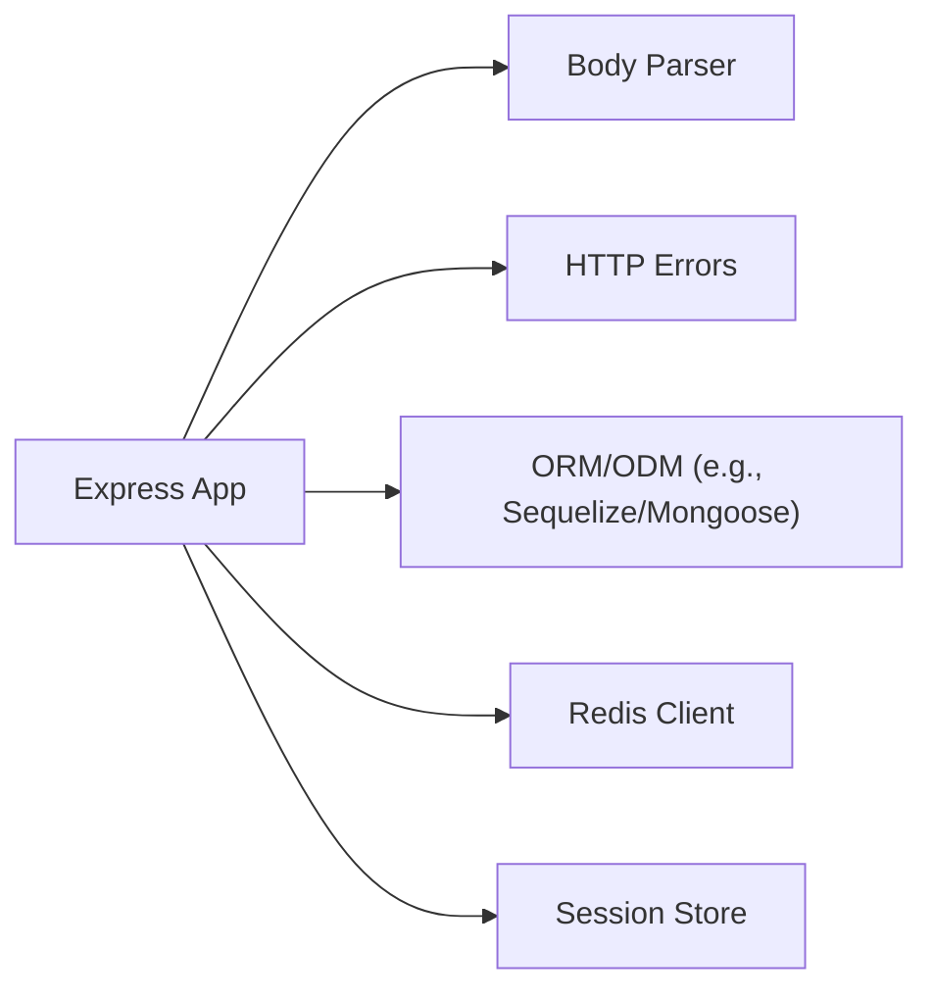

# ORM & ODM Integration

<cite>
**Referenced Files in This Document**
- [package.json](file://package.json)
- [examples/mvc/db.js](file://examples/mvc/db.js)
- [examples/mvc/controllers/user/index.js](file://examples/mvc/controllers/user/index.js)
- [examples/mvc/controllers/pet/index.js](file://examples/mvc/controllers/pet/index.js)
- [examples/mvc/controllers/user-pet/index.js](file://examples/mvc/controllers/user-pet/index.js)
- [examples/content-negotiation/db.js](file://examples/content-negotiation/db.js)
- [examples/content-negotiation/users.js](file://examples/content-negotiation/users.js)
- [examples/online/index.js](file://examples/online/index.js)
- [examples/search/index.js](file://examples/search/index.js)
- [examples/session/redis.js](file://examples/session/redis.js)
- [examples/auth/index.js](file://examples/auth/index.js)
- [examples/params/index.js](file://examples/params/index.js)
- [examples/route-separation/user.js](file://examples/route-separation/user.js)
- [examples/route-separation/post.js](file://examples/route-separation/post.js)
</cite>

## Table of Contents
1. [Introduction](#introduction)
2. [Project Structure](#project-structure)
3. [Core Components](#core-components)
4. [Architecture Overview](#architecture-overview)
5. [Detailed Component Analysis](#detailed-component-analysis)
6. [Dependency Analysis](#dependency-analysis)
7. [Performance Considerations](#performance-considerations)
8. [Troubleshooting Guide](#troubleshooting-guide)
9. [Conclusion](#conclusion)
10. [Appendices](#appendices)

## Introduction
This document explains how to integrate Object-Relational Mapping (ORM) and Object-Document Mapping (ODM) libraries with Express.js applications. It synthesizes patterns visible in the repository’s examples to demonstrate model definition, relationships, validation, sanitization, transformations, CRUD operations, transactions, batch operations, migrations, and performance optimization. While the repository primarily demonstrates in-memory “faux” databases and Redis usage, the same architectural patterns translate to production ORMs/ODMs such as Sequelize (SQL) and Mongoose (MongoDB).

## Project Structure
The repository organizes examples by functional concerns. For ORM/ODM integration, focus on:
- MVC-style examples that simulate models and controllers
- Content negotiation and route separation that illustrate request lifecycle and data shaping
- Redis-backed examples that demonstrate connection, async operations, and caching strategies

[No sources needed since this diagram shows conceptual workflow, not actual code structure]

**Section sources**
- [package.json:1-100](file://package.json#L1-L100)

## Core Components
- Faux models and controllers: The MVC examples define in-memory collections and controller actions that mirror CRUD and relationship handling.
- Content negotiation and route separation: These examples show how to load resources, validate parameters, and render views—patterns that map to model hydration and validation.
- Redis-backed apps: The online and search examples demonstrate async initialization, connection handling, and set-based queries—parallels to ODM/ORM operations.

Key takeaways for ORM/ODM integration:
- Define models as modules exporting constructors and static methods mirroring CRUD operations.
- Use middleware to hydrate request objects with hydrated models.
- Centralize validation and sanitization in middleware or model methods.
- Keep controllers thin; delegate persistence to models.

**Section sources**
- [examples/mvc/db.js:1-17](file://examples/mvc/db.js#L1-L17)
- [examples/mvc/controllers/user/index.js:1-42](file://examples/mvc/controllers/user/index.js#L1-L42)
- [examples/mvc/controllers/pet/index.js:1-32](file://examples/mvc/controllers/pet/index.js#L1-L32)
- [examples/mvc/controllers/user-pet/index.js:1-23](file://examples/mvc/controllers/user-pet/index.js#L1-L23)
- [examples/content-negotiation/db.js:1-10](file://examples/content-negotiation/db.js#L1-L10)
- [examples/content-negotiation/users.js:1-20](file://examples/content-negotiation/users.js#L1-L20)
- [examples/online/index.js:1-62](file://examples/online/index.js#L1-L62)
- [examples/search/index.js:1-84](file://examples/search/index.js#L1-L84)

## Architecture Overview
The repository’s examples illustrate a layered architecture:
- Routes and controllers orchestrate requests and responses.
- Middleware handles cross-cutting concerns like session, validation, and hydration.
- Data layer abstractions (faux models or Redis) encapsulate persistence.

[No sources needed since this diagram shows conceptual workflow, not actual code structure]

## Detailed Component Analysis

### MVC Models and Controllers
The MVC example simulates a small domain with users and pets, including relationships. This pattern mirrors how ORM/ODM models would be structured:
- Users have a collection of pets.
- Controllers load models via middleware and perform CRUD actions.
- Views render the hydrated models.

**Diagram sources**
- [examples/mvc/db.js:1-17](file://examples/mvc/db.js#L1-L17)
- [examples/mvc/controllers/user/index.js:1-42](file://examples/mvc/controllers/user/index.js#L1-L42)
- [examples/mvc/controllers/pet/index.js:1-32](file://examples/mvc/controllers/pet/index.js#L1-L32)
- [examples/mvc/controllers/user-pet/index.js:1-23](file://examples/mvc/controllers/user-pet/index.js#L1-L23)

Implementation highlights:
- Hydration middleware sets request-scoped models for downstream routes.
- Update handlers mutate in-memory entities and redirect with messages.
- Relationship creation updates both sides of the association.

**Section sources**
- [examples/mvc/db.js:1-17](file://examples/mvc/db.js#L1-L17)
- [examples/mvc/controllers/user/index.js:11-22](file://examples/mvc/controllers/user/index.js#L11-L22)
- [examples/mvc/controllers/pet/index.js:11-16](file://examples/mvc/controllers/pet/index.js#L11-L16)
- [examples/mvc/controllers/user-pet/index.js:12-22](file://examples/mvc/controllers/user-pet/index.js#L12-L22)

### Content Negotiation and Route Separation
These examples demonstrate:
- Parameter parsing and validation.
- Resource loading with error propagation.
- Rendering lists and individual records.

**Diagram sources**
- [examples/params/index.js:23-41](file://examples/params/index.js#L23-L41)
- [examples/route-separation/user.js:14-24](file://examples/route-separation/user.js#L14-L24)
- [examples/route-separation/user.js:40-47](file://examples/route-separation/user.js#L40-L47)

Practical implications for ORM/ODM:
- Use param() hooks to cast and validate IDs.
- Implement loaders that fetch entities via ORM/ODM and attach them to req.
- Centralize validation/sanitization in middleware to keep controllers pure.

**Section sources**
- [examples/params/index.js:23-41](file://examples/params/index.js#L23-L41)
- [examples/route-separation/user.js:14-24](file://examples/route-separation/user.js#L14-L24)
- [examples/route-separation/user.js:40-47](file://examples/route-separation/user.js#L40-L47)

### Authentication and Sessions with Redis
The auth example shows session-based authentication, while Redis-backed examples show async initialization and set operations. These patterns translate to:
- Storing sessions in Redis for scalability.
- Using async initialization to populate lookup sets or caches.

**Diagram sources**
- [examples/auth/index.js:104-128](file://examples/auth/index.js#L104-L128)
- [examples/session/redis.js:20-25](file://examples/session/redis.js#L20-L25)

**Section sources**
- [examples/auth/index.js:104-128](file://examples/auth/index.js#L104-L128)
- [examples/session/redis.js:20-25](file://examples/session/redis.js#L20-L25)

### Search with Redis (Set Operations)
The search example initializes Redis sets and serves queries using set membership operations. This mirrors how ODM/ORM might:
- Precompute indices or materialized sets.
- Use async initialization to seed caches.

**Diagram sources**
- [examples/search/index.js:29-46](file://examples/search/index.js#L29-L46)
- [examples/search/index.js:52-60](file://examples/search/index.js#L52-L60)

**Section sources**
- [examples/search/index.js:29-46](file://examples/search/index.js#L29-L46)
- [examples/search/index.js:52-60](file://examples/search/index.js#L52-L60)

### Online Tracking with Redis
The online example demonstrates:
- Async client initialization.
- Fire-and-forget updates to a sorted set.
- Retrieving recent entries.

**Diagram sources**
- [examples/online/index.js:30-34](file://examples/online/index.js#L30-L34)
- [examples/online/index.js:50-55](file://examples/online/index.js#L50-L55)

**Section sources**
- [examples/online/index.js:30-34](file://examples/online/index.js#L30-L34)
- [examples/online/index.js:50-55](file://examples/online/index.js#L50-L55)

## Dependency Analysis
The repository’s runtime dependencies include body parsing and HTTP utilities. For ORM/ODM integration, you would add:
- SQL: Sequelize or similar
- NoSQL: Mongoose or similar
- Caching: Redis client and session stores
- Validation: Joi, express-validator, or schema-based validators

**Diagram sources**
- [package.json:34-63](file://package.json#L34-L63)

**Section sources**
- [package.json:34-63](file://package.json#L34-L63)

## Performance Considerations
- Prefer async initialization for external clients (Redis) to avoid blocking startup.
- Use connection pooling and keep-alive for database clients.
- Index frequently queried fields in the database.
- Batch writes for bulk inserts/updates.
- Cache hot reads using Redis or in-memory stores.
- Limit payload sizes and enable compression for large responses.
- Use pagination for large result sets.

[No sources needed since this section provides general guidance]

## Troubleshooting Guide
Common issues and remedies:
- Parameter casting errors: Validate numeric parameters early and return explicit errors.
- Resource not found: Return 404 with a consistent error format.
- Session store connectivity: Initialize Redis before listening and handle connection errors gracefully.
- Authentication failures: Redirect to login with a flash message and avoid leaking sensitive details.

**Section sources**
- [examples/params/index.js:23-41](file://examples/params/index.js#L23-L41)
- [examples/route-separation/user.js:14-24](file://examples/route-separation/user.js#L14-L24)
- [examples/online/index.js:30-34](file://examples/online/index.js#L30-L34)
- [examples/auth/index.js:104-128](file://examples/auth/index.js#L104-L128)

## Conclusion
The repository’s examples illustrate clean separation of concerns suitable for ORM/ODM integration:
- Models encapsulate persistence and relationships.
- Middleware handles validation, sanitization, and hydration.
- Controllers remain thin and focused on orchestration.
- Redis-backed examples highlight async initialization, caching, and set-based operations—patterns that generalize to production ORMs/ODMs.

[No sources needed since this section summarizes without analyzing specific files]

## Appendices

### Practical Patterns for ORM/ODM Integration
- Model definition: Export constructors and static methods for CRUD and associations.
- Relationship mapping: Define belongsTo/hasMany equivalents via embedded documents or foreign keys.
- Query building: Use ORM/ODM query builders; paginate, filter, and sort in the data layer.
- Validation and sanitization: Apply schema validation in middleware or model methods.
- Transformations: Normalize entities before rendering; keep views simple.
- Transactions: Wrap write-heavy sequences in transactions; handle rollbacks on errors.
- Batch operations: Use bulk APIs for inserts/updates/deletes.
- Migrations: Use ORM/ODM migration tools to evolve schema safely.

[No sources needed since this section provides general guidance]