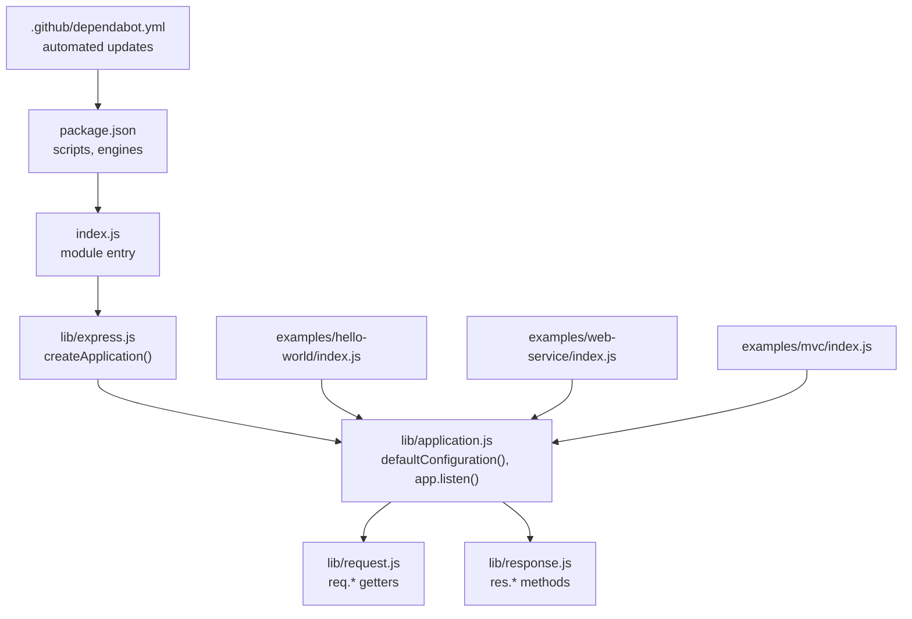
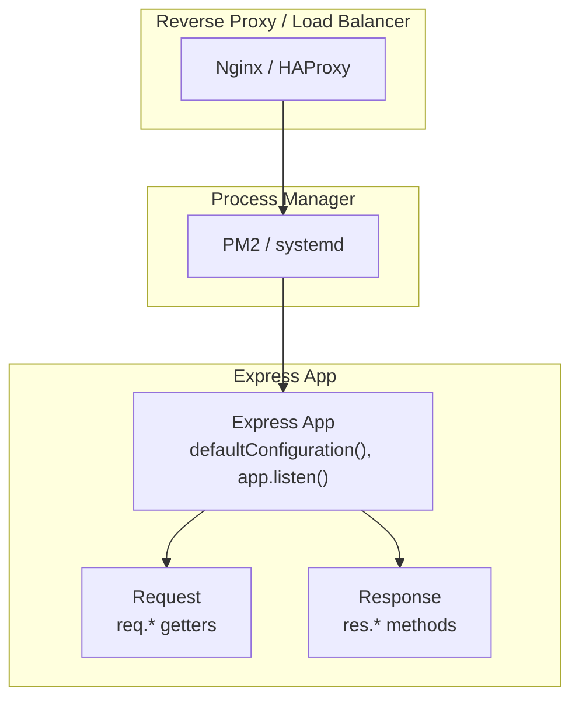
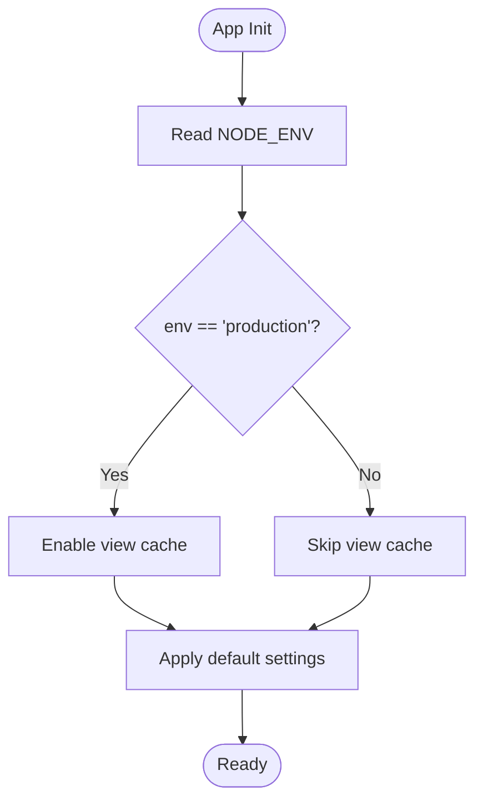
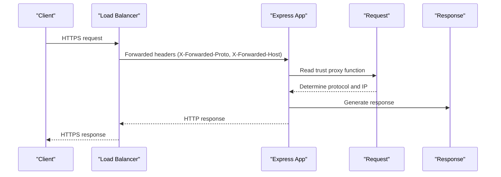
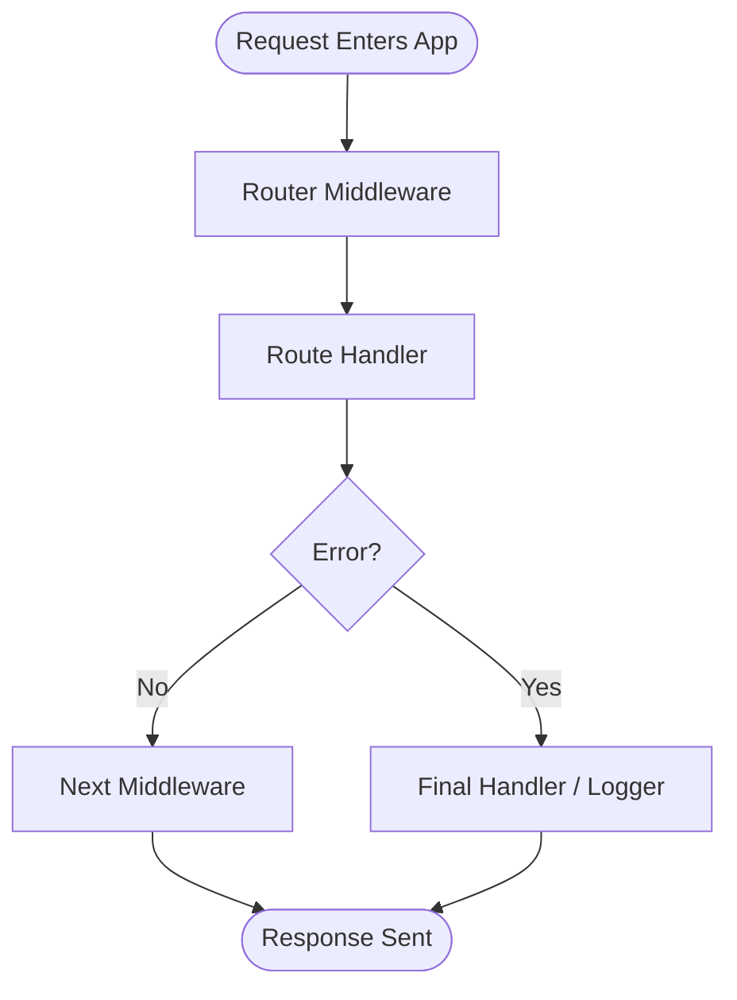
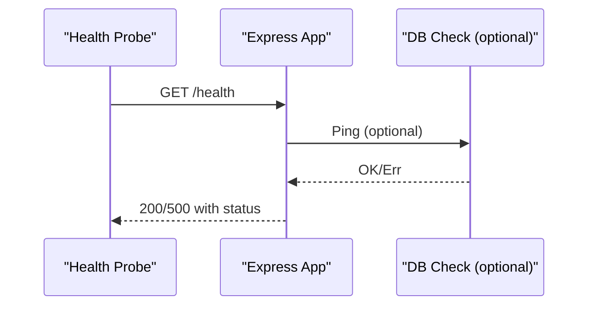
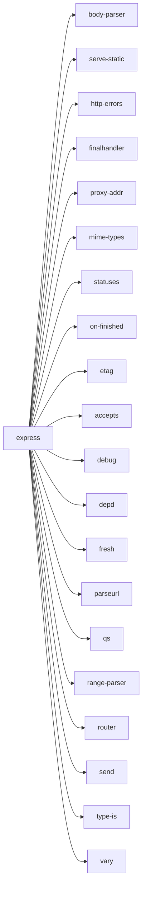

# Deployment & Production

<cite>
**Referenced Files in This Document**
- [package.json](file://package.json)
- [index.js](file://index.js)
- [lib/express.js](file://lib/express.js)
- [lib/application.js](file://lib/application.js)
- [lib/request.js](file://lib/request.js)
- [lib/response.js](file://lib/response.js)
- [examples/hello-world/index.js](file://examples/hello-world/index.js)
- [examples/web-service/index.js](file://examples/web-service/index.js)
- [examples/mvc/index.js](file://examples/mvc/index.js)
- [Readme.md](file://Readme.md)
- [.github/dependabot.yml](file://.github/dependabot.yml)
</cite>

## Table of Contents
1. [Introduction](#introduction)
2. [Project Structure](#project-structure)
3. [Core Components](#core-components)
4. [Architecture Overview](#architecture-overview)
5. [Detailed Component Analysis](#detailed-component-analysis)
6. [Dependency Analysis](#dependency-analysis)
7. [Performance Considerations](#performance-considerations)
8. [Troubleshooting Guide](#troubleshooting-guide)
9. [Conclusion](#conclusion)
10. [Appendices](#appendices)

## Introduction
This document provides a comprehensive guide to deploying Express.js applications in production environments. It focuses on production configuration, logging and monitoring, process management, containerization, reverse proxy and load balancing, SSL/TLS, CI/CD automation, rollbacks, health checks, performance monitoring, scaling, backups, and disaster recovery. The guidance leverages the Express.js runtime behavior and middleware ecosystem exposed by the repository’s core modules and example applications.

## Project Structure
The repository is organized around the Express.js core library, example applications, tests, and CI configuration. For production deployment, the most relevant artifacts are:
- Core library exposing application creation, middleware, request/response extensions, and default settings
- Example applications demonstrating typical Express patterns (hello world, web service, MVC)
- Package metadata defining Node.js engine requirements and scripts
- GitHub Dependabot configuration for automated dependency updates

**Diagram sources**
- [package.json:1-100](file://package.json#L1-L100)
- [index.js:1-12](file://index.js#L1-L12)
- [lib/express.js:1-82](file://lib/express.js#L1-L82)
- [lib/application.js:1-632](file://lib/application.js#L1-L632)
- [lib/request.js:1-528](file://lib/request.js#L1-L528)
- [lib/response.js:1-800](file://lib/response.js#L1-L800)
- [examples/hello-world/index.js:1-16](file://examples/hello-world/index.js#L1-L16)
- [examples/web-service/index.js:1-118](file://examples/web-service/index.js#L1-L118)
- [examples/mvc/index.js:1-96](file://examples/mvc/index.js#L1-L96)
- [.github/dependabot.yml:1-17](file://.github/dependabot.yml#L1-L17)

**Section sources**
- [package.json:1-100](file://package.json#L1-L100)
- [index.js:1-12](file://index.js#L1-L12)
- [lib/express.js:1-82](file://lib/express.js#L1-L82)
- [lib/application.js:1-632](file://lib/application.js#L1-L632)
- [lib/request.js:1-528](file://lib/request.js#L1-L528)
- [lib/response.js:1-800](file://lib/response.js#L1-L800)
- [examples/hello-world/index.js:1-16](file://examples/hello-world/index.js#L1-L16)
- [examples/web-service/index.js:1-118](file://examples/web-service/index.js#L1-L118)
- [examples/mvc/index.js:1-96](file://examples/mvc/index.js#L1-L96)
- [.github/dependabot.yml:1-17](file://.github/dependabot.yml#L1-L17)

## Core Components
Production-ready Express deployments rely on:
- Application initialization and default settings
- Request/response extensions for trust/proxy, protocol detection, and IP resolution
- Middleware composition for logging, sessions, and error handling
- Health and readiness patterns suitable for orchestration

Key runtime behaviors relevant to production:
- Default environment and settings initialization
- Error handling pipeline and final handler
- Trust proxy and protocol detection for reverse proxy scenarios
- Static asset serving and content negotiation helpers

Practical implications:
- Configure environment-specific settings (e.g., enabling view cache in production)
- Use trust proxy settings when behind a load balancer or CDN
- Implement structured logging and error reporting
- Add health/readiness endpoints for monitoring and blue-green deployments

**Section sources**
- [lib/application.js:90-141](file://lib/application.js#L90-L141)
- [lib/application.js:152-178](file://lib/application.js#L152-L178)
- [lib/request.js:297-315](file://lib/request.js#L297-L315)
- [lib/request.js:340-343](file://lib/request.js#L340-L343)
- [lib/response.js:64-76](file://lib/response.js#L64-L76)
- [examples/mvc/index.js:7-11](file://examples/mvc/index.js#L7-L11)
- [examples/mvc/index.js:34](file://examples/mvc/index.js#L34)

## Architecture Overview
The following diagram shows how an Express application initializes, applies middleware, and handles requests in a production environment with reverse proxy and process manager layers.

**Diagram sources**
- [lib/application.js:90-141](file://lib/application.js#L90-L141)
- [lib/application.js:598-606](file://lib/application.js#L598-L606)
- [lib/request.js:297-315](file://lib/request.js#L297-L315)
- [lib/response.js:64-76](file://lib/response.js#L64-L76)

## Detailed Component Analysis

### Environment and Settings Initialization
Express initializes default settings based on NODE_ENV, enabling production-friendly defaults such as view caching. This impacts memory usage and rendering performance in production.

**Diagram sources**
- [lib/application.js:90-141](file://lib/application.js#L90-L141)

**Section sources**
- [lib/application.js:90-141](file://lib/application.js#L90-L141)

### Reverse Proxy and Protocol Detection
When behind a reverse proxy, Express can detect the original protocol and client IP using trust proxy configuration. This ensures accurate logging, redirects, and security decisions.

**Diagram sources**
- [lib/request.js:297-315](file://lib/request.js#L297-L315)
- [lib/request.js:340-343](file://lib/request.js#L340-L343)

**Section sources**
- [lib/request.js:297-315](file://lib/request.js#L297-L315)
- [lib/request.js:340-343](file://lib/request.js#L340-L343)

### Logging and Error Handling Pipeline
Express integrates with a final handler for uncaught errors and supports structured logging. In production, pair this with a logging agent and error tracking service.

**Diagram sources**
- [lib/application.js:152-178](file://lib/application.js#L152-L178)

**Section sources**
- [lib/application.js:152-178](file://lib/application.js#L152-L178)

### Health and Readiness Endpoints
Add lightweight endpoints to report application health and readiness for load balancers and orchestrators. These endpoints should avoid heavy operations and database checks during readiness.

[No sources needed since this diagram shows conceptual workflow, not actual code structure]

### Example Applications for Production Patterns
- Hello World: Minimal server startup pattern suitable for testing and basic deployments
- Web Service: Demonstrates API key validation and centralized error handling
- MVC: Shows logging, sessions, static assets, and error/404 handling middleware

**Section sources**
- [examples/hello-world/index.js:1-16](file://examples/hello-world/index.js#L1-L16)
- [examples/web-service/index.js:30-42](file://examples/web-service/index.js#L30-L42)
- [examples/web-service/index.js:98-111](file://examples/web-service/index.js#L98-L111)
- [examples/mvc/index.js:34](file://examples/mvc/index.js#L34)
- [examples/mvc/index.js:78-89](file://examples/mvc/index.js#L78-L89)

## Dependency Analysis
Express depends on a curated set of modules for HTTP handling, content negotiation, static serving, and error management. For production, pin versions and monitor for security updates.

**Diagram sources**
- [package.json:34-62](file://package.json#L34-L62)

**Section sources**
- [package.json:34-62](file://package.json#L34-L62)

## Performance Considerations
- Enable view cache in production to reduce rendering overhead
- Use trust proxy to avoid redundant header parsing
- Prefer static file serving via serve-static for assets
- Tune middleware ordering to minimize overhead
- Monitor memory and CPU under realistic loads; scale horizontally as needed

[No sources needed since this section provides general guidance]

## Troubleshooting Guide
- Verify NODE_ENV is set appropriately to activate production defaults
- Confirm trust proxy settings when behind a load balancer or CDN
- Ensure error handling middleware is registered to prevent unhandled exceptions
- Use health endpoints to validate readiness before traffic switching

**Section sources**
- [lib/application.js:90-141](file://lib/application.js#L90-L141)
- [lib/request.js:297-315](file://lib/request.js#L297-L315)
- [lib/application.js:152-178](file://lib/application.js#L152-L178)

## Conclusion
Deploying Express applications in production hinges on correct environment configuration, reverse proxy awareness, robust logging and error handling, and operational tooling. The repository’s core modules and examples illustrate the foundational behaviors needed to build reliable, scalable, and observable services.

[No sources needed since this section summarizes without analyzing specific files]

## Appendices

### A. Production Configuration Checklist
- Set NODE_ENV to production
- Configure trust proxy and subdomain offset
- Enable view cache in production
- Add structured logging and error reporting
- Implement health and readiness endpoints
- Secure secrets via environment variables
- Use a process manager and reverse proxy

[No sources needed since this section provides general guidance]

### B. CI/CD and Automation Notes
- Dependabot automates npm and GitHub Actions updates
- Use npm test scripts for verification in CI
- Integrate linting and coverage reports in CI pipelines

**Section sources**
- [.github/dependabot.yml:1-17](file://.github/dependabot.yml#L1-L17)
- [package.json:91-98](file://package.json#L91-L98)