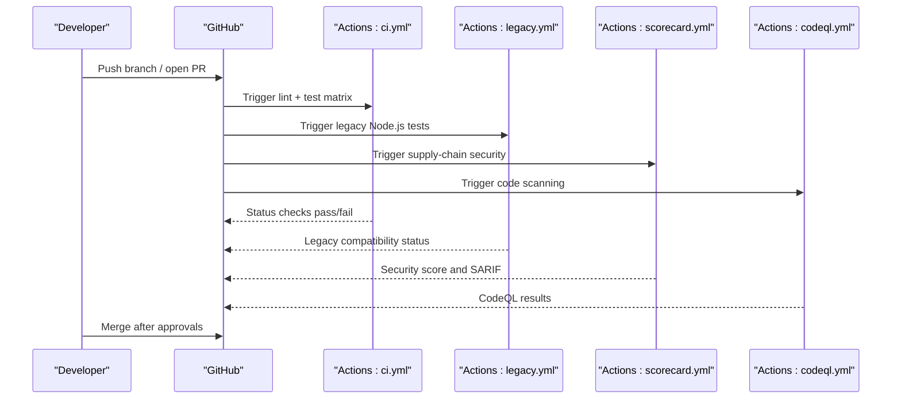
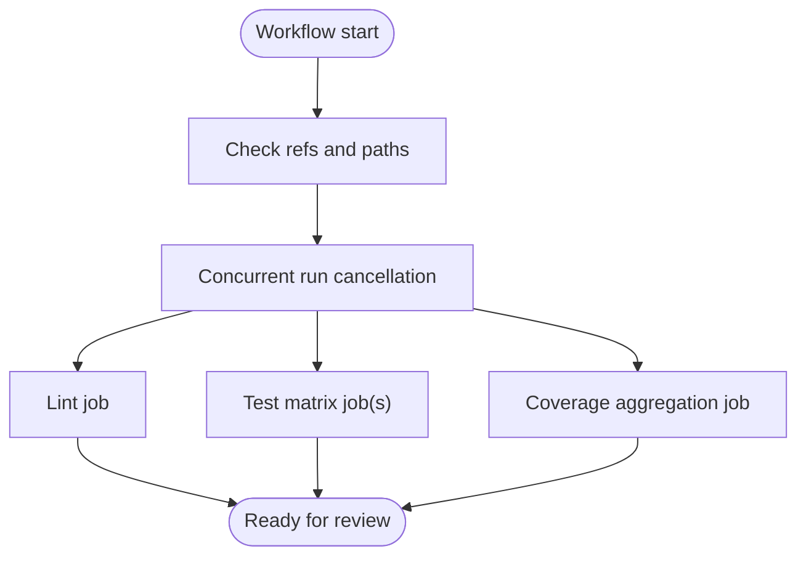
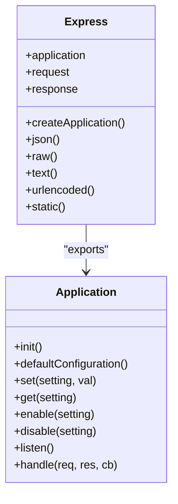
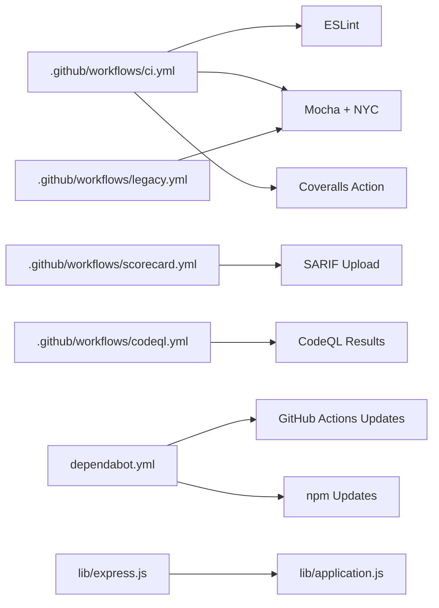

# Deployment Automation

<cite>
**Referenced Files in This Document**
- [ci.yml](file://.github/workflows/ci.yml)
- [legacy.yml](file://.github/workflows/legacy.yml)
- [scorecard.yml](file://.github/workflows/scorecard.yml)
- [codeql.yml](file://.github/workflows/codeql.yml)
- [dependabot.yml](file://.github/dependabot.yml)
- [package.json](file://package.json)
- [Readme.md](file://Readme.md)
- [env.js](file://test/support/env.js)
- [config.js](file://test/config.js)
- [express.js](file://lib/express.js)
- [application.js](file://lib/application.js)
- [index.js](file://index.js)
- [hello-world example](file://examples/hello-world/index.js)
- [mvc example](file://examples/mvc/index.js)
</cite>

## Table of Contents
1. [Introduction](#introduction)
2. [Project Structure](#project-structure)
3. [Core Components](#core-components)
4. [Architecture Overview](#architecture-overview)
5. [Detailed Component Analysis](#detailed-component-analysis)
6. [Dependency Analysis](#dependency-analysis)
7. [Performance Considerations](#performance-considerations)
8. [Troubleshooting Guide](#troubleshooting-guide)
9. [Conclusion](#conclusion)
10. [Appendices](#appendices)

## Introduction
This document explains how to automate deployment and CI/CD for Express.js applications using the repository’s existing GitHub Actions workflows, Dependabot configuration, and testing scripts. It also provides practical guidance for extending the automation to deploy to Heroku, AWS, Azure, and Vercel, along with rollback, blue-green, and canary strategies. Security considerations, secrets management, and infrastructure-as-code practices are covered to help teams operate reliable, repeatable deployments.

## Project Structure
The repository organizes CI/CD under .github/workflows, with Dependabot configuration at .github/dependabot.yml. Testing and linting are defined in package.json scripts, and the Express runtime is implemented in lib/*.js with example applications under examples/.

```mermaid
graph TB
A[".github/workflows/ci.yml"] --> B["Lint job"]
A --> C["Test matrix jobs"]
A --> D["Coverage aggregation"]
E[".github/workflows/legacy.yml"] --> F["Legacy Node.js test jobs"]
G[".github/workflows/scorecard.yml"] --> H["Supply-chain security analysis"]
I[".github/workflows/codeql.yml"] --> J["Code scanning"]
K[".github/dependabot.yml"] --> L["Automated dependency updates"]
M["package.json scripts"] --> N["npm test / test-ci / lint"]
O["lib/express.js"] --> P["createApplication()"]
Q["lib/application.js"] --> R["defaultConfiguration(), app.handle()"]
S["examples/hello-world/index.js"] --> T["Minimal Express app"]
U["examples/mvc/index.js"] --> V["Express app with middleware"]
```

**Diagram sources**
- [ci.yml:1-117](file://.github/workflows/ci.yml#L1-L117)
- [legacy.yml:1-101](file://.github/workflows/legacy.yml#L1-L101)
- [scorecard.yml:1-72](file://.github/workflows/scorecard.yml#L1-L72)
- [codeql.yml:1-74](file://.github/workflows/codeql.yml#L1-L74)
- [dependabot.yml:1-17](file://.github/dependabot.yml#L1-L17)
- [package.json:91-98](file://package.json#L91-L98)
- [express.js:36-56](file://lib/express.js#L36-L56)
- [application.js:59-141](file://lib/application.js#L59-L141)
- [hello-world example:1-16](file://examples/hello-world/index.js#L1-L16)
- [mvc example:1-96](file://examples/mvc/index.js#L1-L96)

**Section sources**
- [ci.yml:1-117](file://.github/workflows/ci.yml#L1-L117)
- [legacy.yml:1-101](file://.github/workflows/legacy.yml#L1-L101)
- [scorecard.yml:1-72](file://.github/workflows/scorecard.yml#L1-L72)
- [codeql.yml:1-74](file://.github/workflows/codeql.yml#L1-L74)
- [dependabot.yml:1-17](file://.github/dependabot.yml#L1-L17)
- [package.json:91-98](file://package.json#L91-L98)
- [express.js:36-56](file://lib/express.js#L36-L56)
- [application.js:59-141](file://lib/application.js#L59-L141)
- [hello-world example:1-16](file://examples/hello-world/index.js#L1-L16)
- [mvc example:1-96](file://examples/mvc/index.js#L1-L96)

## Core Components
- CI workflows:
  - ci.yml: Lint, matrix-based Node.js tests, and coverage aggregation.
  - legacy.yml: Tests against older Node.js versions.
  - scorecard.yml: Supply-chain security scoring.
  - codeql.yml: Static analysis for vulnerabilities.
- Dependabot: Automated updates for GitHub Actions and npm dependencies.
- Testing and linting: Scripts in package.json for linting, unit/integration tests, and coverage collection.
- Express runtime: Application creation, default configuration, and request/response handling.

**Section sources**
- [ci.yml:25-117](file://.github/workflows/ci.yml#L25-L117)
- [legacy.yml:27-101](file://.github/workflows/legacy.yml#L27-L101)
- [scorecard.yml:20-72](file://.github/workflows/scorecard.yml#L20-L72)
- [codeql.yml:27-74](file://.github/workflows/codeql.yml#L27-L74)
- [dependabot.yml:1-17](file://.github/dependabot.yml#L1-L17)
- [package.json:91-98](file://package.json#L91-L98)
- [express.js:36-56](file://lib/express.js#L36-L56)
- [application.js:59-141](file://lib/application.js#L59-L141)

## Architecture Overview
The deployment automation centers on GitHub Actions workflows that enforce quality gates (lint, tests, coverage, security scans) before merging or releasing. Dependabot keeps dependencies current. The Express runtime provides a stable foundation for applications deployed across platforms.

**Diagram sources**
- [ci.yml:3-14](file://.github/workflows/ci.yml#L3-L14)
- [legacy.yml:3-16](file://.github/workflows/legacy.yml#L3-L16)
- [scorecard.yml:6-16](file://.github/workflows/scorecard.yml#L6-L16)
- [codeql.yml:14-22](file://.github/workflows/codeql.yml#L14-L22)

## Detailed Component Analysis

### CI Workflow: ci.yml
- Triggers on pushes to selected branches and PRs; concurrency cancels in-progress runs.
- Jobs:
  - Lint: Installs dev dependencies and runs lint.
  - Test: Matrix across operating systems and Node.js versions; installs dependencies, runs coverage-enabled tests, and uploads coverage artifacts.
  - Coverage: Aggregates lcov reports and uploads to Coveralls.

**Diagram sources**
- [ci.yml:1-117](file://.github/workflows/ci.yml#L1-L117)

**Section sources**
- [ci.yml:3-24](file://.github/workflows/ci.yml#L3-L24)
- [ci.yml:25-43](file://.github/workflows/ci.yml#L25-L43)
- [ci.yml:44-88](file://.github/workflows/ci.yml#L44-L88)
- [ci.yml:89-117](file://.github/workflows/ci.yml#L89-L117)

### Legacy Compatibility Workflow: legacy.yml
- Runs tests against older Node.js versions to ensure backward compatibility.
- Mirrors the modern test job with a smaller matrix.

**Section sources**
- [legacy.yml:27-101](file://.github/workflows/legacy.yml#L27-L101)

### Supply-Chain Security: scorecard.yml
- Periodically analyzes repository security posture and publishes results.
- Uploads SARIF results for GitHub code scanning.

**Section sources**
- [scorecard.yml:20-72](file://.github/workflows/scorecard.yml#L20-L72)

### Static Analysis: codeql.yml
- Scheduled and on-demand runs for JavaScript and GitHub Actions.
- Scans for security vulnerabilities with configurable exclusions.

**Section sources**
- [codeql.yml:27-74](file://.github/workflows/codeql.yml#L27-L74)

### Dependabot Integration: dependabot.yml
- Automates updates for GitHub Actions and npm dependencies.
- Schedules monthly updates with timezone and PR limits.

**Section sources**
- [dependabot.yml:1-17](file://.github/dependabot.yml#L1-L17)

### Testing and Coverage Scripts
- Scripts in package.json:
  - lint: Runs ESLint across the project.
  - test: Runs Mocha tests with environment setup.
  - test-ci: Runs Mocha with NYC coverage, excluding examples and test directories.
  - test-cov: Generates HTML coverage report.
  - test-tap: Runs Mocha with TAP reporter.

**Section sources**
- [package.json:91-98](file://package.json#L91-L98)
- [env.js:1-4](file://test/support/env.js#L1-L4)
- [config.js:1-208](file://test/config.js#L1-L208)

### Express Runtime and Application Lifecycle
- createApplication(): Initializes app with request/response prototypes and default middleware.
- defaultConfiguration(): Sets environment, etag, query parser, trust proxy, and view-related settings.
- app.handle(): Starts the request pipeline and delegates to the router.

**Diagram sources**
- [express.js:36-82](file://lib/express.js#L36-L82)
- [application.js:59-141](file://lib/application.js#L59-L141)

**Section sources**
- [express.js:36-82](file://lib/express.js#L36-L82)
- [application.js:59-141](file://lib/application.js#L59-L141)

### Example Applications
- Minimal app: Demonstrates creating an Express app and listening on a port.
- MVC-style app: Shows middleware, sessions, static assets, and error handling.

**Section sources**
- [hello-world example:1-16](file://examples/hello-world/index.js#L1-L16)
- [mvc example:1-96](file://examples/mvc/index.js#L1-L96)

## Dependency Analysis
- CI depends on Actions checkout, setup-node, upload/download artifacts, and Coveralls action.
- Security workflows depend on external actions for Scorecard and CodeQL.
- Dependabot monitors GitHub Actions and npm ecosystems.
- Express runtime depends on core Node.js modules and middleware libraries declared in package.json.

**Diagram sources**
- [ci.yml:26-117](file://.github/workflows/ci.yml#L26-L117)
- [legacy.yml:28-101](file://.github/workflows/legacy.yml#L28-L101)
- [scorecard.yml:33-72](file://.github/workflows/scorecard.yml#L33-L72)
- [codeql.yml:40-74](file://.github/workflows/codeql.yml#L40-L74)
- [dependabot.yml:1-17](file://.github/dependabot.yml#L1-L17)
- [express.js:15-21](file://lib/express.js#L15-L21)
- [application.js:16-26](file://lib/application.js#L16-L26)

**Section sources**
- [ci.yml:26-117](file://.github/workflows/ci.yml#L26-L117)
- [legacy.yml:28-101](file://.github/workflows/legacy.yml#L28-L101)
- [scorecard.yml:33-72](file://.github/workflows/scorecard.yml#L33-L72)
- [codeql.yml:40-74](file://.github/workflows/codeql.yml#L40-L74)
- [dependabot.yml:1-17](file://.github/dependabot.yml#L1-L17)
- [express.js:15-21](file://lib/express.js#L15-L21)
- [application.js:16-26](file://lib/application.js#L16-L26)

## Performance Considerations
- Matrix testing across Node.js versions ensures compatibility but increases runtime. Consolidate where appropriate or gate by branch.
- Coverage aggregation merges lcov files; keep artifact retention minimal to reduce storage overhead.
- Use caching for npm dependencies in Actions to speed up installs.
- Prefer parallelization within jobs where safe; avoid heavy concurrent I/O in test suites.

## Troubleshooting Guide
- Lint failures: Review ESLint configuration and fix style issues.
- Test failures: Inspect test output and environment variables set for test runs.
- Coverage missing: Ensure NYC is configured to exclude expected directories and that lcov artifacts are uploaded.
- Security alerts: Review Scorecard and CodeQL SARIF results; remediate high severity issues first.
- Dependabot noise: Tune intervals and PR limits in dependabot.yml to balance freshness and maintainability.

**Section sources**
- [ci.yml:44-88](file://.github/workflows/ci.yml#L44-L88)
- [ci.yml:89-117](file://.github/workflows/ci.yml#L89-L117)
- [scorecard.yml:68-72](file://.github/workflows/scorecard.yml#L68-L72)
- [codeql.yml:73-74](file://.github/workflows/codeql.yml#L73-L74)
- [dependabot.yml:10-17](file://.github/dependabot.yml#L10-L17)
- [env.js:1-4](file://test/support/env.js#L1-L4)

## Conclusion
The repository provides a solid foundation for Express.js deployment automation through CI/CD workflows, security scanning, and Dependabot updates. Teams can extend these workflows to deploy to Heroku, AWS, Azure, and Vercel by adding platform-specific jobs that build, test, and deploy artifacts. Implementing rollback, blue-green, and canary strategies requires platform capabilities and careful traffic shifting, complemented by health checks and observability. Security and secrets management should be integrated early, and infrastructure-as-code practices should govern deployment environments consistently.

## Appendices

### Practical Deployment Strategies and Patterns
- Rollback:
  - Maintain immutable artifacts and tag releases. Re-deploy previous version tag on failure.
  - Use platform blue-green swaps to roll back instantly by switching traffic.
- Blue-Green:
  - Keep two identical environments. Deploy to inactive environment, validate, switch traffic, retain old environment for quick rollback.
- Canary:
  - Gradually shift a percentage of traffic to the new version. Monitor metrics and errors; abort or promote based on thresholds.

### Automated Deployment to Platforms (Conceptual)
- Heroku:
  - Use a buildpack-based pipeline; add a release phase to run migrations and pre-deploy checks.
- AWS:
  - Use CodeDeploy with Application Load Balancer; implement health checks and target groups.
- Azure:
  - Use App Service deployments with staging slots and auto-swap on success.
- Vercel:
  - Use Vercel for serverless functions; configure preview deployments and production builds with environment variables.

### Environment-Specific Configurations
- Separate CI, staging, and production environments with distinct configuration files and secrets.
- Use environment variables for database URLs, API keys, and feature flags.

### Automated Testing Integration
- Keep tests fast and deterministic; run lint and unit tests in parallel where possible.
- Use coverage thresholds to gate merges.

### Security Considerations and Secrets Management
- Store secrets in platform-agnostic secret managers; inject via environment variables.
- Scan dependencies and lockfiles regularly; enable Dependabot for security patches.
- Enforce least privilege for deployment credentials and limit access to production environments.