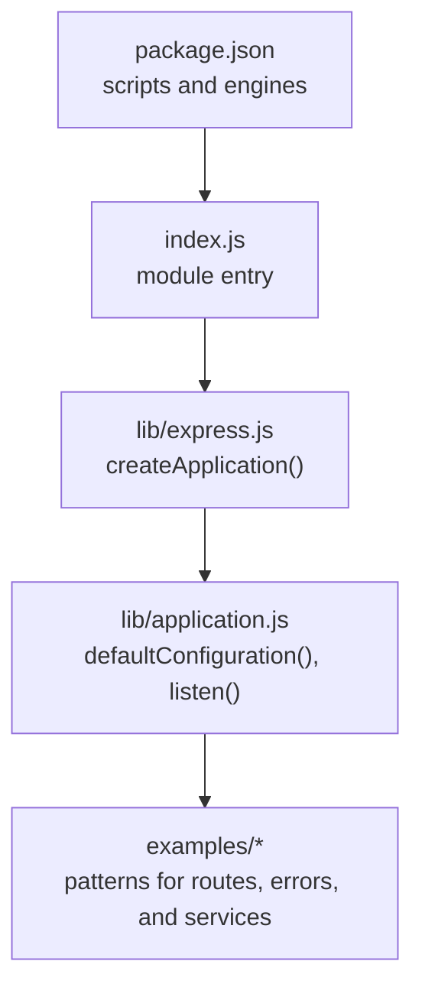
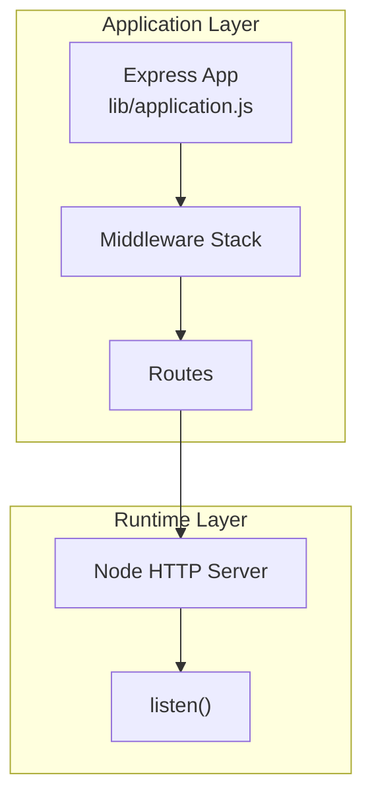
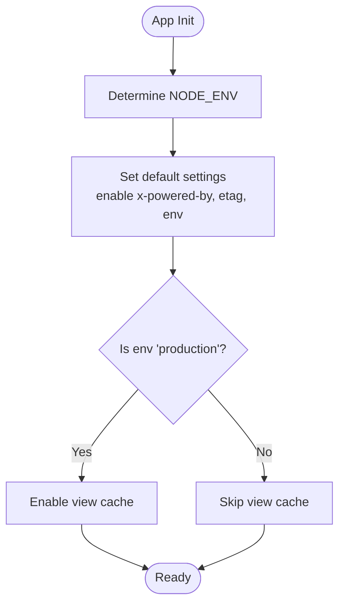
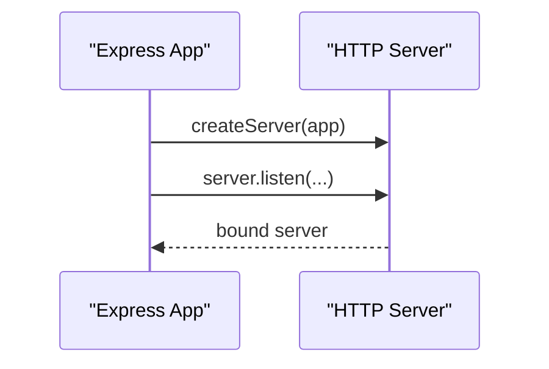
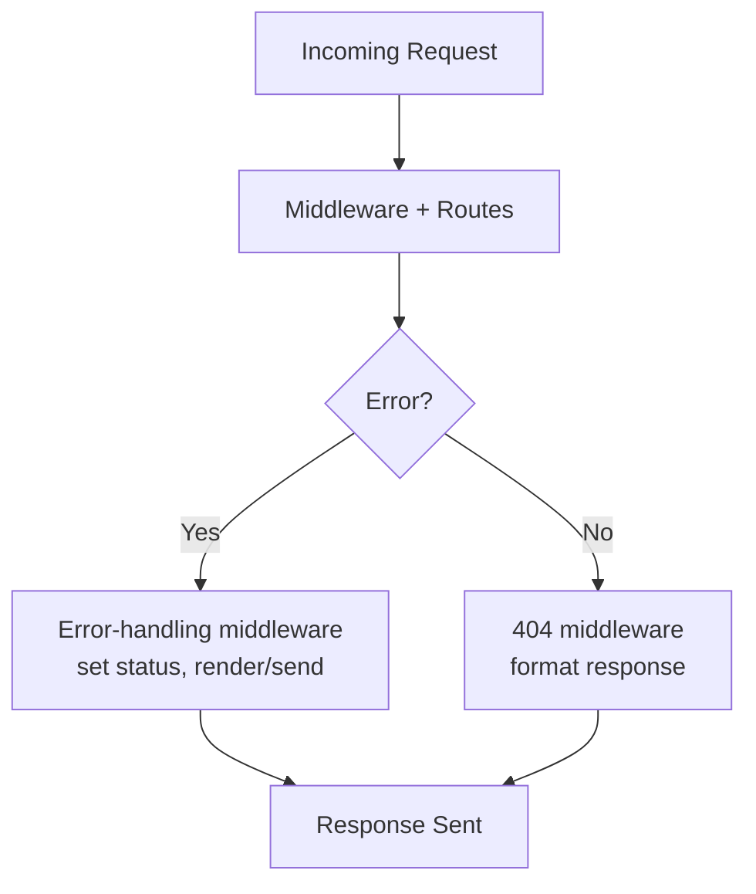
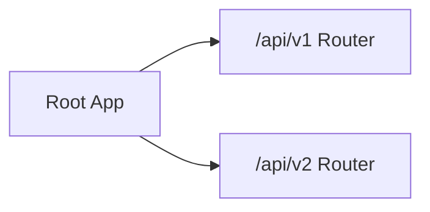
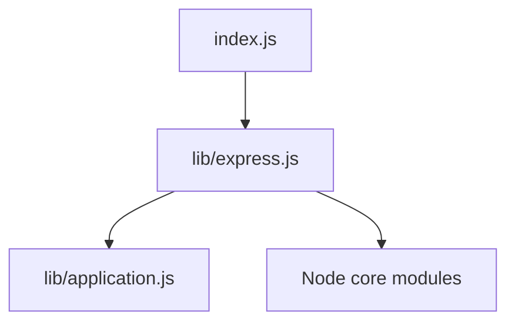

# Process Management

<cite>
**Referenced Files in This Document**
- [package.json](file://package.json)
- [index.js](file://index.js)
- [lib/express.js](file://lib/express.js)
- [lib/application.js](file://lib/application.js)
- [examples/web-service/index.js](file://examples/web-service/index.js)
- [examples/error-pages/index.js](file://examples/error-pages/index.js)
- [examples/multi-router/index.js](file://examples/multi-router/index.js)
- [.github/workflows/ci.yml](file://.github/workflows/ci.yml)
- [.github/workflows/legacy.yml](file://.github/workflows/legacy.yml)
- [.github/dependabot.yml](file://.github/dependabot.yml)
- [.npmrc](file://.npmrc)
</cite>

## Table of Contents
1. [Introduction](#introduction)
2. [Project Structure](#project-structure)
3. [Core Components](#core-components)
4. [Architecture Overview](#architecture-overview)
5. [Detailed Component Analysis](#detailed-component-analysis)
6. [Dependency Analysis](#dependency-analysis)
7. [Performance Considerations](#performance-considerations)
8. [Troubleshooting Guide](#troubleshooting-guide)
9. [Conclusion](#conclusion)
10. [Appendices](#appendices)

## Introduction
This document provides a comprehensive guide to managing Express.js applications in production-grade environments. It focuses on process lifecycle management, monitoring, and operational reliability. While the repository primarily exposes the Express framework and example applications, the guidance herein leverages the framework’s built-in capabilities and common production patterns to achieve robust process management, health monitoring, graceful shutdown, and scalable deployment strategies.

## Project Structure
The repository is organized around the Express framework entry point and a rich set of examples demonstrating routing, middleware, error handling, and service patterns. For production process management, the focus is on:
- How applications are initialized and configured via the framework
- How errors and middleware are structured to support observability and resilience
- How example applications demonstrate listening, routing, and error handling patterns that map to production concerns

**Diagram sources**
- [package.json:1-100](file://package.json#L1-L100)
- [index.js:1-12](file://index.js#L1-L12)
- [lib/express.js:1-82](file://lib/express.js#L1-L82)
- [lib/application.js:1-632](file://lib/application.js#L1-L632)

**Section sources**
- [package.json:1-100](file://package.json#L1-L100)
- [index.js:1-12](file://index.js#L1-L12)
- [lib/express.js:1-82](file://lib/express.js#L1-L82)
- [lib/application.js:1-632](file://lib/application.js#L1-L632)

## Core Components
- Application initialization and defaults: The framework initializes settings, middleware, and router behavior, including environment-aware defaults and production caching toggles.
- HTTP server creation and listening: The application exposes a listen method backed by Node’s HTTP server, suitable for production deployments.
- Error handling patterns: Examples illustrate centralized error-handling middleware and 404 handling, essential for resilient services.

Key implementation references:
- Environment-aware defaults and production cache toggle
- HTTP server creation and listen behavior
- Error-handling middleware patterns

**Section sources**
- [lib/application.js:90-141](file://lib/application.js#L90-L141)
- [lib/application.js:598-606](file://lib/application.js#L598-L606)
- [examples/error-pages/index.js:54-103](file://examples/error-pages/index.js#L54-L103)
- [examples/web-service/index.js:96-117](file://examples/web-service/index.js#L96-L117)

## Architecture Overview
The runtime architecture centers on Express application creation, middleware pipelines, and HTTP server hosting. Production-grade process management integrates with external supervisors and orchestrators, while the application remains responsible for clean lifecycle hooks and error handling.

**Diagram sources**
- [lib/application.js:152-178](file://lib/application.js#L152-L178)
- [lib/application.js:598-606](file://lib/application.js#L598-L606)

**Section sources**
- [lib/application.js:152-178](file://lib/application.js#L152-L178)
- [lib/application.js:598-606](file://lib/application.js#L598-L606)

## Detailed Component Analysis

### Application Lifecycle and Environment Defaults
- The application sets environment-specific defaults, enabling production-oriented caching and behavior.
- Settings like etag, query parser, and trust proxy are configured during initialization.

**Diagram sources**
- [lib/application.js:90-141](file://lib/application.js#L90-L141)

**Section sources**
- [lib/application.js:90-141](file://lib/application.js#L90-L141)

### HTTP Server Creation and Listening
- The application creates an HTTP server and delegates listening to Node’s server.listen, supporting callbacks and unified error handling.

**Diagram sources**
- [lib/application.js:598-606](file://lib/application.js#L598-L606)

**Section sources**
- [lib/application.js:598-606](file://lib/application.js#L598-L606)

### Error Handling and 404 Patterns
- Centralized error-handling middleware and explicit 404 handling improve observability and user experience.

**Diagram sources**
- [examples/error-pages/index.js:54-103](file://examples/error-pages/index.js#L54-L103)
- [examples/web-service/index.js:96-117](file://examples/web-service/index.js#L96-L117)

**Section sources**
- [examples/error-pages/index.js:54-103](file://examples/error-pages/index.js#L54-L103)
- [examples/web-service/index.js:96-117](file://examples/web-service/index.js#L96-L117)

### Routing and Modularization
- Multi-router examples demonstrate modular route separation, useful for organizing large services and simplifying maintenance.

**Diagram sources**
- [examples/multi-router/index.js:1-18](file://examples/multi-router/index.js#L1-L18)

**Section sources**
- [examples/multi-router/index.js:1-18](file://examples/multi-router/index.js#L1-L18)

## Dependency Analysis
- The Express entry point re-exports the framework from lib/express.
- The framework depends on core Node modules and composable middleware, enabling flexible process management integration.

**Diagram sources**
- [index.js:1-12](file://index.js#L1-L12)
- [lib/express.js:1-82](file://lib/express.js#L1-L82)

**Section sources**
- [index.js:1-12](file://index.js#L1-L12)
- [lib/express.js:1-82](file://lib/express.js#L1-L82)

## Performance Considerations
- Production caching: The application enables view caching in production environments, reducing rendering overhead.
- Middleware ordering: Place performance-sensitive middleware early to minimize downstream overhead.
- Resource limits: Apply container-level CPU/memory limits and configure Node heap sizing appropriately for your workload.

[No sources needed since this section provides general guidance]

## Troubleshooting Guide
- Environment configuration: Verify NODE_ENV to ensure production defaults are applied.
- Error logging: Centralized error handling should capture stack traces and propagate appropriate status codes.
- Health checks: Implement lightweight endpoints to validate readiness and liveness; integrate with process supervisors and orchestrators.

**Section sources**
- [lib/application.js:90-141](file://lib/application.js#L90-L141)
- [examples/error-pages/index.js:54-103](file://examples/error-pages/index.js#L54-L103)

## Conclusion
While this repository primarily exposes the Express framework and example applications, the patterns demonstrated—environment-aware initialization, HTTP server creation, and robust error handling—are foundational to building production-ready process management. Combine these with external supervisors and orchestration platforms to achieve reliable scaling, monitoring, and graceful operations.

[No sources needed since this section summarizes without analyzing specific files]

## Appendices

### Practical Guidance References
- Node.js engine requirement and testing scripts
- CI workflows for coverage and artifact handling
- Dependabot configuration for automated updates

**Section sources**
- [package.json:82-98](file://package.json#L82-L98)
- [.github/workflows/ci.yml:51-117](file://.github/workflows/ci.yml#L51-L117)
- [.github/workflows/legacy.yml:1-101](file://.github/workflows/legacy.yml#L1-L101)
- [.github/dependabot.yml:1-17](file://.github/dependabot.yml#L1-L17)
- [.npmrc:1-1](file://.npmrc#L1-L1)