# Production Configuration

<cite>
**Referenced Files in This Document**
- [package.json](file://package.json)
- [index.js](file://index.js)
- [test/app.js](file://test/app.js)
- [test/config.js](file://test/config.js)
- [test/support/env.js](file://test/support/env.js)
- [examples/hello-world/index.js](file://examples/hello-world/index.js)
- [examples/mvc/index.js](file://examples/mvc/index.js)
- [examples/error-pages/index.js](file://examples/error-pages/index.js)
- [examples/error/index.js](file://examples/error/index.js)
- [examples/cookies/index.js](file://examples/cookies/index.js)
- [examples/session/index.js](file://examples/session/index.js)
- [examples/web-service/index.js](file://examples/web-service/index.js)
</cite>

## Table of Contents
1. [Introduction](#introduction)
2. [Project Structure](#project-structure)
3. [Core Components](#core-components)
4. [Architecture Overview](#architecture-overview)
5. [Detailed Component Analysis](#detailed-component-analysis)
6. [Dependency Analysis](#dependency-analysis)
7. [Performance Considerations](#performance-considerations)
8. [Troubleshooting Guide](#troubleshooting-guide)
9. [Conclusion](#conclusion)
10. [Appendices](#appendices)

## Introduction
This document provides a comprehensive guide to configuring Express.js applications for production, focusing on environment setup, application hardening, logging, error handling, performance optimizations, and security. It synthesizes patterns and best practices demonstrated across the repository’s tests and examples, and offers practical guidance for building robust, secure, and efficient production systems.

## Project Structure
The repository is organized into:
- Core library under lib/ and an entry point at index.js
- Example applications under examples/ demonstrating routing, sessions, cookies, error handling, and web services
- Tests under test/ validating configuration behavior and environment effects
- Package metadata under package.json defining dependencies and scripts

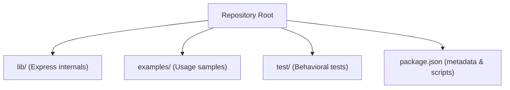

**Section sources**
- [package.json:1-100](file://package.json#L1-L100)
- [index.js:1-12](file://index.js#L1-L12)

## Core Components
This section outlines the essential production configuration topics and how they are reflected in the repository.

- Environment setup and NODE_ENV
  - The tests demonstrate that NODE_ENV influences view caching and defaults to development when unset. These behaviors are foundational for production hardening.
  - Reference: [test/app.js:74-120](file://test/app.js#L74-L120)

- Port management
  - Several examples show listening on a fixed port for demonstration. In production, bind to a port from an environment variable and configure reverse proxies/load balancers.
  - References:
    - [examples/hello-world/index.js:12-15](file://examples/hello-world/index.js#L12-L15)
    - [examples/mvc/index.js:91-95](file://examples/mvc/index.js#L91-L95)
    - [examples/error-pages/index.js:99-103](file://examples/error-pages/index.js#L99-L103)
    - [examples/error/index.js:49-53](file://examples/error/index.js#L49-L53)
    - [examples/cookies/index.js:49-53](file://examples/cookies/index.js#L49-L53)
    - [examples/session/index.js:33-37](file://examples/session/index.js#L33-L37)

- Logging configuration with Morgan
  - Morgan is used conditionally based on environment or test mode in multiple examples to log requests.
  - References:
    - [examples/mvc/index.js:34](file://examples/mvc/index.js#L34)
    - [examples/error-pages/index.js:26](file://examples/error-pages/index.js#L26)
    - [examples/cookies/index.js:13](file://examples/cookies/index.js#L13)

- Error handling setup
  - Examples illustrate both generic 404 handling and error-handling middleware with arity-4 signatures, plus explicit error propagation.
  - References:
    - [examples/error-pages/index.js:63-97](file://examples/error-pages/index.js#L63-L97)
    - [examples/error/index.js:14-47](file://examples/error/index.js#L14-L47)
    - [examples/web-service/index.js:96-111](file://examples/web-service/index.js#L96-L111)

- Security headers and policies
  - While Helmet is not imported in the repository examples, the tests and examples demonstrate awareness of environment-driven behavior and explicit disabling of verbose errors in production.
  - References:
    - [examples/error-pages/index.js:22-24](file://examples/error-pages/index.js#L22-L24)
    - [test/app.js:90-104](file://test/app.js#L90-L104)

- Input validation and sanitization
  - Body parsing middleware is used in examples; production should enforce limits and validation.
  - References:
    - [examples/mvc/index.js:47](file://examples/mvc/index.js#L47)
    - [examples/cookies/index.js:22](file://examples/cookies/index.js#L22)

- Compression, caching, and memory management
  - Compression and caching strategies are not shown in the repository examples; these should be configured in production deployments.
  - Static assets are served via Express middleware in examples.
  - References:
    - [examples/mvc/index.js:37](file://examples/mvc/index.js#L37)

**Section sources**
- [test/app.js:74-120](file://test/app.js#L74-L120)
- [examples/hello-world/index.js:12-15](file://examples/hello-world/index.js#L12-L15)
- [examples/mvc/index.js:34-95](file://examples/mvc/index.js#L34-L95)
- [examples/error-pages/index.js:22-24](file://examples/error-pages/index.js#L22-L24)
- [examples/error/index.js:14-47](file://examples/error/index.js#L14-L47)
- [examples/cookies/index.js:13](file://examples/cookies/index.js#L13)
- [examples/session/index.js:33-37](file://examples/session/index.js#L33-L37)
- [examples/web-service/index.js:96-111](file://examples/web-service/index.js#L96-L111)

## Architecture Overview
The following diagram maps how a production-ready Express application integrates environment configuration, middleware layers, logging, error handling, and deployment considerations.

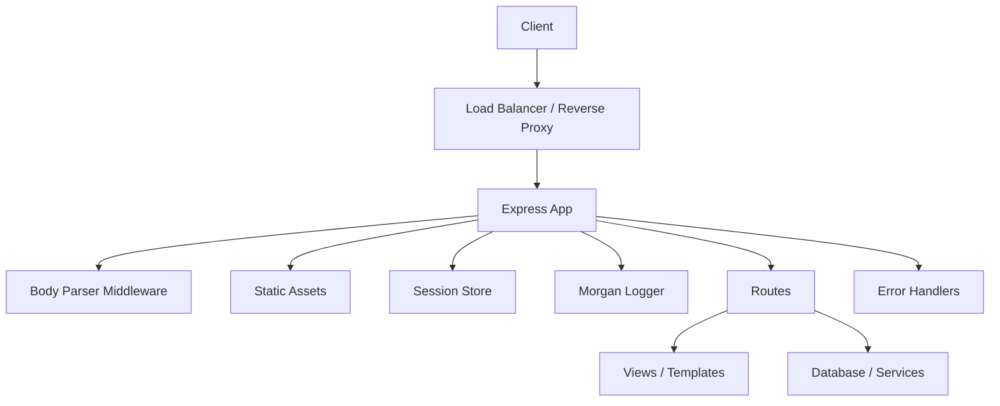

[No sources needed since this diagram shows conceptual workflow, not actual code structure]

## Detailed Component Analysis

### Environment Configuration and NODE_ENV
- Behavior
  - Development mode disables view cache; production enables it.
  - Unset NODE_ENV defaults to development.
- Practical implications
  - Set NODE_ENV=production in production environments.
  - Disable verbose error rendering in production.
- References:
  - [test/app.js:74-120](file://test/app.js#L74-L120)

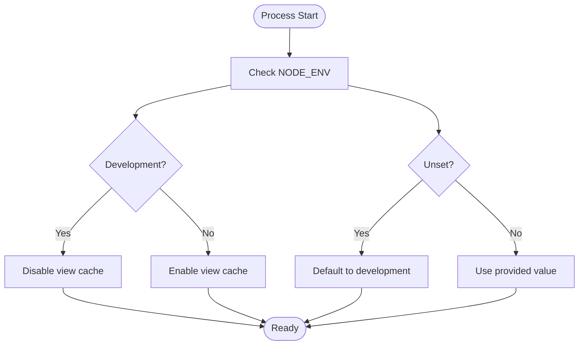

**Section sources**
- [test/app.js:74-120](file://test/app.js#L74-L120)

### Port Management and Process Binding
- Pattern
  - Examples listen on a fixed port for demos; production should read PORT from environment and configure proxies.
- References:
  - [examples/hello-world/index.js:12-15](file://examples/hello-world/index.js#L12-L15)
  - [examples/mvc/index.js:91-95](file://examples/mvc/index.js#L91-L95)
  - [examples/error-pages/index.js:99-103](file://examples/error-pages/index.js#L99-L103)
  - [examples/error/index.js:49-53](file://examples/error/index.js#L49-L53)
  - [examples/cookies/index.js:49-53](file://examples/cookies/index.js#L49-L53)
  - [examples/session/index.js:33-37](file://examples/session/index.js#L33-L37)

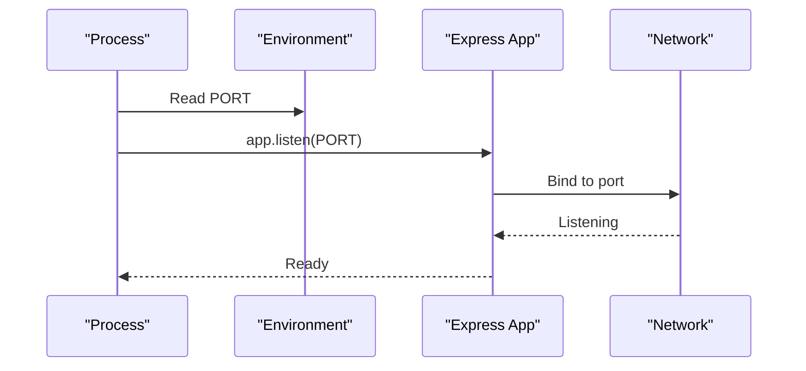

**Section sources**
- [examples/hello-world/index.js:12-15](file://examples/hello-world/index.js#L12-L15)
- [examples/mvc/index.js:91-95](file://examples/mvc/index.js#L91-L95)
- [examples/error-pages/index.js:99-103](file://examples/error-pages/index.js#L99-L103)
- [examples/error/index.js:49-53](file://examples/error/index.js#L49-L53)
- [examples/cookies/index.js:49-53](file://examples/cookies/index.js#L49-L53)
- [examples/session/index.js:33-37](file://examples/session/index.js#L33-L37)

### Logging with Morgan
- Pattern
  - Morgan is conditionally enabled based on environment or test mode.
- Production recommendation
  - Use structured logging and rotate logs in production.
- References:
  - [examples/mvc/index.js:34](file://examples/mvc/index.js#L34)
  - [examples/error-pages/index.js:26](file://examples/error-pages/index.js#L26)
  - [examples/cookies/index.js:13](file://examples/cookies/index.js#L13)

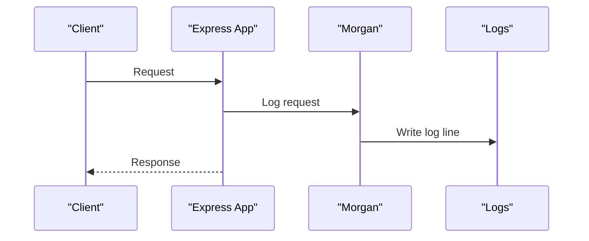

**Section sources**
- [examples/mvc/index.js:34](file://examples/mvc/index.js#L34)
- [examples/error-pages/index.js:26](file://examples/error-pages/index.js#L26)
- [examples/cookies/index.js:13](file://examples/cookies/index.js#L13)

### Error Handling Setup
- Pattern
  - 404 handling middleware and error-handling middleware with arity-4 signature.
  - Explicit error propagation via throw or next(new Error(...)).
- Production recommendation
  - Centralized error handler, avoid exposing stack traces in production, and ensure graceful degradation.
- References:
  - [examples/error-pages/index.js:63-97](file://examples/error-pages/index.js#L63-L97)
  - [examples/error/index.js:14-47](file://examples/error/index.js#L14-L47)
  - [examples/web-service/index.js:96-111](file://examples/web-service/index.js#L96-L111)

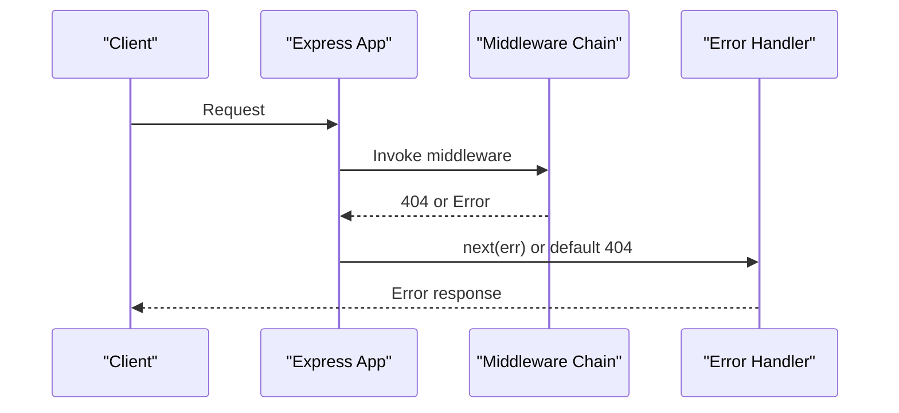

**Section sources**
- [examples/error-pages/index.js:63-97](file://examples/error-pages/index.js#L63-L97)
- [examples/error/index.js:14-47](file://examples/error/index.js#L14-L47)
- [examples/web-service/index.js:96-111](file://examples/web-service/index.js#L96-L111)

### Security Headers and Policies
- Pattern
  - Examples demonstrate environment-aware behavior and disabling verbose errors in production.
- Production recommendation
  - Integrate Helmet for CSP, HSTS, X-Frame-Options, etc.; configure CORS policy; sanitize inputs; validate and limit payload sizes.
- References:
  - [examples/error-pages/index.js:22-24](file://examples/error-pages/index.js#L22-L24)
  - [test/app.js:90-104](file://test/app.js#L90-L104)

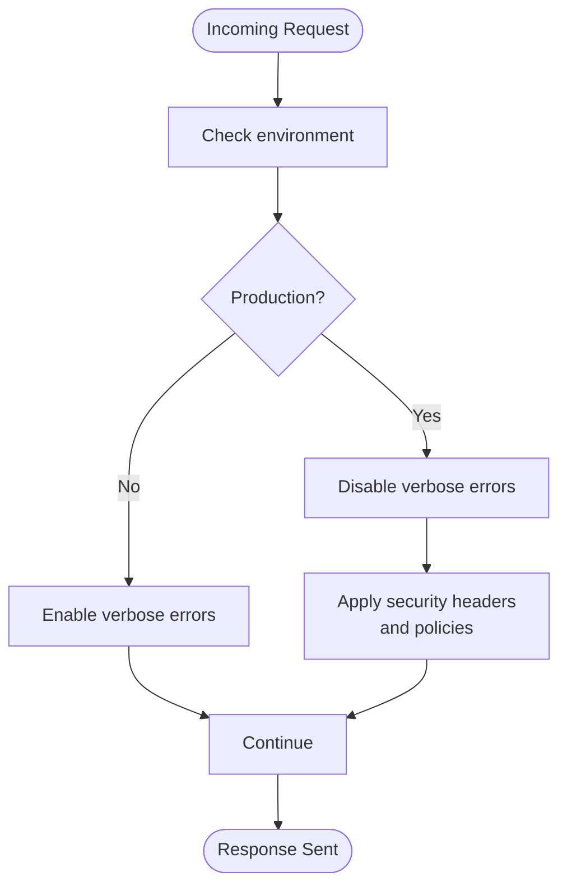

**Section sources**
- [examples/error-pages/index.js:22-24](file://examples/error-pages/index.js#L22-L24)
- [test/app.js:90-104](file://test/app.js#L90-L104)

### Input Validation and Body Parsing
- Pattern
  - Body parser middleware is used; examples include URL-encoded parsing.
- Production recommendation
  - Enforce size limits, whitelist content types, and apply validation libraries.
- References:
  - [examples/mvc/index.js:47](file://examples/mvc/index.js#L47)
  - [examples/cookies/index.js:22](file://examples/cookies/index.js#L22)

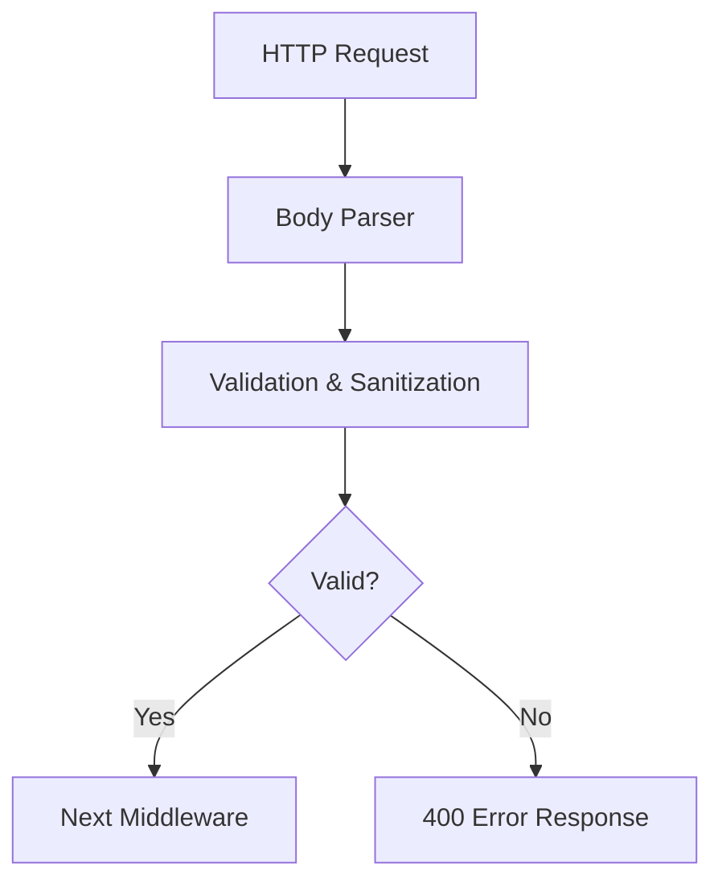

**Section sources**
- [examples/mvc/index.js:47](file://examples/mvc/index.js#L47)
- [examples/cookies/index.js:22](file://examples/cookies/index.js#L22)

### Sessions and Cookies
- Pattern
  - Session middleware is configured with resave/saveUninitialized toggles and a secret.
- Production recommendation
  - Use secure, sameSite, and httpOnly cookie flags; store sessions in Redis/Memcached; rotate secrets.
- References:
  - [examples/session/index.js:16-20](file://examples/session/index.js#L16-L20)
  - [examples/cookies/index.js:19](file://examples/cookies/index.js#L19)

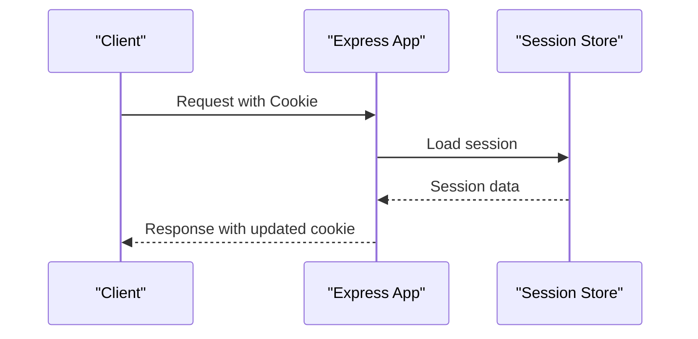

**Section sources**
- [examples/session/index.js:16-20](file://examples/session/index.js#L16-L20)
- [examples/cookies/index.js:19](file://examples/cookies/index.js#L19)

### Static Assets and Caching
- Pattern
  - Static files are served via Express middleware in examples.
- Production recommendation
  - Configure far-future caching headers, ETags, and CDN distribution.
- References:
  - [examples/mvc/index.js:37](file://examples/mvc/index.js#L37)

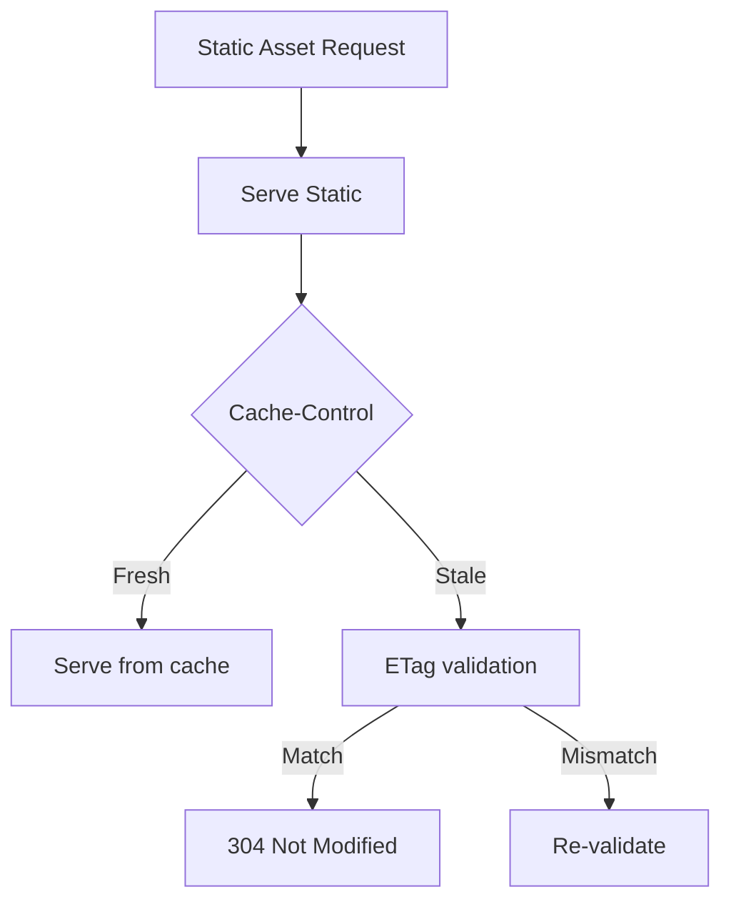

**Section sources**
- [examples/mvc/index.js:37](file://examples/mvc/index.js#L37)

## Dependency Analysis
The repository’s package metadata defines runtime and development dependencies. Understanding these helps assess production readiness and potential security updates.

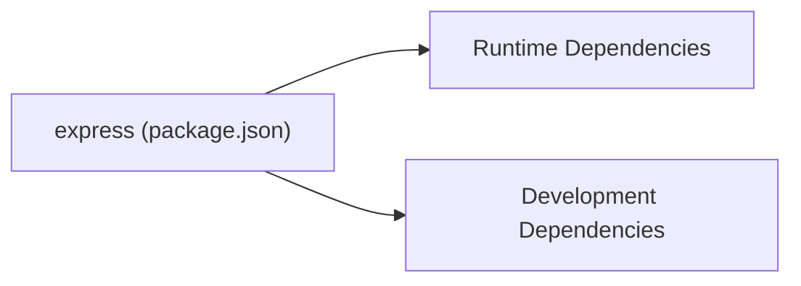

**Diagram sources**
- [package.json:34-81](file://package.json#L34-L81)

**Section sources**
- [package.json:34-81](file://package.json#L34-L81)

## Performance Considerations
- Compression
  - Not shown in examples; integrate gzip/brotli in production.
- Caching
  - Use cache-control headers, ETags, and CDN caching for static assets.
- Memory management
  - Monitor heap snapshots and tune garbage collection in long-running processes.
- Body parsing limits
  - Apply reasonable limits to prevent excessive memory usage.

[No sources needed since this section provides general guidance]

## Troubleshooting Guide
Common production pitfalls and their solutions:

- Incorrect NODE_ENV
  - Symptom: View cache not behaving as expected.
  - Fix: Set NODE_ENV=production in production and verify behavior.
  - Reference: [test/app.js:74-120](file://test/app.js#L74-L120)

- Verbose error messages in production
  - Symptom: Stack traces visible to clients.
  - Fix: Disable verbose errors in production.
  - Reference: [examples/error-pages/index.js:22-24](file://examples/error-pages/index.js#L22-L24)

- Missing error handling middleware
  - Symptom: Uncaught exceptions crash the server.
  - Fix: Add arity-4 error-handling middleware last.
  - References:
    - [examples/error-pages/index.js:63-97](file://examples/error-pages/index.js#L63-L97)
    - [examples/error/index.js:14-47](file://examples/error/index.js#L14-L47)

- Misconfigured port binding
  - Symptom: Application not reachable behind proxy.
  - Fix: Read PORT from environment and bind to 0.0.0.0 in containerized environments.
  - References:
    - [examples/hello-world/index.js:12-15](file://examples/hello-world/index.js#L12-L15)
    - [examples/mvc/index.js:91-95](file://examples/mvc/index.js#L91-L95)

- Excessive memory usage from large payloads
  - Symptom: Out-of-memory crashes.
  - Fix: Limit body sizes and apply validation.
  - References:
    - [examples/mvc/index.js:47](file://examples/mvc/index.js#L47)
    - [examples/cookies/index.js:22](file://examples/cookies/index.js#L22)

**Section sources**
- [test/app.js:74-120](file://test/app.js#L74-L120)
- [examples/error-pages/index.js:22-24](file://examples/error-pages/index.js#L22-L24)
- [examples/error-pages/index.js:63-97](file://examples/error-pages/index.js#L63-L97)
- [examples/error/index.js:14-47](file://examples/error/index.js#L14-L47)
- [examples/hello-world/index.js:12-15](file://examples/hello-world/index.js#L12-L15)
- [examples/mvc/index.js:91-95](file://examples/mvc/index.js#L91-L95)
- [examples/mvc/index.js:47](file://examples/mvc/index.js#L47)
- [examples/cookies/index.js:22](file://examples/cookies/index.js#L22)

## Conclusion
Production-grade Express applications require deliberate environment configuration, hardened error handling, secure defaults, and performance-conscious middleware choices. The repository demonstrates environment-aware behavior, logging, and error handling patterns that align with production needs. Extend these patterns with security headers, input validation, compression, and robust session management to achieve a resilient, secure, and performant system.

[No sources needed since this section summarizes without analyzing specific files]

## Appendices

### Practical Production Checklist
- Set NODE_ENV=production and verify view cache behavior
- Configure Morgan with appropriate log rotation
- Add error-handling middleware with arity-4 signature
- Disable verbose errors in production
- Enforce body parsing limits and validate inputs
- Secure cookies and sessions (sameSite, httpOnly, secure flags)
- Integrate Helmet and configure CORS policy
- Enable compression and optimize static asset caching
- Monitor memory usage and tune GC
- Use a reverse proxy/load balancer and bind to environment-provided port

[No sources needed since this section provides general guidance]