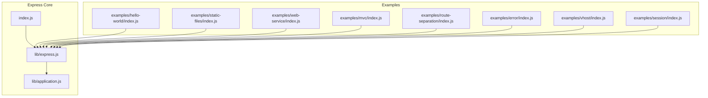
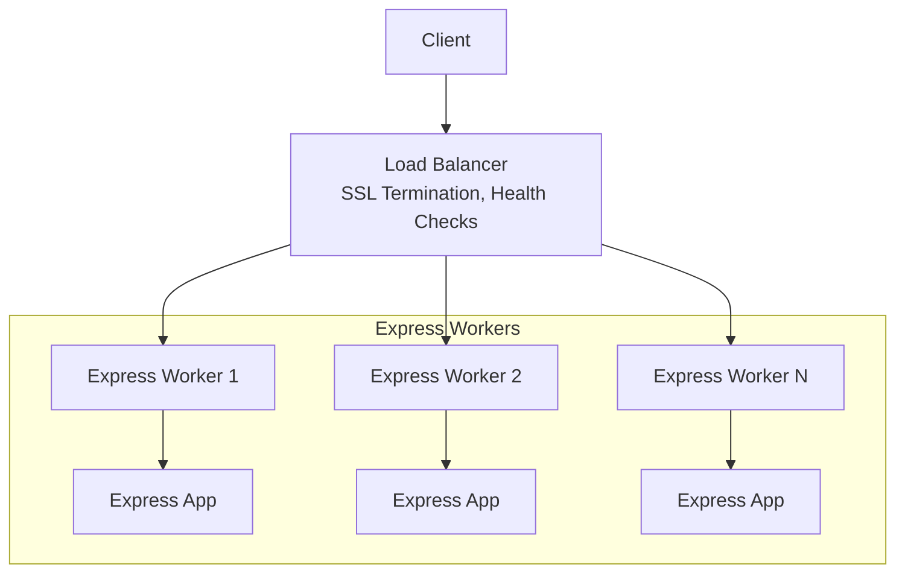
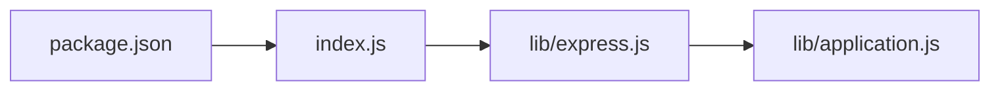

# Reverse Proxy & Load Balancing

<cite>
**Referenced Files in This Document**
- [package.json](file://package.json)
- [index.js](file://index.js)
- [lib/express.js](file://lib/express.js)
- [lib/application.js](file://lib/application.js)
- [examples/hello-world/index.js](file://examples/hello-world/index.js)
- [examples/static-files/index.js](file://examples/static-files/index.js)
- [examples/web-service/index.js](file://examples/web-service/index.js)
- [examples/mvc/index.js](file://examples/mvc/index.js)
- [examples/route-separation/index.js](file://examples/route-separation/index.js)
- [examples/error/index.js](file://examples/error/index.js)
- [examples/vhost/index.js](file://examples/vhost/index.js)
- [examples/session/index.js](file://examples/session/index.js)
</cite>

## Table of Contents
1. [Introduction](#introduction)
2. [Project Structure](#project-structure)
3. [Core Components](#core-components)
4. [Architecture Overview](#architecture-overview)
5. [Detailed Component Analysis](#detailed-component-analysis)
6. [Dependency Analysis](#dependency-analysis)
7. [Performance Considerations](#performance-considerations)
8. [Troubleshooting Guide](#troubleshooting-guide)
9. [Conclusion](#conclusion)
10. [Appendices](#appendices)

## Introduction
This document provides production-grade guidance for deploying Express.js applications behind a reverse proxy and load balancer. It covers SSL termination, static asset delivery, upstream clustering, load balancing algorithms, sticky sessions, health checks, WebSocket and long-polling support, and security hardening. While the repository demonstrates Express fundamentals, the guidance herein translates those concepts into robust, scalable deployment patterns suitable for production environments.

## Project Structure
The repository is organized around a core Express framework and a set of example applications that illustrate middleware usage, routing, sessions, static assets, virtual hosts, and error handling. These examples collectively demonstrate the building blocks needed to operate Express applications behind a reverse proxy and load balancer.

**Diagram sources**
- [index.js:1-12](file://index.js#L1-L12)
- [lib/express.js:1-82](file://lib/express.js#L1-L82)
- [lib/application.js:1-632](file://lib/application.js#L1-L632)
- [examples/hello-world/index.js:1-16](file://examples/hello-world/index.js#L1-L16)
- [examples/static-files/index.js:1-44](file://examples/static-files/index.js#L1-L44)
- [examples/web-service/index.js:1-118](file://examples/web-service/index.js#L1-L118)
- [examples/mvc/index.js:1-96](file://examples/mvc/index.js#L1-L96)
- [examples/route-separation/index.js:1-56](file://examples/route-separation/index.js#L1-L56)
- [examples/error/index.js:1-54](file://examples/error/index.js#L1-L54)
- [examples/vhost/index.js:1-54](file://examples/vhost/index.js#L1-L54)
- [examples/session/index.js:1-38](file://examples/session/index.js#L1-L38)

**Section sources**
- [index.js:1-12](file://index.js#L1-L12)
- [lib/express.js:1-82](file://lib/express.js#L1-L82)
- [lib/application.js:1-632](file://lib/application.js#L1-L632)
- [examples/hello-world/index.js:1-16](file://examples/hello-world/index.js#L1-L16)
- [examples/static-files/index.js:1-44](file://examples/static-files/index.js#L1-L44)
- [examples/web-service/index.js:1-118](file://examples/web-service/index.js#L1-L118)
- [examples/mvc/index.js:1-96](file://examples/mvc/index.js#L1-L96)
- [examples/route-separation/index.js:1-56](file://examples/route-separation/index.js#L1-L56)
- [examples/error/index.js:1-54](file://examples/error/index.js#L1-L54)
- [examples/vhost/index.js:1-54](file://examples/vhost/index.js#L1-L54)
- [examples/session/index.js:1-38](file://examples/session/index.js#L1-L38)

## Core Components
- Express initialization and application lifecycle: The framework exposes a factory to create an application instance and integrates middleware, routing, and HTTP server creation.
- Middleware stack: Examples demonstrate logging, static asset serving, session management, content negotiation, and error handling—patterns essential for proxy-friendly deployments.
- Routing and virtual hosts: Demonstrates mounting sub-applications and subdomain routing, useful for multi-tenant or microservice-like setups behind a reverse proxy.
- Sessions and stateful behavior: Shows session-based state storage, which impacts sticky session requirements in clustered environments.

Key implementation references:
- Application creation and middleware exposure: [lib/express.js:36-82](file://lib/express.js#L36-L82)
- HTTP server creation and request handling pipeline: [lib/application.js:598-606](file://lib/application.js#L598-L606), [lib/application.js:152-178](file://lib/application.js#L152-L178)
- Static file serving and middleware composition: [examples/static-files/index.js:22-36](file://examples/static-files/index.js#L22-L36)
- Session usage and stateful routes: [examples/session/index.js:16-31](file://examples/session/index.js#L16-L31)
- Virtual host routing: [examples/vhost/index.js:46-47](file://examples/vhost/index.js#L46-L47)

**Section sources**
- [lib/express.js:36-82](file://lib/express.js#L36-L82)
- [lib/application.js:598-606](file://lib/application.js#L598-L606)
- [lib/application.js:152-178](file://lib/application.js#L152-L178)
- [examples/static-files/index.js:22-36](file://examples/static-files/index.js#L22-L36)
- [examples/session/index.js:16-31](file://examples/session/index.js#L16-L31)
- [examples/vhost/index.js:46-47](file://examples/vhost/index.js#L46-L47)

## Architecture Overview
A production deployment pattern places multiple Express instances behind a reverse proxy/load balancer. The proxy handles SSL termination, static assets, compression, caching, and health checks, while distributing traffic to backend workers. For stateful apps, sticky sessions ensure session affinity.

[No sources needed since this diagram shows conceptual workflow, not actual code structure]

## Detailed Component Analysis

### Reverse Proxy Responsibilities
- SSL/TLS termination: Offload encryption/decryption to the proxy to reduce CPU overhead on workers.
- Static asset serving: Serve precompressed assets directly from the proxy to minimize worker load.
- Compression and caching: Apply gzip/brotli and cache-control headers at the proxy level.
- Request filtering and rate limiting: Enforce quotas and block malicious traffic before reaching workers.
- Health checks: Probe backend workers and remove unhealthy nodes from rotation.

These responsibilities align with Express’s middleware-first design, where static and session middleware are applied early in the pipeline.

**Section sources**
- [examples/static-files/index.js:22-36](file://examples/static-files/index.js#L22-L36)
- [examples/mvc/index.js:39-44](file://examples/mvc/index.js#L39-L44)

### Load Balancing Algorithms
- Round-robin: Distribute evenly across workers.
- Least connections: Prefer less busy workers.
- IP hash: Sticky distribution by client IP for stateless routing.
- Least time: Choose the fastest workers based on latency and throughput.

Operational notes:
- For stateful applications, enable sticky sessions to maintain session affinity.
- Use health probes to detect failures and drain connections gracefully.

[No sources needed since this section provides general guidance]

### Sticky Sessions for Stateful Applications
Stateful applications rely on server-side sessions. To preserve continuity across requests:
- Configure the load balancer to use a sticky cookie or client IP hashing.
- Ensure session storage is external (e.g., Redis) so any backend can serve the session.

References in the repository:
- Session middleware usage and regeneration: [examples/session/index.js:16-31](file://examples/session/index.js#L16-L31)

**Section sources**
- [examples/session/index.js:16-31](file://examples/session/index.js#L16-L31)

### Health Checks
Implement periodic health probes to detect failing workers:
- Use a dedicated endpoint returning a quick success status.
- Remove unhealthy nodes from rotation and re-add after recovery.

[No sources needed since this section provides general guidance]

### WebSocket and Long-Polling Support
- WebSocket upgrades: Ensure the proxy supports HTTP upgrade headers and persistent connections.
- Streaming endpoints: Configure timeouts and buffering appropriately for long-polling and streaming APIs.

[No sources needed since this section provides general guidance]

### Security Hardening
- Rate limiting: Limit requests per IP or per API key.
- Request filtering: Block suspicious patterns and enforce allowed methods/headers.
- DDoS protection: Integrate WAF or cloud-based protections at the edge.
- TLS best practices: Enforce modern cipher suites, SNI, and OCSP stapling at the proxy.

[No sources needed since this section provides general guidance]

### Practical Deployment Patterns
- Single Express app behind a proxy: Use static middleware for assets and route dynamic requests to the app.
- Multi-tenant or multi-service: Use virtual hosts or subpaths to separate domains/services; the proxy forwards to appropriate backend.
- API gateway pattern: Mount multiple Express services under shared middleware (logging, auth, rate limiting).

References:
- Virtual host routing: [examples/vhost/index.js:46-47](file://examples/vhost/index.js#L46-L47)
- Static asset serving: [examples/static-files/index.js:22-36](file://examples/static-files/index.js#L22-L36)
- Error handling middleware: [examples/error/index.js:47-47](file://examples/error/index.js#L47-L47)

**Section sources**
- [examples/vhost/index.js:46-47](file://examples/vhost/index.js#L46-L47)
- [examples/static-files/index.js:22-36](file://examples/static-files/index.js#L22-L36)
- [examples/error/index.js:47-47](file://examples/error/index.js#L47-L47)

## Dependency Analysis
Express’s modular design enables layered middleware and routing. The core exposes middleware constructors and integrates with a router, while examples demonstrate common patterns that map cleanly to proxy-friendly architectures.

**Diagram sources**
- [package.json:1-100](file://package.json#L1-L100)
- [index.js:1-12](file://index.js#L1-L12)
- [lib/express.js:1-82](file://lib/express.js#L1-L82)
- [lib/application.js:1-632](file://lib/application.js#L1-L632)

**Section sources**
- [package.json:34-62](file://package.json#L34-L62)
- [index.js:1-12](file://index.js#L1-L12)
- [lib/express.js:1-82](file://lib/express.js#L1-L82)
- [lib/application.js:1-632](file://lib/application.js#L1-L632)

## Performance Considerations
- Offload compression and static serving to the proxy.
- Use keep-alive and connection pooling at the proxy to reduce overhead.
- Tune buffer sizes and timeouts for streaming endpoints.
- Enable caching headers at the proxy for static assets.

[No sources needed since this section provides general guidance]

## Troubleshooting Guide
- Verify middleware order: Logging, static, session, routes, and error handlers should be registered in the correct sequence.
- Inspect request headers: Confirm X-Forwarded-* headers are set by the proxy for accurate client IPs and protocol detection.
- Monitor worker logs: Use structured logging to correlate proxy metrics with backend activity.
- Test upgrades: Validate WebSocket and long-polling endpoints under load.

References:
- Error handling middleware: [examples/error/index.js:47-47](file://examples/error/index.js#L47-L47)
- Static and session middleware: [examples/mvc/index.js:39-44](file://examples/mvc/index.js#L39-L44)

**Section sources**
- [examples/error/index.js:47-47](file://examples/error/index.js#L47-L47)
- [examples/mvc/index.js:39-44](file://examples/mvc/index.js#L39-L44)

## Conclusion
Deploying Express applications behind a reverse proxy and load balancer improves scalability, security, and operability. By terminating SSL at the edge, serving static assets efficiently, and applying health checks and rate limiting, you can achieve reliable, high-performance service delivery. For stateful applications, ensure sticky sessions and externalized session storage. The patterns demonstrated in the repository’s examples provide a solid foundation for building production-ready configurations.

[No sources needed since this section summarizes without analyzing specific files]

## Appendices
- Example Express app startup and listening: [examples/hello-world/index.js:12-15](file://examples/hello-world/index.js#L12-L15)
- Web service with API key validation and error handling: [examples/web-service/index.js:30-42](file://examples/web-service/index.js#L30-L42), [examples/web-service/index.js:98-103](file://examples/web-service/index.js#L98-L103)

**Section sources**
- [examples/hello-world/index.js:12-15](file://examples/hello-world/index.js#L12-L15)
- [examples/web-service/index.js:30-42](file://examples/web-service/index.js#L30-L42)
- [examples/web-service/index.js:98-103](file://examples/web-service/index.js#L98-L103)