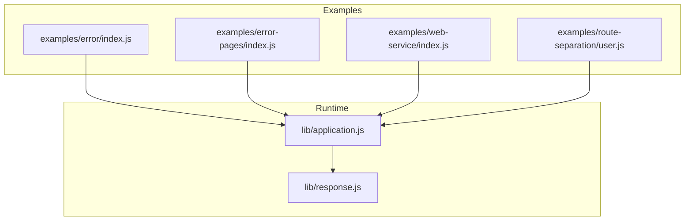
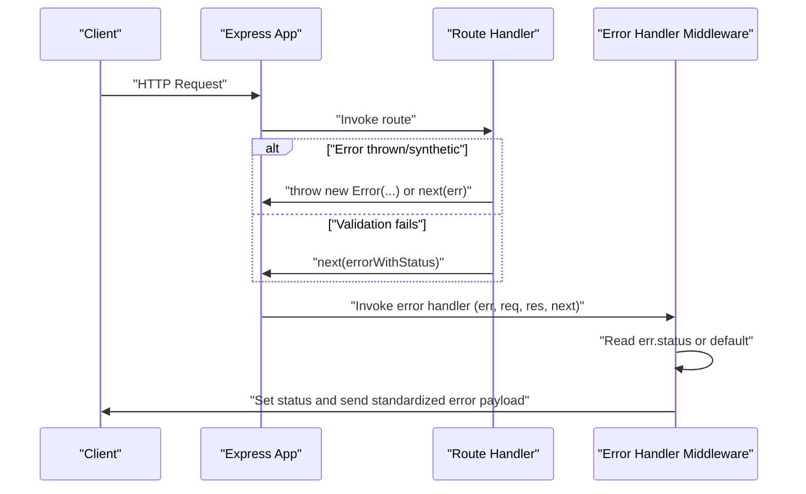
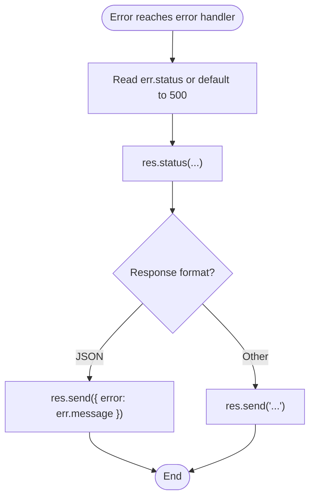
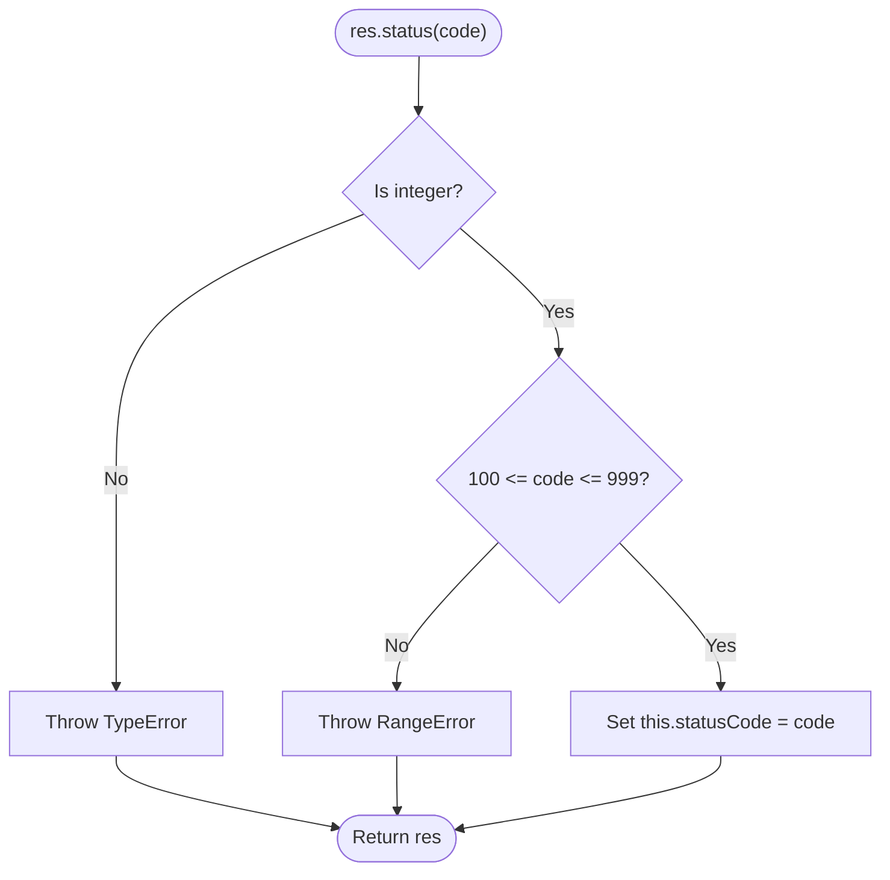
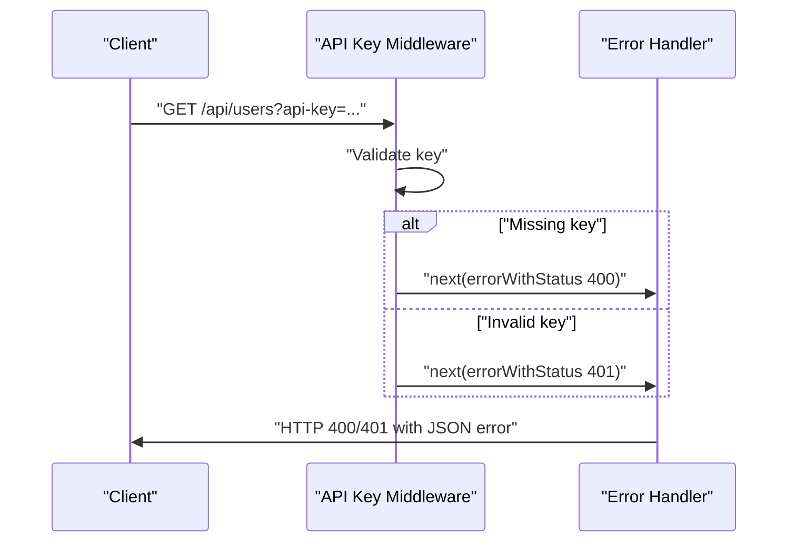
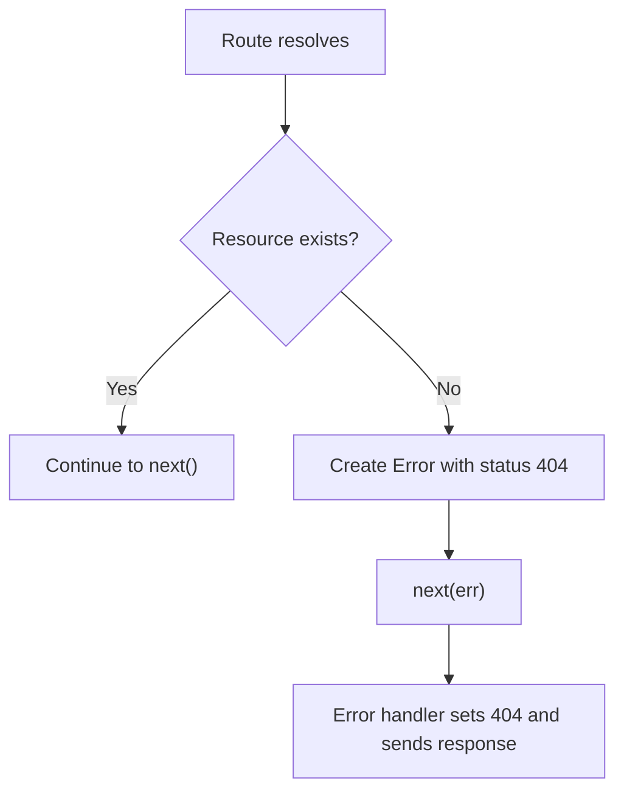

# Custom Error Types

<cite>
**Referenced Files in This Document**
- [index.js](file://examples/error/index.js)
- [index.js](file://examples/error-pages/index.js)
- [index.js](file://examples/web-service/index.js)
- [index.js](file://examples/route-separation/user.js)
- [application.js](file://lib/application.js)
- [response.js](file://lib/response.js)
- [express.json.js](file://test/express.json.js)
- [express.urlencoded.js](file://test/express.urlencoded.js)
</cite>

## Table of Contents
1. [Introduction](#introduction)
2. [Project Structure](#project-structure)
3. [Core Components](#core-components)
4. [Architecture Overview](#architecture-overview)
5. [Detailed Component Analysis](#detailed-component-analysis)
6. [Dependency Analysis](#dependency-analysis)
7. [Performance Considerations](#performance-considerations)
8. [Troubleshooting Guide](#troubleshooting-guide)
9. [Conclusion](#conclusion)

## Introduction
This document explains how to implement robust custom error types in Express.js applications. It covers creating custom error classes that extend the built-in Error, assigning HTTP status codes, formatting messages, encapsulating error data, and standardizing API error responses. It also demonstrates how Express routes and middleware propagate and handle errors, how the framework’s response helpers influence status codes, and how to integrate logging and standardized error payloads across applications.

## Project Structure
The repository includes multiple examples that demonstrate error propagation, custom error creation, and error-handling middleware. The core Express runtime exposes the application and response prototypes that drive error handling behavior.

**Diagram sources**
- [index.js:1-54](file://examples/error/index.js#L1-L54)
- [index.js:1-104](file://examples/error-pages/index.js#L1-L104)
- [index.js:1-118](file://examples/web-service/index.js#L1-L118)
- [index.js:1-48](file://examples/route-separation/user.js#L1-L48)
- [application.js:152-178](file://lib/application.js#L152-L178)
- [response.js:64-76](file://lib/response.js#L64-L76)

**Section sources**
- [index.js:1-54](file://examples/error/index.js#L1-L54)
- [index.js:1-104](file://examples/error-pages/index.js#L1-L104)
- [index.js:1-118](file://examples/web-service/index.js#L1-L118)
- [index.js:1-48](file://examples/route-separation/user.js#L1-L48)
- [application.js:152-178](file://lib/application.js#L152-L178)
- [response.js:64-76](file://lib/response.js#L64-L76)

## Core Components
- Custom error creation and propagation:
  - Creating errors with a status property and passing them to next() is demonstrated in multiple examples.
  - Examples include throwing synchronous errors, passing asynchronous errors via next(), and setting custom status codes on Error instances.
- Error-handling middleware:
  - Express recognizes four-argument middleware functions as error handlers.
  - These handlers read err.status and set appropriate HTTP status codes on responses.
- Response status handling:
  - The response.status() method validates numeric status codes and throws when invalid.
  - The response.sendStatus() method sets a standard message derived from the status code.

Key implementation references:
- Error creation and propagation in examples
- Error handler middleware signatures and usage
- Response status validation and standard messages

**Section sources**
- [index.js:20-47](file://examples/error/index.js#L20-L47)
- [index.js:41-97](file://examples/error-pages/index.js#L41-L97)
- [index.js:15-103](file://examples/web-service/index.js#L15-L103)
- [index.js:14-24](file://examples/route-separation/user.js#L14-L24)
- [response.js:64-76](file://lib/response.js#L64-L76)
- [response.js:321-328](file://lib/response.js#L321-L328)

## Architecture Overview
The error lifecycle in Express follows a predictable flow: route handlers either throw or call next() with an error object; Express routes the error to error-handling middleware; the error handler sets the HTTP status and returns a standardized response.

**Diagram sources**
- [index.js:29-41](file://examples/error/index.js#L29-L41)
- [index.js:41-97](file://examples/error-pages/index.js#L41-L97)
- [index.js:98-103](file://examples/web-service/index.js#L98-L103)
- [application.js:152-178](file://lib/application.js#L152-L178)

## Detailed Component Analysis

### Custom Error Creation Patterns
- Constructing errors with a .status property:
  - Demonstrated in the web service example where a helper creates an Error and assigns a status.
  - Used to signal HTTP client errors (e.g., 400, 401) during API key validation.
- Throwing synchronous errors:
  - Shown in the basic error example where a route handler throws an Error directly.
- Passing asynchronous errors:
  - Demonstrated by invoking next(new Error(...)) inside an async callback.

Practical implications:
- Keep .status meaningful and aligned with HTTP semantics.
- Use next(err) to propagate errors to centralized handlers.

**Section sources**
- [index.js:15-19](file://examples/web-service/index.js#L15-L19)
- [index.js:30-42](file://examples/web-service/index.js#L30-L42)
- [index.js:29-41](file://examples/error/index.js#L29-L41)

### Error-Handling Middleware and Status Assignment
- Error handlers are identified by arity (four parameters).
- They inspect err.status and set the response status accordingly.
- They return a standardized error payload (e.g., JSON object with an error field).

**Diagram sources**
- [index.js:98-103](file://examples/web-service/index.js#L98-L103)
- [index.js:91-97](file://examples/error-pages/index.js#L91-L97)

**Section sources**
- [index.js:98-103](file://examples/web-service/index.js#L98-L103)
- [index.js:91-97](file://examples/error-pages/index.js#L91-L97)

### Response Status Validation and Standard Messages
- The response.status() method enforces numeric status codes within a valid range and throws descriptive errors for invalid inputs.
- The response.sendStatus() method sets a standard message based on the status code.

**Diagram sources**
- [response.js:64-76](file://lib/response.js#L64-L76)

**Section sources**
- [response.js:64-76](file://lib/response.js#L64-L76)
- [response.js:321-328](file://lib/response.js#L321-L328)

### Domain-Specific Error Types and Encapsulation
- Domain errors can be modeled by attaching domain-specific metadata to the error object (e.g., type, code, details).
- Tests demonstrate attaching custom properties like type and status to errors for richer error reporting.

Best practices:
- Define a consistent error envelope (e.g., { error, code, details }).
- Use err.type to categorize errors for downstream consumers.
- Use err.status to control HTTP responses.

**Section sources**
- [express.json.js:430-445](file://test/express.json.js#L430-L445)
- [express.urlencoded.js:544-559](file://test/express.urlencoded.js#L544-L559)

### Practical Examples

#### Validation Error Handling
- API key validation sets err.status to 400 or 401 and passes the error to the error handler.
- The error handler reads err.status and returns a JSON error payload.

**Diagram sources**
- [index.js:30-42](file://examples/web-service/index.js#L30-L42)
- [index.js:98-103](file://examples/web-service/index.js#L98-L103)

**Section sources**
- [index.js:30-42](file://examples/web-service/index.js#L30-L42)
- [index.js:98-103](file://examples/web-service/index.js#L98-L103)

#### Route-Level 404 Handling
- A route handler sets err.status to 404 and passes it to the error handler.
- Alternatively, a 404 handler can be placed last to catch unmatched routes.

**Diagram sources**
- [index.js:14-24](file://examples/route-separation/user.js#L14-L24)
- [index.js:63-77](file://examples/error-pages/index.js#L63-L77)

**Section sources**
- [index.js:14-24](file://examples/route-separation/user.js#L14-L24)
- [index.js:63-77](file://examples/error-pages/index.js#L63-L77)

#### Error Pages and Content Negotiation
- The error-pages example demonstrates content negotiation for 404 and 500 responses, including HTML, JSON, and text variants.
- It also shows how to conditionally enable verbose error details based on environment.

**Section sources**
- [index.js:63-97](file://examples/error-pages/index.js#L63-L97)

## Dependency Analysis
The error handling flow depends on the Express application handle loop and response helpers.

**Diagram sources**
- [application.js:152-178](file://lib/application.js#L152-L178)
- [response.js:64-76](file://lib/response.js#L64-L76)
- [response.js:232-246](file://lib/response.js#L232-L246)
- [response.js:321-328](file://lib/response.js#L321-L328)

**Section sources**
- [application.js:152-178](file://lib/application.js#L152-L178)
- [response.js:64-76](file://lib/response.js#L64-L76)
- [response.js:232-246](file://lib/response.js#L232-L246)
- [response.js:321-328](file://lib/response.js#L321-L328)

## Performance Considerations
- Prefer attaching minimal error metadata to avoid large payloads.
- Centralize error handling to reduce branching and improve consistency.
- Avoid expensive operations in error paths; keep error responses lean.

## Troubleshooting Guide
Common issues and resolutions:
- Invalid status code in res.status():
  - Symptom: RangeError or TypeError when setting status.
  - Resolution: Ensure the status is an integer within 100–999.
- Missing err.status in error handlers:
  - Symptom: Unexpected 500 responses.
  - Resolution: Always set err.status for client-side errors; default to 500 for unhandled server errors.
- Asynchronous errors not handled:
  - Symptom: UncaughtException or unhandled error in Promise.
  - Resolution: Wrap async code and call next(err) on errors; ensure error handlers are registered after routes.
- Logging integration:
  - Use the application’s internal logging hook to capture error stacks in development environments.

**Section sources**
- [response.js:64-76](file://lib/response.js#L64-L76)
- [application.js:615-618](file://lib/application.js#L615-L618)
- [index.js:20-27](file://examples/error/index.js#L20-L27)

## Conclusion
Express provides a flexible and powerful error model: create Error instances, attach .status and other metadata, and propagate them to centralized error-handling middleware. The response helpers enforce valid status codes and provide standard messages. By adopting consistent error envelopes and handlers, teams can achieve standardized, observable, and maintainable error responses across applications.