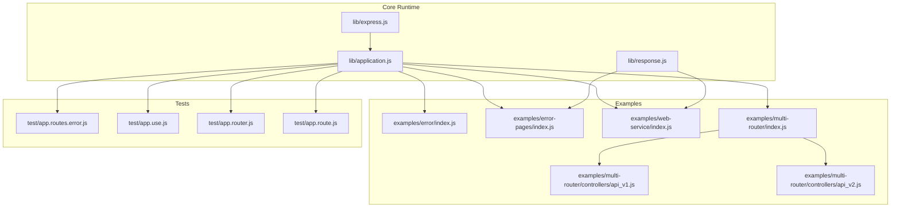
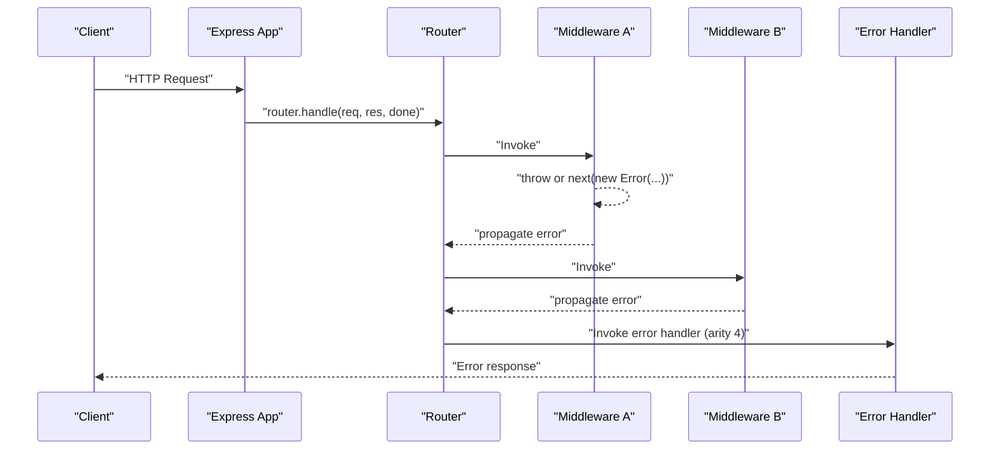
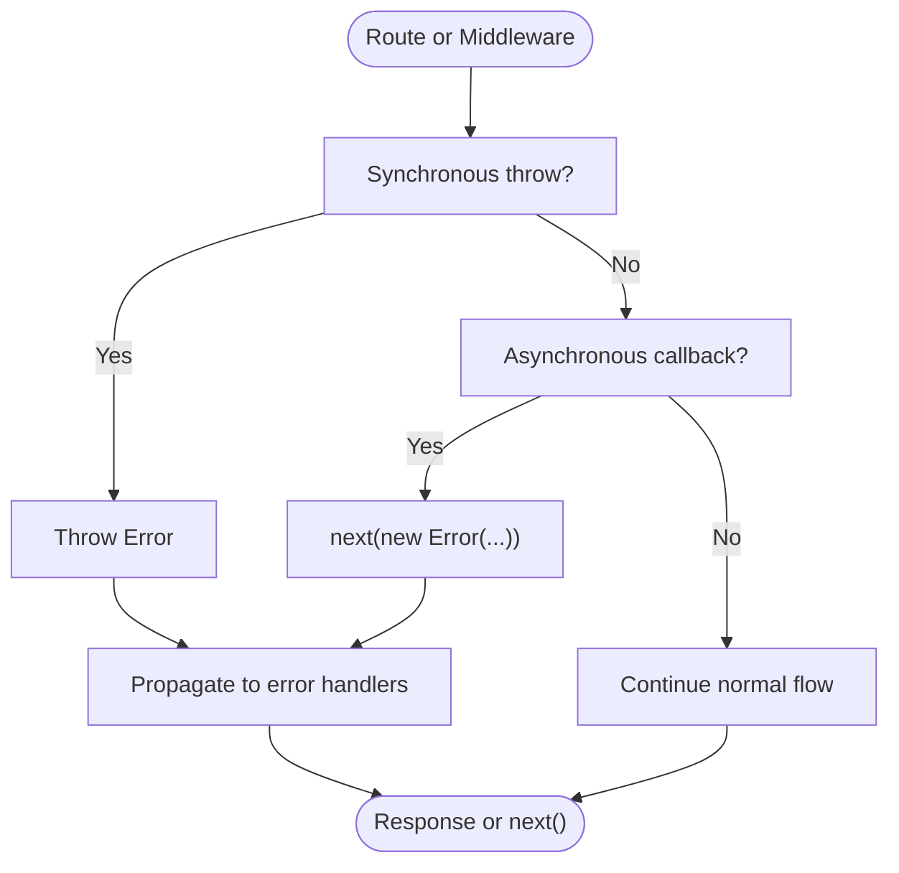
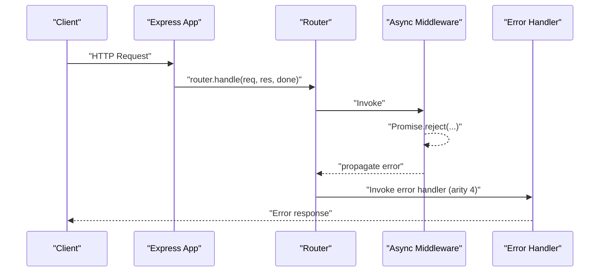
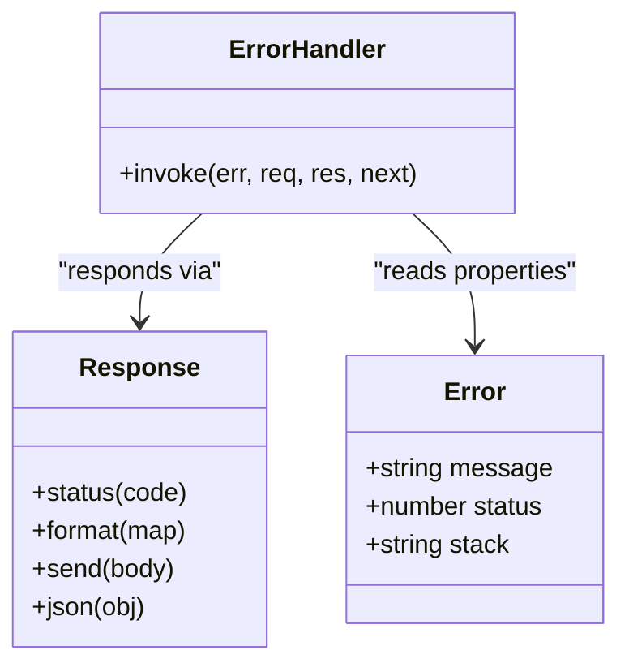
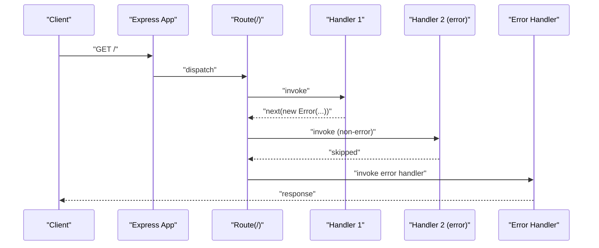
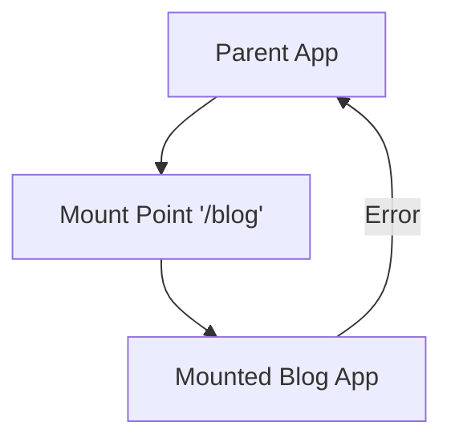
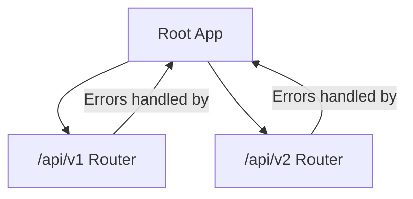
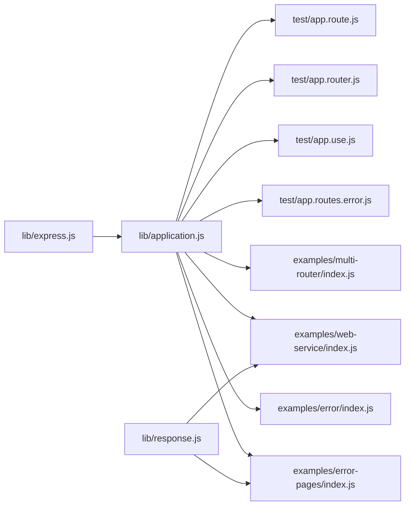

# Error Handling Patterns

<cite>
**Referenced Files in This Document**
- [index.js](file://examples/error/index.js)
- [index.js](file://examples/error-pages/index.js)
- [index.js](file://examples/web-service/index.js)
- [index.js](file://examples/multi-router/index.js)
- [api_v1.js](file://examples/multi-router/controllers/api_v1.js)
- [api_v2.js](file://examples/multi-router/controllers/api_v2.js)
- [application.js](file://lib/application.js)
- [express.js](file://lib/express.js)
- [response.js](file://lib/response.js)
- [app.routes.error.js](file://test/app.routes.error.js)
- [app.use.js](file://test/app.use.js)
- [app.router.js](file://test/app.router.js)
- [app.route.js](file://test/app.route.js)
- [500.ejs](file://examples/error-pages/views/500.ejs)
</cite>

## Table of Contents
1. [Introduction](#introduction)
2. [Project Structure](#project-structure)
3. [Core Components](#core-components)
4. [Architecture Overview](#architecture-overview)
5. [Detailed Component Analysis](#detailed-component-analysis)
6. [Dependency Analysis](#dependency-analysis)
7. [Performance Considerations](#performance-considerations)
8. [Troubleshooting Guide](#troubleshooting-guide)
9. [Conclusion](#conclusion)
10. [Appendices](#appendices)

## Introduction
This document explains Express.js error handling patterns with a focus on how errors propagate synchronously and asynchronously through middleware chains. It covers the standard error-first callback pattern, Promise rejection handling, error object structure and classification, and how errors bubble to error-handling middleware. Practical examples demonstrate route handler errors, middleware errors, and async operation failures. It also addresses error handling in nested routes, sub-applications, and mounted applications, and provides best practices for development versus production environments.

## Project Structure
The repository includes:
- Core runtime and middleware plumbing in lib/
- Example applications demonstrating error handling patterns in examples/
- Tests validating error propagation and middleware behavior in test/

**Diagram sources**
- [application.js:152-178](file://lib/application.js#L152-L178)
- [express.js:36-56](file://lib/express.js#L36-L56)
- [response.js:569-594](file://lib/response.js#L569-L594)
- [index.js:1-54](file://examples/error/index.js#L1-L54)
- [index.js:1-104](file://examples/error-pages/index.js#L1-L104)
- [index.js:96-117](file://examples/web-service/index.js#L96-L117)
- [index.js:1-19](file://examples/multi-router/index.js#L1-L19)
- [api_v1.js:1-16](file://examples/multi-router/controllers/api_v1.js#L1-L16)
- [api_v2.js:1-16](file://examples/multi-router/controllers/api_v2.js#L1-L16)
- [app.routes.error.js:1-63](file://test/app.routes.error.js#L1-L63)
- [app.use.js:1-543](file://test/app.use.js#L1-L543)
- [app.router.js:922-1107](file://test/app.router.js#L922-L1107)
- [app.route.js:59-197](file://test/app.route.js#L59-L197)

**Section sources**
- [application.js:152-178](file://lib/application.js#L152-L178)
- [express.js:36-56](file://lib/express.js#L36-L56)
- [response.js:569-594](file://lib/response.js#L569-L594)
- [index.js:1-54](file://examples/error/index.js#L1-L54)
- [index.js:1-104](file://examples/error-pages/index.js#L1-L104)
- [index.js:96-117](file://examples/web-service/index.js#L96-L117)
- [index.js:1-19](file://examples/multi-router/index.js#L1-L19)
- [api_v1.js:1-16](file://examples/multi-router/controllers/api_v1.js#L1-L16)
- [api_v2.js:1-16](file://examples/multi-router/controllers/api_v2.js#L1-L16)
- [app.routes.error.js:1-63](file://test/app.routes.error.js#L1-L63)
- [app.use.js:1-543](file://test/app.use.js#L1-L543)
- [app.router.js:922-1107](file://test/app.router.js#L922-L1107)
- [app.route.js:59-197](file://test/app.route.js#L59-L197)

## Core Components
- Error-handling middleware signature: four-arity (err, req, res, next). These are invoked only when an error is passed to next(err) or thrown synchronously, or when a rejected Promise propagates through the chain.
- Standard error-first callback pattern: synchronous throws and next(new Error(...)) propagate errors to error-handling middleware.
- Promise rejection handling: returning Promise.reject(...) or throwing/rejecting within async code triggers error propagation to error-handling middleware.
- Error object structure: typically includes message and optional numeric status (e.g., err.status). Response helpers like res.format() and res.status() are used to classify and respond to errors.
- Final error fallback: when no error handler responds, Express invokes a default final handler that logs and responds based on environment settings.

Key behaviors validated by tests:
- Route-level error handlers are invoked when an error is propagated within the same route.
- Promise rejections are handled consistently across route and router middleware.
- Mounted sub-applications preserve error propagation semantics and can be error-handled independently.

**Section sources**
- [application.js:152-178](file://lib/application.js#L152-L178)
- [application.js:615-618](file://lib/application.js#L615-L618)
- [response.js:64-76](file://lib/response.js#L64-L76)
- [response.js:569-594](file://lib/response.js#L569-L594)
- [app.routes.error.js:25-60](file://test/app.routes.error.js#L25-L60)
- [app.router.js:965-1095](file://test/app.router.js#L965-L1095)
- [app.route.js:65-197](file://test/app.route.js#L65-L197)

## Architecture Overview
Express’s error handling pipeline:
- app.handle(req, res, callback) delegates to the internal router and sets up a final handler when none is provided.
- Middleware and route handlers are invoked in order. Errors are passed to the next error-handling middleware with arity 4.
- Error-handling middleware can either respond immediately or continue propagation by calling next(err).
- Mounted sub-applications wrap their error propagation so that errors bubble to the parent app’s error handlers.

**Diagram sources**
- [application.js:152-178](file://lib/application.js#L152-L178)
- [index.js:20-47](file://examples/error/index.js#L20-L47)
- [app.use.js:21-123](file://test/app.use.js#L21-L123)

**Section sources**
- [application.js:152-178](file://lib/application.js#L152-L178)
- [index.js:20-47](file://examples/error/index.js#L20-L47)
- [app.use.js:21-123](file://test/app.use.js#L21-L123)

## Detailed Component Analysis

### Error-First Callback Pattern
- Synchronous errors: Throwing inside a route handler or middleware propagates to error-handling middleware.
- Asynchronous errors: Using next(new Error(...)) inside callbacks, timers, or I/O completion handlers propagates errors similarly.
- Placement matters: Error handlers must be registered after routes and other middleware to receive errors from them.

**Diagram sources**
- [index.js:29-42](file://examples/error/index.js#L29-L42)
- [app.routes.error.js:9-23](file://test/app.routes.error.js#L9-L23)

**Section sources**
- [index.js:29-42](file://examples/error/index.js#L29-L42)
- [app.routes.error.js:9-23](file://test/app.routes.error.js#L9-L23)

### Promise Rejection Handling
- Returning Promise.reject(...) or rejecting within async code causes Express to treat it as an error and invoke error-handling middleware.
- Resolved promises do not trigger error handlers; only rejections propagate.
- Error handlers can themselves return rejected promises to continue propagation.

**Diagram sources**
- [app.router.js:965-1095](file://test/app.router.js#L965-L1095)
- [app.route.js:65-197](file://test/app.route.js#L65-L197)

**Section sources**
- [app.router.js:965-1095](file://test/app.router.js#L965-L1095)
- [app.route.js:65-197](file://test/app.route.js#L65-L197)

### Error Object Structure and Classification
- Typical properties: message and optional numeric status (e.g., err.status).
- Response helpers: res.status() validates and sets status; res.format() selects response content type and can trigger 406 when no match is found.
- Template-driven error pages: error templates can conditionally render verbose error details based on app settings.

**Diagram sources**
- [response.js:64-76](file://lib/response.js#L64-L76)
- [response.js:569-594](file://lib/response.js#L569-L594)
- [index.js:91-97](file://examples/error-pages/index.js#L91-L97)
- [500.ejs:1-8](file://examples/error-pages/views/500.ejs#L1-L8)

**Section sources**
- [response.js:64-76](file://lib/response.js#L64-L76)
- [response.js:569-594](file://lib/response.js#L569-L594)
- [index.js:91-97](file://examples/error-pages/index.js#L91-L97)
- [500.ejs:1-8](file://examples/error-pages/views/500.ejs#L1-L8)

### Nested Routes and Same-Route Error Handlers
- Within a single route definition, multiple handlers can be chained. When an error is propagated, only subsequent error-handling callbacks (with arity 4) in that route are invoked.
- Tests confirm that non-error route handlers are skipped when an error is encountered earlier in the same route.

**Diagram sources**
- [app.routes.error.js:25-60](file://test/app.routes.error.js#L25-L60)

**Section sources**
- [app.routes.error.js:25-60](file://test/app.routes.error.js#L25-L60)

### Mounted Applications and Sub-Applications
- Mounted apps are wrapped so that their error propagation bubbles to the parent app’s error handlers.
- Tests demonstrate mounting sub-apps at different paths and verifying that error propagation works across mount boundaries.

**Diagram sources**
- [application.js:225-241](file://lib/application.js#L225-L241)
- [app.use.js:21-123](file://test/app.use.js#L21-L123)

**Section sources**
- [application.js:225-241](file://lib/application.js#L225-L241)
- [app.use.js:21-123](file://test/app.use.js#L21-L123)

### Multi-Router and Multi-Version APIs
- Sub-applications can be mounted under different versioned paths (e.g., /api/v1, /api/v2).
- Each sub-application can define its own error handling middleware to tailor responses for that version.

**Diagram sources**
- [index.js:7-8](file://examples/multi-router/index.js#L7-L8)
- [api_v1.js:1-16](file://examples/multi-router/controllers/api_v1.js#L1-L16)
- [api_v2.js:1-16](file://examples/multi-router/controllers/api_v2.js#L1-L16)

**Section sources**
- [index.js:7-8](file://examples/multi-router/index.js#L7-L8)
- [api_v1.js:1-16](file://examples/multi-router/controllers/api_v1.js#L1-L16)
- [api_v2.js:1-16](file://examples/multi-router/controllers/api_v2.js#L1-L16)

## Dependency Analysis
- Express application initialization and middleware registration are defined in lib/express.js and lib/application.js.
- Response helpers in lib/response.js integrate with error handling via status codes and content negotiation.
- Tests validate error propagation across routes, routers, and mounted applications.

**Diagram sources**
- [express.js:36-56](file://lib/express.js#L36-L56)
- [application.js:190-244](file://lib/application.js#L190-L244)
- [response.js:569-594](file://lib/response.js#L569-L594)
- [index.js:1-54](file://examples/error/index.js#L1-L54)
- [index.js:1-104](file://examples/error-pages/index.js#L1-L104)
- [index.js:96-117](file://examples/web-service/index.js#L96-L117)
- [index.js:1-19](file://examples/multi-router/index.js#L1-L19)
- [app.routes.error.js:1-63](file://test/app.routes.error.js#L1-L63)
- [app.use.js:1-543](file://test/app.use.js#L1-L543)
- [app.router.js:922-1107](file://test/app.router.js#L922-L1107)
- [app.route.js:59-197](file://test/app.route.js#L59-L197)

**Section sources**
- [express.js:36-56](file://lib/express.js#L36-L56)
- [application.js:190-244](file://lib/application.js#L190-L244)
- [response.js:569-594](file://lib/response.js#L569-L594)
- [index.js:1-54](file://examples/error/index.js#L1-L54)
- [index.js:1-104](file://examples/error-pages/index.js#L1-L104)
- [index.js:96-117](file://examples/web-service/index.js#L96-L117)
- [index.js:1-19](file://examples/multi-router/index.js#L1-L19)
- [app.routes.error.js:1-63](file://test/app.routes.error.js#L1-L63)
- [app.use.js:1-543](file://test/app.use.js#L1-L543)
- [app.router.js:922-1107](file://test/app.router.js#L922-L1107)
- [app.route.js:59-197](file://test/app.route.js#L59-L197)

## Performance Considerations
- Prefer minimal logging in error handlers in production to avoid overhead.
- Avoid heavy synchronous computations in error paths; delegate to asynchronous tasks when needed.
- Use appropriate status codes to prevent unnecessary retries or client-side confusion.
- Keep error-handling middleware lean and deterministic to minimize latency during error scenarios.

## Troubleshooting Guide
Common issues and resolutions:
- Error handler not firing:
  - Ensure the error handler is registered after routes and middleware.
  - Verify that errors are passed to next(new Error(...)) or thrown, not silently ignored.
- 404 vs 500 confusion:
  - Use a dedicated 404 handler after all routes to distinguish missing routes from unhandled errors.
  - Ensure error handlers set appropriate status codes using res.status().
- Verbose vs concise error messages:
  - In development, enable verbose error settings to include stack traces.
  - In production, disable verbose errors to avoid leaking sensitive information.
- Mounted app errors:
  - Confirm that the mounted app’s error handlers are registered and that the parent app’s error handlers are invoked when needed.

**Section sources**
- [index.js:63-97](file://examples/error-pages/index.js#L63-L97)
- [index.js:17-24](file://examples/error-pages/index.js#L17-L24)
- [index.js:44-47](file://examples/error/index.js#L44-L47)
- [response.js:64-76](file://lib/response.js#L64-L76)
- [app.use.js:21-123](file://test/app.use.js#L21-L123)

## Conclusion
Express error handling centers on a predictable middleware chain where errors propagate to four-arity error handlers. Both synchronous throws and Promise rejections are supported, and mounted sub-applications integrate seamlessly into the error propagation model. Proper placement of error handlers, accurate status code setting, and environment-aware error messaging are essential for robust applications.

## Appendices

### Best Practices: Development vs Production
- Development:
  - Enable verbose error rendering and logging.
  - Use detailed status messages and stack traces for quick debugging.
- Production:
  - Disable verbose errors and sanitize error responses.
  - Centralize error logging and monitoring.
  - Return generic error messages to clients while preserving detailed logs server-side.

**Section sources**
- [index.js:17-24](file://examples/error-pages/index.js#L17-L24)
- [500.ejs:1-8](file://examples/error-pages/views/500.ejs#L1-L8)